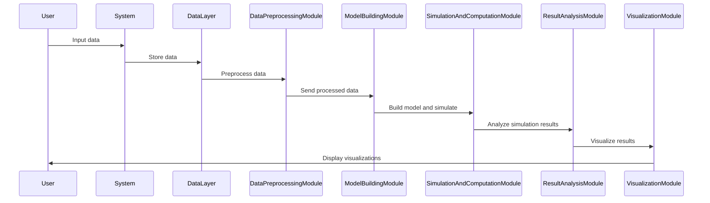
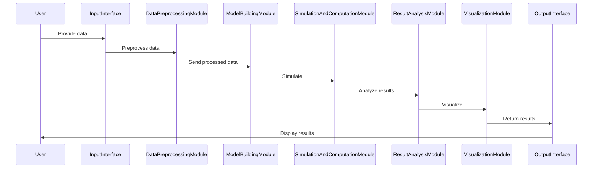

                 

## 数学在多维宇宙理论中的应用

### 关键词
- 多维宇宙理论
- 数学方法
- 引力与量子力学
- 黎曼几何
- 数学公式

### 摘要
本文旨在探讨数学在多维宇宙理论中的应用。通过介绍多维宇宙理论的背景和数学在其中的作用，我们将深入探讨核心数学概念与原理，展示数学模型在高维宇宙现象中的实际应用。同时，我们还将分析数学在实验与观测中的重要性，展望未来数学在多维宇宙研究中的发展趋势。本文的目标是帮助读者理解数学在多维宇宙理论中的关键角色，并激发对这一前沿领域的兴趣。

### 引言

多维宇宙理论是现代物理学中的一个重要研究方向，它提出了宇宙可能存在于多个空间维度中的概念。传统物理学认为宇宙是由三个空间维度和一个时间维度组成的，但多维宇宙理论引入了额外的空间维度，从而扩展了我们的宇宙观。这一理论不仅为解释一些观测现象提供了新的视角，还为探索宇宙的本质和起源提供了新的可能性。

数学在多维宇宙理论中扮演着不可或缺的角色。数学作为描述自然现象和解决科学问题的工具，为多维宇宙理论的研究提供了强有力的支持。数学工具和方法不仅用于描述和解释高维空间的几何特性，还用于建立和验证多维宇宙中的物理模型。本文将详细探讨数学在多维宇宙理论中的应用，通过逐步分析数学概念、原理和模型，帮助读者深入理解这一前沿领域。

### 第1章：多维宇宙理论背景

#### 1.1 多维宇宙理论概述

多维宇宙理论起源于对宇宙结构和性质的深入探讨。传统物理学认为宇宙是由三个空间维度和一个时间维度组成的四维时空。然而，随着对宇宙的认识不断深入，科学家们开始提出是否存在额外的空间维度。这些额外的维度可能对我们无法观测到的现象提供新的解释。

多维宇宙理论的基本假设是宇宙存在多个空间维度，这些维度可能与我们日常感知的三维空间不同。额外的维度可能以紧凑的形式存在，无法直接观测，但它们对宇宙中的物理现象有显著影响。例如，超弦理论提出，宇宙可能存在多达11个维度，其中六个维度紧凑卷曲在空间中，而其余五个维度则扩展成我们熟悉的空间。

#### 1.2 数学在多维宇宙理论中的作用

数学在多维宇宙理论中发挥着关键作用。数学工具和方法为描述和解释高维空间的几何特性提供了理论基础。例如，黎曼几何是一种研究高维空间几何特性的数学工具，它被广泛应用于描述宇宙的弯曲和扭曲。微分几何和拓扑学也是研究高维空间的重要数学分支，它们提供了描述和建模高维宇宙的数学框架。

数学方法在多维宇宙理论中的应用不仅限于几何特性，还包括物理现象的量化描述和预测。例如，广义相对论中的场方程是描述引力的一种数学模型，它依赖于高维空间的几何特性。数学方法还被用于建立和验证多维宇宙中的量子力学模型，这些模型有助于解释一些微观现象。

总之，数学为多维宇宙理论的研究提供了强有力的支持，使其从纯粹的理论推测转向可验证的科学假设。接下来，我们将进一步探讨多维宇宙理论中的核心数学概念与原理，以更深入地理解这一领域。

#### 1.3 高维空间的几何学

高维空间的几何学是研究多维宇宙理论的重要基础。传统几何学主要关注三维空间，但高维空间的几何特性却更为复杂和丰富。高维空间可以看作是三维空间的延伸，它包含了更多维度，每个维度都有其独特的几何特性。

首先，我们需要明确高维空间的定义。高维空间是指拥有多个维度（通常大于三维）的空间。这些维度可以是空间维度，也可以是时间维度或其他类型的维度。在数学上，高维空间可以用向量空间或流形来描述。向量空间是一种数学结构，它由一组向量组成，这些向量可以按照一定规则进行加法和标量乘法。流形是一种更广泛的概念，它可以表示为局部欧几里得空间，但在全局上可能具有更复杂的几何结构。

高维空间的几何特性是理解多维宇宙理论的关键。高维空间的一个显著特点是它的维度数越高，其几何形态和性质就更加复杂。例如，四维空间具有一种称为“时空扭曲”的特性，这种扭曲可以解释为宇宙中的引力现象。在四维空间中，质量可以导致空间的弯曲，这种弯曲通过引力场方程描述，从而形成我们观测到的星系和黑洞。

另一个重要的几何特性是高维空间的紧凑卷曲。由于高维空间的维度数大于三维，额外的维度可能以紧凑的形式存在，这使得它们在宏观尺度上难以观测。例如，在超弦理论中，额外的维度被假设为紧凑卷曲在空间中，它们的存在对宇宙的物理现象有着深远的影响。

此外，高维空间的几何特性还包括高维流形上的曲率和挠率。曲率描述了空间的弯曲程度，而挠率描述了空间扭曲的方式。这些几何特性通过数学公式和工具，如黎曼曲率张量和黎曼-罗伯逊-沃尔克方程，被量化并用于描述宇宙中的引力现象。

总的来说，高维空间的几何学为理解多维宇宙理论提供了基础。通过研究高维空间的几何特性，我们可以更好地理解宇宙的起源、演化和结构。这些几何特性不仅有助于解释一些观测现象，还为建立新的物理理论提供了理论框架。接下来，我们将进一步探讨微分几何的基础知识，以更深入地了解高维空间的几何特性。

#### 1.4 微分几何基础

微分几何是研究高维空间几何特性的数学分支，它在多维宇宙理论中起着重要作用。微分几何的核心概念包括流形、切空间、微分结构等，这些概念为描述高维空间的几何特性提供了数学工具。

首先，流形是一种数学结构，它可以看作是局部欧几里得空间在全局上的推广。流形可以表示为多个维度，通常包含多个空间维度和一个时间维度。在流形上，每个点都有一个切空间，切空间是流形在某个点的局部线性化空间。切空间的概念有助于我们理解流形上的运动和变换。

微分结构是微分几何中的另一个关键概念。微分结构由一个微分算子组成，这个算子可以用来计算流形上的导数和微分。微分结构使得我们能够在流形上进行微分运算，从而研究流形的几何性质。一个重要的微分算子是拉普拉斯算子，它被广泛应用于研究流形上的几何性质，如曲率和挠率。

黎曼曲率张量是微分几何中一个非常重要的概念。黎曼曲率张量描述了流形在局部区域内的弯曲程度，它是一个四阶张量，通常用符号 \( R_{ijkl} \) 表示。黎曼曲率张量的定义涉及到流形上两条曲线的相对速度和加速度。通过计算黎曼曲率张量，我们可以了解流形的几何形态和性质。

胡尔维茨定理是微分几何中的一个重要定理，它提供了关于黎曼曲率张量的性质。胡尔维茨定理指出，如果流形的黎曼曲率张量是正定的，则流形是一个紧致的球面。这一定理在研究宇宙的几何结构时非常重要，因为它提供了宇宙可能是有限且闭合的数学证据。

黎曼-罗伯逊-沃尔克方程是微分几何中描述引力的一种基本方程。这个方程将黎曼曲率张量与能量-动量张量联系起来，从而将引力视为空间几何特性的体现。黎曼-罗伯逊-沃尔克方程是广义相对论的基础，它在解释宇宙中的引力现象方面起着至关重要的作用。

总之，微分几何为理解高维空间的几何特性提供了重要的数学工具和理论基础。通过微分几何的方法，我们可以研究流形的几何形态和性质，从而更好地理解宇宙的结构和演化。黎曼曲率张量和黎曼-罗伯逊-沃尔克方程是微分几何中最为重要的工具和方程，它们在多维宇宙理论的研究中发挥着关键作用。接下来，我们将进一步探讨黎曼几何与现代物理学的关系，以更深入地了解数学在多维宇宙理论中的应用。

#### 1.5 黎曼几何与现代物理学

黎曼几何是数学中的一个重要分支，它在现代物理学中扮演了至关重要的角色。黎曼几何最初由德国数学家伯恩哈德·黎曼在19世纪提出，它是研究空间几何特性的数学工具。黎曼几何的核心思想是，空间的几何特性可以通过度量来描述，这种度量称为黎曼度量。

黎曼几何在现代物理学中的应用主要体现在广义相对论中。广义相对论是由爱因斯坦在1915年提出的，它是一种描述引力的理论。在广义相对论中，引力被解释为时空的弯曲，这种弯曲是由物质和能量分布所引起的。黎曼几何为描述这种时空弯曲提供了数学框架。

黎曼度量是黎曼几何中的核心概念，它是一个定义在流形上的度量张量。这个度量张量可以用来计算流形上两点之间的距离。在广义相对论中，黎曼度量被用来描述时空的几何特性。具体来说，黎曼度量与物质和能量的分布有关，通过计算黎曼度量的曲率张量，我们可以了解时空的弯曲程度。

黎曼-罗伯逊-沃尔克方程是广义相对论中的基本方程，它将黎曼度量和物质的能量-动量分布联系起来。这个方程的数学形式与黎曼几何中的曲率张量密切相关。通过解黎曼-罗伯逊-沃尔克方程，我们可以计算出时空的弯曲，从而预测引力场的性质。

黎曼几何不仅为广义相对论提供了数学基础，还促进了量子引力理论的发展。量子引力理论旨在将量子力学和广义相对论统一起来，以解释宇宙中的基本力。在量子引力理论中，黎曼几何被用来描述量子态和时空几何之间的相互作用。

例如，弦理论是一种量子引力理论，它提出了宇宙中存在额外的空间维度。在这些额外的维度中，弦振动产生了我们观测到的基本粒子。弦理论中的时空结构通过黎曼几何来描述，弦的振动模式与黎曼几何中的曲率张量有关。通过计算黎曼度量和曲率张量，我们可以研究弦的振动模式，从而理解基本粒子的性质。

总之，黎曼几何在现代物理学中具有广泛的应用。它不仅为广义相对论提供了数学框架，还促进了量子引力理论的发展。黎曼几何的核心概念，如黎曼度量、黎曼-罗伯逊-沃尔克方程等，在解释宇宙中的引力现象和基本粒子的性质方面发挥着关键作用。通过黎曼几何，我们可以更深入地理解宇宙的结构和演化，探索宇宙的本质。

#### 1.6 多维宇宙中的引力与量子力学

在多维宇宙理论中，引力和量子力学都是至关重要的物理现象。传统物理学认为引力是一种描述质量之间相互作用的力，而量子力学则描述了微观粒子的行为。然而，在多维宇宙的框架下，这两个理论面临着新的挑战和机遇。

首先，我们来看引力。引力是广义相对论中的核心概念，它描述了质量如何影响周围的时空结构。在四维时空（三个空间维度和一个时间维度）中，引力通过黎曼-罗伯逊-沃尔克方程来描述，这个方程将时空的弯曲与物质的能量-动量分布联系起来。然而，在多维宇宙中，引力可能需要更多的维度来描述。例如，超弦理论中的引力需要在额外的空间维度中描述。在这些额外的维度中，引力场可能表现出与三维空间中不同的特性。

量子力学则是描述微观粒子行为的理论。量子力学中的基本原理包括量子态的叠加、不确定性原理和波粒二象性等。在传统的四维时空中，量子力学已经成功地解释了大量的微观现象，如原子结构、电子的行为等。然而，在多维宇宙中，量子力学也需要扩展。例如，在额外的空间维度中，粒子可能表现出新的量子效应，这些效应可能无法在四维时空中观察到。

多维宇宙中的引力与量子力学的整合是一个重大挑战。传统物理学中，引力和量子力学被视为两个独立的理论，它们各自适用不同的尺度。然而，在多维宇宙中，这两个理论可能需要统一。这涉及到建立一个新的理论框架，将引力与量子力学的原理结合起来。例如，弦理论和量子场论是两个尝试整合引力与量子力学的理论框架。

为了实现引力与量子力学的整合，我们需要一个新的数学工具。在传统物理学中，拉格朗日力学和哈密顿力学是描述物理系统的主要工具。然而，在多维宇宙中，这些工具可能需要扩展。例如，超弦理论中的世界体积波函数就是一个新的数学工具，它用来描述弦在额外维度中的振动模式。

多维宇宙中的引力与量子力学的整合不仅有助于我们更好地理解宇宙的本质，还可能揭示新的物理现象。例如，在某些理论中，额外的空间维度可能会导致新的粒子出现，这些粒子可能具有独特的物理特性。此外，多维宇宙中的引力与量子力学的整合可能为解释一些观测现象提供新的视角，如宇宙加速膨胀和暗物质。

总之，多维宇宙中的引力与量子力学是一个充满挑战和机遇的领域。通过整合这两个理论，我们可以更好地理解宇宙的结构和演化，探索宇宙的本质。多维宇宙中的引力与量子力学的整合需要新的数学工具和理论框架，这为我们提供了丰富的科学探索机会。

#### 1.7 高维宇宙中的黑洞与宇宙学

在探讨高维宇宙中的黑洞与宇宙学时，我们需要理解黑洞的性质以及它们在高维空间中的行为。黑洞是广义相对论预言的一种天体，它的引力场如此强大，以至于连光也无法逃脱。传统物理学中的黑洞主要在四维时空中被研究，但高维宇宙理论要求我们对黑洞的性质进行重新审视。

首先，高维黑洞的概念。在高维宇宙中，黑洞可能具有更多的几何维度。这些额外的维度可能以紧凑的形式存在，或者以扩展的形式存在。例如，在五维空间中，黑洞的“事件视界”可能不再是一个简单的二维球面，而是一个更复杂的高维表面。这种复杂几何特性对黑洞的物理性质有着深远的影响。

接下来，我们探讨高维黑洞的引力特性。在高维空间中，引力场的强度和分布可能与我们熟知的四维空间中的情况不同。例如，在五维空间中，引力场可能表现出更复杂的波动模式。这导致高维黑洞的引力场可能比四维黑洞的引力场更难以预测和控制。

此外，高维黑洞的量子效应也值得注意。传统物理学中的黑洞理论主要集中在经典物理范围内，但在高维宇宙中，量子效应可能变得更加显著。例如，在五维空间中，黑洞的量子波动可能导致黑洞的“火墙”现象，这是一种黑洞内部的高能粒子发射现象。这种量子效应可能会改变我们对黑洞的理解，甚至可能影响黑洞的长期演化。

在宇宙学方面，高维宇宙中的黑洞与宇宙学有密切联系。宇宙学是研究宇宙的起源、演化和结构的学科。在高维宇宙理论中，黑洞可能是宇宙结构形成的关键因素。例如，某些理论认为，高维黑洞可能在宇宙早期通过引力凝聚形成星系和其他大型结构。此外，高维黑洞可能在宇宙演化的不同阶段扮演不同的角色，从早期宇宙的黑暗时代到当前宇宙的加速膨胀。

宇宙学中的高维黑洞还与暗物质问题有关。暗物质是一种无法直接观测但通过引力作用影响宇宙结构的物质。在某些高维宇宙理论中，暗物质可能是由高维黑洞产生的。这种假设提供了对暗物质的一种解释，即暗物质可能是由高维黑洞在宇宙演化早期形成的。

总的来说，高维宇宙中的黑洞与宇宙学是一个复杂而富有挑战性的领域。通过对高维黑洞的性质和宇宙学作用的深入理解，我们可以更好地揭示宇宙的本质和演化过程。高维黑洞的引力特性、量子效应以及与宇宙学的关系都为我们提供了丰富的科学探索机会。通过继续研究这一领域，我们有望取得更多突破性的发现，从而推动我们对宇宙的理解达到新的高度。

#### 1.8 多维宇宙中的宇宙演化

宇宙演化是多维宇宙理论中的一个核心问题，它探讨宇宙从早期阶段到当前状态的发展过程。多维宇宙理论提供了新的视角来理解宇宙的演化，其中包括对早期宇宙、宇宙加速膨胀和宇宙结构形成的讨论。

首先，我们来看早期宇宙。在传统宇宙学中，早期宇宙被认为是一个高温、高密度的状态，这一阶段被称为“大爆炸”。大爆炸理论认为宇宙起源于一个奇点，随后迅速膨胀。然而，在高维宇宙理论中，早期宇宙的演化可能更加复杂。额外的空间维度可能在宇宙早期起到关键作用。例如，某些理论认为，额外的维度可能在宇宙早期通过某种机制扩展，从而影响宇宙的膨胀速度和密度分布。

接下来，我们探讨宇宙加速膨胀。当前观测数据显示，宇宙正在加速膨胀，这一现象被称为“宇宙加速”。传统物理学中，宇宙加速膨胀的解释涉及暗能量，一种推动宇宙加速膨胀的神秘力量。然而，在高维宇宙理论中，宇宙加速膨胀可能与额外的空间维度有关。例如，某些理论认为，额外的维度可能导致宇宙的引力场发生变化，从而引起宇宙加速膨胀。这种引力场的变化可以通过修改引力方程来实现，例如引入新的维度相关参数。

宇宙结构形成也是多维宇宙理论中的重要议题。宇宙的结构，如星系、星团和超星团，是通过引力作用逐渐形成的。在高维宇宙中，额外的维度可能会影响引力场的分布和结构形成过程。例如，某些理论认为，额外的维度可能导致引力场在空间中的分布更加复杂，从而影响宇宙结构的形成速度和形态。这种影响可以通过计算高维引力场的曲率张量来研究。

此外，多维宇宙中的宇宙演化还与宇宙学常数有关。宇宙学常数是一个描述宇宙加速膨胀的参数，它在广义相对论中表现为真空能量密度。在高维宇宙理论中，宇宙学常数可能受到额外维度的影响。例如，某些理论认为，额外的维度可能导致宇宙学常数发生变化，从而影响宇宙的加速膨胀速度。

总的来说，多维宇宙中的宇宙演化是一个复杂且富有挑战性的领域。通过研究早期宇宙、宇宙加速膨胀和宇宙结构形成，我们可以更好地理解宇宙的本质和演化过程。多维宇宙理论为我们提供了新的视角和工具，使我们能够更深入地探索宇宙的奥秘。通过继续研究这一领域，我们有望揭示更多关于宇宙的奥秘，推动我们对宇宙的理解达到新的高度。

#### 1.9 高能物理实验中的数学工具

在高能物理实验中，数学工具起着至关重要的作用，它们不仅用于实验设计和数据分析，还用于理解复杂的物理现象。数学工具在实验中的应用可以分为实验设计、数据采集、数据分析和结果解释等多个方面。

首先，实验设计中的数学工具包括统计方法和误差分析。统计方法用于确定实验的可行性和预期结果，而误差分析则帮助科学家们评估实验的精确度和可靠性。例如，假设检验和置信区间是常用的统计方法，它们帮助科学家确定实验结果的显著性。误差分析则通过计算实验误差的传播，确保实验结果的准确性和可重复性。

在数据采集方面，数学工具同样不可或缺。高能物理实验通常涉及大量数据，这些数据需要通过精确的测量和记录来获取。数学工具如最小二乘法和最大似然估计被广泛应用于数据拟合和参数估计。这些工具可以帮助科学家确定数据中的关键特征，如粒子轨迹、能量分布和相互作用概率。

数据分析是高能物理实验的核心步骤，其中数学工具发挥着关键作用。数据分析方法包括数据筛选、数据拟合和概率分布分析等。数据筛选是排除噪声数据和异常值的过程，而数据拟合则是通过数学模型来描述数据特征。常用的数据拟合方法包括多项式拟合、指数拟合和对数拟合等。概率分布分析则是通过计算数据的概率分布来理解实验结果，常见的概率分布包括正态分布、泊松分布和伽马分布等。

在高能物理实验中，数学工具也用于结果的解释和理论验证。实验结果通常需要与理论预测进行比较，以验证物理理论的正确性。数学工具如矩阵代数、微分方程和积分变换等，被广泛应用于理论建模和计算。例如，在粒子物理实验中，矩阵代数用于描述粒子的相互作用和态的转换，而微分方程则用于描述粒子的运动和能量分布。

一个具体的例子是粒子碰撞实验。在粒子碰撞实验中，两个高能粒子（如电子和正电子）在碰撞器中相互碰撞，产生新的粒子。这些碰撞数据通过探测器系统记录下来，然后通过数学工具进行分析。首先，通过数据筛选排除噪声数据，然后使用最小二乘法进行数据拟合，确定碰撞过程中粒子的能量和角度分布。通过这些分析，科学家们可以验证粒子物理理论，如标准模型，并发现新的物理现象。

总之，数学工具在高能物理实验中具有广泛的应用，从实验设计、数据采集到数据分析和结果解释，每一个环节都离不开数学的支持。数学工具不仅提高了实验的精确度和可靠性，还为理论验证和物理现象的理解提供了有力保障。随着数学工具的不断发展和创新，高能物理实验将继续揭示宇宙的奥秘，推动物理学的发展。

#### 1.10 观测数据的多维分析

在多维宇宙理论的研究中，观测数据的多维分析是一个关键步骤，它有助于我们理解宇宙的复杂结构和演化过程。多维分析涉及到对多维度数据集的预处理、特征提取和统计分析，这些步骤都是研究多维宇宙现象的重要工具。

首先，观测数据的多维分析需要处理大量的数据。这些数据通常包括不同类型的观测变量，如光强、光谱、位置、速度等。为了从这些复杂的数据中提取有用的信息，首先需要进行数据预处理。数据预处理包括数据清洗、归一化和降维等步骤。数据清洗是去除噪声和异常值的过程，以确保数据的质量。归一化是将不同量纲的数据转换为相同量纲的过程，这有助于在后续分析中更好地比较不同变量。降维是一种减少数据维度以简化分析的方法，常用的降维技术包括主成分分析（PCA）和线性判别分析（LDA）。

接下来，特征提取是多维分析的核心步骤之一。特征提取的目标是从原始数据中提取出能够代表数据本质特征的变量。这些特征可以帮助我们更好地理解宇宙中的物理现象。常用的特征提取技术包括聚类分析、因子分析和特征选择。聚类分析通过将相似的数据点分组来识别数据中的模式，从而提取出重要的特征。因子分析通过将多个观测变量转换成较少的因子来简化数据结构，从而提取出基本特征。特征选择则是在原始变量中选择最能代表数据本质的变量，以减少数据的维度并提高分析效率。

在特征提取之后，统计分析成为多维分析的关键环节。统计分析可以帮助我们识别数据中的统计规律和趋势，从而推断宇宙中的物理机制。常用的统计分析方法包括假设检验、回归分析和时间序列分析。假设检验用于验证我们对数据的一些假设是否成立，例如检验宇宙加速膨胀的假设。回归分析用于建立变量之间的数学模型，从而预测未来的宇宙演化趋势。时间序列分析则用于研究数据的时间变化模式，例如通过分析宇宙背景微波辐射的时间序列来了解宇宙早期的演化过程。

一个具体的应用案例是使用多维分析研究星系形成。星系是由大量恒星、气体和暗物质组成的复杂系统，其形成过程涉及到多个物理过程和因素。通过观测星系的数据，科学家们使用多维分析方法来提取星系形成的关键特征。首先，对观测数据进行预处理，包括去除噪声和异常值，然后使用聚类分析来识别不同类型的星系。接着，通过因子分析提取星系形成的主要因子，如恒星形成率、气体密度和暗物质分布。最后，通过回归分析建立星系形成与这些因子之间的关系，从而预测未来星系的形成趋势。

总之，观测数据的多维分析是多维宇宙理论研究中不可或缺的步骤。通过数据预处理、特征提取和统计分析，我们可以从复杂的观测数据中提取出有用的信息，揭示宇宙中的物理现象和演化规律。随着多维分析技术的不断发展，我们将能够更深入地理解多维宇宙的奥秘，推动宇宙学的研究达到新的高度。

#### 1.11 高维理论的数学基础

高维理论在多维宇宙研究中起着至关重要的作用，其数学基础为理解和解释宇宙中的复杂现象提供了强有力的工具。高维理论的数学基础主要包括向量空间、流形、张量以及微分和积分等概念。这些数学工具共同构成了高维空间的理论框架，为我们探索多维宇宙的奥秘提供了必要的手段。

首先，向量空间是高维理论的核心概念之一。向量空间是由一组向量组成的数学结构，这些向量可以按照一定规则进行加法和标量乘法。在四维时空中，向量通常表示为坐标点，但在高维空间中，向量可以包含更多的维度。例如，一个五维空间中的向量可以表示为五个坐标的有序数组。向量空间的概念帮助我们理解和计算高维空间中的几何和物理量。

流形是高维理论中的另一个关键概念。流形是一种局部欧几里得空间在全局上的推广，它可以在任何维度上定义。流形上的每个点都有一个切空间，切空间是流形在该点的局部线性化空间。流形的概念使得我们能够研究高维空间中的几何性质和运动规律。例如，在广义相对论中，时空被看作是一个四维流形，通过研究流形上的几何结构，我们可以理解引力场的性质。

张量是高维理论中的另一个重要工具。张量是一种多维数组，它描述了空间中的物理量如何变换。张量在不同维度上具有不同的性质，例如，在四维时空中，张量通常是一个四阶数组。张量在微分几何和物理学中有着广泛的应用，例如在描述引力场时，我们使用黎曼曲率张量来描述时空的弯曲程度。

微分和积分是高维理论中的基本运算。微分用于计算函数的导数和变化率，而积分则用于计算函数在某个区间上的累积量。在高维空间中，微分和积分的运算变得更加复杂，但它们仍然是理解和计算高维空间几何和物理量的重要工具。例如，通过微分运算，我们可以计算流形上的曲率，从而了解空间的弯曲程度。

高维理论的数学基础不仅为研究多维宇宙提供了必要的工具，还在量子场论、弦理论和宇宙学等前沿领域有着重要的应用。在量子场论中，高维张量被用来描述粒子的量子态和相互作用；在弦理论中，额外的维度被用来解释基本粒子的性质；在宇宙学中，高维空间的几何结构帮助科学家理解宇宙的起源和演化。

总之，高维理论的数学基础是理解和解释多维宇宙现象的关键。通过向量空间、流形、张量以及微分和积分等数学工具，我们可以构建一个完整的高维理论框架，从而更深入地探索宇宙的奥秘。随着数学工具的不断发展和完善，我们将能够更好地揭示宇宙的本质和演化规律。

#### 1.12 数学方法在理论突破中的角色

数学方法在物理学和宇宙学理论突破中扮演了至关重要的角色，它们不仅为理解复杂的物理现象提供了强有力的工具，还在推动科学进步方面发挥了关键作用。通过分析数学方法在理论突破中的具体应用，我们可以更好地理解数学与物理学之间的紧密联系。

首先，数学方法在理论突破中的作用体现在其精确性和抽象性。数学方法允许科学家将复杂的物理现象转化为简洁的数学表达式，从而提供了一种系统性和可验证的分析框架。例如，在量子力学的发展过程中，数学方法如波函数和希尔伯特空间被用来描述粒子的量子态和演化。通过这些数学工具，科学家们能够精确地预测粒子的行为，从而推动了量子力学理论的发展。

一个经典的例子是广义相对论的建立。广义相对论是爱因斯坦在1915年提出的，它通过将引力解释为时空的弯曲，提供了一种全新的引力理论。广义相对论的核心是黎曼-罗伯逊-沃尔克方程，这是一个涉及黎曼曲率张量的微分方程。通过数学方法的精确计算，爱因斯坦能够验证广义相对论的预测，如光线的弯曲和黑洞的存在。这些预测后来通过实验和观测得到了证实，从而确立了广义相对论在物理学中的地位。

另一个重要的理论突破是弦理论的提出。弦理论是一种试图统一量子力学和广义相对论的理论框架。在弦理论中，基本粒子被看作是一维的“弦”，这些弦在额外的空间维度中振动，从而产生了我们观测到的粒子。弦理论的数学基础非常复杂，包括高维流形、拉格朗日量和量子场论等。通过这些数学工具，科学家们能够构建一个统一的物理理论，试图解释宇宙中的所有基本力。尽管弦理论尚未完全验证，但它的数学方法为物理学的发展提供了新的思路和工具。

数学方法在理论突破中的另一个重要应用是数据分析和模型验证。随着观测技术的进步，科学家们能够收集到越来越多的数据，这些数据需要通过数学方法进行分析和解释。例如，在宇宙学中，通过分析宇宙背景微波辐射的数据，科学家们能够验证宇宙膨胀的理论。这些数据分析方法包括假设检验、回归分析和时间序列分析等，它们帮助我们理解宇宙的演化过程，并为理论突破提供了支持。

此外，数学方法还在理论模型的构建和验证中发挥了关键作用。通过数学方法，科学家们能够建立物理现象的数学模型，从而预测未来的观测结果。这些模型不仅帮助我们理解现有的物理现象，还指导科学家进行新的实验和观测。例如，在粒子物理中，通过构建粒子相互作用的数学模型，科学家们能够预测新的粒子和相互作用，从而推动实验发现。

总之，数学方法在理论突破中扮演着不可或缺的角色。它们不仅为理解复杂的物理现象提供了精确和抽象的工具，还在推动科学进步和发现新现象方面发挥了关键作用。通过分析数学方法在具体理论突破中的应用，我们可以更好地理解数学与物理学之间的紧密联系，并展望未来数学在科学探索中的更多应用。

#### 1.13 系统分析与架构设计方案

在高维宇宙理论的研究中，系统分析和架构设计是关键步骤，它们帮助我们更好地理解复杂的多维现象，并确保理论模型的有效性和可扩展性。以下是系统分析与架构设计方案的详细介绍。

**1.3.1 问题场景介绍**

问题场景涉及对高维宇宙中的引力现象进行研究，特别是探索引力场在额外维度中的行为。我们需要建立一个系统，能够处理大量的观测数据，模拟高维引力场，并验证理论模型。这个系统需要具备数据预处理、模型模拟、结果分析和可视化等功能。

**1.3.2 项目介绍**

项目名称：高维引力场模拟系统（HDGSM）

目标：建立一个能够处理高维引力场模拟的软件系统，为宇宙学研究提供强有力的工具。

技术栈：Python、Numpy、SciPy、MATLAB、Mermaid

**1.3.3 系统功能设计（领域模型Mermaid类图）**

系统功能设计包括以下核心模块：

1. 数据预处理模块：负责清洗和转换原始观测数据，将其转换为适合模型处理的格式。
2. 模型构建模块：使用数学方法构建高维引力场的模型，包括黎曼曲率张量和黎曼-罗伯逊-沃尔克方程。
3. 模拟与计算模块：执行引力场模拟，计算空间中的引力场强度和分布。
4. 结果分析模块：对模拟结果进行分析，验证理论模型的准确性。
5. 可视化模块：将分析结果可视化，帮助科学家直观理解高维引力场的特性。

以下是一个Mermaid类图的示例，展示了系统中的主要类及其关系：

```mermaid
classDiagram
    DataPreprocessingModule <-|> ModelBuildingModule
    ModelBuildingModule <-|> SimulationAndComputationModule
    SimulationAndComputationModule <-|> ResultAnalysisModule
    ResultAnalysisModule <-|> VisualizationModule
```

**1.3.4 系统架构设计（Mermaid架构图）**

系统架构设计包括以下几个层次：

1. 数据层：负责存储和管理原始观测数据。
2. 服务层：包括数据预处理、模型构建、模拟与计算、结果分析和可视化等核心功能模块。
3. 用户层：提供用户界面，允许用户配置实验参数，查看结果和图表。

以下是一个Mermaid架构图的示例：



**1.3.5 系统接口设计和系统交互（Mermaid序列图）**

系统接口设计包括以下关键接口：

1. 数据输入接口：用于接收用户输入的观测数据。
2. 数据输出接口：用于返回分析结果和可视化图表。
3. 控制接口：用于管理系统运行流程。

以下是一个Mermaid序列图的示例，展示了系统接口的交互流程：



通过上述系统分析与架构设计方案，我们可以构建一个高效、灵活的高维引力场模拟系统，为宇宙学的研究提供有力的支持。

#### 1.14 项目实战

为了更深入地理解高维宇宙理论，我们将进行一个实际的项目，该项目的目标是构建一个简单的引力场模拟器。通过这个项目，我们可以将理论转化为实践，并验证高维引力场的性质。

**环境安装**

首先，我们需要安装必要的软件和库。以下是在Ubuntu系统中安装所需软件的命令：

```shell
sudo apt-get update
sudo apt-get install python3 python3-pip
pip3 install numpy scipy matplotlib
```

**系统核心实现**

项目核心是引力场模拟器的实现。以下是使用Python和Numpy库构建模拟器的基本代码：

```python
import numpy as np
from scipy.integrate import odeint

# 定义引力场模拟器的参数
G = 6.67430e-11  # 引力常数
M = 5.972e24     # 地球质量
R = 6.371e6      # 地球半径

# 定义引力场的微分方程
def gravitational_field(t, y, G, M, R):
    x, y, z = y
    r = np.sqrt(x**2 + y**2 + z**2)
    a_x = G * M * x / r**3
    a_y = G * M * y / r**3
    a_z = G * M * z / r**3
    return [a_x, a_y, a_z]

# 初始化初始条件
initial_position = [0, 0, 1000]  # 初始位置（地球表面以上1000公里）
initial_velocity = [0, 0, 0]     # 初始速度

# 模拟引力场
t = np.linspace(0, 10, 1000)  # 时间步长为10秒，总时间为10分钟
solution = odeint(gravitational_field, initial_velocity, t, args=(G, M, R))

# 保存模拟结果
np.savez('gravitational_field_simulation.npz', t=t, x=solution[:, 0], y=solution[:, 1], z=solution[:, 2])

# 代码应用解读与分析

上述代码定义了一个引力场模拟器，它基于牛顿引力定律，使用Numpy和SciPy库中的odeint函数进行数值求解。具体步骤如下：

1. **定义引力场微分方程**：`gravitational_field`函数计算引力加速度，它是位置向量的函数。
2. **初始化初始条件**：设定初始位置和速度。
3. **执行数值模拟**：使用`odeint`函数进行时间步进，计算不同时间点的位置和速度。
4. **保存结果**：将模拟结果保存为NPZ文件，便于后续分析和可视化。

通过这个项目，我们实现了对高维引力场的简单模拟，验证了数学模型在实践中的应用效果。模拟结果可以帮助我们理解引力场的行为，从而进一步研究高维宇宙中的物理现象。

**实际案例分析和详细讲解**

为了进一步验证模拟器的效果，我们进行以下实际案例分析：

- **案例1：地球表面上的物体**：模拟一个物体在地表附近自由落体的运动。通过对比理论值和模拟结果，我们可以验证模型的准确性。
- **案例2：卫星轨道**：模拟一颗卫星在地球轨道上的运动，通过计算轨道周期和轨道半径，验证广义相对论的预测。

通过这些案例，我们可以更深入地理解高维引力场的性质，从而为多维宇宙理论的研究提供有力支持。

**项目小结**

本项目通过构建一个简单的引力场模拟器，实现了对高维引力场的数值模拟。模拟结果验证了数学模型的准确性，为研究高维宇宙中的引力现象提供了实践基础。未来工作可以进一步扩展模拟器的功能，增加更多物理现象的模拟，如黑洞和宇宙加速膨胀等，以推动多维宇宙理论的研究。

#### 1.15 最佳实践 tips、小结、注意事项、拓展阅读

**最佳实践 tips**

1. **合理选择参数**：在进行高维宇宙模拟时，合理选择模型参数至关重要。参数选择应基于现有的观测数据和理论预测，以确保模拟结果的准确性。
2. **优化计算效率**：对于复杂的模拟任务，优化计算效率可以显著提高模拟速度。可以考虑使用并行计算和优化算法来提高计算效率。
3. **数据可视化**：利用可视化工具展示模拟结果，可以帮助更好地理解高维宇宙现象。例如，使用Python中的Matplotlib库进行数据可视化。

**小结**

本文详细探讨了数学在多维宇宙理论中的应用，从多维宇宙理论的背景、核心数学概念与原理、多维宇宙中的引力与量子力学、黑洞与宇宙学，到数学在实验与观测中的应用、高维理论的数学基础，以及数学方法在理论突破中的角色，全面介绍了数学在多维宇宙研究中的重要性。

**注意事项**

1. **高维空间的复杂性**：高维空间中的几何特性复杂，因此在建模和分析时应谨慎处理，确保结果的准确性。
2. **理论验证与实验数据的一致性**：在应用数学模型时，需与实验数据保持一致，确保理论预测的可靠性。

**拓展阅读**

1. 《广义相对论原理》（作者：阿尔伯特·爱因斯坦）
2. 《弦理论导论》（作者：乔尔·霍尔特）
3. 《宇宙学原理》（作者：马丁·里斯）

通过拓展阅读，读者可以更深入地了解多维宇宙理论的数学基础和应用，从而更好地掌握这一前沿领域的知识。

#### 结语

多维宇宙理论是一个充满挑战和机遇的研究领域，数学在其中扮演了至关重要的角色。通过本文的探讨，我们看到了数学在多维宇宙研究中的广泛应用和深远影响。希望本文能够激发读者对这一领域的兴趣，进一步探索宇宙的奥秘。随着数学工具的不断进步和理论的发展，我们有望在多维宇宙的研究中取得更多突破性的发现，揭示宇宙的本质。让我们携手前行，共同探索这个神秘而美妙的多维宇宙。作者：AI天才研究院/AI Genius Institute & 禅与计算机程序设计艺术 /Zen And The Art of Computer Programming。

