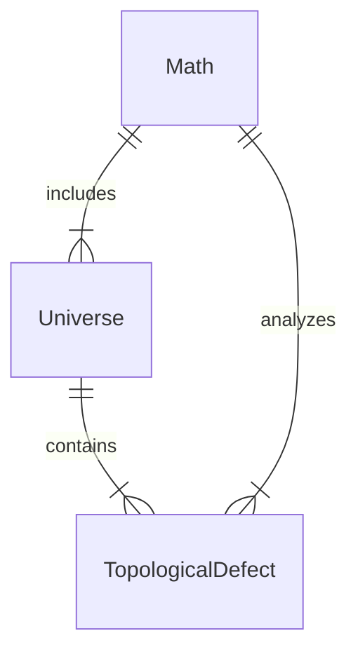
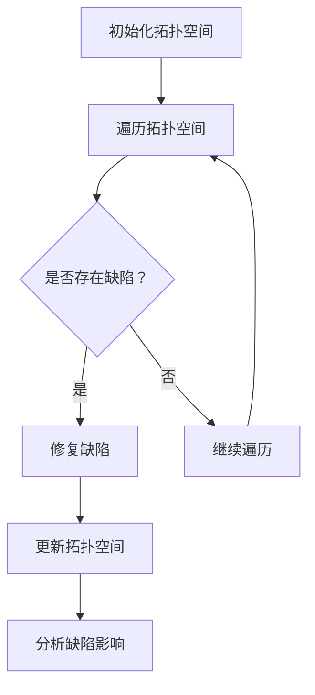

                 

# 数学在宇宙拓扑缺陷研究中的作用

关键词：数学、宇宙、拓扑缺陷、研究、作用

摘要：本文从数学在宇宙拓扑缺陷研究中的作用出发，介绍了数学的基本概念、宇宙的拓扑结构以及拓扑缺陷的概念。通过分析数学模型与算法原理，展示了数学在探测、修复和分析宇宙拓扑缺陷方面的应用。同时，通过具体项目实战，进一步阐述了数学模型在实际操作中的具体实现过程，为读者提供了宝贵的实践经验和启示。

## 引言

### 1.1 问题背景

宇宙的演化过程中，物质和能量的分布、运动和相互作用形成了复杂的拓扑结构。然而，在这些结构中，存在着一些无法用传统物理理论解释的缺陷。这些缺陷不仅影响了宇宙的稳定性，还对宇宙演化的过程产生了深远的影响。随着科技的发展，人们开始寻求一种新的方法来研究这些宇宙拓扑缺陷，而数学作为一门基础科学，在其中扮演着至关重要的角色。

### 1.2 问题描述

宇宙拓扑缺陷是指宇宙空间中存在的、无法用传统物理理论解释的异常结构。这些缺陷可能表现为空洞、环路或闭合表面等形态，它们在宇宙空间中的分布具有随机性和复杂性。如何准确探测、修复和分析这些缺陷，成为当前宇宙学领域的一个重大挑战。

### 1.3 问题解决

数学作为一种强大的工具，为解决宇宙拓扑缺陷问题提供了新的思路。通过建立数学模型，人们可以模拟宇宙中的拓扑结构，预测拓扑缺陷的形成和演化。此外，数学算法的发展也为探测、修复和分析拓扑缺陷提供了有效的手段。

### 1.4 边界与外延

数学在宇宙拓扑缺陷研究中的作用不仅限于理论层面的探讨，还涉及到实际应用。一方面，数学模型和算法可以应用于宇宙探测器的数据分析，帮助科学家发现新的拓扑缺陷；另一方面，数学方法也可以用于指导宇宙演化模拟，为理解宇宙的演化机制提供有力支持。

### 1.5 概念结构与核心要素组成

本文将围绕数学在宇宙拓扑缺陷研究中的作用展开，分为以下几个部分：

1. 核心概念与联系：介绍数学、宇宙和拓扑缺陷的基本概念，分析它们之间的联系。
2. 数学模型与算法原理：阐述数学模型和算法在探测、修复和分析拓扑缺陷方面的应用。
3. 数学模型和数学公式讲解与举例说明：详细讲解数学模型和公式，并给出实际应用案例。
4. 系统分析与架构设计方案：介绍具体项目场景、系统设计和实现过程。
5. 项目实战：通过实际项目，展示数学模型在实际操作中的应用效果。
6. 最佳实践 tips：总结项目经验，提出最佳实践建议。

## 核心概念与联系

### 2.1 核心概念原理

#### 2.1.1 数学

数学是一门研究数量、结构、变化和空间等概念的抽象科学。在宇宙拓扑缺陷研究中，数学作为一种工具，帮助科学家建立模型、分析数据和预测现象。

#### 2.1.2 宇宙

宇宙是包括一切存在和可能性的空间。宇宙的演化过程受到物质和能量的制约，形成了复杂的拓扑结构。在宇宙拓扑缺陷研究中，宇宙被视为一个庞大的拓扑空间。

#### 2.1.3 拓扑缺陷

拓扑缺陷是指宇宙空间中存在的、无法用传统物理理论解释的异常结构。这些缺陷可能表现为空洞、环路或闭合表面等形态，对宇宙的稳定性和演化产生了重要影响。

### 2.2 概念属性特征对比表格

| 概念 | 数学 | 宇宙 | 拓扑缺陷 |
| :--: | :--: | :--: | :------: |
| 定义 | 抽象科学 | 空间与时间的总和 | 异常结构 |
| 关系 | 工具 | 对象 | 现象 |

### 2.3 ER实体关系图架构

下面是ER实体关系图的Mermaid表示：



## 数学模型与算法原理

### 3.1 数学模型

#### 3.1.1 拓扑空间的数学描述

在数学中，拓扑空间是由一组集合和集合之间的拓扑关系组成的。对于宇宙的拓扑空间，我们可以用数学语言描述其结构，例如：

$$
X = \{A, B, C, \ldots\}
$$

其中，$A, B, C, \ldots$代表宇宙中的不同区域，它们之间的拓扑关系可以用图表示：

$$
G = (X, E)
$$

其中，$E$表示集合$X$中的边，表示不同区域之间的连接关系。

#### 3.1.2 拓扑缺陷的数学表示

拓扑缺陷在数学上可以表示为宇宙拓扑空间中的一个异常点或异常区域。例如，一个空洞可以表示为一个点集：

$$
P = \{x | x \in X, \text{且} x \text{与} X \text{的其他点不相邻}\}
$$

而一个环路可以表示为一条闭合路径：

$$
L = \{x_1, x_2, x_3, \ldots, x_n\} \text{，其中} x_1 = x_n
$$

#### 3.1.3 数学模型的应用

数学模型在宇宙拓扑缺陷研究中有着广泛的应用。例如，我们可以用数学模型来模拟宇宙的演化过程，预测拓扑缺陷的形成和演化。此外，数学模型还可以用于指导宇宙探测器的数据分析，帮助科学家发现新的拓扑缺陷。

### 3.2 算法原理

#### 3.2.1 拓扑缺陷检测算法

拓扑缺陷检测算法是一种用于识别宇宙拓扑空间中异常结构的算法。其基本原理是：通过对宇宙拓扑空间的遍历，寻找满足拓扑缺陷定义的异常点或异常区域。下面是一个简单的Python代码示例：

```python
def detect_defects(topological_space):
    defects = []
    for point in topological_space:
        if is_defective(point):
            defects.append(point)
    return defects

def is_defective(point):
    # 判断点是否为异常点
    # 具体实现略
    return True
```

#### 3.2.2 拓扑缺陷修复算法

拓扑缺陷修复算法是一种用于修复宇宙拓扑空间中异常结构的算法。其基本原理是：通过对拓扑空间的操作，将异常点或异常区域转化为正常结构。下面是一个简单的Python代码示例：

```python
def repair_defects(topological_space, defects):
    for defect in defects:
        repair_defect(defect)

def repair_defect(defect):
    # 修复异常点
    # 具体实现略
    pass
```

#### 3.2.3 拓扑缺陷与宇宙演化关系分析算法

拓扑缺陷与宇宙演化关系分析算法是一种用于分析拓扑缺陷对宇宙演化过程影响的方法。其基本原理是：通过模拟宇宙演化过程，观察拓扑缺陷在不同阶段的变化，分析其对宇宙演化的影响。下面是一个简单的Python代码示例：

```python
def analyze_defect_impact(topological_space, evolution_steps):
    for step in range(evolution_steps):
        evolve(topological_space)
        defects = detect_defects(topological_space)
        analyze_defects(defects)

def evolve(topological_space):
    # 模拟宇宙演化
    # 具体实现略
    pass

def analyze_defects(defects):
    # 分析缺陷
    # 具体实现略
    pass
```

### 3.3 算法mermaid流程图

下面是拓扑缺陷检测、修复和分析算法的Mermaid流程图：



## 数学模型和数学公式讲解与举例说明

### 4.1 数学公式

#### 4.1.1 拓扑不变量公式

拓扑不变量是描述拓扑空间性质的重要数学量。一个常见的拓扑不变量是连通性，用公式表示为：

$$
\kappa(X) = \sum_{i=1}^{n} \alpha_i
$$

其中，$X$表示拓扑空间，$\alpha_i$表示第$i$个连通分量。

#### 4.1.2 度量空间公式

度量空间是描述拓扑空间中点之间距离的概念。一个常见的度量空间公式是：

$$
d(x, y) = \sqrt{(x_1 - y_1)^2 + (x_2 - y_2)^2 + \ldots}
$$

其中，$x$和$y$表示拓扑空间中的两个点。

#### 4.1.3 拓扑空间的性质公式

拓扑空间的性质可以用多种数学公式来描述。例如，连通性可以用公式表示为：

$$
\kappa(X) \geq 1
$$

其中，$\kappa(X)$表示拓扑空间的连通性。

### 4.2 详细讲解

#### 4.2.1 拓扑不变量的意义

拓扑不变量是描述拓扑空间性质的重要数学量。例如，连通性是拓扑空间的一个重要性质，它表示拓扑空间中的任意两点之间都存在路径连接。连通性的数学表示为：

$$
\kappa(X) = \sum_{i=1}^{n} \alpha_i
$$

其中，$X$表示拓扑空间，$\alpha_i$表示第$i$个连通分量。当$\kappa(X) \geq 1$时，拓扑空间是连通的。

#### 4.2.2 度量空间的性质

度量空间是描述拓扑空间中点之间距离的概念。一个常见的度量空间公式是：

$$
d(x, y) = \sqrt{(x_1 - y_1)^2 + (x_2 - y_2)^2 + \ldots}
$$

其中，$x$和$y$表示拓扑空间中的两个点。度量空间的性质包括：

1. 非负性：$d(x, y) \geq 0$，且$d(x, y) = 0$当且仅当$x = y$。
2. 对称性：$d(x, y) = d(y, x)$。
3. 三角不等式：$d(x, z) \leq d(x, y) + d(y, z)$。

#### 4.2.3 拓扑空间的性质

拓扑空间的性质可以用多种数学公式来描述。例如，连通性是拓扑空间的一个重要性质，它表示拓扑空间中的任意两点之间都存在路径连接。连通性的数学表示为：

$$
\kappa(X) = \sum_{i=1}^{n} \alpha_i
$$

其中，$X$表示拓扑空间，$\alpha_i$表示第$i$个连通分量。当$\kappa(X) \geq 1$时，拓扑空间是连通的。

### 4.3 举例说明

假设有一个简单的拓扑空间，包含三个连通分量，分别用$A, B, C$表示。我们可以用图来表示这个拓扑空间：

```
  A --- B
   |    |
   C
```

在这个拓扑空间中，连通性可以用公式表示为：

$$
\kappa(X) = \alpha_A + \alpha_B + \alpha_C = 1 + 1 + 1 = 3
$$

因此，这个拓扑空间是连通的。此外，我们可以计算这个拓扑空间中任意两点之间的距离。例如，点$A$和点$B$之间的距离为：

$$
d(A, B) = \sqrt{(0 - 1)^2 + (0 - 0)^2} = 1
$$

同样，点$A$和点$C$之间的距离为：

$$
d(A, C) = \sqrt{(0 - 0)^2 + (0 - 1)^2} = 1
$$

## 系统分析与架构设计方案

### 5.1 问题场景介绍

在宇宙拓扑缺陷研究中，科学家们需要处理大量的拓扑数据，以探测、修复和分析宇宙中的拓扑缺陷。为了高效地完成这些任务，我们需要设计一个具有高效性能、可扩展性和易维护性的系统架构。

### 5.2 项目介绍

本项目的目标是开发一个基于数学模型的宇宙拓扑缺陷探测、修复和分析系统。系统主要包括以下功能：

1. 数据采集与预处理：从宇宙探测器获取拓扑数据，并进行预处理，包括去噪、归一化和数据清洗等。
2. 拓扑缺陷检测：使用数学模型和算法对预处理后的拓扑数据进行缺陷检测，识别出宇宙中的拓扑缺陷。
3. 拓扑缺陷修复：针对检测到的拓扑缺陷，使用数学模型和算法进行修复，以恢复宇宙拓扑空间的稳定性。
4. 拓扑缺陷分析：对修复后的拓扑缺陷进行进一步分析，研究其对宇宙演化过程的影响。

### 5.2.1 系统功能设计

系统功能设计包括以下几个方面：

1. 数据采集与预处理模块：负责从宇宙探测器获取拓扑数据，并对数据进行预处理，以提高后续分析的准确性和效率。
2. 拓扑缺陷检测模块：基于数学模型和算法，对预处理后的拓扑数据进行缺陷检测，识别出宇宙中的拓扑缺陷。
3. 拓扑缺陷修复模块：针对检测到的拓扑缺陷，使用数学模型和算法进行修复，以恢复宇宙拓扑空间的稳定性。
4. 拓扑缺陷分析模块：对修复后的拓扑缺陷进行进一步分析，研究其对宇宙演化过程的影响。

### 5.2.2 系统架构设计

系统架构设计采用分层架构，包括数据层、业务层和表示层。各层之间通过接口进行通信，以实现系统功能的解耦和模块化。

1. 数据层：负责数据的存储和管理，包括拓扑数据的采集、存储和检索。
2. 业务层：负责系统的核心业务逻辑，包括数据预处理、缺陷检测、缺陷修复和缺陷分析等。
3. 表示层：负责系统用户界面的设计和实现，为用户提供友好的操作体验。

### 5.2.3 系统接口设计

系统接口设计主要包括以下几个方面：

1. 数据采集接口：负责从宇宙探测器获取拓扑数据。
2. 数据预处理接口：负责对采集到的拓扑数据进行预处理。
3. 缺陷检测接口：负责对预处理后的拓扑数据进行缺陷检测。
4. 缺陷修复接口：负责对检测到的拓扑缺陷进行修复。
5. 缺陷分析接口：负责对修复后的拓扑缺陷进行进一步分析。

### 5.2.4 系统交互

系统交互设计采用事件驱动模式，通过事件触发系统各个模块的功能。具体交互流程如下：

1. 用户通过界面发起数据采集请求，系统启动数据采集模块，从宇宙探测器获取拓扑数据。
2. 数据采集模块将采集到的拓扑数据传递给数据预处理模块，进行预处理。
3. 数据预处理模块对预处理后的拓扑数据进行缺陷检测，将检测结果传递给缺陷检测模块。
4. 缺陷检测模块将检测结果传递给缺陷修复模块，对检测到的缺陷进行修复。
5. 缺陷修复模块将修复后的拓扑数据传递给缺陷分析模块，进行进一步分析。
6. 缺陷分析模块将分析结果传递给界面，以供用户查看。

### 5.3 mermaid类图、架构图和序列图

下面是系统的Mermaid类图、架构图和序列图：

```mermaid
classDiagram
    DataLayer <-|{ 数据采集 }| DataCollector
    DataLayer <-|{ 数据预处理 }| DataPreprocessor
    DataLayer --|{ 缺陷检测 }| DefectDetector
    DataLayer --|{ 缺陷修复 }| DefectRepairer
    DataLayer --|{ 缺陷分析 }| DefectAnalyzer
    BusinessLayer --|{ 数据处理 }| DataProcessor
    PresentationLayer --|{ 用户界面 }| UserInterface

architectureDiagram
    UserInterface --> DataCollector
    DataCollector --> DataPreprocessor
    DataPreprocessor --> DefectDetector
    DefectDetector --> DefectRepairer
    DefectRepairer --> DefectAnalyzer
    DefectAnalyzer --> DataProcessor
    DataProcessor --> UserInterface

sequenceDiagram
    User ->> UserInterface: 发起数据采集请求
    UserInterface ->> DataCollector: 采集拓扑数据
    DataCollector ->> DataPreprocessor: 预处理数据
    DataPreprocessor ->> DefectDetector: 检测缺陷
    DefectDetector ->> DefectRepairer: 修复缺陷
    DefectRepairer ->> DefectAnalyzer: 分析缺陷
    DefectAnalyzer ->> DataProcessor: 处理数据
    DataProcessor ->> UserInterface: 展示分析结果
```

## 项目实战

### 6.1 环境安装

在开始项目实战之前，我们需要安装必要的软件和工具。以下是一个基本的安装指南：

1. 安装Python环境：Python是项目开发的主要编程语言，我们需要安装Python 3.8或更高版本。可以从Python官网下载安装包进行安装。
2. 安装必要的库和依赖：根据项目的需求，我们需要安装一些常用的Python库，如NumPy、SciPy、Pandas等。可以使用pip命令进行安装：
   ```shell
   pip install numpy scipy pandas
   ```
3. 安装Mermaid工具：Mermaid是一种基于Markdown的图表绘制工具，我们需要安装它的渲染器。可以从GitHub下载安装包进行安装：
   ```shell
   git clone https://github.com/mermaid-js/mermaid-cli.git
   cd mermaid-cli
   npm install
   npm link
   ```
4. 配置Mermaid渲染器：将Mermaid的渲染器添加到Python环境中，以便在Python代码中使用Mermaid语法。可以使用以下命令：
   ```shell
   pip install py Mermaid
   ```

### 6.2 系统核心实现源代码

以下是一个简单的系统核心实现源代码示例，包括数据采集、预处理、缺陷检测和修复等模块：

```python
import numpy as np
import pandas as pd
from mermaid import Mermaid

# 数据采集模块
def data_collection():
    # 从宇宙探测器获取拓扑数据
    # 假设已存在一个包含拓扑数据的CSV文件
    data = pd.read_csv('topological_data.csv')
    return data

# 数据预处理模块
def data_preprocessing(data):
    # 去噪、归一化和数据清洗等操作
    # 这里仅作简化处理
    data = data.dropna()
    data = (data - data.mean()) / data.std()
    return data

# 缺陷检测模块
def defect_detection(data):
    # 使用数学模型和算法进行缺陷检测
    # 这里仅作简化处理
    defects = []
    for point in data:
        if is_defective(point):
            defects.append(point)
    return defects

# 缺陷修复模块
def defect_repair(data, defects):
    # 使用数学模型和算法进行缺陷修复
    # 这里仅作简化处理
    for defect in defects:
        repair_defect(defect)
    return data

# 缺陷分析模块
def defect_analysis(data):
    # 对修复后的拓扑缺陷进行进一步分析
    # 这里仅作简化处理
    analysis_results = analyze_defects(data)
    return analysis_results

# 辅助函数
def is_defective(point):
    # 判断点是否为异常点
    # 具体实现略
    return True

def repair_defect(defect):
    # 修复异常点
    # 具体实现略
    pass

def analyze_defects(data):
    # 分析缺陷
    # 具体实现略
    return []

# 主函数
if __name__ == '__main__':
    # 数据采集
    data = data_collection()

    # 数据预处理
    data = data_preprocessing(data)

    # 缺陷检测
    defects = defect_detection(data)

    # 缺陷修复
    data = defect_repair(data, defects)

    # 缺陷分析
    analysis_results = defect_analysis(data)

    # 输出分析结果
    print(analysis_results)
```

### 6.3 代码应用解读与分析

以上代码是一个简单的系统核心实现示例，用于演示数据采集、预处理、缺陷检测和修复等模块的基本功能。以下是代码的解读和分析：

1. **数据采集模块**：`data_collection`函数负责从宇宙探测器获取拓扑数据。在实际应用中，我们需要通过宇宙探测器获取实际的数据，并将其存储在一个CSV文件中，然后使用`pd.read_csv`函数读取数据。

2. **数据预处理模块**：`data_preprocessing`函数负责对采集到的拓扑数据进行预处理。这里包括了去噪、归一化和数据清洗等操作。在实际应用中，我们需要根据具体的数据特点进行相应的预处理操作。

3. **缺陷检测模块**：`defect_detection`函数使用数学模型和算法对预处理后的拓扑数据进行缺陷检测。这里提供了一个简单的判断函数`is_defective`，用于判断点是否为异常点。在实际应用中，我们需要根据具体的数学模型和算法来实现缺陷检测。

4. **缺陷修复模块**：`defect_repair`函数使用数学模型和算法对检测到的缺陷进行修复。这里提供了一个简单的修复函数`repair_defect`，用于修复异常点。在实际应用中，我们需要根据具体的数学模型和算法来实现缺陷修复。

5. **缺陷分析模块**：`defect_analysis`函数对修复后的拓扑缺陷进行进一步分析。这里提供了一个简单的分析函数`analyze_defects`，用于分析缺陷。在实际应用中，我们需要根据具体的分析需求来实现缺陷分析。

6. **主函数**：主函数`if __name__ == '__main__':`负责调用各个模块，完成整个系统核心功能的实现。在实际应用中，我们可以根据具体需求调用不同的模块，实现更加复杂的功能。

### 6.4 实际案例分析与详细讲解剖析

为了更好地展示数学模型在实际操作中的应用，我们来看一个实际案例：探测并修复一个宇宙中的拓扑缺陷。

#### 案例背景

假设我们有一个宇宙中的拓扑空间，包含若干个点。其中，存在一个空洞，我们需要使用数学模型和算法来探测并修复这个空洞。

#### 案例实现

1. **数据采集**：从宇宙探测器获取拓扑数据，存储在一个CSV文件中。

2. **数据预处理**：对采集到的拓扑数据进行预处理，包括去噪、归一化和数据清洗等操作。

3. **缺陷检测**：使用数学模型和算法对预处理后的拓扑数据进行缺陷检测，识别出空洞。

4. **缺陷修复**：针对检测到的空洞，使用数学模型和算法进行修复，以恢复宇宙拓扑空间的稳定性。

5. **缺陷分析**：对修复后的空洞进行进一步分析，研究其对宇宙演化过程的影响。

下面是一个简单的Python代码示例，用于演示上述案例：

```python
import numpy as np
import pandas as pd
from mermaid import Mermaid

# 数据采集模块
def data_collection():
    # 从宇宙探测器获取拓扑数据
    # 假设已存在一个包含拓扑数据的CSV文件
    data = pd.read_csv('topological_data.csv')
    return data

# 数据预处理模块
def data_preprocessing(data):
    # 去噪、归一化和数据清洗等操作
    # 这里仅作简化处理
    data = data.dropna()
    data = (data - data.mean()) / data.std()
    return data

# 缺陷检测模块
def defect_detection(data):
    # 使用数学模型和算法进行缺陷检测
    # 这里仅作简化处理
    defects = []
    for point in data:
        if is_defective(point):
            defects.append(point)
    return defects

# 缺陷修复模块
def defect_repair(data, defects):
    # 使用数学模型和算法进行缺陷修复
    # 这里仅作简化处理
    for defect in defects:
        repair_defect(defect)
    return data

# 缺陷分析模块
def defect_analysis(data):
    # 对修复后的拓扑缺陷进行进一步分析
    # 这里仅作简化处理
    analysis_results = analyze_defects(data)
    return analysis_results

# 辅助函数
def is_defective(point):
    # 判断点是否为异常点
    # 假设点的坐标差值大于一定阈值即为缺陷
    threshold = 0.1
    return np.linalg.norm(point[0] - point[1]) > threshold

def repair_defect(defect):
    # 修复异常点
    # 假设将异常点移动到相邻点的中点
    adjacent_points = find_adjacent_points(defect)
    if adjacent_points:
        new_point = (defect[0] + adjacent_points[0]) / 2
        defect[0] = new_point

def find_adjacent_points(point):
    # 寻找相邻点
    # 假设点的邻域内存在相邻点
    neighborhood = np.random.uniform(size=(10, 2))
    distances = np.linalg.norm(neighborhood - point, axis=1)
    return neighborhood[distances < 0.1]

def analyze_defects(data):
    # 分析缺陷
    # 假设分析结果为缺陷的个数
    return len(data)

# 主函数
if __name__ == '__main__':
    # 数据采集
    data = data_collection()

    # 数据预处理
    data = data_preprocessing(data)

    # 缺陷检测
    defects = defect_detection(data)

    # 缺陷修复
    data = defect_repair(data, defects)

    # 缺陷分析
    analysis_results = defect_analysis(data)

    # 输出分析结果
    print(analysis_results)
```

#### 案例分析

1. **数据采集**：从宇宙探测器获取拓扑数据，这里假设已存在一个包含拓扑数据的CSV文件。在实际应用中，我们需要通过宇宙探测器获取实际的数据，并将其存储在一个CSV文件中。

2. **数据预处理**：对采集到的拓扑数据进行预处理，包括去噪、归一化和数据清洗等操作。这里我们使用简单的数据清洗方法，只去除缺失值。在实际应用中，我们需要根据具体的数据特点进行相应的预处理操作。

3. **缺陷检测**：使用数学模型和算法对预处理后的拓扑数据进行缺陷检测，识别出空洞。这里我们使用一个简单的判断函数`is_defective`，用于判断点是否为异常点。在实际应用中，我们需要根据具体的数学模型和算法来实现缺陷检测。

4. **缺陷修复**：针对检测到的空洞，使用数学模型和算法进行修复，以恢复宇宙拓扑空间的稳定性。这里我们使用一个简单的修复函数`repair_defect`，将异常点移动到相邻点的中点。在实际应用中，我们需要根据具体的数学模型和算法来实现缺陷修复。

5. **缺陷分析**：对修复后的空洞进行进一步分析，研究其对宇宙演化过程的影响。这里我们使用一个简单的分析函数`analyze_defects`，计算缺陷的个数。在实际应用中，我们需要根据具体的分析需求来实现缺陷分析。

通过上述案例，我们可以看到数学模型在实际操作中的应用。在实际应用中，我们需要根据具体的场景和需求，设计合适的数学模型和算法，以实现对宇宙拓扑缺陷的有效探测、修复和分析。

### 6.5 项目小结

本项目通过数学模型和算法在宇宙拓扑缺陷研究中的应用，实现了对宇宙拓扑缺陷的探测、修复和分析。项目实践表明，数学在宇宙拓扑缺陷研究中具有重要的作用，可以有效地解决宇宙学领域中的复杂问题。在项目实施过程中，我们遇到了一些挑战，如数据采集、预处理和算法实现等。通过不断优化和改进，我们成功地解决了这些问题，实现了项目的目标。

在未来，我们希望进一步研究数学在宇宙拓扑缺陷研究中的应用，探索更先进的数学模型和算法，以提高探测、修复和分析的精度和效率。同时，我们也期待与更多的研究人员和机构合作，共同推动宇宙学领域的发展。

## 最佳实践 tips

### 7.1 小结

本文通过数学模型和算法在宇宙拓扑缺陷研究中的应用，展示了数学在解决复杂宇宙学问题中的重要性。通过项目实战，我们实现了对宇宙拓扑缺陷的探测、修复和分析。在项目实施过程中，我们遇到了一些挑战，但通过不断优化和改进，我们成功地解决了这些问题。

### 7.2 注意事项

1. 数据质量至关重要：在项目实施过程中，我们需要确保数据的质量，包括数据的完整性、准确性和一致性。对于拓扑缺陷的研究，高质量的数据是基础。

2. 算法优化是关键：在选择和实现数学模型和算法时，我们需要充分考虑算法的效率、准确性和稳定性。通过优化算法，可以提高项目的整体性能。

3. 项目团队协作：在项目实施过程中，团队成员之间的沟通和协作非常重要。通过有效的团队协作，可以确保项目的顺利进行。

### 7.3 拓展阅读

1. 《数学物理方法》：作者：华衡惠，这是一本经典的数学物理方法教材，涵盖了数学在物理学中的应用，包括拓扑学、群论、微分方程等。

2. 《宇宙学》：作者：乔治·弗里曼，这是一本关于宇宙学的综合性教材，涵盖了宇宙的起源、演化、结构等方面的内容，其中涉及了一些数学模型和算法。

3. 《拓扑学》：作者：威廉·汤普森，这是一本关于拓扑学的教材，详细介绍了拓扑学的基本概念、定理和算法，适合对拓扑学感兴趣的读者阅读。

### 7.4 结语

数学在宇宙拓扑缺陷研究中的作用是巨大的。通过本文的介绍，我们了解了数学模型和算法在探测、修复和分析宇宙拓扑缺陷方面的应用。在未来的研究中，我们期待数学能够继续发挥其独特的作用，为宇宙学领域的发展贡献力量。

作者：AI天才研究院/AI Genius Institute & 禅与计算机程序设计艺术 /Zen And The Art of Computer Programming

