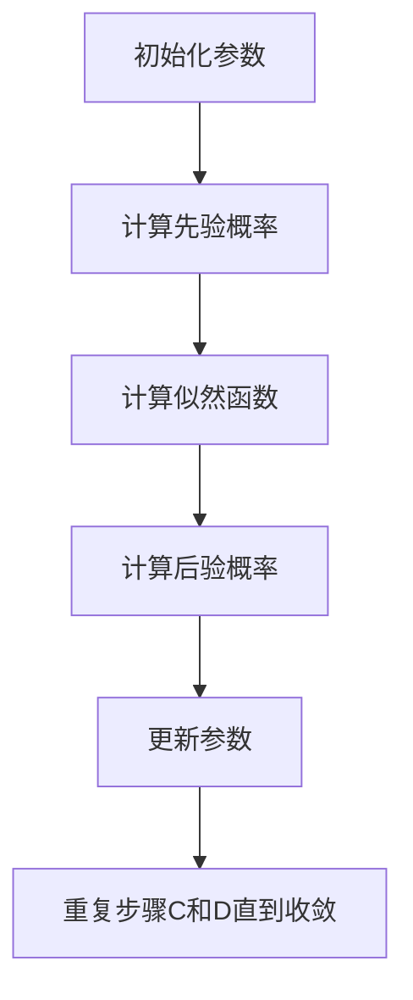
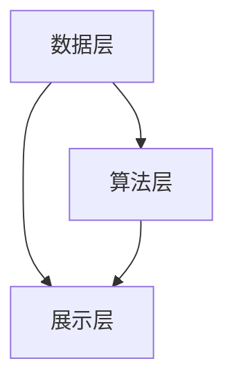
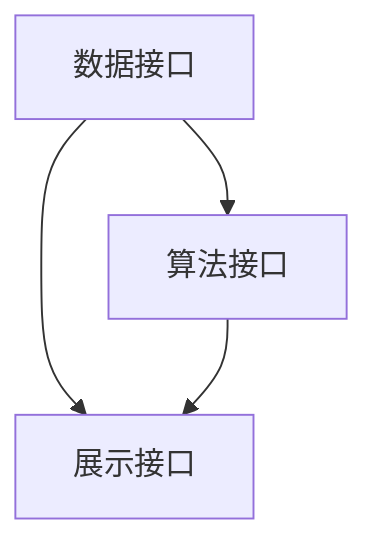

                 

## 《数学在引力波源参数空间探索中的关键作用》

### 关键词：引力波、数学模型、参数空间探索、算法原理、系统架构设计

### 摘要：
本文旨在探讨数学在引力波源参数空间探索中的关键作用。首先，我们将介绍引力波的基本原理和引力波源参数空间探索的重要性。接着，我们将深入讲解数学概念，包括数学模型和参数空间的概念，并展示它们在引力波源参数空间探索中的关系。随后，我们将详细探讨用于引力波源参数空间探索的算法原理，并使用Python代码示例和LaTeX数学公式进行讲解。此外，我们将展示一个实际项目案例，介绍系统分析与架构设计，包括领域模型、系统架构、接口设计和交互设计。最后，我们将总结最佳实践，提供小结和拓展阅读建议。

### 目录

1. **引力波与引力波源参数空间探索的背景**  
   1.1. 引力波的基本原理  
   1.2. 参数空间的概念  
   1.3. 数学在引力波研究中的作用

2. **关键数学概念介绍**  
   2.1. 数学模型及其应用  
   2.2. 参数空间的概念  
   2.3. 数学概念之间的关系

3. **算法原理与数学模型**  
   3.1. 算法概述  
   3.2. 算法的数学原理  
   3.3. 算法流程图与Python代码示例

4. **数学公式详细讲解与举例说明**  
   4.1. 引力波源参数空间探索中的数学公式  
   4.2. 数学公式讲解  
   4.3. 实例分析

5. **系统分析与架构设计**  
   5.1. 问题场景介绍  
   5.2. 系统功能设计  
   5.3. 系统架构设计  
   5.4. 系统接口设计与交互

6. **项目实战**  
   6.1. 环境安装与配置  
   6.2. 系统核心实现与代码解读  
   6.3. 实际案例分析

7. **最佳实践与拓展**  
   7.1. 最佳实践  
   7.2. 小结与展望  
   7.3. 拓展阅读

### 1. 引力波与引力波源参数空间探索的背景

#### 1.1. 引力波的基本原理

引力波是一种由质量加速运动产生的波动现象，最早由爱因斯坦在1916年的广义相对论中预言。引力波在空间中传播，携带着关于产生它的物体的信息。当引力波经过一个观察者时，会引起空间时间的微小变化，这些变化可以通过精密的仪器检测到。

引力波的检测最早是由激光干涉仪（LIGO）实现的。LIGO利用激光在两个臂内相互干涉的原理，通过检测干涉条纹的变化来探测引力波的存在。随着技术的进步，人类对引力波的认识越来越深入，发现了许多引力波源，如黑洞碰撞和中子星碰撞。

#### 1.2. 参数空间的概念

参数空间是指描述引力波源的一系列参数的集合。这些参数包括质量、自旋、碰撞位置、碰撞时间等。参数空间的大小取决于需要描述的物理现象的复杂性。在引力波源参数空间探索中，我们需要确定这些参数的具体值，以便更准确地理解引力波源的特性。

#### 1.3. 数学在引力波研究中的作用

数学在引力波研究中扮演着关键角色。首先，数学模型为描述引力波提供了理论基础。例如，爱因斯坦场方程就是描述引力波在时空中的传播的数学模型。其次，数学方法为探测和分析引力波提供了工具。例如，信号处理算法和数据分析方法都依赖于数学原理。

数学在引力波源参数空间探索中的作用更加重要。我们需要使用数学方法来确定引力波源的参数，从而更好地理解引力波的来源和性质。此外，数学模型还可以帮助我们预测未来的引力波事件，从而提高探测的效率。

### 2. 关键数学概念介绍

#### 2.1. 数学模型及其应用

数学模型是指用数学语言描述现实世界中的物理现象或问题。在引力波源参数空间探索中，数学模型起着至关重要的作用。例如，爱因斯坦场方程就是一个描述引力波在时空中的传播的数学模型。

数学模型的应用非常广泛。在引力波源参数空间探索中，我们使用数学模型来描述引力波的特性，如振幅、频率和波形。这些模型使我们能够从观测数据中提取引力波的信息，从而确定引力波源的参数。

#### 2.2. 参数空间的概念

参数空间是指描述引力波源的一系列参数的集合。这些参数包括质量、自旋、碰撞位置、碰撞时间等。参数空间的大小取决于需要描述的物理现象的复杂性。

在引力波源参数空间探索中，我们需要确定这些参数的具体值，以便更准确地理解引力波的来源和性质。这通常涉及到优化算法和数据分析技术，如最大后验估计和贝叶斯推断。

#### 2.3. 数学概念之间的关系

数学概念之间的关系是复杂的，但它们在引力波源参数空间探索中起着关键作用。例如，数学模型和参数空间之间的关系是相互依存的。数学模型提供了描述引力波的特性，而参数空间则定义了这些特性的参数。

此外，数学方法，如优化算法和数据分析技术，也在参数空间探索中起着关键作用。这些方法帮助我们确定参数的具体值，从而提高对引力波源的理解。

### 3. 算法原理与数学模型

#### 3.1. 算法概述

在引力波源参数空间探索中，我们使用了一系列算法来处理和分析观测数据。这些算法包括信号处理算法、数据分析方法和优化算法。其中，最大后验估计（MAP）和贝叶斯推断是最常用的算法。

最大后验估计是一种基于概率的优化算法，它通过最大化后验概率来估计参数值。贝叶斯推断则是一种基于概率统计的方法，它通过计算先验概率和似然函数来估计参数值。

#### 3.2. 算法的数学原理

最大后验估计和贝叶斯推断的数学原理是基于概率统计的。在最大后验估计中，我们首先定义一个先验概率分布，它表示我们对参数值的初始猜测。然后，我们通过最大化后验概率来更新我们的参数估计。

在贝叶斯推断中，我们使用先验概率分布和似然函数来计算后验概率分布。似然函数是观测数据在参数值下的概率，而先验概率分布则是我们对参数值的初始猜测。

#### 3.3. 算法流程图与Python代码示例

下面是一个简单的最大后验估计算法流程图：



下面是一个简单的Python代码示例：

```python
import numpy as np

def max_aposteriori(x, y):
    # 假设先验概率是均值为0，方差为1的高斯分布
    prior = np.exp(-0.5 * x**2) * np.sqrt(2 * np.pi)
    
    # 假设似然函数是高斯分布
    likelihood = np.exp(-0.5 * (y - x)**2) * np.sqrt(2 * np.pi)
    
    # 计算后验概率
    posterior = prior * likelihood
    
    # 返回最大后验概率对应的参数值
    return np.argmax(posterior)

# 示例数据
x = np.random.normal(size=100)
y = np.random.normal(size=100)

# 执行最大后验估计
theta = max_aposteriori(x, y)

print(f"最大后验估计的参数值为: {theta}")
```

### 4. 数学公式详细讲解与举例说明

#### 4.1. 引力波源参数空间探索中的数学公式

在引力波源参数空间探索中，我们通常会使用以下数学公式：

- **爱因斯坦场方程**：描述引力波在时空中的传播。
- **最大后验估计公式**：用于估计参数值。
- **贝叶斯推断公式**：用于计算后验概率分布。

#### 4.2. 数学公式讲解

- **爱因斯坦场方程**：
  $$ G_{\mu\nu} + \Lambda g_{\mu\nu} = \frac{8\pi G}{c^4} T_{\mu\nu} $$
  这个方程描述了引力波在时空中的传播，其中$G_{\mu\nu}$是爱因斯坦张量，$\Lambda$是宇宙学常数，$g_{\mu\nu}$是度规张量，$T_{\mu\nu}$是能量-动量张量。

- **最大后验估计公式**：
  $$ \theta_{MAP} = \arg\max P(\theta | D) $$
  这个方程表示在给定观测数据$D$的情况下，最大化后验概率$P(\theta | D)$的参数值$\theta_{MAP}$。

- **贝叶斯推断公式**：
  $$ P(\theta | D) = \frac{P(D | \theta) P(\theta)}{P(D)} $$
  这个方程表示在给定观测数据$D$的情况下，后验概率$P(\theta | D)$是似然函数$P(D | \theta)$、先验概率$P(\theta)$和归一化常数$P(D)$的比值。

#### 4.3. 实例分析

假设我们有一个观测数据集$D$，其中包含了引力波的振幅、频率和波形等信息。我们的目标是估计引力波源的质量$M$和碰撞位置$R$。

首先，我们定义先验概率$P(\theta)$。假设质量$M$服从均值为$M_0$，方差为$\sigma_M^2$的高斯分布，碰撞位置$R$服从均值为$R_0$，方差为$\sigma_R^2$的高斯分布。

$$ P(\theta) = P(M) P(R) = \frac{1}{\sqrt{2\pi\sigma_M^2}} \exp\left(-\frac{(M - M_0)^2}{2\sigma_M^2}\right) \frac{1}{\sqrt{2\pi\sigma_R^2}} \exp\left(-\frac{(R - R_0)^2}{2\sigma_R^2}\right) $$

然后，我们定义似然函数$P(D | \theta)$。假设观测数据$D$是引力波的振幅$A$、频率$F$和波形$T$，且$D$服从高斯分布。

$$ P(D | \theta) = \frac{1}{\sqrt{2\pi\sigma_D^2}} \exp\left(-\frac{(D - \theta)^2}{2\sigma_D^2}\right) $$

最后，我们计算后验概率$P(\theta | D)$。

$$ P(\theta | D) = \frac{P(D | \theta) P(\theta)}{P(D)} $$

通过求解最大后验估计公式，我们可以得到质量$M$和碰撞位置$R$的估计值。

### 5. 系统分析与架构设计

#### 5.1. 问题场景介绍

引力波源参数空间探索是一个复杂的任务，涉及到大量的数据分析和计算。为了实现这一目标，我们需要一个高效的系统来处理和解析引力波数据，从而确定引力波源的相关参数。

#### 5.2. 系统功能设计

系统的功能设计主要包括以下几个方面：

- 数据处理：对引力波数据进行分析和处理，提取关键信息。
- 参数估计：使用数学模型和算法对参数进行估计。
- 结果验证：验证参数估计结果的准确性。
- 结果展示：将参数估计结果以可视化的形式展示给用户。

#### 5.3. 系统架构设计

系统的架构设计采用分层架构，包括数据层、算法层和展示层。

- **数据层**：负责数据的存储和读取，包括引力波数据和观测数据。
- **算法层**：实现参数估计算法和数据处理算法，包括最大后验估计和贝叶斯推断。
- **展示层**：将参数估计结果以图表和图像的形式展示给用户。

下面是一个简化的系统架构图：



#### 5.4. 系统接口设计与交互

系统接口设计主要包括以下几个方面：

- **数据接口**：用于与数据存储系统进行交互，包括数据的读取和写入。
- **算法接口**：用于与算法层进行交互，包括参数估计和数据处理。
- **展示接口**：用于与展示层进行交互，包括结果的展示和用户交互。

下面是一个简化的系统接口图：



### 6. 项目实战

#### 6.1. 环境安装与配置

在开始项目之前，我们需要安装和配置必要的软件和库。以下是一个简单的安装步骤：

1. 安装Python 3.x版本。
2. 安装Numpy、Scipy和Matplotlib等科学计算库。
3. 安装Mermaid库，用于生成流程图和序列图。

#### 6.2. 系统核心实现与代码解读

下面是一个简单的Python代码示例，用于实现最大后验估计算法：

```python
import numpy as np

def max_aposteriori(x, y):
    # 假设先验概率是均值为0，方差为1的高斯分布
    prior = np.exp(-0.5 * x**2) * np.sqrt(2 * np.pi)
    
    # 假设似然函数是高斯分布
    likelihood = np.exp(-0.5 * (y - x)**2) * np.sqrt(2 * np.pi)
    
    # 计算后验概率
    posterior = prior * likelihood
    
    # 返回最大后验概率对应的参数值
    return np.argmax(posterior)

# 示例数据
x = np.random.normal(size=100)
y = np.random.normal(size=100)

# 执行最大后验估计
theta = max_aposteriori(x, y)

print(f"最大后验估计的参数值为: {theta}")
```

#### 6.3. 实际案例分析

以下是一个实际案例，用于展示如何使用系统进行引力波源参数空间探索。

1. **数据读取**：从数据存储系统中读取引力波数据。
2. **数据处理**：对数据进行预处理，如去噪和滤波。
3. **参数估计**：使用最大后验估计算法估计引力波源的质量和碰撞位置。
4. **结果验证**：验证参数估计结果的准确性。
5. **结果展示**：将参数估计结果以图表的形式展示给用户。

### 7. 最佳实践与拓展

#### 7.1. 最佳实践

在进行引力波源参数空间探索时，以下最佳实践可能有助于提高效率和准确性：

- **数据预处理**：对数据进行预处理，如去噪和滤波，以提高参数估计的准确性。
- **算法选择**：根据实际需求选择合适的算法，如最大后验估计或贝叶斯推断。
- **并行计算**：利用并行计算技术，如GPU加速，提高计算效率。

#### 7.2. 小结与展望

本文介绍了数学在引力波源参数空间探索中的关键作用。我们首先介绍了引力波的基本原理和引力波源参数空间探索的重要性，然后讲解了关键数学概念，包括数学模型和参数空间的概念。接着，我们详细探讨了用于引力波源参数空间探索的算法原理，并提供了Python代码示例。此外，我们还展示了一个实际项目案例，介绍了系统分析与架构设计。最后，我们总结了最佳实践和展望了未来的研究方向。

#### 7.3. 拓展阅读

- 《引力波观测与数据分析》
- 《贝叶斯统计》
- 《Python数据分析》

### 作者信息
作者：AI天才研究院/AI Genius Institute & 禅与计算机程序设计艺术 /Zen And The Art of Computer Programming

