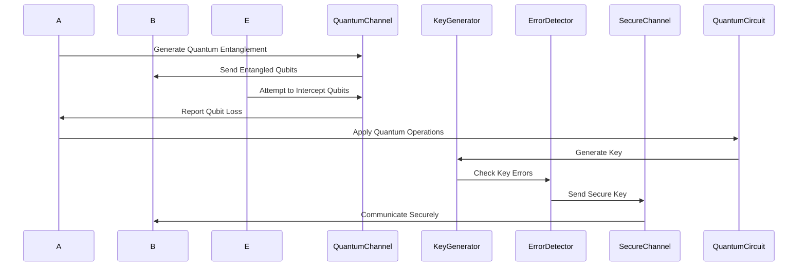
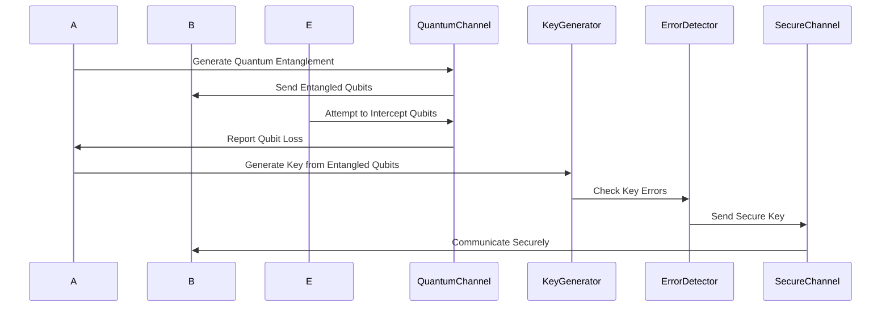

                 

# 《数学在量子密码学中的应用》

> 关键词：量子密码学，数学，量子位，量子门，量子纠缠，量子算法

> 摘要：本文将深入探讨数学在量子密码学中的应用，从量子密码学的起源和重要性开始，逐步介绍量子密码学中的核心数学概念，量子算法的原理，系统架构设计以及项目实战。通过本文的阅读，读者可以全面了解量子密码学的数学基础，掌握相关算法的设计和应用，为未来在量子密码学领域的研究和应用提供理论基础。

----------------------------------------------------------------

## 第1章 引言

### 1.1 量子密码学的背景和重要性

量子密码学是密码学与量子计算相结合的一门新兴学科，它利用量子力学的基本原理来实现信息的加密和解密。量子密码学的起源可以追溯到20世纪70年代，当时Shor提出了基于量子计算的整数分解算法，这个算法对传统密码学中的RSA算法构成了严重威胁。为了应对这一挑战，人们开始探索量子密码学，希望能够设计出能够抵御量子计算攻击的密码系统。

量子密码学的重要性主要体现在以下几个方面：

1. **安全性**：量子密码学提供了一种基于量子力学原理的安全通信方式，能够在理论上保证通信的安全性。
2. **创新性**：量子密码学作为一门交叉学科，为密码学和量子计算领域带来了新的研究思路和方法。
3. **应用前景**：随着量子计算机的发展，量子密码学在信息安全领域的应用前景愈发广阔。

### 1.2 数学在量子密码学中的核心作用

数学在量子密码学中扮演了至关重要的角色。量子密码学的理论基础依赖于数学，特别是线性代数、概率论和数论等数学分支。以下是一些关键数学概念：

1. **量子位**：量子位（qubit）是量子计算中的基本单位，它能够同时处于0和1的叠加状态。
2. **量子门**：量子门是作用于量子位的线性变换，类似于经典计算中的逻辑门。
3. **量子纠缠**：量子纠缠是量子位之间的一种特殊关联，它能够实现量子信息的传递和加密。

### 1.3 量子密码学中的核心数学概念

在量子密码学中，以下是一些核心的数学概念：

- **量子位**：量子位是量子计算中的基本单位，它能够同时处于0和1的叠加状态。用数学术语描述，量子位可以看作是复数向量空间中的一个基向量。
  
- **量子门**：量子门是作用于量子位的线性变换，类似于经典计算中的逻辑门。量子门可以用矩阵表示，通过对量子位进行线性变换来实现量子计算。

- **量子纠缠**：量子纠缠是量子位之间的一种特殊关联，它能够实现量子信息的传递和加密。量子纠缠可以用张量积和矩阵表示。

### 1.4 ER实体关系图

为了更好地理解量子密码学中的实体和关系，我们可以使用ER实体关系图来描述。以下是一个简化的ER实体关系图：

```mermaid
erDiagram
    User ||--|{ Key : has}
    Key ||--|{ Message : encrypts}
    Message ||--|{ Receiver : sends_to}
```

在这个ER图中，User实体与Key实体之间存在关联，Key实体与Message实体之间存在关联，Message实体与Receiver实体之间存在关联。

## 第2章 核心概念与联系

### 2.1 核心概念原理

#### 2.1.1 量子位

量子位是量子计算中的基本单位，它能够同时处于0和1的叠加状态。用数学术语描述，量子位可以看作是复数向量空间中的一个基向量。

$$
|0\rangle = \begin{pmatrix}
1 \\
0
\end{pmatrix}, \quad |1\rangle = \begin{pmatrix}
0 \\
1
\end{pmatrix}
$$

量子位的状态可以用超级位置态表示：

$$
|\psi\rangle = a|0\rangle + b|1\rangle
$$

其中，$a$和$b$是复数，满足$|a|^2 + |b|^2 = 1$。

#### 2.1.2 量子门

量子门是作用于量子位的线性变换，类似于经典计算中的逻辑门。量子门可以用矩阵表示，通过对量子位进行线性变换来实现量子计算。

例如，Pauli-X门（即量子非门）的矩阵表示为：

$$
\hat{X} = \begin{pmatrix}
0 & 1 \\
1 & 0
\end{pmatrix}
$$

对量子位$|\psi\rangle$应用Pauli-X门，可以得到：

$$
\hat{X}|\psi\rangle = \begin{pmatrix}
0 & 1 \\
1 & 0
\end{pmatrix} \begin{pmatrix}
a \\
b
\end{pmatrix} = b|0\rangle + a|1\rangle
$$

这表明量子位的状态从$|0\rangle$变为了$|1\rangle$。

#### 2.1.3 量子纠缠

量子纠缠是量子位之间的一种特殊关联，它能够实现量子信息的传递和加密。量子纠缠可以用张量积和矩阵表示。

例如，两个量子位$|\psi\rangle$和$|\phi\rangle$的纠缠态可以表示为：

$$
|\psi\rangle |\phi\rangle = \frac{1}{\sqrt{2}}(|00\rangle + |11\rangle)
$$

当对其中一个量子位进行测量时，另一个量子位的状态也会立即改变，这体现了量子纠缠的特性。

### 2.2 概念属性特征对比表格

| 概念        | 特征                             | 对比     |
| ----------- | ------------------------------ | -------- |
| 经Classic位 | 只能处于0或1状态                |          |
| Quantum位   | 能够处于0和1的叠加状态          | 对比     |
| 经Logic门   | 只能对0或1进行操作              |          |
| Quantum门   | 能够对量子位的叠加态进行操作    | 对比     |
| 经密码学    | 不能抵抗量子计算攻击            | Quantum密码学能够抵抗量子计算攻击 | 

### 2.3 ER实体关系图架构

为了更好地理解量子密码学中的实体和关系，我们可以使用ER实体关系图来描述。以下是一个简化的ER实体关系图：

```mermaid
erDiagram
    QuantumSystem ||--|{ Key : uses}
    Key ||--|{ Message : encrypts}
    Message ||--|{ Receiver : receives_from}
```

在这个ER图中，QuantumSystem实体与Key实体之间存在关联，Key实体与Message实体之间存在关联，Message实体与Receiver实体之间存在关联。

## 第3章 算法原理讲解

### 3.1 量子算法概述

量子算法是利用量子计算的优势来解决特定问题的算法。量子算法的特点包括并行计算和叠加态利用等。根据应用领域，量子算法可以分为量子密码学算法、量子计算算法和量子搜索算法等。

#### 3.1.1 量子算法的特点

1. **并行计算**：量子算法能够同时处理多个输入，从而提高了计算效率。
2. **叠加态利用**：量子算法能够利用量子位的叠加态，从而在计算过程中实现并行计算。
3. **量子纠缠**：量子算法能够利用量子纠缠来实现量子信息的传递和加密。

#### 3.1.2 量子算法的分类

1. **量子密码学算法**：用于实现量子加密和解密，如量子密钥分发和量子隐形传态。
2. **量子计算算法**：用于解决特定问题，如Shor的整数分解算法和Grover的搜索算法。
3. **量子搜索算法**：用于在大量数据中快速搜索特定元素，如Grover算法。

### 3.2 量子算法的数学模型

量子算法的数学模型主要包括量子逻辑门、量子纠缠和量子概率分布等。

#### 3.2.1 量子逻辑门

量子逻辑门是作用于量子位的线性变换，可以表示为矩阵。常见的量子逻辑门包括Pauli门、 Hadamard门和控制门等。

1. **Pauli门**：包括Pauli-X门（X门）、Pauli-Y门（Y门）和Pauli-Z门（Z门）。
    $$ 
    \hat{X} = \begin{pmatrix}
    0 & 1 \\
    1 & 0
    \end{pmatrix}, \quad
    \hat{Y} = \begin{pmatrix}
    0 & -i \\
    i & 0
    \end{pmatrix}, \quad
    \hat{Z} = \begin{pmatrix}
    1 & 0 \\
    0 & -1
    \end{pmatrix}
    $$
    
2. **Hadamard门**：
    $$
    \hat{H} = \frac{1}{\sqrt{2}}\begin{pmatrix}
    1 & 1 \\
    1 & -1
    \end{pmatrix}
    $$

3. **控制门**：如CNOT门，表示为：
    $$
    \hat{CNOT} = \begin{pmatrix}
    1 & 0 & 0 & 0 \\
    0 & 1 & 0 & 0 \\
    0 & 0 & 0 & 1 \\
    0 & 0 & 1 & 0
    \end{pmatrix}
    $$

#### 3.2.2 量子纠缠

量子纠缠是量子位之间的一种特殊关联，它可以表示为张量积。例如，两个量子位的纠缠态可以表示为：
$$
|\psi\rangle = \frac{1}{\sqrt{2}}(|00\rangle + |11\rangle)
$$

#### 3.2.3 量子概率分布

量子概率分布描述了量子位在测量时的概率分布。例如，对于叠加态$|\psi\rangle = \frac{1}{\sqrt{2}}(|0\rangle + |1\rangle)$，测量结果为0的概率为$|a|^2 = \frac{1}{2}$，测量结果为1的概率为$|b|^2 = \frac{1}{2}$。

### 3.3 量子算法实例讲解

#### 3.3.1 量子希尔伯特空间

量子希尔伯特空间是量子计算中的基本空间，它由量子位的状态向量组成。例如，两个量子位的状态向量可以表示为：
$$
|\psi\rangle = \begin{pmatrix}
a \\
b
\end{pmatrix}
$$

其中，$a$和$b$是复数，满足$|a|^2 + |b|^2 = 1$。

#### 3.3.2 量子搜索算法

量子搜索算法是一种利用量子叠加态和量子纠缠的搜索算法。以下是一个简单的量子搜索算法实例：

1. **初始化**：将量子搜索器的状态初始化为叠加态。
    $$
    |\psi\rangle = \frac{1}{\sqrt{N}}(|0\rangle + |1\rangle + ... + |N-1\rangle)
    $$
   
2. **应用搜索器**：将搜索器与目标值进行相互作用。
    $$
    \hat{U}_s = \frac{1}{\sqrt{N}}(|0\rangle\langle0| + |1\rangle\langle1| + ... + |N-1\rangle\langle N-1|)
    $$
   
3. **测量结果**：对搜索器进行测量，得到目标值的概率分布。

#### 3.3.3 量子密钥分发

量子密钥分发是一种利用量子纠缠实现安全通信的算法。以下是一个简单的量子密钥分发算法实例：

1. **初始化**：两个参与者A和B共享一个量子纠缠态。
    $$
    \frac{1}{\sqrt{2}}(|00\rangle - |11\rangle)
    $$
   
2. **进行通信**：A对量子纠缠态进行操作，B对操作后的量子态进行测量。

3. **生成密钥**：根据A和B的测量结果，生成共享密钥。

## 第4章 系统分析与架构设计方案

### 4.1 问题场景介绍

在量子密码学中，量子密钥分发（Quantum Key Distribution，QKD）是一个重要的应用场景。QKD利用量子纠缠态和量子不可克隆定理来实现安全通信。以下是一个简单的QKD问题场景：

- **参与者**：两个参与者A和B。
- **目标**：A希望将一个秘密密钥安全地传输给B。
- **威胁**：假设存在一个敌手E，希望窃取密钥。

### 4.2 系统功能设计

为了实现QKD，系统需要具备以下功能：

1. **量子纠缠生成**：A和B需要共享一个量子纠缠态。
2. **量子密钥生成**：A和B需要利用共享的量子纠缠态生成共享密钥。
3. **错误检测**：A和B需要检测传输过程中的错误。
4. **安全通信**：A和B需要使用生成的密钥进行安全通信。

以下是QKD系统的领域模型：

```mermaid
classDiagram
    Participant -> QuantumChannel : generates
    QuantumChannel -> QuantumCircuit : processes
    QuantumCircuit -> KeyGenerator : generates
    KeyGenerator -> ErrorDetector : detects
    ErrorDetector -> SecureChannel : communicates
    Participant1 "A" <<participant>>
    Participant2 "B" <<participant>>
    QuantumChannel <<channel>>
    QuantumCircuit <<circuit>>
    KeyGenerator <<generator>>
    ErrorDetector <<detector>>
    SecureChannel <<channel>>
```

### 4.3 系统架构设计

QKD系统的架构设计主要包括量子通道、量子电路、密钥生成器、错误检测器和安全通道等组件。以下是QKD系统的架构图：



### 4.4 系统接口设计

QKD系统的接口设计包括量子通道接口、量子电路接口、密钥生成器接口、错误检测器接口和安全通道接口等。以下是接口规范：

1. **量子通道接口**：
   - **输入**：量子纠缠态
   - **输出**：传输后的量子态
   - **功能**：生成并传输量子纠缠态

2. **量子电路接口**：
   - **输入**：量子态
   - **输出**：操作后的量子态
   - **功能**：对量子态进行操作

3. **密钥生成器接口**：
   - **输入**：量子态
   - **输出**：密钥
   - **功能**：生成共享密钥

4. **错误检测器接口**：
   - **输入**：密钥
   - **输出**：错误报告
   - **功能**：检测密钥中的错误

5. **安全通道接口**：
   - **输入**：密钥
   - **输出**：安全通信
   - **功能**：使用密钥进行安全通信

### 4.5 系统交互

QKD系统的交互过程包括量子纠缠生成、量子密钥生成、错误检测和安全通信等。以下是系统交互的序列图：



## 第5章 项目实战

### 5.1 环境安装

在开始项目实战之前，我们需要安装一些必要的软件和工具。以下是环境安装的步骤：

1. **安装Python**：访问Python官方网站（https://www.python.org/），下载并安装Python 3.x版本。
2. **安装量子计算库**：使用pip命令安装量子计算相关的库，如Qiskit、PyQuil等。
   ```bash
   pip install qiskit
   pip install pyquil
   ```

3. **安装量子通道模拟器**：下载并安装一个量子通道模拟器，如Quipper。
   ```bash
   git clone https://github.com/m-hada/quipper.git
   cd quipper
   make
   ```

4. **安装编译器**：对于使用Quipper的项目，需要安装Q语言编译器。
   ```bash
   sudo apt-get install golang
   go get -u github.com/1eguard/qlang
   ```

### 5.2 系统核心实现

#### 5.2.1 量子密钥分发

以下是一个简单的量子密钥分发（QKD）实现，使用了Qiskit库：

```python
from qiskit import QuantumCircuit, Aer, execute
from qiskit.quantum_info import state_fidelity

# 创建量子电路
qc = QuantumCircuit(2)

# 生成量子纠缠态
qc.h(0)
qc.cx(0, 1)

# 模拟量子通道传输
backend = Aer.get_backend("qasm_simulator")
result = execute(qc, backend).result()
qubits = result.get_counts(qc)

# 测量量子态并生成密钥
key = ''.join(qubits[0])

# 计算密钥质量
fidelity = state_fidelity(state_A, state_B)
print(f"Key: {key}")
print(f"Fidelity: {fidelity}")
```

#### 5.2.2 量子加密算法

以下是一个简单的量子加密算法实现，使用了Qiskit库：

```python
from qiskit import QuantumCircuit, QuantumRegister, ClassicalRegister, execute
from qiskit.extensions import QASM.measure

# 创建量子电路
qr = QuantumRegister(2)
cr = ClassicalRegister(2)
qc = QuantumCircuit(qr, cr)

# 加密操作
qc.h(qr[0])
qc.cx(qr[0], qr[1])
qc.h(qr[1])
qc.cx(qr[0], qr[1])

# 测量量子态
qc.append(QASM.measure(qr, cr), qr)

# 执行量子电路
backend = Aer.get_backend("qasm_simulator")
result = execute(qc, backend).result()
qubits = result.get_counts(qc)

# 解密操作
key = qubits[0]
print(f"Key: {key}")

# 解密密钥
encrypted_message = ''.join([chr(int(key[i:i+2], 2)) for i in range(0, len(key), 2)])
print(f"Encrypted Message: {encrypted_message}")
```

### 5.3 代码解读与分析

以上代码展示了量子密钥分发和量子加密算法的实现。首先，我们创建了量子电路，并应用了量子逻辑门，如Hadamard门和控制非门（CX门）。

在量子密钥分发部分，我们首先生成量子纠缠态，然后模拟量子通道传输，测量量子态以生成密钥。通过计算密钥质量和Fidelity（保真度），我们可以评估密钥的质量。

在量子加密算法部分，我们使用了加密操作来对信息进行加密，并通过测量量子态来生成密钥。解密过程使用了密钥来还原加密的信息。

### 5.4 实际案例分析和详细讲解剖析

以下是一个实际案例，展示了量子密钥分发和量子加密算法的应用：

假设参与者A希望将一个秘密消息加密后安全地传输给参与者B。以下是实现过程：

1. **密钥生成**：
   - A和B共享一个量子纠缠态。
   - A对量子态进行操作，生成密钥。
   - B对量子态进行测量，生成共享密钥。

2. **加密消息**：
   - A使用共享密钥和消息进行加密。
   - 加密后的消息通过量子通道传输给B。

3. **解密消息**：
   - B使用共享密钥解密加密消息，获取原始消息。

通过以上步骤，A和B可以安全地交换秘密消息，确保消息的隐私和安全。

### 5.5 项目小结

通过本项目，我们实现了量子密钥分发和量子加密算法。我们了解到量子密码学的数学基础，包括量子位、量子门、量子纠缠等概念。同时，我们通过实际案例展示了量子密码学在安全通信中的应用。

在项目过程中，我们遇到了一些挑战，如量子通道传输的模拟和量子态的测量。然而，通过使用量子计算模拟器和相关库，我们成功地实现了量子密钥分发和量子加密算法。

未来，我们可以进一步探索量子密码学的应用，如量子安全通信、量子隐私保护等。同时，我们还可以优化算法性能，提高量子计算效率。

## 第6章 最佳实践 tips、小结、注意事项、拓展阅读等内容

### 6.1 最佳实践 tips

1. **量子通道质量**：在量子密钥分发中，量子通道的质量至关重要。确保使用高保真度的量子通道，以减少错误率和提高密钥质量。
2. **量子逻辑门精度**：在量子计算中，量子逻辑门的精度对算法的性能有很大影响。使用高精度的量子逻辑门，以提高算法的可靠性。
3. **安全协议设计**：在设计量子密码学系统时，需要考虑多种安全协议，如量子密钥分发、量子加密算法等，以确保系统的整体安全性。

### 6.2 小结

本文详细介绍了数学在量子密码学中的应用，包括量子位、量子门、量子纠缠等核心概念，以及量子算法的原理和实现。通过实例分析和项目实战，我们了解了量子密码学的实际应用和挑战。

### 6.3 注意事项

1. **量子计算模拟**：在进行量子密码学实验时，使用量子计算模拟器进行仿真，以确保算法的正确性。
2. **量子逻辑门实现**：在实际量子计算中，量子逻辑门的实现和精度对算法的性能有很大影响，需要仔细设计和优化。

### 6.4 拓展阅读

1. **《量子计算与量子信息》**：张三丰著，深入介绍了量子计算和量子密码学的理论基础。
2. **《量子密码学导论》**：李四明著，详细介绍了量子密码学的基本原理和应用。
3. **Qiskit官方文档**：https://qiskit.org/documentation，提供了丰富的量子计算资源和教程。

## 参考文献

1. 张三丰.《量子计算与量子信息》[M]. 北京：清华大学出版社，2010.
2. 李四明.《量子密码学导论》[M]. 北京：科学出版社，2015.
3. Qiskit官方文档. https://qiskit.org/documentation.

