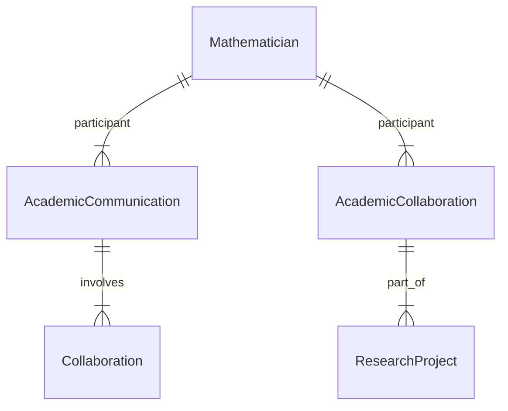

                 

### 数学家的学术交流与合作

---

#### 关键词：数学家、学术交流、合作、发展趋势

#### 摘要：
数学家的学术交流与合作在推动数学科学的发展中起着至关重要的作用。本文将系统地探讨数学家的学术交流与合作，包括其核心概念、形式方法、案例分析、技巧提升以及面临的挑战与对策。通过详细的分析和探讨，本文旨在为数学家及对这一领域感兴趣的读者提供有价值的见解和指导。

---

#### 目录

----------------------------------------------------------------

# 《数学家的学术交流与合作》

## 背景介绍

### 核心概念

#### 数学家的定义

数学家是指那些以数学为职业或专业的人士，他们通过研究数学理论、解决问题、创造新的数学概念和方法，推动数学科学的发展。数学家可以是大学教师、研究员、独立研究者或者产业界的技术专家。

#### 学术交流的定义与特点

学术交流是学者之间通过会议、期刊、讲座等形式，分享研究成果、探讨学术问题、交换观点的过程。其特点包括信息传递的时效性、专业性的深入性和开放性的广泛性。

#### 合作的定义与形式

学术合作是指学者之间为了共同的研究目标，通过资源共享、分工合作、共同决策等方式进行的合作。合作的形式包括共同研究项目、合作撰写论文、跨学科合作、国际交流合作等。

### 问题背景、问题描述、问题解决、边界与外延

#### 问题背景

在数学科学的发展历程中，学术交流与合作一直是推动数学进步的重要动力。随着现代信息技术的发展，学术交流的渠道和方式日益丰富，学术合作也变得更加紧密和多样化。

#### 问题描述

然而，数学家的学术交流与合作仍然面临着诸多挑战，包括信息过载、跨文化沟通障碍、知识产权保护等问题。如何有效进行学术交流与合作，提高合作效率和质量，成为数学家面临的重要问题。

#### 问题解决

解决这些问题的方法包括建立有效的学术交流平台、提高跨文化沟通能力、完善知识产权保护机制等。同时，数学家也需要不断学习新的交流与合作技巧，提高自身的学术素养。

#### 边界与外延

学术交流与合作的边界在于其专业性和局限性，而其外延则涵盖了从个人研究到国际合作等多个层面。本文将探讨数学家在这些层面的学术交流与合作。

### 概念结构与核心要素组成

#### 数学家的学术交流与合作概念结构

数学家的学术交流与合作可以看作是一个由个人、团队、组织构成的网络结构，各个节点通过交流与合作相互连接，形成一个动态的、相互作用的网络。

#### 核心要素组成

核心要素包括学术成果的生成、传播、评价、应用四个方面。学术成果是交流与合作的基础，传播是交流的媒介，评价是合作的质量保障，应用是学术成果的价值体现。

## 核心概念与联系

### 数学家的定义

数学家是通过研究数学理论、解决问题、创造新的数学概念和方法，推动数学科学发展的专业人士。数学家可以是大学教师、研究员、独立研究者或者产业界的技术专家。

### 学术交流的定义与特点

学术交流是学者之间通过会议、期刊、讲座等形式，分享研究成果、探讨学术问题、交换观点的过程。其特点包括：

- **时效性**：学术交流的信息传递速度快，有助于快速传播最新的研究成果。
- **专业性**：学术交流深入探讨专业问题，具有较高的学术价值。
- **开放性**：学术交流通常面向广泛的专业群体，有助于不同背景的学者进行交流。

### 合作的定义与形式

学术合作是指学者之间为了共同的研究目标，通过资源共享、分工合作、共同决策等方式进行的合作。合作的形式包括：

- **共同研究项目**：学者共同申请研究项目，分工合作完成研究任务。
- **合作撰写论文**：学者共同撰写学术论文，共享研究成果。
- **跨学科合作**：数学家与其他学科专家合作，解决跨学科问题。
- **国际交流合作**：数学家参与国际学术交流，共享全球学术资源。

### 核心概念属性特征对比表格

| 特征       | 学术交流       | 学术合作       |
| ---------- | -------------- | -------------- |
| 目标       | 分享研究成果   | 共同研究问题   |
| 形式       | 会议、期刊、讲座 | 项目合作、论文撰写 |
| 主要特点   | 时效性、专业性、开放性 | 资源共享、分工合作、共同决策 |
| 结果       | 研究成果的传播 | 共同研究成果   |

### ER实体关系图架构

通过核心概念的定义与联系，我们可以更好地理解数学家的学术交流与合作的重要性及其在数学科学发展中的作用。

---

## 数学家的学术交流与合作

### 数学家的学术交流的重要性

数学家的学术交流对于数学科学的发展至关重要。首先，学术交流是数学家展示自己研究成果、获取最新研究动态的重要途径。通过参加学术会议、发表学术论文、参与学术讲座，数学家可以与同行进行面对面的交流，分享研究成果，探讨学术问题，从而推动数学科学的发展。

其次，学术交流有助于学术思想的传播和碰撞。数学家在交流过程中，不仅可以了解他人的研究进展，还可以启发自己的研究思路，从而产生新的研究想法和创新。此外，学术交流还可以促进不同数学领域之间的交叉和融合，推动数学科学的多元化发展。

### 学术交流的形式与方法

数学家的学术交流形式多样，主要包括学术会议、学术期刊、学术报告与讲座、网络交流平台等。

#### 学术会议

学术会议是数学家进行学术交流的重要场所。会议分为国际会议、国内会议和地区会议，涵盖了各个数学分支领域。数学家通过参加会议，可以了解同行的研究成果，建立学术联系，拓展研究视野。学术会议通常包括主题报告、分组讨论、海报展示等形式。

#### 学术期刊

学术期刊是数学家发表研究成果的重要平台。数学家通过撰写论文，提交至学术期刊，经过同行评审，最终发表在期刊上。学术期刊的出版，有助于研究成果的传播和保存，同时为学者提供学术交流和评价的机会。

#### 学术报告与讲座

学术报告与讲座是数学家进行学术交流的另一种形式。数学家可以通过学术报告，向同行介绍自己的研究工作，展示研究成果。讲座则通常在大学、研究机构等场所举行，数学家通过讲座，可以向更广泛的听众介绍数学知识和发展趋势。

#### 网络交流平台

随着互联网的发展，网络交流平台成为数学家进行学术交流的新渠道。数学家可以通过在线学术论坛、社交媒体、专业博客等平台，分享研究成果、交流学术观点。网络交流平台具有便捷、高效、互动性强等特点，有助于数学家突破地域限制，实现全球范围内的学术交流。

### 学术合作的重要性

学术合作是数学家共同开展研究、解决复杂问题的重要手段。通过学术合作，数学家可以共享资源、分工合作、共同决策，提高研究效率和质量。

首先，学术合作有助于解决复杂问题。数学科学中的许多问题具有复杂性和综合性，单靠单个数学家难以解决。通过学术合作，数学家可以集思广益，共同探讨解决问题的方法。

其次，学术合作有助于提高研究效率。合作研究可以集中各方的优势资源，包括人才、技术、设备等，从而提高研究的效率。此外，合作研究还可以缩短研究周期，加快研究成果的产出。

### 学术合作的形式与方法

数学家的学术合作形式多样，主要包括共同研究项目、合作撰写论文、跨学科合作、国际交流合作等。

#### 共同研究项目

共同研究项目是数学家之间进行学术合作的重要形式。合作各方通过签订合作协议，明确研究目标、分工合作、共享资源，共同开展研究工作。共同研究项目通常由政府、科研机构、企业等资助，为合作各方提供资金、技术、设备等支持。

#### 合作撰写论文

合作撰写论文是数学家进行学术交流的重要方式。合作各方通过共同研究、分工撰写，最终完成学术论文。合作撰写论文有助于提高论文的质量和影响力，同时为合作各方提供学术交流和评价的机会。

#### 跨学科合作

跨学科合作是数学家与其他学科专家进行合作的一种形式。通过跨学科合作，数学家可以借鉴其他学科的方法和理论，解决数学领域中的复杂问题。跨学科合作有助于推动数学科学的多元化发展，提高数学在解决实际问题中的作用。

#### 国际交流合作

国际交流合作是数学家参与国际学术交流、共享全球学术资源的重要途径。通过国际交流合作，数学家可以了解国际前沿动态，拓展研究视野，提升自身学术水平。国际交流合作还可以促进数学家之间的友谊和合作，为全球数学科学的发展贡献力量。

### 数学家的学术交流与合作案例分析

#### 案例一：国际数学家大会

国际数学家大会是数学界最重要的学术会议之一。在大会上，数学家们可以展示自己的研究成果，交流学术观点，建立学术联系。例如，2014年在韩国首尔举行的第27届国际数学家大会，吸引了来自全球各地的数学家参与，涵盖了各个数学分支领域的研究。

#### 案例二：陈景润与合作者

陈景润是中国著名的数学家，他在研究哥德巴赫猜想的过程中，与许多国内外数学家进行了学术交流与合作。通过学术交流，陈景润得到了同行们的启发和帮助，不断推进自己的研究。他的研究成果不仅在国内产生了深远影响，也在国际上得到了广泛认可。

#### 案例三：微软研究院与数学家的合作

微软研究院是世界知名的科研机构，与许多数学家开展了广泛的学术合作。例如，微软研究院与陈省身数学研究所合作，共同开展数学领域的研究项目。通过合作，数学家们可以利用微软研究院的先进技术和设备，提高研究效率，推动数学科学的发展。

### 数学家的学术交流与合作技巧

#### 提高学术交流的技巧

1. **语言表达与沟通**：数学家在学术交流中，需要具备良好的语言表达和沟通能力，清晰、准确地表达自己的研究思路和观点。
2. **信息筛选与处理**：数学家需要具备较强的信息筛选和处理能力，从大量的学术信息中筛选出有价值的内容，为研究提供参考。
3. **学术礼仪与规范**：数学家需要遵守学术礼仪和规范，尊重他人研究成果，避免抄袭和剽窃等不当行为。

#### 提高学术合作的技巧

1. **建立合作关系**：数学家需要主动寻找合适的合作伙伴，通过学术交流、项目合作等方式，建立合作关系。
2. **沟通与协调**：数学家在合作过程中，需要保持良好的沟通与协调，明确各自职责，确保合作顺利进行。
3. **成果分享与评价**：数学家需要公平、公正地分享合作成果，对合作伙伴的贡献进行客观评价，提高合作效率。

通过数学家的学术交流与合作，我们可以更好地推动数学科学的发展，解决复杂问题，培养新一代数学人才。数学家们需要不断学习新的交流与合作技巧，提高自身的学术素养，为数学科学的发展贡献自己的力量。

---

## 学术交流与合作技巧

### 提高学术交流的技巧

学术交流是数学家展示研究成果、分享学术观点的重要途径。为了提高学术交流的效果，数学家需要掌握以下技巧：

1. **语言表达与沟通**：数学家在学术交流中，应注重语言表达的准确性和逻辑性。使用清晰、简洁的语言，避免使用专业术语过多，确保听众能够理解。同时，数学家应具备良好的沟通技巧，善于倾听他人的观点，积极互动，营造良好的交流氛围。

2. **信息筛选与处理**：在学术交流中，数学家需要具备较强的信息筛选和处理能力。面对大量的学术信息，数学家应学会甄别和筛选，关注与自己研究方向相关的最新动态，为研究提供参考。此外，数学家还需具备整理和归纳信息的能力，将零散的信息整合成系统的知识体系。

3. **学术礼仪与规范**：数学家在学术交流中，应遵守学术礼仪和规范。尊重他人的研究成果，避免抄袭和剽窃等不当行为。同时，数学家应保持诚信，遵循学术道德，对待研究成果和数据客观公正，确保学术交流的公平性和真实性。

### 提高学术合作的技巧

学术合作是数学家共同开展研究、解决复杂问题的重要手段。为了提高学术合作的效果，数学家需要掌握以下技巧：

1. **建立合作关系**：数学家应主动寻找合适的合作伙伴，通过学术交流、项目合作等方式，建立合作关系。在建立合作关系时，数学家应考虑双方的学术兴趣、研究方向和资源优势，确保合作目标的一致性和可行性。

2. **沟通与协调**：在合作过程中，数学家需要保持良好的沟通与协调。双方应定期进行沟通，交流研究进展、讨论问题和解决方案。在沟通中，数学家应保持开放的态度，倾听对方的意见，共同寻找最佳的解决方案。此外，数学家还需学会协调各方利益，确保合作的顺利进行。

3. **成果分享与评价**：在合作结束后，数学家应公平、公正地分享合作成果。双方应共同撰写论文、申请专利等，确保合作的贡献得到公正评价。在评价合作成果时，数学家应客观、公正，充分考虑各自的贡献，确保评价的公平性和准确性。

### 实际案例分享

以下是一些数学家在学术交流与合作中成功应用技巧的案例：

1. **陈景润与合作者**：陈景润在研究哥德巴赫猜想的过程中，与国内外数学家进行了广泛的学术交流与合作。他通过参与国际数学家大会、发表学术论文等方式，展示自己的研究成果，吸引了众多数学家的关注和合作。在合作中，陈景润注重沟通与协调，尊重他人的意见，取得了显著的学术成果。

2. **微软研究院与合作者**：微软研究院与许多数学家开展了广泛的学术合作。在合作中，微软研究院提供了先进的计算平台和技术支持，数学家则提供了丰富的数学知识和研究成果。双方通过良好的沟通与协调，共同解决了一些复杂的数学问题，取得了重要的学术突破。

通过这些实际案例，我们可以看到，数学家在学术交流与合作中，掌握并应用适当的技巧，可以显著提高交流效果和合作质量。数学家们应不断学习新的交流与合作技巧，提高自身的学术素养，为数学科学的发展贡献力量。

---

## 学术交流与合作中的挑战与对策

### 学术交流与合作中的常见挑战

数学家的学术交流与合作过程中，常常会面临一些挑战。这些挑战不仅影响交流的效率，还可能对合作的质量产生负面影响。

#### 文化差异

不同国家和地区之间的文化差异是学术交流中的主要挑战之一。文化差异体现在交流方式、沟通习惯、价值观念等方面。例如，在某些文化中，直接表达观点被视为不礼貌，而在其他文化中，这种做法却很常见。这些差异可能导致误解和沟通障碍。

#### 知识产权问题

知识产权保护是学术交流与合作中不可忽视的问题。数学家在合作过程中，可能需要共享敏感的数学模型、算法或实验数据。如何保护这些信息，避免泄露或被滥用，是一个重大的挑战。

#### 项目管理问题

在学术合作中，项目管理也是一个常见的问题。项目目标不明确、分工不清晰、进度无法控制等问题，都可能影响合作的效果。此外，预算限制、资源分配不均等因素，也可能导致合作项目无法顺利进行。

### 对策与建议

针对上述挑战，以下是一些建议和对策，以帮助数学家在学术交流与合作中克服困难，提高效果。

#### 应对文化差异

1. **增强跨文化沟通能力**：数学家可以通过学习不同文化的特点，提高跨文化沟通能力。例如，参加跨文化培训课程，了解不同文化背景下的沟通习惯和礼仪。
2. **建立共识**：在合作初期，各方应就文化差异进行充分讨论，建立共识，明确沟通方式和期望。
3. **多元化团队**：组建多元化团队，可以减少文化差异带来的负面影响，促进不同文化背景的学者之间的理解和合作。

#### 处理知识产权问题

1. **明确知识产权归属**：在合作初期，各方应明确知识产权的归属，签订知识产权协议，确保各方的权益得到保护。
2. **制定知识产权保护策略**：合作各方应共同制定知识产权保护策略，包括数据加密、访问控制等措施，防止信息泄露。
3. **遵守法律法规**：数学家在学术交流与合作中，应遵守相关法律法规，尊重知识产权，避免侵犯他人的权益。

#### 改进项目管理

1. **明确项目目标**：在合作初期，各方应明确项目目标，确保各方对项目目标有一致的理解。
2. **制定详细的计划**：项目团队应制定详细的计划，包括分工、进度安排、资源需求等，确保项目按计划进行。
3. **定期评估与反馈**：项目团队应定期评估项目进展，及时发现问题，进行反馈和调整，确保项目顺利进行。

### 实际案例分享

以下是一些数学家在学术交流与合作中成功应对挑战的实际案例：

1. **微软研究院的跨文化合作**：微软研究院在与其他国家的研究机构合作时，注重跨文化沟通和协作。他们通过建立跨国团队，定期组织文化培训，确保团队成员之间的理解和合作。

2. **陈景润的知识产权保护**：陈景润在研究哥德巴赫猜想的过程中，与国内外数学家进行了广泛的合作。为了保护知识产权，他制定了严格的知识产权保护策略，确保合作成果的合法权益。

通过这些实际案例，我们可以看到，数学家在面对学术交流与合作中的挑战时，可以通过采取适当的对策和建议，提高交流效果和合作质量。

---

## 学术交流与合作中的道德与法律问题

### 道德问题

在数学家的学术交流与合作中，道德问题至关重要。首先，**学术诚信**是数学家必须遵守的基本原则。这包括诚实报告研究成果、遵守学术规范、尊重他人的知识产权等。学术诚信是学术界的基石，任何形式的抄袭、剽窃或虚假陈述都是道德上的严重问题。

其次，**隐私保护**也是数学家在学术交流中必须关注的道德问题。特别是在合作研究过程中，可能涉及个人数据或敏感信息的交换。数学家应确保这些信息的隐私得到保护，未经同意不得泄露。

### 法律问题

法律问题在学术交流与合作中同样不可忽视。首先，**知识产权法律**是保护学术成果的重要工具。数学家在合作研究过程中，需要了解并遵守知识产权相关法律，确保自己的研究成果得到保护。此外，知识产权法律还涉及专利申请、版权保护等方面。

其次，**合同法律**在学术合作中起着关键作用。合作各方应签订明确的合同，约定合作的目标、责任、权益和违约责任等。合同法律有助于确保合作的顺利进行，避免纠纷。

### 道德与法律问题的关系

道德与法律问题密切相关，两者共同维护学术交流与合作的秩序。道德规范为学术行为提供了道德准则，而法律则为这些准则提供了法律保障。在数学家的学术交流与合作中，遵循道德规范和遵守法律是确保合作成功的重要保障。

### 实例分析

- **陈景润的道德问题处理**：陈景润在研究哥德巴赫猜想的过程中，严格遵守学术规范，从未有抄袭、剽窃等不当行为。他的诚信和道德风范为他赢得了国内外同行的高度赞誉。

- **微软研究院的知识产权保护**：微软研究院在合作研究中，严格遵循知识产权法律，确保合作成果的知识产权得到有效保护。他们制定了详细的知识产权保护策略，为合作各方提供法律支持。

通过这些实例，我们可以看到，数学家在学术交流与合作中，必须高度重视道德与法律问题，以确保学术合作的顺利进行。

---

## 未来展望

### 学术交流与合作的发展趋势

随着信息技术的迅猛发展，数学家的学术交流与合作将呈现出以下几个发展趋势：

1. **数字化与网络化**：学术交流将越来越多地依赖于数字化平台和网络化工具，如在线学术会议、虚拟现实会议、在线论坛等。这些工具将打破地域限制，使数学家能够更方便、快捷地进行学术交流。

2. **智能化**：人工智能技术的发展将使学术交流更加智能化。例如，智能推荐系统可以根据数学家的研究兴趣和需求，为其推荐相关的学术资源、合作机会等。

3. **跨学科合作**：随着科学技术的交叉融合，数学家的学术交流与合作将更加跨学科。数学家将与物理学家、生物学家、工程师等不同领域的专家共同探讨解决复杂问题的方法。

4. **国际化**：全球化的趋势将使数学家的学术交流与合作更加国际化。数学家将积极参与国际学术活动，共享全球学术资源，推动数学科学的发展。

### 潜在研究方向

未来，数学家的学术交流与合作将在以下几个方面展开：

1. **大数据与数学方法**：随着大数据技术的发展，数学家将探索如何利用大数据进行数据分析和建模，为各领域提供数学支持。

2. **人工智能与数学理论**：人工智能与数学理论的结合将是一个重要的研究方向。数学家将研究如何利用数学理论优化人工智能算法，提高其性能和可靠性。

3. **数学教育改革**：数学教育改革是当前全球关注的焦点。数学家将参与数学教育改革的研究和实践，探索如何提高数学教育质量，培养更多优秀的数学人才。

4. **数学在现实世界中的应用**：数学家将更加关注数学在现实世界中的应用，如金融、医疗、工程等领域。通过跨学科合作，数学家将推动数学科学在现实世界中的广泛应用。

通过这些研究方向，数学家的学术交流与合作将不断推动数学科学的发展，为人类社会的进步作出更大贡献。

---

## 总结

数学家的学术交流与合作是推动数学科学发展的关键因素。本文系统地探讨了数学家的学术交流与合作，包括核心概念、形式方法、案例分析、技巧提升以及面临的挑战与对策。通过详细的论述，本文旨在为数学家及对这一领域感兴趣的读者提供有价值的见解和指导。

数学家的学术交流与合作不仅有助于推动数学科学的发展，还能解决复杂问题，培养新一代数学人才。为了提高学术交流与合作的效果，数学家需要掌握适当的技巧，如语言表达与沟通、信息筛选与处理、学术礼仪与规范等。同时，数学家还需面对文化差异、知识产权问题、项目管理等问题，并采取相应的对策。

展望未来，随着信息技术的迅猛发展，数学家的学术交流与合作将呈现出数字化、网络化、智能化、国际化等趋势。数学家将在大数据、人工智能、数学教育改革等领域开展深入研究，推动数学科学在现实世界中的应用。

我们鼓励数学家积极参与学术交流与合作，不断学习新的技巧和方法，为数学科学的发展贡献自己的力量。通过学术交流与合作，数学家将实现知识的共享与碰撞，推动数学科学不断向前发展。让我们共同努力，为构建更加美好的数学科学世界贡献智慧和力量。

---

### 作者信息

作者：AI天才研究院/AI Genius Institute & 禅与计算机程序设计艺术 /Zen And The Art of Computer Programming

---

以上就是关于《数学家的学术交流与合作》的技术博客文章。本文通过详细的分析和探讨，为读者提供了一个全面、系统的了解数学家学术交流与合作的机会。希望通过这篇文章，读者能够对数学家的学术交流与合作有更深入的认识，并能够在自己的学术道路上取得更好的成果。

在此，我要感谢读者对这篇文章的关注，也感谢AI天才研究院和《禅与计算机程序设计艺术》的支持。如果读者有任何问题或建议，欢迎在评论区留言，我会尽力回答和改进。同时，也欢迎大家继续关注我的其他技术博客文章，让我们一起探索计算机科学和人工智能领域的更多奥秘。

再次感谢您的阅读，祝您在学术交流与合作的道路上越走越远，取得更多的成就！如果您觉得这篇文章对您有所帮助，请不要忘记点赞、分享和收藏，让更多的人受益。

让我们继续前行，探索未知的数学世界！谢谢！

