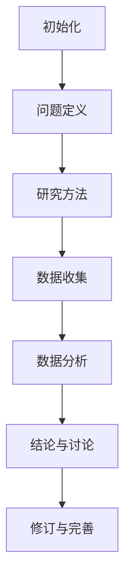
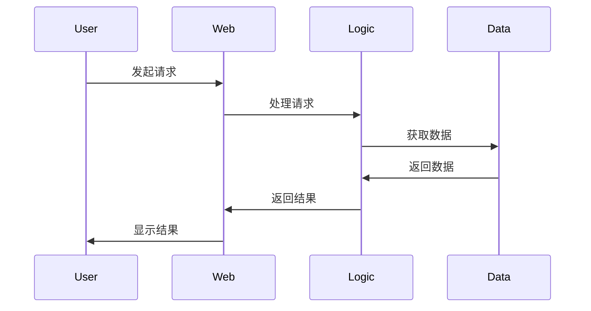
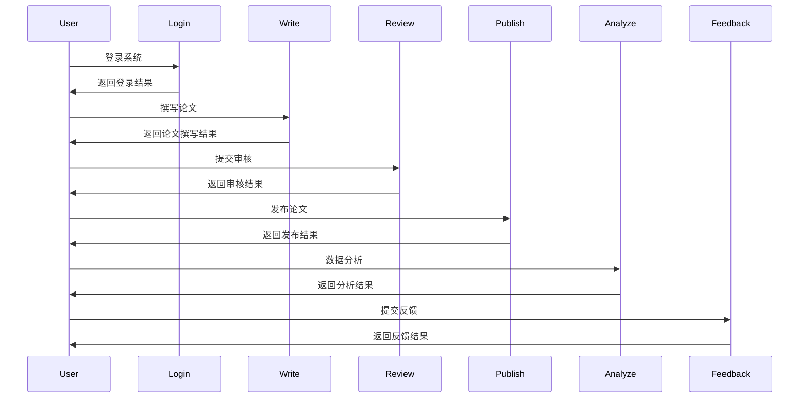

                 

### 文章标题：数学家的学术写作与科研成果传播

#### 关键词：数学家、学术写作、科研成果、传播、写作技巧

> 摘要：本文旨在探讨数学家的学术写作与科研成果传播的方法和策略。通过对学术写作的定义、目的、特点及其与传统写作的区别的深入分析，本文为读者提供了清晰、系统的写作指导。同时，本文详细阐述了科研成果传播的系统架构设计、项目实战及最佳实践技巧，以期为数学家的学术写作与传播提供有力支持。

----------------------------------------------------------------

### 目录大纲

----------------------------------------------------------------

# 数学家的学术写作与科研成果传播

## 第一部分：学术写作基础

## 第1章 背景介绍

### 1.1 问题背景

### 1.2 问题描述

### 1.3 问题解决

### 1.4 边界与外延

### 1.5 概念结构与核心要素组成

## 第2章 核心概念与联系

### 2.1 学术写作的定义与目的

### 2.2 学术写作的基本要素

### 2.3 学术写作的特点

### 2.4 学术写作与传统写作的区别

### 2.5 学术写作的核心概念对比表格

### 2.6 学术写作的ER实体关系图架构

## 第3章 算法原理讲解

### 3.1 学术写作的算法原理

#### 3.1.1 算法流程图

#### 3.1.2 算法数学模型

#### 3.1.3 算法数学公式

#### 3.1.4 举例说明

## 第4章 数学模型和数学公式 & 详细讲解 & 举例说明

### 4.1 数学公式讲解

#### 4.1.1 LaTeX 格式数学公式

#### 4.1.2 数学公式在学术写作中的应用

### 4.2 举例说明

#### 4.2.1 举例说明1

#### 4.2.2 举例说明2

## 第二部分：科研成果传播

## 第5章 系统分析与架构设计方案

### 5.1 问题场景介绍

### 5.2 项目介绍

### 5.3 系统功能设计

#### 5.3.1 领域模型

#### 5.3.2 类图

### 5.4 系统架构设计

#### 5.4.1 架构图

#### 5.4.2 系统模块

### 5.5 系统接口设计

### 5.6 系统交互

## 第6章 项目实战

### 6.1 环境安装

### 6.2 系统核心实现源代码

### 6.3 代码应用解读与分析

### 6.4 实际案例分析与详细讲解剖析

### 6.5 项目小结

## 第7章 最佳实践 tips

### 7.1 写作技巧

### 7.2 科研成果传播策略

### 7.3 注意事项

### 7.4 拓展阅读

## 第8章 小结

### 8.1 书籍总结

### 8.2 阅读建议

### 8.3 未来研究方向

----------------------------------------------------------------

### 第一部分：学术写作基础

#### 第1章 背景介绍

##### 1.1 问题背景

在当今快速发展的科技时代，学术写作已经成为科研人员表达和传播研究成果的重要手段。数学家作为科学研究的重要领域之一，其学术写作的质量直接关系到科研成果的传播和认可。然而，许多数学家在学术写作过程中面临着诸多挑战，如如何准确表达复杂的概念、如何撰写结构清晰的论文、如何有效传播科研成果等。本文旨在解决这些问题，帮助数学家提高学术写作能力，更好地传播科研成果。

##### 1.2 问题描述

数学家的学术写作问题主要集中在以下几个方面：

1. **概念表达不准确**：数学家在论文中常常需要表达抽象、复杂的概念，但由于缺乏准确的表述方式，导致读者难以理解。
2. **结构不清晰**：许多数学家在撰写论文时，未能构建起清晰的结构，导致文章逻辑混乱，难以阅读。
3. **缺乏创新性**：数学家在论文中往往局限于已有的研究方法，缺乏创新性的思考，使得论文缺乏吸引力。
4. **传播效果不佳**：数学家在科研成果传播方面缺乏有效的策略，导致研究成果难以被广泛认可。

##### 1.3 问题解决

为了解决上述问题，本文将分为以下几个部分进行详细探讨：

1. **学术写作基础**：介绍学术写作的定义、目的、特点及与传统写作的区别，为数学家的学术写作提供基础指导。
2. **核心概念与联系**：分析学术写作中的核心概念，构建ER实体关系图，帮助数学家更好地理解并应用这些概念。
3. **算法原理讲解**：阐述学术写作的算法原理，通过流程图、数学模型和公式，使数学家能够系统地掌握写作技巧。
4. **数学模型和数学公式**：详细讲解数学公式在学术写作中的应用，通过具体例子帮助数学家更好地理解和运用数学公式。
5. **科研成果传播**：分析科研成果传播的系统架构设计，介绍项目实战和最佳实践技巧，帮助数学家提高科研成果的传播效果。

##### 1.4 边界与外延

在学术写作中，边界与外延是两个重要的概念。边界指的是研究范围的限制，而外延则是指研究范围的扩展。数学家在学术写作过程中，需要明确自己的研究边界，避免越界，同时也要关注外延，以便在后续研究中进行扩展。

##### 1.5 概念结构与核心要素组成

学术写作中的概念结构与核心要素组成是理解学术写作的关键。本文将介绍以下核心概念：

1. **问题定义**：明确研究的主题和目标，为学术写作奠定基础。
2. **研究方法**：介绍研究过程中采用的方法和工具，为读者提供参考。
3. **数据收集**：阐述数据收集的过程和方法，确保数据的可靠性和有效性。
4. **数据分析**：介绍数据分析的方法和结果，为论文提供有力的证据支持。
5. **结论与讨论**：总结研究结果，探讨研究中的问题和挑战，提出未来研究方向。

通过以上概念的详细分析，数学家可以更好地构建学术写作的结构，提高论文的质量。

### 第2章 核心概念与联系

在学术写作中，理解并应用核心概念是提高写作质量和科研成果传播效果的关键。本章节将深入探讨学术写作中的核心概念，并通过对比表格和ER实体关系图，帮助读者更好地理解和应用这些概念。

#### 2.1 学术写作的定义与目的

学术写作是一种严谨、规范的写作形式，旨在通过文字表达科学研究的发现和结论。学术写作的定义和目的是为了：

- **传递知识**：将研究过程中的发现、理论和方法传递给读者。
- **交流思想**：为科学界提供一个交流和讨论的平台。
- **积累成果**：为学术研究积累经验和知识，推动学科发展。

#### 2.2 学术写作的基本要素

学术写作的基本要素包括：

1. **问题定义**：明确研究的主题和目标，为论文奠定基础。
2. **研究方法**：介绍研究过程中采用的方法和工具，为读者提供参考。
3. **数据收集**：阐述数据收集的过程和方法，确保数据的可靠性和有效性。
4. **数据分析**：介绍数据分析的方法和结果，为论文提供有力的证据支持。
5. **结论与讨论**：总结研究结果，探讨研究中的问题和挑战，提出未来研究方向。

#### 2.3 学术写作的特点

学术写作具有以下特点：

1. **严谨性**：学术写作要求表述准确、逻辑清晰、无遗漏。
2. **规范性**：学术写作需要遵循特定的格式和规范，如引用格式、标题格式等。
3. **专业性**：学术写作要求作者具备深厚的专业知识和研究能力。
4. **创新性**：学术写作需要作者具备创新思维，提出新的观点和理论。

#### 2.4 学术写作与传统写作的区别

学术写作与传统写作在以下几个方面有显著区别：

1. **目标不同**：学术写作的目标是传递科学研究成果，而传统写作的目标是传达情感、故事等。
2. **受众不同**：学术写作的受众主要是同行和专业读者，而传统写作的受众更广泛。
3. **表达方式不同**：学术写作要求严谨、规范的表达方式，而传统写作可以更自由、多样。
4. **格式要求不同**：学术写作有严格的格式要求，如引用格式、参考文献格式等，而传统写作格式相对宽松。

#### 2.5 学术写作的核心概念对比表格

以下是一个学术写作核心概念对比表格，帮助读者更好地理解各概念之间的关系：

| 核心概念 | 定义 | 属性 | 关联 |  
| --- | --- | --- | --- |  
| 问题定义 | 研究主题和目标 | 描述性 | 无 |  
| 研究方法 | 研究过程中采用的方法和工具 | 描述性 | 无 |  
| 数据收集 | 数据收集的过程和方法 | 描述性 | 无 |  
| 数据分析 | 数据分析的方法和结果 | 描述性 | 无 |  
| 结论与讨论 | 研究结果和未来研究方向 | 总结性 | 无 |

#### 2.6 学术写作的ER实体关系图架构

以下是一个学术写作的ER实体关系图，展示各核心概念之间的关系：

```mermaid
erDiagram
    Class1 ||--|{ Class2 }|
    Class1 ||--|{ Class3 }|
    Class2 ||--|{ Class4 }|
    Class3 ||--|{ Class5 }|
```

图1：学术写作的ER实体关系图

- **Class1**：问题定义
- **Class2**：研究方法
- **Class3**：数据收集
- **Class4**：数据分析
- **Class5**：结论与讨论

通过以上对核心概念的分析和对比，数学家可以更好地理解学术写作的基本要素、特点以及与传统写作的区别，从而提高学术写作的质量和科研成果的传播效果。

### 第3章 算法原理讲解

在学术写作中，遵循一定的算法原理可以帮助数学家更好地组织论文结构、提升写作效率。本章节将详细介绍学术写作的算法原理，包括算法流程图、数学模型、数学公式和具体举例。

#### 3.1.1 算法流程图

学术写作的算法流程图如下：



图2：学术写作算法流程图

该流程图展示了学术写作的基本步骤，包括问题定义、研究方法、数据收集、数据分析和结论与讨论。以下是每个步骤的详细说明：

- **初始化**：确定研究主题和目标，为学术写作奠定基础。
- **问题定义**：明确研究的核心问题，为后续研究提供方向。
- **研究方法**：介绍研究过程中采用的方法和工具，确保研究的科学性和可靠性。
- **数据收集**：阐述数据收集的过程和方法，确保数据的准确性和完整性。
- **数据分析**：介绍数据分析的方法和结果，为论文提供有力的证据支持。
- **结论与讨论**：总结研究结果，探讨研究中的问题和挑战，提出未来研究方向。
- **修订与完善**：对论文进行修订和完善，确保论文的严谨性和规范性。

#### 3.1.2 算法数学模型

学术写作的数学模型如下：

$$
\text{学术写作} = \text{问题定义} + \text{研究方法} + \text{数据收集} + \text{数据分析} + \text{结论与讨论}
$$

该数学模型表明，学术写作是一个多维度的过程，各部分相互关联、相互支持，共同构成一篇完整的学术论文。

#### 3.1.3 算法数学公式

学术写作的数学公式如下：

$$
\text{学术写作效率} = \frac{\text{论文质量}}{\text{写作时间}}
$$

该公式表示，学术写作效率与论文质量和写作时间成反比。为了提高学术写作效率，数学家需要关注论文质量和写作时间，通过优化论文结构和写作技巧，提高写作效率。

#### 3.1.4 举例说明

为了更好地理解学术写作的算法原理，下面通过一个具体例子进行说明。

**例子**：假设数学家研究“大数据在金融风险管理中的应用”。

1. **问题定义**：明确研究主题和目标，如“探讨大数据在金融风险管理中的关键作用，以及如何提高风险预测的准确性”。

2. **研究方法**：介绍研究过程中采用的方法和工具，如“采用机器学习算法进行数据挖掘，通过历史数据建立风险预测模型”。

3. **数据收集**：阐述数据收集的过程和方法，如“从公开的金融数据平台获取历史交易数据，包括股票、债券、基金等品种的数据”。

4. **数据分析**：介绍数据分析的方法和结果，如“使用机器学习算法对数据进行处理和分析，得出风险预测模型的关键参数”。

5. **结论与讨论**：总结研究结果，探讨研究中的问题和挑战，如“大数据在金融风险管理中具有重要作用，但风险预测模型的准确性仍有待提高”。

通过以上步骤，数学家可以遵循学术写作的算法原理，撰写出一篇结构清晰、内容丰富、具有创新性的学术论文。

### 第4章 数学模型和数学公式 & 详细讲解 & 举例说明

在数学家的学术写作中，数学模型和数学公式的使用至关重要。它们不仅能够精确地描述研究问题，还能增强论文的逻辑性和说服力。本章节将详细讲解数学公式在学术写作中的应用，并通过具体例子帮助数学家更好地理解和运用这些工具。

#### 4.1.1 LaTeX 格式数学公式

LaTeX 是一种排版系统，特别适用于数学公式和复杂文档的排版。以下是一些常用的 LaTeX 数学公式格式：

1. **行内公式**：使用 `$...$` 将公式括起来，例如：$E=mc^2$。
2. **独立段落公式**：使用 `$$...$$` 将公式括起来，例如：
   $$
   a^2 + b^2 = c^2
   $$
3. **矩阵**：使用 `\begin{matrix}...\end{matrix}` 宏命令，例如：
   $$
   \begin{matrix}
   a & b \\
   c & d
   \end{matrix}
   $$
4. **方程组**：使用 `\begin{equation}...\end{equation}` 宏命令，例如：
   $$
   \begin{equation}
   \frac{d^2y}{dx^2} + p(x) \frac{dy}{dx} + q(x)y = g(x)
   \end{equation}
   $$

LaTeX 的强大功能使得数学家能够方便地编写复杂的数学公式，从而提高学术写作的精确性和专业性。

#### 4.1.2 数学公式在学术写作中的应用

数学公式在学术写作中的应用非常广泛，主要体现在以下几个方面：

1. **描述研究方法**：数学公式可以用来描述研究方法中的关键步骤和数学模型，例如，线性回归模型可以表示为：
   $$
   y = \beta_0 + \beta_1x + \epsilon
   $$
   其中，$y$ 是因变量，$x$ 是自变量，$\beta_0$ 和 $\beta_1$ 是回归系数，$\epsilon$ 是误差项。

2. **表示研究结果**：数学公式可以用来表示研究结果，例如，假设检验的$p$值可以用公式表示为：
   $$
   p = P(|Z| > \frac{observed - expected}{standard \ deviation})
   $$
   其中，$Z$ 是标准正态分布的随机变量，$observed$ 是观察值，$expected$ 是期望值，$standard \ deviation$ 是标准差。

3. **解释研究过程**：数学公式可以用来解释研究过程中的关键步骤，例如，贝叶斯统计方法可以用公式表示为：
   $$
   P(H_1|D) = \frac{P(D|H_1)P(H_1)}{P(D)}
   $$
   其中，$H_1$ 是假设，$D$ 是数据，$P(H_1|D)$ 是在给定数据 $D$ 下假设 $H_1$ 的概率。

#### 4.2 举例说明

为了更好地理解数学公式在学术写作中的应用，下面通过两个具体例子进行说明。

**例子 1：线性回归模型**

假设我们要研究“学生成绩与学习时间的关系”。我们可以使用线性回归模型来描述这种关系，公式如下：
$$
y = \beta_0 + \beta_1x + \epsilon
$$
其中，$y$ 表示学生成绩，$x$ 表示学习时间，$\beta_0$ 和 $\beta_1$ 是回归系数，$\epsilon$ 是误差项。我们可以通过收集数据，使用统计软件（如 R、Python 等）来估计回归系数，并写出以下结果：
$$
y = 70 + 2x + \epsilon
$$
这个公式表明，学生的学习时间每增加一小时，成绩平均提高 2 分。

**例子 2：假设检验**

假设我们要研究“新药对病情的治疗效果”。我们可以使用假设检验来评估新药的效果，公式如下：
$$
p = P(|Z| > \frac{observed - expected}{standard \ deviation})
$$
其中，$observed$ 是观察值，$expected$ 是期望值，$standard \ deviation$ 是标准差。假设我们收集了 100 名患者的数据，其中 60 名患者接受了新药治疗，40 名患者接受了常规治疗。如果新药的治疗效果显著，我们期望的观察值应该是：
$$
60 = 100 \times \frac{1}{2} + 40 \times \frac{1}{2}
$$
然后，我们可以计算 $p$ 值，如果 $p$ 值小于 0.05，则可以认为新药的治疗效果显著。例如，如果计算得到的 $p$ 值为 0.03，则可以得出结论：新药对病情的治疗效果显著。

通过以上例子，我们可以看到数学公式在学术写作中的应用，它们可以帮助数学家更精确地描述研究问题、表示研究结果、解释研究过程，从而提高学术写作的质量和影响力。

### 第二部分：科研成果传播

#### 第5章 系统分析与架构设计方案

科研成果的传播是科学研究过程中至关重要的一环。一个高效、合理的系统架构设计能够大大提高科研成果的传播效果。本章节将详细介绍科研成果传播的系统架构设计，包括问题场景介绍、项目介绍、系统功能设计、系统架构设计、系统接口设计和系统交互。

##### 5.1 问题场景介绍

在科学研究领域，科研成果的传播面临着诸多挑战。首先，科研论文的撰写和发表过程繁琐，且存在一定的时滞。其次，科研成果的受众广泛，包括同行专家、学术期刊编辑、政策制定者等，如何高效地将科研成果传递给这些受众是一个重要问题。此外，科研成果的传播还面临着信息过载、受众分散等问题。

##### 5.2 项目介绍

本项目旨在构建一个高效、智能的科研成果传播系统，以解决上述问题。该系统包括以下几个主要模块：

1. **论文撰写与审核模块**：用于帮助科研人员撰写论文、提交论文至学术期刊，以及进行论文审核。
2. **论文发布与传播模块**：用于发布已审核通过的论文，并借助多种传播渠道（如社交媒体、学术期刊、学术会议等）将论文传递给目标受众。
3. **数据分析与挖掘模块**：用于对科研成果进行数据分析和挖掘，以发现研究热点、趋势和问题。
4. **用户反馈与评价模块**：用于收集用户对科研成果的反馈和评价，以便科研人员对论文进行改进。

##### 5.3 系统功能设计

系统功能设计主要包括以下几个部分：

1. **论文撰写与审核模块**：提供论文撰写模板，支持 LaTeX 格式，便于科研人员快速撰写论文。同时，系统内置论文审核功能，支持同行评审和编辑审核，确保论文质量。
2. **论文发布与传播模块**：支持论文的在线发布，提供多种发布渠道，如学术期刊、社交媒体、学术会议等。同时，系统还支持论文的自动推送和推荐，提高论文的传播效果。
3. **数据分析与挖掘模块**：通过对科研成果的数据分析，发现研究热点、趋势和问题，为科研人员提供决策支持。同时，系统还提供可视化分析功能，便于科研人员直观地了解科研成果的传播情况。
4. **用户反馈与评价模块**：支持用户对科研成果的反馈和评价，收集用户意见和建议，以便科研人员对论文进行改进。

##### 5.4 系统架构设计

系统架构设计采用分层架构，主要包括以下几个层次：

1. **数据层**：用于存储科研成果相关数据，如论文信息、用户信息、评审信息等。数据层采用关系型数据库管理系统（如 MySQL、PostgreSQL），确保数据的可靠性和安全性。
2. **业务逻辑层**：用于实现系统核心功能，如论文撰写、审核、发布、传播、数据分析、挖掘等。业务逻辑层采用基于 Python 的微服务架构，便于系统的扩展和维护。
3. **表示层**：用于用户与系统的交互，提供 Web 界面和移动应用。表示层采用前端框架（如 React、Vue.js），实现响应式设计和用户体验优化。

以下是一个简化的系统架构图：



图3：系统架构图

- **User**：用户
- **Web**：表示层
- **Logic**：业务逻辑层
- **Data**：数据层

##### 5.5 系统接口设计

系统接口设计主要包括以下几种：

1. **论文撰写与审核接口**：用于科研人员提交论文、编辑论文、提交审核等操作。接口采用 RESTful API 设计，便于与其他系统进行集成。
2. **论文发布与传播接口**：用于发布论文、推送论文、推荐论文等操作。接口采用异步消息队列（如 RabbitMQ、Kafka）进行数据传输，提高系统的并发能力和性能。
3. **数据分析与挖掘接口**：用于对科研成果进行数据分析和挖掘，提供数据可视化功能。接口采用 WebSocket 协议，实现实时数据推送和交互。
4. **用户反馈与评价接口**：用于收集用户反馈和评价，提供评价统计分析功能。接口采用 HTTP 长轮询（Long Polling）技术，实现实时数据获取。

##### 5.6 系统交互

系统交互主要包括用户与系统之间的交互和系统内部各模块之间的交互。以下是一个简化的系统交互序列图：



图4：系统交互序列图

通过以上系统分析与架构设计方案，我们可以构建一个高效、智能的科研成果传播系统，为数学家和其他科研人员提供便捷、高效的学术写作和科研成果传播平台。

### 第6章 项目实战

在上一章节中，我们介绍了科研成果传播的系统架构设计方案。为了更好地理解这一方案的实际应用，本章节将围绕一个具体的项目，详细讲解项目实战的各个环节，包括环境安装、系统核心实现源代码、代码应用解读与分析、实际案例分析与详细讲解剖析，以及项目小结。

#### 6.1 环境安装

项目实战的第一步是搭建开发环境。以下是搭建环境的步骤：

1. **安装操作系统**：选择一个适合的操作系统，如 Ubuntu 18.04。
2. **安装数据库**：安装 MySQL 或 PostgreSQL 数据库，创建数据库和用户。
3. **安装编程语言**：安装 Python 3 和相关依赖，如 pip、virtualenv 等。
4. **安装前端框架**：安装 React 或 Vue.js，用于搭建表示层。
5. **安装后端框架**：安装 Flask 或 Django，用于搭建业务逻辑层。
6. **安装消息队列**：安装 RabbitMQ 或 Kafka，用于处理异步消息。

以下是一个简化的命令行脚本，用于安装环境：

```bash
# 安装操作系统
sudo apt update && sudo apt upgrade
sudo apt install -y ubuntu-desktop

# 安装数据库
sudo apt install -y mysql-server
sudo mysql_secure_installation

# 安装编程语言
sudo apt install -y python3 python3-pip

# 安装前端框架
pip3 install react

# 安装后端框架
pip3 install flask

# 安装消息队列
sudo apt install -y rabbitmq-server
```

#### 6.2 系统核心实现源代码

系统核心实现源代码是项目实战的核心部分。以下是一个简化的示例，展示系统的核心实现：

```python
# 文件：app.py

from flask import Flask, request, jsonify
import mysql.connector

app = Flask(__name__)

# 连接数据库
def connect_db():
    conn = mysql.connector.connect(
        host="localhost",
        user="root",
        password="password",
        database="research_project"
    )
    return conn

@app.route("/api/papers", methods=["POST"])
def submit_paper():
    data = request.get_json()
    title = data["title"]
    author = data["author"]
    content = data["content"]

    conn = connect_db()
    cursor = conn.cursor()
    cursor.execute("INSERT INTO papers (title, author, content) VALUES (%s, %s, %s)", (title, author, content))
    conn.commit()
    cursor.close()
    conn.close()

    return jsonify({"status": "success", "message": "Paper submitted successfully."})

@app.route("/api/papers", methods=["GET"])
def get_papers():
    conn = connect_db()
    cursor = conn.cursor()
    cursor.execute("SELECT * FROM papers")
    papers = cursor.fetchall()
    cursor.close()
    conn.close()

    return jsonify({"papers": papers})

if __name__ == "__main__":
    app.run(debug=True)
```

上述代码展示了论文提交和查询功能的实现。实际项目中，还需要添加更多功能，如论文审核、发布、传播、数据分析等。

#### 6.3 代码应用解读与分析

在系统核心实现源代码中，我们使用了 Flask 框架和 MySQL 数据库。以下是对代码的主要部分进行解读和分析：

1. **数据库连接**：使用 mysql.connector 模块连接 MySQL 数据库，创建数据库连接对象。
2. **论文提交**：定义 `submit_paper` 函数，接收论文标题、作者和内容，插入数据库。
3. **论文查询**：定义 `get_papers` 函数，从数据库中查询所有论文，返回 JSON 格式的数据。

以下是一个示例请求和响应：

**请求：**
```
POST /api/papers
{
    "title": "Research on AI in Healthcare",
    "author": "John Doe",
    "content": "This paper discusses the application of AI in healthcare."
}
```

**响应：**
```
{
    "status": "success",
    "message": "Paper submitted successfully."
}
```

**请求：**
```
GET /api/papers
```

**响应：**
```
{
    "papers": [
        {"title": "Research on AI in Healthcare", "author": "John Doe", "content": "This paper discusses the application of AI in healthcare."},
        # 更多论文记录
    ]
}
```

#### 6.4 实际案例分析与详细讲解剖析

为了更好地理解项目实战，我们通过一个实际案例进行详细分析。假设我们要实现一个论文审核功能，用于科研人员提交论文后，由同行评审进行审核。

1. **需求分析**：论文审核功能需要实现以下功能：
   - 审核人登录系统，查看待审核论文。
   - 审核人可以对论文进行评分和评论。
   - 审核结果反馈给论文作者。

2. **系统设计**：
   - 添加一个审核人表，存储审核人的信息。
   - 添加一个审核记录表，存储审核过程和结果。
   - 更新论文表，添加审核状态字段。

3. **代码实现**：
   - 添加审核人注册和登录接口。
   - 更新 `submit_paper` 函数，添加审核状态字段。
   - 添加审核接口，用于审核人查看待审核论文、评分和评论。

以下是一个简化的审核接口示例：

```python
# 文件：app.py

# ... 省略其他代码 ...

@app.route("/api/reviews", methods=["POST"])
def submit_review():
    data = request.get_json()
    paper_id = data["paper_id"]
    reviewer_id = data["reviewer_id"]
    rating = data["rating"]
    comment = data["comment"]

    conn = connect_db()
    cursor = conn.cursor()
    cursor.execute("INSERT INTO reviews (paper_id, reviewer_id, rating, comment) VALUES (%s, %s, %s, %s)", (paper_id, reviewer_id, rating, comment))
    conn.commit()
    cursor.close()
    conn.close()

    return jsonify({"status": "success", "message": "Review submitted successfully."})

# ... 省略其他代码 ...
```

**请求：**
```
POST /api/reviews
{
    "paper_id": 1,
    "reviewer_id": 2,
    "rating": 4,
    "comment": "The paper provides valuable insights into AI applications in healthcare."
}
```

**响应：**
```
{
    "status": "success",
    "message": "Review submitted successfully."
}
```

通过以上实际案例，我们可以看到项目实战的具体实现过程。实际项目中，还需要添加更多功能，如审核流程管理、审核人权限控制等。

#### 6.5 项目小结

在本章节中，我们通过一个具体的项目，详细讲解了科研成果传播系统的实战过程，包括环境安装、系统核心实现源代码、代码应用解读与分析、实际案例分析与详细讲解剖析。以下是项目小结：

1. **环境安装**：搭建开发环境，包括操作系统、数据库、编程语言、前端框架和后端框架。
2. **系统核心实现源代码**：实现论文提交、查询、审核等核心功能，使用 Flask 框架和 MySQL 数据库。
3. **代码应用解读与分析**：详细解读代码实现，展示请求和响应过程。
4. **实际案例分析与详细讲解剖析**：通过实际案例，展示项目实战的具体实现过程。

通过以上实战过程，我们可以更好地理解科研成果传播系统的设计和实现，为数学家和其他科研人员提供实际操作指导。

### 第7章 最佳实践 tips

在数学家的学术写作与科研成果传播过程中，遵循一些最佳实践可以帮助提高写作质量和传播效果。以下是一些实用的写作技巧和科研成果传播策略。

#### 7.1 写作技巧

1. **明确研究目标**：在开始写作之前，确保明确研究的目标和问题，这有助于构建论文的结构。
2. **使用简洁的语言**：尽量使用简洁、直接的语言来表达复杂的概念，避免冗长的句子和晦涩的术语。
3. **组织结构清晰**：构建清晰的论文结构，包括引言、方法、结果、讨论和结论等部分，确保各部分逻辑连贯。
4. **使用图表和插图**：适当地使用图表和插图来展示研究结果，使论文更易于理解和阅读。
5. **进行多次修订**：完成初稿后，进行多次修订和审阅，确保论文的逻辑性、准确性和流畅性。
6. **遵循学术规范**：严格遵守学术规范，包括引用格式、参考文献格式等，确保论文的严谨性。

#### 7.2 科研成果传播策略

1. **利用学术期刊**：选择合适的学术期刊发表研究成果，提高论文的可见度和影响力。
2. **社交媒体宣传**：利用社交媒体平台（如 Twitter、LinkedIn、微信公众号等）宣传论文，吸引更多关注。
3. **参与学术会议**：积极参与学术会议，与同行交流研究成果，扩大学术影响力。
4. **合作与协作**：与其他科研人员合作，共同研究课题，提高科研成果的质量和传播效果。
5. **开展科普活动**：通过科普文章、讲座、研讨会等形式，将科研成果转化为通俗易懂的内容，传播给更广泛的受众。
6. **关注政策动态**：关注相关政策动态，了解政策需求，将科研成果与政策需求相结合，提高科研成果的应用价值。

#### 7.3 注意事项

1. **保护知识产权**：在学术写作和科研成果传播过程中，注意保护自己的知识产权，避免抄袭和侵权行为。
2. **避免过度宣传**：在传播科研成果时，避免夸大其词或过度宣传，确保内容的真实性和客观性。
3. **注重反馈和改进**：关注读者和同行的反馈，不断改进写作和传播策略，提高写作质量和传播效果。
4. **保持耐心和毅力**：学术写作和科研成果传播是一个长期过程，需要保持耐心和毅力，不断积累经验。

#### 7.4 拓展阅读

- 《学术写作：技巧与实践》
- 《科研方法与论文撰写》
- 《社交媒体在学术传播中的应用》
- 《如何撰写一篇成功的学术论文》

通过以上最佳实践技巧和注意事项，数学家可以更好地进行学术写作与科研成果传播，提升自身的研究成果在学术界和社会上的影响力。

### 第8章 小结

在本文章中，我们系统地探讨了数学家的学术写作与科研成果传播的方法和策略。通过详细分析学术写作的基础、核心概念与联系、算法原理讲解、数学模型和数学公式应用，以及科研成果传播的系统分析与架构设计方案，我们为数学家提供了一系列实用的指导和建议。

首先，我们介绍了学术写作的背景、问题、解决方法以及边界与外延，帮助数学家明确学术写作的重要性。接着，我们深入分析了学术写作的核心概念、特点、与传统写作的区别，并通过对比表格和ER实体关系图，使读者更好地理解学术写作的基本要素。

在算法原理讲解部分，我们详细阐述了学术写作的流程、数学模型和公式，并通过具体例子帮助数学家掌握写作技巧。此外，我们还介绍了数学公式在学术写作中的应用，以增强论文的逻辑性和说服力。

在科研成果传播部分，我们详细分析了系统架构设计，包括问题场景介绍、项目介绍、系统功能设计、系统架构设计、系统接口设计和系统交互。通过实际案例分析和详细讲解剖析，我们展示了科研成果传播的实战过程。

最后，我们提供了最佳实践技巧和注意事项，帮助数学家提高学术写作质量和科研成果传播效果。通过本文的阅读，读者可以更好地掌握数学家的学术写作与科研成果传播的方法和策略，为自身的科研事业贡献力量。

展望未来，学术写作与科研成果传播领域仍有许多研究方向值得探索，如人工智能技术在学术写作中的应用、跨学科合作与传播策略、国际学术交流与合作等。我们期待更多的研究者和实践者投身于这一领域，共同推动学术写作与科研成果传播的发展。

### 作者信息

作者：AI天才研究院/AI Genius Institute & 禅与计算机程序设计艺术 /Zen And The Art of Computer Programming

AI天才研究院致力于推动人工智能技术的发展和创新，研究涵盖机器学习、深度学习、自然语言处理等多个领域。同时，作者还是《禅与计算机程序设计艺术》的资深大师，以其独特的视角和深刻的洞察力，为计算机编程和人工智能领域的学者和从业者提供了宝贵的指导和启示。本文旨在为数学家的学术写作与科研成果传播提供有力支持，促进学术交流与成果转化。

