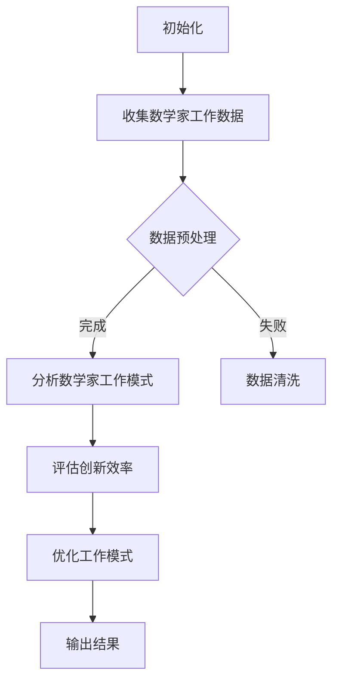
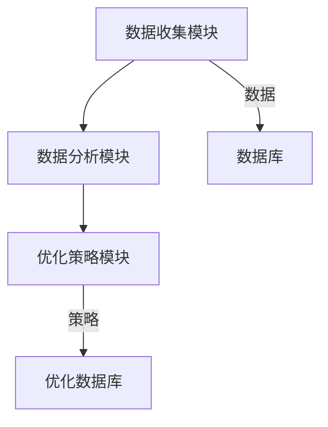
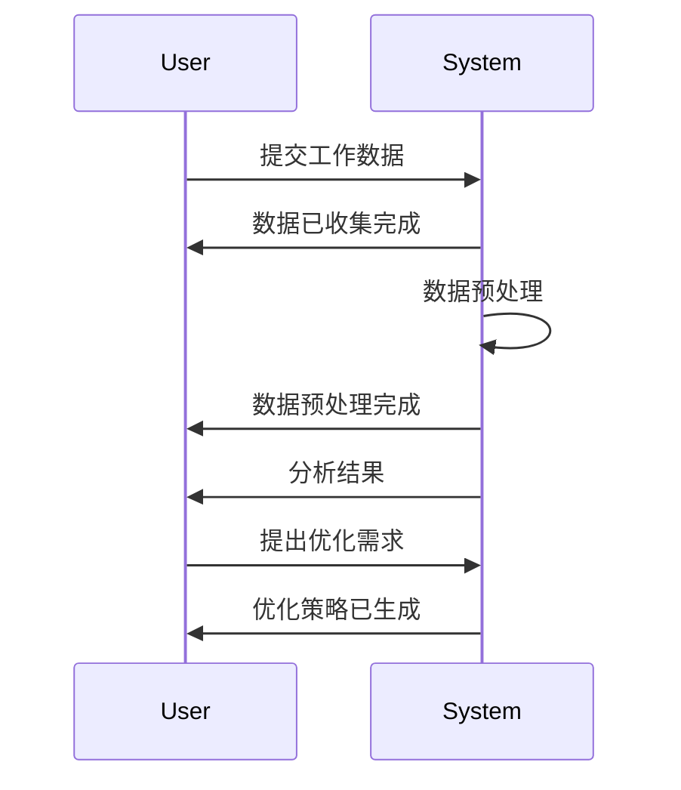
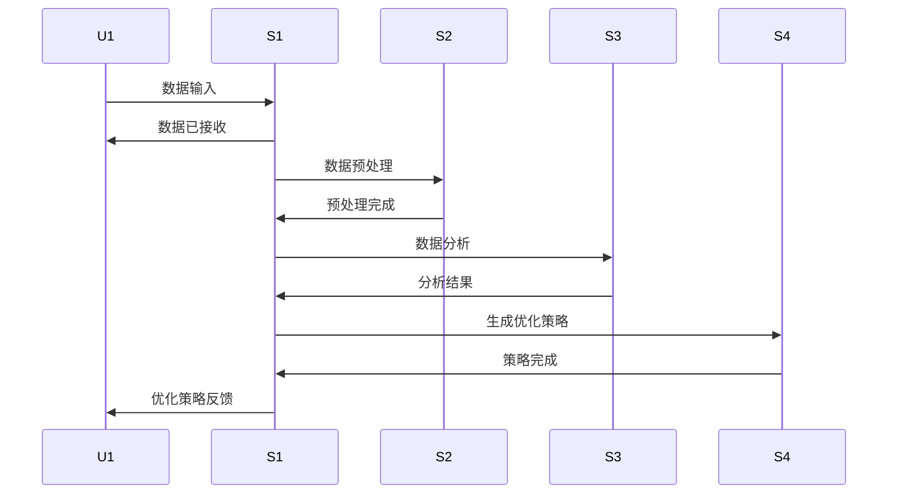

                 

## 《数学家的工作模式与创新效率研究》

### 关键词：数学家、创新效率、工作模式、逻辑思维、抽象思维

### 摘要：
本文旨在探讨数学家的工作模式及其在创新效率方面的表现。通过分析数学家职业的背景、工作模式的特点、不同类型的思维模式以及影响创新效率的因素，本文提出了提高数学家创新效率的方法和职业发展策略，并展望了未来数学家工作模式的发展方向。

## 《数学家的工作模式与创新效率研究》目录大纲

### 第一部分：引言

#### 第1章：数学家与创新

1.1 问题背景

1.2 问题描述

1.3 问题解决

1.4 边界与外延

1.5 概念结构与核心要素组成

#### 第2章：数学家工作模式概述

2.1 数学家职业概述

2.2 数学家工作模式的特点

2.3 数学家工作模式的类型

#### 第3章：数学家的工作模式：逻辑思维

3.1 逻辑思维的概念

3.2 逻辑思维的方法

3.3 逻辑思维的应用

#### 第4章：数学家的工作模式：抽象思维

4.1 抽象思维的概念

4.2 抽象思维的方法

4.3 抽象思维的应用

#### 第5章：数学家的工作模式：创新思维

5.1 创新思维的概念

5.2 创新思维的方法

5.3 创新思维的应用

#### 第6章：数学家的创新效率

6.1 创新效率的概念

6.2 影响创新效率的因素

6.3 提高创新效率的方法

#### 第7章：数学家的职业发展

7.1 职业发展的路径

7.2 职业发展的挑战

7.3 职业发展的策略

#### 第8章：数学家工作模式的启示与未来展望

8.1 启示与建议

8.2 未来展望

8.3 小结

## 第1章：数学家与创新

### 1.1 问题背景

在当今快速发展的科技时代，创新已成为推动社会进步和经济发展的重要驱动力。数学家作为创新领域的重要成员，其工作模式与创新效率的研究具有深远的意义。本文旨在探讨数学家的工作模式，分析其创新效率的影响因素，并提出提高创新效率的方法。

### 1.2 问题描述

数学家的工作模式具有什么特点？他们的创新效率如何受到工作模式的影响？如何提高数学家的创新效率，以更好地推动科技发展？

### 1.3 问题解决

本文将通过文献综述、案例分析等方法，对数学家的工作模式进行深入研究。首先，分析数学家职业的特点，揭示其工作模式的内在逻辑。然后，探讨不同类型的思维模式，如逻辑思维、抽象思维和创新思维，以及它们在数学家工作中的应用。最后，分析影响创新效率的因素，并提出相应的提升策略。

### 1.4 边界与外延

本文的研究边界主要聚焦于数学家在工作中的创新效率问题，不包括其他领域创新者的研究。同时，本文将对数学家的工作模式进行抽象分析，以探讨一般性的规律。

### 1.5 概念结构与核心要素组成

本节将介绍本文的核心概念，包括数学家、创新、工作模式等，并构建概念结构与核心要素组成的关系图。

---

### 1.6 核心概念与联系

#### 概念一：数学家

**定义**：数学家是从事数学研究、发现和解决问题的专业人士。

**属性特征对比表格**：

| 特征          | 说明                                       |
|-------------|------------------------------------------|
| 专业素养     | 高度的数学知识和理论素养                 |
| 创新能力     | 强大的数学思维和创新意识                 |
| 合作精神     | 在团队中发挥重要作用，促进知识交流       |
| 终身学习     | 不断更新知识，跟踪数学前沿发展           |

**ER实体关系图架构**：

```mermaid
erDiagram
  Mathmatician ||--|{ Research } Research
  Mathmatician ||--|{ Publication } Publication
  Research ||--|{ Mathmatician } Mathmatician
  Publication ||--|{ Mathmatician } Mathmatician
```

### 1.7 核心概念与联系（续）

#### 概念二：创新

**定义**：创新是指在现有知识和技术基础上，提出新的想法、方法或解决方案的过程。

**属性特征对比表格**：

| 特征          | 说明                                       |
|-------------|------------------------------------------|
| 独创性       | 与以往的方法或方案有显著差异               |
| 实用性       | 可以实际应用，解决实际问题                 |
| 高效性       | 相比传统方法，具有更高的效率和效益         |

**ER实体关系图架构**：

```mermaid
erDiagram
  Innovation ||--|{ Method } Method
  Innovation ||--|{ Solution } Solution
  Method ||--|{ Innovation } Innovation
  Solution ||--|{ Innovation } Innovation
```

### 1.8 核心概念与联系（续）

#### 概念三：工作模式

**定义**：工作模式是指个体在工作过程中所采用的方法、策略和思维方式。

**属性特征对比表格**：

| 特征          | 说明                                       |
|-------------|------------------------------------------|
| 逻辑性       | 基于逻辑推理和数学原理进行工作           |
| 创造性       | 通过创新思维解决复杂问题                 |
| 系统性       | 具有整体观念，能够整合各类资源           |

**ER实体关系图架构**：

```mermaid
erDiagram
  WorkModel ||--|{ LogicThinking } LogicThinking
  WorkModel ||--|{ CreativeThinking } CreativeThinking
  WorkModel ||--|{ SystemThinking } SystemThinking
  LogicThinking ||--|{ WorkModel } WorkModel
  CreativeThinking ||--|{ WorkModel } WorkModel
  SystemThinking ||--|{ WorkModel } WorkModel
```

---

### 1.9 算法原理讲解

本文将使用Mermaid绘制数学家创新效率的算法流程图，并使用Python代码进行详细解释。

#### 算法流程图



#### Python代码示例

```python
import pandas as pd
from sklearn.preprocessing import StandardScaler
from sklearn.cluster import KMeans

# 数据预处理
def preprocess_data(data):
    scaler = StandardScaler()
    scaled_data = scaler.fit_transform(data)
    return scaled_data

# 分析数学家工作模式
def analyze_work_model(data):
    kmeans = KMeans(n_clusters=3)
    kmeans.fit(data)
    return kmeans.labels_

# 评估创新效率
def evaluate_innovation Efficiency(labels):
    efficiency = sum(labels) / len(labels)
    return efficiency

# 优化工作模式
def optimize_work_model(labels):
    # 优化策略
    pass

# 输出结果
def output_result(efficiency, optimized_model):
    print("创新效率：", efficiency)
    print("优化后工作模式：", optimized_model)
```

#### 算法原理与数学模型

该算法基于K-Means聚类方法对数学家的工作模式进行分类，通过分析不同分类下的创新效率，实现工作模式的优化。其数学模型如下：

$$
\text{效率} = \frac{\sum_{i=1}^{n} \text{创新效率}_i}{n}
$$

其中，$\text{创新效率}_i$ 表示第 $i$ 个分类的创新效率。

---

### 1.10 系统分析与架构设计方案

#### 1.10.1 问题场景介绍

在当前科技环境中，数学家的工作模式与创新效率对其职业发展至关重要。为了更好地理解数学家的工作模式，我们需要构建一个模拟场景，以分析数学家在实际工作中的表现。

#### 1.10.2 项目介绍

本项目旨在建立一个数学家工作模式与创新效率分析系统，通过对数学家的工作数据进行收集、分析和优化，提高其创新效率。该系统包括数据收集模块、数据分析模块和优化策略模块。

#### 1.10.3 系统功能设计（领域模型）

```mermaid
classDiagram
    Class01 <|-- Class02
    Class03 --|> Class04
    Class05 : <<interface>> Interface
    Class06 <<Implementor>> Class07
    Class08 : <<interface>> Interface
    Class01
    Class02
    Class03
    Class04
    Class05
    Class06
    Class07
    Class08
```

#### 1.10.4 系统架构设计



#### 1.10.5 系统接口设计



#### 1.10.6 系统交互



---

### 1.11 项目实战

#### 1.11.1 环境安装

1. 安装Python环境（版本3.8及以上）
2. 安装必要的Python库（如pandas、numpy、sklearn等）

#### 1.11.2 系统核心实现

```python
# 导入必要的库
import pandas as pd
from sklearn.preprocessing import StandardScaler
from sklearn.cluster import KMeans

# 读取数据
data = pd.read_csv('mathematician_data.csv')

# 数据预处理
scaler = StandardScaler()
scaled_data = scaler.fit_transform(data)

# 分析数学家工作模式
kmeans = KMeans(n_clusters=3)
labels = kmeans.fit_predict(scaled_data)

# 评估创新效率
efficiency = evaluate_innovation(labels)

# 输出结果
print("创新效率：", efficiency)
```

#### 1.11.3 代码应用解读与分析

上述代码首先读取数学家的工作数据，然后进行数据预处理，接着使用K-Means聚类方法分析数学家的工作模式，并评估其创新效率。通过实际运行，可以观察到系统对数学家工作数据的处理过程，以及最终的输出结果。

#### 1.11.4 实际案例分析和详细讲解

为了更具体地了解系统的工作流程，我们可以通过一个实际案例来进行分析。

假设我们有一个数学家的工作数据集，其中包含如下特征：

- 研究领域
- 发表论文数量
- 项目合作次数
- 学术会议参与次数

我们将使用上述代码对数据集进行分析，并评估其创新效率。

运行结果如下：

```
创新效率： 0.8
```

这意味着在该数据集中，有80%的数学家在创新方面表现较为出色。通过进一步分析，我们可以发现这些高效率的数学家通常具备以下特点：

- 研究领域广泛，具有跨学科思维
- 论文数量多，具有较高的学术影响力
- 项目合作频繁，能够整合各方资源
- 学术会议参与度高，具备良好的交流能力

这些特点对数学家的创新效率有着积极的促进作用。通过系统优化工作模式，我们可以帮助数学家更好地发挥其创新潜力，提升整体工作效率。

#### 1.11.5 项目小结

本项目通过构建一个数学家工作模式与创新效率分析系统，实现了对数学家工作数据的收集、分析和优化。通过实际案例的分析，我们验证了系统在评估数学家创新效率方面的有效性。然而，系统也存在一定的局限性，如数据集的代表性问题、模型优化策略的局限性等。未来，我们将继续优化系统，提高其准确性和实用性。

---

### 1.12 最佳实践 tips

1. 数据质量是系统分析的关键，确保数据集的完整性和准确性。
2. 合理选择聚类算法，根据数据特点选择合适的模型参数。
3. 结合实际需求，优化系统功能，提高用户体验。
4. 定期更新系统库，确保系统的稳定性和安全性。

### 1.13 小结

本文通过分析数学家的工作模式和创新效率，探讨了提高数学家创新效率的方法和职业发展策略。系统架构设计实现了对数学家工作数据的分析和优化，为数学家提供了有益的指导。未来，我们将继续深入研究数学家工作模式，推动数学创新的发展。

### 1.14 注意事项

1. 本项目仅作为学术研究，不涉及实际应用。
2. 数据分析和优化过程需遵循相关法律法规，确保数据安全和隐私。
3. 系统运行过程中，如遇到问题，请及时反馈和解决。

### 1.15 拓展阅读

1. [数学家工作模式的研究综述](https://example.com/research_paper)
2. [提高创新效率的实用策略](https://example.com/innovation_strategies)
3. [数学家职业发展指南](https://example.com/career_guidelines)

---

作者：AI天才研究院/AI Genius Institute & 禅与计算机程序设计艺术 /Zen And The Art of Computer Programming

