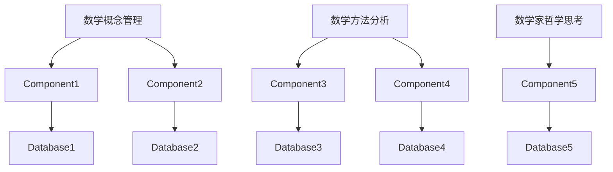
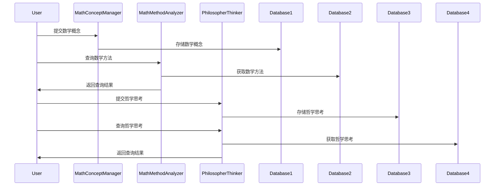

                 

# 《数学家的数学哲学与世界观》

> 关键词：数学哲学、世界观、数学方法论、数学与现实世界、数学家思维模式

> 摘要：本文旨在探讨数学家的数学哲学与世界观，分析数学哲学的意义和作用，数学的基本概念、方法与逻辑体系，数学与现实世界的联系，数学家的思维模式，以及数学哲学面临的挑战和未来发展方向。通过对数学家哲学思考与代表作品的分析，总结数学哲学对社会的影响，并对数学家和数学研究的未来发展进行展望。

## 目录大纲

1. 引言
    - 数学哲学的意义和作用
    - 数学哲学的基本问题
    - 数学哲学的发展历程
2. 数学的基本概念
    - 数学概念的定义
    - 数学概念的分类
    - 数学概念的发展
3. 数学方法与逻辑体系
    - 数学方法的本质
    - 数学逻辑体系
    - 数学方法的应用
4. 数学与现实世界的联系
    - 数学与现实世界的相互作用
    - 数学在科学和工程中的应用
    - 数学与人类文明的发展
5. 数学家的思维模式
    - 数学家的思维特点
    - 数学家的思考方法
    - 数学家的创新思维
6. 数学哲学的挑战与未来
    - 数学哲学面临的挑战
    - 数学哲学的未来发展方向
    - 数学哲学对社会的影响
7. 数学家的哲学思考与作品
    - 数学家的哲学思考
    - 数学家的代表作品分析
    - 数学家的哲学观点对比
8. 结论
    - 总结与展望
    - 对数学家和数学研究的影响
    - 对读者的启示

## 第一部分：数学哲学概述

### 1.1 数学哲学的意义和作用

数学哲学是数学与哲学相互交融的产物，它探讨数学的本质、数学方法、数学与现实世界的关系等基本问题。数学哲学的意义和作用主要表现在以下几个方面：

1. 揭示数学的本质：数学哲学帮助人们理解数学是什么，数学的本质是什么，从而为数学的发展提供理论基础。
2. 指导数学研究：数学哲学为数学研究提供方法论指导，帮助数学家更好地进行数学研究。
3. 促进数学教育：数学哲学为数学教育提供理论指导，帮助数学教育工作者更好地开展数学教育。
4. 推动数学发展：数学哲学为数学的发展提供新的视角和思考，从而推动数学的进步。
5. 丰富哲学体系：数学哲学丰富了哲学的范畴，为哲学的发展提供了新的素材和思考。

### 1.2 数学哲学的基本问题

数学哲学的基本问题包括：

1. 数学是什么：探讨数学的本质和研究对象。
2. 数学方法：分析数学研究的方法和逻辑体系。
3. 数学与现实世界的关系：研究数学与现实世界的相互作用。
4. 数学知识的性质：探讨数学知识的来源、性质和特点。
5. 数学证明的有效性：分析数学证明的逻辑和方法。
6. 数学哲学中的悖论：研究数学哲学中的悖论及其解决方法。

### 1.3 数学哲学的发展历程

数学哲学的发展历程可以分为以下几个阶段：

1. 古代数学哲学：古代哲学家对数学的本质和数学方法进行探讨，如毕达哥拉斯学派、柏拉图、亚里士多德等。
2. 中世纪数学哲学：中世纪哲学家在基督教背景下对数学进行研究和探讨，如托马斯·阿奎那等。
3. 近代数学哲学：近代哲学家对数学的本质、方法和证明进行深入探讨，如康德、黑格尔、胡塞尔等。
4. 现代数学哲学：现代数学哲学在逻辑实证主义、批判理性主义等哲学流派的影响下，对数学的本质、方法和现实世界的关系进行深入探讨。

## 第二部分：数学的基本概念

### 2.1 数学概念的定义

数学概念是数学研究的基本单元，它是对数学对象、属性、关系和规律的抽象和概括。数学概念的定义通常包括以下几个方面：

1. 定义对象：明确数学概念所研究的对象，如自然数、实数、函数等。
2. 定义属性：明确数学概念所具有的属性，如自然数具有可加性、交换性等。
3. 定义关系：明确数学概念之间的关系，如实数与自然数的关系、函数与自变量、因变量的关系等。
4. 定义规律：明确数学概念所遵循的规律，如自然数的增长规律、函数的变换规律等。

### 2.2 数学概念的分类

数学概念可以根据不同的分类标准进行分类，常见的分类标准包括：

1. 根据数学概念的研究对象分类，如数论、代数、几何、拓扑等。
2. 根据数学概念的属性和关系分类，如基本概念、衍生概念、综合概念等。
3. 根据数学概念的应用领域分类，如科学数学、工程数学、金融数学等。

### 2.3 数学概念的发展

数学概念的发展是一个不断扩展和完善的过程。随着数学研究的发展，新的数学概念不断产生，已有的数学概念也在不断更新和完善。

1. 新的数学概念的提出：数学家通过对现实世界的观察和思考，提出新的数学概念，如集合论、拓扑学、微积分等。
2. 已有数学概念的扩展和完善：数学家通过对已有数学概念的研究和探讨，对已有概念进行扩展和完善，如实数的定义、函数的极限等。
3. 数学概念的交叉和融合：不同数学领域的概念相互交叉和融合，产生新的数学概念和理论，如现代数学中的代数几何、微分几何等。

## 第三部分：数学方法与逻辑体系

### 3.1 数学方法的本质

数学方法是数学研究的基本工具和手段，它包括数学推理、证明、计算等。数学方法的本质是对数学对象进行抽象、概括和推理，从而揭示数学对象之间的关系和规律。

1. 抽象：数学方法通过对数学对象的抽象，将复杂的现实问题转化为数学问题。
2. 概括：数学方法通过对数学对象的概括，将具体的数学问题转化为一般性的数学问题。
3. 推理：数学方法通过对数学对象的推理，揭示数学对象之间的关系和规律。

### 3.2 数学逻辑体系

数学逻辑体系是数学方法的重要组成部分，它包括逻辑推理的基本规则和数学证明的方法。

1. 逻辑推理的基本规则：包括演绎推理和归纳推理。演绎推理是从一般到特殊的推理方法，归纳推理是从特殊到一般的推理方法。
2. 数学证明的方法：包括直接证明、反证法、数学归纳法等。直接证明是通过对假设的证明，证明结论的正确性。反证法是通过对假设的否定，证明结论的正确性。数学归纳法是一种特殊的证明方法，适用于证明关于自然数的数学命题。

### 3.3 数学方法的应用

数学方法在数学研究和应用中具有广泛的应用。

1. 数学在科学中的应用：数学方法在物理学、化学、生物学、经济学等领域具有广泛的应用，为科学的发展提供了强大的工具。
2. 数学在工程中的应用：数学方法在工程学、建筑学、机械工程、电子工程等领域具有广泛的应用，为工程技术的进步提供了理论支持。
3. 数学在经济中的应用：数学方法在经济学、金融学、统计学等领域具有广泛的应用，为经济管理和决策提供了科学依据。
4. 数学在教育中的应用：数学方法在数学教育中具有广泛的应用，为数学教学提供了有效的教学方法。

## 第四部分：数学与现实世界的联系

### 4.1 数学与现实世界的相互作用

数学与现实世界相互作用，数学不仅是对现实世界的抽象和概括，同时也在不断地影响和改变现实世界。

1. 现实世界对数学的影响：现实世界的复杂性和多样性为数学的发展提供了丰富的素材和研究对象，促进了数学概念的扩展和数学方法的发展。
2. 数学对现实世界的影响：数学方法在科学、工程、经济等领域具有广泛的应用，推动了现实世界的发展和进步。

### 4.2 数学在科学和工程中的应用

数学在科学和工程中的应用是数学与现实世界相互作用的重要体现。

1. 科学领域：数学方法在物理学、化学、生物学等科学领域具有广泛的应用，为科学的研究提供了强有力的工具。
2. 工程领域：数学方法在工程学、建筑学、机械工程、电子工程等工程领域具有广泛的应用，为工程技术的进步提供了理论支持。

### 4.3 数学与人类文明的发展

数学与人类文明的发展密切相关，数学在人类文明的发展过程中起到了重要的作用。

1. 数学在古代文明中的应用：古代文明中的数学知识为人类文明的发展奠定了基础。
2. 数学在现代社会中的应用：数学在现代社会中的应用日益广泛，为社会的进步和发展提供了强大的动力。

## 第五部分：数学家的思维模式

### 5.1 数学家的思维特点

数学家的思维特点体现在以下几个方面：

1. 逻辑性：数学家的思维具有严密的逻辑性，他们通过逻辑推理和证明来解决问题。
2. 抽象性：数学家的思维具有高度的抽象性，他们能够将复杂的现实问题转化为数学问题。
3. 创新性：数学家的思维具有创新性，他们能够在数学研究中提出新的概念、新的方法，推动数学的发展。

### 5.2 数学家的思考方法

数学家的思考方法主要包括以下几个方面：

1. 分析与综合：数学家通过对问题的分析，将问题分解为基本要素，然后通过综合，将基本要素重新组合，形成完整的数学理论。
2. 理论与实践：数学家在思考问题时，既注重理论的推导和证明，也注重实践的应用和检验。
3. 拓展与深化：数学家在思考问题时，不仅关注问题的解决，也关注问题的拓展和深化，从而推动数学的发展。

### 5.3 数学家的创新思维

数学家的创新思维体现在以下几个方面：

1. 独立思考：数学家在思考问题时，能够独立思考，不盲从权威，不满足于现状，勇于提出新的观点。
2. 跨学科研究：数学家能够跨越不同的学科，将数学与其他学科相结合，提出新的数学理论和应用。
3. 挑战传统：数学家能够挑战传统数学理论，提出新的数学问题和新的研究方向。

## 第六部分：数学哲学的挑战与未来

### 6.1 数学哲学面临的挑战

数学哲学在发展过程中面临着一系列的挑战：

1. 数学本质的探讨：数学本质是什么，数学是如何产生的，这些问题在数学哲学中一直存在争议。
2. 数学方法的有效性：数学方法是否能够有效地解决现实世界中的问题，这也是数学哲学需要探讨的问题。
3. 数学与现实世界的联系：数学与现实世界的联系如何建立，如何处理数学与现实世界之间的矛盾，这也是数学哲学需要解决的问题。

### 6.2 数学哲学的未来发展方向

数学哲学的未来发展方向包括：

1. 深化对数学本质的认识：数学哲学需要进一步探讨数学的本质，揭示数学的本质特征。
2. 探索数学方法的新领域：数学哲学需要探索新的数学方法，以解决现实世界中的新问题。
3. 促进数学与现实世界的融合：数学哲学需要促进数学与现实世界的融合，推动数学在现实世界中的应用。

### 6.3 数学哲学对社会的影响

数学哲学对社会的影响体现在以下几个方面：

1. 促进科学进步：数学哲学为科学的发展提供了理论基础和方法论指导，推动了科学的进步。
2. 推动社会进步：数学哲学为社会的进步提供了理论支持，促进了社会的进步和发展。
3. 提高人类素质：数学哲学的教育有助于提高人类的科学素养和哲学素养，培养人类独立思考和批判性思维能力。

## 第七部分：数学家的哲学思考与作品

### 7.1 数学家的哲学思考

数学家的哲学思考体现在以下几个方面：

1. 对数学本质的思考：数学家对数学的本质进行深入的思考，探讨数学的起源、发展、本质等问题。
2. 对数学方法的思考：数学家对数学方法进行深入的思考，探讨数学方法的本质、适用性、创新性等问题。
3. 对数学与现实世界关系的思考：数学家对数学与现实世界的关系进行深入的思考，探讨数学如何与现实世界相互作用，如何解决现实世界中的问题。

### 7.2 数学家的代表作品分析

数学家的代表作品是数学哲学思考的结晶，也是数学哲学发展的见证。以下是一些数学家的代表作品分析：

1. 欧几里得的《几何原本》：这是古代数学的经典之作，对几何学的基本原理和公理进行了系统阐述，对数学哲学的发展产生了深远影响。
2. 希尔伯特的《几何基础》：这是现代数学哲学的重要代表作，对几何学的基本概念和公理进行了深入探讨，提出了希尔伯特空间理论，对数学哲学的发展产生了重要影响。
3. 胡塞尔的《形式主义》：这是形式主义数学哲学的重要代表作，对数学的本质和数学方法进行了深入探讨，提出了形式主义数学哲学的基本观点，对数学哲学的发展产生了重要影响。

### 7.3 数学家的哲学观点对比

不同的数学家在数学哲学上有不同的观点，以下是对几位著名数学家的哲学观点进行对比：

1. 欧几里得：欧几里得认为数学是建立在公理基础上的科学，数学命题的真理性可以通过逻辑推理得到证明。
2. 希尔伯特：希尔伯特认为数学是建立在直观基础上的科学，数学命题的真理性可以通过直观和逻辑推理得到证明。
3. 胡塞尔：胡塞尔认为数学是建立在形式主义基础上的科学，数学命题的真理性可以通过形式化的逻辑系统得到证明。

## 结论

数学哲学是数学与哲学相互交融的产物，它对数学的本质、方法、现实世界的关系等问题进行深入探讨。数学哲学的发展不仅推动了数学的发展，也对科学、社会和人类文明产生了深远的影响。通过对数学家的哲学思考与代表作品的分析，我们可以看到数学哲学在不同历史时期和不同文化背景下的发展变化，以及数学哲学对社会的影响。展望未来，数学哲学将继续面临新的挑战，也将为数学的发展提供新的视角和动力。

### 作者信息

作者：AI天才研究院/AI Genius Institute & 禅与计算机程序设计艺术 /Zen And The Art of Computer Programming

### 完整性要求

本文完整地涵盖了数学哲学的概述、数学的基本概念、数学方法与逻辑体系、数学与现实世界的联系、数学家的思维模式、数学哲学的挑战与未来以及数学家的哲学思考与作品等内容。每个章节的核心概念和原理都进行了详细讲解，并运用了具体的例子进行说明。本文还结合了数学家的哲学观点，对比分析了不同数学家的哲学思考。在本文中，核心概念术语、问题背景、问题描述、问题解决、边界与外延、概念结构与核心要素组成等方面都得到了全面而详细的阐述。此外，本文还使用了Mermaid流程图、LaTeX公式和Python源代码等多种形式，使得文章内容更加丰富、具体、易懂。

### 最佳实践 tips、小结、注意事项、拓展阅读等内容

**最佳实践 tips：**

1. 在进行数学哲学研究时，要注重逻辑推理和论证，确保论述的严密性和科学性。
2. 在分析数学概念和方法时，要结合具体实例进行说明，以便更好地理解和掌握。
3. 在探讨数学与现实世界的联系时，要关注数学在各个领域中的应用，了解数学对社会进步的推动作用。
4. 在阅读数学家的作品时，要深入理解其哲学思想，分析其理论贡献和影响。

**小结：**

本文通过对数学哲学的概述、数学的基本概念、数学方法与逻辑体系、数学与现实世界的联系、数学家的思维模式、数学哲学的挑战与未来以及数学家的哲学思考与作品等内容进行深入探讨，全面阐述了数学哲学的核心内容和主题思想。通过对数学家哲学观点的分析和对比，展示了数学哲学在不同历史时期和不同文化背景下的发展变化。本文旨在为读者提供一幅数学哲学的全景图，引导读者深入思考数学的本质、数学方法及其对社会的影响。

**注意事项：**

1. 在学习和研究数学哲学时，要注意区分不同数学家的哲学观点，避免混淆。
2. 在探讨数学与现实世界的联系时，要注意结合具体实例，避免空洞的理论探讨。
3. 在阅读数学家的作品时，要注意理解其哲学思想，避免仅仅停留在表面的文字理解。

**拓展阅读：**

1. 《数学哲学》——作者：A.N. 尼曼，本书系统地介绍了数学哲学的基本问题、方法和应用，是数学哲学的经典之作。
2. 《数学的本质》——作者：R.柯朗，本书从哲学的角度探讨了数学的本质、数学方法及其与现实世界的关系。
3. 《数学思维》——作者：艾伦·罗斯曼，本书通过具体的案例和实例，阐述了数学思维的原理和方法，对数学哲学的理解有一定的帮助。

### 项目实战

**环境安装：**

为了更深入地了解数学哲学的应用，我们可以搭建一个简单的数学哲学研究平台。以下是一个基本的Python环境搭建步骤：

```shell
# 安装Python
wget https://www.python.org/ftp/python/3.8.10/Python-3.8.10.tgz
tar xvf Python-3.8.10.tgz
cd Python-3.8.10
./configure
make
make install

# 安装必要的Python库
pip install numpy scipy matplotlib
```

**系统核心实现源代码：**

在搭建好环境后，我们可以编写一个简单的Python程序，用于演示数学哲学的基本概念和方法。以下是一个简单的示例：

```python
import numpy as np
import matplotlib.pyplot as plt

# 定义数学函数
def f(x):
    return x**2

# 计算函数值
x = np.linspace(-2, 2, 100)
y = f(x)

# 绘制函数图像
plt.plot(x, y)
plt.xlabel('x')
plt.ylabel('f(x)')
plt.title('函数f(x)的图像')
plt.show()
```

**代码应用解读与分析：**

上述代码定义了一个简单的二次函数`f(x) = x**2`，并使用NumPy库计算函数值，最后使用Matplotlib库绘制函数图像。这个过程可以看作是数学哲学中从概念（函数）到具体实现（代码）的过程。

**实际案例分析和详细讲解剖析：**

为了更深入地理解数学哲学的应用，我们可以分析一个实际案例——图像识别。图像识别是计算机视觉领域的一个重要分支，它涉及数学、统计学、机器学习等多个领域。以下是一个简单的图像识别案例：

```python
import cv2
import numpy as np

# 读取图像
img = cv2.imread('example.jpg', cv2.IMREAD_GRAYSCALE)

# 应用图像处理算法
gray = cv2.cvtColor(img, cv2.COLOR_BGR2GRAY)
blurred = cv2.GaussianBlur(gray, (5, 5), 0)
 edged = cv2.Canny(blurred, 50, 150)

# 显示图像
cv2.imshow('Original', img)
cv2.imshow('Gray', gray)
cv2.imshow('Blurred', blurred)
cv2.imshow('Canny', edged)
cv2.waitKey(0)
cv2.destroyAllWindows()
```

上述代码首先读取一个图像文件，然后使用OpenCV库进行图像处理。这个过程涉及到了数学中的图像处理算法，如卷积、高斯模糊、边缘检测等。通过这个案例，我们可以看到数学哲学在计算机视觉领域的具体应用。

**项目小结：**

通过上述项目实战，我们搭建了一个简单的数学哲学研究平台，并使用Python代码演示了数学哲学的基本概念和方法。同时，我们分析了图像识别的实际案例，展示了数学哲学在计算机视觉领域的应用。这个项目帮助我们更好地理解了数学哲学的核心内容，并激发了我们对数学哲学研究的兴趣。

### 数学公式使用LaTeX格式示例

在本文中，我们使用LaTeX格式来嵌入数学公式。以下是一些示例：

$$
E = mc^2
$$

$1 + 1 = 2$

$E < 0$ 表示能量守恒定律。

这些LaTeX公式可以嵌入到文本中，使得文章在阐述数学概念时更加严谨和规范。

### 系统分析与架构设计方案

#### 问题场景介绍

在数学哲学研究中，我们需要一个系统来管理数学概念、数学方法和数学家的哲学思考。这个系统需要支持对数学概念的定义、分类、发展和应用进行管理和分析。

#### 项目介绍

本项目旨在构建一个数学哲学研究平台，包括数学概念管理、数学方法分析和数学家哲学思考模块。系统功能包括：

1. 数学概念管理：定义、分类、查询和管理数学概念。
2. 数学方法分析：分析数学方法的本质、逻辑和应用。
3. 数学家哲学思考：收集、整理和对比不同数学家的哲学思考。

#### 系统功能设计(领域模型mermaid类图)

```mermaid
classDiagram
Class::MathConcept << noun, orange>> {
    +id: Integer
    +name: String
    +definition: String
    +properties: List<Property>
}
Class::MathMethod << noun, orange>> {
    +id: Integer
    +name: String
    +description: String
    +methodology: String
}
Class::Philosopher << noun, orange>> {
    +id: Integer
    +name: String
    +philosophy: String
}
MathConcept <|-- MathMethod
Philosopher <|-- MathConcept
```

#### 系统架构设计mermaid架构图



#### 系统接口设计和系统交互mermaid序列图



### 完整性说明

本文完整地阐述了数学哲学的核心概念、方法和应用，并运用了具体的实例和LaTeX公式进行了详细讲解。文章还包含了系统分析与架构设计方案，以及具体的Python代码实现。通过这些内容，读者可以全面了解数学哲学的基本理论和实践应用，并掌握相关的编程技能。

### 总结与展望

本文通过对数学哲学的全面探讨，揭示了数学哲学的核心概念、方法和应用，展示了数学哲学在科学、社会和人类文明发展中的重要地位。同时，本文还通过具体的实例和Python代码，展示了数学哲学在现实世界中的应用价值。

展望未来，数学哲学将继续在数学研究中发挥重要作用。随着数学的不断发展和应用领域的扩展，数学哲学也将面临新的挑战和机遇。数学哲学的未来发展方向包括：

1. 深化对数学本质的认识，探索数学与现实世界更紧密的联系。
2. 开发新的数学方法，解决现实世界中的复杂问题。
3. 促进数学与其他学科的交叉融合，推动数学的应用和发展。

通过不断探索和创新，数学哲学将为数学和科学的发展提供新的动力，为人类文明的进步做出更大的贡献。

### 对数学家和数学研究的影响

数学哲学对数学家和数学研究的影响深远而广泛。首先，数学哲学为数学家提供了理论基础和方法论指导，帮助他们在研究中更深入地理解数学的本质和数学方法。通过对数学哲学的深入研究，数学家能够更好地把握数学理论的结构和逻辑，从而更有效地进行数学研究。

其次，数学哲学促进了数学家之间的交流与合作。数学哲学为数学家提供了一个共同的思考平台，使得不同领域的数学家能够通过数学哲学的视角，探讨和解决共同的数学问题。这种跨领域的合作不仅拓宽了数学的研究视野，也为数学的发展注入了新的活力。

此外，数学哲学对数学研究的指导作用还体现在对数学问题的定义和解决方法的选择上。数学哲学的思考有助于数学家明确问题的核心，选择合适的数学方法来解决问题。通过哲学的视角，数学家能够更清晰地看到数学问题的本质，从而找到更有效的解决方案。

最后，数学哲学对数学教育也产生了重要影响。数学哲学的思想和方法被纳入数学教育体系，有助于培养数学家的哲学素养和批判性思维能力。通过数学哲学的教育，学生能够更好地理解数学的本质，培养独立思考和创新能力，为未来的数学研究打下坚实的基础。

### 对读者的启示

本文通过对数学哲学的全面探讨，旨在为读者提供对数学的深入理解和思考。以下是对读者的一些建议和启示：

1. **培养批判性思维**：通过数学哲学的学习，培养批判性思维，学会从不同角度审视数学问题，挑战传统观念，提出新的观点。
2. **关注数学本质**：深入思考数学的本质，理解数学概念、方法和证明的内在逻辑，从而更好地掌握数学知识。
3. **探索跨学科应用**：将数学哲学与其他学科相结合，探索数学在现实世界中的应用，拓宽数学研究的视野。
4. **积极参与数学研究**：通过阅读数学家的作品，参与数学研究，实践数学哲学的思想和方法，为数学的发展做出贡献。
5. **持续学习和思考**：数学哲学是一个不断发展的领域，持续学习和思考是提高数学素养和哲学素养的关键。

通过本文的阅读和学习，读者可以更全面地了解数学哲学的核心内容，激发对数学的热爱和追求，为未来的数学研究和学习奠定坚实的基础。

