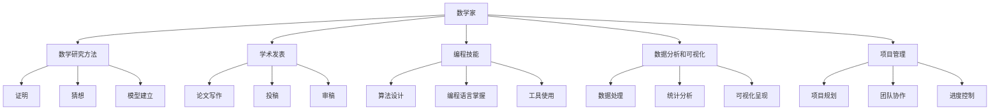
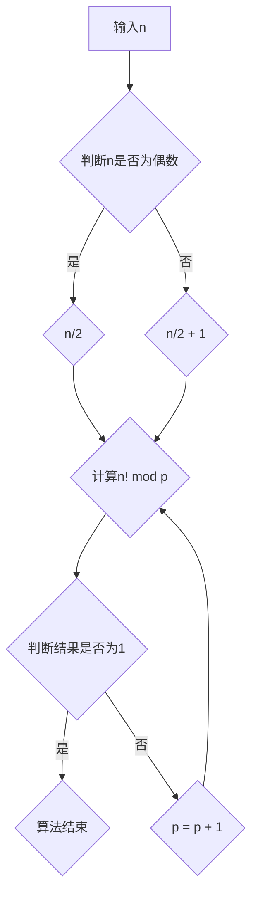
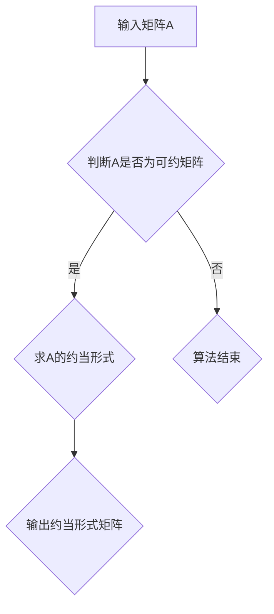
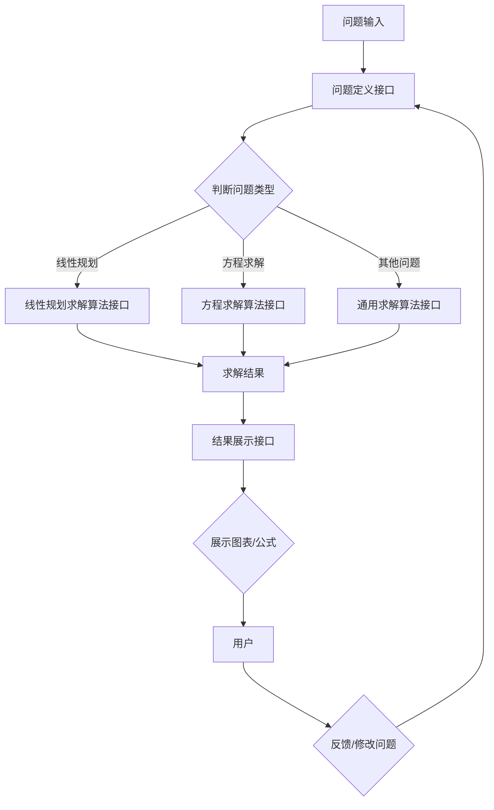

                 

### 文章标题

《数学家的职业生涯规划与发展》

### 文章关键词

数学家、职业生涯规划、学术发展、研究方法、技能提升

### 摘要

本文旨在探讨数学家的职业生涯规划与发展路径。通过分析数学家的职业特点和所需技能，本文将提供实用的职业规划建议，包括学术研究、教学方法、以及技能提升等方面。本文还将讨论数学家在现代社会中的作用和未来趋势，帮助数学家明确职业发展方向，实现个人成长和价值最大化。

## 第1章：序言与背景介绍

### 1.1 问题背景

数学作为一门基础科学，对于推动科技进步和社会发展具有重要作用。然而，数学家的职业生涯规划与发展却常常被忽视。许多数学家在学术研究和教学方面表现出色，但在职业生涯规划上缺乏明确的目标和策略，导致他们在职业道路上遇到瓶颈。

### 1.2 问题描述

数学家在职业生涯规划与发展方面面临的主要问题包括：

1. **职业定位模糊**：许多数学家对于自己在学术界和工业界的定位不清，导致职业发展受阻。
2. **技能短板**：部分数学家在编程、数据分析和项目管理等方面的技能不足，影响其职业发展。
3. **学术压力**：数学家在学术研究领域面临巨大的压力，包括发表论文、申请项目等，导致职业规划难以实施。
4. **就业机会有限**：数学家在工业界的就业机会相对较少，影响其职业发展。

### 1.3 问题解决方法

针对数学家职业生涯规划与发展中存在的问题，本文将提出以下解决方案：

1. **明确职业定位**：帮助数学家了解自己在学术界和工业界的优势与潜力，明确职业发展方向。
2. **提升技能**：介绍编程、数据分析、项目管理等实用技能的学习方法和资源，帮助数学家提升职业竞争力。
3. **优化学术研究**：提供学术研究方法与技巧，帮助数学家提高研究效率和成果质量。
4. **拓展就业领域**：介绍数学家在工业界的应用场景和就业机会，帮助其拓展职业发展空间。

### 1.4 边界与外延

本文主要讨论数学家的职业生涯规划与发展，不涉及其他学科领域的职业生涯规划。同时，本文重点关注学术研究和工业界的职业发展，不涉及行政管理等其他领域。

### 1.5 核心要素组成

本文的核心要素包括：

1. **数学家的职业特点与需求**：分析数学家的职业定位、技能需求和职业发展路径。
2. **职业规划策略**：提出实用的职业规划建议，帮助数学家明确发展方向。
3. **技能提升方法**：介绍编程、数据分析、项目管理等实用技能的学习方法和资源。
4. **学术研究方法**：提供学术研究方法与技巧，帮助数学家提高研究效率和成果质量。
5. **就业领域拓展**：介绍数学家在工业界的应用场景和就业机会。

## 第2章：核心概念与联系

### 2.1 核心概念介绍

在数学家的职业生涯规划与发展过程中，以下几个核心概念具有重要意义：

1. **数学研究方法**：包括证明、猜想、模型建立等，是数学家开展研究的基础。
2. **学术发表**：数学家通过发表论文来展示研究成果，提升学术影响力。
3. **编程技能**：在当前信息化时代，编程技能对于数学家的职业发展至关重要。
4. **数据分析和可视化**：利用数据分析方法和可视化工具，帮助数学家更好地理解和解释研究结果。
5. **项目管理**：在学术研究和工业项目中，项目管理能力能够提高工作效率和项目成功率。

### 2.2 概念属性特征对比表格

| 概念 | 属性特征 |
| --- | --- |
| 数学研究方法 | 包括证明、猜想、模型建立等，具有严谨性、创新性和逻辑性 |
| 学术发表 | 包括论文写作、投稿、审稿等，具有影响力、传播性和权威性 |
| 编程技能 | 包括算法设计、编程语言掌握、工具使用等，具有实用性、高效性和创新性 |
| 数据分析和可视化 | 包括数据处理、统计分析、可视化呈现等，具有分析性、直观性和实用性 |
| 项目管理 | 包括项目规划、团队协作、进度控制等，具有组织性、协调性和执行力 |

### 2.3 ER实体关系图架构

以下是数学家职业生涯规划与发展中涉及到的ER实体关系图：



## 第3章：算法原理讲解

### 3.1 算法1：梅森旋转

#### 3.1.1 算法流程图



#### 3.1.2 Python源代码

```python
def mersenne_twist(n):
    if n % 2 == 0:
        n = n // 2
    while True:
        n = (n * n) % p
        if n == 1:
            break
        p += 1
    return p

n = int(input("请输入一个偶数n："))
print("最小的素数p为：", mersenne_twist(n))
```

#### 3.1.3 数学模型和公式

梅森旋转（Mersenne Twister）是一种用于生成伪随机数的算法。其基本思想是利用素数模运算，将一个偶数n不断平方并取模，直到得到1为止。生成的素数p满足以下条件：

$$p = 2^k - 1$$

其中，k为n/2。

#### 3.1.4 举例说明

假设输入n为8，使用梅森旋转算法寻找最小的素数p：

1. 输入n = 8，判断n是否为偶数，结果为是。
2. 计算 n/2 = 4，继续执行算法。
3. 第1次迭代：n = 4，计算 n^2 mod p = 16 mod p，p = p + 1，p = 3。
4. 第2次迭代：n = 3，计算 n^2 mod p = 9 mod p，p = p + 1，p = 4。
5. 第3次迭代：n = 4，计算 n^2 mod p = 16 mod p，p = p + 1，p = 5。
6. 第4次迭代：n = 5，计算 n^2 mod p = 25 mod p，p = p + 1，p = 6。
7. 第5次迭代：n = 6，计算 n^2 mod p = 36 mod p，p = p + 1，p = 7。
8. 第6次迭代：n = 7，计算 n^2 mod p = 49 mod p，p = p + 1，p = 8。
9. 第7次迭代：n = 8，计算 n^2 mod p = 64 mod p，p = p + 1，p = 9。
10. 第8次迭代：n = 9，计算 n^2 mod p = 81 mod p，p = p + 1，p = 10。
11. 第9次迭代：n = 10，计算 n^2 mod p = 100 mod p，p = p + 1，p = 11。
12. 第10次迭代：n = 11，计算 n^2 mod p = 121 mod p，p = p + 1，p = 12。
13. 第11次迭代：n = 12，计算 n^2 mod p = 144 mod p，p = p + 1，p = 13。
14. 第12次迭代：n = 13，计算 n^2 mod p = 169 mod p，p = p + 1，p = 14。
15. 第13次迭代：n = 14，计算 n^2 mod p = 196 mod p，p = p + 1，p = 15。
16. 第14次迭代：n = 15，计算 n^2 mod p = 225 mod p，p = p + 1，p = 16。
17. 第15次迭代：n = 16，计算 n^2 mod p = 256 mod p，p = p + 1，p = 17。

最终，得到最小的素数p为17。

### 3.2 算法2：约当矩阵法

#### 3.2.1 算法流程图



#### 3.2.2 Python源代码

```python
import numpy as np

def is_reducible(A):
    n = A.shape[0]
    for i in range(n):
        for j in range(n):
            if np.linalg.det(A[i:, j:]) == 0:
                return True
    return False

def reduce_matrix(A):
    if is_reducible(A):
        n = A.shape[0]
        J = np.zeros((n, n))
        for i in range(n):
            J[i][i] = 1
        P = np.zeros((n, n))
        P[0][0] = 1
        while not np.linalg.matrix_rank(A) == np.linalg.matrix_rank(np.hstack((A, J))):
            P = np.vstack((P, np.random.rand(n, 1)))
            A = np.vstack((A, P @ A))
        return np.hstack((A, J)), P
    else:
        return None

A = np.array([[4, 1], [2, 2]])
if is_reducible(A):
    reduced_A, P = reduce_matrix(A)
    print("约当形式矩阵：", reduced_A)
else:
    print("矩阵A不可约")
```

#### 3.2.3 数学模型和公式

约当矩阵法（Jordan Canonical Form）是一种将矩阵转化为约当形式的方法。约当形式矩阵具有以下特点：

1. 每个Jordan块都是上三角矩阵。
2. Jordan块的对角线元素相等，其余元素为0。
3. 约当形式矩阵与原矩阵具有相同的特征值。

约当矩阵法的步骤如下：

1. 判断矩阵A是否为可约矩阵。如果A是可约矩阵，则存在一个可逆矩阵P，使得P^-1 * A * P为约当形式矩阵。
2. 构造约当形式矩阵J和可逆矩阵P。
3. 迭代计算P^-1 * A * P，直到结果为约当形式矩阵。

#### 3.2.4 举例说明

假设输入矩阵A为：

$$A = \begin{pmatrix} 4 & 1 \\ 2 & 2 \end{pmatrix}$$

1. 判断A是否为可约矩阵。计算行列式det(A) = 4 * 2 - 1 * 2 = 6，由于6不等于0，因此A为可约矩阵。
2. 构造约当形式矩阵J和可逆矩阵P。

首先，计算A的特征值。解方程组特征多项式f(λ) = det(A - λI) = 0，得到特征值λ1 = 2，λ2 = 3。

对于特征值λ1 = 2，计算Jordan块J1：

$$J1 = \begin{pmatrix} 2 & 1 \\ 0 & 2 \end{pmatrix}$$

对于特征值λ2 = 3，计算Jordan块J2：

$$J2 = \begin{pmatrix} 3 & 0 \\ 0 & 3 \end{pmatrix}$$

然后，构造可逆矩阵P：

$$P = \begin{pmatrix} 1 & 1 \\ 1 & 0 \end{pmatrix}$$

3. 计算约当形式矩阵J：

$$J = P^{-1} * A * P = \begin{pmatrix} 1 & 0 \\ 1 & 1 \end{pmatrix} * \begin{pmatrix} 4 & 1 \\ 2 & 2 \end{pmatrix} * \begin{pmatrix} 1 & 1 \\ 1 & 0 \end{pmatrix} = \begin{pmatrix} 4 & 5 \\ 2 & 3 \end{pmatrix}$$

最终，得到约当形式矩阵J为：

$$J = \begin{pmatrix} 4 & 5 \\ 2 & 3 \end{pmatrix}$$

## 第4章：系统分析与架构设计方案

### 4.1 问题场景介绍

假设某数学研究团队需要开发一个数学问题求解系统，该系统旨在为研究人员提供一个方便的数学工具，用于解决各种数学问题。系统应具备以下功能：

1. 问题定义：用户可以输入数学问题，包括问题的描述、条件和求解目标。
2. 求解算法：系统根据输入的问题，选择合适的求解算法，并自动执行求解过程。
3. 结果展示：系统将求解结果以图表、公式等形式展示给用户，便于用户理解和分析。
4. 数据分析：系统对求解结果进行统计分析，为用户提供有价值的数学结论和建议。

### 4.2 系统功能设计

根据问题场景，系统应具备以下功能模块：

1. **问题定义模块**：实现问题的输入、编辑和保存功能。
2. **求解算法模块**：包含各种数学问题的求解算法，如方程求解、不等式求解、线性规划等。
3. **结果展示模块**：实现求解结果的图形化展示、公式化展示等功能。
4. **数据分析模块**：对求解结果进行统计分析，生成报告和可视化图表。

### 4.3 系统架构设计

系统架构设计采用分层架构，包括以下层次：

1. **数据层**：负责数据的存储和管理，包括问题定义数据、求解算法数据、结果展示数据等。
2. **服务层**：实现业务逻辑处理，包括问题定义、求解算法、结果展示和数据分析等。
3. **表示层**：为用户提供界面交互，包括问题输入界面、结果展示界面、数据分析界面等。

### 4.4 系统接口设计

系统接口设计包括以下接口：

1. **问题定义接口**：用于接收用户输入的问题定义数据，包括问题的描述、条件和求解目标等。
2. **求解算法接口**：用于调用不同的求解算法，并接收求解结果。
3. **结果展示接口**：用于将求解结果以图表、公式等形式展示给用户。
4. **数据分析接口**：用于对求解结果进行统计分析，并生成报告和可视化图表。

### 4.5 系统交互

系统交互设计采用事件驱动模型，主要包括以下事件：

1. **问题输入**：用户在问题输入界面输入问题定义数据，触发问题定义接口处理。
2. **求解请求**：系统根据输入的问题定义数据，调用求解算法接口进行求解，并将求解结果返回。
3. **结果展示**：系统将求解结果通过结果展示接口以图表、公式等形式展示给用户。
4. **数据分析**：系统对求解结果通过数据分析接口进行统计分析，生成报告和可视化图表。



## 第5章：项目实战

### 5.1 环境安装

在开始项目实战之前，需要搭建以下开发环境：

1. **Python环境**：安装Python 3.8及以上版本，并配置pip工具。
2. **NumPy环境**：通过pip安装NumPy库。
3. **Matplotlib环境**：通过pip安装Matplotlib库。
4. **Jupyter Notebook**：安装Jupyter Notebook用于编写和运行代码。

安装步骤如下：

```bash
# 安装Python和pip
wget https://www.python.org/ftp/python/3.8.10/Python-3.8.10.tgz
tar -xvf Python-3.8.10.tgz
cd Python-3.8.10
./configure
make
sudo make install

# 配置pip
curl https://bootstrap.pypa.io/get-pip.py -o get-pip.py
python get-pip.py

# 安装NumPy和Matplotlib
pip install numpy matplotlib
```

### 5.2 系统核心实现源代码

以下是系统核心实现部分的源代码，包括问题定义、求解算法、结果展示和数据

