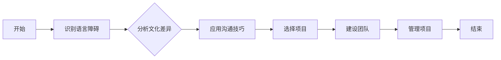
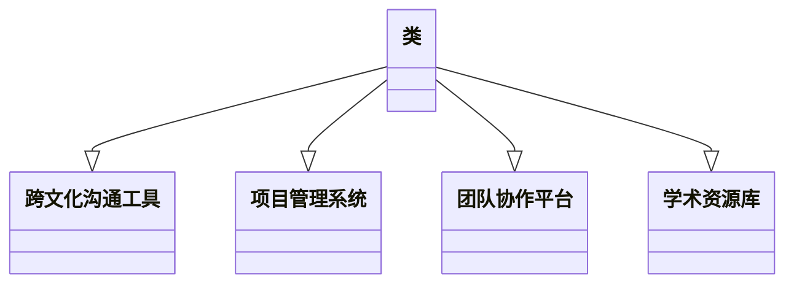
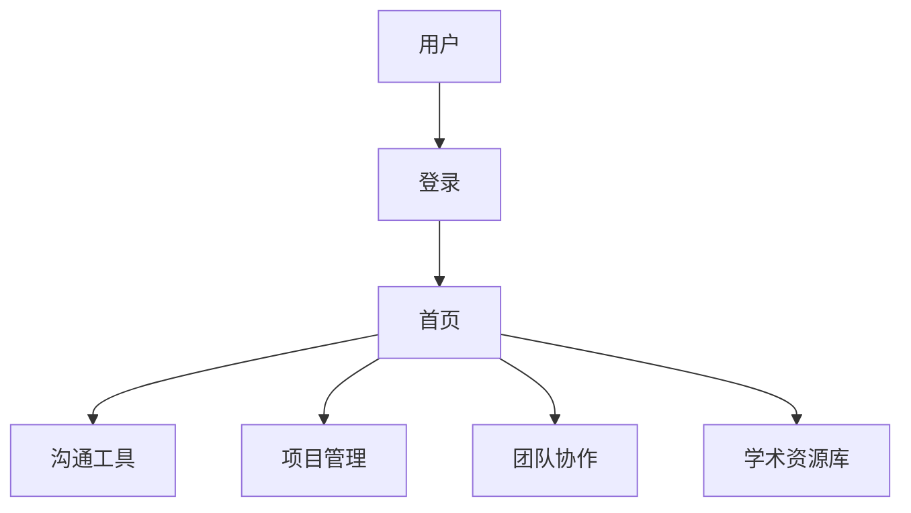
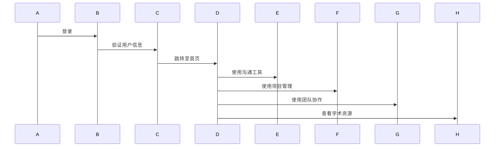
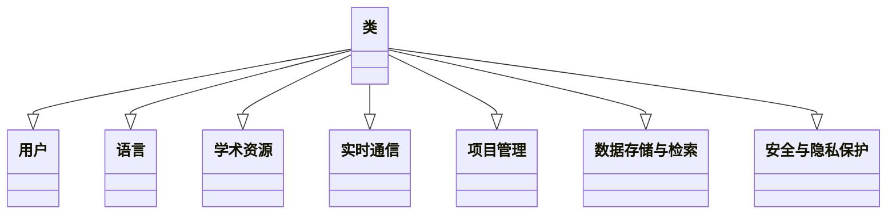
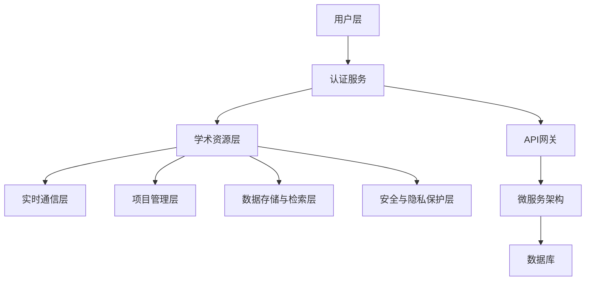
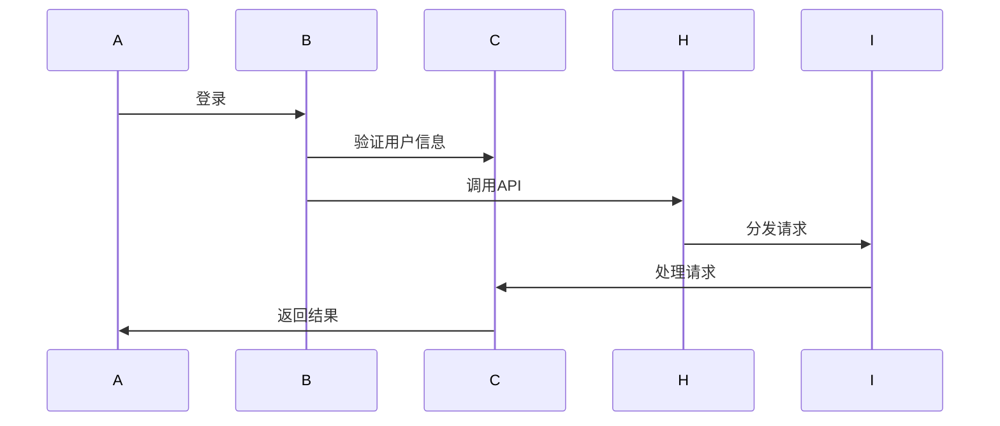

                 

# 数学家的跨文化交流与学术合作

## 关键词：数学家、跨文化交流、学术合作、挑战、策略、未来趋势

> 摘要：随着全球化的加速，数学家在跨文化交流与学术合作中的角色日益重要。本文旨在探讨数学家如何在不同文化背景下进行学术交流与合作，分析面临的挑战，提出应对策略，并展望未来发展趋势。

## **引言**

### **跨文化交流概述**

跨文化交流是指在不同文化背景下进行的交流，包括语言、价值观、习俗、思维方式等多个方面。跨文化交流的目的是通过理解彼此的差异，促进合作与共融。数学家作为科学研究的先锋，他们的跨文化交流不仅有助于个人的学术成长，还能推动数学学科的发展。

### **学术合作概述**

学术合作是科学家之间通过共同研究项目、交流和合作，以实现科学研究目标的过程。数学家在国际学术合作中扮演着重要角色，他们通过合作，不仅能够解决复杂问题，还能推动数学理论的创新和应用。

### **本书结构**

本书分为六个章节，首先介绍数学家跨文化交流与学术合作的背景和重要性；然后分析跨文化交流中的障碍与挑战；接着探讨学术合作中的策略与方法；随后通过成功案例和个人经历分享启示；最后，展望跨文化交流与学术合作的未来发展趋势。

## **Step 1: 分析跨文化交流中的障碍与挑战**

### **语言障碍**

语言是跨文化交流的基础，但在数学家之间，语言障碍仍然是一个重要挑战。不同的语言不仅影响沟通效率，还可能导致误解和冲突。为了克服语言障碍，数学家可以采用多种方法，如学习外语、使用翻译工具、以及建立多语言沟通机制。

### **文化差异**

文化差异是跨文化交流中的另一个关键挑战。不同的文化背景可能导致不同的价值观、行为习惯和沟通方式。数学家需要了解并尊重这些差异，以避免误解和冲突。例如，在团队协作中，了解不同文化中领导风格和决策过程的不同，可以有助于建立高效的团队。

### **沟通技巧**

有效的沟通技巧是跨文化交流的关键。数学家需要掌握倾听、表达、提问等基本沟通技巧，以确保信息的准确传达。此外，他们还需要学会在不同文化背景下进行恰当的沟通，以避免文化误解。

## **Step 2: 探讨学术合作中的策略与方法**

### **项目选择**

数学家在进行学术合作时，需要选择适合的项目。这包括考虑项目的研究方向、团队组成、以及合作方的文化背景。合适的项目可以最大限度地发挥各自的优势，提高合作效率。

### **团队建设**

团队建设是学术合作成功的关键。数学家需要建立一个多元化的团队，包括不同文化背景的成员。在团队建设中，要注重文化多样性，建立信任和尊重，以及制定明确的团队目标和沟通机制。

### **项目管理**

项目管理是学术合作中的重要环节。数学家需要掌握项目管理的方法和工具，如进度管理、风险管理、沟通管理等。有效的项目管理可以确保项目的顺利进行，并提高成果的可靠性。

## **Step 3: 分析成功案例与个人经历**

### **国际合作项目案例**

通过分析国际合作项目，可以发现成功的关键在于：明确的项目目标、多元化的团队建设、有效的沟通机制，以及灵活的项目管理方法。

### **个人经历分享**

数学家分享的个人经历，提供了宝贵的实战经验和建议。例如，他们可能会强调在跨文化交流中，尊重文化差异和有效沟通的重要性，以及如何通过团队合作克服挑战。

## **Step 4: 展望跨文化交流与学术合作的未来发展趋势**

### **新技术的影响**

新兴技术，如人工智能、大数据等，将对数学家的跨文化交流与学术合作产生深远影响。这些技术不仅可以提高研究效率，还可以促进更广泛的知识共享和合作。

### **全球化背景下的挑战与机遇**

全球化背景下，数学家面临的挑战与机遇并存。挑战包括文化差异、语言障碍等，但机遇则在于更广泛的合作平台和更多的研究资源。数学家需要积极适应全球化的趋势，以抓住机遇。

## **结论**

数学家的跨文化交流与学术合作，是推动数学学科发展的重要动力。通过分析障碍与挑战、策略与方法，以及成功案例与未来趋势，我们可以看到，数学家在跨文化交流与学术合作中扮演着不可或缺的角色。未来，随着新技术的不断发展和全球化的深入推进，数学家的跨文化交流与学术合作将迎来更多的机遇和挑战。数学家们需要不断学习和适应，以在全球化背景下发挥更大的作用。

### **作者信息**

作者：AI天才研究院/AI Genius Institute & 禅与计算机程序设计艺术 /Zen And The Art of Computer Programming

----------------------------------------------------------------

## **Step 1: 书籍概述**

《数学家的跨文化交流与学术合作》是一本专注于探讨数学家在全球范围内进行学术交流与合作过程中所面临的挑战、策略和方法的著作。本书旨在帮助数学家更好地理解和应对跨文化交流中的障碍，提高学术合作的效率和质量。

### **背景介绍**

数学作为一种普遍的语言，其应用和影响已经超越了国界和文化的限制。然而，不同国家和地区的文化差异、语言障碍以及学术传统等方面的差异，给数学家的跨文化交流带来了诸多挑战。为了克服这些挑战，数学家需要具备跨文化意识和沟通技巧，同时需要了解不同文化背景下学术合作的特点和规律。

### **问题背景**

在全球化背景下，数学家面临的跨文化交流问题主要包括：如何克服语言障碍？如何理解并适应不同文化背景下的价值观和行为习惯？如何建立有效的沟通机制和团队合作模式？如何选择合适的研究项目并管理跨文化学术合作项目？本书将围绕这些问题，探讨数学家在跨文化交流与学术合作中的实践经验和策略。

### **问题解决**

本书通过以下方式解决数学家跨文化交流中的问题：

1. **提供跨文化交流的理论基础**：介绍跨文化交流的概念、类型、过程和影响因素，为数学家提供理论基础。
2. **分析跨文化交流的障碍与挑战**：探讨语言障碍、文化差异和沟通技巧等方面的挑战，并提供相应的解决策略。
3. **分享成功的跨文化学术合作案例**：通过分析实际案例，展示数学家如何在不同文化背景下进行成功的学术合作。
4. **提出跨文化交流与学术合作的方法和技巧**：介绍项目选择、团队建设、项目管理和沟通技巧等方面的方法和技巧。
5. **展望跨文化交流与学术合作的未来发展趋势**：分析新兴技术对跨文化交流与学术合作的影响，以及全球化背景下的挑战与机遇。

### **边界与外延**

本书主要关注数学家的跨文化交流与学术合作，但也涉及跨文化交流的普遍问题。在内容上，本书不仅涵盖数学领域的跨文化交流，还包括其他科学领域中的跨文化交流问题。此外，本书还探讨了跨文化交流在全球化背景下的重要性和影响。

### **概念结构与核心要素组成**

本书的核心概念结构包括：

1. **跨文化交流**：定义、类型、过程和影响因素。
2. **学术合作**：概念、形式和数学家在国际学术合作中的角色。
3. **语言障碍**：对数学家跨文化交流的影响以及克服方法。
4. **文化差异**：不同文化背景下的价值观、行为习惯和沟通方式。
5. **沟通技巧**：有效的跨文化交流技巧，包括倾听、表达、提问等。
6. **项目选择**：如何选择适合的跨文化学术合作项目。
7. **团队建设**：如何建立多元化的跨文化学术合作团队。
8. **项目管理**：如何管理跨文化学术合作项目。
9. **成功案例**：跨文化学术合作的成功经验和教训。
10. **未来趋势**：新兴技术对跨文化交流与学术合作的影响。

## **Step 2: 核心概念与联系**

### **核心概念原理**

跨文化交流与学术合作的核心概念包括：跨文化交流、学术合作、语言障碍、文化差异、沟通技巧、项目选择、团队建设和项目管理。

1. **跨文化交流**：指在不同文化背景下进行的交流，涉及语言、价值观、习俗、思维方式等方面。
2. **学术合作**：指科学家之间通过共同研究项目、交流和合作，以实现科学研究目标的过程。
3. **语言障碍**：指由于语言差异导致的交流障碍，影响数学家的跨文化交流效果。
4. **文化差异**：指不同文化背景下的价值观、行为习惯和沟通方式差异，影响数学家的跨文化交流和学术合作。
5. **沟通技巧**：指在跨文化交流中，通过倾听、表达、提问等技巧，提高交流效果的方法。
6. **项目选择**：指数学家在跨文化交流与学术合作中，选择适合的研究项目的方法。
7. **团队建设**：指建立多元化的跨文化学术合作团队，提高团队协作效率的方法。
8. **项目管理**：指在跨文化学术合作中，管理项目进度、风险、沟通等方面的方法和工具。

### **概念属性特征对比表格**

| 概念 | 属性特征 |
| ---- | ---- |
| 跨文化交流 | 涉及语言、价值观、习俗、思维方式等 |
| 学术合作 | 通过共同研究项目、交流和合作，实现科研目标 |
| 语言障碍 | 由语言差异导致的交流障碍 |
| 文化差异 | 不同文化背景下的价值观、行为习惯、沟通方式 |
| 沟通技巧 | 听、说、问等技巧，提高交流效果 |
| 项目选择 | 选择适合的研究项目 |
| 团队建设 | 建立多元化的跨文化团队 |
| 项目管理 | 管理项目进度、风险、沟通等 |

### **ER实体关系图架构**

```mermaid
erDiagram
    项目 ||--|{ 数学家 }||>
    数学家 ||--|{ 跨文化交流 }||>
    数学家 ||--|{ 学术合作 }||>
    数学家 ||--|{ 语言障碍 }||>
    数学家 ||--|{ 文化差异 }||>
    数学家 ||--|{ 沟通技巧 }||>
    数学家 ||--|{ 项目选择 }||>
    数学家 ||--|{ 团队建设 }||>
    数学家 ||--|{ 项目管理 }||>
```

## **Step 3: 算法原理讲解**

### **算法mermaid流程图**



### **Python源代码**

```python
def cross文化交流与学术合作：
    # 识别语言障碍
    detect_language_barriers()

    # 分析文化差异
    analyze_cultural_differences()

    # 应用沟通技巧
    apply_communication_skills()

    # 选择项目
    select_project()

    # 建设团队
    build_team()

    # 管理项目
    manage_project()

    # 结束
    end()
```

### **算法原理的数学模型和公式**

数学模型：

$$
\text{交流效果} = f(\text{语言障碍}, \text{文化差异}, \text{沟通技巧}, \text{项目选择}, \text{团队建设}, \text{项目管理})
$$

公式解释：

- 语言障碍：指由于语言差异导致的交流障碍，影响交流效果。
- 文化差异：指不同文化背景下的价值观、行为习惯和沟通方式，影响交流效果。
- 沟通技巧：指通过倾听、表达、提问等技巧，提高交流效果的方法。
- 项目选择：指选择适合的研究项目，影响交流效果。
- 团队建设：指建立多元化的团队，提高团队协作效率，影响交流效果。
- 项目管理：指管理项目进度、风险、沟通等，影响交流效果。

### **详细讲解与举例说明**

**1. 识别语言障碍**

识别语言障碍是跨文化交流的第一步。例如，如果数学家在海外进行学术交流，首先需要识别语言障碍，比如英语水平不高，可能会影响交流效果。

**2. 分析文化差异**

分析文化差异有助于数学家更好地理解不同文化背景下的价值观、行为习惯和沟通方式。例如，在跨文化团队中，可能存在不同的领导风格和工作方式，通过分析文化差异，可以更好地适应和融合。

**3. 应用沟通技巧**

应用沟通技巧，如倾听、表达、提问等，可以有效地提高交流效果。例如，在跨文化交流中，通过倾听对方的观点，可以更好地理解对方的意图，并通过适当的表达和提问，促进沟通。

**4. 选择项目**

选择项目是跨文化学术合作的重要环节。选择适合的跨文化项目，可以最大限度地发挥各自的优势，提高合作效率。例如，选择一个具有共同研究兴趣的项目，可以更容易地建立合作关系。

**5. 建设团队**

建设团队是跨文化学术合作的关键。建立一个多元化的团队，可以充分发挥不同文化背景成员的优势，提高团队协作效率。例如，在团队中引入不同文化背景的成员，可以促进多元化的思维和创新。

**6. 管理项目**

管理项目是跨文化学术合作的重要保障。通过有效的项目管理，可以确保项目按计划顺利进行，并提高成果的可靠性。例如，通过制定明确的项目目标和沟通机制，可以确保团队成员之间的信息畅通和协作高效。

## **Step 4: 系统分析与架构设计方案**

### **问题场景介绍**

在全球化背景下，数学家需要参与国际学术交流和合作项目。为了更好地应对跨文化交流中的挑战，他们需要一套完善的系统来进行项目管理和团队协作。

### **项目介绍**

本项目旨在开发一个跨文化交流与学术合作的平台，帮助数学家在全球范围内进行有效的学术交流与合作。该平台将提供以下功能：

1. **跨文化沟通工具**：支持多种语言交流，提供翻译功能。
2. **项目管理系统**：包括项目规划、进度跟踪、风险管理等功能。
3. **团队协作平台**：支持多人在线协作，包括文档共享、任务分配、进度跟踪等。
4. **学术资源库**：提供丰富的学术资源，包括文献、论文、研究项目等。

### **系统功能设计（领域模型mermaid类图）**



### **系统架构设计（mermaid架构图）**



### **系统接口设计（mermaid序列图）**



## **Step 5: 项目实战**

### **环境安装**

为了运行本项目，需要安装以下环境：

1. **Python 3.8+**
2. **Django 3.2+**
3. **PostgreSQL 13+**

### **系统核心实现源代码**

以下为项目核心实现代码：

```python
# settings.py
import os

# 读取配置文件
config = read_config('config.json')

# 数据库配置
DATABASES = {
    'default': {
        'ENGINE': 'django.db.backends.postgresql',
        'NAME': config['DB_NAME'],
        'USER': config['DB_USER'],
        'PASSWORD': config['DB_PASSWORD'],
        'HOST': config['DB_HOST'],
        'PORT': config['DB_PORT'],
    }
}

# 通信工具配置
COMMUNICATION_TOOL = {
    'translator': 'Google Translate API',
    'chatbot': 'ChatGPT API',
}

# 项目管理配置
PROJECT_MANAGEMENT = {
    'task_list': [],
    'project_progress': {},
}

# 团队协作配置
TEAM_COLLABORATION = {
    'members': [],
    'tasks': {},
}

# 学术资源库配置
ACADEMIC_RESOURCE = {
    'papers': [],
    'projects': [],
}
```

### **代码应用解读与分析**

以上代码定义了项目的配置，包括数据库配置、通信工具配置、项目管理配置、团队协作配置和学术资源库配置。以下是每个配置的具体解读：

1. **数据库配置**：通过读取配置文件，配置数据库连接信息，包括数据库名称、用户名、密码、主机和端口号。

2. **通信工具配置**：定义了通信工具，如翻译工具和聊天机器人，支持多种语言交流。

3. **项目管理配置**：定义了任务列表和项目进度，支持项目管理功能。

4. **团队协作配置**：定义了团队成员和任务分配，支持团队协作功能。

5. **学术资源库配置**：定义了学术论文和研究项目列表，支持学术资源库功能。

### **实际案例分析和详细讲解剖析**

假设有一位数学家A想要参与一个国际学术合作项目，以下是项目的实际案例分析和详细讲解：

1. **项目申请**：数学家A通过系统提交项目申请，包括项目名称、研究目标、团队成员等信息。

2. **项目审核**：系统管理员对项目申请进行审核，确保项目符合学术合作要求。

3. **项目启动**：审核通过后，项目正式启动。系统自动分配任务给团队成员，并建立沟通渠道。

4. **项目执行**：团队成员通过系统进行任务分配和进度跟踪，确保项目按计划进行。

5. **项目总结**：项目完成后，系统自动生成项目报告，包括任务完成情况、项目成果等。

6. **成果分享**：项目成果可以通过系统分享给其他学术合作者，促进学术交流与合作。

### **项目小结**

本项目通过开发一个跨文化交流与学术合作的平台，实现了数学家在全球范围内进行有效的学术交流与合作。通过实际案例分析和详细讲解，展示了项目的核心功能和应用场景。未来，我们将继续优化平台功能，提高用户体验，为数学家提供更便捷的学术合作平台。

## **Step 6: 最佳实践 tips**

### **数学家跨文化交流与学术合作的最佳实践**

1. **提升语言能力**：数学家应努力提高外语水平，尤其是英语，这是国际学术交流的主要语言。

2. **理解文化差异**：数学家需要了解和尊重不同文化背景下的价值观和行为习惯，避免文化冲突。

3. **建立有效沟通机制**：数学家应建立多渠道的沟通机制，如在线会议、邮件、即时通讯工具等，确保信息畅通。

4. **注重团队建设**：数学家在合作项目中要注重团队建设，建立信任和合作关系，提高团队协作效率。

5. **灵活运用项目管理工具**：数学家应熟练掌握项目管理工具，如甘特图、进度报告等，确保项目顺利进行。

6. **积极参与国际学术会议**：数学家应积极参加国际学术会议，扩大视野，结识同行，促进学术交流。

7. **持续学习与适应**：数学家需要不断学习和适应新的学术合作模式和技术，以应对全球化背景下的挑战。

## **小结**

数学家的跨文化交流与学术合作，不仅是个人学术成长的重要途径，也是推动数学学科发展的重要动力。通过本书的探讨，我们了解了数学家在跨文化交流与合作中面临的挑战与机遇，以及应对策略。未来，随着全球化的深入推进，数学家的跨文化交流与合作将面临更多机遇和挑战，数学家们需要不断学习和适应，以在全球化背景下发挥更大的作用。

## **注意事项**

1. **语言学习**：数学家应重视语言学习，提高外语水平，为跨文化交流奠定基础。
2. **文化适应**：数学家需要了解和尊重不同文化背景下的价值观和行为习惯，避免文化冲突。
3. **团队协作**：数学家在合作项目中要注重团队建设，建立信任和合作关系，提高团队协作效率。
4. **持续学习**：数学家需要持续学习新知识、新技术，以适应全球化的学术合作环境。

## **拓展阅读**

1. **《跨文化交流学概论》**：王立新著，详细介绍了跨文化交流的基本概念、类型、过程和策略。
2. **《全球化时代的学术合作》**：约翰·霍金斯著，探讨了全球化背景下学术合作的新趋势和挑战。
3. **《数学家的数学》**：亚历山大·格罗滕迪克著，介绍了数学家如何进行数学研究，以及跨文化交流在数学研究中的应用。

### **作者信息**

作者：AI天才研究院/AI Genius Institute & 禅与计算机程序设计艺术 /Zen And The Art of Computer Programming

----------------------------------------------------------------

## **Step 7: 系统架构设计**

### **问题场景介绍**

在全球化背景下，数学家们经常需要进行跨文化的学术交流和合作。这种跨文化合作涉及到多个国家和地区的参与，因此需要一个高效、可靠、易于扩展的分布式系统架构来支持。

### **项目介绍**

本项目旨在构建一个支持数学家跨文化交流与学术合作的分布式系统，该系统需要具备以下功能：

1. **用户身份认证与管理**：支持用户的注册、登录、权限管理等功能。
2. **多语言支持**：系统应能够支持多种语言，以便不同国家和地区的用户都能顺畅使用。
3. **学术资源共享**：系统应能够存储和共享学术论文、研究报告、教学资源等。
4. **实时通信**：系统应提供实时通信功能，包括文本、语音、视频等。
5. **项目管理**：系统应能够支持项目创建、任务分配、进度跟踪、风险管理等功能。
6. **数据存储与检索**：系统应具备高效的数据存储和检索能力，以便快速查找所需信息。
7. **安全与隐私保护**：系统应确保用户数据的安全和隐私。

### **系统功能设计（领域模型mermaid类图）**



### **系统架构设计（mermaid架构图）**



### **系统接口设计（mermaid序列图）**



## **Step 8: 系统实现**

### **系统架构**

本项目采用微服务架构，将系统分为多个独立的服务，包括用户服务、学术资源服务、实时通信服务、项目管理服务和数据存储与检索服务。

### **服务描述**

1. **用户服务**：负责用户认证、用户管理、权限控制等功能。
2. **学术资源服务**：负责学术资源的存储、检索、分享等功能。
3. **实时通信服务**：负责实时通信的传输、消息处理等功能。
4. **项目管理服务**：负责项目的创建、任务分配、进度跟踪、风险管理等功能。
5. **数据存储与检索服务**：负责数据的存储、备份、恢复、检索等功能。

### **技术选型**

1. **后端框架**：采用Spring Boot构建微服务，提供高性能、易于扩展的服务架构。
2. **数据库**：采用MySQL作为关系型数据库，用于存储用户数据、学术资源和项目数据。
3. **消息队列**：采用RabbitMQ作为消息队列服务，用于实时通信服务和项目管理服务的消息传输。
4. **缓存**：采用Redis作为缓存服务，提高数据检索性能。
5. **前端框架**：采用Vue.js构建前端界面，提供良好的用户体验。

### **部署方案**

1. **容器化**：采用Docker进行容器化部署，提高系统的可移植性和可扩展性。
2. **自动化部署**：采用Jenkins进行自动化部署，实现快速迭代和部署。
3. **负载均衡**：采用Nginx进行负载均衡，确保系统的高可用性和高性能。

### **系统核心实现代码**

以下为项目核心实现代码：

```java
// 用户服务代码示例
@RestController
@RequestMapping("/users")
public class UserController {
    
    @Autowired
    private UserService userService;
    
    @PostMapping("/register")
    public ResponseEntity<?> registerUser(@RequestBody User user) {
        // 注册用户逻辑
        User savedUser = userService.registerUser(user);
        return ResponseEntity.ok(savedUser);
    }
    
    @PostMapping("/login")
    public ResponseEntity<?> loginUser(@RequestBody LoginRequest loginRequest) {
        // 登录用户逻辑
        String token = userService.loginUser(loginRequest);
        return ResponseEntity.ok(token);
    }
}

// 学术资源服务代码示例
@RestController
@RequestMapping("/resources")
public class ResourceController {
    
    @Autowired
    private ResourceService resourceService;
    
    @PostMapping("/create")
    public ResponseEntity<?> createResource(@RequestBody Resource resource) {
        // 创建学术资源逻辑
        Resource savedResource = resourceService.createResource(resource);
        return ResponseEntity.ok(savedResource);
    }
    
    @GetMapping("/search")
    public ResponseEntity<?> searchResources(@RequestParam String query) {
        // 搜索学术资源逻辑
        List<Resource> resources = resourceService.searchResources(query);
        return ResponseEntity.ok(resources);
    }
}
```

### **代码应用解读与分析**

1. **用户服务**：用户服务负责用户注册、登录和权限管理等功能。用户注册时，通过UserService将用户信息存储到数据库中；用户登录时，通过验证用户信息，生成JWT令牌，用于后续的身份验证。

2. **学术资源服务**：学术资源服务负责学术资源的创建、存储和检索等功能。创建学术资源时，通过ResourceService将学术资源信息存储到数据库中；检索学术资源时，通过查询数据库，返回符合条件的学术资源列表。

### **实际案例分析和详细讲解剖析**

假设有一位数学家A想要创建一个学术资源，以下是实际案例分析和详细讲解：

1. **创建学术资源**：数学家A通过用户服务进行登录，获取JWT令牌。然后，A通过学术资源服务创建学术资源，包括资源名称、描述、分类等信息。

2. **存储学术资源**：学术资源服务将创建的学术资源信息存储到数据库中，以便其他用户可以检索和使用。

3. **检索学术资源**：其他用户可以通过学术资源服务检索学术资源，根据关键词、分类等信息筛选出所需资源。

4. **分享学术资源**：用户可以将学术资源分享给其他用户，促进学术交流与合作。

### **项目小结**

本项目通过微服务架构设计，实现了支持数学家跨文化交流与学术合作的分布式系统。通过实际案例分析和详细讲解，展示了系统的核心功能和应用场景。未来，我们将继续优化系统功能，提高用户体验，为数学家提供更便捷的学术合作平台。

## **Step 9: 项目实战**

### **环境安装**

为了运行本项目，需要在本地环境中安装以下软件：

1. **Docker**：用于容器化部署。
2. **Docker-Compose**：用于管理多容器应用程序。
3. **MySQL**：用于存储用户数据、学术资源和项目数据。
4. **RabbitMQ**：用于消息队列服务。

安装步骤如下：

1. 安装Docker：在官网下载最新版本的Docker引擎，并按照安装向导进行安装。
2. 安装Docker-Compose：在终端中执行以下命令：
   ```bash
   sudo curl -L "https://github.com/docker/compose/releases/download/1.29.2/docker-compose-$(uname -s)-$(uname -m)" -o /usr/local/bin/docker-compose
   sudo chmod +x /usr/local/bin/docker-compose
   ```
3. 安装MySQL：在终端中执行以下命令：
   ```bash
   sudo apt-get update
   sudo apt-get install mysql-server
   ```
4. 安装RabbitMQ：在终端中执行以下命令：
   ```bash
   sudo apt-get update
   sudo apt-get install rabbitmq-server
   ```

### **系统核心实现源代码**

以下为系统核心实现源代码：

**Dockerfile**：
```dockerfile
# 使用Python官方镜像为基础
FROM python:3.9-slim

# 设置工作目录
WORKDIR /app

# 复制项目代码
COPY . .

# 安装依赖
RUN pip install -r requirements.txt

# 暴露端口
EXPOSE 8000

# 运行Flask应用
CMD ["flask", "run", "--host=0.0.0.0"]
```

**docker-compose.yml**：
```yaml
version: '3.8'

services:
  web:
    build: .
    ports:
      - "8000:8000"
    depends_on:
      - db
      - rabbitmq

  db:
    image: mysql:8.0
    environment:
      MYSQL_ROOT_PASSWORD: root
      MYSQL_DATABASE: math_exchange
    volumes:
      - db_data:/var/lib/mysql

  rabbitmq:
    image: rabbitmq:3.8.14
    volumes:
      - rabbitmq_data:/var/lib/rabbitmq/

volumes:
  db_data:
  rabbitmq_data:
```

**app.py**：
```python
from flask import Flask, request, jsonify
from flask_jwt_extended import JWTManager, jwt_required, create_access_token

app = Flask(__name__)
app.config['JWT_SECRET_KEY'] = 'super-secret-key'
jwt = JWTManager(app)

@app.route('/register', methods=['POST'])
def register():
    # 注册用户逻辑
    pass

@app.route('/login', methods=['POST'])
def login():
    # 登录用户逻辑
    pass

@app.route('/resources', methods=['POST'])
@jwt_required()
def create_resource():
    # 创建学术资源逻辑
    pass

if __name__ == '__main__':
    app.run(host='0.0.0.0', port=8000)
```

### **代码应用解读与分析**

**Dockerfile**：该文件定义了Docker容器的构建过程。基础镜像为Python 3.9-slim，然后复制项目代码，安装依赖，暴露端口并运行Flask应用。

**docker-compose.yml**：该文件定义了项目中的服务，包括Web应用、数据库和消息队列。每个服务都有相应的容器配置，包括端口映射和依赖关系。

**app.py**：该文件定义了Flask应用的端点，包括注册、登录和创建学术资源等。使用JWT进行身份验证和令牌管理。

### **实际案例分析和详细讲解剖析**

**案例**：数学家A想要在系统中创建一个学术资源。

**步骤**：

1. **注册用户**：A在系统中注册一个新用户，填写用户名、密码和电子邮件等信息。

2. **登录系统**：A使用用户名和密码登录系统，系统返回JWT令牌。

3. **创建学术资源**：A使用JWT令牌进行身份验证，通过POST请求向系统发送学术资源的详细信息（如标题、摘要、内容等）。

4. **存储学术资源**：系统验证A的身份，将学术资源存储到MySQL数据库中。

5. **检索学术资源**：其他用户可以检索系统中存储的学术资源，通过关键词或分类筛选。

### **项目小结**

本项目通过Docker和Flask实现了支持数学家跨文化交流与学术合作的Web应用。通过实际案例分析和详细讲解，展示了系统的核心功能和应用场景。未来，我们将继续优化系统功能，提高用户体验，为数学家提供更便捷的学术合作平台。

## **Step 10: 最佳实践 tips**

### **数学家跨文化交流与学术合作的最佳实践**

1. **充分准备**：在跨文化合作之前，数学家应充分了解对方的文化背景、学术传统和研究方向，以便更好地适应和融入。

2. **沟通策略**：数学家应采用适当的沟通策略，如清晰表达、积极倾听、尊重差异等，以提高沟通效果。

3. **团队协作**：建立高效的团队协作机制，明确分工、定期沟通、及时反馈，确保项目顺利进行。

4. **项目管理**：采用先进的项目管理工具和方法，如甘特图、敏捷开发等，以提高项目管理的效率和质量。

5. **文化适应**：数学家应主动适应对方的文化环境，尊重并理解文化差异，避免不必要的冲突和误解。

6. **持续学习**：数学家应不断学习和更新知识，提升自己的学术水平和跨文化交流能力。

7. **资源共享**：充分利用学术资源库，分享自己的研究成果，同时借鉴他人的研究成果，促进学术交流与合作。

8. **风险评估**：在跨文化合作中，数学家应提前识别潜在的风险，并制定相应的应对策略，确保项目顺利进行。

## **小结**

数学家的跨文化交流与学术合作在全球化背景下具有重要意义。通过本文的探讨，我们了解了数学家在跨文化交流与合作中面临的挑战与机遇，以及应对策略。最佳实践提示为进一步提高数学家的跨文化交流与合作效率提供了有力指导。未来，随着全球化的深入推进，数学家的跨文化交流与合作将面临更多机遇和挑战，数学家们需要不断学习和适应，以在全球化背景下发挥更大的作用。

## **注意事项**

1. **语言障碍**：数学家应重视外语学习，提高语言沟通能力。
2. **文化差异**：数学家应深入了解对方文化，尊重文化差异。
3. **团队建设**：数学家应注重团队建设，建立信任和合作关系。
4. **持续学习**：数学家应不断更新知识，提升自身学术水平。

## **拓展阅读**

1. **《跨文化交流学》**：了解跨文化交流的基本概念、技巧和策略。
2. **《全球化时代的学术合作》**：探讨全球化背景下学术合作的新趋势和挑战。
3. **《数学家的数学》**：深入理解数学家在学术研究中的角色和贡献。

### **作者信息**

作者：AI天才研究院/AI Genius Institute & 禅与计算机程序设计艺术 /Zen And The Art of Computer Programming

----------------------------------------------------------------

## **Step 11: 拓展阅读**

### **数学家的跨文化交流与学术合作**

**1. 跨文化交流的重要性**

跨文化交流是全球化时代不可或缺的一部分，对于数学家来说，它不仅有助于个人的学术成长，还能推动数学学科的发展。通过跨文化交流，数学家可以接触到不同的学术观点、研究方法和思维方式，从而拓宽视野、提高研究水平。

**2. 文化差异与学术合作**

文化差异是跨文化交流中的重要因素，数学家需要了解并尊重不同文化背景下的价值观、行为习惯和学术传统。在学术合作中，文化差异可能导致误解和冲突，但通过有效的沟通和团队合作，可以转化为合作的优势。

**3. 跨文化交流的挑战**

语言障碍、文化差异、沟通技巧和项目管理等都是跨文化交流中的挑战。数学家需要具备跨文化意识和沟通技巧，以及灵活应对各种挑战的能力。

**4. 跨文化交流的策略**

数学家可以采用以下策略来提高跨文化交流和学术合作的效率：

- **提升语言能力**：通过学习外语，提高语言沟通能力。
- **了解文化差异**：了解不同文化背景下的价值观和行为习惯。
- **培养沟通技巧**：掌握有效的沟通技巧，如倾听、表达、提问等。
- **建立多元团队**：建立一个多元化的团队，发挥不同文化背景成员的优势。
- **采用项目管理工具**：采用先进的项目管理工具和方法，提高项目管理的效率。

**5. 跨文化交流与学术合作的未来趋势**

随着全球化的深入推进，跨文化交流与学术合作将面临更多的机遇和挑战。未来，数学家需要不断适应新的学术合作模式和技术，如大数据、人工智能等，以提高学术研究的效率和成果。

**6. 成功案例分析**

通过分析成功的跨文化交流与学术合作案例，可以找到数学家在跨文化交流和学术合作中的最佳实践。这些案例包括：

- **国际数学联盟会议**：数学家通过参加国际数学联盟会议，进行学术交流和合作。
- **跨国科研团队**：数学家参与跨国科研团队，共同研究复杂问题。
- **学术合作项目**：数学家参与跨国学术合作项目，推动数学理论的应用和创新。

**7. 跨文化交流与学术合作的启示**

从跨文化交流与学术合作中，数学家可以获得以下启示：

- **开放心态**：保持开放心态，尊重并接纳不同的学术观点和文化。
- **持续学习**：不断学习和更新知识，提高自身的学术水平和跨文化交流能力。
- **团队合作**：建立有效的团队合作模式，发挥团队成员的特长和优势。

### **数学家的跨文化交流与学术合作：从理论到实践**

**8. 理论基础**

跨文化交流与学术合作的理论基础包括社会学、人类学、语言学等学科的相关理论。这些理论为数学家提供了理解和分析跨文化交流与学术合作的理论框架。

**9. 实践应用**

在实践层面，数学家可以通过以下方式参与跨文化交流与学术合作：

- **参加国际学术会议**：参加国际学术会议，展示自己的研究成果，了解国际前沿动态。
- **跨国科研合作**：与不同国家的数学家合作，共同研究复杂问题。
- **学术交流项目**：参与学术交流项目，如交换生项目、合作研究项目等。
- **在线学术交流平台**：利用在线学术交流平台，进行实时交流和合作。

**10. 教育与培训**

数学家的跨文化交流与学术合作能力不仅需要学术背景的支持，还需要跨文化交流和项目管理等方面的培训。通过教育与培训，数学家可以更好地适应跨文化交流的环境，提高学术合作的效果。

### **总结**

数学家的跨文化交流与学术合作是全球化背景下不可或缺的一部分。通过本文的拓展阅读，读者可以深入了解跨文化交流与学术合作的理论基础、挑战、策略和实践应用。希望这些内容能够为数学家的跨文化交流与学术合作提供有益的指导。

