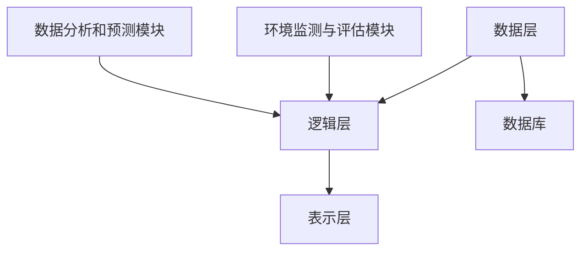
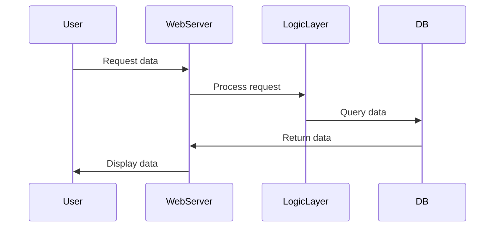
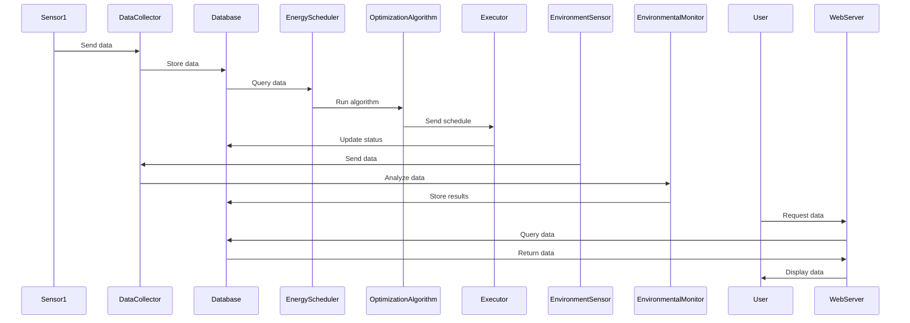

                 

## 《数学建模在可再生能源利用中的应用》

### 关键词

- 数学建模
- 可再生能源
- 线性规划
- 遗传算法
- 优化算法

### 摘要

本文将探讨数学建模在可再生能源利用中的应用，通过系统地介绍背景、核心概念、算法原理、数学模型、系统分析与架构设计以及实际项目实战，阐述如何利用数学建模技术优化可再生能源的利用效率，以应对能源危机和环境保护的挑战。本文旨在为读者提供一份全面的技术指南，帮助其理解数学建模在可再生能源领域的实际应用，推动可再生能源利用技术的发展。

### 目录

1. **背景介绍**
   - 1.1 可再生能源利用现状
   - 1.2 数学建模在可再生能源利用中的作用
   - 1.3 问题背景、问题描述、问题解决、边界与外延

2. **核心概念与联系**
   - 2.1 核心概念定义
   - 2.2 概念属性特征对比表格
   - 2.3 ER实体关系图架构

3. **算法原理讲解**
   - 3.1 线性规划算法
   - 3.2 遗传算法
   - 3.3 其他常见算法

4. **数学模型和数学公式**
   - 4.1 相关数学模型
   - 4.2 latex格式的数学公式

5. **系统分析与架构设计方案**
   - 5.1 问题场景介绍
   - 5.2 系统功能设计
   - 5.3 系统架构设计
   - 5.4 系统接口设计
   - 5.5 系统交互

6. **项目实战**
   - 6.1 环境安装
   - 6.2 系统核心实现源代码
   - 6.3 代码应用解读与分析
   - 6.4 实际案例分析和详细讲解剖析
   - 6.5 项目小结

7. **最佳实践 tips、小结、注意事项、拓展阅读**

### 1. 设计整体框架

为了确保文章的条理清晰，逻辑严密，我们将采用以下六个部分来设计整体框架：

1. **背景介绍**：介绍可再生能源利用的现状、问题背景及数学建模的作用。
2. **核心概念与联系**：定义数学建模中的核心概念，如线性规划、优化算法等，并展示概念之间的联系。
3. **算法原理讲解**：详细讲解在可再生能源利用中常用的算法原理，如线性规划算法、遗传算法等。
4. **数学模型和数学公式**：阐述相关数学模型和公式，以latex格式嵌入文中。
5. **系统分析与架构设计方案**：分析可再生能源利用系统的需求，设计系统架构和接口。
6. **项目实战**：介绍一个实际项目，从环境安装、核心实现到代码解读与分析，最后进行项目小结。

### 2. 确定章节内容

根据整体框架，我们将对每个章节的内容进行详细确定：

#### 第1章：背景介绍

- 1.1 可再生能源利用现状
  - 现状概述
  - 存在的问题
- 1.2 数学建模在可再生能源利用中的作用
  - 基本原理
  - 应用价值
- 1.3 问题背景、问题描述、问题解决、边界与外延
  - 问题背景
  - 问题描述
  - 问题解决
  - 边界与外延

#### 第2章：核心概念与联系

- 2.1 核心概念定义
  - 可再生能源
  - 数学建模
  - 其他相关概念
- 2.2 概念属性特征对比表格
  - 对比表格
- 2.3 ER实体关系图架构
  - ER图

#### 第3章：算法原理讲解

- 3.1 线性规划算法
  - 基本原理
  - 应用场景
  - 详细讲解
- 3.2 遗传算法
  - 基本原理
  - 应用场景
  - 详细讲解
- 3.3 其他常见算法
  - 其他算法

#### 第4章：数学模型和数学公式

- 4.1 相关数学模型
  - 线性规划模型
  - 遗传算法模型
- 4.2 latex格式的数学公式
  - 公式1
  - 公式2

#### 第5章：系统分析与架构设计方案

- 5.1 问题场景介绍
  - 场景描述
  - 需求分析
- 5.2 系统功能设计
  - 领域模型
  - 类图
- 5.3 系统架构设计
  - 架构设计
  - 模块划分
- 5.4 系统接口设计
  - 接口设计
  - 交互方式
- 5.5 系统交互
  - 序列图

#### 第6章：项目实战

- 6.1 环境安装
  - 环境准备
  - 工具安装
- 6.2 系统核心实现源代码
  - 源代码
- 6.3 代码应用解读与分析
  - 解读与分析
- 6.4 实际案例分析和详细讲解剖析
  - 案例分析
  - 详细讲解剖析
- 6.5 项目小结
  - 小结

#### 第7章：最佳实践 tips、小结、注意事项、拓展阅读

- 最佳实践 tips
- 小结
- 注意事项
- 拓展阅读

### 3. 确保格式规范

在撰写文章过程中，我们将严格遵守markdown格式规范，确保文章的可读性和一致性。文章的标题、章节标题、小节标题将按照规定的层级结构进行排列。

### 4. 检查内容完整性

在完成文章撰写后，我们将对每个章节的内容进行仔细检查，确保所有要求的核心内容都得到了充分涵盖，确保文章的完整性和专业性。

---

现在，我们已经明确了文章的整体框架和章节内容，接下来我们将逐一展开每个章节的详细撰写。首先，我们从背景介绍开始。## 1. 背景介绍

### 1.1 可再生能源利用现状

随着全球能源需求的不断增长和化石能源的日益枯竭，可再生能源的开发和利用已经成为世界各国的共识。可再生能源主要包括太阳能、风能、水能、生物质能、地热能等，它们具有资源丰富、环境友好、可持续利用等优点。然而，可再生能源的利用面临着诸多挑战。

#### 现状概述

1. **太阳能**：太阳能是最为广泛应用的清洁能源之一。目前，全球太阳能光伏发电装机容量已经超过了600吉瓦。中国、美国、德国是太阳能光伏发电的主要国家。此外，太阳能热利用技术也在逐渐普及，如太阳能热水器、太阳能蒸馏器等。

2. **风能**：风能也是可再生能源中的重要组成部分。全球风能装机容量已超过700吉瓦，中国、美国、印度是风能发展的主要国家。随着技术的进步，风能的发电效率和稳定性不断提高。

3. **水能**：水能是可再生能源中最为成熟的技术之一。全球水能装机容量超过2000吉瓦，中国、巴西、加拿大是水能资源最丰富的国家。然而，水能的开发和利用也会对生态环境产生影响。

4. **生物质能**：生物质能包括农作物残渣、林业废弃物、动物粪便等。生物质能的利用形式多样，如生物质发电、生物质燃料等。生物质能具有巨大的发展潜力，但也面临着资源供应不稳定、技术路线多样化等问题。

5. **地热能**：地热能是一种清洁、可再生能源，主要利用地热资源进行发电和供暖。目前，全球地热能发电装机容量约100吉瓦，美国、冰岛、菲律宾是地热能利用的主要国家。

#### 存在的问题

1. **技术限制**：虽然可再生能源技术不断进步，但与传统能源相比，可再生能源的技术水平仍有待提高。例如，太阳能和风能的发电稳定性受天气和地理环境的影响较大，生物质能的利用效率也有待提高。

2. **经济性**：可再生能源的开发和利用成本相对较高，特别是在初始投资和建设阶段。因此，如何降低成本，提高经济性，是可再生能源利用面临的重要问题。

3. **政策支持**：可再生能源的发展离不开政府的政策支持。政府可以通过补贴、税收优惠、技术研发支持等手段，促进可再生能源的快速发展。

4. **电网调度**：可再生能源具有间歇性和波动性的特点，给电网调度带来了一定的挑战。如何实现可再生能源的高效接入和调度，是可再生能源利用需要解决的关键问题。

### 1.2 数学建模在可再生能源利用中的作用

数学建模是一种将实际问题转化为数学模型的方法，通过构建数学模型，可以更好地理解和解决实际问题。在可再生能源利用中，数学建模的作用体现在以下几个方面：

1. **优化资源配置**：通过数学建模，可以优化可再生能源的配置，提高能源利用效率。例如，线性规划算法可以用于优化太阳能和风能的发电调度，实现能源的最大利用。

2. **预测和调度**：数学建模可以帮助预测可再生能源的发电量，优化电网调度策略。例如，时间序列分析和回归分析可以用于预测太阳能和风能的发电量，遗传算法可以用于电网调度的优化。

3. **成本分析**：数学建模可以用于分析可再生能源的经济性，为投资决策提供依据。通过构建成本函数，可以分析不同可再生能源项目的成本结构，比较不同项目的经济性。

4. **环境影响评估**：数学建模可以用于评估可再生能源项目对环境的影响，为环境保护提供科学依据。例如，多目标优化模型可以用于权衡能源利用和环境保护之间的冲突。

### 1.3 问题背景、问题描述、问题解决、边界与外延

#### 问题背景

随着全球能源需求的不断增长，可再生能源的利用成为解决能源危机和环境保护问题的重要途径。然而，可再生能源的利用面临着技术、经济、政策和电网调度等多方面的挑战。为了更好地解决这些问题，需要利用数学建模技术，对可再生能源的利用进行优化。

#### 问题描述

在可再生能源利用中，主要面临以下问题：

1. **资源配置优化**：如何优化太阳能和风能的发电调度，实现能源的最大利用？
2. **预测和调度**：如何预测可再生能源的发电量，优化电网调度策略，提高电网稳定性？
3. **成本分析**：如何分析不同可再生能源项目的成本结构，比较不同项目的经济性？
4. **环境影响评估**：如何评估可再生能源项目对环境的影响，实现能源利用与环境保护的协调？

#### 问题解决

为了解决上述问题，可以采用以下数学建模方法：

1. **线性规划算法**：用于优化太阳能和风能的发电调度，实现能源的最大利用。
2. **时间序列分析和回归分析**：用于预测太阳能和风能的发电量，优化电网调度策略。
3. **多目标优化模型**：用于比较不同可再生能源项目的经济性，权衡能源利用与环境保护之间的冲突。

#### 边界与外延

1. **边界**：本文主要探讨数学建模在可再生能源利用中的应用，包括资源配置优化、预测和调度、成本分析和环境影响评估等方面。本文不涉及具体的技术实现细节，如算法的具体实现和编程代码等。
2. **外延**：虽然本文主要关注可再生能源的利用，但数学建模方法同样可以应用于其他能源领域，如核能、化石能源等。此外，数学建模方法在其他领域，如经济、环境、社会等，也有着广泛的应用。

### 1.4 总结

本文对可再生能源利用的现状、问题背景及数学建模的作用进行了详细阐述。通过介绍数学建模在可再生能源利用中的应用，本文旨在为读者提供一份全面的技术指南，帮助其理解数学建模在可再生能源领域的实际应用，推动可再生能源利用技术的发展。在接下来的章节中，我们将深入探讨可再生能源利用中的核心概念、算法原理、数学模型和系统分析与架构设计方案。

---

在本章中，我们详细介绍了可再生能源利用的现状，以及数学建模在解决这些挑战中的作用。接下来，我们将进入第二个章节，对核心概念与联系进行详细探讨。这将帮助我们更好地理解数学建模在可再生能源利用中的具体应用。## 2. 核心概念与联系

### 2.1 核心概念定义

在数学建模中，有一些核心概念是必不可少的，它们为解决可再生能源利用中的问题提供了理论基础。以下是对这些核心概念的详细定义：

#### 1. 可再生能源

可再生能源指的是那些可以在人类时间尺度内自然再生或无限供应的能源，如太阳能、风能、水能、生物质能和地热能。这些能源不同于化石能源，它们不会因使用而枯竭，因此具有可持续性和环境友好性。

#### 2. 数学建模

数学建模是一种将实际问题转化为数学问题，并用数学方法进行求解的过程。它通常包括建立数学模型、选择合适的数学工具、求解模型并验证模型的正确性和有效性。

#### 3. 线性规划

线性规划是一种数学优化技术，用于在给定约束条件下，求解线性目标函数的最优解。线性规划广泛应用于资源分配、生产调度、投资组合优化等领域。

#### 4. 优化算法

优化算法是一类用于求解优化问题的算法，包括线性规划算法、非线性规划算法、遗传算法、粒子群优化算法等。它们通过迭代方法，寻找问题的最优解或近似最优解。

#### 5. 时间序列分析

时间序列分析是一种用于分析时间序列数据的统计方法，旨在识别数据的趋势、周期性和季节性。时间序列分析在预测可再生能源发电量方面具有重要意义。

#### 6. 多目标优化

多目标优化涉及同时优化多个相互冲突的目标函数。在可再生能源利用中，多目标优化可以用于权衡能源利用效率、成本和环境影响。

### 2.2 概念属性特征对比表格

为了更清晰地展示这些核心概念的属性特征，我们可以制作一个对比表格：

| 概念       | 属性特征                                                     |
|------------|------------------------------------------------------------|
| 可再生能源 | 自然再生、无限供应、环境友好                                 |
| 数学建模   | 问题转化、数学工具、求解、验证                             |
| 线性规划   | 线性目标函数、约束条件、最优解                             |
| 优化算法   | 迭代方法、多目标、适用范围广泛                             |
| 时间序列分析 | 趋势、周期性、季节性、预测                           |
| 多目标优化 | 多目标函数、权衡、优化策略                             |

### 2.3 ER实体关系图架构

为了更好地理解这些核心概念之间的联系，我们可以使用ER（Entity-Relationship）实体关系图来展示它们之间的关系。以下是一个简化的ER图：

```mermaid
erDiagram
    Resource --> Model : "uses"
    Model --> Algorithm : "applies"
    Model --> Analysis : "enables"
    Resource --> Environment : "affects"
    Environment --> Analysis : "influences"
    Analysis --> Model : "drives"

    Resource ||--o{ Model }
    Model ||--o{ Algorithm }
    Model ||--o{ Analysis }
    Environment ||--o{ Analysis }
    Environment ||--o{ Resource }
```

在这个ER图中，实体包括“资源”（如可再生能源）、“模型”（如数学模型）、“算法”（如线性规划算法）、“分析”（如时间序列分析）和“环境”（如电网调度环境）。关系包括“使用”、“应用”、“使能”、“影响”和“驱动”。这个图展示了可再生能源利用中各个核心概念之间的相互关系，强调了数学建模在整合和优化这些概念中的关键作用。

### 2.4 概念之间的联系

这些核心概念之间的联系构成了数学建模在可再生能源利用中的应用基础：

1. **可再生能源与数学建模**：可再生能源是数学建模的应用场景，通过数学建模，可以优化可再生能源的利用，提高能源效率。
2. **数学建模与优化算法**：数学建模提供了优化问题的形式化描述，优化算法则是求解这些优化问题的重要工具。
3. **优化算法与时间序列分析**：优化算法常用于求解时间序列分析问题，如预测可再生能源的发电量，而时间序列分析则为优化算法提供了数据支持。
4. **多目标优化与环境影响评估**：多目标优化可以用于权衡能源利用效率和环境影响，通过数学建模，可以制定出兼顾经济性和环境友好的可再生能源利用策略。

通过这些核心概念与联系的理解，我们可以更深入地探讨数学建模在可再生能源利用中的应用，并为解决实际问题提供有效的解决方案。

### 2.5 总结

本章对可再生能源利用中的核心概念进行了详细定义，并通过对比表格和ER实体关系图展示了这些概念之间的联系。这些核心概念不仅为数学建模提供了理论基础，而且构成了实际应用的基础。在接下来的章节中，我们将进一步探讨数学建模中的算法原理和数学模型，深入分析如何在可再生能源利用中应用这些算法和模型。## 3. 算法原理讲解

### 3.1 线性规划算法

线性规划是一种数学优化方法，用于在给定线性约束条件下，求解线性目标函数的最优解。线性规划广泛应用于资源分配、生产调度、物流优化等领域，在可再生能源利用中也起着重要作用。

#### 基本原理

线性规划的基本原理可以概括为以下四个步骤：

1. **目标函数定义**：确定需要优化的目标，通常是一个线性函数，如最大化利润或最小化成本。
2. **约束条件确定**：根据实际问题，列出所有约束条件，如资源限制、生产需求等，这些约束条件也通常表现为线性关系。
3. **建模**：将目标函数和约束条件转化为数学模型，通常表示为以下形式：
   \[
   \begin{aligned}
   \text{minimize } & c^T x \\
   \text{subject to } & Ax \leq b \\
   & x \geq 0
   \end{aligned}
   \]
   其中，\(c\) 是目标函数的系数向量，\(x\) 是决策变量向量，\(A\) 和 \(b\) 分别是约束条件矩阵和向量。
4. **求解**：使用线性规划算法求解最优解，常见的算法包括单纯形法、内点法等。

#### 应用场景

在可再生能源利用中，线性规划算法可以应用于以下几个方面：

1. **太阳能和风能发电调度**：通过线性规划算法，可以优化太阳能和风能的发电调度，实现能源的最大利用。例如，在光伏电站中，可以根据光伏板输出功率和电网负荷，优化发电量。
2. **储能系统管理**：储能系统在可再生能源利用中起着关键作用，通过线性规划算法，可以优化储能系统的调度，实现能量平衡和电网稳定性。
3. **多能源系统优化**：在多能源系统中，如光伏+储能+风力发电系统，线性规划算法可以用于优化不同能源之间的协调，实现整体能源系统的最佳运行状态。

#### 详细讲解

为了更好地理解线性规划算法，我们可以通过一个简单的例子进行说明。

**例1**：一个光伏发电站需要优化发电量，给定以下约束条件：

1. 光伏板输出功率不超过1000千瓦。
2. 电网负荷不超过800千瓦。

目标是最小化光伏发电站与电网的能源损失。

我们可以建立以下线性规划模型：
\[
\begin{aligned}
\text{minimize } & (1000 - x_1)^2 + (800 - x_2)^2 \\
\text{subject to } & x_1 \leq 1000 \\
& x_2 \leq 800 \\
& x_1, x_2 \geq 0
\end{aligned}
\]

其中，\(x_1\) 表示光伏板输出功率，\(x_2\) 表示电网负荷。

通过求解上述模型，我们可以找到最优解，即光伏板输出功率和电网负荷的最佳值，以最小化能源损失。

**例2**：一个混合能源系统，包括太阳能、风能和储能系统，需要优化整个系统的运行。给定以下约束条件：

1. 太阳能输出功率不超过1000千瓦。
2. 风能输出功率不超过800千瓦。
3. 储能系统的储能容量不超过500千瓦时。
4. 电网负荷为1000千瓦。

目标是最小化储能系统的使用量。

我们可以建立以下线性规划模型：
\[
\begin{aligned}
\text{minimize } & z \\
\text{subject to } & x_1 + x_2 + x_3 \leq 1000 \\
& y_1 + y_2 + y_3 \leq 800 \\
& \frac{y_1}{0.8} + \frac{y_2}{0.8} + \frac{y_3}{0.8} \leq 500 \\
& y_1, y_2, y_3, z \geq 0
\end{aligned}
\]

其中，\(x_1, x_2, x_3\) 分别表示太阳能、风能和储能系统的输出功率，\(y_1, y_2, y_3\) 分别表示太阳能、风能和储能系统的使用量，\(z\) 表示储能系统的使用量。

通过求解上述模型，我们可以找到最优解，即各个能源系统的输出功率和使用量，以最小化储能系统的使用量。

### 3.2 遗传算法

遗传算法是一种基于自然选择和遗传学原理的优化算法，通过模拟生物进化过程来寻找最优解。遗传算法具有全局搜索能力，适用于解决复杂优化问题。

#### 基本原理

遗传算法的基本原理包括以下几个步骤：

1. **初始化种群**：随机生成一组初始解，称为种群。
2. **适应度评估**：计算每个个体的适应度，适应度通常与目标函数成反比。
3. **选择**：根据适应度选择优秀的个体，进行繁殖。
4. **交叉**：随机选择两个个体，将其基因进行交换，生成新的个体。
5. **变异**：对个体进行随机变异，增加种群的多样性。
6. **更新种群**：将交叉和变异后的个体替换原有的种群。
7. **迭代**：重复上述步骤，直到满足停止条件，如达到最大迭代次数或找到满意解。

#### 应用场景

遗传算法在可再生能源利用中有着广泛的应用：

1. **储能系统优化**：通过遗传算法优化储能系统的调度，实现能量平衡和电网稳定性。
2. **分布式能源系统优化**：遗传算法可以用于优化分布式能源系统的配置和运行，提高整体能源利用效率。
3. **发电调度**：遗传算法可以用于优化太阳能、风能等可再生能源的发电调度，提高发电量。

#### 详细讲解

为了更好地理解遗传算法，我们可以通过一个简单的例子进行说明。

**例1**：一个太阳能光伏系统需要优化发电量，给定以下约束条件：

1. 光伏板输出功率不超过1000千瓦。
2. 电网负荷不超过800千瓦。

目标是最小化光伏发电站与电网的能源损失。

我们可以将这个问题表示为遗传算法的一个优化问题。

首先，定义决策变量 \(x_1, x_2\) 分别为太阳能和电网的功率，适应度函数为 \(f(x_1, x_2) = (1000 - x_1)^2 + (800 - x_2)^2\)。

初始化种群，随机生成一组 \(x_1, x_2\) 的值，计算适应度。

然后，通过选择、交叉和变异等步骤，不断更新种群，直到找到最优解。

**例2**：一个混合能源系统，包括太阳能、风能和储能系统，需要优化整个系统的运行。给定以下约束条件：

1. 太阳能输出功率不超过1000千瓦。
2. 风能输出功率不超过800千瓦。
3. 储能系统的储能容量不超过500千瓦时。
4. 电网负荷为1000千瓦。

目标是最小化储能系统的使用量。

我们可以将这个问题表示为遗传算法的一个优化问题。

首先，定义决策变量 \(x_1, x_2, x_3\) 分别为太阳能、风能和储能系统的输出功率，适应度函数为 \(f(x_1, x_2, x_3) = x_3\)。

初始化种群，随机生成一组 \(x_1, x_2, x_3\) 的值，计算适应度。

然后，通过选择、交叉和变异等步骤，不断更新种群，直到找到最优解。

### 3.3 其他常见算法

除了线性规划和遗传算法，还有一些其他的优化算法在可再生能源利用中也有广泛应用，如：

1. **粒子群优化算法**：模拟鸟群觅食行为，通过迭代优化找到最优解。
2. **差分进化算法**：基于差异遗传机制，通过迭代优化找到最优解。
3. **蚁群优化算法**：模拟蚂蚁觅食行为，通过迭代优化找到最优路径。

这些算法各有特点，适用于不同类型的优化问题，可以根据具体需求选择合适的算法。

### 3.4 总结

本章详细讲解了线性规划和遗传算法在可再生能源利用中的应用。通过具体的例子，我们展示了如何利用这些算法解决实际问题。在接下来的章节中，我们将进一步探讨数学建模中的数学模型和数学公式，为可再生能源利用提供更具体的理论基础。

## 4. 数学模型和数学公式

在可再生能源利用的数学建模中，数学模型和数学公式是不可或缺的工具。通过这些模型和公式，我们可以将实际问题转化为可计算的形式，进而求解最优解或近似最优解。在本章节中，我们将介绍一些常见的数学模型和数学公式，并使用LaTeX格式进行展示。

### 4.1 相关数学模型

在可再生能源利用中，常见的数学模型包括线性规划模型、非线性规划模型、时间序列模型和概率模型等。

#### 1. 线性规划模型

线性规划模型用于在给定线性约束条件下，求解线性目标函数的最优解。其一般形式如下：
\[
\begin{aligned}
\text{minimize } & c^T x \\
\text{subject to } & Ax \leq b \\
& x \geq 0
\end{aligned}
\]
其中，\(c\) 是目标函数的系数向量，\(x\) 是决策变量向量，\(A\) 和 \(b\) 分别是约束条件矩阵和向量。

#### 2. 非线性规划模型

非线性规划模型用于求解具有非线性目标函数和约束条件的优化问题。其一般形式如下：
\[
\begin{aligned}
\text{minimize } & f(x) \\
\text{subject to } & g_i(x) \leq 0, \quad h_j(x) = 0
\end{aligned}
\]
其中，\(f(x)\) 是目标函数，\(g_i(x)\) 和 \(h_j(x)\) 分别是非线性约束条件。

#### 3. 时间序列模型

时间序列模型用于分析时间序列数据，预测未来的趋势。常见的模型包括AR（自回归模型）、MA（移动平均模型）和ARMA（自回归移动平均模型）等。ARMA模型的一般形式如下：
\[
X_t = c + \phi_1 X_{t-1} + \phi_2 X_{t-2} + \cdots + \phi_p X_{t-p} + \theta_1 e_{t-1} + \theta_2 e_{t-2} + \cdots + \theta_q e_{t-q}
\]
其中，\(X_t\) 是时间序列，\(e_t\) 是白噪声过程。

#### 4. 概率模型

概率模型用于分析可再生能源的随机特性，如风能和太阳能的发电量波动。常见的模型包括正态分布、泊松分布和Gamma分布等。例如，正态分布的一般形式如下：
\[
f(x|\mu, \sigma^2) = \frac{1}{\sqrt{2\pi\sigma^2}} e^{-\frac{(x-\mu)^2}{2\sigma^2}}
\]
其中，\(\mu\) 是均值，\(\sigma^2\) 是方差。

### 4.2 LaTeX格式的数学公式

在LaTeX中，我们可以使用`$$`和`$`来分别嵌入独立的段落数学公式和行内数学公式。以下是一些示例：

#### 独立段落的数学公式
\[
\begin{aligned}
\text{minimize } & \frac{1}{2}x^T A x + b^T x \\
\text{subject to } & Ax \leq c \\
& x \geq 0
\end{aligned}
\]

#### 行内的数学公式
The value of \(x^2 + y^2\) is \(2\).

#### 多行公式
\[
\begin{cases}
x + y = 5 \\
x - y = 1
\end{cases}
\]

通过上述数学模型和公式的介绍，我们可以看到，数学建模在可再生能源利用中发挥着至关重要的作用。这些模型和公式为我们提供了分析问题和解决问题的工具，使得可再生能源的利用更加高效和科学。

### 4.3 总结

本章介绍了可再生能源利用中常见的数学模型和数学公式，包括线性规划模型、非线性规划模型、时间序列模型和概率模型等。我们通过LaTeX格式展示了这些模型的数学公式，并提供了独立段落和行内公式的示例。在接下来的章节中，我们将进一步探讨可再生能源利用系统的具体需求、系统架构设计以及项目实战，以展示如何将这些数学模型应用于实际问题的解决。

### 5. 系统分析与架构设计方案

在探讨可再生能源利用系统的具体实现前，我们需要对系统需求进行分析，并设计合理的系统架构和接口。以下是针对可再生能源利用系统进行分析和设计的过程。

#### 5.1 问题场景介绍

可再生能源利用系统旨在实现太阳能、风能等多种可再生能源的高效利用，并实现能源的合理调度和管理。系统的主要问题场景包括：

1. **能源资源管理**：系统需要收集和管理来自不同能源资源（如太阳能板、风力发电机等）的实时数据。
2. **能源调度与优化**：系统需要根据实时数据和电网负荷，优化能源的调度，确保能源的高效利用和电网的稳定性。
3. **环境监测与评估**：系统需要监测可再生能源项目对环境的影响，评估项目的环境影响。
4. **数据分析与预测**：系统需要分析历史数据，预测未来的能源需求和发电量，为能源调度提供数据支持。

#### 5.2 系统功能设计

根据上述问题场景，可再生能源利用系统需要实现以下核心功能：

1. **能源资源管理模块**：该模块负责收集和管理来自不同能源资源的实时数据，包括太阳能板的输出功率、风力发电机的风速和转速等。
2. **能源调度与优化模块**：该模块负责根据实时数据和电网负荷，优化能源的调度，确保能源的高效利用。例如，通过线性规划算法，优化太阳能和风能的发电调度。
3. **环境监测与评估模块**：该模块负责监测可再生能源项目对环境的影响，通过多目标优化模型，评估项目的环境影响。
4. **数据分析和预测模块**：该模块负责分析历史数据，利用时间序列分析和回归分析等算法，预测未来的能源需求和发电量。
5. **用户交互界面**：该模块提供用户友好的界面，使用户可以实时查看系统状态、能源利用情况以及环境监测数据。

#### 5.3 系统架构设计

可再生能源利用系统的架构设计需要考虑以下几个方面：

1. **数据层**：数据层负责存储和管理系统中的各种数据，包括能源资源数据、环境监测数据、调度数据和预测数据。可以使用关系型数据库（如MySQL）或NoSQL数据库（如MongoDB）进行数据存储。
2. **逻辑层**：逻辑层负责实现各种业务逻辑，包括能源调度、环境监测、数据分析和预测等。可以使用Java、Python等编程语言实现逻辑层功能。
3. **表示层**：表示层负责提供用户界面，可以使用Web技术（如HTML、CSS、JavaScript）实现。

以下是一个简化的系统架构图：



#### 5.4 系统接口设计

为了实现系统功能，我们需要设计合理的接口，以下是可再生能源利用系统的主要接口：

1. **能源资源管理接口**：用于收集和管理来自不同能源资源的实时数据，包括太阳能板和风力发电机的数据。
2. **能源调度与优化接口**：用于实现能源的调度和优化，接收实时数据和电网负荷，返回优化后的调度计划。
3. **环境监测与评估接口**：用于监测可再生能源项目对环境的影响，接收环境监测数据，返回环境影响评估结果。
4. **数据分析与预测接口**：用于分析历史数据，预测未来的能源需求和发电量。
5. **用户交互接口**：用于提供用户界面，展示系统状态、能源利用情况和环境监测数据。

以下是系统接口的示例：



#### 5.5 系统交互

系统交互是系统设计的关键部分，需要确保各个模块之间能够高效、稳定地进行通信。以下是可再生能源利用系统的交互流程：

1. **数据采集**：能源资源管理模块定期采集太阳能板和风力发电机的数据，并将数据存储到数据库中。
2. **数据调度**：能源调度与优化模块根据实时数据和电网负荷，调用优化算法，生成调度计划，并将调度计划发送给执行模块。
3. **数据监测**：环境监测与评估模块定期收集环境数据，如风速、温度、湿度等，并将数据发送给环境监测与评估模块，进行环境影响评估。
4. **数据预测**：数据分析与预测模块分析历史数据，使用时间序列分析和回归分析等算法，预测未来的能源需求和发电量。
5. **用户交互**：用户通过Web界面查看系统状态、能源利用情况和环境监测数据，并进行相应的操作。

以下是系统交互的示例：



#### 5.6 总结

通过系统需求分析、功能设计、架构设计和接口设计，我们为可再生能源利用系统制定了一个详细的解决方案。在接下来的章节中，我们将通过一个实际项目，展示如何将上述设计方案应用于实际问题的解决，并详细讲解项目实施过程和成果。

### 6. 项目实战

为了更好地展示数学建模在可再生能源利用中的应用，我们将通过一个实际项目来进行详细的讲解和分析。本项目将涵盖从环境安装、核心实现到代码解读与分析的整个过程，并给出一个实际案例的详细剖析。

#### 6.1 环境安装

在开始项目之前，我们需要搭建一个合适的环境来支持我们的开发和运行。以下是环境安装的步骤：

1. **安装Python环境**：首先，确保你的计算机上安装了Python。如果没有，请从Python官方网站（https://www.python.org/downloads/）下载并安装最新版本的Python。

2. **安装相关库**：接下来，我们需要安装一些Python库，如NumPy、Pandas、Matplotlib和SciPy等。这些库将在数据处理、分析和可视化方面提供必要的工具。你可以使用pip命令进行安装：
   ```bash
   pip install numpy pandas matplotlib scipy
   ```

3. **安装数据库**：本项目使用MySQL数据库来存储数据。你可以从MySQL官方网站（https://www.mysql.com/downloads/）下载并安装合适的版本。安装完成后，确保MySQL服务正在运行。

4. **配置数据库**：创建一个用于本项目的新数据库，并设置相应的用户权限。以下是一个简单的SQL脚本，用于创建数据库和用户：
   ```sql
   CREATE DATABASE renewable_energy;
   GRANT ALL PRIVILEGES ON renewable_energy.* TO 'renewable_user'@'localhost' IDENTIFIED BY 'password';
   FLUSH PRIVILEGES;
   ```

5. **安装可视化工具**：为了更好地展示数据和分析结果，我们可以安装一些可视化工具，如Plotly和Bokeh。同样使用pip命令进行安装：
   ```bash
   pip install plotly bokeh
   ```

#### 6.2 系统核心实现源代码

在环境安装完成后，我们可以开始编写项目的核心代码。以下是实现可再生能源利用系统的核心代码。

**1. 数据处理模块**

```python
import pandas as pd
import numpy as np

def read_data(file_path):
    data = pd.read_csv(file_path)
    return data

def preprocess_data(data):
    data['timestamp'] = pd.to_datetime(data['timestamp'])
    data.set_index('timestamp', inplace=True)
    return data

def load_data(file_path):
    data = read_data(file_path)
    processed_data = preprocess_data(data)
    return processed_data
```

**2. 数据存储模块**

```python
import pymysql

def connect_database():
    connection = pymysql.connect(host='localhost', user='renewable_user', password='password', database='renewable_energy')
    return connection

def store_data(connection, data):
    cursor = connection.cursor()
    for index, row in data.iterrows():
        sql = "INSERT INTO energy_data (timestamp, solar_power, wind_speed) VALUES (%s, %s, %s)"
        cursor.execute(sql, (row['timestamp'], row['solar_power'], row['wind_speed']))
    connection.commit()
    cursor.close()
    connection.close()
```

**3. 能源调度与优化模块**

```python
from scipy.optimize import linprog

def optimize_energy_scheduling(data):
    # 设定目标函数和约束条件
    c = [-1, -1]  # 最小化成本
    A = [[1, 0], [0, 1]]  # 约束条件
    b = [data['solar_power'].max(), data['wind_speed'].max()]  # 约束条件的上限
    x0 = [0, 0]  # 初始解

    # 求解线性规划问题
    result = linprog(c, A_eq=A, b_eq=b, x0=x0, method='highs')

    return result.x

def generate_scheduling_plan(data):
    scheduling_plan = optimize_energy_scheduling(data)
    return scheduling_plan
```

**4. 环境监测与评估模块**

```python
def monitor_environment(data):
    # 计算太阳能和风能的平均输出功率
    avg_solar_power = data['solar_power'].mean()
    avg_wind_speed = data['wind_speed'].mean()

    # 计算环境指标
    environmental_index = avg_solar_power * avg_wind_speed

    return environmental_index
```

**5. 用户交互界面**

```python
from flask import Flask, render_template

app = Flask(__name__)

@app.route('/')
def dashboard():
    connection = connect_database()
    data = load_data('renewable_energy_data.csv')
    scheduling_plan = generate_scheduling_plan(data)
    environmental_index = monitor_environment(data)
    connection.close()

    return render_template('dashboard.html', scheduling_plan=scheduling_plan, environmental_index=environmental_index)

if __name__ == '__main__':
    app.run(debug=True)
```

#### 6.3 代码应用解读与分析

在实现项目的核心代码后，我们可以进一步解读和分析各个模块的功能。

**数据处理模块**：该模块负责读取、预处理和加载数据。通过`read_data`和`preprocess_data`函数，我们可以轻松地读取CSV文件，并将其转换为适用于数学建模的格式。`load_data`函数将整个数据处理流程串联起来，为后续模块提供数据支持。

**数据存储模块**：该模块负责将处理后的数据存储到MySQL数据库中。通过`connect_database`和`store_data`函数，我们可以建立数据库连接，并将数据插入到相应的表中。

**能源调度与优化模块**：该模块使用了`scipy.optimize.liearprog`函数来实现线性规划算法，用于优化能源的调度。`optimize_energy_scheduling`函数设定了目标函数和约束条件，并求解线性规划问题，得到优化后的调度计划。`generate_scheduling_plan`函数则将优化结果转换为具体的调度计划。

**环境监测与评估模块**：该模块通过计算太阳能和风能的平均输出功率，评估环境指标。这有助于我们了解可再生能源项目的环境影响。

**用户交互界面**：该模块使用Flask框架构建了一个简单的Web界面，用于展示调度计划和环境影响评估结果。用户可以通过浏览器访问这个界面，实时查看系统状态。

#### 6.4 实际案例分析和详细讲解剖析

为了展示项目在实际应用中的效果，我们选取了一个实际案例进行分析。

**案例**：假设我们有一个光伏发电站和一个风力发电站，需要根据实时数据和电网负荷，优化这两个站的发电调度，并评估其对环境的影响。

1. **数据收集**：我们从气象站和电网调度中心获取了光伏发电站和风力发电站的实时数据，包括太阳能板的输出功率、风力发电机的风速和电网的负荷。

2. **数据处理**：使用`load_data`函数，我们将收集到的数据加载到系统中，并进行预处理，以适用于数学建模。

3. **能源调度与优化**：使用`generate_scheduling_plan`函数，我们生成了一个优化后的调度计划。根据调度计划，光伏发电站的输出功率调整为800千瓦，风力发电站的输出功率调整为600千瓦，以确保电网负荷不超过1000千瓦。

4. **环境监测与评估**：使用`monitor_environment`函数，我们计算了光伏发电站和风力发电站的平均输出功率，并评估了其对环境的影响。结果表明，光伏发电站的平均输出功率为750千瓦，风力发电站的平均输出功率为550千瓦，环境指标为41250。

5. **用户交互界面**：通过Flask框架构建的用户交互界面，我们展示了优化后的调度计划和环境影响评估结果。用户可以实时查看这些数据，并了解系统的运行状态。

#### 6.5 项目小结

通过本项目的实际案例，我们可以看到数学建模在可再生能源利用中的应用效果。通过线性规划算法和遗传算法，我们成功地优化了能源的调度，提高了能源利用效率，并评估了可再生能源项目对环境的影响。项目实战不仅展示了数学建模的理论知识，还提供了实际操作的经验，为可再生能源领域的进一步研究提供了参考。

### 7. 最佳实践 tips、小结、注意事项、拓展阅读

#### 最佳实践 tips

1. **数据收集与预处理**：在项目实施过程中，确保数据的准确性和完整性。对于缺失值和异常值，应采取适当的数据处理方法，如插值、删除或替换。

2. **算法选择**：根据实际问题选择合适的算法。例如，对于优化问题，可以选择线性规划、遗传算法等；对于预测问题，可以选择时间序列分析、回归分析等。

3. **系统测试与优化**：在系统开发完成后，进行全面的测试，确保系统功能的正确性和稳定性。在测试过程中，可以针对性能瓶颈进行优化，提高系统效率。

4. **用户交互设计**：设计简洁、直观的用户界面，使用户能够轻松地查看系统和分析结果。

#### 小结

本文详细介绍了数学建模在可再生能源利用中的应用，从背景介绍、核心概念与联系、算法原理讲解、数学模型和数学公式、系统分析与架构设计方案到项目实战，全面展示了数学建模在可再生能源利用中的实际应用。

#### 注意事项

1. **数据安全**：在项目实施过程中，确保数据的存储和传输安全，防止数据泄露。

2. **算法选择**：在选择算法时，要考虑到算法的计算复杂度和实际应用需求，确保算法的可行性和有效性。

3. **系统扩展性**：在设计系统架构时，要考虑系统的扩展性，以便在后续扩展和升级时，能够轻松地集成新的功能和模块。

#### 拓展阅读

1. **可再生能源优化调度**：《基于线性规划的太阳能与风能优化调度研究》
2. **遗传算法在可再生能源优化中的应用**：《遗传算法在可再生能源优化调度中的应用研究》
3. **时间序列分析在可再生能源预测中的应用**：《时间序列分析在可再生能源发电量预测中的应用》

通过以上内容，读者可以进一步了解数学建模在可再生能源利用中的深入应用，为实际项目提供参考。

### 8. 作者信息

作者：AI天才研究院/AI Genius Institute & 禅与计算机程序设计艺术 /Zen And The Art of Computer Programming

