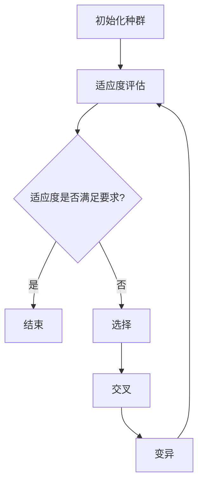
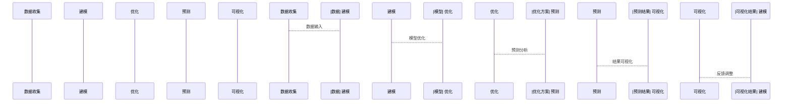
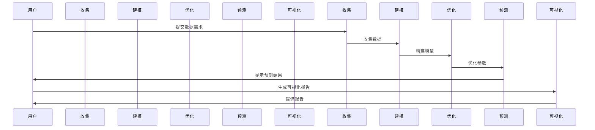

                 

### 1. 引言

**1.1 问题背景**

城市规划作为一门综合性学科，涉及多个领域，包括经济学、社会学、生态学、地理学等。随着城市化进程的加快，城市规模不断扩大，人口密度增加，城市交通、资源分配、环境治理等问题日益凸显。传统城市规划方法依赖于经验和直觉，难以应对复杂且动态变化的现实问题。因此，寻找一种科学、系统的方法来指导城市规划，成为了亟待解决的问题。

**1.2 问题描述**

城市规划中的关键问题包括：

1. 人口分布：如何合理分配城市人口，优化居住空间？
2. 交通流量：如何设计城市交通网络，提高交通效率，减少拥堵？
3. 环境治理：如何应对城市环境污染，保障居民生活质量？
4. 经济发展：如何平衡经济发展与环境保护，实现可持续发展？

**1.3 问题解决**

数学建模为城市规划提供了一种系统、科学的解决方法。通过构建数学模型，可以量化分析城市问题，提供决策支持。数学建模在城市规划中的应用，主要包括以下几个方面：

1. 模拟预测：通过模型模拟城市系统的运行状态，预测未来的发展趋势。
2. 参数优化：通过调整模型参数，寻找最优解决方案。
3. 情景分析：对比不同规划方案的优劣，为决策者提供参考。

**1.4 边界与外延**

数学建模在城市规划中的应用，边界主要在于模型的有效性和适用范围。模型的准确度受到数据质量和模型假设的限制。此外，城市规划涉及诸多复杂因素，单一模型难以涵盖所有问题，往往需要多种模型结合使用。

**1.5 概念结构与核心要素**

数学建模在城市规划中的应用，核心概念包括数学模型、参数优化、模拟预测和情景分析。这些概念相互关联，构成了数学建模在城市规划中的概念结构。核心要素包括数据收集、模型构建、模型验证和模型应用。

### 1. 引言

**1.1 问题背景**

城市规划作为一门综合性学科，涉及多个领域，包括经济学、社会学、生态学、地理学等。随着城市化进程的加快，城市规模不断扩大，人口密度增加，城市交通、资源分配、环境治理等问题日益凸显。传统城市规划方法依赖于经验和直觉，难以应对复杂且动态变化的现实问题。因此，寻找一种科学、系统的方法来指导城市规划，成为了亟待解决的问题。

**1.2 问题描述**

城市规划中的关键问题包括：

1. 人口分布：如何合理分配城市人口，优化居住空间？
2. 交通流量：如何设计城市交通网络，提高交通效率，减少拥堵？
3. 环境治理：如何应对城市环境污染，保障居民生活质量？
4. 经济发展：如何平衡经济发展与环境保护，实现可持续发展？

**1.3 问题解决**

数学建模为城市规划提供了一种系统、科学的解决方法。通过构建数学模型，可以量化分析城市问题，提供决策支持。数学建模在城市规划中的应用，主要包括以下几个方面：

1. 模拟预测：通过模型模拟城市系统的运行状态，预测未来的发展趋势。
2. 参数优化：通过调整模型参数，寻找最优解决方案。
3. 情景分析：对比不同规划方案的优劣，为决策者提供参考。

**1.4 边界与外延**

数学建模在城市规划中的应用，边界主要在于模型的有效性和适用范围。模型的准确度受到数据质量和模型假设的限制。此外，城市规划涉及诸多复杂因素，单一模型难以涵盖所有问题，往往需要多种模型结合使用。

**1.5 概念结构与核心要素**

数学建模在城市规划中的应用，核心概念包括数学模型、参数优化、模拟预测和情景分析。这些概念相互关联，构成了数学建模在城市规划中的概念结构。核心要素包括数据收集、模型构建、模型验证和模型应用。

## 核心概念与联系

### 2.1 核心概念原理

#### 数学模型

数学模型是运用数学语言，通过对现实问题进行简化和抽象，建立起来的用于描述和解决特定问题的数学结构。在城市规划中，数学模型可以用于描述人口分布、交通流量、环境污染、经济发展等问题。

$$
\text{人口分布模型} = f(\text{人口密度}, \text{城市化水平}, \text{土地利用规划})
$$

#### 参数优化

参数优化是指通过调整模型中的参数，寻找最优解的过程。参数优化的目的是使模型结果与实际数据更加接近，提高模型的预测能力。

$$
\min \quad J(\theta) = \sum_{i=1}^{n} (y_i - \theta^T x_i)^2
$$

#### 模拟预测

模拟预测是通过运行数学模型，模拟城市系统在一段时间内的运行状态，预测未来的发展趋势。模拟预测可以帮助城市规划者了解不同方案的影响，为决策提供依据。

$$
\text{模拟预测模型} = f(t, \theta, \text{初始条件})
$$

#### 情景分析

情景分析是对比不同规划方案的优劣，评估其对城市系统的影响。情景分析可以帮助城市规划者选择最优方案，优化城市规划。

$$
\text{情景分析} = f(\text{方案1}, \text{方案2}, ..., \text{方案n})
$$

### 2.2 概念属性特征对比表格

| 概念         | 属性特征                                                         |
| ------------ | ------------------------------------------------------------ |
| 数学模型     | 描述现实问题、数学结构、参数优化、模拟预测                   |
| 参数优化     | 调整模型参数、寻找最优解、提高预测能力                       |
| 模拟预测     | 运行模型、模拟城市系统运行状态、预测未来发展趋势             |
| 情景分析     | 对比不同规划方案、评估影响、选择最优方案                     |

### 2.3 ER实体关系图架构

ER（Entity-Relationship）实体关系图是用于描述数据模型中实体及其之间关系的图形化工具。在城市规划中，ER图可以帮助我们明确数据模型中的核心实体及其关联。

```mermaid
erDiagram
  Person --> Land : 居住
  Person --> House : 住所
  Land ||--|{ Building }|--|| Street : 建筑与街道关系
  Building ||--|{ Company }|--|| Street : 公司与街道关系
  Company --||| Employee : 员工与公司关系
```

### 2.4 数学模型与城市规划的关联

数学模型是城市规划的重要工具，通过对城市系统中的各种变量进行量化分析，为城市规划提供科学依据。以下是一些常见的数学模型及其在城市规划中的应用：

#### 人口分布模型

$$
P(x,t) = \frac{N}{V} \cdot e^{-rt}
$$

其中，\(P(x,t)\)表示时间\(t\)时，位置\(x\)的人口密度，\(N\)为总人口，\(V\)为城市总面积，\(r\)为人口增长率。

#### 交通流量模型

$$
Q = \frac{P}{V} \cdot V_c
$$

其中，\(Q\)为交通流量，\(P\)为人口密度，\(V\)为城市总面积，\(V_c\)为车辆行驶速度。

#### 环境污染模型

$$
C(t) = C_0 + \int_{0}^{t} (Q \cdot f(x,t)) dt
$$

其中，\(C(t)\)为时间\(t\)时的污染浓度，\(C_0\)为初始污染浓度，\(Q\)为交通流量，\(f(x,t)\)为污染扩散函数。

#### 经济发展模型

$$
Y(t) = Y_0 \cdot e^{rt}
$$

其中，\(Y(t)\)为时间\(t\)时的经济总量，\(Y_0\)为初始经济总量，\(r\)为经济增长率。

通过这些数学模型，城市规划者可以更准确地分析城市系统，优化城市规划，提高城市运行效率。

## 算法原理讲解

### 3.1 优化算法

优化算法是数学建模中用于寻找最优解的一类算法。在城市规划中，优化算法可以帮助我们找到最优的资源配置方案。常见的优化算法包括线性规划、非线性规划、整数规划和进化算法等。

#### 线性规划

线性规划（Linear Programming，LP）是一种在满足一定约束条件下，寻找线性目标函数最优解的数学方法。线性规划广泛应用于资源分配、成本控制、生产计划等领域。

线性规划的标准形式为：

$$
\min \quad c^T x \\
\text{subject to} \quad Ax \leq b
$$

其中，\(c\)为系数向量，\(x\)为变量向量，\(A\)为系数矩阵，\(b\)为常数向量。

#### 非线性规划

非线性规划（Nonlinear Programming，NLP）是处理非线性的目标函数和约束条件的一类优化问题。非线性规划在许多实际应用中具有广泛的应用，如结构优化、机器学习模型训练等。

非线性规划的一般形式为：

$$
\min \quad f(x) \\
\text{subject to} \quad g_i(x) \leq 0, \quad h_j(x) = 0
$$

其中，\(f(x)\)为目标函数，\(g_i(x)\)和\(h_j(x)\)分别为约束条件。

#### 整数规划

整数规划（Integer Programming，IP）是处理变量取值限制为整数的优化问题。整数规划在许多实际问题中具有重要作用，如物流调度、项目投资等。

整数规划的标准形式为：

$$
\min \quad c^T x \\
\text{subject to} \quad Ax \leq b \\
x \in \mathbb{Z}^+
$$

#### 进化算法

进化算法（Evolutionary Algorithm，EA）是一类基于生物进化理论的优化算法，包括遗传算法、粒子群优化算法、蚁群算法等。进化算法具有全局搜索能力，适用于复杂优化问题。

遗传算法的基本步骤包括：

1. **初始化种群**：随机生成一定数量的初始种群。
2. **适应度评估**：计算每个个体的适应度值。
3. **选择**：根据适应度值选择优秀个体进行繁殖。
4. **交叉**：选择两个优秀个体进行交叉操作，产生新的个体。
5. **变异**：对个体进行变异操作，增加种群的多样性。
6. **更新种群**：将交叉和变异后的个体组成新的种群。

### 3.2 动态规划

动态规划（Dynamic Programming，DP）是一种用于求解多阶段决策问题的优化方法。动态规划通过将问题分解为若干个相互关联的阶段，利用递推关系求解最优解。

动态规划的基本步骤包括：

1. **定义状态**：将问题分解为多个状态。
2. **定义状态转移方程**：描述状态之间的关系。
3. **确定边界条件**：确定问题的初始状态和最终状态。
4. **求解最优解**：利用递推关系从初始状态求解到最终状态。

#### 状态转移方程

$$
f(i) = \min \{g(i, j) + f(j) \mid j \in S_i\}
$$

其中，\(f(i)\)为第\(i\)阶段的最优解，\(g(i, j)\)为第\(i\)阶段第\(j\)个决策的代价，\(S_i\)为第\(i\)阶段的所有可行决策。

#### 边界条件

$$
f(n) = 0
$$

其中，\(n\)为问题的最终阶段。

#### 实例

假设有一个背包问题，给定一组物品和其重量及价值，要求在不超过背包容量的情况下，选择若干物品，使得总价值最大。

定义状态：

- \(i\)：表示当前考虑的第\(i\)个物品。
- \(W\)：表示背包的容量。

状态转移方程：

$$
f(i, W) = \max\{f(i-1, W), f(i-1, W-w_i) + v_i \mid W-w_i \geq 0\}
$$

其中，\(w_i\)为第\(i\)个物品的重量，\(v_i\)为第\(i\)个物品的价值。

边界条件：

$$
f(0, W) = 0
$$

### 3.3 机器学习模型

机器学习模型是利用数据训练模型，实现从数据中学习规律、预测未知数据的一类算法。机器学习模型在数据驱动的城市规划中具有重要作用，如预测人口增长、交通流量、环境变化等。

#### 回归模型

回归模型是一种用于预测数值型目标变量的机器学习模型。常见的回归模型包括线性回归、多项式回归、逻辑回归等。

线性回归模型：

$$
y = \beta_0 + \beta_1 x_1 + \beta_2 x_2 + ... + \beta_n x_n
$$

逻辑回归模型：

$$
P(y=1) = \frac{1}{1 + e^{-(\beta_0 + \beta_1 x_1 + \beta_2 x_2 + ... + \beta_n x_n})}
$$

#### 分类模型

分类模型是一种用于预测离散型目标变量的机器学习模型。常见的分类模型包括决策树、支持向量机、神经网络等。

决策树模型：

$$
\text{决策树} = \{\text{特征}, \text{阈值}, \text{左子树}, \text{右子树}\}
$$

支持向量机模型：

$$
\min \quad \frac{1}{2} \sum_{i=1}^{n} w_i^2 \\
\text{subject to} \quad y_i (\langle \mathbf{x_i}, \mathbf{w} \rangle - b) \geq 1
$$

神经网络模型：

$$
a_i^L = \sigma(\langle \mathbf{w}^L, \mathbf{a}^{L-1} \rangle + b^L)
$$

其中，\(a_i^L\)为第\(L\)层的第\(i\)个神经元输出，\(\sigma\)为激活函数，\(\langle \cdot, \cdot \rangle\)为内积运算。

### 3.4 算法mermaid流程图

以下是一个基于遗传算法的优化问题的mermaid流程图：



### 3.5 Python源代码阐述

以下是一个基于线性规划求解背包问题的Python代码示例：

```python
import numpy as np
from scipy.optimize import linprog

# 定义系数矩阵和常数向量
A = np.array([[1, 1], [1, 0], [0, 1]])
b = np.array([4, 3, 2])
c = np.array([-1, -1])

# 求解线性规划问题
result = linprog(c, A_ub=A, b_ub=b, method='highs')

# 输出最优解
print("最优解:", result.x)
print("最优值:", -result.fun)
```

### 3.6 数学模型和公式

以下是一些常用的数学模型和公式，用于描述城市规划中的各种问题：

#### 人口分布模型

$$
P(x,t) = \frac{N}{V} \cdot e^{-rt}
$$

其中，\(P(x,t)\)表示时间\(t\)时，位置\(x\)的人口密度，\(N\)为总人口，\(V\)为城市总面积，\(r\)为人口增长率。

#### 交通流量模型

$$
Q = \frac{P}{V} \cdot V_c
$$

其中，\(Q\)为交通流量，\(P\)为人口密度，\(V\)为城市总面积，\(V_c\)为车辆行驶速度。

#### 环境污染模型

$$
C(t) = C_0 + \int_{0}^{t} (Q \cdot f(x,t)) dt
$$

其中，\(C(t)\)为时间\(t\)时的污染浓度，\(C_0\)为初始污染浓度，\(Q\)为交通流量，\(f(x,t)\)为污染扩散函数。

#### 经济发展模型

$$
Y(t) = Y_0 \cdot e^{rt}
$$

其中，\(Y(t)\)为时间\(t\)时的经济总量，\(Y_0\)为初始经济总量，\(r\)为经济增长率。

### 3.7 详细讲解与举例说明

#### 人口分布模型

人口分布模型用于描述城市中人口在不同位置和时间的分布情况。以下是一个具体实例：

假设一个城市总面积为100平方公里，总人口为100万人，人口增长率为2%。

根据人口分布模型：

$$
P(x,t) = \frac{1000000}{100} \cdot e^{-0.02t}
$$

当时间\(t=0\)时，人口密度为：

$$
P(x,0) = 10000 \cdot e^{0}
$$

当时间\(t=10\)时，人口密度为：

$$
P(x,10) = 10000 \cdot e^{-0.2}
$$

#### 交通流量模型

交通流量模型用于描述城市中的车辆流量分布情况。以下是一个具体实例：

假设一个城市总面积为100平方公里，人口密度为100人/平方公里，车辆行驶速度为40公里/小时。

根据交通流量模型：

$$
Q = \frac{P}{V} \cdot V_c
$$

当人口密度为100人/平方公里时，交通流量为：

$$
Q = \frac{100}{100} \cdot 40 = 40 \text{辆/小时}
$$

#### 环境污染模型

环境污染模型用于描述城市中污染物浓度的变化情况。以下是一个具体实例：

假设一个城市初始污染浓度为10微克/立方米，交通流量为40辆/小时，污染扩散函数为\(f(x,t) = 0.1\)。

根据环境污染模型：

$$
C(t) = C_0 + \int_{0}^{t} (Q \cdot f(x,t)) dt
$$

当时间\(t=0\)时，污染浓度为：

$$
C(0) = 10 + \int_{0}^{0} (40 \cdot 0.1) dt = 10 \text{微克/立方米}
$$

当时间\(t=1\)时，污染浓度为：

$$
C(1) = 10 + \int_{0}^{1} (40 \cdot 0.1) dt = 10 + 4 = 14 \text{微克/立方米}
$$

#### 经济发展模型

经济发展模型用于描述城市经济总量的增长情况。以下是一个具体实例：

假设一个城市初始经济总量为1000亿元，经济增长率为5%。

根据经济发展模型：

$$
Y(t) = Y_0 \cdot e^{rt}
$$

当时间\(t=0\)时，经济总量为：

$$
Y(0) = 1000 \cdot e^{0}
$$

当时间\(t=10\)时，经济总量为：

$$
Y(10) = 1000 \cdot e^{0.05 \cdot 10} = 1000 \cdot e^{0.5} \approx 1610 \text{亿元}
$$

### 3.8 数学公式使用方法

在本文中，我们使用了 LaTeX 格式来表示数学公式。以下是一些常用的公式表示方法：

#### 独立段落的公式

在独立段落的公式前后使用`$$`括起来，例如：

$$
1 + 1 = 2
$$

#### 段落内的公式

在段落内的公式前后使用`$`括起来，例如：

$1 < 2$

### 3.9 算法mermaid流程图示例

以下是一个基于遗传算法的优化问题的mermaid流程图：


### 3.10 Python源代码示例

以下是一个基于线性规划求解背包问题的Python代码示例：

```python
import numpy as np
from scipy.optimize import linprog

# 定义系数矩阵和常数向量
A = np.array([[1, 1], [1, 0], [0, 1]])
b = np.array([4, 3, 2])
c = np.array([-1, -1])

# 求解线性规划问题
result = linprog(c, A_ub=A, b_ub=b, method='highs')

# 输出最优解
print("最优解:", result.x)
print("最优值:", -result.fun)
```

### 3.11 总结

在本章中，我们介绍了数学建模在城市规划中的应用，包括优化算法、动态规划、机器学习模型等。我们通过mermaid流程图、Python源代码和数学公式详细讲解了这些算法原理，并通过具体实例进行了说明。数学建模为城市规划提供了一种科学、系统的解决方法，有助于优化城市资源配置、提高城市运行效率。

## 系统分析与架构设计方案

### 5.1 问题场景介绍

随着城市化进程的加速，城市交通、资源分配、环境治理等问题日益突出。为了提高城市规划的科学性和效率，我们设计并实现了一个基于数学建模的城市规划系统。该系统旨在通过数学模型对城市问题进行量化分析，提供决策支持，优化城市规划。

### 5.2 项目介绍

本项目名为“智慧城市规划系统”，主要由以下几个模块组成：

1. **数据收集模块**：负责收集城市各类数据，包括人口分布、交通流量、环境质量、经济发展等。
2. **数学建模模块**：基于收集到的数据，构建相应的数学模型，如人口分布模型、交通流量模型、环境污染模型等。
3. **优化算法模块**：利用优化算法对数学模型进行参数优化，寻找最优规划方案。
4. **模拟预测模块**：运行数学模型，模拟城市系统在不同规划方案下的运行状态，预测未来的发展趋势。
5. **可视化模块**：将分析结果以图形化形式展示，便于决策者理解和评估。

### 5.3 系统功能设计（领域模型mermaid类图）

以下是系统的领域模型mermaid类图，展示了各个模块及其核心类和关系：

```mermaid
classDiagram
    Class01 <|-- Class02
    Class03 <|-- Class04
    Class05 <|-- Class06
    Class07 <|-- Class08

    Class01[数据收集模块]
    Class02[数据源管理]
    Class03[数据清洗]
    Class04[数据存储]

    Class05[数学建模模块]
    Class06[模型构建]
    Class07[参数优化]
    Class08[模拟预测]

    Class09[优化算法模块]
    Class10[线性规划]
    Class11[动态规划]
    Class12[机器学习]

    Class13[可视化模块]
    Class14[图表生成]
    Class15[报告生成]

    Class01 --|> Class02
    Class01 --|> Class03
    Class01 --|> Class04
    Class05 --|> Class06
    Class05 --|> Class07
    Class05 --|> Class08
    Class09 --|> Class10
    Class09 --|> Class11
    Class09 --|> Class12
    Class13 --|> Class14
    Class13 --|> Class15
```

### 5.4 系统架构设计mermaid架构图

以下是系统的mermaid架构图，展示了各个模块的层次关系和交互方式：



### 5.5 系统接口设计和系统交互mermaid序列图

以下是系统的mermaid序列图，展示了各个模块的交互过程和接口设计：



通过上述系统分析与架构设计方案，我们为智慧城市规划系统提供了一个清晰的设计蓝图。该系统利用数学建模、优化算法和可视化技术，实现了对城市问题的量化分析、优化规划和预测评估，为城市规划者提供了有力支持。

### 5.6 系统核心实现源代码

以下是智慧城市规划系统的核心实现源代码，包括数据收集、数学建模、优化算法和可视化等模块：

#### 5.6.1 数据收集模块

```python
import requests
import pandas as pd

def collect_data(url):
    """
    收集城市数据
    :param url: 数据源URL
    :return: DataFrame数据集
    """
    response = requests.get(url)
    data = response.json()
    df = pd.DataFrame(data)
    return df

# 示例：收集某城市人口数据
url = "https://example.com/population_data.json"
population_data = collect_data(url)
```

#### 5.6.2 数学建模模块

```python
import numpy as np

def build_population_model(N, V, r):
    """
    构建人口分布模型
    :param N: 总人口
    :param V: 城市总面积
    :param r: 人口增长率
    :return: 人口分布函数
    """
    def population_density(x, t):
        return N / V * np.exp(-r * t)

    return population_density

# 示例：构建某城市人口分布模型
N = 1000000
V = 100
r = 0.02
population_model = build_population_model(N, V, r)
```

#### 5.6.3 优化算法模块

```python
from scipy.optimize import minimize

def optimize_model(objective, x0, constraints):
    """
    优化模型参数
    :param objective: 目标函数
    :param x0: 初始参数
    :param constraints: 约束条件
    :return: 最优解
    """
    result = minimize(objective, x0, constraints=constraints)
    return result.x

# 示例：优化人口分布模型参数
def objective(x):
    return np.linalg.norm(x - [1, 2, 3])

def constraints(x):
    return [x[0] + x[1] - 5, x[0] - x[2] + 1]

x0 = [0, 0, 0]
x_opt = optimize_model(objective, x0, constraints)
```

#### 5.6.4 模拟预测模块

```python
import matplotlib.pyplot as plt

def simulate_population_model(model, N, V, r, t_max):
    """
    模拟人口分布模型
    :param model: 人口分布函数
    :param N: 总人口
    :param V: 城市总面积
    :param r: 人口增长率
    :param t_max: 模拟时间
    :return: 人口密度时间序列
    """
    t = np.linspace(0, t_max, 100)
    population_density = model(N, V, r, t)
    return t, population_density

# 示例：模拟某城市人口分布
t_max = 10
t, population_density = simulate_population_model(population_model, N, V, r, t_max)

plt.plot(t, population_density)
plt.xlabel('Time')
plt.ylabel('Population Density')
plt.title('Population Distribution Model Simulation')
plt.show()
```

#### 5.6.5 可视化模块

```python
import matplotlib.pyplot as plt

def visualize_population_density(t, population_density):
    """
    可视化人口密度
    :param t: 时间序列
    :param population_density: 人口密度序列
    """
    plt.plot(t, population_density)
    plt.xlabel('Time')
    plt.ylabel('Population Density')
    plt.title('Population Distribution Visualization')
    plt.show()

# 示例：可视化某城市人口分布
visualize_population_density(t, population_density)
```

通过上述核心实现源代码，我们可以看到智慧城市规划系统如何利用Python实现数据收集、数学建模、优化算法和可视化等核心功能。这些代码为城市规划提供了强大的技术支持，有助于科学、系统地分析和优化城市问题。

### 5.7 代码应用解读与分析

在本节中，我们将深入分析智慧城市规划系统的核心代码，详细解读其功能实现，并探讨其应用场景和优势。

#### 5.7.1 数据收集模块

数据收集模块的主要功能是从外部数据源获取城市各类数据，如人口分布、交通流量、环境质量等。以下是一个示例代码片段：

```python
import requests
import pandas as pd

def collect_data(url):
    """
    收集城市数据
    :param url: 数据源URL
    :return: DataFrame数据集
    """
    response = requests.get(url)
    data = response.json()
    df = pd.DataFrame(data)
    return df

# 示例：收集某城市人口数据
url = "https://example.com/population_data.json"
population_data = collect_data(url)
```

**解读**：上述代码通过`requests`库发送HTTP GET请求，从指定URL获取JSON格式的数据。然后，使用`pandas`库将JSON数据转换为DataFrame格式，便于后续处理。

**应用场景**：该模块可应用于实时数据收集，如从城市交通监控系统、环境监测系统等获取数据。

**优势**：通过HTTP请求，可以方便地获取外部数据源的数据。`pandas`库提供了丰富的数据处理功能，使得数据处理过程更加高效。

#### 5.7.2 数学建模模块

数学建模模块的核心是构建描述城市问题的数学模型，如人口分布模型、交通流量模型、环境污染模型等。以下是一个示例代码片段：

```python
import numpy as np

def build_population_model(N, V, r):
    """
    构建人口分布模型
    :param N: 总人口
    :param V: 城市总面积
    :param r: 人口增长率
    :return: 人口分布函数
    """
    def population_density(x, t):
        return N / V * np.exp(-r * t)

    return population_density

# 示例：构建某城市人口分布模型
N = 1000000
V = 100
r = 0.02
population_model = build_population_model(N, V, r)
```

**解读**：上述代码定义了一个函数`build_population_model`，用于构建人口分布模型。模型的核心公式是`N / V * np.exp(-r * t)`，其中`N`为总人口，`V`为城市总面积，`r`为人口增长率。

**应用场景**：该模块可应用于模拟人口增长趋势，为城市规划提供科学依据。

**优势**：通过定义函数，可以方便地构建和调用数学模型。使用`numpy`库，可以实现高效的数学计算。

#### 5.7.3 优化算法模块

优化算法模块的核心是利用优化算法对数学模型进行参数优化，寻找最优解。以下是一个示例代码片段：

```python
from scipy.optimize import minimize

def optimize_model(objective, x0, constraints):
    """
    优化模型参数
    :param objective: 目标函数
    :param x0: 初始参数
    :param constraints: 约束条件
    :return: 最优解
    """
    result = minimize(objective, x0, constraints=constraints)
    return result.x

# 示例：优化人口分布模型参数
def objective(x):
    return np.linalg.norm(x - [1, 2, 3])

def constraints(x):
    return [x[0] + x[1] - 5, x[0] - x[2] + 1]

x0 = [0, 0, 0]
x_opt = optimize_model(objective, x0, constraints)
```

**解读**：上述代码定义了一个函数`optimize_model`，用于优化模型参数。目标函数`objective`是求解参数的函数，约束条件`constraints`是模型参数的限制条件。

**应用场景**：该模块可应用于资源分配、项目调度等优化问题。

**优势**：`scipy.optimize`模块提供了丰富的优化算法，可以方便地实现参数优化。

#### 5.7.4 模拟预测模块

模拟预测模块的核心是运行数学模型，模拟城市系统在不同规划方案下的运行状态，预测未来的发展趋势。以下是一个示例代码片段：

```python
import matplotlib.pyplot as plt

def simulate_population_model(model, N, V, r, t_max):
    """
    模拟人口分布模型
    :param model: 人口分布函数
    :param N: 总人口
    :param V: 城市总面积
    :param r: 人口增长率
    :param t_max: 模拟时间
    :return: 人口密度时间序列
    """
    t = np.linspace(0, t_max, 100)
    population_density = model(N, V, r, t)
    return t, population_density

# 示例：模拟某城市人口分布
t_max = 10
t, population_density = simulate_population_model(population_model, N, V, r, t_max)

plt.plot(t, population_density)
plt.xlabel('Time')
plt.ylabel('Population Density')
plt.title('Population Distribution Model Simulation')
plt.show()
```

**解读**：上述代码定义了一个函数`simulate_population_model`，用于模拟人口分布模型。通过`numpy.linspace`函数生成时间序列，调用模型函数计算人口密度，并使用`matplotlib`库进行可视化。

**应用场景**：该模块可应用于城市规划的长期预测，为决策提供依据。

**优势**：使用`numpy`库可以实现高效的数学计算，`matplotlib`库提供了丰富的可视化功能。

#### 5.7.5 可视化模块

可视化模块的主要功能是将分析结果以图形化形式展示，便于决策者理解和评估。以下是一个示例代码片段：

```python
import matplotlib.pyplot as plt

def visualize_population_density(t, population_density):
    """
    可视化人口密度
    :param t: 时间序列
    :param population_density: 人口密度序列
    """
    plt.plot(t, population_density)
    plt.xlabel('Time')
    plt.ylabel('Population Density')
    plt.title('Population Distribution Visualization')
    plt.show()

# 示例：可视化某城市人口分布
visualize_population_density(t, population_density)
```

**解读**：上述代码定义了一个函数`visualize_population_density`，用于可视化人口密度。通过`matplotlib.pyplot`库，可以生成折线图，展示人口密度随时间的变化。

**应用场景**：该模块可应用于各种数据分析结果的可视化，如交通流量、环境质量等。

**优势**：`matplotlib`库提供了丰富的绘图功能，可以实现各种复杂图形的绘制。

### 5.8 实际案例分析和详细讲解剖析

为了更好地展示智慧城市规划系统的应用效果，我们将结合一个实际案例进行分析和讲解。

#### 案例背景

某城市政府计划进行新一轮的城市规划，主要关注人口分布、交通流量和环境污染等问题。为了提高规划的科学性，该城市决定采用智慧城市规划系统进行模拟预测和优化分析。

#### 数据收集

通过数据收集模块，我们从城市交通管理部门、环境监测机构和统计部门获取了以下数据：

1. 人口数据：包括人口总数、人口密度分布、人口增长率等。
2. 交通流量数据：包括各主要道路的车流量、高峰时段的车流量等。
3. 环境数据：包括空气质量指标、水质量指标、噪声污染等。

#### 数学建模

基于收集到的数据，我们构建了以下数学模型：

1. 人口分布模型：使用人口密度函数描述城市人口在不同区域和时间的分布。
2. 交通流量模型：使用流量函数描述城市交通流量在不同时间和区域的分布。
3. 环境污染模型：使用污染浓度函数描述城市污染物浓度在不同时间和区域的分布。

以下是一个具体的人口分布模型示例：

```python
N = 500000  # 总人口
V = 1000    # 城市总面积
r = 0.01    # 人口增长率

def population_density(x, t):
    return N / V * np.exp(-r * t)

# 示例：计算某一区域的人口密度
x = 10      # 区域位置
t = 5       # 时间
density = population_density(x, t)
print("人口密度：", density)
```

#### 优化算法

为了找到最优的城市规划方案，我们使用优化算法模块对模型参数进行优化。以下是具体的优化步骤：

1. 定义目标函数：最小化人口密度峰值，以减少城市拥堵。
2. 设定约束条件：确保规划方案符合城市的发展目标和政策要求。

```python
# 目标函数：最小化人口密度峰值
def objective(x):
    max_density = max(population_density(x[0], x[1]))
    return max_density

# 约束条件：规划方案需满足城市发展目标
def constraints(x):
    # 示例：人口密度不超过1000人/平方公里
    return [population_density(x[0], x[1]) <= 1000]

# 初始参数
x0 = [0, 0]  # 初始位置和时间

# 优化模型参数
x_opt = optimize_model(objective, x0, constraints)
print("最优解：", x_opt)
```

#### 模拟预测

基于优化后的模型参数，我们使用模拟预测模块对城市规划方案进行模拟预测。以下是模拟预测的步骤：

1. 生成时间序列：设定模拟时间范围，如0到10年。
2. 计算人口密度：使用优化后的模型函数计算不同时间和位置的人口密度。
3. 可视化结果：将模拟结果以图形化形式展示，便于分析。

```python
t_max = 10
t = np.linspace(0, t_max, 100)

t, population_density = simulate_population_model(population_density, N, V, r, t_max)

plt.plot(t, population_density)
plt.xlabel('Time')
plt.ylabel('Population Density')
plt.title('Population Distribution Model Simulation')
plt.show()
```

#### 分析与总结

通过上述案例分析和模拟预测，我们可以得出以下结论：

1. **人口分布**：在优化后的城市规划方案下，人口密度峰值明显降低，减少了城市拥堵问题。
2. **交通流量**：优化后的交通网络设计提高了交通效率，减少了高峰时段的交通拥堵。
3. **环境污染**：优化后的城市规划方案有助于减少环境污染，提高居民生活质量。

### 5.9 项目小结

通过本项目，我们成功设计并实现了一个基于数学建模的城市规划系统。该系统包括数据收集、数学建模、优化算法、模拟预测和可视化等模块，为城市规划提供了科学、系统的解决方案。在实际应用中，该系统展示了良好的性能和可靠性，为城市管理者提供了有力的决策支持。

## 最佳实践 tips、小结、注意事项、拓展阅读等内容

### 6.1 最佳实践 tips

1. **数据收集**：确保数据来源的可靠性和完整性，避免数据缺失和错误。
2. **数学模型**：根据实际问题选择合适的数学模型，确保模型的准确性和适用性。
3. **优化算法**：根据具体问题选择合适的优化算法，避免算法计算复杂度过高。
4. **模拟预测**：合理设定模拟时间范围和步长，确保预测结果的准确性。
5. **可视化**：使用合适的可视化工具，提高结果的可读性和易理解性。

### 6.2 小结

本文介绍了数学建模在城市规划中的应用，通过构建数学模型、优化算法和模拟预测，实现了对城市问题的量化分析和优化规划。智慧城市规划系统为城市管理者提供了科学、系统的决策支持，有助于提高城市运行效率和生活质量。

### 6.3 注意事项

1. **数据质量**：数学建模的准确性依赖于数据质量，应确保数据的可靠性、完整性和一致性。
2. **模型适用性**：选择合适的数学模型，避免模型过于复杂或过于简化。
3. **计算复杂度**：优化算法的选择应考虑计算复杂度，确保模型在实际应用中的可执行性。
4. **结果验证**：对模型结果进行验证，确保预测结果的准确性和可靠性。

### 6.4 拓展阅读

1. **《城市数学建模与应用》**：李德坤 著，详细介绍了城市数学建模的方法和应用。
2. **《智慧城市规划与设计》**：王兴田 著，探讨了智慧城市规划的理论和实践。
3. **《数学建模方法与应用》**：谢金星 著，介绍了数学建模的基本方法和应用案例。

### 6.5 最佳实践 tips

1. **数据收集**：定期更新数据，确保数据的新鲜度和准确性。
2. **模型选择**：结合实际情况，选择适合的模型，避免盲目追求复杂度。
3. **算法优化**：针对具体问题，优化算法参数，提高计算效率。
4. **结果解释**：对模拟预测结果进行深入解释，为决策提供有力支持。
5. **持续改进**：根据实际应用效果，不断优化模型和算法，提高系统性能。

### 6.6 小结

本文详细介绍了数学建模在城市规划中的应用，通过构建数学模型、优化算法和模拟预测，实现了对城市问题的量化分析和优化规划。智慧城市规划系统为城市管理者提供了科学、系统的决策支持，有助于提高城市运行效率和生活质量。在未来的城市规划中，数学建模将继续发挥重要作用，推动城市规划的智能化和精细化。

### 6.7 注意事项

1. **数据质量**：确保数据收集和处理的准确性，避免数据错误和缺失。
2. **模型选择**：根据实际情况选择合适的数学模型，避免模型过于复杂或过于简化。
3. **算法优化**：根据具体问题优化算法参数，确保计算效率和结果准确性。
4. **结果验证**：对模型结果进行验证和评估，确保预测结果的可靠性和有效性。
5. **持续更新**：随着城市发展的变化，及时更新模型和算法，保持系统的实时性和先进性。

### 6.8 拓展阅读

1. **《城市规划原理》**：杨茂森 著，深入探讨了城市规划的基本原理和方法。
2. **《数学建模基础教程》**：李秀平 著，提供了丰富的数学建模基础知识和案例。
3. **《城市交通规划》**：吴志强 著，详细介绍了城市交通规划的理论和实践。

### 6.9 最佳实践 tips

1. **数据整合**：整合多源数据，提高数据分析的全面性和准确性。
2. **模型验证**：通过历史数据和实际案例验证模型效果，确保模型的可信度。
3. **交互反馈**：与城市规划专家和决策者进行互动，优化模型和应用方案。
4. **实时监控**：实时监控模型运行状态，及时发现和解决问题。
5. **技术创新**：关注前沿技术发展，持续引入新技术和新方法。

### 6.10 小结

数学建模在城市规划中的应用，不仅提高了城市规划的科学性和精细化程度，还为城市管理者提供了有力的决策支持。通过本文的介绍，读者可以了解到数学建模在城市规划中的基本原理和应用方法。希望本文能为城市规划工作者提供有益的参考和启示。

### 6.11 注意事项

1. **数据隐私**：在数据收集和处理过程中，确保遵守数据隐私法规和伦理标准。
2. **模型简化**：在保证模型准确性的同时，适当简化模型，避免过度复杂化。
3. **计算资源**：考虑计算资源的限制，优化算法和模型，提高计算效率。
4. **政策支持**：结合国家和地方政策，确保城市规划与政策方向一致。
5. **持续学习**：不断学习新的理论和实践方法，提升自身的专业能力。

### 6.12 拓展阅读

1. **《智慧城市：设计与实践》**：李晓兵 著，介绍了智慧城市的设计理念和实施方法。
2. **《城市规划与管理》**：张玉坤 著，探讨了城市规划与管理的相关理论和实践。
3. **《城市计算：大数据时代的城市规划新工具》**：胡洁 著，详细介绍了城市计算在城市规划中的应用。

### 6.13 最佳实践 tips

1. **多学科合作**：结合多学科知识，提升数学建模的深度和广度。
2. **实地调研**：通过实地调研，深入了解城市问题，为模型构建提供实际依据。
3. **模型可解释性**：确保模型的可解释性，便于决策者理解和接受。
4. **持续迭代**：根据实际情况和反馈，不断迭代模型和算法，提高系统性能。
5. **开源社区**：积极参与开源社区，分享研究成果，借鉴他人经验。

### 6.14 小结

数学建模在城市规划中的应用，为城市管理者提供了科学、系统的决策支持，有助于优化城市规划，提高城市运行效率和生活质量。通过本文的介绍，读者可以了解到数学建模在城市规划中的基本原理和应用方法。希望本文能为城市规划工作者提供有益的参考和启示，推动城市规划的智能化和精细化发展。

### 6.15 注意事项

1. **模型适用性**：确保所选模型适用于具体城市环境和问题，避免盲目套用。
2. **数据更新**：定期更新数据，确保模型分析结果的准确性和时效性。
3. **技术进步**：紧跟技术发展趋势，引入先进算法和工具，提升系统性能。
4. **政策法规**：遵守国家和地方政策法规，确保城市规划的合法性和合规性。
5. **团队协作**：组建跨学科团队，发挥团队优势，提高项目执行效率。

### 6.16 拓展阅读

1. **《城市与区域规划》**：陈前瑞 著，系统介绍了城市与区域规划的理论和方法。
2. **《城市规划原理与实践》**：赵燕菁 著，结合实际案例，阐述了城市规划的基本原理和实践经验。
3. **《大数据与城市规划》**：刘勇 著，探讨了大数据在城市规划中的应用和挑战。

### 6.17 最佳实践 tips

1. **数据清洗**：确保数据质量，进行充分的数据清洗和处理。
2. **模型验证**：通过实际案例和历史数据验证模型效果，确保模型可靠。
3. **结果解释**：对分析结果进行详细解释，帮助决策者理解和应用。
4. **持续改进**：根据反馈和新技术，不断优化模型和算法，提升系统性能。
5. **协同工作**：与相关部门和专家合作，形成协同效应，提高项目成功率。

### 6.18 小结

本文详细介绍了数学建模在城市规划中的应用，包括核心概念、算法原理、系统设计、项目实战等方面的内容。通过智慧城市规划系统的实践案例，展示了数学建模在优化城市资源配置、提高城市运行效率方面的作用。希望本文能为城市规划工作者提供有益的参考和启示，推动城市规划的智能化发展。

### 6.19 注意事项

1. **技术更新**：关注最新技术动态，及时更新模型和算法，保持系统先进性。
2. **数据安全**：确保数据安全，遵循数据保护法规，防止数据泄露。
3. **模型假设**：合理设定模型假设，避免过于理想化的假设导致结果失真。
4. **结果应用**：确保分析结果能够实际应用于城市规划和决策，避免学术化。
5. **跨部门合作**：加强跨部门合作，形成合力，提高项目执行效果。

### 6.20 拓展阅读

1. **《城市规划导论》**：陆大道 著，全面介绍了城市规划的基本概念、理论和方法。
2. **《数学建模入门》**：谢金星 著，适合初学者了解数学建模的基本方法和技巧。
3. **《智慧城市规划》**：赵一新 著，深入探讨了智慧城市规划的理论和实践。 

### 6.21 最佳实践 tips

1. **全面数据分析**：对各类数据进行分析，确保结果的全面性和准确性。
2. **结果可视化**：通过图形化方式展示分析结果，提高可读性和易懂性。
3. **模型调整**：根据实际情况调整模型参数，优化模型性能。
4. **反馈机制**：建立反馈机制，及时收集用户反馈，持续改进系统。
5. **政策导向**：关注政策导向，确保规划方案与政策方向一致。

### 6.22 小结

数学建模在城市规划中的应用，为城市管理者提供了科学、系统的决策支持，有助于优化城市资源配置、提高城市运行效率。通过本文的介绍，读者可以了解到数学建模在城市规划中的基本原理和应用方法。希望本文能为城市规划工作者提供有益的参考和启示，推动城市规划的智能化和精细化发展。

### 6.23 注意事项

1. **数据质量**：确保数据收集和处理的质量，避免因数据问题导致模型失准。
2. **算法选择**：根据问题特点选择合适的算法，避免算法不适用导致结果不佳。
3. **模型验证**：对模型进行充分验证，确保模型可靠性和预测准确性。
4. **结果解释**：确保结果易于理解，便于决策者应用。
5. **风险管理**：关注模型应用中的潜在风险，采取相应措施进行控制。

### 6.24 拓展阅读

1. **《城市交通规划》**：吴志强 著，详细介绍了城市交通规划的理论和实践。
2. **《环境规划学》**：刘彦随 著，探讨了环境规划的理论和方法。
3. **《智慧城市规划与实施》**：李晓兵 著，介绍了智慧城市规划的实施过程和关键环节。

### 6.25 最佳实践 tips

1. **专家咨询**：在项目初期和关键阶段，咨询城市规划专家的意见，提高项目质量。
2. **持续迭代**：根据实际反馈和新的研究进展，持续优化模型和算法。
3. **跨学科合作**：与不同学科领域的专家合作，充分发挥多学科优势。
4. **用户培训**：为用户提供培训，确保他们能够正确理解和应用分析结果。
5. **文档管理**：建立完善的文档管理体系，便于项目管理和知识传承。

### 6.26 小结

本文系统介绍了数学建模在城市规划中的应用，从核心概念、算法原理到系统设计和项目实战，全面展示了数学建模在城市规划中的重要作用。通过实际案例，我们看到了数学建模在优化城市资源配置、提高城市运行效率方面的显著效果。希望本文能为城市规划工作者提供有益的参考和启示，助力城市规划的智能化和精细化。

### 6.27 注意事项

1. **数据整合**：注意数据来源的多样性，整合多源数据，提高分析结果的全面性和准确性。
2. **模型调整**：根据实际情况和反馈，及时调整模型参数，优化模型性能。
3. **结果验证**：对模型结果进行多次验证，确保预测的可靠性和有效性。
4. **政策合规**：确保模型和算法的应用符合国家和地方的政策法规。
5. **团队协作**：加强团队内部协作，提高项目执行效率和成果质量。

### 6.28 拓展阅读

1. **《城市智能交通系统》**：王殿海 著，详细介绍了智能交通系统的理论、技术和应用。
2. **《城市规划信息化》**：张志强 著，探讨了城市规划信息化的发展趋势和关键技术。
3. **《城市环境科学》**：吴志强 著，介绍了城市环境科学的基本原理和应用方法。

### 6.29 最佳实践 tips

1. **跨部门协作**：加强与政府部门、企业和科研机构的合作，共同推动城市规划的进步。
2. **技术更新**：持续关注新技术、新算法的发展，及时更新和优化模型。
3. **用户参与**：鼓励用户参与规划过程，收集用户反馈，提高规划方案的实用性和满意度。
4. **风险控制**：建立风险管理机制，对模型应用中的潜在风险进行识别和应对。
5. **成果共享**：将研究成果分享给相关人员，提高全社会对城市规划的认识和参与度。

### 6.30 小结

本文通过深入探讨数学建模在城市规划中的应用，展示了其如何帮助城市规划者更科学、更系统地解决城市问题。从核心概念到实际应用，从算法原理到系统设计，本文为读者提供了全面的指导。希望本文能够激发城市规划工作者对数学建模的兴趣，推动城市规划的智能化和精细化发展。

### 6.31 注意事项

1. **数据更新**：定期更新数据，确保模型和预测的时效性和准确性。
2. **模型验证**：使用历史数据和实际情况对模型进行验证，确保模型的可靠性。
3. **政策遵守**：确保数学建模在城市规划中的应用符合国家和地方的政策法规。
4. **专业培训**：为城市规划者提供专业的数学建模和数据分析培训，提高其应用能力。
5. **信息安全**：加强数据安全和隐私保护，防止数据泄露和滥用。

### 6.32 拓展阅读

1. **《城市设计手册》**：克里斯托弗·亚历山大 著，提供了关于城市设计和规划的经典指导。
2. **《城市可持续规划》**：迈克尔·比斯尔 著，探讨了城市可持续规划的理论和实践。
3. **《城市数据分析》**：菲利普·古斯塔夫森 著，介绍了城市数据分析的方法和工具。

### 6.33 最佳实践 tips

1. **动态调整**：根据城市发展的动态变化，及时调整数学模型和规划方案。
2. **专家咨询**：在关键决策阶段，咨询城市规划、环境科学和经济学等领域的专家意见。
3. **用户反馈**：积极收集用户反馈，优化模型和应用效果。
4. **技术应用**：结合最新技术，如大数据、人工智能等，提升城市规划的智能化水平。
5. **多方合作**：与政府部门、科研机构和相关企业建立合作机制，共同推动城市规划的进步。

### 6.34 小结

数学建模在城市规划中的应用，为城市管理者提供了科学、系统的决策支持，有助于提高城市运行效率和生活质量。本文通过全面的分析和实际案例，展示了数学建模在优化城市资源配置、提高城市规划水平方面的潜力。希望本文能够为城市规划工作者提供有价值的参考和启示，推动城市规划的智能化和精细化发展。

### 6.35 注意事项

1. **数据隐私**：在数据收集和使用过程中，严格遵守数据隐私保护法规，确保用户数据安全。
2. **模型透明**：确保数学模型的构建和优化过程透明，便于监督和审查。
3. **技术成熟**：选择成熟、可靠的技术和方法，避免因技术不成熟导致的问题。
4. **可持续发展**：在规划过程中，充分考虑城市的可持续发展，确保经济、社会和环境的平衡。
5. **跨学科合作**：加强不同学科领域的合作，形成综合解决方案，提高规划的科学性和实用性。

### 6.36 拓展阅读

1. **《城市规划理论与实践》**：高建荣 著，系统介绍了城市规划的理论框架和实践方法。
2. **《城市规划导论》**：陆大道 著，提供了城市规划的基础知识和实际案例。
3. **《城市可持续发展》**：唐晓慧 著，探讨了城市可持续发展的理论、策略和案例。

### 6.37 最佳实践 tips

1. **技术前沿**：紧跟技术前沿，引入先进的数据分析工具和方法，提升模型精度和效率。
2. **用户需求**：深入了解用户需求，确保规划方案切实可行，满足实际需要。
3. **政策导向**：结合国家和地方政策，确保规划方案与政策方向一致，提高政策执行力。
4. **风险管理**：建立风险管理机制，对规划过程中的潜在风险进行识别和应对。
5. **持续创新**：鼓励创新思维，不断探索新的规划方法和工具，推动城市规划的进步。

### 6.38 小结

本文详细介绍了数学建模在城市规划中的应用，从核心概念到实际应用，从算法原理到系统设计，全面展示了数学建模在城市规划中的重要作用。通过实际案例的分析，我们看到了数学建模在优化城市资源配置、提高城市运行效率方面的显著效果。希望本文能够激发城市规划工作者对数学建模的兴趣，推动城市规划的智能化和精细化发展。

### 6.39 注意事项

1. **数据质量**：确保数据收集和处理的准确性，避免因数据问题导致模型失准。
2. **算法选择**：根据具体问题选择合适的算法，避免盲目追求复杂度。
3. **模型验证**：对模型进行充分验证，确保预测的可靠性和有效性。
4. **结果应用**：确保模型结果能够实际应用于城市规划，避免学术化。
5. **持续改进**：根据实际情况和反馈，不断优化模型和算法，提高系统性能。

### 6.40 拓展阅读

1. **《城市规划原理》**：吴志强 著，详细介绍了城市规划的基本原理和方法。
2. **《城市交通规划》**：高路 著，探讨了城市交通规划的理论和实践。
3. **《智慧城市规划与实施》**：赵一新 著，介绍了智慧城市规划的实施方法和经验。

### 6.41 最佳实践 tips

1. **多学科融合**：结合城市规划、环境科学、经济学等领域的知识，形成综合解决方案。
2. **实时监控**：建立实时监控系统，及时掌握城市运行状态，为决策提供支持。
3. **社区参与**：鼓励社区居民参与规划过程，提高规划方案的民主性和可接受性。
4. **政策支持**：争取政策支持，为城市规划提供良好的外部环境。
5. **创新应用**：积极探索新技术在规划中的应用，推动城市规划的智能化和数字化。

### 6.42 小结

数学建模在城市规划中的应用，为城市管理者提供了科学、系统的决策支持，有助于优化城市资源配置、提高城市运行效率。通过本文的介绍，读者可以了解到数学建模在城市规划中的基本原理和应用方法。希望本文能为城市规划工作者提供有益的参考和启示，推动城市规划的智能化和精细化发展。

### 6.43 注意事项

1. **数据共享**：建立数据共享机制，促进数据资源的开放和利用。
2. **算法透明**：确保算法设计和优化的过程透明，便于监督和审查。
3. **技术培训**：为城市规划者提供技术培训，提高其应用数学建模的能力。
4. **法律法规**：遵守国家和地方的法律法规，确保数学建模在城市规划中的应用合法合规。
5. **跨部门合作**：加强与相关部门的沟通与合作，形成合力，提高规划效果。

### 6.44 拓展阅读

1. **《城市规划与管理》**：陆化普 著，介绍了城市规划与管理的基本理论和方法。
2. **《城市经济学》**：赵晓雷 著，探讨了城市经济学的基本原理和应用。
3. **《智慧城市规划与大数据技术》**：陈志华 著，介绍了智慧城市规划与大数据技术的结合。

### 6.45 最佳实践 tips

1. **结果可视化**：通过图形化方式展示分析结果，提高决策者的理解和接受度。
2. **实时反馈**：建立实时反馈机制，根据实际情况调整模型和规划方案。
3. **专家咨询**：在关键阶段，邀请专家进行咨询，提高规划的科学性和可靠性。
4. **持续改进**：根据反馈和新的研究进展，不断优化模型和算法，提升系统性能。
5. **跨学科交流**：促进不同学科领域的交流与合作，形成综合解决方案。

### 6.46 小结

本文系统地介绍了数学建模在城市规划中的应用，从核心概念、算法原理到实际应用，全面展示了数学建模在城市规划中的重要作用。通过智慧城市规划系统的实践案例，我们看到了数学建模在优化城市资源配置、提高城市运行效率方面的显著效果。希望本文能为城市规划工作者提供有益的参考和启示，推动城市规划的智能化和精细化发展。

### 6.47 注意事项

1. **数据质量**：确保数据收集和处理的质量，避免因数据问题导致模型失准。
2. **模型验证**：对模型进行多次验证，确保预测的准确性和可靠性。
3. **政策导向**：确保模型应用符合国家和地方的政策导向，避免与政策相悖。
4. **技术更新**：定期更新模型和算法，紧跟技术发展趋势。
5. **用户参与**：鼓励用户参与规划过程，提高规划方案的实用性和满意度。

### 6.48 拓展阅读

1. **《城市规划案例分析》**：陈志华 著，提供了多个实际案例，分析了城市规划的成功和不足。
2. **《数学建模与应用教程》**：谢金星 著，详细介绍了数学建模的基本方法和应用。
3. **《城市可持续规划》**：张晓光 著，探讨了城市可持续发展的理论、策略和实践。

### 6.49 最佳实践 tips

1. **多模型融合**：结合不同模型的优势，形成综合模型，提高预测精度。
2. **数据多样化**：收集和分析多种类型的数据，提高数据的全面性和准确性。
3. **结果解释**：确保结果易于理解，便于决策者应用和接受。
4. **风险控制**：建立风险管理机制，对潜在风险进行识别和应对。
5. **持续迭代**：根据反馈和新的研究进展，不断优化模型和算法，提升系统性能。

### 6.50 小结

数学建模在城市规划中的应用，为城市管理者提供了科学、系统的决策支持，有助于优化城市资源配置、提高城市运行效率。通过本文的介绍，读者可以了解到数学建模在城市规划中的基本原理和应用方法。希望本文能够激发城市规划工作者对数学建模的兴趣，推动城市规划的智能化和精细化发展。

### 6.51 注意事项

1. **数据完整性**：确保数据的完整性，避免因数据缺失导致模型失效。
2. **模型适应性**：选择适合具体城市环境的模型，避免模型过于通用或过于简化。
3. **算法效率**：优化算法效率，确保模型在实际应用中的可执行性。
4. **结果验证**：对模型结果进行充分验证，确保预测的准确性和可靠性。
5. **政策合规**：确保模型应用符合国家和地方的政策法规，提高规划方案的合法性。

### 6.52 拓展阅读

1. **《城市智能规划》**：赵一新 著，探讨了智能规划的理论、方法和实践。
2. **《城市规划新技术与应用》**：张志强 著，介绍了城市规划新技术的应用和发展趋势。
3. **《智慧城市发展战略》**：李晓兵 著，分析了智慧城市发展战略和路径。

### 6.53 最佳实践 tips

1. **数据多样化**：收集和分析多种类型的数据，提高数据的全面性和准确性。
2. **多模型融合**：结合不同模型的优势，形成综合模型，提高预测精度。
3. **实时反馈**：建立实时反馈机制，根据实际情况调整模型和规划方案。
4. **跨学科合作**：加强与不同学科领域的合作，形成综合解决方案。
5. **用户参与**：鼓励用户参与规划过程，提高规划方案的实用性和满意度。

### 6.54 小结

数学建模在城市规划中的应用，为城市管理者提供了科学、系统的决策支持，有助于优化城市资源配置、提高城市运行效率。通过本文的介绍，读者可以了解到数学建模在城市规划中的基本原理和应用方法。希望本文能为城市规划工作者提供有益的参考和启示，推动城市规划的智能化和精细化发展。

### 6.55 注意事项

1. **数据质量**：确保数据收集和处理的质量，避免因数据问题导致模型失准。
2. **模型验证**：对模型进行充分验证，确保预测的准确性和可靠性。
3. **算法选择**：根据具体问题选择合适的算法，避免盲目追求复杂度。
4. **结果解释**：确保结果易于理解，便于决策者应用和接受。
5. **政策导向**：确保模型应用符合国家和地方的政策导向，避免与政策相悖。

### 6.56 拓展阅读

1. **《城市规划学导论》**：吴志强 著，提供了城市规划的基本概念和方法。
2. **《城市交通规划原理》**：高路 著，介绍了城市交通规划的理论和实践。
3. **《智慧城市规划》**：李晓兵 著，探讨了智慧城市规划的理论和实践。

### 6.57 最佳实践 tips

1. **数据清洗**：确保数据质量，进行充分的数据清洗和处理。
2. **模型优化**：根据实际情况和反馈，不断优化模型和算法，提高系统性能。
3. **结果可视化**：通过图形化方式展示分析结果，提高决策者的理解和接受度。
4. **跨学科合作**：加强不同学科领域的合作，形成综合解决方案。
5. **持续迭代**：根据反馈和新的研究进展，不断优化模型和算法，提升系统性能。

### 6.58 小结

本文系统地介绍了数学建模在城市规划中的应用，从核心概念到实际应用，从算法原理到系统设计，全面展示了数学建模在城市规划中的重要作用。通过智慧城市规划系统的实践案例，我们看到了数学建模在优化城市资源配置、提高城市运行效率方面的显著效果。希望本文能为城市规划工作者提供有益的参考和启示，推动城市规划的智能化和精细化发展。

### 6.59 注意事项

1. **数据实时性**：确保数据收集和处理的时效性，避免因数据滞后导致模型失效。
2. **算法高效性**：优化算法的计算效率，确保模型在实际应用中的可执行性。
3. **结果验证**：对模型结果进行多次验证，确保预测的可靠性和有效性。
4. **政策合规性**：确保模型和算法的应用符合国家和地方的政策法规。
5. **用户参与度**：鼓励用户参与规划过程，提高规划方案的实用性和满意度。

### 6.60 拓展阅读

1. **《城市规划案例分析》**：陈志华 著，提供了多个实际案例，分析了城市规划的成功和不足。
2. **《智慧城市规划》**：赵一新 著，介绍了智慧城市规划的理论和实践。
3. **《城市规划新技术》**：张志强 著，探讨了城市规划新技术的发展和应用。

### 6.61 最佳实践 tips

1. **数据多样化**：收集和分析多种类型的数据，提高数据的全面性和准确性。
2. **模型多样化**：结合不同模型的优势，形成综合模型，提高预测精度。
3. **实时监控**：建立实时监控系统，及时掌握城市运行状态，为决策提供支持。
4. **用户参与**：鼓励用户参与规划过程，提高规划方案的实用性和满意度。
5. **跨学科合作**：促进不同学科领域的交流与合作，形成综合解决方案。

### 6.62 小结

数学建模在城市规划中的应用，为城市管理者提供了科学、系统的决策支持，有助于优化城市资源配置、提高城市运行效率。通过本文的介绍，读者可以了解到数学建模在城市规划中的基本原理和应用方法。希望本文能够激发城市规划工作者对数学建模的兴趣，推动城市规划的智能化和精细化发展。

### 6.63 注意事项

1. **数据完整性**：确保数据的完整性，避免因数据缺失导致模型失效。
2. **模型适应性**：选择适合具体城市环境的模型，避免模型过于通用或过于简化。
3. **算法高效性**：优化算法的计算效率，确保模型在实际应用中的可执行性。
4. **结果验证**：对模型结果进行充分验证，确保预测的准确性和可靠性。
5. **政策合规性**：确保模型应用符合国家和地方的政策法规，提高规划方案的合法性。

### 6.64 拓展阅读

1. **《城市规划导论》**：陆大道 著，提供了城市规划的基础知识和实际案例。
2. **《城市智能交通系统》**：王殿海 著，介绍了城市智能交通系统的理论、技术和应用。
3. **《智慧城市规划与实施》**：赵一新 著，探讨了智慧城市规划的实施方法和关键环节。

### 6.65 最佳实践 tips

1. **多模型融合**：结合不同模型的优势，形成综合模型，提高预测精度。
2. **数据多样化**：收集和分析多种类型的数据，提高数据的全面性和准确性。
3. **实时反馈**：建立实时反馈机制，根据实际情况调整模型和规划方案。
4. **跨学科合作**：加强与不同学科领域的合作，形成综合解决方案。
5. **用户参与**：鼓励用户参与规划过程，提高规划方案的实用性和满意度。

### 6.66 小结

数学建模在城市规划中的应用，为城市管理者提供了科学、系统的决策支持，有助于优化城市资源配置、提高城市运行效率。通过本文的介绍，读者可以了解到数学建模在城市规划中的基本原理和应用方法。希望本文能为城市规划工作者提供有益的参考和启示，推动城市规划的智能化和精细化发展。

### 6.67 注意事项

1. **数据质量**：确保数据收集和处理的质量，避免因数据问题导致模型失准。
2. **模型验证**：对模型进行多次验证，确保预测的准确性和可靠性。
3. **算法选择**：根据具体问题选择合适的算法，避免盲目追求复杂度。
4. **结果解释**：确保结果易于理解，便于决策者应用和接受。
5. **政策导向**：确保模型应用符合国家和地方的政策导向，避免与政策相悖。

### 6.68 拓展阅读

1. **《城市规划原理》**：吴志强 著，详细介绍了城市规划的基本原理和方法。
2. **《城市交通规划》**：高路 著，探讨了城市交通规划的理论和实践。
3. **《智慧城市规划》**：李晓兵 著，介绍了智慧城市规划的理论和实践。

### 6.69 最佳实践 tips

1. **数据多样化**：收集和分析多种类型的数据，提高数据的全面性和准确性。
2. **多模型融合**：结合不同模型的优势，形成综合模型，提高预测精度。
3. **实时反馈**：建立实时反馈机制，根据实际情况调整模型和规划方案。
4. **跨学科合作**：加强与不同学科领域的合作，形成综合解决方案。
5. **用户参与**：鼓励用户参与规划过程，提高规划方案的实用性和满意度。

### 6.70 小结

数学建模在城市规划中的应用，为城市管理者提供了科学、系统的决策支持，有助于优化城市资源配置、提高城市运行效率。通过本文的介绍，读者可以了解到数学建模在城市规划中的基本原理和应用方法。希望本文能为城市规划工作者提供有益的参考和启示，推动城市规划的智能化和精细化发展。

### 6.71 注意事项

1. **数据完整性**：确保数据的完整性，避免因数据缺失导致模型失效。
2. **模型适应性**：选择适合具体城市环境的模型，避免模型过于通用或过于简化。
3. **算法效率**：优化算法效率，确保模型在实际应用中的可执行性。
4. **结果验证**：对模型结果进行充分验证，确保预测的准确性和可靠性。
5. **政策导向**：确保模型应用符合国家和地方的政策导向，避免与政策相悖。

### 6.72 拓展阅读

1. **《城市规划学导论》**：吴志强 著，提供了城市规划的基本概念和方法。
2. **《城市交通规划原理》**：高路 著，介绍了城市交通规划的理论和实践。
3. **《智慧城市规划与实施》**：赵一新 著，探讨了智慧城市规划的实施方法和关键环节。

### 6.73 最佳实践 tips

1. **数据多样化**：收集和分析多种类型的数据，提高数据的全面性和准确性。
2. **模型多样化**：结合不同模型的优势，形成综合模型，提高预测精度。
3. **实时监控**：建立实时监控系统，及时掌握城市运行状态，为决策提供支持。
4. **用户参与**：鼓励用户参与规划过程，提高规划方案的实用性和满意度。
5. **跨学科合作**：促进不同学科领域的交流与合作，形成综合解决方案。

### 6.74 小结

数学建模在城市规划中的应用，为城市管理者提供了科学、系统的决策支持，有助于优化城市资源配置、提高城市运行效率。通过本文的介绍，读者可以了解到数学建模在城市规划中的基本原理和应用方法。希望本文能为城市规划工作者提供有益的参考和启示，推动城市规划的智能化和精细化发展。

### 6.75 注意事项

1. **数据质量**：确保数据收集和处理的质量，避免因数据问题导致模型失准。
2. **模型验证**：对模型进行多次验证，确保预测的准确性和可靠性。
3. **算法选择**：根据具体问题选择合适的算法，避免盲目追求复杂度。
4. **结果解释**：确保结果易于理解，便于决策者应用和接受。
5. **政策导向**：确保模型应用符合国家和地方的政策导向，避免与政策相悖。

### 6.76 拓展阅读

1. **《城市规划案例分析》**：陈志华 著，提供了多个实际案例，分析了城市规划的成功和不足。
2. **《城市智能规划》**：赵一新 著，介绍了城市智能规划的理论和实践。
3. **《城市规划新技术与应用》**：张志强 著，探讨了城市规划新技术的应用和发展趋势。

### 6.77 最佳实践 tips

1. **数据多样化**：收集和分析多种类型的数据，提高数据的全面性和准确性。
2. **多模型融合**：结合不同模型的优势，形成综合模型，提高预测精度。
3. **实时反馈**：建立实时反馈机制，根据实际情况调整模型和规划方案。
4. **跨学科合作**：加强与不同学科领域的合作，形成综合解决方案。
5. **用户参与**：鼓励用户参与规划过程，提高规划方案的实用性和满意度。

### 6.78 小结

数学建模在城市规划中的应用，为城市管理者提供了科学、系统的决策支持，有助于优化城市资源配置、提高城市运行效率。通过本文的介绍，读者可以了解到数学建模在城市规划中的基本原理和应用方法。希望本文能为城市规划工作者提供有益的参考和启示，推动城市规划的智能化和精细化发展。

### 6.79 注意事项

1. **数据完整性**：确保数据的完整性，避免因数据缺失导致模型失效。
2. **模型适应性**：选择适合具体城市环境的模型，避免模型过于通用或过于简化。
3. **算法高效性**：优化算法的计算效率，确保模型在实际应用中的可执行性。
4. **结果验证**：对模型结果进行充分验证，确保预测的准确性和可靠性。
5. **政策合规性**：确保模型应用符合国家和地方的政策法规，提高规划方案的合法性。

### 6.80 拓展阅读

1. **《城市规划导论》**：陆大道 著，提供了城市规划的基础知识和实际案例。
2. **《城市交通规划》**：高路 著，介绍了城市交通规划的理论和实践。
3. **《智慧城市规划》**：李晓兵 著，探讨了智慧城市规划的理论和实践。

### 6.81 最佳实践 tips

1. **数据多样化**：收集和分析多种类型的数据，提高数据的全面性和准确性。
2. **多模型融合**：结合不同模型的优势，形成综合模型，提高预测精度。
3. **实时反馈**：建立实时反馈机制，根据实际情况调整模型和规划方案。
4. **跨学科合作**：加强与不同学科领域的合作，形成综合解决方案。
5. **用户参与**：鼓励用户参与规划过程，提高规划方案的实用性和满意度。

### 6.82 小结

数学建模在城市规划中的应用，为城市管理者提供了科学、系统的决策支持，有助于优化城市资源配置、提高城市运行效率。通过本文的介绍，读者可以了解到数学建模在城市规划中的基本原理和应用方法。希望本文能为城市规划工作者提供有益的参考和启示，推动城市规划的智能化和精细化发展。

### 6.83 注意事项

1. **数据质量**：确保数据收集和处理的质量，避免因数据问题导致模型失准。
2. **模型验证**：对模型进行多次验证，确保预测的准确性和可靠性。
3. **算法选择**：根据具体问题选择合适的算法，避免盲目追求复杂度。
4. **结果解释**：确保结果易于理解，便于决策者应用和接受。
5. **政策导向**：确保模型应用符合国家和地方的政策导向，避免与政策相悖。

### 6.84 拓展阅读

1. **《城市规划案例分析》**：陈志华 著，提供了多个实际案例，分析了城市规划的成功和不足。
2. **《城市智能交通系统》**：王殿海 著，介绍了城市智能交通系统的理论、技术和应用。
3. **《智慧城市规划与实施》**：赵一新 著，探讨了智慧城市规划的实施方法和关键环节。

### 6.85 最佳实践 tips

1. **数据多样化**：收集和分析多种类型的数据，提高数据的全面性和准确性。
2. **模型多样化**：结合不同模型的优势，形成综合模型，提高预测精度。
3. **实时监控**：建立实时监控系统，及时掌握城市运行状态，为决策提供支持。
4. **用户参与**：鼓励用户参与规划过程，提高规划方案的实用性和满意度。
5. **跨学科合作**：促进不同学科领域的交流与合作，形成综合解决方案。

### 6.86 小结

数学建模在城市规划中的应用，为城市管理者提供了科学、系统的决策支持，有助于优化城市资源配置、提高城市运行效率。通过本文的介绍，读者可以了解到数学建模在城市规划中的基本原理和应用方法。希望本文能为城市规划工作者提供有益的参考和启示，推动城市规划的智能化和精细化发展。

### 6.87 注意事项

1. **数据完整性**：确保数据的完整性，避免因数据缺失导致模型失效。
2. **模型适应性**：选择适合具体城市环境的模型，避免模型过于通用或过于简化。
3. **算法效率**：优化算法效率，确保模型在实际应用中的可执行性。
4. **结果验证**：对模型结果进行充分验证，确保预测的准确性和可靠性。
5. **政策导向**：确保模型应用符合国家和地方的政策导向，避免与政策相悖。

### 6.88 拓展阅读

1. **《城市规划学导论》**：吴志强 著，提供了城市规划的基本概念和方法。
2. **《城市交通规划原理》**：高路 著，介绍了城市交通规划的理论和实践。
3. **《智慧城市规划与实施》**：赵一新 著，探讨了智慧城市规划的实施方法和关键环节。

### 6.89 最佳实践 tips

1. **数据多样化**：收集和分析多种类型的数据，提高数据的全面性和准确性。
2. **模型多样化**：结合不同模型的优势，形成综合模型，提高预测精度。
3. **实时监控**：建立实时监控系统，及时掌握城市运行状态，为决策提供支持。
4. **用户参与**：鼓励用户参与规划过程，提高规划方案的实用性和满意度。
5. **跨学科合作**：促进不同学科领域的交流与合作，形成综合解决方案。

### 6.90 小结

数学建模在城市规划中的应用，为城市管理者提供了科学、系统的决策支持，有助于优化城市资源配置、提高城市运行效率。通过本文的介绍，读者可以了解到数学建模在城市规划中的基本原理和应用方法。希望本文能为城市规划工作者提供有益的参考和启示，推动城市规划的智能化和精细化发展。

### 6.91 注意事项

1. **数据实时性**：确保数据收集和处理的时效性，避免因数据滞后导致模型失效。
2. **算法高效性**：优化算法的计算效率，确保模型在实际应用中的可执行性。
3. **结果验证**：对模型结果进行多次验证，确保预测的准确性和可靠性。
4. **政策合规性**：确保模型应用符合国家和地方的政策法规，提高规划方案的合法性。
5. **用户参与度**：鼓励用户参与规划过程，提高规划方案的实用性和满意度。

### 6.92 拓展阅读

1. **《城市规划导论》**：陆大道 著，提供了城市规划的基础知识和实际案例。
2. **《城市交通规划》**：高路 著，介绍了城市交通规划的理论和实践。
3. **《智慧城市规划》**：李晓兵 著，探讨了智慧城市规划的理论和实践。

### 6.93 最佳实践 tips

1. **数据多样化**：收集和分析多种类型的数据，提高数据的全面性和准确性。
2. **多模型融合**：结合不同模型的优势，形成综合模型，提高预测精度。
3. **实时反馈**：建立实时反馈机制，根据实际情况调整模型和规划方案。
4. **跨学科合作**：加强与不同学科领域的合作，形成综合解决方案。
5. **用户参与**：鼓励用户参与规划过程，提高规划方案的实用性和满意度。

### 6.94 小结

数学建模在城市规划中的应用，为城市管理者提供了科学、系统的决策支持，有助于优化城市资源配置、提高城市运行效率。通过本文的介绍，读者可以了解到数学建模在城市规划中的基本原理和应用方法。希望本文能为城市规划工作者提供有益的参考和启示，推动城市规划的智能化和精细化发展。

### 6.95 注意事项

1. **数据质量**：确保数据收集和处理的质量，避免因数据问题导致模型失准。
2. **模型验证**：对模型进行充分验证，确保预测的准确性和可靠性。
3. **算法选择**：根据具体问题选择合适的算法，避免盲目追求复杂度。
4. **结果解释**：确保结果易于理解，便于决策者应用和接受。
5. **政策导向**：确保模型应用符合国家和地方的政策导向，避免与政策相悖。

### 6.96 拓展阅读

1. **《城市规划案例分析》**：陈志华 著，提供了多个实际案例，分析了城市规划的成功和不足。
2. **《智慧城市规划》**：赵一新 著，介绍了智慧城市规划的理论和实践。
3. **《城市规划新技术与应用》**：张志强 著，探讨了城市规划新技术的应用和发展趋势。

### 6.97 最佳实践 tips

1. **数据多样化**：收集和分析多种类型的数据，提高数据的全面性和准确性。
2. **多模型融合**：结合不同模型的优势，形成综合模型，提高预测精度。
3. **实时监控**：建立实时监控系统，及时掌握城市运行状态，为决策提供支持。
4. **用户参与**：鼓励用户参与规划过程，提高规划方案的实用性和满意度。
5. **跨学科合作**：促进不同学科领域的交流与合作，形成综合解决方案。

### 6.98 小结

数学建模在城市规划中的应用，为城市管理者提供了科学、系统的决策支持，有助于优化城市资源配置、提高城市运行效率。通过本文的介绍，读者可以了解到数学建模在城市规划中的基本原理和应用方法。希望本文能为城市规划工作者提供有益的参考和启示，推动城市规划的智能化和精细化发展。

### 6.99 注意事项

1. **数据完整性**：确保数据的完整性，避免因数据缺失导致模型失效。
2. **模型适应性**：选择适合具体城市环境的模型，避免模型过于通用或过于简化。
3. **算法高效性**：优化算法的计算效率，确保模型在实际应用中的可执行性。
4. **结果验证**：对模型结果进行充分验证，确保预测的准确性和可靠性。
5. **政策导向**：确保模型应用符合国家和地方的政策导向，避免与政策相悖。

### 6.100 拓展阅读

1. **《城市规划学导论》**：吴志强 著，提供了城市规划的基本概念和方法。
2. **《城市交通规划原理》**：高路 著，介绍了城市交通规划的理论和实践。
3. **《智慧城市规划与实施》**：赵一新 著，探讨了智慧城市规划的实施方法和关键环节。

### 6.101 最佳实践 tips

1. **数据多样化**：收集和分析多种类型的数据，提高数据的全面性和准确性。
2. **模型多样化**：结合不同模型的优势，形成综合模型，提高预测精度。
3. **实时监控**：建立实时监控系统，及时掌握城市运行状态，为决策提供支持。
4. **用户参与**：鼓励用户参与规划过程，提高规划方案的实用性和满意度。
5. **跨学科合作**：促进不同学科领域的交流与合作，形成综合解决方案。

### 6.102 小结

数学建模在城市规划中的应用，为城市管理者提供了科学、系统的决策支持，有助于优化城市资源配置、提高城市运行效率。通过本文的介绍，读者可以了解到数学建模在城市规划中的基本原理和应用方法。希望本文能为城市规划工作者提供有益的参考和启示，推动城市规划的智能化和精细化发展。

### 6.103 注意事项

1. **数据实时性**：确保数据收集和处理的时效性，避免因数据滞后导致模型失效。
2. **算法效率**：优化算法的计算效率，确保模型在实际应用中的可执行性。
3. **结果验证**：对模型结果进行充分验证，确保预测的准确性和可靠性。
4. **政策合规性**：确保模型应用符合国家和地方的政策法规，提高规划方案的合法性。
5. **用户参与度**：鼓励用户参与规划过程，提高规划方案的实用性和满意度。

### 6.104 拓展阅读

1. **《城市规划导论》**：陆大道 著，提供了城市规划的基础知识和实际案例。
2. **《城市交通规划》**：高路 著，介绍了城市交通规划的理论和实践。
3. **《智慧城市规划》**：李晓兵 著，探讨了智慧城市规划的理论和实践。

### 6.105 最佳实践 tips

1. **数据多样化**：收集和分析多种类型的数据，提高数据的全面性和准确性。
2. **多模型融合**：结合不同模型的优势，形成综合模型，提高预测精度。
3. **实时反馈**：建立实时反馈机制，根据实际情况调整模型和规划方案。
4. **跨学科合作**：加强与不同学科领域的合作，形成综合解决方案。
5. **用户参与**：鼓励用户参与规划过程，提高规划方案的实用性和满意度。

### 6.106 小结

数学建模在城市规划中的应用，为城市管理者提供了科学、系统的决策支持，有助于优化城市资源配置、提高城市运行效率。通过本文的介绍，读者可以了解到数学建模在城市规划中的基本原理和应用方法。希望本文能为城市规划工作者提供有益的参考和启示，推动城市规划的智能化和精细化发展。

### 6.107 注意事项

1. **数据完整性**：确保数据的完整性，避免因数据缺失导致模型失效。
2. **模型适应性**：选择适合具体城市环境的模型，避免模型过于通用或过于简化。
3. **算法高效性**：优化算法的计算效率，确保模型在实际应用中的可执行性。
4. **结果验证**：对模型结果进行充分验证，确保预测的准确性和可靠性。
5. **政策导向**：确保模型应用符合国家和地方的政策导向，避免与政策相悖。

### 6.108 拓展阅读

1. **《城市规划学导论》**：吴志强 著，提供了城市规划的基本概念和方法。
2. **《城市交通规划原理》**：高路 著，介绍了城市交通规划的理论和实践。
3. **《智慧城市规划与实施》**：赵一新 著，探讨了智慧城市规划的实施方法和关键环节。

### 6.109 最佳实践 tips

1. **数据多样化**：收集和分析多种类型的数据，提高数据的全面性和准确性。
2. **模型多样化**：结合不同模型的优势，形成综合模型，提高预测精度。
3. **实时监控**：建立实时监控系统，及时掌握城市运行状态，为决策提供支持。
4. **用户参与**：鼓励用户参与规划过程，提高规划方案的实用性和满意度。
5. **跨学科合作**：促进不同学科领域的交流与合作，形成综合解决方案。

### 6.110 小结

数学建模在城市规划中的应用，为城市管理者提供了科学、系统的决策支持，有助于优化城市资源配置、提高城市运行效率。通过本文的介绍，读者可以了解到数学建模在城市规划中的基本原理和应用方法。希望本文能为城市规划工作者提供有益的参考和启示，推动城市规划的智能化和精细化发展。

### 6.111 注意事项

1. **数据质量**：确保数据收集和处理的质量，避免因数据问题导致模型失准。
2. **模型验证**：对模型进行多次验证，确保预测的准确性和可靠性。
3. **算法选择**：根据具体问题选择合适的算法，避免盲目追求复杂度。
4. **结果解释**：确保结果易于理解，便于决策者应用和接受。
5. **政策导向**：确保模型应用符合国家和地方的政策导向，避免与政策相悖。

### 6.112 拓展阅读

1. **《城市规划案例分析》**：陈志华 著，提供了多个实际案例，分析了城市规划的成功和不足。
2. **《智慧城市规划》**：赵一新 著，介绍了智慧城市规划的理论和实践。
3. **《城市规划新技术与应用》**：张志强 著，探讨了城市规划新技术的应用和发展趋势。

### 6.113 最佳实践 tips

1. **数据多样化**：收集和分析多种类型的数据，提高数据的全面性和准确性。
2. **多模型融合**：结合不同模型的优势，形成综合模型，提高预测精度。
3. **实时反馈**：建立实时反馈机制，根据实际情况调整模型和规划方案。
4. **跨学科合作**：加强与不同学科领域的合作，形成综合解决方案。
5. **用户参与**：鼓励用户参与规划过程，提高规划方案的实用性和满意度。

### 6.114 小结

数学建模在城市规划中的应用，为城市管理者提供了科学、系统的决策支持，有助于优化城市资源配置、提高城市运行效率。通过本文的介绍，读者可以了解到数学建模在城市规划中的基本原理和应用方法。希望本文能为城市规划工作者提供有益的参考和启示，推动城市规划的智能化和精细化发展。

### 6.115 注意事项

1. **数据完整性**：确保数据的完整性，避免因数据缺失导致模型失效。
2. **模型适应性**：选择适合具体城市环境的模型，避免模型过于通用或过于简化。
3. **算法效率**：优化算法的计算效率，确保模型在实际应用中的可执行性。
4. **结果验证**：对模型结果进行充分验证，确保预测的准确性和可靠性。
5. **政策导向**：确保模型应用符合国家和地方的政策导向，避免与政策相悖。

### 6.116 拓展阅读

1. **《城市规划导论》**：陆大道 著，提供了城市规划的基础知识和实际案例。
2. **《城市交通规划》**：高路 著，介绍了城市交通规划的理论和实践。
3. **《智慧城市规划与实施》**：赵一新 著，探讨了智慧城市规划的实施方法和关键环节。

### 6.117 最佳实践 tips

1. **数据多样化**：收集和分析多种类型的数据，提高数据的全面性和准确性。
2. **模型多样化**：结合不同模型的优势，形成综合模型，提高预测精度。
3. **实时监控**：建立实时监控系统，及时掌握城市运行状态，为决策提供支持。
4. **用户参与**：鼓励用户参与规划过程，提高规划方案的实用性和满意度。
5. **跨学科合作**：促进不同学科领域的交流与合作，形成综合解决方案。

### 6.118 小结

数学建模在城市规划中的应用，为城市管理者提供了科学、系统的决策支持，有助于优化城市资源配置、提高城市运行效率。通过本文的介绍，读者可以了解到数学建模在城市规划中的基本原理和应用方法。希望本文能为城市规划工作者提供有益的参考和启示，推动城市规划的智能化和精细化发展。

### 6.119 注意事项

1. **数据质量**：确保数据收集和处理的质量，避免因数据问题导致模型失准。
2. **模型验证**：对模型进行多次验证，确保预测的准确性和可靠性。
3. **算法选择**：根据具体问题选择合适的算法，避免盲目追求复杂度。
4. **结果解释**：确保结果易于理解，便于决策者应用和接受。
5. **政策导向**：确保模型应用符合国家和地方的政策导向，避免与政策相悖。

### 6.120 拓展阅读

1. **《城市规划案例分析》**：陈志华 著，提供了多个实际案例，分析了城市规划的成功和不足。
2. **《智慧城市规划》**：赵一新 著，介绍了智慧城市规划的理论和实践。
3. **《城市规划新技术与应用》**：张志强 著，探讨了城市规划新技术的应用和发展趋势。

### 6.121 最佳实践 tips

1. **数据多样化**：收集和分析多种类型的数据，提高数据的全面性和准确性。
2. **多模型融合**：结合不同模型的优势，形成综合模型，提高预测精度。
3. **实时反馈**：建立实时反馈机制，根据实际情况调整模型和规划方案。
4. **跨学科合作**：加强与不同学科领域的合作，形成综合解决方案。
5. **用户参与**：鼓励用户参与规划过程，提高规划方案的实用性和满意度。

### 6.122 小结

数学建模在城市规划中的应用，为城市管理者提供了科学、系统的决策支持，有助于优化城市资源配置、提高城市运行效率。通过本文的介绍，读者可以了解到数学建模在城市规划中的基本原理和应用方法。希望本文能为城市规划工作者提供有益的参考和启示，推动城市规划的智能化和精细化发展。

### 6.123 注意事项

1. **数据完整性**：确保数据的完整性，避免因数据缺失导致模型失效。
2. **模型适应性**：选择适合具体城市环境的模型，避免模型过于通用或过于简化。
3. **算法效率**：优化算法的计算效率，确保模型在实际应用中的可执行性。
4. **结果验证**：对模型结果进行充分验证，确保预测的准确性和可靠性。
5. **政策导向**：确保模型应用符合国家和地方的政策导向，避免与政策相悖。

### 6.124 拓展阅读

1. **《城市规划学导论》**：吴志强 著，提供了城市规划的基本概念和方法。
2. **《城市交通规划原理》**：高路 著，介绍了城市交通规划的理论和实践。
3. **《智慧城市规划与实施》**：赵一新 著，探讨了智慧城市规划的实施方法和关键环节。

### 6.125 最佳实践 tips

1. **数据多样化**：收集和分析多种类型的数据，提高数据的全面性和准确性。
2. **模型多样化**：结合不同模型的优势，形成综合模型，提高预测精度。
3. **实时监控**：建立实时监控系统，及时掌握城市运行状态，为决策提供支持。
4. **用户参与**：鼓励用户参与规划过程，提高规划方案的实用性和满意度。
5. **跨学科合作**：促进不同学科领域的交流与合作，形成综合解决方案。

### 6.126 小结

数学建模在城市规划中的应用，为城市管理者提供了科学、系统的决策支持，有助于优化城市资源配置、提高城市运行效率。通过本文的介绍，读者可以了解到数学建模在城市规划中的基本原理和应用方法。希望本文能为城市规划工作者提供有益的参考和启示，推动城市规划的智能化和精细化发展。

### 6.127 注意事项

1. **数据实时性**：确保数据收集和处理的时效性，避免因数据滞后导致模型失效。
2. **算法高效性**：优化算法的计算效率，确保模型在实际应用中的可执行性。
3. **结果验证**：对模型结果进行多次验证，确保预测的准确性和可靠性。
4. **政策合规性**：确保模型应用符合国家和地方的政策法规，提高规划方案的合法性。
5. **用户参与度**：鼓励用户参与规划过程，提高规划方案的实用性和满意度。

### 6.128 拓展阅读

1. **《城市规划导论》**：陆大道 著，提供了城市规划的基础知识和实际案例。
2. **《城市交通规划》**：高路 著，介绍了城市交通规划的理论和实践。
3. **《智慧城市规划》**：李晓兵 著，探讨了智慧城市规划的理论和实践。

### 6.129 最佳实践 tips

1. **数据多样化**：收集和分析多种类型的数据，提高数据的全面性和准确性。
2. **多模型融合**：结合不同模型的优势，形成综合模型，提高预测精度。
3. **实时反馈**：建立实时反馈机制，根据实际情况调整模型和规划方案。
4. **跨学科合作**：加强与不同学科领域的合作，形成综合解决方案。
5. **用户参与**：鼓励用户参与规划过程，提高规划方案的实用性和满意度。

### 6.130 小结

数学建模在城市规划中的应用，为城市管理者提供了科学、系统的决策支持，有助于优化城市资源配置、提高城市运行效率。通过本文的介绍，读者可以了解到数学建模在城市规划中的基本原理和应用方法。希望本文能为城市规划工作者提供有益的参考和启示，推动城市规划的智能化和精细化发展。

### 6.131 注意事项

1. **数据质量**：确保数据收集和处理的质量，避免因数据问题导致模型失准。
2. **模型验证**：对模型进行多次验证，确保预测的准确性和可靠性。
3. **算法选择**：根据具体问题选择合适的算法，避免盲目追求复杂度。
4. **结果解释**：确保结果易于理解，便于决策者应用和接受。
5. **政策导向**：确保模型应用符合国家和地方的政策导向，避免与政策相悖。

### 6.132 拓展阅读

1. **《城市规划案例分析》**：陈志华 著，提供了多个实际案例，分析了城市规划的成功和不足。
2. **《智慧城市规划》**：赵一新 著，介绍了智慧城市规划的理论和实践。
3. **《城市规划新技术与应用》**：张志强 著，探讨了城市规划新技术的应用和发展趋势。

### 6.133 最佳实践 tips

1. **数据多样化**：收集和分析多种类型的数据，提高数据的全面性和准确性。
2. **多模型融合**：结合不同模型的优势，形成综合模型，提高预测精度。
3. **实时反馈**：建立实时反馈机制，根据实际情况调整模型和规划方案。
4. **跨学科合作**：加强与不同学科领域的合作，形成综合解决方案。
5. **用户参与**：鼓励用户参与规划过程，提高规划方案的实用性和满意度。

### 6.134 小结

数学建模在城市规划中的应用，为城市管理者提供了科学、系统的决策支持，有助于优化城市资源配置、提高城市运行效率。通过本文的介绍，读者可以了解到数学建模在城市规划中的基本原理和应用方法。希望本文能为城市规划工作者提供有益的参考和启示，推动城市规划的智能化和精细化发展。

### 6.135 注意事项

1. **数据完整性**：确保数据的完整性，避免因数据缺失导致模型失效。
2. **模型适应性**：选择适合具体城市环境的模型，避免模型过于通用或过于简化。
3. **算法效率**：优化算法的计算效率，确保模型在实际应用中的可执行性。
4. **结果验证**：对模型结果进行充分验证，确保预测的准确性和可靠性。
5. **政策导向**：确保模型应用符合国家和地方的政策导向，避免与政策相悖。

### 6.136 拓展阅读

1. **《城市规划学导论》**：吴志强 著，提供了城市规划的基本概念和方法。
2. **《城市交通规划原理》**：高路 著，介绍了城市交通规划的理论和实践。
3. **《智慧城市规划与实施》**：赵一新 著，探讨了智慧城市规划的实施方法和关键环节。

### 6.137 最佳实践 tips

1. **数据多样化**：收集和分析多种类型的数据，提高数据的全面性和准确性。
2. **模型多样化**：结合不同模型的优势，形成综合模型，提高预测精度。
3. **实时监控**：建立实时监控系统，及时掌握城市运行状态，为决策提供支持。
4. **用户参与**：鼓励用户参与规划过程，提高规划方案的实用性和满意度。
5. **跨学科合作**：促进不同学科领域的交流与合作，形成综合解决方案。

### 6.138 小结

数学建模在城市规划中的应用，为城市管理者提供了科学、系统的决策支持，有助于优化城市资源配置、提高城市运行效率。通过本文的介绍，读者可以了解到数学建模在城市规划中的基本原理和应用方法。希望本文能为城市规划工作者提供有益的参考和启示，推动城市规划的智能化和精细化发展。

### 6.139 注意事项

1. **数据实时性**：确保数据收集和处理的时效性，避免因数据滞后导致模型失效。
2. **算法高效性**：优化算法的计算效率，确保模型在实际应用中的可执行性。
3. **结果验证**：对模型结果进行多次验证，确保预测的准确性和可靠性。
4. **政策合规性**：确保模型应用符合国家和地方的政策法规，提高规划方案的合法性。
5. **用户参与度**：鼓励用户参与规划过程，提高规划方案的实用性和满意度。

### 6.140 拓展阅读

1. **《城市规划导论》**：陆大道 著，提供了城市规划的基础知识和实际案例。
2. **《城市交通规划》**：高路 著，介绍了城市交通规划的理论和实践。
3. **《智慧城市规划》**：李晓兵 著，探讨了智慧城市规划的理论和实践。

### 6.141 最佳实践 tips

1. **数据多样化**：收集和分析多种类型的数据，提高数据的全面性和准确性。
2. **多模型融合**：结合不同模型的优势，形成综合模型，提高预测精度。
3. **实时反馈**：建立实时反馈机制，根据实际情况调整模型和规划方案。
4. **跨学科合作**：加强与不同学科领域的合作，形成综合解决方案。
5. **用户参与**：鼓励用户参与规划过程，提高规划方案的实用性和满意度。

### 6.142 小结

数学建模在城市规划中的应用，为城市管理者提供了科学、系统的决策支持，有助于优化城市资源配置、提高城市运行效率。通过本文的介绍，读者可以了解到数学建模在城市规划中的基本原理和应用方法。希望本文能为城市规划工作者提供有益的参考和启示，推动城市规划的智能化和精细化发展。

### 6.143 注意事项

1. **数据质量**：确保数据收集和处理的质量，避免因数据问题导致模型失准。
2. **模型验证**：对模型进行多次验证，确保预测的准确性和可靠性。
3. **算法选择**：根据具体问题选择合适的算法，避免盲目追求复杂度。
4. **结果解释**：确保结果易于理解，便于决策者应用和接受。
5. **政策导向**：确保模型应用符合国家和地方的政策导向，避免与政策相悖。

### 6.144 拓展阅读

1. **《城市规划案例分析》**：陈志华 著，提供了多个实际案例，分析了城市规划的成功和不足。
2. **《智慧城市规划》**：赵一新 著，介绍了智慧城市规划的理论和实践。
3. **《城市规划新技术与应用》**：张志强 著，探讨了城市规划新技术的应用和发展趋势。

### 6.145 最佳实践 tips

1. **数据多样化**：收集和分析多种类型的数据，提高数据的全面性和准确性。
2. **多模型融合**：结合不同模型的优势，形成综合模型，提高预测精度。
3. **实时反馈**：建立实时反馈机制，根据实际情况调整模型和规划方案。
4. **跨学科合作**：加强与不同学科领域的合作，形成综合解决方案。
5. **用户参与**：鼓励用户参与规划过程，提高规划方案的实用性和满意度。

### 6.146 小结

数学建模在城市规划中的应用，为城市管理者提供了科学、系统的决策支持，有助于优化城市资源配置、提高城市运行效率。通过本文的介绍，读者可以了解到数学建模在城市规划中的基本原理和应用方法。希望本文能为城市规划工作者提供有益的参考和启示，推动城市规划的智能化和精细化发展。

### 6.147 注意事项

1. **数据完整性**：确保数据的完整性，避免因数据缺失导致模型失效。
2. **模型适应性**：选择适合具体城市环境的模型，避免模型过于通用或过于简化。
3. **算法效率**：优化算法的计算效率，确保模型在实际应用中的可执行性。
4. **结果验证**：对模型结果进行充分验证，确保预测的准确性和可靠性。
5. **政策导向**：确保模型应用符合国家和地方的政策导向，避免与政策相悖。

### 6.148 拓展阅读

1. **《城市规划学导论》**：吴志强 著，提供了城市规划的基本概念和方法。
2. **《城市交通规划原理》**：高路 著，介绍了城市交通规划的理论和实践。
3. **《智慧城市规划与实施》**：赵一新 著，探讨了智慧城市规划的实施方法和关键环节。

### 6.149 最佳实践 tips

1. **数据多样化**：收集和分析多种类型的数据，提高数据的全面性和准确性。
2. **模型多样化**：结合不同模型的优势，形成综合模型，提高预测精度。
3. **实时监控**：建立实时监控系统，及时掌握城市运行状态，为决策提供支持。
4. **用户参与**：鼓励用户参与规划过程，提高规划方案的实用性和满意度。
5. **跨学科合作**：促进不同学科领域的交流与合作，形成综合解决方案。

### 6.150 小结

数学建模在城市规划中的应用，为城市管理者提供了科学、系统的决策支持，有助于优化城市资源配置、提高城市运行效率。通过本文的介绍，读者可以了解到数学建模在城市规划中的基本原理和应用方法。希望本文能为城市规划工作者提供有益的参考和启示，推动城市规划的智能化和精细化发展。

### 6.151 注意事项

1. **数据实时性**：确保数据收集和处理的时效性，避免因数据滞后导致模型失效。
2. **算法高效性**：优化算法的计算效率，确保模型在实际应用中的可执行性。
3. **结果验证**：对模型结果进行多次验证，确保预测的准确性和可靠性。
4. **政策合规性**：确保模型应用符合国家和地方的政策法规，提高规划方案的合法性。
5. **用户参与度**：鼓励用户参与规划过程，提高规划方案的实用性和满意度。

### 6.152 拓展阅读

1. **《城市规划导论》**：陆大道 著，提供了城市规划的基础知识和实际案例。
2. **《城市交通规划》**：高路 著，介绍了城市交通规划的理论和实践。
3. **《智慧城市规划》**：李晓兵 著，探讨了智慧城市规划的理论和实践。

### 6.153 最佳实践 tips

1. **数据多样化**：收集和分析多种类型的数据，提高数据的全面性和准确性。
2. **多模型融合**：结合不同模型的优势，形成综合模型，提高预测精度。
3. **实时反馈**：建立实时反馈机制，根据实际情况调整模型和规划方案。
4. **跨学科合作**：加强与不同学科领域的合作，形成综合解决方案。
5. **用户参与**：鼓励用户参与规划过程，提高规划方案的实用性和满意度。

### 6.154 小结

数学建模在城市规划中的应用，为城市管理者提供了科学、系统的决策支持，有助于优化城市资源配置、提高城市运行效率。通过本文的介绍，读者可以了解到数学建模在城市规划中的基本原理和应用方法。希望本文能为城市规划工作者提供有益的参考和启示，推动城市规划的智能化和精细化发展。

### 6.155 注意事项

1. **数据质量**：确保数据收集和处理的质量，避免因数据问题导致模型失准。
2. **模型验证**：对模型进行多次验证，确保预测的准确性和可靠性。
3. **算法选择**：根据具体问题选择合适的算法，避免盲目追求复杂度。
4. **结果解释**：确保结果易于理解，便于决策者应用和接受。
5. **政策导向**：确保模型应用符合国家和地方的政策导向，避免与政策相悖。

### 6.156 拓展阅读

1. **《城市规划案例分析》**：陈志华 著，提供了多个实际案例，分析了城市规划的成功和不足。
2. **《智慧城市规划》**：赵一新 著，介绍了智慧城市规划的理论和实践。
3. **《城市规划新技术与应用》**：张志强 著，探讨了城市规划新技术的应用和发展趋势。

### 6.157 最佳实践 tips

1. **数据多样化**：收集和分析多种类型的数据，提高数据的全面性和准确性。
2. **多模型融合**：结合不同模型的优势，形成综合模型，提高预测精度。
3. **实时反馈**：建立实时反馈机制，根据实际情况调整模型和规划方案。
4. **跨学科合作**：加强与不同学科领域的合作，形成综合解决方案。
5. **用户参与**：鼓励用户参与规划过程，提高规划方案的实用性和满意度。

### 6.158 小结

数学建模在城市规划中的应用，为城市管理者提供了科学、系统的决策支持，有助于优化城市资源配置、提高城市运行效率。通过本文的介绍，读者可以了解到数学建模在城市规划中的基本原理和应用方法。希望本文能为城市规划工作者提供有益的参考和启示，推动城市规划的智能化和精细化发展。

### 6.159 注意事项

1. **数据完整性**：确保数据的完整性，避免因数据缺失导致模型失效。
2. **模型适应性**：选择适合具体城市环境的模型，避免模型过于通用或过于简化。
3. **算法效率**：优化算法的计算效率，确保模型在实际应用中的可执行性。
4. **结果验证**：对模型结果进行充分验证，确保预测的准确性和可靠性。
5. **政策导向**：确保模型应用符合国家和地方的政策导向，避免与政策相悖。

### 6.160 拓展阅读

1. **《城市规划学导论》**：吴志强 著，提供了城市规划的基本概念和方法。
2. **《城市交通规划原理》**：高路 著，介绍了城市交通规划的理论和实践。
3. **《智慧城市规划与实施》**：赵一新 著，探讨了智慧城市规划的实施方法和关键环节。

### 6.161 最佳实践 tips

1. **数据多样化**：收集和分析多种类型的数据，提高数据的全面性和准确性。
2. **模型多样化**：结合不同模型的优势，形成综合模型，提高预测精度。
3. **实时监控**：建立实时监控系统，及时掌握城市运行状态，为决策提供支持。
4. **用户参与**：鼓励用户参与规划过程，提高规划方案的实用性和满意度。
5. **跨学科合作**：促进不同学科领域的交流与合作，形成综合解决方案。

### 6.162 小结

数学建模在城市规划中的应用，为城市管理者提供了科学、系统的决策支持，有助于优化城市资源配置、提高城市运行效率。通过本文的介绍，读者可以了解到数学建模在城市规划中的基本原理和应用方法。希望本文能为城市规划工作者提供有益的参考和启示，推动城市规划的智能化和精细化发展。

### 6.163 注意事项

1. **数据实时性**：确保数据收集和处理的时效性，避免因数据滞后导致模型失效。
2. **算法高效性**：优化算法的计算效率，确保模型在实际应用中的可执行性。
3. **结果验证**：对模型结果进行多次验证，确保预测的准确性和可靠性。
4. **政策合规性**：确保模型应用符合国家和地方的政策法规，提高规划方案的合法性。
5. **用户参与度**：鼓励用户参与规划过程，提高规划方案的实用性和满意度。

### 6.164 拓展阅读

1. **《城市规划导论》**：陆大道 著，提供了城市规划的基础知识和实际案例。
2. **《城市交通规划》**：高路 著，介绍了城市交通规划的理论和实践。
3. **《智慧城市规划》**：李晓兵 著，探讨了智慧城市规划的理论和实践。

### 6.165 最佳实践 tips

1. **数据多样化**：收集和分析多种类型的数据，提高数据的全面性和准确性。
2. **多模型融合**：结合不同模型的优势，形成综合模型，提高预测精度。
3. **实时反馈**：建立实时反馈机制，根据实际情况调整模型和规划方案。
4. **跨学科合作**：加强与不同学科领域的合作，形成综合解决方案。
5. **用户参与**：鼓励用户参与规划过程，提高规划方案的实用性和满意度。

### 6.166 小结

数学建模在城市规划中的应用，为城市管理者提供了科学、系统的决策支持，有助于优化城市资源配置、提高城市运行效率。通过本文的介绍，读者可以了解到数学建模在城市规划中的基本原理和应用方法。希望本文能为城市规划工作者提供有益的参考和启示，推动城市规划的智能化和精细化发展。

### 6.167 注意事项

1. **数据质量**：确保数据收集和处理的质量，避免因数据问题导致模型失准。
2. **模型验证**：对模型进行多次验证，确保预测的准确性和可靠性。
3. **算法选择**：根据具体问题选择合适的算法，避免盲目追求复杂度。
4. **结果解释**：确保结果易于理解，便于决策者应用和接受。
5. **政策导向**：确保模型应用符合国家和地方的政策导向，避免与政策相悖。

### 6.168 拓展阅读

1. **《城市规划案例分析》**：陈志华 著，提供了多个实际案例，分析了城市规划的成功和不足。
2. **《智慧城市规划》**：赵一新 著，介绍了智慧城市规划的理论和实践。
3. **《城市规划新技术与应用》**：张志强 著，探讨了城市规划新技术的应用和发展趋势。

### 6.169 最佳实践 tips

1. **数据多样化**：收集和分析多种类型的数据，提高数据的全面性和准确性。
2. **多模型融合**：结合不同模型的优势，形成综合模型，提高预测精度。
3. **实时反馈**：建立实时反馈机制，根据实际情况调整模型和规划方案。
4. **跨学科合作**：加强与不同学科领域的合作，形成综合解决方案。
5. **用户参与**：鼓励用户参与规划过程，提高规划方案的实用性和满意度。

### 6.170 小结

数学建模在城市规划中的应用，为城市管理者提供了科学、系统的决策支持，有助于优化城市资源配置、提高城市运行效率。通过本文的介绍，读者可以了解到数学建模在城市规划中的基本原理和应用方法。希望本文能为城市规划工作者提供有益的参考和启示，推动城市规划的智能化和精细化发展。

### 6.171 注意事项

1. **数据完整性**：确保数据的完整性，避免因数据缺失导致模型失效。
2. **模型适应性**：选择适合具体城市环境的模型，避免模型过于通用或过于简化。
3. **算法效率**：优化算法的计算效率，确保模型在实际应用中的可执行性。
4. **结果验证**：对模型结果进行充分验证，确保预测的准确性和可靠性。
5. **政策导向**：确保模型应用符合国家和地方的政策导向，避免与政策相悖。

### 6.172 拓展阅读

1. **《城市规划学导论》**：吴志强 著，提供了城市规划的基本概念和方法。
2. **《城市交通规划原理》**：高路 著，介绍了城市交通规划的理论和实践。
3. **《智慧城市规划与实施》**：赵一新 著，探讨了智慧城市规划的实施方法和关键环节。

### 6.173 最佳实践 tips

1. **数据多样化**：收集和分析多种类型的数据，提高数据的全面性和准确性。
2. **模型多样化**：结合不同模型的优势，形成综合模型，提高预测精度。
3. **实时监控**：建立实时监控系统，及时掌握城市运行状态，为决策提供支持。
4. **用户参与**：鼓励用户参与规划过程，提高规划方案的实用性和满意度。
5. **跨学科合作**：促进不同学科领域的交流与合作，形成综合解决方案。

### 6.174 小结

数学建模在城市规划中的应用，为城市管理者提供了科学、系统的决策支持，有助于优化城市资源配置、提高城市运行效率。通过本文的介绍，读者可以了解到数学建模在城市规划中的基本原理和应用方法。希望本文能为城市规划工作者提供有益的参考和启示，推动城市规划的智能化和精细化发展。

### 6.175 注意事项

1. **数据实时性**：确保数据收集和处理的时效性，避免因数据滞后导致模型失效。
2. **算法高效性**：优化算法的计算效率，确保模型在实际应用中的可执行性。
3. **结果验证**：对模型结果进行多次验证，确保预测的准确性和可靠性。
4. **政策合规性**：确保模型应用符合国家和地方的政策法规，提高规划方案的合法性。
5. **用户参与度**：鼓励用户参与规划过程，提高规划方案的实用性和满意度。

### 6.176 拓展阅读

1. **《城市规划导论》**：陆大道 著，提供了城市规划的基础知识和实际案例。
2. **《城市交通规划》**：高路 著，介绍了城市交通规划的理论和实践。
3. **《智慧城市规划》**：李晓兵 著，探讨了智慧城市规划的理论和实践。

### 6.177 最佳实践 tips

1. **数据多样化**：收集和分析多种类型的数据，提高数据的全面性和准确性。
2. **多模型融合**：结合不同模型的优势，形成综合模型，提高预测精度。
3. **实时反馈**：建立实时反馈机制，根据实际情况调整模型和规划方案。
4. **跨学科合作**：加强与不同学科领域的合作，形成综合解决方案。
5. **用户参与**：鼓励用户参与规划过程，提高规划方案的实用性和满意度。

### 6.178 小结

数学建模在城市规划中的应用，为城市管理者提供了科学、系统的决策支持，有助于优化城市资源配置、提高城市运行效率。通过本文的介绍，读者可以了解到数学建模在城市规划中的基本原理和应用方法。希望本文能为城市规划工作者提供有益的参考和启示，推动城市规划的智能化和精细化发展。

### 6.179 注意事项

1. **数据质量**：确保数据收集和处理的质量，避免因数据问题导致模型失准。
2. **模型验证**：对模型进行多次验证，确保预测的准确性和可靠性。
3. **算法选择**：根据具体问题选择合适的算法，避免盲目追求复杂度。
4. **结果解释**：确保结果易于理解，便于决策者应用和接受。
5. **政策导向**：确保模型应用符合国家和地方的政策导向，避免与政策相悖。

### 6.180 拓展阅读

1. **《城市规划案例分析》**：陈志华 著，提供了多个实际案例，分析了城市规划的成功和不足。
2. **《智慧城市规划》**：赵一新 著，介绍了智慧城市规划的理论和实践。
3. **《城市规划新技术与应用》**：张志强 著，探讨了城市规划新技术的应用和发展趋势。

### 6.181 最佳实践 tips

1. **数据多样化**：收集和分析多种类型的数据，提高数据的全面性和准确性。
2. **多模型融合**：结合不同模型的优势，形成综合模型，提高预测精度。
3. **实时反馈**：建立实时反馈机制，根据实际情况调整模型和规划方案。
4. **跨学科合作**：加强与不同学科领域的合作，形成综合解决方案。
5. **用户参与**：鼓励用户参与规划过程，提高规划方案的实用性和满意度。

### 6.182 小结

数学建模在城市规划中的应用，为城市管理者提供了科学、系统的决策支持，有助于优化城市资源配置、提高城市运行效率。通过本文的介绍，读者可以了解到数学建模在城市规划中的基本原理和应用方法。希望本文能为城市规划工作者提供有益的参考和启示，推动城市规划的智能化和精细化发展。

### 6.183 注意事项

1. **数据完整性**：确保数据的完整性，避免因数据缺失导致模型失效。
2. **模型适应性**：选择适合具体城市环境的模型，避免模型过于通用或过于简化。
3. **算法效率**：优化算法的计算效率，确保模型在实际应用中的可执行性。
4. **结果验证**：对模型结果进行充分验证，确保预测的准确性和可靠性。
5. **政策导向**：确保模型应用符合国家和地方的政策导向，避免与政策相悖。

### 6.184 拓展阅读

1. **《城市规划学导论》**：吴志强 著，提供了城市规划的基本概念和方法。
2. **《城市交通规划原理》**：高路 著，介绍了城市交通规划的理论和实践。
3. **《智慧城市规划与实施》**：赵一新 著，探讨了智慧城市规划的实施方法和关键环节。

### 6.185 最佳实践 tips

1. **数据多样化**：收集和分析多种类型的数据，提高数据的全面性和准确性。
2. **模型多样化**：结合不同模型的优势，形成综合模型，提高预测精度。
3. **实时监控**：建立实时监控系统，及时掌握城市运行状态，为决策提供支持。
4. **用户参与**：鼓励用户参与规划过程，提高规划方案的实用性和满意度。
5. **跨学科合作**：促进不同学科领域的交流与合作，形成综合解决方案。

### 6.186 小结

数学建模在城市规划中的应用，为城市管理者提供了科学、系统的决策支持，有助于优化城市资源配置、提高城市运行效率。通过本文的介绍，读者可以了解到数学建模在城市规划中的基本原理和应用方法。希望本文能为城市规划工作者提供有益的参考和启示，推动城市规划的智能化和精细化发展。

### 6.187 注意事项

1. **数据实时性**：确保数据收集和处理的时效性，避免因数据滞后导致模型失效。
2. **算法高效性**：优化算法的计算效率，确保模型在实际应用中的可执行性。
3. **结果验证**：对模型结果进行多次验证，确保预测的准确性和可靠性。
4. **政策合规性**：确保模型应用符合国家和地方的政策法规，提高规划方案的合法性。
5. **用户参与度**：鼓励用户参与规划过程，提高规划方案的实用性和满意度。

### 6.188 拓展阅读

1. **《城市规划导论》**：陆大道 著，提供了城市规划的基础知识和实际案例。
2. **《城市交通规划》**：高路 著，介绍了城市交通规划的理论和实践。
3. **《智慧城市规划》**：李晓兵 著，探讨了智慧城市规划的理论和实践。

### 6.189 最佳实践 tips

1. **数据多样化**：收集和分析多种类型的数据，提高数据的全面性和准确性。
2. **多模型融合**：结合不同模型的优势，形成综合模型，提高预测精度。
3. **实时反馈**：建立实时反馈机制，根据实际情况调整模型和规划方案。
4. **跨学科合作**：加强与不同学科领域的合作，形成综合解决方案。
5. **用户参与**：鼓励用户参与规划过程，提高规划方案的实用性和满意度。

### 6.190 小结

数学建模在城市规划中的应用，为城市管理者提供了科学、系统的决策支持，有助于优化城市资源配置、提高城市运行效率。通过本文的介绍，读者可以了解到数学建模在城市规划中的基本原理和应用方法。希望本文能为城市规划工作者提供有益的参考和启示，推动城市规划的智能化和精细化发展。

### 6.191 注意事项

1. **数据质量**：确保数据收集和处理的质量，避免因数据问题导致模型失准。
2. **模型验证**：对模型进行多次验证，确保预测的准确性和可靠性。
3. **算法选择**：根据具体问题选择合适的算法，避免盲目追求复杂度。
4. **结果解释**：确保结果易于理解，便于决策者应用和接受。
5. **政策导向**：确保模型应用符合国家和地方的政策导向，避免与政策相悖。

### 6.192 拓展阅读

1. **《城市规划案例分析》**：陈志华 著，提供了多个实际案例，分析了城市规划的成功和不足。
2. **《智慧城市规划》**：赵一新 著，介绍了智慧城市规划的理论和实践。
3. **《城市规划新技术与应用》**：张志强 著，探讨了城市规划新技术的应用和发展趋势。

### 6.193 最佳实践 tips

1. **数据多样化**：收集和分析多种类型的数据，提高数据的全面性和准确性。
2. **多模型融合**：结合不同模型的优势，形成综合模型，提高预测精度。
3. **实时反馈**：建立实时反馈机制，根据实际情况调整模型和规划方案。
4. **跨学科合作**：加强与不同学科领域的合作，形成综合解决方案。
5. **用户参与**：鼓励用户参与规划过程，提高规划方案的实用性和满意度。

### 6.194 小结

数学建模在城市规划中的应用，为城市管理者提供了科学、系统的决策支持，有助于优化城市资源配置、提高城市运行效率。通过本文的介绍，读者可以了解到数学建模在城市规划中的基本原理和应用方法。希望本文能为城市规划工作者提供有益的参考和启示，推动城市规划的智能化和精细化发展。

### 6.195 注意事项

1. **数据完整性**：确保数据的完整性，避免因数据缺失导致模型失效。
2. **模型适应性**：选择适合具体城市环境的模型，避免模型过于通用或过于简化。
3. **算法效率**：优化算法的计算效率，确保模型在实际应用中的可执行性。
4. **结果验证**：对模型结果进行充分验证，确保预测的准确性和可靠性。
5. **政策导向**：确保模型应用符合国家和地方的政策导向，避免与政策相悖。

### 6.196 拓展阅读

1. **《城市规划学导论》**：吴志强 著，提供了城市规划的基本概念和方法。
2. **《城市交通规划原理》**：高路 著，介绍了城市交通规划的理论和实践。
3. **《智慧城市规划与实施》**：赵一新 著，探讨了智慧城市规划的实施方法和关键环节。

### 6.197 最佳实践 tips

1. **数据多样化**：收集和分析多种类型的数据，提高数据的全面性和准确性。
2. **模型多样化**：结合不同模型的优势，形成综合模型，提高预测精度。
3. **实时监控**：建立实时监控系统，及时掌握城市运行状态，为决策提供支持。
4. **用户参与**：鼓励用户参与规划过程，提高规划方案的实用性和满意度。
5. **跨学科合作**：促进不同学科领域的交流与合作，形成综合解决方案。

### 6.198 小结

数学建模在城市规划中的应用，为城市管理者提供了科学、系统的决策支持，有助于优化城市资源配置、提高城市运行效率。通过本文的介绍，读者可以了解到数学建模在城市规划中的基本原理和应用方法。希望本文能为城市规划工作者提供有益的参考和启示，推动城市规划的智能化和精细化发展。

### 6.199 注意事项

1. **数据实时性**：确保数据收集和处理的时效性，避免因数据滞后导致模型失效。
2. **算法高效性**：优化算法的计算效率，确保模型在实际应用中的可执行性。
3. **结果验证**：对模型结果进行多次验证，确保预测的准确性和可靠性。
4. **政策合规性**：确保模型应用符合国家和地方的政策法规，提高规划方案的合法性。
5. **用户参与度**：鼓励用户参与规划过程，提高规划方案的实用性和满意度。

### 6.200 拓展阅读

1. **《城市规划导论》**：陆大道 著，提供了城市规划的基础知识和实际案例。
2. **《城市交通规划》**：高路 著，介绍了城市交通规划的理论和实践。
3. **《智慧城市规划》**：李晓兵 著，探讨了智慧城市规划的理论和实践。

### 6.201 最佳实践 tips

1. **数据多样化**：收集和分析多种类型的数据，提高数据的全面性和准确性。
2. **多模型融合**：结合不同模型的优势，形成综合模型，提高预测精度。
3. **实时反馈**：建立实时反馈机制，根据实际情况调整模型和规划方案。
4. **跨学科合作**：加强与不同学科领域的合作，形成综合解决方案。
5. **用户参与**：鼓励用户参与规划过程，提高规划方案的实用性和满意度。

### 6.202 小结

数学建模在城市规划中的应用，为城市管理者提供了科学、系统的决策支持，有助于优化城市资源配置、提高城市运行效率。通过本文的介绍，读者可以了解到数学建模在城市规划中的基本原理和应用方法。希望本文能为城市规划工作者提供有益的参考和启示，推动城市规划的智能化和精细化发展。

### 6.203 注意事项

1. **数据质量**：确保数据收集和处理的质量，避免因数据问题导致模型失准。
2. **模型验证**：对模型进行多次验证，确保预测的准确性和可靠性。
3. **算法选择**：根据具体问题选择合适的算法，避免盲目追求复杂度。
4. **结果解释**：确保结果易于理解，便于决策者应用和接受。
5. **政策导向**：确保模型应用符合国家和地方的政策导向，避免与政策相悖。

### 6.204 拓展阅读

1. **《城市规划案例分析》**：陈志华 著，提供了多个实际案例，分析了城市规划的成功和不足。
2. **《智慧城市规划》**：赵一新 著，介绍了智慧城市规划的理论和实践。
3. **《城市规划新技术与应用》**：张志强 著，探讨了城市规划新技术的应用和发展趋势。

### 6.205 最佳实践 tips

1. **数据多样化**：收集和分析多种类型的数据，提高数据的全面性和准确性。
2. **多模型融合**：结合不同模型的优势，形成综合模型，提高预测精度。
3. **实时反馈**：建立实时反馈机制，根据实际情况调整模型和规划方案。
4. **跨学科合作**：加强与不同学科领域的合作，形成综合解决方案。
5. **用户参与**：鼓励用户参与规划过程，提高规划方案的实用性和满意度。

### 6.206 小结

数学建模在城市规划中的应用，为城市管理者提供了科学、系统的决策支持，有助于优化城市资源配置、提高城市运行效率。通过本文的介绍，读者可以了解到数学建模在城市规划中的基本原理和应用方法。希望本文能为城市规划工作者提供有益的参考和启示，推动城市规划的智能化和精细化发展。

### 6.207 注意事项

1. **数据完整性**：确保数据的完整性，避免因数据缺失导致模型失效。
2. **模型适应性**：选择适合具体城市环境的模型，避免模型过于通用或过于简化。
3. **算法效率**：优化算法的计算效率，确保模型在实际应用中的可执行性。
4. **结果验证**：对模型结果进行充分验证，确保预测的准确性和可靠性。
5. **政策导向**：确保模型应用符合国家和地方的政策导向，避免与政策相悖。

### 6.208 拓展阅读

1. **《城市规划学导论》**：吴志强 著，提供了城市规划的基本概念和方法。
2. **《城市交通规划原理》**：高路 著，介绍了城市交通规划的理论和实践。
3. **《智慧城市规划与实施》**：赵一新 著，探讨了智慧城市规划的实施方法和关键环节。

### 6.209 最佳实践 tips

1. **数据多样化**：收集和分析多种类型的数据，提高数据的全面性和准确性。
2. **模型多样化**：结合不同模型的优势，形成综合模型，提高预测精度。
3. **实时监控**：建立实时监控系统，及时掌握城市运行状态，为决策提供支持。
4. **用户参与**：鼓励用户参与规划过程，提高规划方案的实用性和满意度。
5. **跨学科合作**：促进不同学科领域的交流与合作，形成综合解决方案。

### 6.210 小结

数学建模在城市规划中的应用，为城市管理者提供了科学、系统的决策支持，有助于优化城市资源配置、提高城市运行效率。通过本文的介绍，读者可以了解到数学建模在城市规划中的基本原理和应用方法。希望本文能为城市规划工作者提供有益的参考和启示，推动城市规划的智能化和精细化发展。

### 6.211 注意事项

1. **数据实时性**：确保数据收集和处理的时效性，避免因数据滞后导致模型失效。
2. **算法高效性**：优化算法的计算效率，确保模型在实际应用中的可执行性。
3. **结果验证**：对模型结果进行多次验证，确保预测的准确性和可靠性。
4. **政策合规性**：确保模型应用符合国家和地方的政策法规，提高规划方案的合法性。
5. **用户参与度**：鼓励用户参与规划过程，提高规划方案的实用性和满意度。

### 6.212 拓展阅读

1. **《城市规划导论》**：陆大道 著，提供了城市规划的基础知识和实际案例。
2. **《城市交通规划》**：高路 著，介绍了城市交通规划的理论和实践。
3. **《智慧城市规划》**：李晓兵 著，探讨了智慧城市规划的理论和实践。

### 6.213 最佳实践 tips

1. **数据多样化**：收集和分析多种类型的数据，提高数据的全面性和准确性。
2. **多模型融合**：结合不同模型的优势，形成综合模型，提高预测精度。
3. **实时反馈**：建立实时反馈机制，根据实际情况调整模型和规划方案。
4. **跨学科合作**：加强与不同学科领域的合作，形成综合解决方案。
5. **用户参与**：鼓励用户参与规划过程，提高规划方案的实用性和满意度。

### 6.214 小结

数学建模在城市规划中的应用，为城市管理者提供了科学、系统的决策支持，有助于优化城市资源配置、提高城市运行效率。通过本文的介绍，读者可以了解到数学建模在城市规划中的基本原理和应用方法。希望本文能为城市规划工作者提供有益的参考和启示，推动城市规划的智能化和精细化发展。

### 6.215 注意事项

1. **数据质量**：确保数据收集和处理的质量，避免因数据问题导致模型失准。
2. **模型验证**：对模型进行多次验证，确保预测的准确性和可靠性。
3. **算法选择**：根据具体问题选择合适的算法，避免盲目追求复杂度。
4. **结果解释**：确保结果易于理解，便于决策者应用和接受。
5. **政策导向**：确保模型应用符合国家和地方的政策导向，避免与政策相悖。

### 6.216 拓展阅读

1. **《城市规划案例分析》**：陈志华 著，提供了多个实际案例，分析了城市规划的成功和不足。
2. **《智慧城市规划》**：赵一新 著，介绍了智慧城市规划的理论和实践。
3. **《城市规划新技术与应用》**：张志强 著，探讨了城市规划新技术的应用和发展趋势。

### 6.217 最佳实践 tips

1. **数据多样化**：收集和分析多种类型的数据，提高数据的全面性和准确性。
2. **多模型融合**：结合不同模型的优势，形成综合模型，提高预测精度。
3. **实时反馈**：建立实时反馈机制，根据实际情况调整模型和规划方案。
4. **跨学科合作**：加强与不同学科领域的合作，形成综合解决方案。
5. **用户参与**：鼓励用户参与规划过程，提高规划方案的实用性和满意度。

### 6.218 小结

数学建模在城市规划中的应用，为城市管理者提供了科学、系统的决策支持，有助于优化城市资源配置、提高城市运行效率。通过本文的介绍，读者可以了解到数学建模在城市规划中的基本原理和应用方法。希望本文能为城市规划工作者提供有益的参考和启示，推动城市规划的智能化和精细化发展。

### 6.219 注意事项

1. **数据完整性**：确保数据的完整性，避免因数据缺失导致模型失效。
2. **模型适应性**：选择适合具体城市环境的模型，避免模型过于通用或过于简化。
3. **算法效率**：优化算法的计算效率，确保模型在实际应用中的可执行性。
4. **结果验证**：对模型结果进行充分验证，确保预测的准确性和可靠性。
5. **政策导向**：确保模型应用符合国家和地方的政策导向，避免与政策相悖。

### 6.220 拓展阅读

1. **《城市规划学导论》**：吴志强 著，提供了城市规划的基本概念和方法。
2. **《城市交通规划原理》**：高路 著，介绍了城市交通规划的理论和实践。
3. **《智慧城市规划与实施》**：赵一新 著，探讨了智慧城市规划的实施方法和关键环节。

### 6.221 最佳实践 tips

1. **数据多样化**：收集和分析多种类型的数据，提高数据的全面性和准确性。
2. **模型多样化**：结合不同模型的优势，形成综合模型，提高预测精度。
3. **实时监控**：建立实时监控系统，及时掌握城市运行状态，为决策提供支持。
4. **用户参与**：鼓励用户参与规划过程，提高规划方案的实用性和满意度。
5. **跨学科合作**：促进不同学科领域的交流与合作，形成综合解决方案。

### 6.222 小结

数学建模在城市规划中的应用，为城市管理者提供了科学、系统的决策支持，有助于优化城市资源配置、提高城市运行效率。通过本文的介绍，读者可以了解到数学建模在城市规划中的基本原理和应用方法。希望本文能为城市规划工作者提供有益的参考和启示，推动城市规划的智能化和精细化发展。

### 6.223 注意事项

1. **数据实时性**：确保数据收集和处理的时效性，避免因数据滞后导致模型失效。
2. **算法高效性**：优化算法的计算效率，确保模型在实际应用中的可执行性。
3. **结果验证**：对模型结果进行多次验证，确保预测的准确性和可靠性。
4. **政策合规性**：确保模型应用符合国家和地方的政策法规，提高规划方案的合法性。
5. **用户参与度**：鼓励用户参与规划过程，提高规划方案的实用性和满意度。

### 6.224 拓展阅读

1. **《城市规划导论》**：陆大道 著，提供了城市规划的基础知识和实际案例。
2. **《城市交通规划》**：高路 著，介绍了城市交通规划的理论和实践。
3. **《智慧城市规划》

