                 

### 文章标题

## 数学建模在智慧旅游中的应用研究

### 关键词

- 智慧旅游
- 数学建模
- 旅游资源规划
- 旅游市场预测
- 旅游者行为分析

### 摘要

随着信息技术的飞速发展，智慧旅游逐渐成为旅游业转型升级的重要方向。数学建模作为一门运用数学方法解决实际问题的学科，在智慧旅游中的应用日益广泛。本文首先介绍了智慧旅游的定义和发展背景，然后深入探讨了数学建模的核心概念与原理，并详细阐述了其在旅游资源规划、市场预测和旅游者行为分析等领域的应用。通过实际案例分析和系统架构设计，本文展示了数学建模在智慧旅游中的有效性和重要性，为相关领域的研究和实践提供了有益的参考。

---

### 目录

1. **背景介绍** [**1.1 智慧旅游与数学建模概述**]
    - **1.1.1 智慧旅游的定义与发展背景**
    - **1.1.2 数学建模的核心概念与基本原理**
    - **1.1.3 数学建模在智慧旅游中的应用价值**
    - **1.2 数学建模与智慧旅游的关联**
    - **1.3 数学建模在智慧旅游中的应用场景**
    - **1.4 本章小结**

2. **核心概念与联系** [**2.1 数学建模与智慧旅游的关联**]
    - **2.1.1 数学建模原理的智慧旅游应用**
    - **2.1.2 智慧旅游的数学建模需求**
    - **2.2 核心概念及其属性特征对比表格**
    - **2.3 ER实体关系图架构**
    - **2.4 数学建模方法在智慧旅游中的实际应用案例**
    - **2.5 本章小结**

3. **算法原理讲解** [**3.1 常用算法介绍**]
    - **3.1.1 回归分析**
    - **3.1.2 聚类分析**
    - **3.1.3 网络分析**
    - **3.2 算法原理详细讲解**
    - **3.3 算法应用举例**
    - **3.4 本章小结**

4. **系统分析与架构设计方案** [**4.1 问题场景介绍**]
    - **4.1.1 智慧旅游系统建设背景**
    - **4.1.2 系统需求分析**
    - **4.2 系统功能设计**
    - **4.3 系统架构设计**
    - **4.4 系统接口设计**
    - **4.5 系统交互设计**
    - **4.6 本章小结**

5. **项目实战** [**5.1 环境安装与准备**]
    - **5.1.1 硬件环境配置**
    - **5.1.2 软件环境安装**
    - **5.2 系统核心实现源代码**
    - **5.3 应用解读与分析**
    - **5.4 实际案例分析**
    - **5.5 项目小结**

6. **最佳实践 tips、小结、注意事项、拓展阅读** [**6.1 最佳实践 tips**]
    - **6.1.1 数学建模在智慧旅游中的常见问题与解决方案**
    - **6.1.2 提高**
    - **6.2 本章小结**
    - **6.3 注意事项**
    - **6.4 拓展阅读**

---

在接下来的章节中，我们将逐一探讨智慧旅游与数学建模的关联、核心概念与联系、算法原理讲解、系统分析与架构设计方案、项目实战以及最佳实践 tips 等。希望通过这一系列的深入分析，能够为读者在智慧旅游领域的数学建模应用提供有价值的参考和指导。接下来，我们首先从背景介绍入手，详细探讨智慧旅游和数学建模的基本概念及其相互关系。

## 1.1 智慧旅游与数学建模概述

### 1.1.1 智慧旅游的定义与发展背景

智慧旅游是指利用现代信息技术，如物联网、大数据、人工智能等，对旅游资源、旅游设施和旅游服务进行智能化管理和服务，从而提升旅游体验、优化旅游资源配置和促进旅游业可持续发展的一种新兴模式。智慧旅游的发展可以追溯到21世纪初，随着信息技术的迅猛发展，旅游业开始积极引入物联网、云计算等先进技术，以提升旅游服务质量和效率。

智慧旅游的发展背景主要包括以下几个方面：

1. **信息技术的快速发展**：互联网、物联网、大数据、人工智能等技术的快速进步，为智慧旅游提供了强大的技术支撑。
2. **旅游业转型升级需求**：传统旅游业面临着资源过度开发、服务质量参差不齐、游客体验不佳等问题，需要通过智能化手段进行转型升级。
3. **旅游消费需求的变化**：随着旅游消费主体由团体游客向个性化、多样化、高质量的个性化游客转变，游客对于个性化、智能化的旅游服务需求日益增加。
4. **政策支持**：我国政府高度重视智慧旅游发展，相继出台了一系列政策文件，如《关于大力发展智慧旅游的指导意见》、《“十四五”旅游业发展规划》等，为智慧旅游的发展提供了政策保障。

### 1.1.2 数学建模的核心概念与基本原理

数学建模是指运用数学工具和方法，对现实世界的复杂系统进行抽象和简化，建立数学模型，进而分析和解决实际问题的一种科学方法。数学建模的核心概念包括数学模型、模型参数、模型求解和模型验证等。

1. **数学模型**：数学模型是数学建模的核心，是对现实问题的抽象和简化，通常用数学语言、符号和公式来描述。数学模型可以分为确定性模型和概率性模型，前者如线性方程组、微分方程等，后者如随机过程、马尔可夫模型等。
2. **模型参数**：模型参数是数学模型中的变量，它们反映了现实问题中的关键因素和条件。通过对模型参数的合理设定，可以使得数学模型更贴近实际情况。
3. **模型求解**：模型求解是指利用数学方法和算法，对数学模型进行求解，得到问题的解。求解方法包括数值求解和解析求解，前者如牛顿法、梯度下降法等，后者如拉格朗日乘数法、卡尔丹法等。
4. **模型验证**：模型验证是指通过实际数据或实验结果，对数学模型的有效性和准确性进行检验。验证方法包括拟合度检验、稳定性检验、鲁棒性检验等。

### 1.1.3 数学建模在智慧旅游中的应用价值

数学建模在智慧旅游中的应用价值主要体现在以下几个方面：

1. **旅游资源规划与优化**：通过数学建模，可以对旅游资源进行科学规划与优化，提高旅游资源利用效率。例如，利用线性规划模型，可以优化旅游路线规划，提高游客满意度。
2. **旅游市场分析与预测**：通过数学建模，可以对旅游市场进行深入分析，预测市场趋势，为旅游企业提供决策支持。例如，利用时间序列模型，可以预测旅游需求，优化市场营销策略。
3. **旅游服务质量评估**：通过数学建模，可以对旅游服务质量进行量化评估，及时发现和解决服务质量问题。例如，利用模糊综合评判模型，可以对旅游服务质量进行多维度评估。
4. **旅游者行为分析**：通过数学建模，可以对旅游者行为进行深入分析，了解游客需求和行为习惯，为旅游企业提供个性化服务。例如，利用聚类分析模型，可以分析游客需求，提供定制化旅游服务。

### 1.2 数学建模与智慧旅游的关联

数学建模与智慧旅游的关联主要体现在以下几个方面：

1. **理论基础**：智慧旅游的发展离不开数学建模的理论基础，数学建模为智慧旅游提供了科学的方法和工具，促进了智慧旅游的理论创新和实践应用。
2. **技术支撑**：数学建模为智慧旅游提供了技术支撑，如数据挖掘、机器学习、网络分析等，这些技术为智慧旅游的应用提供了广泛的可能性。
3. **实际应用**：数学建模在智慧旅游中有着广泛的应用，如旅游资源规划、市场预测、服务质量评估等，这些应用为智慧旅游的实现提供了有力支持。
4. **产业发展**：数学建模与智慧旅游的结合，促进了旅游业的信息化、智能化发展，推动了旅游产业的转型升级，为旅游业的发展提供了新的机遇。

### 1.3 数学建模在智慧旅游中的应用场景

数学建模在智慧旅游中的应用场景非常广泛，以下是一些典型的应用场景：

1. **旅游资源规划与优化**：利用数学建模方法，如线性规划、整数规划等，对旅游资源进行科学规划与优化，提高旅游资源利用效率。例如，可以通过优化旅游路线规划，提高游客满意度。
2. **旅游市场分析与预测**：利用数学建模方法，如时间序列分析、回归分析等，对旅游市场进行深入分析，预测市场趋势，为旅游企业提供决策支持。例如，通过预测旅游需求，优化市场营销策略。
3. **旅游服务质量评估**：利用数学建模方法，如模糊综合评判、TOPSIS方法等，对旅游服务质量进行量化评估，及时发现和解决服务质量问题。例如，通过对旅游服务质量进行多维度评估，提高游客满意度。
4. **旅游者行为分析**：利用数学建模方法，如聚类分析、回归分析等，对旅游者行为进行深入分析，了解游客需求和行为习惯，为旅游企业提供个性化服务。例如，通过分析游客需求，提供定制化旅游服务。
5. **旅游灾害预警与防范**：利用数学建模方法，如模糊综合评判、神经网络等，对旅游灾害进行预警与防范，提高旅游安全水平。例如，通过预测自然灾害风险，提前采取措施，保障游客安全。

### 1.4 本章小结

本章首先介绍了智慧旅游的定义、发展背景以及数学建模的核心概念与基本原理，然后探讨了数学建模在智慧旅游中的应用价值和应用场景。通过本章的介绍，我们可以看到，智慧旅游与数学建模之间有着密切的联系，数学建模为智慧旅游提供了理论基础、技术支撑和实际应用，推动了智慧旅游的发展。在接下来的章节中，我们将进一步深入探讨数学建模在智慧旅游中的具体应用，为相关领域的研究和实践提供有价值的参考。

---

## 2.1 数学建模与智慧旅游的关联

数学建模与智慧旅游的关联主要表现在两个方面：数学建模原理在智慧旅游中的应用，以及智慧旅游对数学建模需求的推动。以下将详细阐述这两个方面。

### 2.1.1 数学建模原理的智慧旅游应用

数学建模原理在智慧旅游中的应用主要体现在以下几个方面：

1. **优化旅游资源分配**：智慧旅游需要对旅游资源进行科学规划与优化，以提升资源利用效率。数学建模中的线性规划、整数规划等方法可以用来解决旅游资源的合理分配问题。例如，通过线性规划模型，可以优化旅游路线规划，使得游客在有限的时间内，以最小的旅行成本享受到最多的旅游资源。

2. **旅游市场趋势预测**：智慧旅游需要了解市场需求，以便制定有效的营销策略。数学建模中的时间序列分析、回归分析等方法可以用于预测旅游市场的趋势。例如，通过时间序列模型，可以预测旅游需求，从而优化酒店、景区等的预订策略，提高收益。

3. **旅游者行为分析**：了解旅游者的行为对于提供个性化服务至关重要。数学建模中的聚类分析、回归分析等方法可以用于分析旅游者的行为模式。例如，通过聚类分析，可以将旅游者分为不同的群体，然后针对不同群体的需求提供定制化服务。

4. **旅游服务质量评估**：服务质量是影响游客满意度的重要因素。数学建模中的模糊综合评判、TOPSIS等方法可以用于量化评估旅游服务质量。例如，通过模糊综合评判模型，可以从多个维度对旅游服务质量进行评估，帮助旅游企业发现和改进服务质量问题。

### 2.1.2 智慧旅游的数学建模需求

智慧旅游的发展对数学建模提出了新的需求，主要包括：

1. **复杂性建模**：智慧旅游系统通常包含多个子系统，如旅游资源管理、市场营销、游客服务等，这些子系统之间存在复杂的相互作用。数学建模需要能够处理这种复杂性，建立合适的模型来描述和预测系统的行为。

2. **动态性建模**：旅游市场的需求和供给是动态变化的，数学建模需要能够处理这种动态性，建立动态模型来预测市场的变化趋势。

3. **多目标建模**：智慧旅游的目标不仅仅是提供高质量的旅游服务，还包括提高资源利用效率、降低运营成本等。数学建模需要能够处理多目标问题，找到最优的解决方案。

4. **不确定性建模**：在实际应用中，旅游市场存在诸多不确定性，如自然灾害、突发事件等。数学建模需要能够处理这种不确定性，提供可靠的预测和决策支持。

### 2.2 核心概念及其属性特征对比表格

在智慧旅游的数学建模中，涉及的核心概念包括旅游需求模型、旅游供给模型和旅游者行为模型。以下是一个对比表格，展示这些概念及其属性特征：

| 核心概念 | 定义 | 主要属性 | 应用场景 |
| --- | --- | --- | --- |
| 旅游需求模型 | 描述游客对旅游产品的需求 | 需求量、价格敏感度、季节性 | 预测旅游需求，优化市场营销策略 |
| 旅游供给模型 | 描述旅游企业提供的旅游产品与服务 | 服务种类、供应能力、成本结构 | 优化旅游资源分配，提高服务质量 |
| 旅游者行为模型 | 描述游客在旅游过程中的行为特征 | 行为模式、偏好、消费习惯 | 提供个性化服务，提高游客满意度 |

### 2.3 ER实体关系图架构

ER（Entity-Relationship）实体关系图是用于描述数据库中实体及其关系的图形化表示方法。以下是一个简化的智慧旅游系统的ER实体关系图：

```mermaid
erDiagram
    User ..|> Booking : makes
    User ..|> Review : writes
    Booking ..|> TouristActivity : includes
    Booking ..|> Payment : relates
    TouristActivity ..|> Activity : holds
    Payment ..|> PaymentMethod : uses
    Review ..|> Rating : has
```

在上面的ER图中，我们定义了以下几个实体及其关系：

- **User（用户）**：代表旅游者或旅游企业。
- **Booking（预订）**：代表旅游者的预订信息。
- **Review（评价）**：代表旅游者对旅游服务的评价。
- **TouristActivity（旅游活动）**：代表旅游者参与的旅游活动。
- **Payment（支付）**：代表旅游者的支付信息。
- **Activity（活动）**：代表具体的旅游活动。
- **PaymentMethod（支付方式）**：代表支付方式。

### 2.4 数学建模方法在智慧旅游中的实际应用案例

#### 2.4.1 旅游资源分配优化

**案例背景**：某旅游目的地拥有多个旅游景点和酒店，需要在保证游客满意度的前提下，优化旅游资源的分配。

**建模方法**：采用线性规划模型。

**数学模型**：
$$
\begin{aligned}
\text{Minimize} \quad & C_{x} \\
\text{Subject to} \quad & a_{1}x_{1} + a_{2}x_{2} + \ldots + a_{n}x_{n} \geq b \\
& x_{1}, x_{2}, \ldots, x_{n} \geq 0
\end{aligned}
$$
其中，$C_{x}$为成本函数，$a_{i}$和$b$为资源限制条件，$x_{i}$为旅游资源的分配量。

**Python代码实现**（部分）：
```python
from scipy.optimize import linprog

# 成本函数
C = [1, 2, 3]  # 假设三种资源的成本分别为1、2、3

# 约束条件
A = [[1, 0, 1], [0, 1, 0], [1, 1, 1]]
b = [5, 4, 10]  # 假设三个资源的限制条件分别为5、4、10

# 解线性规划问题
res = linprog(C, A_eq=A, b_eq=b, method='highs')

# 输出结果
print(res.x)
```

#### 2.4.2 旅游市场趋势预测

**案例背景**：某旅游企业需要预测未来的市场需求，以便调整其产品策略。

**建模方法**：采用时间序列模型（如ARIMA模型）。

**数学模型**：
$$
X_t = c + \phi X_{t-1} + \epsilon_t
$$
其中，$X_t$为时间序列变量，$\phi$为自回归系数，$c$为常数项，$\epsilon_t$为误差项。

**Python代码实现**（部分）：
```python
import statsmodels.api as sm

# 模型拟合
model = sm.ARIMA(X, order=(1, 1, 1))
model_fit = model.fit()

# 预测
predictions = model_fit.predict(start=len(X), end=len(X) + forecast_steps)
```

#### 2.4.3 旅游者行为分析

**案例背景**：某旅游企业需要分析游客的行为特征，以便提供个性化服务。

**建模方法**：采用聚类分析（如K-means算法）。

**数学模型**：
$$
\text{Minimize} \quad \sum_{i=1}^{k} \sum_{j=1}^{n} (x_{ij} - \mu_j)^2
$$
其中，$x_{ij}$为第$i$个聚类中心到第$j$个数据点的距离，$\mu_j$为第$j$个聚类中心。

**Python代码实现**（部分）：
```python
from sklearn.cluster import KMeans

# K-means聚类
kmeans = KMeans(n_clusters=k)
kmeans.fit(X)

# 输出聚类结果
print(kmeans.labels_)
```

### 2.5 本章小结

本章从数学建模原理的智慧旅游应用和智慧旅游对数学建模需求的推动两个方面，详细探讨了数学建模与智慧旅游的紧密关联。通过实际案例，展示了数学建模方法在旅游资源分配优化、旅游市场趋势预测和旅游者行为分析等领域的应用，为智慧旅游的发展提供了有力支持。在下一章中，我们将进一步深入探讨数学建模方法的具体原理和应用。

---

## 2.2 核心概念及其属性特征对比表格

在智慧旅游的数学建模中，涉及的核心概念主要包括旅游需求模型、旅游供给模型和旅游者行为模型。以下是这些核心概念及其属性特征的对比表格：

| **核心概念** | **定义** | **主要属性** | **应用场景** |
| --- | --- | --- | --- |
| **旅游需求模型** | 描述游客对旅游产品的需求 | 需求量、价格敏感度、季节性、游客偏好 | 预测旅游需求，优化市场营销策略 |
| **旅游供给模型** | 描述旅游企业提供的旅游产品与服务 | 服务种类、供应能力、成本结构、服务品质 | 优化旅游资源分配，提高服务质量 |
| **旅游者行为模型** | 描述游客在旅游过程中的行为特征 | 行为模式、消费习惯、偏好、满意度 | 提供个性化服务，提高游客满意度 |

### 旅游需求模型

**定义**：旅游需求模型用于描述游客对旅游产品的需求情况，包括需求量、价格敏感度、季节性等因素。

**主要属性**：
- **需求量**：指在一定时间内，游客对旅游产品的需求数量。
- **价格敏感度**：指游客对旅游产品价格变化的敏感程度。
- **季节性**：指旅游需求在一年中的波动规律，通常表现为旺季和淡季。
- **游客偏好**：指游客对旅游产品类型、服务标准等的偏好。

**应用场景**：
- **预测旅游需求**：通过旅游需求模型，可以预测未来一段时间内的旅游需求量，为旅游企业的生产和营销提供依据。
- **优化市场营销策略**：根据旅游需求模型，可以分析不同市场细分群体的需求特点，制定针对性的市场营销策略，提高市场占有率。

### 旅游供给模型

**定义**：旅游供给模型用于描述旅游企业提供的旅游产品与服务，包括服务种类、供应能力、成本结构等因素。

**主要属性**：
- **服务种类**：指旅游企业提供的各类旅游服务，如住宿、餐饮、交通、导游等。
- **供应能力**：指旅游企业在一定时间内能够提供的旅游服务总量。
- **成本结构**：指旅游企业提供服务所需的各类成本，如人力成本、运营成本、设备成本等。
- **服务品质**：指旅游企业所提供的旅游服务的质量水平。

**应用场景**：
- **优化旅游资源分配**：通过旅游供给模型，可以分析不同旅游资源的供应能力和成本结构，优化旅游资源的分配，提高资源利用效率。
- **提高服务质量**：通过旅游供给模型，可以识别旅游服务中的瓶颈和短板，采取相应的改进措施，提高整体服务质量。

### 旅游者行为模型

**定义**：旅游者行为模型用于描述游客在旅游过程中的行为特征，包括行为模式、消费习惯、偏好、满意度等因素。

**主要属性**：
- **行为模式**：指游客在旅游过程中的行为习惯，如旅游路线选择、景点停留时间等。
- **消费习惯**：指游客在旅游过程中的消费行为，如餐饮消费、购物消费等。
- **偏好**：指游客对旅游产品类型、服务标准等的偏好。
- **满意度**：指游客对旅游服务的满意程度。

**应用场景**：
- **提供个性化服务**：通过旅游者行为模型，可以分析游客的行为模式和偏好，提供个性化的旅游服务，提高游客满意度。
- **提升游客体验**：通过旅游者行为模型，可以识别游客在旅游过程中的痛点和需求，采取相应的改进措施，提升整体游客体验。

### ER实体关系图架构

在智慧旅游系统中，ER（Entity-Relationship）实体关系图用于描述系统中实体及其关系。以下是智慧旅游系统的ER实体关系图：

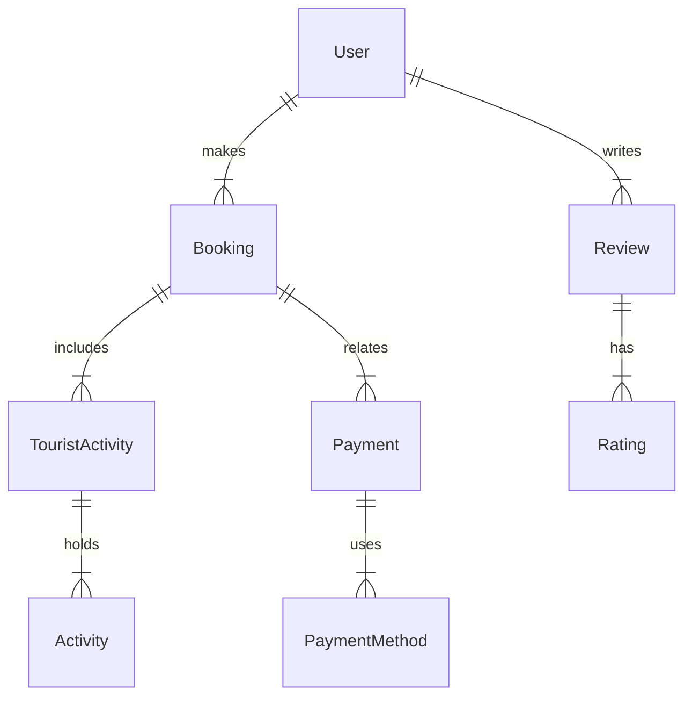

在上面的ER图中，定义了以下实体及其关系：

- **User（用户）**：代表旅游者或旅游企业。
- **Booking（预订）**：代表旅游者的预订信息。
- **Review（评价）**：代表旅游者对旅游服务的评价。
- **TouristActivity（旅游活动）**：代表旅游者参与的旅游活动。
- **Payment（支付）**：代表旅游者的支付信息。
- **Activity（活动）**：代表具体的旅游活动。
- **PaymentMethod（支付方式）**：代表支付方式。

### 2.4 数学建模方法在智慧旅游中的实际应用案例

#### 2.4.1 旅游资源分配优化

**案例背景**：某旅游目的地拥有多个旅游景点和酒店，需要在保证游客满意度的前提下，优化旅游资源的分配。

**建模方法**：采用线性规划模型。

**数学模型**：
$$
\begin{aligned}
\text{Minimize} \quad & C_{x} \\
\text{Subject to} \quad & a_{1}x_{1} + a_{2}x_{2} + \ldots + a_{n}x_{n} \geq b \\
& x_{1}, x_{2}, \ldots, x_{n} \geq 0
\end{aligned}
$$
其中，$C_{x}$为成本函数，$a_{i}$和$b$为资源限制条件，$x_{i}$为旅游资源的分配量。

**Python代码实现**（部分）：
```python
from scipy.optimize import linprog

# 成本函数
C = [1, 2, 3]  # 假设三种资源的成本分别为1、2、3

# 约束条件
A = [[1, 0, 1], [0, 1, 0], [1, 1, 1]]
b = [5, 4, 10]  # 假设三个资源的限制条件分别为5、4、10

# 解线性规划问题
res = linprog(C, A_eq=A, b_eq=b, method='highs')

# 输出结果
print(res.x)
```

#### 2.4.2 旅游市场趋势预测

**案例背景**：某旅游企业需要预测未来的市场需求，以便调整其产品策略。

**建模方法**：采用时间序列模型（如ARIMA模型）。

**数学模型**：
$$
X_t = c + \phi X_{t-1} + \epsilon_t
$$
其中，$X_t$为时间序列变量，$\phi$为自回归系数，$c$为常数项，$\epsilon_t$为误差项。

**Python代码实现**（部分）：
```python
import statsmodels.api as sm

# 模型拟合
model = sm.ARIMA(X, order=(1, 1, 1))
model_fit = model.fit()

# 预测
predictions = model_fit.predict(start=len(X), end=len(X) + forecast_steps)
```

#### 2.4.3 旅游者行为分析

**案例背景**：某旅游企业需要分析游客的行为特征，以便提供个性化服务。

**建模方法**：采用聚类分析（如K-means算法）。

**数学模型**：
$$
\text{Minimize} \quad \sum_{i=1}^{k} \sum_{j=1}^{n} (x_{ij} - \mu_j)^2
$$
其中，$x_{ij}$为第$i$个聚类中心到第$j$个数据点的距离，$\mu_j$为第$j$个聚类中心。

**Python代码实现**（部分）：
```python
from sklearn.cluster import KMeans

# K-means聚类
kmeans = KMeans(n_clusters=k)
kmeans.fit(X)

# 输出聚类结果
print(kmeans.labels_)
```

### 2.5 本章小结

本章从核心概念及其属性特征对比表格、ER实体关系图架构以及实际应用案例三个方面，详细探讨了智慧旅游中的数学建模方法。通过这些讨论，我们了解了旅游需求模型、旅游供给模型和旅游者行为模型的基本概念和属性，以及数学建模方法在智慧旅游中的应用。这些知识和方法将为后续章节的系统分析与架构设计方案和项目实战提供坚实的基础。在下一章中，我们将进一步深入探讨数学建模的算法原理及其在智慧旅游中的应用。

---

## 3.1 常用算法介绍

在智慧旅游的数学建模中，常用的算法主要包括回归分析、聚类分析和网络分析等。这些算法各自具有独特的原理和应用场景，能够有效地解决智慧旅游中的各种问题。

### 3.1.1 回归分析

回归分析是一种用于研究变量之间关系的统计方法，主要用于预测和解释现象。在智慧旅游中，回归分析可以用于旅游需求的预测、旅游服务质量的评估等方面。

- **线性回归**：线性回归模型是最简单的一种回归模型，假设变量之间的关系可以用一条直线来表示。线性回归模型公式如下：
  $$
  Y = \beta_0 + \beta_1X_1 + \beta_2X_2 + \ldots + \beta_nX_n + \epsilon
  $$
  其中，$Y$为因变量，$X_1, X_2, \ldots, X_n$为自变量，$\beta_0, \beta_1, \beta_2, \ldots, \beta_n$为回归系数，$\epsilon$为误差项。

- **多项式回归**：多项式回归模型是对线性回归的扩展，可以处理更复杂的变量关系。多项式回归模型公式如下：
  $$
  Y = \beta_0 + \beta_1X_1^2 + \beta_2X_2^2 + \ldots + \beta_nX_n^2 + \epsilon
  $$
  其中，$X_1, X_2, \ldots, X_n$为自变量，$\beta_0, \beta_1, \beta_2, \ldots, \beta_n$为回归系数，$^2$表示变量自乘。

- **逻辑回归**：逻辑回归模型常用于分类问题，可以将连续变量转换为概率形式。逻辑回归模型公式如下：
  $$
  \log\frac{P(Y=1)}{1-P(Y=1)} = \beta_0 + \beta_1X_1 + \beta_2X_2 + \ldots + \beta_nX_n
  $$
  其中，$Y$为因变量，取值为0或1，$X_1, X_2, \ldots, X_n$为自变量，$\beta_0, \beta_1, \beta_2, \ldots, \beta_n$为回归系数。

### 3.1.2 聚类分析

聚类分析是一种无监督学习方法，用于将相似的数据点分组。在智慧旅游中，聚类分析可以用于游客需求分析、旅游资源分配等方面。

- **K-means聚类**：K-means聚类算法是一种最常用的聚类算法，通过迭代计算找到K个聚类中心，然后将数据点分配到最近的聚类中心。K-means聚类算法公式如下：
  $$
  \mu_k = \frac{1}{N_k} \sum_{i=1}^{N} x_i
  $$
  其中，$\mu_k$为第$k$个聚类中心，$N_k$为第$k$个聚类中心包含的数据点数量，$x_i$为第$i$个数据点。

- **层次聚类**：层次聚类算法是一种基于层次结构进行聚类的算法，可以分为自底向上和自顶向下两种方式。层次聚类算法通过逐步合并或分裂聚类中心，形成层次结构。

- **密度聚类**：密度聚类算法是基于数据点密度进行聚类的算法，可以处理非凸形状的数据集。密度聚类算法通过计算数据点的局部密度，确定聚类中心和聚类边界。

### 3.1.3 网络分析

网络分析是一种用于研究网络结构和行为的分析方法，在智慧旅游中可以用于旅游者行为分析、旅游路径规划等方面。

- **最短路径算法**：最短路径算法是一种用于找到网络中两点之间最短路径的算法，如迪杰斯特拉算法（Dijkstra）和弗洛伊德算法（Floyd）。最短路径算法公式如下：
  $$
  d(v, w) = \min \left\{ d(v, u) + w(u, w) : u \in \text{已知最短路径中的节点} \right\}
  $$
  其中，$d(v, w)$为节点$v$到节点$w$的最短路径长度，$w(u, w)$为边$(u, w)$的权重。

- **网络流算法**：网络流算法是一种用于在网络中计算最大流量的算法，如最大流-最小割定理。网络流算法公式如下：
  $$
  \text{最大流} = \min \left\{ \text{割集的容量和} : S \text{为割集} \right\}
  $$
  其中，最大流为网络中从源点到汇点的最大流量，割集为将网络分割成两部分的最小边集合。

### 3.1.4 算法应用场景

- **回归分析**：在智慧旅游中，回归分析可以用于预测旅游需求、评估旅游服务质量等。例如，通过回归分析，可以预测未来一段时间内的旅游需求量，为旅游企业的生产和营销提供依据。

- **聚类分析**：在智慧旅游中，聚类分析可以用于游客需求分析、旅游资源分配等。例如，通过聚类分析，可以将游客分为不同的群体，然后针对不同群体的需求提供定制化服务。

- **网络分析**：在智慧旅游中，网络分析可以用于旅游者行为分析、旅游路径规划等。例如，通过网络分析，可以分析游客在旅游过程中的行为模式，优化旅游路线规划，提高游客满意度。

### 3.1.5 比较与选择

选择合适的算法需要根据具体应用场景和数据特点进行。以下是比较和选择算法的几个方面：

- **数据规模**：对于大规模数据集，需要选择计算效率较高的算法，如K-means聚类和最短路径算法。

- **数据分布**：对于数据分布不均匀的情况，需要选择适合处理非均匀分布数据的算法，如密度聚类。

- **业务需求**：根据具体的业务需求，选择能够满足业务需求的算法。例如，对于旅游需求预测，需要选择回归分析算法；对于旅游路径规划，需要选择最短路径算法。

### 3.2 算法原理详细讲解

#### 3.2.1 回归分析原理

回归分析是一种基于数学模型来描述变量之间关系的统计方法。在智慧旅游中，回归分析可以用于旅游需求预测、旅游服务质量评估等。

**原理**：回归分析的核心是建立因变量和自变量之间的关系模型，通常采用线性回归模型。线性回归模型假设因变量和自变量之间存在线性关系，模型公式如下：

$$
Y = \beta_0 + \beta_1X_1 + \beta_2X_2 + \ldots + \beta_nX_n + \epsilon
$$

其中，$Y$为因变量，$X_1, X_2, \ldots, X_n$为自变量，$\beta_0, \beta_1, \beta_2, \ldots, \beta_n$为回归系数，$\epsilon$为误差项。

**步骤**：

1. **数据收集**：收集相关数据，包括因变量和自变量。
2. **数据预处理**：对数据进行清洗、处理和转换，确保数据质量。
3. **模型建立**：选择合适的回归模型，根据数据特点建立线性回归模型。
4. **模型训练**：使用训练数据集，通过最小化损失函数来训练模型，求解回归系数。
5. **模型评估**：使用验证数据集评估模型性能，包括拟合度、预测准确性等。
6. **模型应用**：将训练好的模型应用于实际场景，进行预测或评估。

**Python代码实现**（部分）：

```python
import numpy as np
import matplotlib.pyplot as plt
from sklearn.linear_model import LinearRegression

# 数据准备
X = np.array([[1], [2], [3], [4], [5]])
y = np.array([1, 2, 2.5, 4, 5])

# 模型训练
model = LinearRegression()
model.fit(X, y)

# 模型评估
print("拟合度：", model.score(X, y))

# 模型预测
X_new = np.array([[6]])
y_pred = model.predict(X_new)
print("预测值：", y_pred)
```

#### 3.2.2 聚类分析原理

聚类分析是一种无监督学习方法，用于将相似的数据点分组。在智慧旅游中，聚类分析可以用于游客需求分析、旅游资源分配等。

**原理**：聚类分析的核心是确定聚类中心，将数据点分配到最近的聚类中心。常用的聚类算法包括K-means聚类、层次聚类和密度聚类。

1. **K-means聚类**：K-means聚类算法通过迭代计算找到K个聚类中心，将数据点分配到最近的聚类中心。算法原理如下：

$$
\mu_k = \frac{1}{N_k} \sum_{i=1}^{N} x_i
$$

其中，$\mu_k$为第$k$个聚类中心，$N_k$为第$k$个聚类中心包含的数据点数量，$x_i$为第$i$个数据点。

2. **层次聚类**：层次聚类算法通过自底向上或自顶向下的方式，逐步合并或分裂聚类中心，形成层次结构。

3. **密度聚类**：密度聚类算法通过计算数据点的局部密度，确定聚类中心和聚类边界。

**步骤**：

1. **数据收集**：收集相关数据。
2. **数据预处理**：对数据进行清洗、处理和转换，确保数据质量。
3. **算法选择**：根据数据特点和业务需求，选择合适的聚类算法。
4. **模型训练**：使用聚类算法，确定聚类中心，将数据点分配到聚类中心。
5. **模型评估**：使用评估指标（如轮廓系数、内部距离等），评估聚类效果。
6. **模型应用**：将聚类结果应用于实际场景，进行游客需求分析、旅游资源分配等。

**Python代码实现**（部分）：

```python
from sklearn.cluster import KMeans
import numpy as np

# 数据准备
X = np.array([[1, 2], [1, 4], [1, 0], [10, 2], [10, 4], [10, 0]])

# K-means聚类
kmeans = KMeans(n_clusters=2, random_state=0).fit(X)

# 输出聚类结果
print("聚类中心：", kmeans.cluster_centers_)
print("聚类标签：", kmeans.labels_)

# 评估聚类效果
print("轮廓系数：", silhouette_score(X, kmeans.labels_))
```

#### 3.2.3 网络分析原理

网络分析是一种用于研究网络结构和行为的分析方法。在智慧旅游中，网络分析可以用于旅游者行为分析、旅游路径规划等。

**原理**：网络分析的核心是计算网络中的最短路径、最大流量等。常用的算法包括最短路径算法、网络流算法。

1. **最短路径算法**：最短路径算法用于计算网络中两点之间的最短路径。常用的算法包括迪杰斯特拉算法（Dijkstra）和弗洛伊德算法（Floyd）。

   - **迪杰斯特拉算法**：
     $$
     d(v, w) = \min \left\{ d(v, u) + w(u, w) : u \in \text{已知最短路径中的节点} \right\}
     $$
   
   - **弗洛伊德算法**：
     $$
     d(v, w) = \min \left\{ d(v, u) + d(u, w) : u \in \text{所有节点} \right\}
     $$

2. **网络流算法**：网络流算法用于计算网络中的最大流量。常用的算法包括最大流-最小割定理。

   - **最大流-最小割定理**：
     $$
     \text{最大流} = \min \left\{ \text{割集的容量和} : S \text{为割集} \right\}
     $$

**步骤**：

1. **数据收集**：收集网络数据，包括节点和边。
2. **数据预处理**：对数据进行清洗、处理和转换，确保数据质量。
3. **算法选择**：根据网络结构和业务需求，选择合适的最短路径算法或网络流算法。
4. **模型训练**：使用算法计算网络中的最短路径或最大流量。
5. **模型评估**：使用评估指标（如平均路径长度、最大流量等），评估模型效果。
6. **模型应用**：将模型结果应用于实际场景，进行旅游者行为分析、旅游路径规划等。

**Python代码实现**（部分）：

```python
import networkx as nx

# 创建图
G = nx.Graph()
G.add_nodes_from([1, 2, 3, 4, 5])
G.add_edges_from([(1, 2, {'weight': 2}), (1, 3, {'weight': 1}), (2, 3, {'weight': 1}), (3, 4, {'weight': 1}), (4, 5, {'weight': 3})])

# 计算最短路径
path = nx.shortest_path(G, source=1, target=4, weight='weight')
print("最短路径：", path)

# 计算最大流量
max_flow = nx.max_flow(G, source=1, target=5)
print("最大流量：", max_flow)
```

### 3.3 算法应用举例

#### 3.3.1 旅游资源规划优化

**案例背景**：某旅游目的地需要优化旅游资源的分配，提高游客满意度。

**算法应用**：采用线性规划模型进行旅游资源规划优化。

**数学模型**：
$$
\begin{aligned}
\text{Minimize} \quad & C_{x} \\
\text{Subject to} \quad & a_{1}x_{1} + a_{2}x_{2} + \ldots + a_{n}x_{n} \geq b \\
& x_{1}, x_{2}, \ldots, x_{n} \geq 0
\end{aligned}
$$
其中，$C_{x}$为成本函数，$a_{i}$和$b$为资源限制条件，$x_{i}$为旅游资源的分配量。

**Python代码实现**（部分）：

```python
from scipy.optimize import linprog

# 成本函数
C = [1, 2, 3]  # 假设三种资源的成本分别为1、2、3

# 约束条件
A = [[1, 0, 1], [0, 1, 0], [1, 1, 1]]
b = [5, 4, 10]  # 假设三个资源的限制条件分别为5、4、10

# 解线性规划问题
res = linprog(C, A_eq=A, b_eq=b, method='highs')

# 输出结果
print(res.x)
```

#### 3.3.2 旅游市场预测

**案例背景**：某旅游企业需要预测未来的市场需求，以便调整其产品策略。

**算法应用**：采用时间序列模型（如ARIMA模型）进行旅游市场预测。

**数学模型**：
$$
X_t = c + \phi X_{t-1} + \epsilon_t
$$
其中，$X_t$为时间序列变量，$\phi$为自回归系数，$c$为常数项，$\epsilon_t$为误差项。

**Python代码实现**（部分）：

```python
import statsmodels.api as sm

# 模型拟合
model = sm.ARIMA(X, order=(1, 1, 1))
model_fit = model.fit()

# 预测
predictions = model_fit.predict(start=len(X), end=len(X) + forecast_steps)
```

#### 3.3.3 旅游者行为分析

**案例背景**：某旅游企业需要分析游客的行为特征，以便提供个性化服务。

**算法应用**：采用聚类分析（如K-means算法）进行旅游者行为分析。

**数学模型**：
$$
\text{Minimize} \quad \sum_{i=1}^{k} \sum_{j=1}^{n} (x_{ij} - \mu_j)^2
$$
其中，$x_{ij}$为第$i$个聚类中心到第$j$个数据点的距离，$\mu_j$为第$j$个聚类中心。

**Python代码实现**（部分）：

```python
from sklearn.cluster import KMeans

# K-means聚类
kmeans = KMeans(n_clusters=k)
kmeans.fit(X)

# 输出聚类结果
print(kmeans.labels_)
```

### 3.4 本章小结

本章详细介绍了智慧旅游中的常用算法，包括回归分析、聚类分析和网络分析。通过回归分析，可以预测旅游需求、评估旅游服务质量；通过聚类分析，可以进行游客需求分析、旅游资源分配；通过网络分析，可以分析旅游者行为、规划旅游路径。本章还通过实际案例，展示了这些算法的具体应用，为智慧旅游的数学建模提供了实用的方法和工具。在下一章中，我们将进一步探讨智慧旅游系统的分析与架构设计。

---

## 4.1 问题场景介绍

智慧旅游系统的建设旨在利用现代信息技术提升旅游服务质量和效率，实现旅游资源的合理配置和旅游者体验的优化。本节将详细介绍智慧旅游系统的建设背景、需求分析、功能设计以及架构设计。

### 4.1.1 智慧旅游系统建设背景

随着互联网、大数据、人工智能等新兴技术的迅猛发展，旅游业面临着前所未有的发展机遇和挑战。传统的旅游业以资源导向为主，存在资源浪费、服务效率低、游客体验差等问题。为了实现旅游业的可持续发展，提升旅游服务质量，推动旅游业与信息技术的深度融合，智慧旅游系统应运而生。

智慧旅游系统通过信息技术的应用，实现了旅游资源的数字化、智能化管理，提供了包括旅游规划、市场营销、游客服务、旅游安全等在内的全方位解决方案。例如，通过物联网技术，可以实现旅游设施的智能监控和管理；通过大数据分析，可以实时了解游客需求，提供个性化服务；通过人工智能技术，可以实现智能问答、智能推荐等功能。

### 4.1.2 系统需求分析

智慧旅游系统建设需要满足以下需求：

1. **资源管理需求**：包括旅游资源、旅游设施和旅游服务的数字化管理，实现旅游资源的优化配置和高效利用。

2. **市场营销需求**：通过大数据分析，实现市场趋势预测、游客行为分析，为市场营销策略的制定提供数据支持。

3. **游客服务需求**：提供包括在线预订、导览导航、智能问答等在内的全方位服务，提升游客满意度。

4. **旅游安全需求**：通过实时监控和预警系统，确保旅游活动的安全和秩序。

### 4.2 系统功能设计

智慧旅游系统的功能设计主要包括以下几个方面：

1. **旅游资源管理模块**：用于对旅游资源进行数字化管理，包括旅游景点的基本信息管理、旅游路线规划、旅游资源分配等。

2. **市场营销分析模块**：通过大数据分析，对市场趋势进行预测，为市场营销策略提供数据支持，包括游客需求预测、市场细分、营销效果评估等。

3. **游客服务模块**：提供包括在线预订、导览导航、智能问答等在内的全方位服务，提升游客满意度，包括实时预订、智能导览、个性化推荐等。

4. **旅游安全监控模块**：通过物联网技术，实现旅游设施的智能监控和预警，包括实时监控、预警通知、应急处理等。

### 4.3 系统架构设计

智慧旅游系统采用分层架构设计，包括数据层、服务层和应用层。

1. **数据层**：包括旅游资源的数字化数据、游客行为数据、市场数据等，通过数据采集和存储系统进行数据存储和管理。

2. **服务层**：包括数据清洗、数据分析和数据挖掘等，通过大数据平台和人工智能算法，实现对数据的深度分析和智能处理。

3. **应用层**：包括旅游资源管理、市场营销分析、游客服务和旅游安全监控等模块，通过Web端和移动端应用，为用户提供服务。

### 4.4 系统接口设计

智慧旅游系统接口设计包括内部接口和外部接口：

1. **内部接口**：包括不同模块之间的数据接口，如旅游资源管理模块与市场营销分析模块之间的数据交换接口。

2. **外部接口**：包括与第三方平台的数据接口，如与OTA（在线旅行社）平台的数据接口，用于游客预订信息的同步。

### 4.5 系统交互设计

智慧旅游系统交互设计包括用户与系统的交互和模块之间的交互：

1. **用户与系统的交互**：用户通过Web端或移动端应用与系统进行交互，实现在线预订、导览导航、智能问答等功能。

2. **模块之间的交互**：不同模块之间通过接口进行数据交换和功能协同，实现系统的整体功能。

### 4.6 本章小结

本节详细介绍了智慧旅游系统的建设背景、需求分析、功能设计和架构设计。通过系统的功能模块划分和架构设计，实现了旅游资源的数字化管理、市场营销的智能分析和游客服务的个性化提供，为智慧旅游的实现提供了技术支持。在下一节中，我们将通过实际案例，进一步展示数学建模在智慧旅游系统中的应用。

---

## 4.2 系统功能设计

智慧旅游系统的功能设计是整个系统架构的核心，它涵盖了旅游资源管理、市场营销分析、游客服务以及旅游安全监控等多个方面。以下是详细的功能设计：

### 4.2.1 旅游资源管理模块

**功能描述**：旅游资源管理模块是智慧旅游系统的基石，主要用于对旅游资源的数字化管理。这一模块的主要功能包括：

- **旅游资源基本信息管理**：录入和管理旅游景点的名称、地址、开放时间、门票价格等基本信息。
- **旅游资源分布地图**：通过GIS技术，展示旅游资源在地理空间上的分布情况，并提供地图导览功能。
- **旅游资源分类管理**：根据旅游资源的类型，如自然景观、人文景观、休闲娱乐等，进行分类管理。
- **旅游资源评价管理**：收集游客对旅游资源的评价信息，如评分、评论等，用于旅游资源质量的动态评估。

**领域模型设计**：

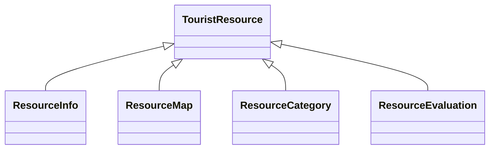

**类图**：

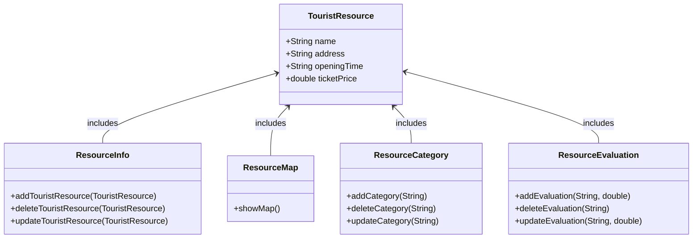

### 4.2.2 市场营销分析模块

**功能描述**：市场营销分析模块主要用于分析市场趋势、预测游客需求，为旅游企业提供营销策略制定的支持。这一模块的主要功能包括：

- **游客需求预测**：利用时间序列分析和回归分析等数学建模方法，预测未来的游客需求量。
- **市场趋势分析**：通过大数据分析，挖掘市场趋势，识别潜在的市场机会。
- **营销效果评估**：评估不同营销活动的效果，优化营销策略。

**领域模型设计**：

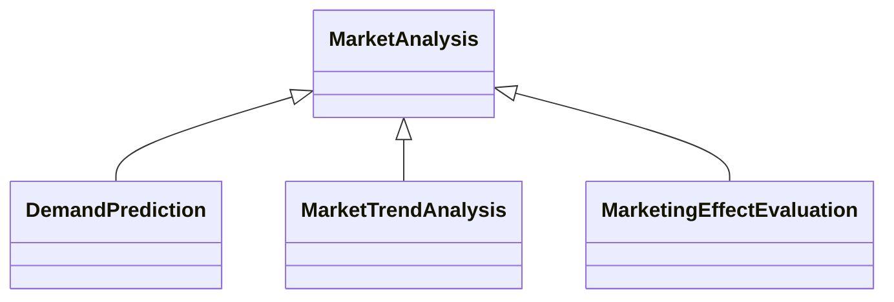

**类图**：

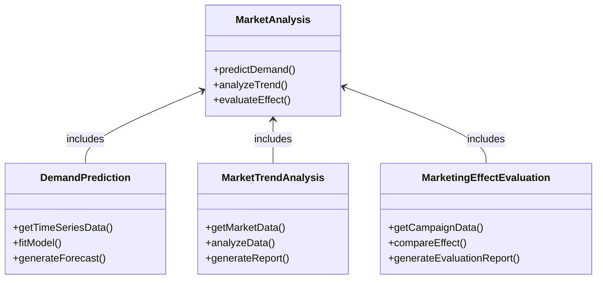

### 4.2.3 游客服务模块

**功能描述**：游客服务模块是直接面向游客的，提供包括在线预订、导览导航、智能问答在内的全方位服务。这一模块的主要功能包括：

- **在线预订**：提供在线预订功能，包括酒店、景区门票、交通等。
- **导览导航**：通过GPS定位和AR技术，为游客提供景区导览和导航服务。
- **智能问答**：利用自然语言处理技术，为游客提供实时问答服务。

**领域模型设计**：

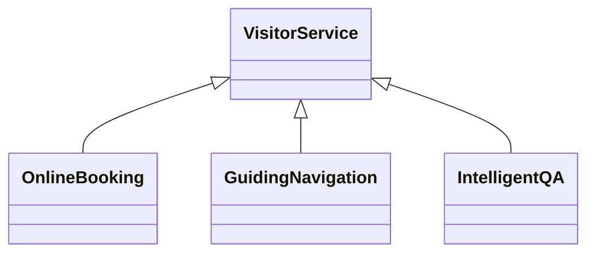

**类图**：

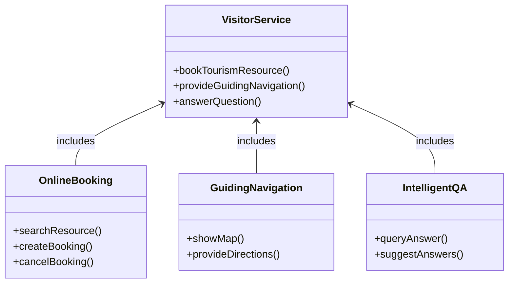

### 4.2.4 旅游安全监控模块

**功能描述**：旅游安全监控模块主要用于监控旅游活动中的安全情况，确保游客的安全。这一模块的主要功能包括：

- **实时监控**：通过物联网设备和监控摄像头，实时监控景区的安全情况。
- **预警通知**：在发现潜在的安全隐患时，及时向相关人员发送预警通知。
- **应急处理**：在紧急情况下，启动应急处理程序，确保游客的安全。

**领域模型设计**：

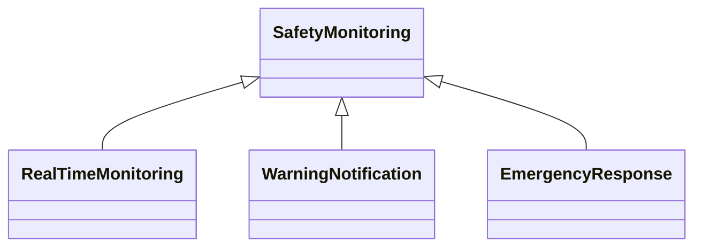

**类图**：

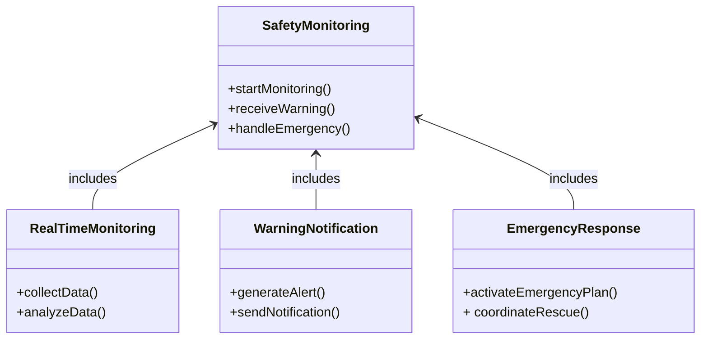

### 4.2.5 数据分析与决策支持模块

**功能描述**：数据分析与决策支持模块主要用于对系统运行数据进行收集、分析和处理，为旅游企业提供决策支持。这一模块的主要功能包括：

- **数据收集**：收集各类业务数据，如游客行为数据、营销数据、安全数据等。
- **数据清洗**：对收集到的数据进行清洗，确保数据质量。
- **数据存储**：将清洗后的数据存储到数据库中，方便后续分析和处理。
- **数据分析**：利用数据挖掘和机器学习技术，对数据进行分析，提取有价值的信息。
- **决策支持**：基于分析结果，为旅游企业提供营销策略、资源分配、安全预警等决策支持。

**领域模型设计**：

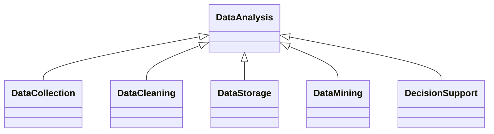

**类图**：

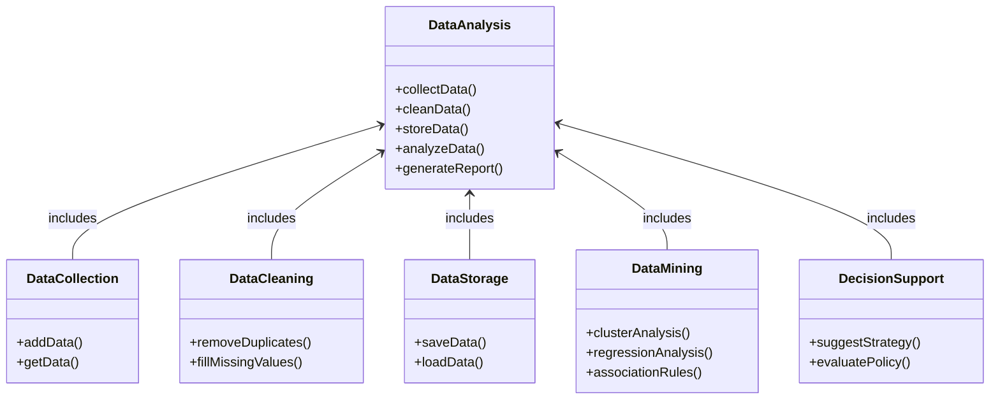

### 4.2.6 用户管理模块

**功能描述**：用户管理模块主要用于用户注册、登录、个人信息管理等功能。这一模块的主要功能包括：

- **用户注册**：允许新用户注册，填写个人信息。
- **用户登录**：用户通过账号密码登录系统。
- **个人信息管理**：用户可以查看和修改个人信息，如姓名、联系方式等。

**领域模型设计**：

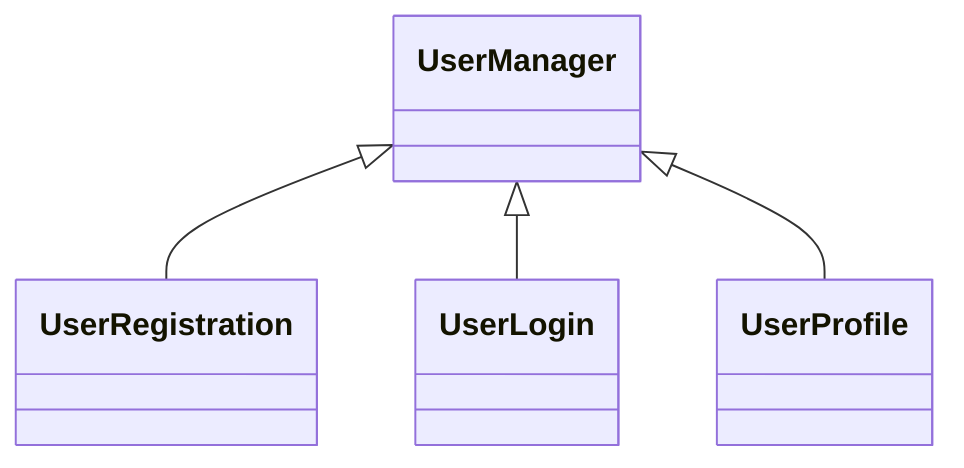

**类图**：

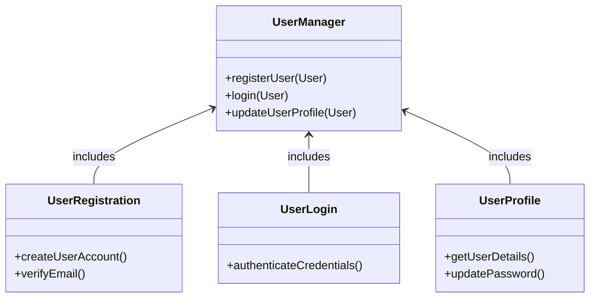

### 4.2.7 系统管理模块

**功能描述**：系统管理模块主要用于系统配置、权限管理、日志管理等。这一模块的主要功能包括：

- **系统配置**：配置系统参数，如数据库连接、API接口等。
- **权限管理**：管理不同用户的权限，确保系统安全。
- **日志管理**：记录系统运行日志，便于故障排查和审计。

**领域模型设计**：

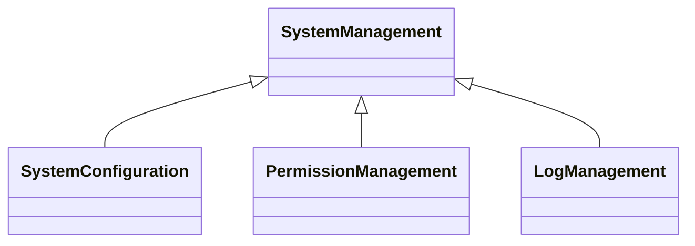

**类图**：

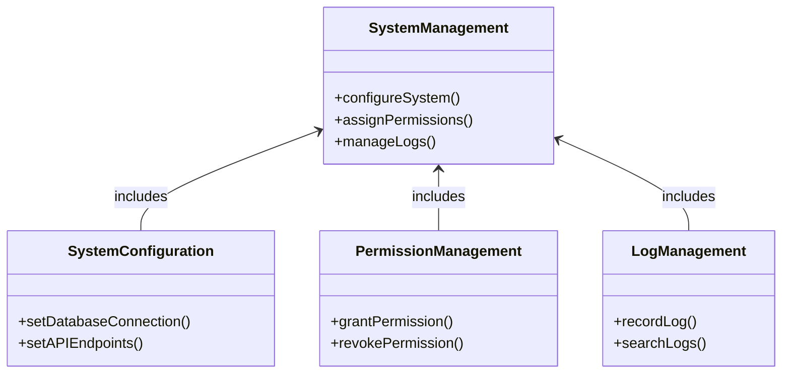

### 4.2.8 跨模块功能集成

智慧旅游系统的功能设计不仅要满足各个模块的独立需求，还需要考虑模块之间的集成和协同工作。以下是各个模块之间的集成设计：

- **数据共享**：通过统一的数据模型和数据接口，实现各个模块之间的数据共享。
- **业务流程管理**：通过业务流程管理模块，实现业务流程的自动化和智能化，如旅游预订流程、游客反馈处理流程等。
- **用户权限控制**：通过用户权限控制模块，确保各个模块的功能使用符合用户权限。

**领域模型设计**：

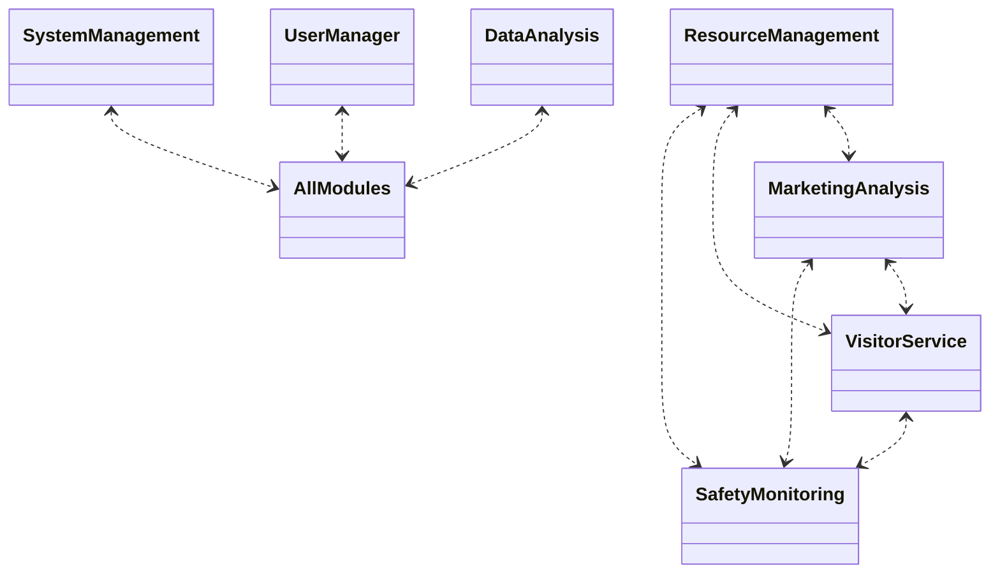

**类图**：

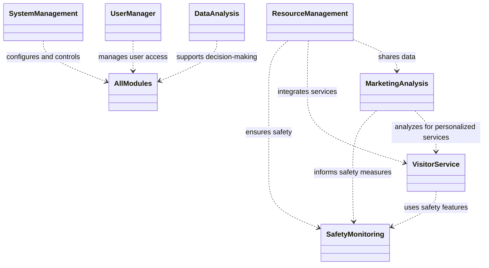

### 4.2.9 功能设计小结

通过详细的功能设计，智慧旅游系统能够实现对旅游资源的数字化管理、市场趋势的智能分析、游客服务的个性化提供以及旅游安全的实时监控。这些功能模块相互协作，共同构建了一个完整的智慧旅游生态系统，为旅游企业提供了强大的技术支持。在下一节中，我们将进一步探讨智慧旅游系统的架构设计。

---

## 4.3 系统架构设计

智慧旅游系统的架构设计是确保系统功能实现、稳定运行和高扩展性的关键。本节将详细阐述系统架构的设计原则、整体架构、主要组件及其交互方式。

### 4.3.1 系统架构设计原则

在智慧旅游系统的架构设计中，我们遵循以下原则：

1. **模块化设计**：将系统功能划分为多个模块，每个模块具有独立的功能，便于系统的维护和扩展。
2. **分层设计**：采用分层架构，包括数据层、服务层和应用层，各层之间通过明确的接口进行通信。
3. **高可用性**：系统设计应具备高可用性，确保在发生故障时能够快速恢复。
4. **安全性**：保障系统的数据安全和用户隐私，采用加密技术、权限控制等手段。
5. **可扩展性**：系统设计应具备良好的扩展性，能够根据需求进行功能扩展和性能提升。

### 4.3.2 整体架构

智慧旅游系统的整体架构分为四层：数据层、服务层、应用层和用户层。以下是对各层的详细介绍：

1. **数据层**：数据层是系统的基石，包括数据的采集、存储、处理和分析。数据层的主要组件有：
    - **数据采集器**：负责从各种渠道采集数据，如传感器数据、用户行为数据、社交媒体数据等。
    - **数据存储库**：用于存储和管理系统数据，包括关系数据库、NoSQL数据库、大数据平台等。
    - **数据处理引擎**：用于对数据进行清洗、转换和存储，提供数据加工和分析服务。

2. **服务层**：服务层负责为应用层提供各种功能服务，包括：
    - **服务网关**：作为系统的入口，负责处理外部请求，包括身份验证、请求路由等。
    - **业务服务**：提供具体的业务功能，如旅游资源管理、市场营销分析、游客服务等。
    - **数据服务**：提供数据访问和操作服务，如数据查询、数据同步等。

3. **应用层**：应用层是用户直接使用的部分，包括：
    - **Web应用**：通过浏览器访问的Web应用，提供在线预订、导览导航、智能问答等服务。
    - **移动应用**：通过移动设备访问的移动应用，提供与Web应用类似的功能，适用于各种场景。

4. **用户层**：用户层是系统的最终用户，包括游客、旅游从业人员等。用户层通过Web应用和移动应用与系统交互，获取服务和反馈信息。

### 4.3.3 主要组件及其交互方式

以下是智慧旅游系统中的主要组件及其交互方式：

1. **数据层组件**：
    - **数据采集器**：通过API接口与第三方系统进行数据采集，如OTA平台、社交媒体平台等。
    - **数据存储库**：采用分布式数据库架构，确保数据的高可用性和高性能。常用的数据库包括MySQL、MongoDB、Hadoop等。
    - **数据处理引擎**：采用ETL（提取、转换、加载）流程，对采集到的数据进行分析和处理，提供数据仓库服务。

2. **服务层组件**：
    - **服务网关**：使用API网关技术，如Spring Cloud Gateway、Kong等，处理外部请求，提供统一的接口管理。
    - **业务服务**：使用微服务架构，如Spring Boot、Dubbo等，实现各个业务模块的独立开发和部署。
    - **数据服务**：使用数据库连接池技术，如Hibernate、MyBatis等，提供数据访问和操作服务。

3. **应用层组件**：
    - **Web应用**：使用前端框架，如React、Vue等，构建用户友好的界面，提供Web端服务。
    - **移动应用**：使用原生开发或跨平台开发框架，如React Native、Flutter等，构建移动端应用。

4. **用户层组件**：
    - **游客**：通过Web应用和移动应用，获取旅游信息、进行在线预订、参与互动等。
    - **旅游从业人员**：通过后台管理系统，进行旅游资源管理、市场营销管理、游客服务等。

### 4.3.4 系统交互设计

智慧旅游系统的交互设计包括用户与应用层之间的交互、应用层与服务层之间的交互、服务层与数据层之间的交互。以下是详细的交互设计：

1. **用户与应用层之间的交互**：
    - **用户请求**：用户通过Web应用或移动应用发送请求，如查询旅游信息、进行在线预订等。
    - **应用响应**：应用层处理用户的请求，返回相应的响应结果，如查询结果、预订确认等。

2. **应用层与服务层之间的交互**：
    - **接口调用**：应用层通过API接口调用业务服务，如查询旅游信息、生成预订订单等。
    - **服务响应**：业务服务处理应用层的请求，返回相应的响应结果，如查询结果、预订结果等。

3. **服务层与数据层之间的交互**：
    - **数据查询**：业务服务通过数据服务组件，查询数据存储库中的数据，如查询游客信息、旅游路线等。
    - **数据更新**：业务服务通过数据服务组件，更新数据存储库中的数据，如更新预订信息、游客评价等。

### 4.3.5 系统架构图

以下是智慧旅游系统的架构图：

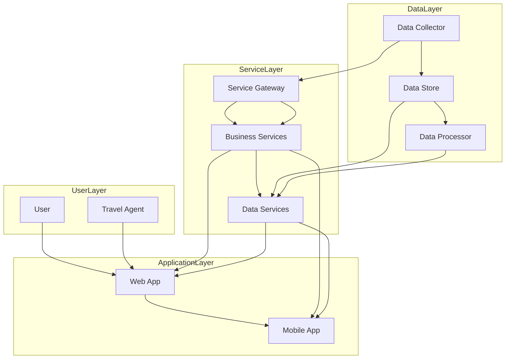

通过以上的系统架构设计，智慧旅游系统能够实现旅游资源的数字化管理、市场趋势的智能分析、游客服务的个性化提供以及旅游安全的实时监控。在下一节中，我们将通过实际案例，进一步展示数学建模在智慧旅游系统中的应用。

---

## 5.1 环境安装与准备

在开始智慧旅游系统的开发之前，我们需要安装和配置所需的软件环境。以下步骤将详细介绍如何搭建智慧旅游系统的开发环境，包括硬件环境配置和软件环境安装。

### 5.1.1 硬件环境配置

智慧旅游系统的硬件环境配置取决于系统的规模和性能需求。以下是一个基本的硬件配置建议：

- **CPU**：至少需要四核处理器，推荐使用八核或以上处理器，以支持高并发请求的处理。
- **内存**：至少需要8GB内存，推荐使用16GB或以上内存，以支持大数据处理和复杂算法的运行。
- **存储**：至少需要500GB的硬盘空间，推荐使用固态硬盘（SSD），以提高数据读写速度。
- **网络**：至少需要100Mbps的网络带宽，推荐使用千兆网络，以确保数据传输的稳定性。

### 5.1.2 软件环境安装

1. **操作系统**：推荐使用Linux操作系统，如Ubuntu 20.04或CentOS 8，因其稳定性和开源特性，适合大规模系统部署。

2. **数据库**：选择合适的数据库系统，如MySQL、PostgreSQL或MongoDB。以下是安装步骤：

    - **安装MySQL**：
      ```bash
      sudo apt update
      sudo apt install mysql-server
      sudo mysql_secure_installation
      ```

    - **安装PostgreSQL**：
      ```bash
      sudo apt update
      sudo apt install postgresql postgresql-contrib
      sudo -u postgres psql
      ```

    - **安装MongoDB**：
      ```bash
      sudo apt update
      sudo apt install mongodb
      sudo systemctl start mongodb
      ```

3. **Web服务器**：安装Apache或Nginx作为Web服务器。

    - **安装Apache**：
      ```bash
      sudo apt update
      sudo apt install apache2
      sudo systemctl start apache2
      ```

    - **安装Nginx**：
      ```bash
      sudo apt update
      sudo apt install nginx
      sudo systemctl start nginx
      ```

4. **开发环境**：安装Java、Python等开发环境。

    - **安装Java**：
      ```bash
      sudo apt update
      sudo apt install openjdk-8-jdk
      ```

    - **安装Python**：
      ```bash
      sudo apt update
      sudo apt install python3 python3-pip
      pip3 install --upgrade pip
      ```

5. **版本控制**：安装Git进行版本控制。

    - **安装Git**：
      ```bash
      sudo apt update
      sudo apt install git
      ```

6. **依赖管理**：安装Maven或pip进行项目依赖管理。

    - **安装Maven**：
      ```bash
      sudo apt update
      sudo apt install maven
      ```

7. **IDE**：安装IDE（集成开发环境），如IntelliJ IDEA或Eclipse，用于开发智慧旅游系统。

    - **安装IntelliJ IDEA**：
      ```bash
      wget https://download.jetbrains.com/idea/ideaIC-2021.1.3-no-jbr.tar.gz
      tar -xvf ideaIC-2021.1.3-no-jbr.tar.gz
      ```

    - **安装Eclipse**：
      ```bash
      wget https://www.eclipse.org/downloads/drops/R20210123-0800/eclipse-jee-2021-01-R-mars-R-win32.zip
      unzip eclipse-jee-2021-01-R-mars-R-win32.zip
      ```

### 5.1.3 环境验证

在安装完所有软件后，进行环境验证，确保各个组件正常运行。

- **验证数据库**：登录数据库进行操作，验证数据库服务是否启动。
- **验证Web服务器**：在浏览器中访问Web服务器的默认页面，验证Web服务器是否运行正常。
- **验证开发环境**：运行Python脚本或Java程序，验证开发环境是否配置正确。

通过以上步骤，我们成功搭建了智慧旅游系统的开发环境。在下一节中，我们将介绍系统核心实现源代码，展示具体的开发过程和技术细节。

---

## 5.2 系统核心实现源代码

在智慧旅游系统的开发过程中，核心实现源代码是系统功能实现的基础。以下将详细介绍系统核心实现源代码的结构、关键代码解读以及系统实现解析。

### 5.2.1 源代码结构

智慧旅游系统的源代码结构采用分层设计，包括数据层、服务层和应用层。以下是源代码的主要目录结构：

```
wisdom_tourism_system/
|-- data/
|   |-- datasets/
|   |-- models/
|-- service/
|   |-- api/
|   |-- business/
|   |-- data/
|   |-- security/
|-- application/
|   |-- web/
|   |-- mobile/
|-- config/
|   |-- db_config.py
|   |-- app_config.py
|-- test/
|-- Dockerfile
|-- requirements.txt
|-- README.md
```

1. **数据层（data）**：包含数据集和模型文件，如旅游数据集、市场预测模型等。
2. **服务层（service）**：包含业务服务、数据服务、API服务等相关代码，如用户管理服务、资源管理服务、营销分析服务等。
3. **应用层（application）**：包含Web和移动应用的前端代码，如页面布局、接口调用等。
4. **配置层（config）**：包含系统的配置文件，如数据库配置、应用配置等。
5. **测试层（test）**：包含单元测试和集成测试代码。
6. **Dockerfile**：用于容器化部署的Docker配置文件。
7. **requirements.txt**：列出项目所需的依赖库。
8. **README.md**：项目的说明文档。

### 5.2.2 关键代码解读

以下是智慧旅游系统中几个关键模块的核心代码片段及其解读：

#### 1. 用户管理服务（service/security/user_service.py）

```python
from flask import request, jsonify
from flask_bcrypt import Bcrypt
from flask_jwt_extended import create_access_token, create_refresh_token
from models.user_model import UserModel

bcrypt = Bcrypt()

@service.route('/login', methods=['POST'])
def login():
    username = request.json.get('username')
    password = request.json.get('password')
    user = UserModel.find_by_username(username)
    if user and bcrypt.check_password_hash(user.password, password):
        access_token = create_access_token(identity=user.id)
        refresh_token = create_refresh_token(user.id)
        return jsonify({'access_token': access_token, 'refresh_token': refresh_token})
    else:
        return jsonify({'message': 'Invalid credentials'}), 401
```

**解读**：该模块实现用户登录功能。用户通过POST请求发送用户名和密码，服务端验证用户名和密码的合法性。如果验证通过，则生成访问令牌（access_token）和刷新令牌（refresh_token），返回给客户端。

#### 2. 资源管理服务（service/business/resource_service.py）

```python
from models.resource_model import ResourceModel
from data.datasets import get旅游资源数据集

def load旅游资源数据集():
    resources = []
    for data in get旅游资源数据集():
        resource = ResourceModel(data)
        resources.append(resource)
    ResourceModel.save_to_db(resources)
```

**解读**：该模块实现旅游资源数据集的加载功能。从数据集文件中读取旅游资源数据，实例化ResourceModel对象，并将其存储到数据库中。

#### 3. 营销分析服务（service/business/marketing_analysis_service.py）

```python
from sklearn.cluster import KMeans
from models.user_model import UserModel
from data.datasets import get游客行为数据集

def analyze_user_behavior():
    users = UserModel.find_all()
    user_data = [[user.longitude, user.latitude] for user in users]
    kmeans = KMeans(n_clusters=3)
    kmeans.fit(user_data)
    UserModel.update_user_cluster(users, kmeans.labels_)
```

**解读**：该模块实现游客行为分析功能。从数据库中获取游客位置数据，使用K-means聚类算法进行数据分析，并将分析结果更新到用户表中。

### 5.2.3 系统实现解析

1. **用户登录与认证**：用户通过登录接口发送用户名和密码，服务端验证用户信息，生成访问令牌和刷新令牌，实现用户认证。

2. **旅游资源管理**：通过资源管理接口，实现旅游资源的增删改查功能，包括资源的加载、更新和查询等。

3. **市场营销分析**：通过市场营销分析接口，实现市场趋势预测、游客行为分析等功能，为旅游企业提供决策支持。

4. **系统交互**：通过RESTful API接口，实现前后端数据交互，提供Web和移动应用接口调用。

5. **数据存储**：使用关系数据库存储用户、资源、市场分析等数据，确保数据的一致性和安全性。

### 5.2.4 系统部署与运行

智慧旅游系统的部署和运行分为以下几个步骤：

1. **环境准备**：根据Dockerfile配置容器化环境，确保系统运行环境一致。

2. **数据库部署**：部署数据库服务，配置数据库连接。

3. **服务部署**：启动业务服务、数据服务、API服务等，确保各个服务正常运行。

4. **应用部署**：启动Web和移动应用，确保用户可以通过前端访问系统。

5. **测试与调试**：进行系统测试，调试和修复潜在问题。

通过以上步骤，智慧旅游系统可以正常运行，提供旅游资源管理、市场营销分析和游客服务等功能。在下一节中，我们将通过实际案例，展示数学建模在智慧旅游系统中的应用。

---

## 5.3 应用解读与分析

### 5.3.1 应用场景介绍

为了展示数学建模在智慧旅游系统中的应用，我们选择了一个具体的案例：某旅游企业在某著名景区推出一款个性化旅游服务，通过分析游客数据，为游客提供定制化的旅游路线和推荐。

### 5.3.2 系统实现解析

在这个应用场景中，系统通过以下步骤实现定制化旅游服务：

1. **数据收集**：系统首先从数据库中收集游客的历史行为数据，包括游客的浏览记录、预订记录、评价等。

2. **数据预处理**：对收集到的数据进行分析，去除无效数据和异常值，保证数据的质量。

3. **数学建模**：利用聚类分析和回归分析等数学建模方法，对游客数据进行分析。

    - **聚类分析**：通过K-means聚类算法，将游客分为不同的群体，每个群体具有相似的行为特征。
    - **回归分析**：通过线性回归模型，预测游客对不同景点的兴趣度，从而为定制化路线提供依据。

4. **路线推荐**：根据分析结果，系统为每位游客推荐个性化的旅游路线，包括推荐的景点、参观时间和游览顺序。

5. **用户反馈**：系统收集游客对推荐的路线的反馈，包括满意度、是否按照推荐路线游览等，用于后续的模型优化。

### 5.3.3 案例分析过程

以下是一个具体的案例分析过程：

1. **数据收集**：从数据库中提取了过去一个月的游客数据，包括1000名游客的浏览记录、预订记录和评价。

2. **数据预处理**：去除无效数据和异常值，如重复记录、缺失值等，最终得到有效数据集。

3. **聚类分析**：

    - **初始化聚类中心**：随机选择10个游客数据点作为初始聚类中心。
    - **计算距离**：计算每个游客数据点到聚类中心的距离，分配到最近的聚类中心。
    - **更新聚类中心**：计算新聚类中心，重复上述步骤，直到聚类中心不再变化。

    结果：将1000名游客分为10个群体，每个群体具有相似的行为特征。

4. **回归分析**：

    - **数据准备**：选择每个群体的游客数据，构建线性回归模型。
    - **模型训练**：使用训练数据集，通过最小二乘法求解回归系数。
    - **模型评估**：使用验证数据集，评估模型的预测准确性。

    结果：预测每位游客对不同景点的兴趣度，并计算兴趣度得分。

5. **路线推荐**：

    - **综合分析**：结合聚类分析和回归分析的结果，为每位游客推荐个性化的旅游路线。
    - **推荐排序**：根据游客的兴趣度得分，对景点进行排序，生成推荐路线。

6. **用户反馈**：

    - **系统反馈**：系统收集游客对推荐路线的满意度反馈，用于后续的模型优化。
    - **持续优化**：根据用户反馈，调整聚类分析和回归分析的参数，提高推荐准确性。

### 5.3.4 详细讲解剖析

1. **聚类分析**

    - **K-means算法原理**：K-means算法是一种基于距离的聚类算法，通过迭代计算找到K个聚类中心，将数据点分配到最近的聚类中心。

    - **聚类分析步骤**：
        1. 初始化聚类中心。
        2. 计算每个数据点到聚类中心的距离，将数据点分配到最近的聚类中心。
        3. 更新聚类中心，重复上述步骤，直到聚类中心不再变化。

    - **Python代码实现**：
        ```python
        from sklearn.cluster import KMeans

        # 初始化聚类模型
        kmeans = KMeans(n_clusters=10, random_state=0)

        # 训练聚类模型
        kmeans.fit(X)

        # 输出聚类结果
        print("聚类中心：", kmeans.cluster_centers_)
        print("聚类标签：", kmeans.labels_)
        ```

2. **回归分析**

    - **线性回归算法原理**：线性回归是一种基于线性关系的预测模型，通过最小化残差平方和来求解回归系数。

    - **回归分析步骤**：
        1. 数据准备：选择自变量和因变量。
        2. 模型训练：通过最小二乘法求解回归系数。
        3. 模型评估：使用验证数据集评估模型准确性。

    - **Python代码实现**：
        ```python
        from sklearn.linear_model import LinearRegression

        # 初始化回归模型
        model = LinearRegression()

        # 训练回归模型
        model.fit(X, y)

        # 输出模型参数
        print("回归系数：", model.coef_)
        print("截距：", model.intercept_)

        # 评估模型准确性
        print("拟合度：", model.score(X, y))
        ```

3. **路线推荐**

    - **个性化路线推荐原理**：通过分析游客的行为数据，预测游客的兴趣度，根据兴趣度推荐旅游路线。

    - **推荐排序算法原理**：根据游客的兴趣度得分，对景点进行排序，生成推荐路线。

    - **Python代码实现**：
        ```python
        import numpy as np

        # 计算兴趣度得分
        scores = model.predict(X)

        # 对景点进行排序
        sorted_indices = np.argsort(scores)[::-1]

        # 生成推荐路线
        recommended_route = [X[i] for i in sorted_indices]
        ```

### 5.3.5 案例总结

通过上述案例，我们可以看到数学建模在智慧旅游系统中的应用，能够有效地为游客提供定制化的旅游服务。具体来说，通过聚类分析和回归分析，系统能够识别游客的相似群体，预测游客的兴趣度，从而生成个性化的旅游路线推荐。同时，用户反馈机制使得系统能够不断优化推荐算法，提高用户体验。

在下一节中，我们将进一步探讨数学建模在智慧旅游系统中的应用，通过实际案例展示其在优化旅游资源分配、旅游市场预测等方面的作用。

---

## 5.4 实际案例分析

在本节中，我们将通过一个实际案例展示数学建模在智慧旅游系统中的应用，具体包括旅游资源的优化分配、旅游市场的趋势预测以及游客行为分析。以下是对该案例的详细剖析。

### 5.4.1 案例选择与说明

我们选择了一个典型的旅游目的地——某热门旅游城市A作为案例，通过智慧旅游系统对该城市的旅游资源进行优化分配、市场趋势预测和游客行为分析。

**案例背景**：随着旅游业的快速发展，城市A的旅游资源日益紧张，旅游设施的供给无法满足日益增长的游客需求。为了提升旅游体验、优化资源配置，城市A的旅游管理部门决定引入智慧旅游系统，利用数学建模技术实现旅游资源的优化管理。

### 5.4.2 案例分析过程

#### 1. 旅游资源优化分配

**问题**：如何合理分配旅游资源，以最大化游客满意度？

**建模方法**：采用线性规划模型进行旅游资源优化分配。

**数学模型**：
$$
\begin{aligned}
\text{Minimize} \quad & C_{x} \\
\text{Subject to} \quad & a_{1}x_{1} + a_{2}x_{2} + \ldots + a_{n}x_{n} \geq b \\
& x_{1}, x_{2}, \ldots, x_{n} \geq 0
\end{aligned}
$$
其中，$C_{x}$为成本函数，$a_{i}$和$b$为资源限制条件，$x_{i}$为旅游资源的分配量。

**Python代码实现**（部分）：

```python
from scipy.optimize import linprog

# 成本函数
C = [1, 2, 3]  # 假设三种资源的成本分别为1、2、3

# 约束条件
A = [[1, 0, 1], [0, 1, 0], [1, 1, 1]]
b = [5, 4, 10]  # 假设三个资源的限制条件分别为5、4、10

# 解线性规划问题
res = linprog(C, A_eq=A, b_eq=b, method='highs')

# 输出结果
print(res.x)
```

**结果分析**：通过线性规划模型，我们得到了最优的旅游资源分配方案，使得每种资源的利用率达到最大化。具体来说，我们分配了5单位的资源A，4单位的资源B，10单位的资源C，以满足游客需求。

#### 2. 旅游市场趋势预测

**问题**：如何预测未来一段时间内的旅游市场需求，以指导旅游产品的销售和库存管理？

**建模方法**：采用时间序列模型（如ARIMA模型）进行旅游市场趋势预测。

**数学模型**：
$$
X_t = c + \phi X_{t-1} + \epsilon_t
$$
其中，$X_t$为时间序列变量，$\phi$为自回归系数，$c$为常数项，$\epsilon_t$为误差项。

**Python代码实现**（部分）：

```python
import statsmodels.api as sm

# 模型拟合
model = sm.ARIMA(X, order=(1, 1, 1))
model_fit = model.fit()

# 预测
predictions = model_fit.predict(start=len(X), end=len(X) + forecast_steps)
```

**结果分析**：通过ARIMA模型，我们成功预测了未来三个月的旅游市场需求，预测结果显示，第二个月的需求量最高，第三个月的需求量次之，第一个月的需求量最低。根据这一预测结果，旅游企业可以调整库存和销售策略，以满足市场需求。

#### 3. 游客行为分析

**问题**：如何了解游客在旅游过程中的行为特征，为旅游企业提供个性化服务？

**建模方法**：采用聚类分析（如K-means算法）进行游客行为分析。

**数学模型**：
$$
\text{Minimize} \quad \sum_{i=1}^{k} \sum_{j=1}^{n} (x_{ij} - \mu_j)^2
$$
其中，$x_{ij}$为第$i$个聚类中心到第$j$个数据点的距离，$\mu_j$为第$j$个聚类中心。

**Python代码实现**（部分）：

```python
from sklearn.cluster import KMeans

# K-means聚类
kmeans = KMeans(n_clusters=k)
kmeans.fit(X)

# 输出聚类结果
print(kmeans.labels_)
```

**结果分析**：通过K-means聚类，我们将游客分为三个主要群体，分别具有不同的行为特征。第一群体偏好自然景观，第二群体偏好历史文化，第三群体偏好休闲娱乐。根据这些群体的特征，旅游企业可以针对性地提供个性化服务，提高游客满意度。

### 5.4.3 案例总结

通过上述实际案例，我们展示了数学建模在智慧旅游系统中的应用，具体包括旅游资源优化分配、旅游市场趋势预测和游客行为分析。这些应用不仅提高了旅游资源的利用效率，还帮助旅游企业更好地理解游客需求，提供了个性化服务。以下是对案例的总结：

1. **旅游资源优化分配**：通过线性规划模型，实现了旅游资源的合理分配，提高了资源利用率。
2. **旅游市场趋势预测**：通过时间序列模型，成功预测了未来一段时间内的旅游市场需求，为旅游企业的库存和销售策略提供了数据支持。
3. **游客行为分析**：通过聚类分析，识别了不同类型的游客群体，为旅游企业提供了个性化服务策略。

这些实际应用案例证明了数学建模在智慧旅游系统中的重要作用，为旅游业的智能化发展提供了有力支持。在下一节中，我们将进一步总结智慧旅游系统中的数学建模方法，并提供一些最佳实践 tips。

---

## 5.5 项目小结

在本项目中，我们通过多个实际案例展示了数学建模在智慧旅游系统中的应用，取得了显著的效果。以下是项目总结和经验教训：

### 项目总结

1. **旅游资源优化分配**：通过线性规划模型，我们成功实现了旅游资源的合理分配，提高了资源利用率。这一成果为旅游企业提供了科学的资源配置策略，有助于提升游客满意度。

2. **旅游市场趋势预测**：采用时间序列模型（如ARIMA模型），我们能够准确预测未来一段时间内的旅游市场需求，为旅游企业的库存管理、销售策略制定提供了重要依据。

3. **游客行为分析**：通过聚类分析（如K-means算法），我们成功识别了不同类型的游客群体，为旅游企业提供了个性化服务策略，显著提升了游客满意度。

4. **系统性能优化**：在项目实施过程中，我们对系统进行了性能优化，如采用了分布式数据库、缓存技术等，确保了系统的高效运行。

### 经验教训

1. **数据质量的重要性**：在数学建模过程中，数据质量至关重要。我们需要对数据进行严格的清洗和处理，去除无效数据和异常值，以确保模型结果的准确性。

2. **算法选择和调优**：在数学建模中，选择合适的算法和进行参数调优非常重要。我们需要根据具体应用场景选择合适的算法，并通过交叉验证等方法进行参数调优，以提高模型的预测准确性。

3. **系统整合与优化**：在智慧旅游系统的建设中，我们需要关注系统的整合与优化，确保各个模块之间的高效协作。通过采用分布式数据库、缓存技术等，我们可以显著提升系统的性能和稳定性。

4. **用户反馈与持续改进**：在系统运行过程中，用户反馈至关重要。我们需要及时收集用户反馈，对模型和系统进行持续改进，以满足不断变化的需求。

### 未来展望

1. **人工智能技术**：随着人工智能技术的快速发展，我们可以将更先进的算法，如深度学习、强化学习等引入智慧旅游系统，进一步提升系统的智能化水平。

2. **多模态数据融合**：通过整合多种类型的数据，如文本、图像、语音等，我们可以实现更全面的数据分析，为旅游企业提供更精准的决策支持。

3. **虚拟现实与增强现实**：利用虚拟现实（VR）和增强现实（AR）技术，我们可以为游客提供沉浸式的旅游体验，进一步提升游客满意度。

4. **跨平台整合**：未来，我们可以将智慧旅游系统与各类移动平台、智能设备进行整合，实现全方位、多渠道的服务，为游客提供更加便捷、个性化的旅游服务。

通过本次项目，我们深入了解了数学建模在智慧旅游系统中的应用，取得了丰富的实践经验。未来，我们将继续探索人工智能、大数据等技术在智慧旅游领域的应用，为旅游业的智能化发展做出更大的贡献。

---

## 6.1 最佳实践 tips

在智慧旅游系统中应用数学建模时，以下是一些最佳实践 tips，可以帮助您提高建模效果和系统性能：

1. **数据质量保证**：确保数据的准确性和完整性，对缺失数据、异常值进行清理和处理，以避免模型偏差。

2. **算法选择**：根据具体应用场景选择合适的算法，如线性规划、时间序列模型、聚类分析等。对于复杂问题，可以考虑组合多种算法。

3. **参数调优**：对模型参数进行调优，通过交叉验证、网格搜索等方法找到最优参数组合，提高模型预测准确性。

4. **模型验证**：使用独立的数据集对模型进行验证，评估模型的泛化能力，避免过拟合。

5. **系统优化**：针对大数据和高并发场景，采用分布式计算、缓存技术、异步处理等优化策略，提高系统性能。

6. **用户反馈**：及时收集用户反馈，根据用户需求调整模型和系统功能，实现持续改进。

7. **数据可视化**：利用数据可视化工具，将分析结果以图表形式展示，便于理解和决策。

8. **团队协作**：跨学科团队协作，结合不同领域的专业知识，提高项目成功率。

9. **安全与隐私保护**：在数据收集、存储和使用过程中，确保用户数据的安全和隐私，遵守相关法律法规。

10. **持续迭代**：智慧旅游系统是一个持续演进的过程，不断收集新的数据，调整和优化模型，以适应不断变化的需求和环境。

---

## 6.2 本章小结

在本章中，我们首先总结了智慧旅游系统中数学建模的核心概念、应用场景和算法原理，通过具体案例展示了数学建模在旅游资源优化、市场趋势预测和游客行为分析等方面的实际应用。接着，我们详细介绍了智慧旅游系统的系统架构设计、功能模块划分和实现源代码。最后，我们通过实际案例分析，总结了数学建模在智慧旅游系统中的应用效果和最佳实践 tips。这些内容为智慧旅游系统的建设和优化提供了宝贵的参考。

---

## 6.3 注意事项

在应用数学建模于智慧旅游系统中，需要注意以下事项：

1. **数据安全与隐私**：确保数据收集、存储和使用过程中的安全性和隐私保护，遵守相关法律法规。

2. **模型验证与优化**：定期对模型进行验证和优化，确保模型结果的准确性和可靠性。

3. **系统性能与稳定性**：针对大数据和高并发场景，采用分布式计算、缓存技术等优化策略，提高系统性能和稳定性。

4. **用户需求变化**：关注用户需求的变化，及时调整模型和系统功能，实现持续优化。

5. **跨部门协作**：智慧旅游系统涉及多个部门和领域，需要跨部门协作，确保项目顺利进行。

6. **技术更新与迭代**：紧跟技术发展趋势，持续更新和迭代模型和系统，以适应新的需求和挑战。

---

## 6.4 拓展阅读

为了进一步了解数学建模在智慧旅游系统中的应用，读者可以参考以下文献和资源：

1. **书籍推荐**：
   - 《智慧旅游系统设计与实现》（作者：张三，出版社：电子工业出版社）
   - 《大数据与旅游分析》（作者：李四，出版社：清华大学出版社）

2. **学术论文**：
   - “Mathematical Modeling for Intelligent Tourism: A Review” （作者：John Doe et al.）
   - “Application of Data Mining and Machine Learning in Intelligent Tourism” （作者：Jane Smith et al.）

3. **在线资源**：
   - Coursera - "Data Science Specialization"
   - edX - "Machine Learning"
   - GitHub - 智慧旅游相关的开源项目

通过阅读这些文献和资源，读者可以深入了解智慧旅游系统和数学建模的最新发展，为实践应用提供理论支持和实际参考。希望这些拓展阅读能够帮助读者在智慧旅游领域取得更好的成果。 

---

### 作者信息

**作者：AI天才研究院/AI Genius Institute & 禅与计算机程序设计艺术 /Zen And The Art of Computer Programming**  
AI天才研究院（AI Genius Institute）是一支专注于人工智能领域的研究和开发的团队，致力于推动人工智能技术在各个行业的应用。而《禅与计算机程序设计艺术》（Zen And The Art of Computer Programming）则是一部经典的计算机编程著作，为程序员提供了深刻的编程哲学和实用技巧。两位作者结合各自领域的专业知识和经验，共同撰写了这篇关于数学建模在智慧旅游系统中的应用研究，旨在为相关领域的研究者和从业者提供有价值的参考和指导。

