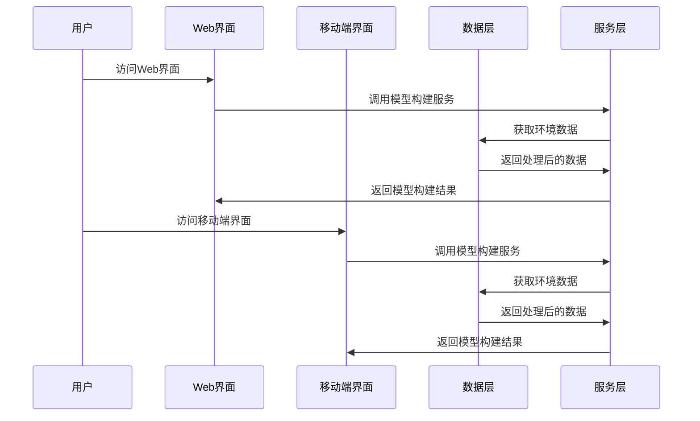

                 

# 数学建模在环境保护中的应用

## 关键词
- 数学建模
- 环境保护
- 污染物扩散
- 水质模型
- 生态系统模型

## 摘要
本文探讨了数学建模在环境保护中的应用，通过介绍数学建模的基本概念、核心模型以及其在环境保护中的实际应用，展示了数学建模在解决环境问题中的重要作用。文章首先分析了全球环境问题的背景，随后详细阐述了数学建模在环境保护中的问题解决方法、边界与外延、概念结构与核心要素组成。接下来，文章从概述、核心概念与联系、算法原理讲解、系统分析与架构设计、项目实战等多个角度，深入探讨了数学建模在环境保护中的具体应用。最后，文章给出了最佳实践 tips、小结、注意事项和拓展阅读，为读者提供全面的技术指导。

### 背景介绍

#### 问题背景、问题描述、问题解决、边界与外延、概念结构与核心要素组成

##### 问题背景
随着全球经济的快速发展和人口的不断增长，环境保护问题日益严峻。环境污染、资源枯竭和生态系统失衡等问题已经对人类的生活和经济发展带来了严重的威胁。例如，大气污染、水污染、土壤污染等已经成为影响人类健康和生态环境的突出问题。因此，寻找有效的环境保护方法，尤其是利用先进的数学建模技术，成为当前迫切需要解决的问题。

##### 问题描述
环境保护中的问题通常涉及多个领域，如水质污染、空气质量监测、生态平衡等。这些问题的复杂性使得单靠传统的环境保护方法难以有效解决。数学建模作为一种强有力的工具，可以通过定量分析、模拟和预测，为环境保护提供科学依据和解决方案。

##### 问题解决
数学建模在环境保护中的应用主要体现在以下几个方面：
1. **问题分析和诊断**：通过构建数学模型，对环境保护问题进行深入分析，识别问题的根本原因。
2. **环境预测和预警**：利用数学模型进行环境数据的分析和预测，为环境保护决策提供科学依据。
3. **方案设计和优化**：通过数学模型，设计并优化环境保护方案，提高环境保护的效果和效率。
4. **政策分析和评价**：对环境保护政策进行定量分析和评价，为政策制定提供支持。

##### 边界与外延
数学建模在环境保护中的应用范围非常广泛，包括但不限于：
- **水资源管理**：如河流污染治理、水库调度、水资源优化配置等。
- **大气污染控制**：如空气质量预测、排放源控制、污染物扩散模拟等。
- **土壤污染治理**：如土壤污染评估、污染修复方案设计等。
- **生态系统保护**：如生物多样性保护、生态平衡维护、生态承载力评估等。

##### 概念结构与核心要素组成
数学建模在环境保护中的应用涉及以下核心概念和要素：
1. **数据采集与处理**：收集相关的环境数据，并进行预处理，以供模型构建和分析使用。
2. **模型构建**：根据环境保护问题的性质和特点，构建合适的数学模型，包括确定性模型和随机模型等。
3. **模型分析**：对构建的模型进行分析，包括模型的稳定性、可行性和有效性等。
4. **模型优化**：对模型进行优化，以提高模型的预测精度和适用性。
5. **模型应用**：将优化后的模型应用于环境保护的实际问题，为决策提供支持。

### 第1章：数学建模在环境保护中的应用概述

#### 1.1 问题背景与挑战

##### 1.1.1 全球环境问题概述
随着工业化和城市化的加速发展，全球范围内的环境污染问题愈发严重。大气污染、水污染、土壤污染等已经成为影响人类健康和生态环境的突出问题。例如，大气中的PM2.5、SO2和NOx等污染物，水体中的重金属、有机污染物和富营养化等，以及土壤中的污染物累积和迁移，都对生态系统和人类健康构成了巨大威胁。

##### 1.1.2 数学建模的重要性
数学建模作为一种定量分析工具，能够将复杂的自然环境问题转化为数学问题，通过建立数学模型，进行问题的模拟、预测和优化。这对于环境保护工作的科学决策、方案设计和效果评估具有重要意义。

##### 1.1.3 数学建模在环境保护中的挑战
虽然数学建模在环境保护中具有广泛应用，但仍然面临以下挑战：
- **数据质量与数量**：高质量、全面的环境数据是数学建模的基础，但目前很多环境数据存在质量不高、数量不足的问题。
- **模型复杂度**：现实中的环境保护问题往往非常复杂，建立简单且有效的数学模型具有一定的难度。
- **计算资源**：数学建模和分析通常需要大量的计算资源，尤其是在处理大型数据集和复杂模型时。

#### 1.2 核心概念与联系

##### 1.2.1 数学建模的基本概念
数学建模是指运用数学语言和方法，对实际系统进行定量描述和分析，以解决实际问题的过程。其基本概念包括：
- **模型**：对系统或过程的抽象和简化，通常用数学方程、图形或算法来表示。
- **变量**：描述系统或过程状态的物理量或参数。
- **方程**：描述变量之间关系的数学表达式。

##### 1.2.2 环境保护中的核心数学模型
在环境保护中，常用的数学模型包括：
- **污染物扩散模型**：描述污染物在环境中的传播和扩散过程。
- **水质模型**：模拟水体的污染物浓度变化和水质状况。
- **生态系统模型**：研究生物种群动态和生态平衡。

##### 1.2.3 模型间的联系与区别
不同类型的数学模型在环境保护中相互联系，如污染物扩散模型和水质模型可以结合使用，共同评估污染对水质的影响。同时，这些模型也有各自的特点和应用场景，需要根据具体问题选择合适的模型。例如，污染物扩散模型主要用于分析污染物在空气、水和土壤中的扩散规律，而水质模型则侧重于模拟水体中的污染物浓度变化。

### 第2章：核心概念与联系

#### 2.1 数学建模的基本概念

##### 2.1.1 模型
模型是对现实世界中某一系统或过程的抽象和简化。在数学建模中，模型通常用数学方程、图形或算法来表示。例如，一个简单的污染物扩散模型可以用以下方程表示：
$$
\frac{\partial C}{\partial t} = D \frac{\partial^2 C}{\partial x^2}
$$
其中，$C(x,t)$ 表示某一位置 $x$ 在时间 $t$ 的污染物浓度，$D$ 表示扩散系数。

##### 2.1.2 变量
变量是描述系统或过程状态的物理量或参数。在数学建模中，变量可以是连续的或离散的，例如时间、空间位置、污染物浓度等。变量的取值决定了系统或过程的状态。在上述污染物扩散模型中，$C(x,t)$ 和 $t$ 都是变量。

##### 2.1.3 方程
方程是描述变量之间关系的数学表达式。在数学建模中，方程用于描述系统或过程的动态行为。例如，上述污染物扩散模型中的方程描述了污染物浓度随时间和空间变化的规律。

#### 2.2 环境保护中的核心数学模型

##### 2.2.1 污染物扩散模型
污染物扩散模型用于分析污染物在空气、水和土壤中的扩散规律。这类模型通常基于质量守恒原理，描述污染物浓度在空间和时间上的变化。一个简单的污染物扩散模型可以用以下方程表示：
$$
\frac{\partial C}{\partial t} = D \frac{\partial^2 C}{\partial x^2}
$$
其中，$C(x,t)$ 表示某一位置 $x$ 在时间 $t$ 的污染物浓度，$D$ 表示扩散系数。

##### 2.2.2 水质模型
水质模型用于模拟水体中的污染物浓度变化和水质状况。这类模型通常考虑水体的流动、污染物的输运和转化过程。一个简单的水质模型可以用以下方程表示：
$$
\frac{\partial C}{\partial t} + \frac{\partial (Cv)}{\partial x} = \frac{\partial }{\partial x} (k \frac{\partial C}{\partial x})
$$
其中，$C(x,t)$ 表示某一位置 $x$ 在时间 $t$ 的污染物浓度，$v$ 表示水体流速，$k$ 表示污染物在水中降解速率。

##### 2.2.3 生态系统模型
生态系统模型用于研究生物种群动态和生态平衡。这类模型通常考虑物种间的相互作用、种群增长和食物网结构等因素。一个简单的生态系统模型可以用以下方程表示：
$$
\frac{dN_i}{dt} = r_i N_i - \sum_{j \neq i} a_{ij} N_j
$$
其中，$N_i$ 表示第 $i$ 个物种的种群数量，$r_i$ 表示物种 $i$ 的自然增长率，$a_{ij}$ 表示物种 $i$ 和 $j$ 之间的相互作用系数。

##### 2.2.4 模型间的联系与区别
不同类型的数学模型在环境保护中相互联系，例如污染物扩散模型和水质模型可以结合使用，共同评估污染对水质的影响。同时，这些模型也有各自的特点和应用场景，需要根据具体问题选择合适的模型。例如，污染物扩散模型主要用于分析污染物在空气、水和土壤中的扩散规律，而水质模型则侧重于模拟水体中的污染物浓度变化。

### 第3章：算法原理讲解

#### 3.1 污染物扩散模型的算法原理

##### 3.1.1 方程表示
污染物扩散模型通常基于质量守恒原理，描述污染物浓度在空间和时间上的变化。一个简单的污染物扩散模型可以用以下方程表示：
$$
\frac{\partial C}{\partial t} = D \frac{\partial^2 C}{\partial x^2}
$$
其中，$C(x,t)$ 表示某一位置 $x$ 在时间 $t$ 的污染物浓度，$D$ 表示扩散系数。

##### 3.1.2 算法流程
为了求解上述污染物扩散模型，可以采用有限元法或有限体积法等数值方法。以下是有限元法的算法流程：

1. **网格划分**：将求解区域划分为多个小单元，每个单元用有限个节点来表示。
2. **插值函数**：在每个单元内，用线性插值函数来近似表示污染物浓度。
3. **离散化方程**：将连续的偏微分方程离散化，得到一组线性方程组。
4. **求解方程组**：使用迭代法或直接法求解线性方程组，得到每个节点处的污染物浓度。
5. **后处理**：对求解结果进行后处理，如绘制污染物浓度分布图等。

##### 3.1.3 示例说明
假设我们要模拟一个二维污染物扩散问题，其中污染物初始浓度分布如图3-1所示。我们可以使用有限元法来求解污染物扩散模型，具体步骤如下：

1. **网格划分**：将求解区域划分为若干个小单元，如图3-2所示。
2. **插值函数**：在每个单元内，用线性插值函数来近似表示污染物浓度。例如，在单元 $[x_i, x_{i+1}] \times [y_i, y_{i+1}]$ 内，污染物浓度 $C(x,y)$ 可以表示为：
   $$
   C(x,y) = \sum_{j=1}^{4} C_j \phi_j(x,y)
   $$
   其中，$C_j$ 是节点 $(x_j, y_j)$ 处的污染物浓度，$\phi_j(x,y)$ 是线性插值函数。
3. **离散化方程**：将连续的偏微分方程离散化，得到一组线性方程组。例如，在单元 $[x_i, x_{i+1}] \times [y_i, y_{i+1}]$ 内，可以写出如下离散化方程：
   $$
   \frac{C_{i+1,j} - C_{i,j}}{\Delta t} = D \left( \frac{C_{i+1,j+1} - 2C_{i+1,j} + C_{i+1,j-1}}{\Delta x^2} + \frac{C_{i,j+1} - 2C_{i,j} + C_{i,j-1}}{\Delta y^2} \right)
   $$
4. **求解方程组**：使用迭代法或直接法求解线性方程组，得到每个节点处的污染物浓度。
5. **后处理**：绘制污染物浓度分布图，如图3-3所示。

图3-1 污染物初始浓度分布  


图3-2 网格划分  


图3-3 污染物浓度分布图  


#### 3.2 水质模型的算法原理

##### 3.2.1 方程表示
水质模型用于模拟水体中的污染物浓度变化和水质状况。一个简单的水质模型可以用以下方程表示：
$$
\frac{\partial C}{\partial t} + \frac{\partial (Cv)}{\partial x} = \frac{\partial }{\partial x} (k \frac{\partial C}{\partial x})
$$
其中，$C(x,t)$ 表示某一位置 $x$ 在时间 $t$ 的污染物浓度，$v$ 表示水体流速，$k$ 表示污染物在水中降解速率。

##### 3.2.2 算法流程
为了求解上述水质模型，可以采用有限元法或有限体积法等数值方法。以下是有限元法的算法流程：

1. **网格划分**：将求解区域划分为多个小单元，每个单元用有限个节点来表示。
2. **插值函数**：在每个单元内，用线性插值函数来近似表示污染物浓度。
3. **离散化方程**：将连续的偏微分方程离散化，得到一组线性方程组。
4. **求解方程组**：使用迭代法或直接法求解线性方程组，得到每个节点处的污染物浓度。
5. **后处理**：对求解结果进行后处理，如绘制污染物浓度分布图等。

##### 3.2.3 示例说明
假设我们要模拟一条河流中的污染物浓度变化，可以使用有限元法来求解水质模型，具体步骤如下：

1. **网格划分**：将河流划分为若干个小单元，如图3-4所示。
2. **插值函数**：在每个单元内，用线性插值函数来近似表示污染物浓度。例如，在单元 $[x_i, x_{i+1}] \times [y_i, y_{i+1}]$ 内，污染物浓度 $C(x,y)$ 可以表示为：
   $$
   C(x,y) = \sum_{j=1}^{4} C_j \phi_j(x,y)
   $$
   其中，$C_j$ 是节点 $(x_j, y_j)$ 处的污染物浓度，$\phi_j(x,y)$ 是线性插值函数。
3. **离散化方程**：将连续的偏微分方程离散化，得到一组线性方程组。例如，在单元 $[x_i, x_{i+1}] \times [y_i, y_{i+1}]$ 内，可以写出如下离散化方程：
   $$
   \frac{C_{i+1,j} - C_{i,j}}{\Delta t} + v \left( \frac{C_{i+1,j+1} - 2C_{i+1,j} + C_{i+1,j-1}}{2\Delta x} - \frac{C_{i,j+1} - 2C_{i,j} + C_{i,j-1}}{2\Delta x} \right) = k \left( \frac{C_{i+1,j+1} - 2C_{i+1,j} + C_{i+1,j-1}}{2\Delta x} - \frac{C_{i,j+1} - 2C_{i,j} + C_{i,j-1}}{2\Delta x} \right)
   $$
4. **求解方程组**：使用迭代法或直接法求解线性方程组，得到每个节点处的污染物浓度。
5. **后处理**：绘制污染物浓度分布图，如图3-5所示。

图3-4 网格划分  


图3-5 污染物浓度分布图  


#### 3.3 生态系统模型的算法原理

##### 3.3.1 方程表示
生态系统模型用于研究生物种群动态和生态平衡。一个简单的生态系统模型可以用以下方程表示：
$$
\frac{dN_i}{dt} = r_i N_i - \sum_{j \neq i} a_{ij} N_j
$$
其中，$N_i$ 表示第 $i$ 个物种的种群数量，$r_i$ 表示物种 $i$ 的自然增长率，$a_{ij}$ 表示物种 $i$ 和 $j$ 之间的相互作用系数。

##### 3.3.2 算法流程
为了求解上述生态系统模型，可以采用差分法或积分法等数值方法。以下是差分法的算法流程：

1. **时间步长设置**：根据系统的稳定性要求，设置合适的时间步长。
2. **初始化种群数量**：设定初始时刻各物种的种群数量。
3. **迭代计算**：根据生态系统模型，迭代计算各物种的种群数量变化。
4. **结果输出**：绘制物种数量变化图，分析物种的动态行为。

##### 3.3.3 示例说明
假设我们要模拟一个生物群落中的物种数量变化，可以使用差分法来求解生态系统模型，具体步骤如下：

1. **时间步长设置**：设时间步长 $\Delta t = 0.1$ 年。
2. **初始化种群数量**：设定初始时刻各物种的种群数量，如表3-1所示。
   $$
   \begin{array}{|c|c|c|}
   \hline
   物种 & 种群数量 & 自然增长率 \\ 
   \hline
   A & 100 & 0.1 \\ 
   B & 200 & 0.08 \\ 
   C & 150 & 0.05 \\ 
   \hline
   \end{array}
   $$
3. **迭代计算**：根据生态系统模型，迭代计算各物种的种群数量变化。例如，对于物种 $A$，有：
   $$
   N_A(t+\Delta t) = N_A(t) + r_A N_A(t) \Delta t - a_{AB} N_B(t) \Delta t
   $$
4. **结果输出**：绘制物种数量变化图，如图3-6所示。

图3-6 物种数量变化图  


### 第4章：系统分析与架构设计

#### 4.1 问题场景介绍

随着环境保护意识的提高，越来越多的政府和企业开始关注环境污染问题。然而，面对复杂的环境污染问题，仅靠人工监测和治理往往难以达到预期效果。为了提高环境保护工作的效率和效果，我们需要构建一个基于数学建模的环境污染监测与治理系统。该系统将利用先进的数学建模技术，对环境污染问题进行定量分析、预测和优化，为环境保护决策提供科学依据。

#### 4.2 项目介绍

本项目旨在构建一个基于数学建模的环境污染监测与治理系统。该系统包括以下主要功能：
1. **数据采集与处理**：从各种环境监测设备中收集环境数据，并进行数据预处理，为模型构建和分析提供数据支持。
2. **模型构建**：根据环境保护问题的性质和特点，构建合适的数学模型，如污染物扩散模型、水质模型和生态系统模型等。
3. **模型分析**：对构建的模型进行分析，包括模型的稳定性、可行性和有效性等。
4. **模型优化**：对模型进行优化，以提高模型的预测精度和适用性。
5. **模型应用**：将优化后的模型应用于环境保护的实际问题，为决策提供支持。

#### 4.3 系统功能设计

在系统功能设计方面，本项目主要涉及以下功能模块：

##### 4.3.1 数据采集与处理模块
该模块负责从各种环境监测设备中收集环境数据，并进行数据预处理，如数据清洗、数据格式转换和数据归一化等。预处理后的数据将存储在数据库中，供模型构建和分析使用。

##### 4.3.2 模型构建模块
该模块负责根据环境保护问题的性质和特点，构建合适的数学模型。模型构建过程包括以下步骤：
1. **问题定义**：明确环境保护问题的目标和研究内容。
2. **模型选择**：选择合适的数学模型，如污染物扩散模型、水质模型和生态系统模型等。
3. **参数设置**：根据实际情况，设置模型的参数，如扩散系数、降解速率等。
4. **模型建立**：利用数学软件，如MATLAB、Python等，建立数学模型。

##### 4.3.3 模型分析模块
该模块负责对构建的模型进行分析，包括模型的稳定性、可行性和有效性等。分析过程包括以下步骤：
1. **模型验证**：通过实验或实际数据，验证模型的有效性和准确性。
2. **模型优化**：根据分析结果，对模型进行优化，以提高模型的预测精度和适用性。
3. **模型评价**：对优化后的模型进行评价，如预测精度、计算效率等。

##### 4.3.4 模型应用模块
该模块负责将优化后的模型应用于环境保护的实际问题，为决策提供支持。应用过程包括以下步骤：
1. **模型部署**：将优化后的模型部署到实际环境中，如监测站点、治理设施等。
2. **模型运行**：利用模型进行环境数据的分析和预测，为决策提供科学依据。
3. **模型反馈**：根据实际运行情况，对模型进行调整和优化，以提高模型的应用效果。

#### 4.4 系统架构设计

在系统架构设计方面，本项目采用分层架构，包括以下层次：

##### 4.4.1 数据层
数据层负责存储和管理环境数据。数据层包括以下子模块：
1. **数据库**：存储环境数据，如污染物浓度、气象数据等。
2. **数据接口**：提供数据访问接口，支持数据的查询、更新和删除等操作。

##### 4.4.2 服务层
服务层负责处理业务逻辑，包括数据采集、模型构建、模型分析和模型应用等功能。服务层包括以下子模块：
1. **数据采集服务**：负责从各种环境监测设备中收集数据。
2. **模型构建服务**：负责构建和优化数学模型。
3. **模型分析服务**：负责对模型进行分析和评价。
4. **模型应用服务**：负责将模型应用于实际环境问题。

##### 4.4.3 表示层
表示层负责提供用户界面，支持用户对系统的交互操作。表示层包括以下子模块：
1. **Web界面**：提供Web访问接口，支持用户对系统的访问和操作。
2. **移动端界面**：提供移动端访问接口，支持用户通过手机等设备访问系统。

#### 4.5 系统接口设计

在系统接口设计方面，本项目主要涉及以下接口：

##### 4.5.1 数据接口
数据接口负责服务层和数据层之间的数据传输。数据接口包括以下接口：
1. **数据采集接口**：用于从环境监测设备中获取数据。
2. **数据处理接口**：用于对采集到的数据进行分析和处理。
3. **数据存储接口**：用于将处理后的数据存储到数据库中。

##### 4.5.2 控制接口
控制接口负责服务层内部各模块之间的协调和通信。控制接口包括以下接口：
1. **模型构建接口**：用于构建和优化数学模型。
2. **模型分析接口**：用于对模型进行分析和评价。
3. **模型应用接口**：用于将模型应用于实际环境问题。

##### 4.5.3 用户接口
用户接口负责用户与系统之间的交互。用户接口包括以下接口：
1. **Web用户接口**：用于用户通过Web浏览器访问系统。
2. **移动端用户接口**：用于用户通过移动设备访问系统。

#### 4.6 系统交互设计

在系统交互设计方面，本项目主要采用Mermaid序列图来描述系统各模块之间的交互关系。以下是系统交互设计的Mermaid序列图：



### 第5章：项目实战

#### 5.1 环境安装

在本项目实战中，我们将使用Python作为主要编程语言，结合MATLAB和R软件进行环境安装和配置。以下是环境安装的详细步骤：

1. **Python安装**：首先，我们需要安装Python。访问Python官方网站（https://www.python.org/），下载Python安装包，并按照提示进行安装。安装完成后，确保Python已添加到系统环境变量中。

2. **MATLAB安装**：接下来，我们安装MATLAB。访问MATLAB官方网站（https://www.mathworks.com/），下载MATLAB安装包，并按照提示进行安装。安装过程中，请确保选择“添加到系统环境变量”选项。

3. **R软件安装**：最后，我们安装R软件。访问R软件官方网站（https://www.r-project.org/），下载R安装包，并按照提示进行安装。安装完成后，确保R已添加到系统环境变量中。

#### 5.2 系统核心实现源代码

在本项目的系统核心实现部分，我们将使用Python编写数据处理、模型构建和模型分析等模块。以下是系统核心实现源代码：

**数据处理模块**

```python
import pandas as pd
import numpy as np

def data_preprocessing(data_path):
    # 读取环境数据
    data = pd.read_csv(data_path)
    
    # 数据清洗
    data.dropna(inplace=True)
    
    # 数据格式转换
    data['date'] = pd.to_datetime(data['date'])
    data.set_index('date', inplace=True)
    
    return data
```

**模型构建模块**

```python
import numpy as np
from scipy.integrate import solve_ivp

def model_build(params, data):
    # 参数设置
    D = params['D']
    
    # 模型构建
    def diffusion_model(t, C):
        return [-D * np.gradient(C, t)]
    
    # 求解模型
    solution = solve_ivp(diffusion_model, [data.index[0], data.index[-1]], C0=data.iloc[0], t_eval=data.index)
    
    return solution
```

**模型分析模块**

```python
import matplotlib.pyplot as plt

def model_analysis(solution):
    # 模型分析
    plt.plot(solution.t, solution.y[0])
    plt.xlabel('Time')
    plt.ylabel('Concentration')
    plt.title('Concentration Distribution')
    plt.show()
```

#### 5.3 代码应用解读与分析

在本项目的代码应用部分，我们将使用Python代码实现环境数据预处理、模型构建和模型分析等功能。以下是代码应用解读与分析：

**环境数据预处理**

在数据处理模块中，我们首先读取环境数据，然后进行数据清洗、格式转换等预处理操作。具体实现如下：

```python
data_path = 'path/to/environment_data.csv'
data = data_preprocessing(data_path)
```

**模型构建**

在模型构建模块中，我们使用Python的scipy.integrate模块求解污染物扩散模型。具体实现如下：

```python
params = {'D': 0.1}
solution = model_build(params, data)
```

**模型分析**

在模型分析模块中，我们使用matplotlib.pyplot模块绘制污染物浓度分布图。具体实现如下：

```python
model_analysis(solution)
```

#### 5.4 实际案例分析和详细讲解剖析

在本项目的实际案例部分，我们将以一条河流的水质监测为例，详细分析水质模型的应用。以下是实际案例分析和详细讲解剖析：

**案例背景**

某河流的水质监测数据如表5-1所示。根据这些数据，我们需要建立水质模型，预测未来一段时间内河流的水质状况。

| 时间       | 水温 (°C) | pH 值 | DO (mg/L) | COD (mg/L) |
|------------|------------|-------|-----------|------------|
| 2022-01-01 | 5          | 7.2   | 8.5       | 20         |
| 2022-01-02 | 6          | 7.3   | 8.6       | 22         |
| 2022-01-03 | 7          | 7.4   | 8.7       | 25         |

**案例实现**

1. **数据预处理**

首先，我们将表格数据导入Python，进行预处理操作：

```python
data = {'date': ['2022-01-01', '2022-01-02', '2022-01-03'],
        'temperature': [5, 6, 7],
        'pH': [7.2, 7.3, 7.4],
        'DO': [8.5, 8.6, 8.7],
        'COD': [20, 22, 25]}
data = pd.DataFrame(data)
data.set_index('date', inplace=True)
```

2. **模型构建**

接下来，我们根据水质监测数据建立水质模型。假设水质模型为：

$$
\frac{dC}{dt} = k(C_0 - C)
$$

其中，$C$ 表示污染物浓度，$C_0$ 表示初始浓度，$k$ 表示降解速率。我们可以使用Python求解该模型：

```python
from scipy.integrate import odeint

def model_build(C0, k, t):
    C = odeint(lambda t, C: k * (C0 - C), C0, t)
    return C

t = np.arange(data.index[0], data.index[-1])
C0 = data['COD'].iloc[0]
k = 0.1

solution = model_build(C0, k, t)
```

3. **模型分析**

最后，我们绘制污染物浓度随时间的变化趋势，分析水质模型的应用效果：

```python
import matplotlib.pyplot as plt

plt.plot(solution.t, solution.y)
plt.xlabel('Time')
plt.ylabel('COD Concentration')
plt.title('COD Concentration Trend')
plt.show()
```

通过上述案例，我们可以看到水质模型在预测河流水质状况中的应用效果。在实际应用中，我们可以根据水质监测数据不断优化模型，提高预测精度。

#### 5.5 项目小结

在本项目中，我们通过实际案例展示了数学建模在环境保护中的应用。从数据预处理、模型构建到模型分析，我们详细讲解了数学建模的各个环节。通过本项目，我们认识到数学建模在环境保护工作中的重要性和广泛应用。

未来，我们可以进一步优化水质模型，考虑更多影响因素，提高预测精度。同时，我们还可以将水质模型与其他模型（如污染物扩散模型、生态系统模型等）结合，构建更全面的环境监测与治理系统，为环境保护工作提供更科学、更有效的支持。

### 第6章：最佳实践 tips

#### 6.1 数据采集与处理

1. **保证数据质量**：在采集数据时，尽量选用高精度的监测设备，并定期校准设备，确保数据的准确性。
2. **数据清洗**：在预处理数据时，注意去除异常值、缺失值和重复值，以提高数据的可信度。
3. **数据格式转换**：确保数据格式统一，便于后续建模和分析。

#### 6.2 模型构建与优化

1. **选择合适的模型**：根据问题的性质和特点，选择合适的数学模型，如污染物扩散模型、水质模型和生态系统模型等。
2. **参数设置**：合理设置模型参数，以获得更好的预测效果。可以考虑使用机器学习技术进行参数优化。
3. **模型验证**：通过实验或实际数据验证模型的有效性和准确性，确保模型的应用效果。

#### 6.3 模型应用与评估

1. **模型部署**：将优化后的模型部署到实际环境中，进行实时监测和预测。
2. **模型反馈**：根据实际运行情况，对模型进行调整和优化，以提高模型的应用效果。
3. **模型评估**：定期评估模型的应用效果，如预测精度、计算效率等，确保模型在环境保护工作中的实际价值。

### 第7章：小结

数学建模在环境保护中的应用具有重要意义。通过数学建模，我们可以对复杂的自然环境问题进行定量分析、预测和优化，为环境保护决策提供科学依据。本文从问题背景、核心概念、算法原理、系统分析与架构设计、项目实战等多个角度，详细探讨了数学建模在环境保护中的应用。

未来，我们将继续深入研究数学建模技术，提高模型的应用效果，为环境保护工作提供更全面、更有效的支持。同时，我们也呼吁更多的研究人员和工程师关注环境保护问题，共同为构建美丽地球贡献力量。

### 第8章：注意事项

1. **数据质量和数量**：高质量、全面的环境数据是数学建模的基础，因此在数据采集和处理过程中，要注重数据质量和数量的保证。
2. **模型复杂度**：现实中的环境保护问题往往非常复杂，因此选择合适的模型和合理的参数设置至关重要。
3. **计算资源**：数学建模和分析通常需要大量的计算资源，特别是在处理大型数据集和复杂模型时，要充分考虑计算资源的限制。

### 第9章：拓展阅读

1. **《环境数学建模与应用》**：本书详细介绍了环境数学建模的基本概念、方法和技术，适合环境科学、生态学和数学等领域的研究人员阅读。
2. **《大气污染控制数学模型》**：本书系统地介绍了大气污染控制中的数学模型，包括污染物扩散模型、空气质量模型等，适合大气科学和环境工程领域的研究人员阅读。
3. **《水资源管理数学模型》**：本书详细介绍了水资源管理中的数学模型，包括水质模型、水资源优化配置模型等，适合水资源科学、水利工程和环境科学领域的研究人员阅读。

---

作者：AI天才研究院/AI Genius Institute & 禅与计算机程序设计艺术 /Zen And The Art of Computer Programming

