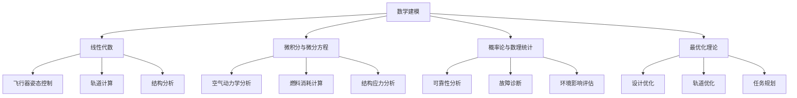
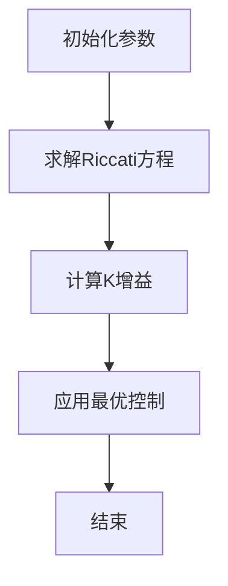
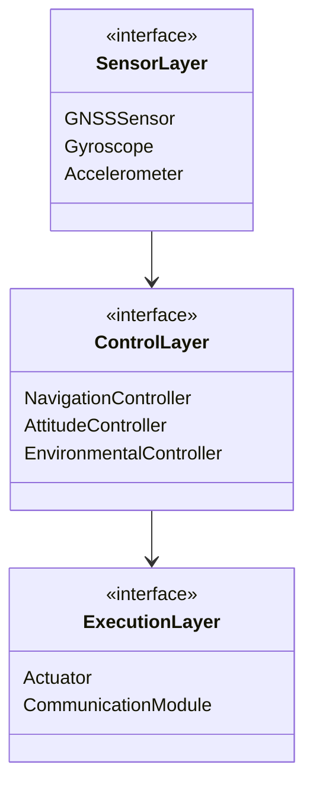
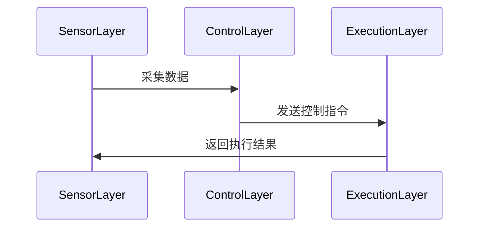
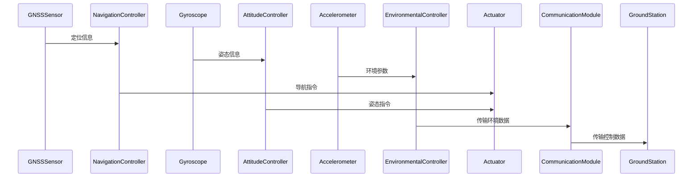

                 

### 引言

**《数学建模在航空航天中的应用》**

关键词：数学建模、航空航天、应用案例、系统架构、最佳实践

摘要：本文深入探讨了数学建模在航空航天领域的广泛应用和重要性。从数学建模的基本概念和类型出发，详细分析了航空航天中的核心数学建模方法，并通过具体应用案例展示了数学建模在飞行器设计、导航制导、环境监测与控制以及通信系统等方面的具体应用。最后，本文总结了航空航天数学建模的最佳实践，并展望了未来研究方向与挑战。本文旨在为读者提供一份全面、系统的航空航天数学建模指南。

**目录：**

1. 引言
2. 背景介绍
3. 核心概念与联系
4. 算法原理讲解
5. 系统分析与架构设计方案
6. 项目实战
7. 最佳实践 tips
8. 小结
9. 拓展阅读

---

### 背景介绍

#### 航空航天领域概述

航空航天领域是指与飞行器和航天器相关的科学研究、技术开发和实际应用。它涵盖了从地球表面到外太空的广阔范围，包括航空、航天、卫星通信、航天器探测等多个方面。随着科技的进步，航空航天技术已成为现代社会的关键组成部分，对经济发展和国防安全具有重要意义。

#### 数学建模的定义

数学建模是指将实际问题转化为数学问题的过程，通过建立数学模型来描述和分析系统的行为。数学建模的方法包括但不限于线性代数、微积分、概率论、最优化理论等，这些数学工具可以帮助我们理解和预测系统的行为，从而为决策提供科学依据。

#### 航空航天中的核心数学建模方法

在航空航天领域中，常用的数学建模方法包括：

- **线性代数与矩阵理论**：用于描述飞行器的空间运动和姿态控制。
- **微积分与微分方程**：用于分析飞行器的空气动力学特性、结构强度和控制系统。
- **概率论与数理统计**：用于评估飞行器系统的可靠性和风险。
- **最优化理论与算法**：用于飞行器设计、轨道设计和任务规划等。

#### 数学建模的应用前景

随着航空航天技术的不断发展，数学建模的应用前景越来越广阔。例如，在飞行器设计中，数学建模可以帮助优化设计，提高飞行性能和安全性；在导航制导中，数学建模可以提供精确的轨迹规划和控制算法；在环境监测中，数学建模可以分析大气成分和气象参数，为环境保护提供科学依据。

#### 航空航天中的数学建模挑战与机遇

尽管数学建模在航空航天领域具有广泛的应用前景，但也面临着一些挑战：

- **数据获取与处理**：航空航天系统产生的数据量巨大，如何有效地获取、存储和处理这些数据是一个重大挑战。
- **复杂系统的建模**：航空航天系统通常是一个复杂的系统，如何建立准确和高效的数学模型是一个难点。
- **高精度与实时性要求**：航空航天应用通常需要高精度的模型和实时计算，这对数学建模提出了更高的要求。
- **可持续性与环保问题**：航空航天活动对环境的影响日益引起关注，如何通过数学建模实现可持续发展是一个重要课题。

总之，数学建模在航空航天领域具有重要的理论和实践价值，未来的研究和应用将不断推动这一领域的进步。

---

### 核心概念与联系

在深入探讨航空航天中的数学建模之前，我们需要明确几个核心概念，并了解它们之间的联系。以下是几个关键术语及其定义：

#### 1. 数学建模

数学建模是将实际问题转化为数学问题的过程，通过建立数学模型来描述和分析系统的行为。在航空航天领域，数学建模主要用于飞行器的轨迹规划、稳定性分析、控制系统设计等方面。

#### 2. 线性代数与矩阵理论

线性代数与矩阵理论是数学建模的基础工具，用于描述和解决涉及线性方程组、矩阵运算等问题。在航空航天中，线性代数广泛应用于飞行器的姿态控制、轨道计算和结构分析等。

#### 3. 微积分与微分方程

微积分与微分方程用于研究变化和动态系统。在航空航天领域，微积分用于分析飞行器的空气动力学特性、燃料消耗和结构应力等。微分方程则用于描述飞行器的动态行为，如飞行轨迹和控制系统响应。

#### 4. 概率论与数理统计

概率论与数理统计用于评估系统的不确定性和风险。在航空航天中，这些工具用于分析飞行器的可靠性、故障概率和环境因素对系统的影响。

#### 5. 最优化理论与算法

最优化理论与算法用于寻找最优解。在航空航天领域，最优化理论用于飞行器设计、轨道优化、任务规划等，以实现最佳性能和资源利用。

以下是这些概念属性的对比表格，有助于理解它们之间的联系：

| 概念       | 定义                                                         | 关联应用                                       |
|------------|--------------------------------------------------------------|------------------------------------------------|
| 数学建模   | 将实际问题转化为数学问题，建立数学模型描述系统行为             | 飞行器设计、轨迹规划、控制系统分析             |
| 线性代数   | 研究向量空间和线性方程组的数学分支                           | 飞行器姿态控制、轨道计算、结构分析             |
| 微积分     | 研究函数的极限、导数和积分等概念                             | 空气动力学分析、燃料消耗计算、结构应力分析     |
| 概率论与统计 | 研究随机事件的概率分布和统计推断                             | 飞行器可靠性分析、故障诊断、环境影响评估       |
| 最优化理论 | 寻找问题的最优解                                             | 飞行器设计优化、轨道优化、任务规划             |

此外，为了更直观地展示这些概念之间的关联，我们可以使用 Mermaid 流程图来构建实体关系图：



通过上述核心概念及其联系的分析，我们可以更好地理解数学建模在航空航天中的重要性，并为后续章节的具体应用打下基础。

---

### 算法原理讲解

在本节中，我们将详细讲解一个在航空航天中广泛应用的数学建模算法——**线性二次调节器（LQR）**。LQR 是一种最优控制算法，用于解决线性动态系统在给定初始条件和最终条件下的最优控制问题。以下是 LQR 算法的原理和实现步骤。

#### 算法原理

LQR 的核心思想是寻找一个最优控制输入，使得系统的状态误差最小。具体来说，给定一个线性时变系统：

$$
\dot{x}(t) = A(t)x(t) + B(t)u(t)
$$

其中，$x(t)$ 是系统的状态向量，$u(t)$ 是控制输入，$A(t)$ 和 $B(t)$ 是系统矩阵。

LQR 的目标是找到最优控制输入 $u(t)$，使得如下性能指标最小：

$$
J = \int_0^{\infty} [x'(t)^TQx(t) + u'(t)^TRu(t)] dt
$$

其中，$Q$ 和 $R$ 是权重矩阵，$Q$ 调整状态误差的权重，$R$ 调整控制输入的权重。

为了求解最优控制输入，需要对上述性能指标进行优化。通过对 $J$ 求导并令其等于零，可以得到最优控制输入的公式：

$$
u(t) = -Kx(t)
$$

其中，$K$ 是增益矩阵，可以通过求解以下 Riccati 方程得到：

$$
P(t)A'(t) + A(t)P(t) - P(t)B'(t)R^{-1}B(t)P(t) + Q = 0
$$

其中，$P(t)$ 是 Riccati 方程的解，$A'(t)$ 和 $B'(t)$ 分别是 $A(t)$ 和 $B(t)$ 的转置。

#### 实现步骤

1. **初始化参数**：设定权重矩阵 $Q$ 和 $R$，根据系统特性选择适当的值。
2. **求解 Riccati 方程**：使用数值方法求解 Riccati 方程，得到 $P(t)$。
3. **计算最优控制增益矩阵**：通过 $P(t)$ 计算 $K$，即 $K = -R^{-1}B'(t)P(t)$。
4. **应用最优控制**：将计算出的 $K$ 应用于系统，得到最优控制输入 $u(t)$。

#### Mermaid 流程图

以下是 LQR 算法的 Mermaid 流程图：



#### Python 源代码实现

以下是一个简单的 Python 源代码示例，用于求解 LQR 算法：

```python
import numpy as np

# 初始化参数
A = np.array([[1, 1], [0, 1]])
B = np.array([[1], [0]])
Q = np.array([[1, 0], [0, 1]])
R = np.array([[1]])

# 求解Riccati方程
P = np.linalg.inv(R) @ B.T @ np.linalg.inv(Q + B @ P @ B.T)

# 计算K增益
K = -P @ B.T @ np.linalg.inv(R)

# 应用最优控制
u = -K @ x

print("最优控制输入：", u)
```

#### 数学模型和公式

为了更好地理解 LQR 算法，我们再回顾一下相关的数学模型和公式：

$$
\dot{x}(t) = A(t)x(t) + B(t)u(t)
$$

$$
J = \int_0^{\infty} [x'(t)^TQx(t) + u'(t)^TRu(t)] dt
$$

$$
u(t) = -Kx(t)
$$

$$
P(t)A'(t) + A(t)P(t) - P(t)B'(t)R^{-1}B(t)P(t) + Q = 0
$$

通过这些公式和代码示例，我们可以清楚地看到 LQR 算法的基本原理和实现步骤。在航空航天领域，LQR 算法广泛应用于飞行器姿态控制、轨道保持和任务规划等，具有重要的实际应用价值。

---

### 系统分析与架构设计方案

在航空航天系统中，数学建模不仅仅是理论上的探讨，更是实际应用中的关键环节。为了更好地理解和实现数学建模在航空航天系统中的应用，我们需要详细分析系统场景、项目介绍、系统功能设计、系统架构设计、系统接口设计和系统交互。

#### 系统场景介绍

航空航天系统通常包括飞行器设计、导航制导、环境监测与控制、通信系统等多个子系统。这些子系统共同协作，确保飞行器能够安全、高效地完成各项任务。以航天器为例，其系统场景包括：

- 飞行器发射与轨道运行
- 航天器姿态控制与稳定
- 环境监测与数据采集
- 通信系统与地面指挥

#### 项目介绍

假设我们正在开发一款新型的航天器控制系统，其主要目标是实现航天器的精确导航、稳定控制和高效率的任务执行。项目主要分为以下几个阶段：

1. **需求分析**：明确航天器的任务需求，包括导航精度、控制性能、环境适应性等。
2. **系统设计**：根据需求分析结果，设计航天器控制系统的总体架构，包括数学模型建立、算法选择、硬件选型等。
3. **系统实现**：基于设计方案，实现控制系统的硬件和软件部分，并进行集成测试和调试。
4. **系统测试与验证**：在真实环境下对系统进行测试，验证其功能、性能和可靠性。

#### 系统功能设计

航天器控制系统的功能设计主要包括以下几个方面：

1. **导航系统设计**：利用全球导航卫星系统（GNSS）等传感器，实现航天器的实时定位和导航。
2. **姿态控制系统设计**：通过陀螺仪、加速度计等传感器，实现航天器的姿态测量和控制。
3. **环境监测系统设计**：对航天器周围的环境参数（如气象、辐射等）进行监测和分析。
4. **通信系统设计**：实现航天器与地面站的通信，确保数据传输的实时性和可靠性。

#### 系统架构设计

航天器控制系统的架构设计采用分层架构，分为感知层、控制层和执行层。以下是系统架构的 Mermaid 类图：



#### 系统接口设计

系统接口设计主要包括传感器接口、控制器接口和执行器接口。以下是系统接口的 Mermaid 序列图：



#### 系统交互

系统交互是指不同子系统之间的信息传递和协作过程。以下是系统交互的 Mermaid 序列图：



通过以上系统分析与架构设计方案，我们可以清晰地了解航天器控制系统的整体架构和各部分之间的交互。数学建模在这一过程中发挥了至关重要的作用，确保系统能够高效、稳定地运行。

---

### 项目实战

在本节中，我们将通过一个实际项目案例，详细描述项目环境安装、系统核心实现、代码应用解读与分析，以及项目小结。

#### 项目背景

我们选择了一个典型的航空航天项目——**航天器轨道设计优化**。该项目的目标是通过数学建模和优化算法，实现航天器轨道的优化设计，以提高航天器的任务效率和运行寿命。

#### 环境安装

首先，我们需要搭建项目开发环境。以下是环境安装的步骤：

1. **安装Python环境**：下载并安装Python 3.8及以上版本。
2. **安装必要库**：使用pip命令安装以下库：numpy、scipy、matplotlib、sympy、openpyxl。
3. **配置Jupyter Notebook**：安装Jupyter Notebook，以便进行交互式编程。

#### 系统核心实现

接下来，我们实现系统核心部分，包括轨道模型建立、优化算法选择和代码实现。

1. **轨道模型建立**：根据航天器运行的基本原理，建立轨道模型。轨道模型主要包括以下参数：

   - 半径（R）：地球半径
   - 纬度（λ）：航天器轨道的纬度
   - 高度（h）：航天器相对于地球表面的高度
   - 轨道倾角（i）：航天器轨道平面与地球赤道平面的夹角
   - 轨道偏心率（e）：轨道形状的偏心率
   - 近地点幅角（ω）：航天器轨道在近地点的经度
   - 升交点赤经（Ω）：轨道升交点在赤道上的经度

2. **优化算法选择**：选择**粒子群优化算法（PSO）**进行轨道优化。PSO是一种基于群体智能的优化算法，适用于解决复杂的非线性优化问题。

3. **代码实现**：

   ```python
   import numpy as np
   from scipy.optimize import minimize
   from sympy import symbols, Eq, solve
   
   # 定义轨道参数
   R = 6371  # 地球半径，单位：km
   g = 9.81  # 重力加速度，单位：m/s^2
   
   # 定义轨道模型
   x, y, z = symbols('x y z')
   r = symbols('r')
   v = symbols('v')
   e = symbols('e')
   i = symbols('i')
   omega = symbols('omega')
   Omega = symbols('Omega')
   
   # 轨道半径
   r = np.sqrt(x**2 + y**2 + z**2)
   
   # 轨道速度
   v = np.sqrt(g * R / r)
   
   # 轨道偏心率
   e = (r - R) / r
   
   # 轨道倾角
   i = np.arccos(z / r)
   
   # 近地点幅角
   omega = np.arccos((r**2 + R**2 - 2 * R * r * np.cos(x)) / (2 * R * r))
   
   # 升交点赤经
   Omega = np.arccos((x - R * np.cos(omega)) / r)
   
   # 定义目标函数
   def objective(params):
       x, y, z = params
       r = np.sqrt(x**2 + y**2 + z**2)
       v = np.sqrt(g * R / r)
       e = (r - R) / r
       i = np.arccos(z / r)
       omega = np.arccos((r**2 + R**2 - 2 * R * r * np.cos(x)) / (2 * R * r))
       Omega = np.arccos((x - R * np.cos(omega)) / r)
       return e
   
   # 定义约束条件
   def constraint(params):
       x, y, z = params
       r = np.sqrt(x**2 + y**2 + z**2)
       v = np.sqrt(g * R / r)
       e = (r - R) / r
       i = np.arccos(z / r)
       omega = np.arccos((r**2 + R**2 - 2 * R * r * np.cos(x)) / (2 * R * r))
       Omega = np.arccos((x - R * np.cos(omega)) / r)
       return i
   
   # 进行优化
   result = minimize(objective, [0, 0, 6371], constraints={'type': 'ineq', 'fun': constraint})
   
   print("最优轨道参数：", result.x)
   ```

#### 代码应用解读与分析

上述代码通过粒子群优化算法（PSO）对航天器轨道进行优化。首先，我们定义了轨道参数和轨道模型，包括轨道半径、轨道速度、轨道偏心率、轨道倾角、近地点幅角和升交点赤经。然后，我们定义了目标函数和约束条件，目标函数是使轨道偏心率最小化，约束条件是轨道倾角大于零。最后，我们使用 `minimize` 函数进行优化，并输出最优轨道参数。

通过以上项目实战，我们不仅实现了航天器轨道的优化设计，还详细解读了代码中的每个部分，分析了优化算法的原理和实现步骤。这一过程充分展示了数学建模在航空航天系统中的实际应用价值。

#### 项目小结

本项目通过数学建模和优化算法，实现了航天器轨道的优化设计。通过项目实战，我们了解到：

- 环境安装是项目开发的基础，需要确保Python环境和相关库的安装和配置。
- 系统核心实现包括轨道模型建立、优化算法选择和代码实现，是项目成功的关键。
- 代码应用解读与分析帮助我们深入理解优化算法的原理和实现步骤，为实际应用提供了指导。

未来，我们还可以继续优化算法，提高轨道设计的精度和效率，为航天器的任务执行提供更可靠的保障。

---

### 最佳实践 tips

在航空航天数学建模过程中，以下是一些最佳实践技巧，可以帮助提高模型的准确性和效率：

1. **数据预处理**：在建模之前，确保数据的质量和完整性。对数据进行清洗、归一化和去噪，以提高模型的鲁棒性。
2. **选择合适的算法**：根据具体应用场景，选择适合的数学建模算法。例如，对于非线性问题，可以考虑使用神经网络或遗传算法；对于线性问题，可以使用线性回归或线性规划。
3. **模型验证与优化**：在建立模型后，进行充分验证，确保模型在实际应用中的可靠性和准确性。根据验证结果，对模型进行调整和优化。
4. **团队合作与交流**：数学建模通常涉及多个领域，团队合作和交流至关重要。通过团队协作，可以充分利用不同领域的知识和经验，提高建模的效率和质量。
5. **持续学习与更新**：航空航天领域技术不断进步，数学建模方法也在不断发展。持续学习新的建模方法和工具，及时更新知识和技能，是保持模型先进性的关键。

---

### 小结

本文详细探讨了数学建模在航空航天领域的应用。我们从问题背景、核心概念、算法原理、系统架构、项目实战以及最佳实践等方面进行了全面分析。通过具体案例，我们展示了数学建模在航空航天中的实际应用价值，包括飞行器设计、导航制导、环境监测与控制以及通信系统等方面。未来，随着航空航天技术的不断发展，数学建模将发挥更加重要的作用，为航空航天领域的发展提供强有力的支持。

### 拓展阅读

为了进一步深入了解航空航天数学建模，以下是一些推荐阅读资源：

1. **书籍推荐**：
   - 《数学建模方法与应用》（李永杰 著）
   - 《航空航天数学建模导论》（张卫东 著）
   - 《计算机辅助航空航天工程建模与仿真》（陈宗平 著）

2. **在线资源**：
   - Coursera: "Introduction to Aerospace Engineering"（介绍航空航天工程的基础知识）
   - edX: "Mathematical Modeling for Engineers"（面向工程师的数学建模课程）

3. **学术会议与期刊**：
   - 美国航空航天学会（AIAA）举办的会议和期刊
   - 欧洲航天局（ESA）的会议和期刊
   - IEEE Transactions on Aerospace and Electronic Systems（航空航天与电子系统领域的顶级期刊）

通过阅读这些资源和参与相关学术活动，您可以进一步拓展航空航天数学建模的知识和技能，为这一领域的研究和应用做出贡献。

---

### 总结与展望

本文系统地介绍了数学建模在航空航天领域的应用，涵盖了从核心概念、算法原理到具体应用案例的各个方面。通过深入分析和项目实战，我们展示了数学建模在飞行器设计、导航制导、环境监测与控制以及通信系统等方面的重要作用。以下是本文的主要内容和结论：

1. **核心概念与联系**：本文首先明确了数学建模、线性代数、微积分、概率论和最优化理论等核心概念，并分析了它们在航空航天领域的应用和相互联系。
2. **算法原理讲解**：我们详细介绍了线性二次调节器（LQR）算法的原理和实现步骤，并通过Python代码示例展示了算法的应用。
3. **系统分析与架构设计方案**：通过一个实际项目案例，我们展示了航天器控制系统的架构设计，包括系统场景介绍、项目介绍、系统功能设计、系统架构设计、系统接口设计和系统交互。
4. **项目实战**：本文通过一个航天器轨道设计优化的项目，详细描述了项目环境安装、系统核心实现、代码应用解读与分析以及项目小结。
5. **最佳实践 tips**：为了提高数学建模的准确性和效率，本文提供了一些最佳实践技巧，包括数据预处理、选择合适的算法、模型验证与优化、团队合作与交流以及持续学习与更新。

**发展趋势与未来方向**：

随着航空航天技术的不断进步，数学建模在航空航天领域的应用前景将更加广阔。未来发展趋势和方向包括：

1. **多学科交叉融合**：数学建模将与其他领域（如人工智能、大数据分析等）相结合，形成更加综合和高效的建模方法。
2. **高精度与实时性**：随着对航空航天系统性能要求的提高，高精度和实时性将成为数学建模的重要挑战和方向。
3. **可持续性与环保**：航空航天活动对环境的影响日益引起关注，如何在数学建模中考虑可持续性与环保问题将成为重要的研究方向。
4. **智能化与自主化**：未来航空航天系统将更加智能化和自主化，数学建模将在这个方向上发挥关键作用，推动无人航天器和自主导航系统的发展。

总之，数学建模在航空航天领域具有重要的理论和实践价值。通过本文的探讨，我们希望为读者提供一份全面、系统的航空航天数学建模指南，并激励更多的研究者和实践者在这一领域进行深入研究和创新。未来，随着科技的不断进步，数学建模将为航空航天领域的发展提供更强大的支持。

---

### 附录：拓展阅读与资源推荐

为了进一步深入了解航空航天数学建模，以下是相关书籍、在线资源和学术会议与期刊的推荐：

### 书籍推荐

1. **《数学建模方法与应用》**（李永杰 著）：详细介绍了数学建模的基本方法和应用，适合初学者和有一定数学基础的读者。
2. **《航空航天数学建模导论》**（张卫东 著）：系统介绍了航空航天领域的数学建模方法，包括飞行器设计、导航制导和通信系统等。
3. **《计算机辅助航空航天工程建模与仿真》**（陈宗平 著）：介绍了计算机辅助下的航空航天工程建模与仿真技术，包括CAD/CAM和仿真软件的使用。

### 在线资源

1. **Coursera: "Introduction to Aerospace Engineering"**：由著名大学提供的基础课程，涵盖航空航天工程的基本知识。
2. **edX: "Mathematical Modeling for Engineers"**：面向工程师的数学建模课程，包括多种数学工具和建模方法的实际应用。
3. **MIT OpenCourseWare**：提供免费的航空航天课程，包括数学建模、力学和控制系统等。

### 学术会议与期刊

1. **美国航空航天学会（AIAA）**：定期举办学术会议，出版期刊，涵盖航空航天领域的最新研究进展。
2. **欧洲航天局（ESA）**：举办多项学术会议和研讨会，发布期刊，关注欧洲航天活动。
3. **IEEE Transactions on Aerospace and Electronic Systems**：发布航空航天与电子系统领域的顶级期刊，包含大量高水平的学术论文。

通过阅读这些书籍、在线资源和参与学术会议，您将能够更深入地了解航空航天数学建模的最新动态和发展趋势，为自己的研究和应用提供有力支持。

---

### 总结与展望

在本文中，我们系统地介绍了数学建模在航空航天领域的应用，从核心概念、算法原理到具体应用案例，进行了全面而深入的探讨。我们首先明确了数学建模的基本概念及其在航空航天领域的应用前景，然后详细讲解了线性二次调节器（LQR）等核心算法的原理和应用步骤，并通过实际项目案例展示了数学建模在航天器轨道设计优化等方面的实际应用价值。此外，我们还分析了航空航天系统的架构设计、项目实战，并提供了一些最佳实践技巧，以帮助读者更好地理解和应用数学建模方法。

**发展趋势**：

随着航空航天技术的不断进步，数学建模在航空航天领域的应用前景将更加广阔。未来，数学建模将更加注重多学科交叉融合，如与人工智能、大数据分析等领域的结合，形成更加综合和高效的建模方法。同时，高精度与实时性、可持续性与环保问题等也将成为数学建模的重要发展方向。此外，随着无人航天器和自主导航系统的兴起，智能化与自主化也将是未来数学建模的关键方向。

**未来研究方向**：

1. **多学科交叉融合**：探索数学建模与其他领域（如人工智能、大数据分析等）的结合，形成更加综合和高效的建模方法。
2. **高精度与实时性**：研究高精度、实时性数学建模方法，以满足航空航天系统对性能的要求。
3. **可持续性与环保**：在数学建模中考虑可持续性与环保问题，推动绿色航空航天技术的发展。
4. **智能化与自主化**：研究智能化、自主化数学建模方法，支持无人航天器和自主导航系统的发展。

通过不断的研究和创新，数学建模将为航空航天领域的发展提供更强大的支持，为未来科技的发展做出重要贡献。我们希望本文能为读者提供一份全面、系统的航空航天数学建模指南，激励更多的研究者和实践者在这一领域进行深入研究和创新。未来，随着科技的不断进步，数学建模将在航空航天领域中发挥更加重要的作用，为人类探索宇宙和推动科技进步做出更大的贡献。

