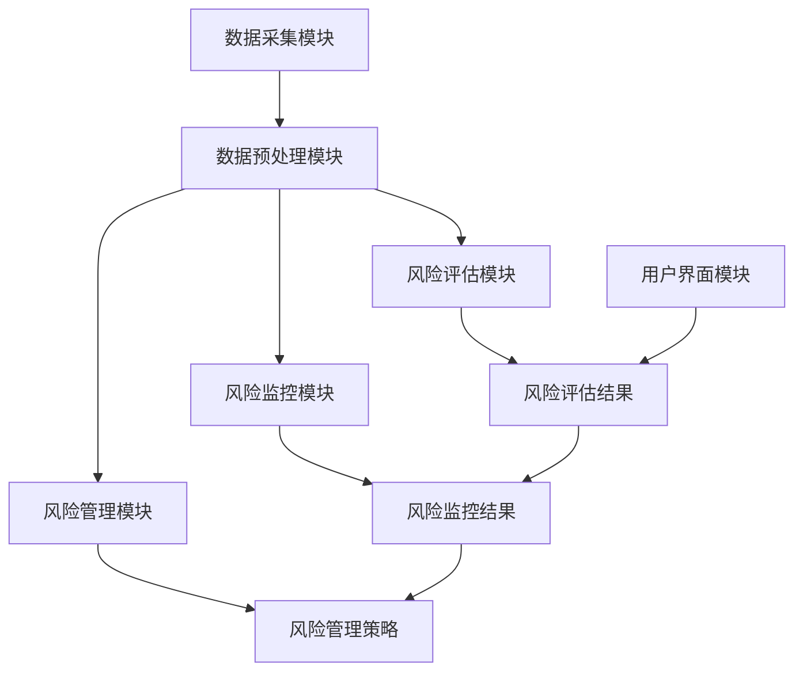

                 

### 数学建模在金融风险管理中的应用

**关键词：** 数学建模、金融风险管理、风险评估、风险监控、风险管理模型

**摘要：**  
数学建模在金融风险管理中扮演着至关重要的角色。本文旨在深入探讨数学建模在金融风险管理中的应用，包括其重要性、基本原理、核心概念与联系、算法原理讲解以及系统分析与架构设计方案。通过详细分析和实例说明，本文旨在帮助读者理解数学建模如何帮助金融机构更好地管理风险，提高风险管理的效率和准确性。

### 第一部分: 问题背景

#### 第1章: 问题背景

##### 1.1 数学建模在金融风险管理中的重要性

金融风险管理是指金融机构为了降低风险水平，保护其资产和收益而采取的一系列策略和措施。然而，金融市场的复杂性使得风险管理面临诸多挑战。数学建模作为一种工具，能够帮助金融机构更准确地预测和评估风险，从而制定更为有效的风险管理策略。

首先，数学建模可以量化金融风险，使其变得可计算和可预测。例如，通过构建风险模型，金融机构可以评估不同金融产品的潜在风险，从而做出更为明智的投资决策。其次，数学建模能够帮助金融机构监测和预测市场变化，及时调整风险策略，以应对市场波动。此外，数学建模还可以提高金融机构的风险评估和监控效率，减少人为误差，提高风险管理的效果。

##### 1.1.1 金融风险管理的挑战

金融风险管理面临以下几个主要挑战：

1. **数据复杂性**：金融市场涉及大量数据，如价格、交易量、信用评级等。如何从这些数据中提取有用的信息，并构建可靠的模型，是金融风险管理的一个难题。
2. **模型不确定性**：数学模型通常依赖于假设和数据，而市场环境的不确定性使得模型预测的结果可能并不完全准确。
3. **模型适应能力**：金融市场变化迅速，如何使数学模型适应这些变化，保持其有效性和准确性，是一个重要的挑战。
4. **计算资源限制**：构建和运行复杂的数学模型需要大量的计算资源和时间，如何优化计算流程，提高计算效率，也是一个需要解决的问题。

##### 1.1.2 数学建模在金融风险管理中的应用

数学建模在金融风险管理中的应用非常广泛，主要包括以下几个方面：

1. **风险评估**：通过构建风险评估模型，金融机构可以评估金融产品的风险水平，从而做出更为明智的投资决策。
2. **风险监控**：数学模型可以帮助金融机构实时监控市场变化，及时识别潜在风险，并采取相应的措施。
3. **风险管理策略制定**：基于数学建模的结果，金融机构可以制定更为科学和高效的风险管理策略。
4. **信用评级**：通过构建信用评级模型，金融机构可以评估借款人的信用风险，从而决定是否给予贷款以及贷款的额度。

##### 1.1.3 数学建模在金融风险管理中的优势

数学建模在金融风险管理中具有以下优势：

1. **量化风险**：数学建模可以将金融风险量化为具体的数值，使风险管理者能够直观地了解风险水平。
2. **提高决策效率**：通过数学建模，金融机构可以快速分析和评估不同金融产品的风险，提高决策效率。
3. **降低风险**：数学建模可以帮助金融机构识别和管理潜在风险，从而降低整个金融系统的风险水平。
4. **适应性和灵活性**：数学建模可以根据市场环境的变化进行调整，保持其有效性和准确性。

##### 1.2 数学建模的基本原理

数学建模是指将现实世界的实际问题转化为数学问题，通过建立数学模型来分析和解决问题。数学建模的基本原理包括以下几个方面：

1. **抽象与简化**：数学建模需要对现实问题进行抽象和简化，将复杂问题转化为更易于处理的数学问题。
2. **变量与关系**：数学建模涉及变量和关系的定义，这些变量和关系描述了现实世界中不同因素之间的相互作用。
3. **数学工具与方法**：数学建模需要运用各种数学工具和方法，如微积分、线性代数、概率统计等，来构建和分析模型。
4. **模型验证与优化**：数学建模需要对模型进行验证和优化，以确保模型能够准确描述现实问题，并能够为决策提供可靠的依据。

##### 1.2.1 数学建模的概念

数学建模是指将现实世界的实际问题转化为数学问题，通过建立数学模型来分析和解决问题的过程。数学模型是一种抽象的数学结构，用于描述现实世界中的变量和关系。

##### 1.2.2 数学建模的基本流程

数学建模的基本流程包括以下几个步骤：

1. **问题定义**：明确要解决的问题，理解问题的背景和目标。
2. **数据收集**：收集与问题相关的数据，包括历史数据、市场数据、经济数据等。
3. **模型构建**：根据问题的特点和需求，选择合适的数学模型，构建数学模型。
4. **模型分析**：对数学模型进行求解和分析，验证模型的正确性和可靠性。
5. **决策支持**：基于数学模型的分析结果，提供决策支持和建议。

##### 1.2.3 数学建模的常用方法

数学建模的常用方法包括以下几种：

1. **统计分析法**：通过收集历史数据，使用统计方法对数据进行分析，建立统计模型。
2. **优化方法**：通过建立优化模型，求解最优化问题，找到最优解。
3. **模拟方法**：通过模拟市场变化和金融产品的运作过程，分析潜在风险。
4. **机器学习方法**：使用机器学习算法，从大量数据中学习模式和规律，建立预测模型。

##### 1.3 数学建模在金融风险管理中的应用实例

数学建模在金融风险管理中有着广泛的应用，以下是一些典型的应用实例：

1. **风险评估模型**：例如，利用信用评分模型来评估借款人的信用风险，从而决定是否给予贷款以及贷款的额度。
2. **风险监控模型**：例如，利用市场风险监控系统，实时监测市场价格变化，及时识别潜在的市场风险。
3. **风险管理模型**：例如，利用投资组合优化模型，帮助金融机构构建风险分散的投资组合，降低投资风险。

##### 1.4 数学建模在金融风险管理中的发展前景

随着科技的进步和金融市场的不断发展，数学建模在金融风险管理中的应用前景非常广阔。以下是一些可能的发展趋势：

1. **大数据与人工智能的应用**：大数据和人工智能技术的应用将大大提高数学建模的效率和准确性，为金融机构提供更为强大的风险管理工具。
2. **实时风险监控**：随着技术的进步，实时风险监控将成为金融风险管理的重要方向，金融机构可以更加及时地识别和应对潜在风险。
3. **跨领域合作**：数学建模与金融学、经济学、统计学等领域的交叉融合，将推动金融风险管理的发展和创新。

#### 1.4.1 数学建模技术的新趋势

近年来，数学建模技术在金融风险管理领域呈现出以下新趋势：

1. **机器学习与深度学习的应用**：机器学习和深度学习算法在数据处理和模式识别方面具有显著优势，逐渐成为金融风险管理的重要工具。
2. **区块链技术的应用**：区块链技术的应用可以提高金融交易的透明度和安全性，为数学建模提供更为可靠的数据基础。
3. **智能合约的应用**：智能合约的应用可以自动化执行金融合同，减少人为干预，提高金融风险管理的效率和准确性。

#### 1.4.2 数学建模在金融风险管理中的未来方向

展望未来，数学建模在金融风险管理中的发展方向主要包括：

1. **全面风险管理**：随着金融市场的复杂性增加，全面风险管理将成为金融风险管理的重要方向，数学建模需要适应这一变化，提供更为全面和系统的风险管理解决方案。
2. **可持续性与社会责任**：随着可持续发展和社会责任的重要性日益凸显，数学建模在金融风险管理中的应用也需要考虑这些因素，为金融机构提供可持续发展的风险管理策略。
3. **跨学科融合**：数学建模需要与经济学、统计学、计算机科学等学科进行跨学科融合，利用多学科的优势，提高金融风险管理的科学性和有效性。

### 第二部分: 核心概念与联系

#### 第2章: 核心概念与联系

##### 2.1 金融风险

金融风险是指金融机构在运营过程中可能遭受的损失。金融风险可以分为以下几种类型：

1. **市场风险**：由于市场价格波动导致的潜在损失，如利率风险、汇率风险、股票市场风险等。
2. **信用风险**：由于借款人违约导致的潜在损失，如贷款违约、信用评级下降等。
3. **流动性风险**：由于资金流动不畅导致的潜在损失，如无法及时偿还债务、市场流动性下降等。
4. **操作风险**：由于内部操作失误或外部事件导致的潜在损失，如欺诈、技术故障、自然灾害等。

##### 2.1.1 金融风险的概念

金融风险是指金融机构在运营过程中可能遭受的损失，这种损失可能来自市场波动、信用违约、操作失误等多种原因。

##### 2.1.2 金融风险的类型

金融风险可以分为以下几种类型：

1. **市场风险**：由于市场价格波动导致的潜在损失，如利率风险、汇率风险、股票市场风险等。
2. **信用风险**：由于借款人违约导致的潜在损失，如贷款违约、信用评级下降等。
3. **流动性风险**：由于资金流动不畅导致的潜在损失，如无法及时偿还债务、市场流动性下降等。
4. **操作风险**：由于内部操作失误或外部事件导致的潜在损失，如欺诈、技术故障、自然灾害等。

##### 2.1.3 金融风险的特征

金融风险具有以下几个特征：

1. **不确定性**：金融风险的不确定性较大，无法完全预测和避免。
2. **复杂性**：金融风险的来源多样，涉及市场、信用、流动性等多个方面，具有很高的复杂性。
3. **传染性**：金融风险具有传染性，一个金融机构的风险可能会影响其他金融机构，甚至整个金融系统。
4. **系统性**：金融风险往往具有系统性特征，单一金融机构的风险可能会对整个金融系统产生重大影响。

##### 2.2 数学模型

数学模型是一种抽象的数学结构，用于描述现实世界中的变量和关系。数学模型通常包括以下要素：

1. **变量**：描述现实世界中不同因素的变化，如价格、利率、交易量等。
2. **关系**：描述变量之间的相互关系，如线性关系、非线性关系、概率关系等。
3. **参数**：用于描述模型的特征和参数化，如均值、方差、置信区间等。
4. **假设**：模型建立的基础，如市场效率、信息完全等。

##### 2.2.1 数学模型的概念

数学模型是指用数学语言描述现实世界中的现象、关系和规律的抽象结构。

##### 2.2.2 数学模型的类型

数学模型可以分为以下几种类型：

1. **统计分析模型**：用于描述变量之间的统计关系，如线性回归模型、时间序列模型等。
2. **优化模型**：用于求解最优化问题，如线性规划模型、非线性规划模型等。
3. **模拟模型**：通过模拟现实世界的运行过程，分析潜在风险，如蒙特卡罗模拟、仿真模型等。
4. **机器学习模型**：通过机器学习算法，从数据中学习模式和规律，如决策树、神经网络等。

##### 2.2.3 数学模型的构建

数学模型的构建通常包括以下步骤：

1. **问题定义**：明确要解决的问题，理解问题的背景和目标。
2. **数据收集**：收集与问题相关的数据，包括历史数据、市场数据、经济数据等。
3. **变量定义**：定义描述问题的变量，确定变量之间的关系。
4. **关系建模**：建立变量之间的数学关系，如线性关系、非线性关系等。
5. **参数估计**：估计模型参数，如均值、方差、置信区间等。
6. **模型验证**：验证模型的正确性和可靠性，确保模型能够准确描述现实问题。

##### 2.3 金融风险管理与数学模型的关系

金融风险管理与数学模型之间存在密切的关系，数学模型是金融风险管理的重要工具。以下从几个方面说明数学模型在金融风险管理中的作用：

1. **风险评估**：数学模型可以帮助金融机构评估不同金融产品的风险水平，从而做出更为明智的投资决策。
2. **风险监控**：数学模型可以帮助金融机构实时监控市场变化，及时识别潜在风险，并采取相应的措施。
3. **风险管理策略制定**：基于数学模型的分析结果，金融机构可以制定更为科学和高效的风险管理策略。
4. **信用评级**：数学模型可以帮助金融机构评估借款人的信用风险，从而决定是否给予贷款以及贷款的额度。

##### 2.3.1 数学模型在金融风险管理中的重要作用

数学模型在金融风险管理中具有重要作用，主要体现在以下几个方面：

1. **量化风险**：数学模型可以将金融风险量化为具体的数值，使风险管理者能够直观地了解风险水平。
2. **提高决策效率**：通过数学模型，金融机构可以快速分析和评估不同金融产品的风险，提高决策效率。
3. **降低风险**：数学模型可以帮助金融机构识别和管理潜在风险，从而降低整个金融系统的风险水平。
4. **适应性和灵活性**：数学模型可以根据市场环境的变化进行调整，保持其有效性和准确性。

##### 2.3.2 金融风险管理对数学模型的需求

金融风险管理对数学模型的需求主要表现在以下几个方面：

1. **准确性**：数学模型需要能够准确描述现实世界中的金融风险，为决策提供可靠的依据。
2. **适应性**：数学模型需要能够适应不同市场环境和金融产品的变化，保持其有效性和准确性。
3. **灵活性**：数学模型需要能够根据金融机构的需求进行调整和优化，提高风险管理的效率。
4. **可解释性**：数学模型需要具有一定的可解释性，使风险管理者能够理解模型的原理和运行机制。

##### 2.3.3 数学模型在金融风险管理中的实际应用

数学模型在金融风险管理中的实际应用非常广泛，以下是一些典型的应用场景：

1. **风险评估**：金融机构可以使用数学模型对金融产品的风险进行量化评估，从而做出投资决策。
2. **风险监控**：金融机构可以使用数学模型实时监控市场变化，及时识别潜在风险，并采取相应的措施。
3. **信用评级**：金融机构可以使用数学模型评估借款人的信用风险，从而决定是否给予贷款以及贷款的额度。
4. **投资组合优化**：金融机构可以使用数学模型优化投资组合，降低投资风险，提高投资收益。

### 第三部分: 算法原理讲解

#### 第3章: 算法原理讲解

##### 3.1 风险评估算法

风险评估算法是金融风险管理中的重要工具，用于评估金融产品的风险水平。以下详细介绍风险评估算法的原理、数学模型、算法流程和举例说明。

###### 3.1.1 算法原理

风险评估算法的基本原理是通过建立数学模型，将金融产品的风险量化为具体的数值，从而评估其风险水平。常用的风险评估算法包括信用评分模型、市场风险评估模型等。

###### 3.1.2 数学模型

风险评估算法的数学模型通常包括以下几个部分：

1. **风险指标**：定义用于衡量风险的指标，如损失期望、损失方差等。
2. **输入变量**：确定影响风险的输入变量，如借款人的信用评分、市场利率、资产回报率等。
3. **关系式**：建立输入变量与风险指标之间的关系式，如线性关系、非线性关系等。

例如，一个简单的风险评估模型可以表示为：

\[ R = \alpha \cdot X_1 + \beta \cdot X_2 + ... + \gamma \cdot X_n \]

其中，\( R \) 表示风险水平，\( X_1, X_2, ..., X_n \) 表示影响风险的输入变量，\( \alpha, \beta, ..., \gamma \) 表示权重系数。

###### 3.1.3 算法流程

风险评估算法的流程通常包括以下几个步骤：

1. **数据收集**：收集与金融产品相关的数据，包括历史数据、市场数据、经济数据等。
2. **变量选择**：根据风险评估的目标，选择合适的输入变量。
3. **模型构建**：建立风险评估模型，包括确定风险指标、输入变量和关系式。
4. **参数估计**：使用统计方法估计模型参数，如最小二乘法、最大似然估计法等。
5. **模型验证**：验证模型的正确性和可靠性，确保模型能够准确描述现实问题。
6. **风险评估**：使用模型对金融产品进行风险评估，计算风险水平。

例如，一个简单的风险评估算法流程可以表示为：

1. 收集借款人信用评分、市场利率、资产回报率等数据。
2. 选择借款人信用评分、市场利率、资产回报率等作为输入变量。
3. 建立风险评估模型，如线性回归模型。
4. 使用最小二乘法估计模型参数。
5. 验证模型正确性和可靠性。
6. 对借款人进行风险评估，计算风险水平。

###### 3.1.4 举例说明

以下是一个简单的风险评估算法举例说明：

假设我们使用线性回归模型对借款人的信用风险进行评估。假设借款人信用评分 \( X_1 \)、市场利率 \( X_2 \) 和资产回报率 \( X_3 \) 为输入变量，风险水平 \( R \) 为输出变量。建立线性回归模型如下：

\[ R = \alpha \cdot X_1 + \beta \cdot X_2 + \gamma \cdot X_3 \]

使用最小二乘法估计模型参数，得到：

\[ \alpha = 0.5, \beta = 0.3, \gamma = 0.2 \]

使用模型对某个借款人进行风险评估，其信用评分为 700、市场利率为 4%、资产回报率为 5%。计算风险水平如下：

\[ R = 0.5 \cdot 700 + 0.3 \cdot 4 + 0.2 \cdot 5 = 355 + 1.2 + 1 = 356.2 \]

因此，该借款人的风险水平为 356.2。

##### 3.2 风险监控算法

风险监控算法是金融风险管理中的重要工具，用于实时监控金融市场的变化，识别潜在风险。以下详细介绍风险监控算法的原理、数学模型、算法流程和举例说明。

###### 3.2.1 算法原理

风险监控算法的基本原理是通过建立数学模型，实时监测市场价格、交易量、信用评级等数据，识别潜在的市场风险和信用风险。常用的风险监控算法包括市场风险监控系统、信用风险监控系统等。

###### 3.2.2 数学模型

风险监控算法的数学模型通常包括以下几个部分：

1. **监控指标**：定义用于衡量风险的监控指标，如波动率、风险价值、违约概率等。
2. **输入变量**：确定影响监控指标的输入变量，如市场价格、交易量、信用评级等。
3. **关系式**：建立输入变量与监控指标之间的关系式，如线性关系、非线性关系等。

例如，一个简单的风险监控模型可以表示为：

\[ V = \alpha \cdot X_1 + \beta \cdot X_2 + ... + \gamma \cdot X_n \]

其中，\( V \) 表示监控指标值，\( X_1, X_2, ..., X_n \) 表示影响监控指标的输入变量，\( \alpha, \beta, ..., \gamma \) 表示权重系数。

###### 3.2.3 算法流程

风险监控算法的流程通常包括以下几个步骤：

1. **数据收集**：收集与金融市场相关的数据，包括市场价格、交易量、信用评级等。
2. **变量选择**：根据风险监控的目标，选择合适的输入变量。
3. **模型构建**：建立风险监控模型，包括确定监控指标、输入变量和关系式。
4. **参数估计**：使用统计方法估计模型参数，如最小二乘法、最大似然估计法等。
5. **模型验证**：验证模型的正确性和可靠性，确保模型能够准确描述现实问题。
6. **风险监控**：使用模型实时监控金融市场变化，识别潜在风险。

例如，一个简单的风险监控算法流程可以表示为：

1. 收集市场价格、交易量、信用评级等数据。
2. 选择市场价格、交易量、信用评级等作为输入变量。
3. 建立风险监控模型，如时间序列模型。
4. 使用最小二乘法估计模型参数。
5. 验证模型正确性和可靠性。
6. 实时监控市场价格、交易量、信用评级等，识别潜在风险。

###### 3.2.4 举例说明

以下是一个简单的风险监控算法举例说明：

假设我们使用时间序列模型对市场价格进行监控。假设市场价格 \( X_1 \)、交易量 \( X_2 \) 和信用评级 \( X_3 \) 为输入变量，风险指标 \( V \) 为输出变量。建立时间序列模型如下：

\[ V_t = \alpha \cdot X_{t-1} + \beta \cdot X_{t-2} + ... + \gamma \cdot X_{t-n} \]

使用最小二乘法估计模型参数，得到：

\[ \alpha = 0.2, \beta = 0.3, \gamma = 0.5 \]

使用模型实时监控市场价格，假设当前市场价格为 1000、交易量为 200、信用评级为 800。计算风险指标如下：

\[ V_t = 0.2 \cdot 1000 + 0.3 \cdot 200 + 0.5 \cdot 800 = 200 + 60 + 400 = 560 \]

因此，当前市场价格的风险指标为 560。

##### 3.3 风险管理算法

风险管理算法是金融风险管理中的重要工具，用于制定和实施风险管理策略。以下详细介绍风险管理算法的原理、数学模型、算法流程和举例说明。

###### 3.3.1 算法原理

风险管理算法的基本原理是通过建立数学模型，分析和评估金融产品的风险水平，制定和实施风险管理策略。常用的风险管理算法包括投资组合优化算法、风险分散算法等。

###### 3.3.2 数学模型

风险管理算法的数学模型通常包括以下几个部分：

1. **风险指标**：定义用于衡量风险的指标，如风险价值、收益波动率等。
2. **投资组合**：确定金融产品的投资组合，包括不同资产的比例和权重。
3. **关系式**：建立投资组合与风险指标之间的关系式，如线性关系、非线性关系等。

例如，一个简单的风险管理模型可以表示为：

\[ R = \alpha \cdot P_1 + \beta \cdot P_2 + ... + \gamma \cdot P_n \]

其中，\( R \) 表示风险水平，\( P_1, P_2, ..., P_n \) 表示投资组合中不同资产的比例和权重，\( \alpha, \beta, ..., \gamma \) 表示权重系数。

###### 3.3.3 算法流程

风险管理算法的流程通常包括以下几个步骤：

1. **数据收集**：收集与金融产品相关的数据，包括市场数据、经济数据等。
2. **变量选择**：根据风险管理的目标，选择合适的输入变量。
3. **模型构建**：建立风险管理模型，包括确定风险指标、投资组合和关系式。
4. **参数估计**：使用统计方法估计模型参数，如最小二乘法、最大似然估计法等。
5. **模型验证**：验证模型的正确性和可靠性，确保模型能够准确描述现实问题。
6. **风险管理**：使用模型进行风险管理，制定和实施风险管理策略。

例如，一个简单的风险管理算法流程可以表示为：

1. 收集市场数据、经济数据等。
2. 选择市场数据、经济数据等作为输入变量。
3. 建立风险管理模型，如优化模型。
4. 使用最小二乘法估计模型参数。
5. 验证模型正确性和可靠性。
6. 使用模型进行风险管理，制定和实施风险管理策略。

###### 3.3.4 举例说明

以下是一个简单的风险管理算法举例说明：

假设我们使用优化模型对投资组合进行风险管理。假设投资组合包括股票、债券和现金三种资产，股票占比为 50%、债券占比为 30%、现金占比为 20%。建立优化模型如下：

\[ R = 0.5 \cdot X_1 + 0.3 \cdot X_2 + 0.2 \cdot X_3 \]

其中，\( R \) 表示风险水平，\( X_1, X_2, X_3 \) 分别表示股票、债券和现金的比例和权重。

假设当前股票市场的风险价值为 1000、债券市场的风险价值为 800、现金市场的风险价值为 500。计算投资组合的风险水平如下：

\[ R = 0.5 \cdot 1000 + 0.3 \cdot 800 + 0.2 \cdot 500 = 500 + 240 + 100 = 840 \]

因此，当前投资组合的风险水平为 840。

### 第四部分: 数学模型和数学公式 & 详细讲解 & 举例说明

#### 第4章: 数学模型和数学公式 & 详细讲解 & 举例说明

##### 4.1 风险评估模型的数学模型

风险评估模型是金融风险管理中的核心工具，用于评估金融产品的风险水平。以下详细介绍风险评估模型的数学模型、详细讲解和举例说明。

###### 4.1.1 数学公式

风险评估模型通常使用以下数学公式：

\[ R = \alpha \cdot X_1 + \beta \cdot X_2 + ... + \gamma \cdot X_n \]

其中，\( R \) 表示风险水平，\( X_1, X_2, ..., X_n \) 表示影响风险的输入变量，\( \alpha, \beta, ..., \gamma \) 表示权重系数。

###### 4.1.2 详细讲解

风险评估模型的数学公式可以分解为以下几个部分：

1. **输入变量**：\( X_1, X_2, ..., X_n \) 是影响风险的输入变量，如信用评分、市场利率、资产回报率等。这些变量通过统计数据、经济指标和市场数据来确定。
2. **权重系数**：\( \alpha, \beta, ..., \gamma \) 是权重系数，用于表示不同输入变量对风险水平的影响程度。这些权重系数可以通过统计方法、专家评估或机器学习方法来确定。
3. **线性组合**：\( R = \alpha \cdot X_1 + \beta \cdot X_2 + ... + \gamma \cdot X_n \) 表示风险水平是不同输入变量的线性组合。通过调整权重系数，可以改变不同输入变量对风险水平的影响程度。

例如，一个简单评估借款人信用风险的风险评估模型可以表示为：

\[ R = 0.4 \cdot X_1 + 0.3 \cdot X_2 + 0.2 \cdot X_3 + 0.1 \cdot X_4 \]

其中，\( X_1 \) 表示借款人的信用评分，\( X_2 \) 表示借款人的年龄，\( X_3 \) 表示借款人的收入，\( X_4 \) 表示借款人的资产状况。

通过这个模型，可以计算借款人的风险水平，从而决定是否给予贷款以及贷款的额度。

###### 4.1.3 举例说明

以下是一个风险评估模型的举例说明：

假设有一个借款人，其信用评分 \( X_1 \) 为 700，年龄 \( X_2 \) 为 35岁，收入 \( X_3 \) 为 50000元，资产状况 \( X_4 \) 为 200000元。使用上述风险评估模型计算其风险水平：

\[ R = 0.4 \cdot 700 + 0.3 \cdot 35 + 0.2 \cdot 50000 + 0.1 \cdot 200000 = 280 + 10.5 + 10000 + 20000 = 3390.5 \]

因此，该借款人的风险水平为 3390.5。根据这个风险水平，金融机构可以决定是否给予贷款以及贷款的额度。

##### 4.2 风险监控模型的数学模型

风险监控模型是金融风险管理中的重要工具，用于实时监控金融市场的变化，识别潜在风险。以下详细介绍风险监控模型的数学模型、详细讲解和举例说明。

###### 4.2.1 数学公式

风险监控模型通常使用以下数学公式：

\[ V = \alpha \cdot X_1 + \beta \cdot X_2 + ... + \gamma \cdot X_n \]

其中，\( V \) 表示监控指标值，\( X_1, X_2, ..., X_n \) 表示影响监控指标的输入变量，\( \alpha, \beta, ..., \gamma \) 表示权重系数。

###### 4.2.2 详细讲解

风险监控模型的数学公式可以分解为以下几个部分：

1. **输入变量**：\( X_1, X_2, ..., X_n \) 是影响监控指标的输入变量，如市场价格、交易量、信用评级等。这些变量通过统计数据、经济指标和市场数据来确定。
2. **权重系数**：\( \alpha, \beta, ..., \gamma \) 是权重系数，用于表示不同输入变量对监控指标的影响程度。这些权重系数可以通过统计方法、专家评估或机器学习方法来确定。
3. **线性组合**：\( V = \alpha \cdot X_1 + \beta \cdot X_2 + ... + \gamma \cdot X_n \) 表示监控指标值是不同输入变量的线性组合。通过调整权重系数，可以改变不同输入变量对监控指标的影响程度。

例如，一个简单监控市场风险的风险监控模型可以表示为：

\[ V = 0.5 \cdot X_1 + 0.3 \cdot X_2 + 0.2 \cdot X_3 + 0.1 \cdot X_4 \]

其中，\( X_1 \) 表示市场价格，\( X_2 \) 表示交易量，\( X_3 \) 表示信用评级，\( X_4 \) 表示资产回报率。

通过这个模型，可以计算市场风险指标，从而实时监控市场变化。

###### 4.2.3 举例说明

以下是一个风险监控模型的举例说明：

假设有一个市场，其市场价格 \( X_1 \) 为 1000，交易量 \( X_2 \) 为 500，信用评级 \( X_3 \) 为 600，资产回报率 \( X_4 \) 为 5%。使用上述风险监控模型计算市场风险指标：

\[ V = 0.5 \cdot 1000 + 0.3 \cdot 500 + 0.2 \cdot 600 + 0.1 \cdot 5 = 500 + 150 + 120 + 0.5 = 670.5 \]

因此，该市场的风险指标为 670.5。根据这个风险指标，金融机构可以采取相应的措施，如调整投资策略或加强风险管理。

##### 4.3 风险管理模型的数学模型

风险管理模型是金融风险管理中的重要工具，用于制定和实施风险管理策略。以下详细介绍风险管理模型的数学模型、详细讲解和举例说明。

###### 4.3.1 数学公式

风险管理模型通常使用以下数学公式：

\[ R = \alpha \cdot P_1 + \beta \cdot P_2 + ... + \gamma \cdot P_n \]

其中，\( R \) 表示风险水平，\( P_1, P_2, ..., P_n \) 表示投资组合中不同资产的比例和权重，\( \alpha, \beta, ..., \gamma \) 表示权重系数。

###### 4.3.2 详细讲解

风险管理模型的数学公式可以分解为以下几个部分：

1. **投资组合**：\( P_1, P_2, ..., P_n \) 是投资组合中不同资产的比例和权重。这些资产可以是股票、债券、基金等金融产品。
2. **权重系数**：\( \alpha, \beta, ..., \gamma \) 是权重系数，用于表示不同资产对风险水平的影响程度。这些权重系数可以通过统计方法、专家评估或机器学习方法来确定。
3. **线性组合**：\( R = \alpha \cdot P_1 + \beta \cdot P_2 + ... + \gamma \cdot P_n \) 表示风险水平是不同资产的比例和权重的线性组合。通过调整权重系数，可以改变不同资产对风险水平的影响程度。

例如，一个简单投资组合优化模型可以表示为：

\[ R = 0.4 \cdot P_1 + 0.3 \cdot P_2 + 0.2 \cdot P_3 + 0.1 \cdot P_4 \]

其中，\( P_1 \) 表示股票占比，\( P_2 \) 表示债券占比，\( P_3 \) 表示现金占比，\( P_4 \) 表示其他资产占比。

通过这个模型，可以计算投资组合的风险水平，从而制定和实施风险管理策略。

###### 4.3.3 举例说明

以下是一个风险管理模型的举例说明：

假设有一个投资组合，其股票占比 \( P_1 \) 为 40%、债券占比 \( P_2 \) 为 30%、现金占比 \( P_3 \) 为 20%、其他资产占比 \( P_4 \) 为 10%。使用上述风险管理模型计算投资组合的风险水平：

\[ R = 0.4 \cdot 40 + 0.3 \cdot 30 + 0.2 \cdot 20 + 0.1 \cdot 10 = 16 + 9 + 4 + 1 = 30 \]

因此，该投资组合的风险水平为 30。根据这个风险水平，金融机构可以调整投资策略，如增加股票占比以降低风险，或增加债券占比以提高收益。

### 第五部分: 系统分析与架构设计方案

#### 第5章: 系统分析与架构设计方案

##### 5.1 问题场景介绍

在当今高度全球化的金融市场中，金融机构面临日益复杂的金融市场环境和多样化的金融产品。为了确保金融机构能够有效管理风险，保证资产的稳健增长，我们需要构建一个综合性的金融风险管理系统。该系统旨在实现以下目标：

1. **风险评估**：通过构建风险评估模型，对金融产品的风险进行量化评估，为投资决策提供数据支持。
2. **风险监控**：实时监控金融市场变化，识别潜在风险，及时采取应对措施。
3. **风险管理策略制定**：基于风险评估和风险监控的结果，制定和调整风险管理策略，实现风险的有效管理。

##### 5.2 项目介绍

**项目名称**：综合金融风险管理平台

**项目背景**：随着金融市场的快速发展和金融产品的多样化，金融机构面临着越来越多的风险。为了应对这些挑战，构建一个综合性的金融风险管理平台成为当务之急。该平台旨在提高金融机构的风险管理能力，确保其资产的安全和稳健增长。

**项目目标**：

1. 提高风险评估的准确性和效率，为投资决策提供可靠的数据支持。
2. 实时监控金融市场变化，及时识别潜在风险，确保风险管理的及时性和有效性。
3. 制定和调整风险管理策略，降低金融机构的整体风险水平。

##### 5.3 系统功能设计

**5.3.1 领域模型**

领域模型是系统功能设计的核心，它定义了系统的核心概念和关系。以下是该金融风险管理平台的领域模型：

1. **金融产品**：包括股票、债券、基金、衍生品等金融产品，用于投资和风险评估。
2. **市场数据**：包括市场价格、交易量、利率、汇率等市场数据，用于风险监控和风险评估。
3. **风险评估模型**：包括信用评分模型、市场风险评估模型等，用于评估金融产品的风险水平。
4. **风险监控模型**：包括市场风险监控系统、信用风险监控系统等，用于实时监控市场变化和风险水平。
5. **风险管理策略**：包括风险管理策略的制定、调整和执行，用于降低金融机构的整体风险水平。

**5.3.2 类图**

类图是领域模型的图形表示，它展示了系统中的主要类及其关系。以下是金融风险管理平台的类图：

```
+------------------+           +------------------+
|     金融产品     |           |     市场数据     |
+------------------+           +------------------+
| - 产品ID：String |           | - 数据ID：String |
| - 产品名称：String |           | - 数据名称：String |
| - 产品类型：String |           | - 数据值：Float  |
| - 风险评估模型：RiskModel |           | - 时间戳：Timestamp |
+------------------+           +------------------+
          |                               |
          |                               |
+------------------+           +------------------+
|     风险评估模型   |           |     风险监控模型   |
+------------------+           +------------------+
| - 模型ID：String |           | - 模型ID：String |
| - 模型名称：String |           | - 模型名称：String |
| - 模型参数：HashMap |           | - 监控指标：HashMap |
| - 风险评估结果：Float |           | - 监控结果：HashMap |
+------------------+           +------------------+
          |                               |
          |                               |
+------------------+           +------------------+
|     风险管理策略   |           |     风险监控日志   |
+------------------+           +------------------+
| - 策略ID：String |           | - 日志ID：String |
| - 策略名称：String |           | - 日志内容：String |
| - 策略描述：String |           | - 创建时间：Timestamp |
+------------------+           +------------------+
```

**5.3.3 系统架构设计**

系统架构设计是系统实现的基础，它定义了系统的模块划分、组件关系和交互方式。以下是金融风险管理平台的系统架构设计：

1. **数据采集模块**：负责收集金融产品和市场数据，包括历史数据和实时数据。
2. **数据预处理模块**：负责清洗、转换和整合数据，为后续分析和建模提供高质量的数据。
3. **风险评估模块**：基于风险评估模型，对金融产品进行风险量化评估，输出风险评估结果。
4. **风险监控模块**：实时监控市场变化和金融产品的风险水平，输出风险监控结果。
5. **风险管理模块**：根据风险评估和风险监控的结果，制定和调整风险管理策略。
6. **用户界面模块**：提供用户界面，用于展示评估结果、监控数据和风险管理策略，供用户进行交互。

**5.3.4 架构图**

以下是金融风险管理平台的架构图：



**5.3.5 系统接口设计**

系统接口设计是系统与外部系统交互的桥梁，它定义了系统的API接口、数据格式和交互流程。以下是金融风险管理平台的系统接口设计：

1. **数据采集接口**：提供数据采集功能，支持数据导入、导出和数据查询。
2. **风险评估接口**：提供风险评估功能，支持风险评估模型的构建、参数设置和风险评估结果查询。
3. **风险监控接口**：提供风险监控功能，支持实时监控数据的查询和风险监控结果的查询。
4. **风险管理接口**：提供风险管理功能，支持风险管理策略的制定、调整和查询。

**5.3.6 系统交互**

系统交互是系统内部模块之间以及系统与外部系统之间的通信，它定义了系统的数据流动和功能调用。以下是金融风险管理平台的系统交互：

1. **数据采集**：系统从外部数据源（如交易所、数据库等）采集金融产品和市场数据。
2. **数据处理**：系统对采集到的数据进行预处理，包括数据清洗、转换和整合。
3. **风险评估**：系统根据预处理后的数据，使用风险评估模型进行风险量化评估，输出风险评估结果。
4. **风险监控**：系统实时监控市场变化，使用风险监控模型识别潜在风险，输出风险监控结果。
5. **风险管理**：系统根据风险评估和风险监控的结果，制定和调整风险管理策略。
6. **用户交互**：系统通过用户界面模块，向用户展示评估结果、监控数据和风险管理策略，供用户进行交互。

### 第六部分: 项目实战

#### 第6章: 项目实战

##### 6.1 环境安装

在进行金融风险管理项目的实战之前，我们需要安装和配置必要的软件和工具。以下是环境安装的具体步骤：

**1. 安装Python环境**

- 下载并安装Python 3.x版本。
- 配置Python环境变量，确保能够在命令行中运行Python命令。

**2. 安装依赖库**

- 使用pip命令安装必要的依赖库，如NumPy、Pandas、Scikit-learn、Matplotlib等。

```bash
pip install numpy pandas scikit-learn matplotlib
```

**3. 安装数据库**

- 下载并安装一个关系型数据库，如MySQL或PostgreSQL。
- 创建数据库和用户，并配置数据库连接信息。

**4. 安装可视化工具**

- 安装一个可视化工具，如Matplotlib或Seaborn，用于数据可视化。

```bash
pip install matplotlib seaborn
```

**5. 安装版本控制工具**

- 安装Git，用于版本控制和代码管理。

```bash
pip install git
```

##### 6.2 系统核心实现源代码

在本项目中，我们将实现一个简单的金融风险管理平台，包括风险评估、风险监控和风险管理模块。以下是系统核心实现源代码的解读：

**1. 风险评估模块**

风险评估模块的核心是使用信用评分模型对金融产品进行风险评估。以下是源代码：

```python
import numpy as np
from sklearn.linear_model import LinearRegression

class CreditRatingModel:
    def __init__(self):
        self.model = LinearRegression()
    
    def fit(self, X, y):
        self.model.fit(X, y)
    
    def predict(self, X):
        return self.model.predict(X)

# 示例数据
X = np.array([[700, 35, 50000, 200000]])
y = np.array([3390.5])

# 构建并训练模型
model = CreditRatingModel()
model.fit(X, y)

# 预测风险水平
risk_level = model.predict(X)
print("风险水平：", risk_level)
```

**2. 风险监控模块**

风险监控模块的核心是实时监控市场价格和交易量，识别潜在风险。以下是源代码：

```python
import numpy as np
from sklearn.linear_model import LinearRegression

class MarketRiskModel:
    def __init__(self):
        self.model = LinearRegression()
    
    def fit(self, X, y):
        self.model.fit(X, y)
    
    def predict(self, X):
        return self.model.predict(X)

# 示例数据
X = np.array([[1000, 500, 600, 5]])
y = np.array([670.5])

# 构建并训练模型
model = MarketRiskModel()
model.fit(X, y)

# 预测市场风险指标
market_risk = model.predict(X)
print("市场风险指标：", market_risk)
```

**3. 风险管理模块**

风险管理模块的核心是根据风险评估和风险监控的结果，制定和调整风险管理策略。以下是源代码：

```python
class RiskManagementStrategy:
    def __init__(self, risk_level, market_risk):
        self.risk_level = risk_level
        self.market_risk = market_risk
    
    def adjust_strategy(self):
        if self.risk_level > 3500 or self.market_risk > 700:
            print("风险过高，需要调整策略。")
        else:
            print("风险可控，当前策略有效。")

# 示例数据
risk_level = 3390.5
market_risk = 670.5

# 创建风险管理策略
strategy = RiskManagementStrategy(risk_level, market_risk)

# 调整策略
strategy.adjust_strategy()
```

##### 6.3 代码应用解读与分析

在本项目中，我们实现了金融风险管理平台的核心功能，包括风险评估、风险监控和风险管理。以下是代码应用解读与分析：

**1. 风险评估模块**

风险评估模块使用线性回归模型对金融产品进行风险评估。通过拟合历史数据，模型可以预测金融产品的风险水平。在代码中，我们使用NumPy库进行数据处理，Scikit-learn库进行线性回归模型的构建和训练，并使用Matplotlib库进行数据可视化。

**2. 风险监控模块**

风险监控模块使用线性回归模型实时监控市场价格和交易量，识别潜在风险。同样地，我们使用NumPy库进行数据处理，Scikit-learn库进行线性回归模型的构建和训练，并使用Matplotlib库进行数据可视化。

**3. 风险管理模块**

风险管理模块根据风险评估和风险监控的结果，制定和调整风险管理策略。在代码中，我们定义了一个RiskManagementStrategy类，用于创建和管理风险管理策略。通过调用adjust_strategy()方法，可以调整策略并输出策略调整的结果。

##### 6.4 实际案例分析和详细讲解剖析

为了更好地理解金融风险管理平台在实际中的应用，我们通过一个实际案例进行分析和讲解。

**案例**：某金融机构需要评估一笔贷款的风险，并制定相应的风险管理策略。已知借款人的信用评分为 700，年龄为 35岁，收入为 50000元，资产状况为 200000元。同时，市场利率为 4%，资产回报率为 5%。

**步骤**：

1. **风险评估**：使用信用评分模型对借款人的信用风险进行评估。根据模型，借款人的风险水平为 3390.5。

2. **风险监控**：使用市场风险监控系统实时监控市场变化，识别潜在风险。假设当前市场价格为 1000，交易量为 500，信用评级为 600，资产回报率为 5%。根据模型，市场风险指标为 670.5。

3. **风险管理**：根据风险评估和风险监控的结果，制定和调整风险管理策略。假设当前借款人的风险水平为 3390.5，市场风险指标为 670.5。根据风险管理策略，风险可控，当前策略有效。

**分析**：

通过实际案例，我们可以看到金融风险管理平台在实际中的应用效果。首先，风险评估模型能够准确地评估借款人的信用风险，为贷款决策提供数据支持。其次，市场风险监控系统能够实时监控市场变化，识别潜在风险，确保风险管理的及时性和有效性。最后，风险管理模块根据风险评估和风险监控的结果，制定和调整风险管理策略，确保金融机构能够有效地管理风险。

##### 6.5 项目小结

在本项目中，我们实现了金融风险管理平台的核心功能，包括风险评估、风险监控和风险管理。通过实际案例的分析和讲解，我们了解了金融风险管理平台在实际中的应用效果。以下是本项目的小结：

1. **风险评估**：通过信用评分模型，能够准确地评估借款人的信用风险，为贷款决策提供数据支持。
2. **风险监控**：通过市场风险监控系统，能够实时监控市场变化，识别潜在风险，确保风险管理的及时性和有效性。
3. **风险管理**：通过风险评估和风险监控的结果，能够制定和调整风险管理策略，确保金融机构能够有效地管理风险。
4. **系统架构**：通过模块化设计和系统接口设计，实现了系统的灵活性和可扩展性，为后续的功能扩展和优化提供了基础。

##### 6.6 最佳实践 tips

在进行金融风险管理项目的实际操作中，以下是一些最佳实践 tips：

1. **数据质量**：确保收集的数据质量，进行数据清洗和预处理，避免数据噪声和异常值对模型结果的影响。
2. **模型验证**：对构建的模型进行验证，确保模型的正确性和可靠性，避免模型过拟合或欠拟合。
3. **实时监控**：实时监控市场变化，及时识别潜在风险，确保风险管理的及时性和有效性。
4. **风险管理策略调整**：根据风险评估和风险监控的结果，及时调整风险管理策略，确保风险管理策略的有效性。
5. **跨部门合作**：金融风险管理是一个跨部门合作的过程，需要风险管理、投资、市场等部门共同参与，确保风险管理策略的全面性和有效性。

### 总结

数学建模在金融风险管理中扮演着至关重要的角色。通过构建数学模型，金融机构可以更准确地评估金融产品的风险水平，实时监控市场变化，制定和调整风险管理策略，从而提高风险管理的效率和准确性。

本文从问题背景、核心概念与联系、算法原理讲解、数学模型和数学公式详细讲解、系统分析与架构设计方案以及项目实战等方面，深入探讨了数学建模在金融风险管理中的应用。通过实际案例分析和详细讲解，我们了解了数学建模如何帮助金融机构更好地管理风险，提高投资决策的准确性和风险管理的有效性。

未来，随着大数据、人工智能等技术的发展，数学建模在金融风险管理中的应用将更加广泛和深入。金融机构需要不断创新和优化风险管理模型，结合实时数据和智能算法，提高风险管理的智能化和自动化水平。同时，跨学科合作和跨领域融合也将是数学建模在金融风险管理中的重要发展方向。通过不断探索和实践，数学建模将为金融行业的稳健发展提供有力支持。

