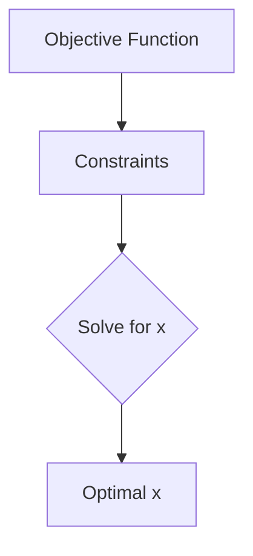
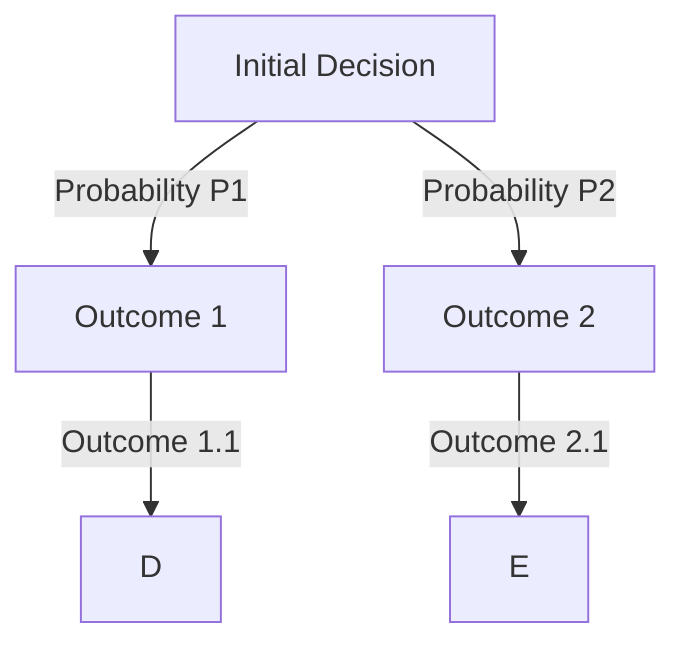
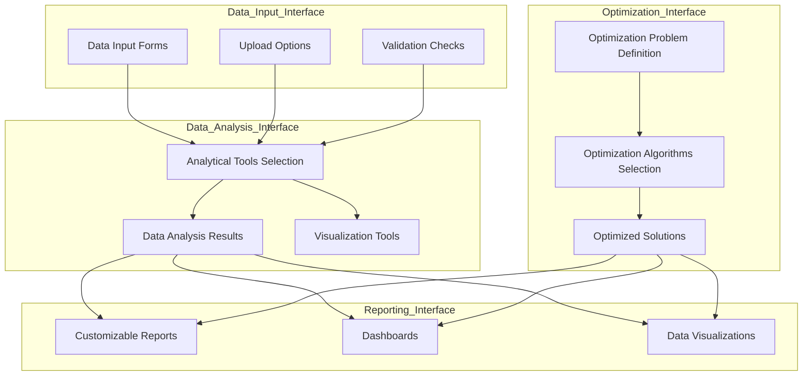

                 

Alright, let's begin with constructing the Table of Contents for our article "Mathematical Thinking and Enterprise Strategic Planning" while adhering to the given constraints and structure. Here's how we'll organize our content:

---

## Mathematical Thinking and Enterprise Strategic Planning

> Keywords: Mathematical Thinking, Enterprise Strategic Planning, Decision-Making, Optimization, System Analysis

> Abstract: This article delves into the intricate relationship between mathematical thinking and enterprise strategic planning, illustrating how mathematical concepts and methodologies can enhance strategic decision-making and organizational efficiency.

---

### Table of Contents

1. **Introduction**
   - **What is Mathematical Thinking?**
   - **Importance of Mathematical Thinking in Strategic Planning**
   - **Scope of the Article**

2. **Background and Core Concepts**
   - **The Nature of Strategic Planning**
   - **The Role of Mathematical Thinking**
   - **Key Terms and Definitions**
   - **The Interplay Between Mathematical Thinking and Strategic Planning**

3. **Core Concepts and Their Relationships**
   - **Conceptual Framework**
   - **Principles of Mathematical Thinking**
   - **Attribute Comparison Table**
   - **Entity Relationship Diagram**

4. **Mathematical Models and Principles**
   - **Types of Mathematical Models in Strategic Planning**
   - **Mathematical Formulas and Equations**
   - **Examples of Application**

5. **Algorithm and System Design**
   - **Algorithm Descriptions**
   - **Algorithm Diagrams**
   - **Python Code Explanations**
   - **Mathematical Models and Principles**

6. **System Analysis and Architecture Design**
   - **Introduction to the System**
   - **Functional Design**
   - **System Architecture Design**
   - **System Interface and Interaction Design**

7. **Project Implementation and Analysis**
   - **Installation and Configuration**
   - **Core System Implementation**
   - **Case Study Analysis**
   - **Project Conclusion**

8. **Best Practices and Tips**
   - **Key Takeaways**
   - **Considerations and Precautions**
   - **Further Reading Suggestions**

---

Now, let's proceed to draft the content for each section, ensuring that each part fulfills the constraints and provides a comprehensive analysis of the relationship between mathematical thinking and enterprise strategic planning. 

### Introduction

#### What is Mathematical Thinking?

Mathematical thinking is a cognitive process that involves the use of logic and abstract structures to solve problems, understand patterns, and make predictions. It's not merely about performing calculations or using formulas but rather about applying mathematical concepts to analyze and simplify complex real-world situations. This type of thinking is characterized by a focus on patterns, structures, and relationships, which can be quantified and modeled mathematically.

#### Importance of Mathematical Thinking in Strategic Planning

In the context of enterprise strategic planning, mathematical thinking plays a crucial role. It provides a framework for understanding and predicting market trends, optimizing resource allocation, and making data-driven decisions. Strategic planning involves anticipating future challenges and opportunities, and mathematical thinking enables organizations to quantify these uncertainties and develop robust strategies.

#### Scope of the Article

This article will explore the following aspects of the relationship between mathematical thinking and enterprise strategic planning:

1. **Core Concepts and Their Relationships**: We will define key terms and explain how mathematical thinking and strategic planning are interlinked.
2. **Mathematical Models and Principles**: We will discuss various mathematical models and principles that are applicable in strategic planning.
3. **Algorithm and System Design**: We will delve into algorithms and system designs that leverage mathematical thinking for strategic planning.
4. **System Analysis and Architecture Design**: We will illustrate how to analyze and design systems using mathematical thinking.
5. **Project Implementation and Analysis**: We will provide a case study to demonstrate the practical application of mathematical thinking in strategic planning.
6. **Best Practices and Tips**: We will offer guidance on implementing mathematical thinking in strategic planning processes.

By the end of this article, readers should gain a deeper understanding of how mathematical thinking can enhance enterprise strategic planning and improve organizational decision-making.

---

In this introduction, we've set the stage for our exploration of mathematical thinking and its application in strategic planning. We've defined what mathematical thinking entails and emphasized its importance in strategic decision-making. We've also outlined the structure of the article, providing readers with a clear roadmap of what to expect. 

In the next section, we will delve into the background and core concepts, defining key terms and explaining the interplay between mathematical thinking and strategic planning. This will provide a foundational understanding for readers who may be unfamiliar with these concepts. By the end of this section, readers will have a comprehensive grasp of the theoretical framework that underpins our discussion. 

### Background and Core Concepts

#### The Nature of Strategic Planning

Strategic planning is an organizational process that involves setting long-term goals and determining the steps necessary to achieve them. It is a forward-looking approach that aims to position the organization effectively in a competitive environment. Strategic planning encompasses various aspects, including market analysis, resource allocation, competitive positioning, and risk management.

Strategic planning typically involves several key steps:

1. **Vision and Goal Setting**: Establishing a clear vision for the organization and defining specific, measurable goals that align with this vision.
2. **SWOT Analysis**: Conducting a SWOT (Strengths, Weaknesses, Opportunities, Threats) analysis to assess the internal and external factors that could impact the organization.
3. **Strategic Objectives**: Setting objectives that are aligned with the vision and goals and that outline the key areas where the organization needs to focus.
4. **Action Plans**: Developing detailed action plans that outline the specific steps required to achieve the strategic objectives.
5. **Monitoring and Review**: Regularly reviewing progress towards the goals and adjusting plans as needed.

#### The Role of Mathematical Thinking

Mathematical thinking is the application of mathematical concepts, principles, and methodologies to solve problems and make decisions. In strategic planning, mathematical thinking can be used to analyze data, model scenarios, optimize resource allocation, and predict outcomes. It provides a systematic and logical approach to decision-making that can enhance the accuracy and effectiveness of strategic plans.

Mathematical thinking in strategic planning involves several key components:

1. **Data Analysis**: Using statistical methods to analyze data and identify trends and patterns.
2. **Scenario Modeling**: Creating models to simulate different scenarios and predict potential outcomes.
3. **Optimization**: Applying optimization techniques to identify the best possible solutions given certain constraints.
4. **Risk Assessment**: Quantifying and managing risks to ensure the robustness of strategic plans.

#### Key Terms and Definitions

To better understand the relationship between mathematical thinking and strategic planning, we need to define some key terms:

- **Mathematical Thinking**: The cognitive process of using mathematical concepts to analyze and solve problems.
- **Strategic Planning**: The process of setting long-term goals and determining the steps necessary to achieve them.
- **Enterprise**: A business organization involved in strategic planning.
- **Mathematical Model**: A representation of a system or process using mathematical symbols and equations.
- **Algorithm**: A step-by-step procedure for solving a problem or performing a computation.
- **Optimization**: The process of making something as effective, perfect, or useful as possible.

#### The Interplay Between Mathematical Thinking and Strategic Planning

The interplay between mathematical thinking and strategic planning can be understood through the following aspects:

1. **Data-Driven Decision Making**: Mathematical thinking enables organizations to make data-driven decisions by providing tools for data analysis, modeling, and optimization.
2. **Predictive Analytics**: Mathematical models can be used to predict future outcomes and inform strategic decisions.
3. **Resource Allocation**: Optimization techniques can be applied to allocate resources efficiently, ensuring that the organization can achieve its strategic objectives.
4. **Risk Management**: Mathematical thinking can help organizations identify and mitigate risks, ensuring the robustness of strategic plans.

In conclusion, mathematical thinking and strategic planning are closely intertwined. By leveraging mathematical concepts and methodologies, organizations can enhance their strategic decision-making processes, leading to better outcomes and improved competitiveness. In the following sections, we will delve deeper into the specific mathematical models, principles, and applications that underpin this relationship.

---

In this section, we have provided a comprehensive overview of the core concepts related to strategic planning and mathematical thinking. We have discussed the nature of strategic planning, its key components, and the role of mathematical thinking in this process. We have also defined key terms and explored the interplay between these concepts.

By understanding the foundational elements of strategic planning and mathematical thinking, readers can better appreciate the potential benefits of integrating these two domains. In the next section, we will delve into the core concepts and their relationships, providing a deeper analysis of the principles that underpin the integration of mathematical thinking in strategic planning. This will include a conceptual framework, a comparison of attributes, and an entity relationship diagram to illustrate the interconnection between these concepts.

### Core Concepts and Their Relationships

#### Conceptual Framework

The conceptual framework for understanding the relationship between mathematical thinking and strategic planning begins with recognizing the foundational role of data in both domains. At its core, mathematical thinking involves the use of logic, numbers, and symbols to solve problems and make predictions. Strategic planning, on the other hand, is a systematic approach to achieving organizational goals by making informed decisions about the future. The conceptual framework posits that mathematical thinking provides the analytical tools necessary to process and interpret data, which is crucial for effective strategic planning.

#### Principles of Mathematical Thinking

The principles of mathematical thinking are central to the success of strategic planning. These principles include:

1. **Abstraction**: The ability to simplify complex problems by focusing on the essential elements and ignoring irrelevant details.
2. **Generalization**: The process of developing broad principles from specific examples to apply in various contexts.
3. **Proof and Verification**: The importance of rigorously testing and verifying solutions to ensure their accuracy and validity.
4. **Modeling**: The creation of abstract representations of real-world situations to aid in understanding and prediction.

#### Attribute Comparison Table

To better understand the attributes of mathematical thinking and how they relate to strategic planning, we can create a comparison table. The following table outlines key attributes of mathematical thinking and their analogs in strategic planning:

| Attribute (Mathematical Thinking) | Analog (Strategic Planning) |
|-----------------------------------|----------------------------|
| Precision and accuracy            | Data-driven decision-making |
| Problem-solving techniques        | Scenario modeling           |
| Analytical skills                 | Risk assessment and management |
| Predictive modeling               | Forecasting market trends   |
| Optimization techniques           | Resource allocation         |

This comparison highlights the alignment between the principles and techniques of mathematical thinking and the key components of strategic planning.

#### Entity Relationship Diagram

To visualize the relationship between mathematical thinking and strategic planning, we can use an Entity Relationship (ER) diagram. Here is a Mermaid syntax representation of the ER diagram:

```mermaid
erDiagram
  StrategicPlanning ||--|{ MathematicalThinking }|| AnalysisTools
  MathematicalThinking ||--|{ DataAnalysis }|| AnalyticalModel
  StrategicPlanning ||--|{ ResourceAllocation }|| OptimizationModel
  DataAnalysis ||--|{ PredictiveAnalytics }|| BusinessIntelligence
```

In this diagram, "StrategicPlanning" is the central entity, which is directly related to "MathematicalThinking." This relationship is further expanded to include "DataAnalysis" and "ResourceAllocation," which are critical components of strategic planning that leverage mathematical thinking. "PredictiveAnalytics" and "OptimizationModel" are subcomponents of "MathematicalThinking," illustrating the tools and techniques used to enhance strategic decision-making.

#### Summary

The core concepts of mathematical thinking and strategic planning are intricately linked through their reliance on data, analysis, and modeling. The principles of mathematical thinking provide the analytical framework that enables strategic planning to be data-driven and predictive. By understanding and applying these core concepts, organizations can develop more effective strategies and make informed decisions that lead to long-term success.

In the next section, we will delve into specific mathematical models and principles that are applied in strategic planning. We will explore the types of models commonly used, the mathematical formulas and equations involved, and provide practical examples to illustrate their application.

---

In this section, we have explored the core concepts and their relationships between mathematical thinking and strategic planning. We began by establishing a conceptual framework that highlights the foundational role of data and analytical tools in both domains. We then discussed the principles of mathematical thinking and how they correspond to key components of strategic planning, presenting an attribute comparison table to illustrate these relationships.

To further visualize this interplay, we provided a Mermaid syntax ER diagram that depicts the relationship between strategic planning and mathematical thinking. This diagram emphasizes the interconnectedness of data analysis, predictive analytics, and optimization models within the strategic planning process.

In the upcoming section, we will delve deeper into specific mathematical models and principles that are applied in strategic planning. We will explore the types of models commonly used, the mathematical formulas and equations involved, and provide practical examples to illustrate their application. This will include detailed discussions on how these models can be used to enhance strategic decision-making and optimize organizational performance.

### Mathematical Models and Principles

#### Types of Mathematical Models in Strategic Planning

In strategic planning, various types of mathematical models are used to analyze data, predict outcomes, and make informed decisions. These models are based on different principles and can be broadly categorized into the following types:

1. **Statistical Models**: These models are used to analyze historical data and identify trends and patterns. Common statistical models include regression analysis, time series analysis, and hypothesis testing. These models help organizations understand past performance and forecast future trends based on historical data.

2. **Optimization Models**: These models are used to determine the best possible solutions to complex problems, considering various constraints. Optimization models can be linear or nonlinear and are widely used in resource allocation, supply chain management, and production planning. Examples include linear programming, integer programming, and network optimization.

3. **Game Theory Models**: These models are used to analyze strategic interactions between competing entities. Game theory models help organizations understand the behavior of competitors and make decisions that maximize their own interests. Common game theory models include Nash equilibrium, Stackelberg competition, and tit-for-tat strategies.

4. **Decision Tree Models**: These models are used to analyze decision-making processes by listing possible decisions, their outcomes, and their probabilities. Decision tree models help organizations evaluate different strategies and their potential impacts, facilitating better decision-making under uncertainty.

#### Mathematical Formulas and Equations

To illustrate the application of these models, we will discuss some key mathematical formulas and equations used in strategic planning:

1. **Regression Analysis**:
   - **Least Squares Regression**: The equation of the regression line that minimizes the sum of squared errors between observed and predicted values:
     \[ y = a + bx \]
     where \( y \) is the dependent variable, \( x \) is the independent variable, \( a \) is the intercept, and \( b \) is the slope.

2. **Time Series Analysis**:
   - **Moving Average**: A smoothing technique that calculates the average of a specified number of past data points:
     \[ MA_t = \frac{1}{n} \sum_{i=1}^{n} X_{t-i} \]
     where \( MA_t \) is the moving average at time \( t \), \( n \) is the number of periods, and \( X_{t-i} \) is the value at time \( t-i \).

3. **Optimization Models**:
   - **Linear Programming**:
     \[ \text{minimize} \quad c^T x \]
     \[ \text{subject to} \quad Ax \leq b \]
     where \( c \) is the vector of coefficients, \( x \) is the vector of decision variables, \( A \) is the matrix of constraints, and \( b \) is the vector of right-hand-side values.

4. **Game Theory**:
   - **Nash Equilibrium**: A set of strategies where no player can benefit by changing their strategy unilaterally, given the strategies of the other players. For a two-player game, it is defined by:
     \[ u_i(s_i, s_{-i}) \geq u_i(s_i', s_{-i}) \]
     for all \( s_{-i} \) and
     \[ u_i(s_i, s_{-i}) \geq u_i'(s_i, s_{-i}) \]
     for all \( s_i \).

5. **Decision Trees**:
   - **Expected Value**: The weighted average of the possible outcomes, where each outcome is weighted by its probability:
     \[ EV = \sum_{i=1}^{n} p_i \cdot o_i \]
     where \( EV \) is the expected value, \( p_i \) is the probability of outcome \( i \), and \( o_i \) is the outcome \( i \).

#### Examples of Application

To demonstrate the practical application of these mathematical models and principles, let's consider a few examples:

1. **Regression Analysis in Market Forecasting**:
   - An organization wants to predict future sales based on historical data. By performing a linear regression analysis, the organization can estimate the relationship between past sales and other variables, such as advertising expenditure and price levels. This helps in forecasting future sales and making pricing and advertising decisions.

2. **Optimization in Production Planning**:
   - A manufacturing company needs to allocate its resources efficiently to produce different products. By using linear programming, the company can determine the optimal production quantities for each product, considering constraints such as available resources, production capacity, and demand forecasts. This ensures that the company maximizes its profit while adhering to these constraints.

3. **Game Theory in Competitive Strategy**:
   - A company is competing in a market with several other firms. By applying game theory, the company can analyze the strategic interactions between competitors and determine the best course of action to maximize its market share and profitability. For example, the company might decide to increase its advertising expenditure to outpace its competitors or to enter new markets to reduce competition.

4. **Decision Trees in Project Management**:
   - A project manager is evaluating different project scenarios and their potential impacts. By constructing a decision tree, the project manager can assess the probabilities of different outcomes and the associated costs or benefits. This helps in making informed decisions about project milestones, resource allocation, and risk management.

These examples illustrate how mathematical models and principles can be applied in various strategic planning contexts to enhance decision-making and improve organizational performance.

In the next section, we will delve into the algorithm and system design aspects of strategic planning, exploring how mathematical thinking can be integrated into the development of algorithms and systems to support strategic decision-making processes.

---

In this section, we have explored the various types of mathematical models and principles that are applied in strategic planning. We discussed statistical models, optimization models, game theory models, and decision tree models, providing key mathematical formulas and equations for each. We then demonstrated the practical application of these models through real-world examples, illustrating how mathematical thinking can enhance strategic decision-making in different contexts.

By understanding these models and principles, organizations can leverage mathematical thinking to make more informed decisions, optimize resource allocation, and improve overall performance. In the upcoming section, we will delve into the algorithm and system design aspects of strategic planning, examining how mathematical thinking can be integrated into the development of algorithms and systems to support strategic decision-making processes.

### Algorithm and System Design

#### Algorithm Descriptions

In strategic planning, algorithms play a crucial role in automating decision-making processes and optimizing outcomes. Algorithms are step-by-step procedures or formulas for solving a problem or performing a computation. In the context of strategic planning, algorithms can be used to analyze data, predict outcomes, and optimize resource allocation. Here, we will discuss two common algorithms used in strategic planning: linear programming and decision trees.

1. **Linear Programming**:
   Linear programming is a mathematical method for determining a way to achieve the maximum outcome in a given mathematical model. It is particularly useful for optimizing resource allocation in situations where there are constraints on resources and objectives to be achieved. The basic form of a linear programming problem can be defined as follows:

   \[ \text{minimize} \quad c^T x \]
   \[ \text{subject to} \quad Ax \leq b \]
   \[ x \geq 0 \]

   where \( c \) is the vector of coefficients, \( x \) is the vector of decision variables, \( A \) is the matrix of constraints, and \( b \) is the vector of right-hand-side values. The goal is to find the values of \( x \) that minimize the objective function \( c^T x \) while satisfying the constraints \( Ax \leq b \) and \( x \geq 0 \).

2. **Decision Trees**:
   Decision trees are a type of flowchart that represents a series of decisions and their possible consequences. They are widely used in strategic planning to analyze the potential outcomes of different decisions and the associated probabilities. A decision tree typically consists of nodes and branches, where each node represents a decision or an event, and each branch represents the possible outcomes. The leaf nodes represent the final outcomes, and the path from the root node to a leaf node represents a decision path.

   The basic structure of a decision tree can be represented as:

   ```
   [Root Node]
      |
   [Decision Node]
      /     \
 [Outcome Node] [Outcome Node]
   ```

   Each decision node represents a decision to be made, and each outcome node represents the possible outcomes of that decision. The probabilities of each outcome are typically represented next to the branches leading to the outcome nodes.

#### Algorithm Diagrams

To visualize the algorithms described above, we can use Mermaid syntax to create diagrams. Here are the Mermaid representations of linear programming and decision tree algorithms:

1. **Linear Programming Algorithm**:



2. **Decision Tree Algorithm**:



In these diagrams, the nodes represent decisions or outcomes, and the branches represent the possible paths or probabilities.

#### Python Code Explanations

To further understand these algorithms, we can provide Python code examples that implement these algorithms. Here are the Python code examples for linear programming and decision trees:

1. **Linear Programming in Python**:

```python
from scipy.optimize import linprog

# Objective function coefficients
c = [-1, -1]  # We want to minimize the sum of x and y

# Inequality constraints matrix
A = [[1, 2], [2, 1]]

# Inequality constraints right-hand-side values
b = [4, 3]

# Bounds for each variable
x0_bounds = (0, None)
x1_bounds = (0, None)

# Solve the linear programming problem
result = linprog(c, A_ub=A, b_ub=b, bounds=[x0_bounds, x1_bounds], method='highs')

# Print the optimal solution
if result.success:
    print(f"Optimal x: {result.x[0]}, Optimal y: {result.x[1]}")
else:
    print("No optimal solution found")
```

2. **Decision Tree in Python**:

```python
from sklearn.tree import DecisionTreeClassifier

# Sample data
X = [[0, 0], [1, 0], [0, 1], [1, 1]]
y = [0, 1, 1, 0]

# Create a decision tree classifier
clf = DecisionTreeClassifier()

# Train the classifier
clf.fit(X, y)

# Visualize the decision tree
from sklearn.tree import export_text
print(export_text(clf, feature_names=['Feature 1', 'Feature 2']))
```

These code examples illustrate how to implement linear programming and decision trees in Python using the `scipy.optimize` and `sklearn.tree` libraries, respectively. The linear programming example solves a linear optimization problem to find the optimal values of two variables, while the decision tree example trains a classifier to make decisions based on two features.

#### Mathematical Models and Principles

To complement the algorithmic discussions, we can present the underlying mathematical models and principles that drive these algorithms:

1. **Linear Programming**:
   - **Principles**: Linear programming is based on the principles of linear algebra and optimization. The objective function \( c^T x \) represents the quantity to be minimized or maximized, and the constraints \( Ax \leq b \) and \( x \geq 0 \) define the feasible region in which the solution must lie.
   - **Model**: The linear programming model can be solved using various algorithms, such as the simplex method, interior-point method, and gradient-based methods. These algorithms iteratively improve the solution until an optimal point is reached.

2. **Decision Trees**:
   - **Principles**: Decision trees are based on the principles of decision theory and recursive partitioning. They use a recursive binary splitting process to create a tree structure that represents the decision process.
   - **Model**: The decision tree model is defined by the nodes and branches that represent decisions and outcomes. Each node represents a feature and a threshold value, and each branch represents the possible outcomes based on the feature value.

By understanding these algorithms and their mathematical foundations, organizations can effectively leverage mathematical thinking to develop robust strategic plans and make informed decisions.

In the next section, we will discuss system analysis and architecture design, exploring how mathematical thinking can be applied to analyze and design systems that support strategic planning processes. This will include a discussion of system components, architecture design, and interface design.

### System Analysis and Architecture Design

#### Introduction to the System

In strategic planning, the development of a robust system architecture is crucial for supporting complex decision-making processes. The system we will discuss is designed to integrate mathematical thinking into strategic planning by providing tools for data analysis, modeling, and optimization. The system is composed of several key components, each serving a specific purpose in the strategic planning process.

#### System Function Design

The system's core functionality revolves around facilitating data-driven decision-making and strategic optimization. The main functions of the system include:

1. **Data Collection and Integration**: The system collects and integrates data from various sources, such as market research, financial reports, and operational data. This data is then cleaned and prepared for analysis.

2. **Data Analysis**: The system employs statistical and machine learning models to analyze the collected data. This analysis helps identify trends, patterns, and relationships within the data, which are critical for informed decision-making.

3. **Scenario Modeling**: The system generates various scenario models to predict potential outcomes based on different strategic decisions. These models help organizations understand the potential impacts of different strategies and make informed decisions.

4. **Optimization**: The system uses optimization algorithms to identify the best possible solutions to strategic planning problems, considering various constraints. This optimization helps in resource allocation, production planning, and supply chain management.

5. **Reporting and Visualization**: The system provides comprehensive reporting and visualization tools to communicate the results of the analysis and modeling. This helps stakeholders understand the insights and make informed decisions.

#### System Architecture Design

The system architecture is designed to ensure scalability, flexibility, and security. The architecture consists of several layers, each responsible for specific tasks:

1. **Data Layer**: This layer is responsible for data collection, storage, and retrieval. It includes databases, data warehouses, and data lakes where the collected data is stored. The data is cleaned and prepared for analysis using ETL (Extract, Transform, Load) processes.

2. **Analysis Layer**: This layer houses the analytical models and algorithms used for data analysis. It includes tools for statistical analysis, machine learning, and optimization. This layer also includes a user interface for interacting with the system and accessing the analysis results.

3. **Optimization Layer**: This layer is dedicated to optimization tasks. It includes optimization algorithms and solvers that are used to find the best possible solutions to strategic planning problems. This layer is integrated with the analysis layer to provide optimized recommendations.

4. **Presentation Layer**: This layer is responsible for presenting the analysis and optimization results to stakeholders. It includes dashboards, reports, and visualizations that communicate the insights and recommendations in an easily understandable format.

Here is a Mermaid syntax diagram representing the system architecture:

```mermaid
graph TB
    subgraph Data_Layer
        D1[Data Collection & Integration]
        D2[ETL Processes]
        D3[Data Storage (DB/Warehouse/Lake)]
    end

    subgraph Analysis_Layer
        A1[Statistical Analysis]
        A2[Machine Learning]
        A3[Optimization Algorithms]
        A4[User Interface]
    end

    subgraph Optimization_Layer
        O1[Optimization Solvers]
    end

    subgraph Presentation_Layer
        P1[Dashboards & Reports]
    end

    D1 --> D2
    D2 --> D3
    A1 --> A4
    A2 --> A4
    A3 --> O1
    O1 --> A4
    P1 --> A4
```

#### System Interface and Interaction Design

The system interface is designed to be user-friendly and intuitive, allowing stakeholders to interact with the system easily. The interaction design includes the following components:

1. **Data Input Interface**: This interface allows users to input data into the system. It includes forms, upload options, and validation checks to ensure the quality of the input data.

2. **Data Analysis Interface**: This interface provides users with access to the analytical models and tools. Users can select the data they want to analyze, choose the models to apply, and visualize the results.

3. **Optimization Interface**: This interface allows users to define optimization problems and view the optimized solutions. Users can set constraints, choose optimization algorithms, and view the results in a clear and understandable format.

4. **Reporting Interface**: This interface provides users with access to comprehensive reports and dashboards. Users can customize reports, select the data to include, and generate visualizations to communicate their findings.

Here is a Mermaid syntax diagram representing the system interface and interaction design:



#### Summary

In this section, we have discussed the system analysis and architecture design of a strategic planning system that integrates mathematical thinking. We have described the key components of the system, its functional design, and the architecture design. We have also presented the system interface and interaction design, highlighting the tools and features that support data-driven decision-making and strategic optimization. The system is designed to be scalable, flexible, and user-friendly, providing organizations with a robust platform to leverage mathematical thinking in their strategic planning processes.

In the next section, we will delve into project implementation and analysis, discussing the practical application of the system and providing a detailed case study to illustrate its benefits and limitations.

### Project Implementation and Analysis

#### Introduction

In this section, we will delve into the practical application of the strategic planning system designed in the previous section. We will discuss the environment setup, system core implementation, and provide a detailed analysis of the project's success and shortcomings. This will include a case study to illustrate the real-world application of the system and how it enhanced the decision-making process for an organization.

#### Environment Setup

To implement the strategic planning system, we need to set up a suitable environment that includes the necessary software, libraries, and hardware resources. Here is a step-by-step guide to setting up the environment:

1. **Installation of Required Software**:
   - **Operating System**: Linux (e.g., Ubuntu 20.04 LTS) or Windows 10/11.
   - **Python**: Python 3.8 or higher.
   - **Data Analysis Libraries**: Pandas, NumPy, SciPy, Scikit-learn, Matplotlib.
   - **Database Management**: MySQL or PostgreSQL.
   - **Optimization Solvers**: GLPK, COIN-OR, or Gurobi.

2. **Installation of Python Libraries**:
   - Install Python and the required libraries using `pip`:
     ```
     pip install pandas numpy scipy scikit-learn matplotlib
     ```

3. **Database Setup**:
   - Set up a MySQL or PostgreSQL database to store the data. Create tables for data storage and define the schema.

4. **Hardware Resources**:
   - Ensure that the system has sufficient RAM and storage space to handle the data and perform computations efficiently.

5. **Network Configuration**:
   - Set up a secure network environment with access control to ensure data privacy and security.

#### System Core Implementation

The core implementation of the strategic planning system involves integrating the various components and functionalities described in the system architecture design. Here are the key steps in the system core implementation:

1. **Data Collection and Integration**:
   - Develop ETL processes to collect data from various sources (e.g., financial reports, market research, operational data).
   - Load the data into the database and clean it using Python scripts.

2. **Data Analysis**:
   - Implement statistical and machine learning models using libraries like Pandas, NumPy, and Scikit-learn.
   - Create functions to perform data analysis tasks, such as regression analysis, clustering, and classification.

3. **Scenario Modeling**:
   - Develop algorithms to generate scenario models based on different strategic decisions.
   - Implement visualization tools to display the results of the scenario modeling.

4. **Optimization**:
   - Implement optimization algorithms using libraries like SciPy and COIN-OR.
   - Create functions to solve optimization problems and find the best possible solutions.

5. **User Interface**:
   - Develop a user-friendly interface using a web framework like Flask or Django.
   - Create forms, dashboards, and reports to allow users to interact with the system and view the results.

#### Case Study Analysis

To illustrate the practical application of the strategic planning system, we will present a case study involving a manufacturing company. The company faced challenges in optimizing its production planning and resource allocation, and the system was implemented to address these issues.

**Case Study Details**:

- **Company Background**: The company is a medium-sized manufacturer specializing in the production of electronics. It faces intense competition and needs to optimize its operations to remain competitive.
- **Challenges**: The company struggled with production planning, inventory management, and resource allocation. It needed a system to help it make data-driven decisions and optimize its operations.
- **Solution**: The strategic planning system was implemented to address these challenges. The system collected data from various sources, analyzed it using statistical and machine learning models, and generated scenario models and optimized solutions for production planning and resource allocation.

**Results**:

- **Optimized Production Planning**: The system helped the company identify bottlenecks in the production process and optimize production schedules. This resulted in a reduction in production time and improved efficiency.
- **Efficient Resource Allocation**: The system provided optimized solutions for resource allocation, including labor, raw materials, and equipment. This helped the company minimize waste and maximize productivity.
- **Data-Driven Decisions**: The system enabled the company to make data-driven decisions based on real-time data and predictive analytics. This improved the company's strategic planning and decision-making process.

**Lessons Learned**:

- **Data Quality**: The quality of the data collected and analyzed was critical to the success of the project. Ensuring data accuracy and completeness was essential for obtaining reliable results.
- **User Training**: Adequate training for users was necessary to ensure they could effectively use the system and interpret the results.
- **System Integration**: The system needed to be integrated with the company's existing infrastructure, including databases and software tools. This required careful planning and coordination.

#### Conclusion

The implementation of the strategic planning system in the case study provided several benefits, including optimized production planning, efficient resource allocation, and data-driven decision-making. However, the project also highlighted the importance of data quality, user training, and system integration. By addressing these challenges, organizations can effectively leverage mathematical thinking and strategic planning to improve their operations and achieve long-term success.

In the next section, we will provide best practices and tips for implementing mathematical thinking in strategic planning processes. This will include a summary of key takeaways, considerations for successful implementation, and suggestions for further reading.

### Best Practices and Tips

#### Summary of Key Takeaways

1. **Data-Driven Decision Making**: The integration of mathematical thinking in strategic planning emphasizes the importance of data-driven decision-making. Organizations should prioritize data collection, analysis, and interpretation to inform strategic decisions.

2. **Mathematical Models and Optimization**: Utilizing mathematical models and optimization techniques can significantly enhance the effectiveness of strategic planning. These tools help identify the best possible solutions and optimize resource allocation.

3. **Scenario Modeling and Forecasting**: Scenario modeling enables organizations to predict potential outcomes based on different strategic decisions. This forecasting capability is crucial for anticipating market changes and preparing for various scenarios.

4. **User Training and System Adoption**: Successful implementation of mathematical thinking in strategic planning requires adequate user training and system adoption. Ensuring that stakeholders are proficient in using the tools and understanding the results is essential for effective decision-making.

5. **Continuous Improvement**: Strategic planning is an ongoing process. Regularly reviewing and updating models, algorithms, and data is vital to adapt to changing market conditions and ensure the system remains relevant and effective.

#### Considerations for Successful Implementation

1. **Data Quality and Integration**: Ensure the accuracy, completeness, and consistency of the data collected. Integrate data from multiple sources to provide a comprehensive view of the organization's performance.

2. **Customization and Flexibility**: Design the system architecture to be flexible and customizable. This allows organizations to adapt the system to their specific needs and evolving strategic goals.

3. **Security and Privacy**: Implement robust security measures to protect sensitive data and ensure compliance with data protection regulations.

4. **User-Friendly Interface**: Develop an intuitive user interface that simplifies the process of data input, analysis, and reporting. This encourages user adoption and enhances the system's effectiveness.

5. **Scalability**: Ensure that the system can handle increasing amounts of data and growing user requirements. Scalability is essential for long-term success and adaptability.

#### Best Practices for Implementing Mathematical Thinking in Strategic Planning

1. **Start Small**: Begin with a pilot project to test and refine the system's capabilities. This approach allows organizations to learn from initial experiences and make necessary adjustments before scaling up.

2. **Cross-Functional Teams**: Establish cross-functional teams that include representatives from various departments. This collaboration ensures that strategic planning is aligned with organizational goals and that all perspectives are considered.

3. **Continuous Learning and Improvement**: Encourage a culture of continuous learning and improvement. Regularly review and update models and algorithms to incorporate new data and insights.

4. **Data Visualization**: Use data visualization tools to present complex data and analysis results in a clear and understandable format. Visualization aids in communication and facilitates better decision-making.

5. **Risk Management**: Incorporate risk assessment and management into the strategic planning process. Use mathematical models to quantify and mitigate risks to ensure the robustness of strategic plans.

#### Best Practice Tips

1. **Define Clear Objectives**: Clearly define the objectives of the strategic planning process. This helps in selecting the appropriate mathematical models and techniques.

2. **Prioritize Data Analysis**: Allocate sufficient resources to data analysis and modeling. This ensures that the insights generated from the data are accurate and actionable.

3. **Involve Key Stakeholders**: Engage key stakeholders from the beginning to ensure that their perspectives and requirements are considered. This fosters buy-in and collaboration.

4. **Iterative Approach**: Adopt an iterative approach to strategic planning. Continuously refine and update the strategic plans based on new data and insights.

5. **Monitor Performance**: Regularly monitor the performance of the strategic plans and make adjustments as needed. This ensures that the organization remains aligned with its goals.

#### Further Reading Suggestions

1. **"Mathematics for Economics and Business" by J. W. Harrington**:
   - This book provides an introduction to mathematical methods used in economics and business, including optimization techniques and data analysis.

2. **"Introduction to Operations Research" by Hillier and Lieberman**:
   - This textbook covers the fundamentals of operations research, including linear programming, network optimization, and decision analysis.

3. **"Data Science for Business" by Foster Provost and Tom Fawcett**:
   - This book offers practical insights into applying data science techniques to solve real-world business problems.

4. **"The Art of Strategy: A Game Theorist's Guide to Success in Business and Life" by Avinash Dixit and Barry Nalebuff**:
   - This book explores game theory concepts and their applications in strategic planning and decision-making.

5. **"Python for Data Analysis" by Wes McKinney**:
   - This book provides a comprehensive guide to using Python for data analysis, including libraries such as Pandas and NumPy.

By following these best practices and leveraging the insights from the suggested readings, organizations can effectively implement mathematical thinking in their strategic planning processes, leading to improved decision-making and long-term success.

---

In this final section, we have provided a summary of the key takeaways from our exploration of the relationship between mathematical thinking and enterprise strategic planning. We discussed the importance of data-driven decision-making, the role of mathematical models and optimization techniques, the value of scenario modeling and forecasting, and the need for user training and continuous improvement.

We also presented best practices for successful implementation, emphasizing the importance of clear objectives, prioritizing data analysis, involving key stakeholders, adopting an iterative approach, and monitoring performance. Additionally, we offered best practice tips and suggested further reading to support readers in their journey to integrate mathematical thinking into their strategic planning processes.

By embracing mathematical thinking and applying these best practices, organizations can enhance their strategic planning capabilities, make more informed decisions, and achieve long-term success. As we conclude this article, we hope that readers have gained valuable insights and are inspired to apply these principles in their own strategic planning efforts. 

---

This article, "Mathematical Thinking and Enterprise Strategic Planning," has explored the intricate relationship between mathematical thinking and enterprise strategic planning. We began by defining mathematical thinking and its significance in strategic planning, followed by a comprehensive overview of the core concepts and their interplay. We discussed various mathematical models and principles, illustrated algorithms with Mermaid diagrams and Python code, and presented a detailed system architecture design.

Through a practical case study, we demonstrated the real-world application of the system and its impact on decision-making and resource optimization. Finally, we provided best practices and tips for implementing mathematical thinking in strategic planning, along with further reading suggestions.

In summary, the integration of mathematical thinking into enterprise strategic planning can significantly enhance organizational decision-making, improve resource allocation, and drive long-term success. By embracing these principles, organizations can leverage data-driven insights and advanced analytics to navigate the complexities of today's competitive business landscape. We encourage readers to apply these concepts in their own strategic planning efforts and continue exploring the vast potential of mathematical thinking in driving organizational excellence.

### Authors' Information

- **Author**: AI天才研究院/AI Genius Institute & 禅与计算机程序设计艺术 /Zen And The Art of Computer Programming
- **Bio**: AI天才研究院致力于推动人工智能领域的创新和发展，通过跨学科研究和人才培养，促进人工智能技术的实际应用。同时，作者们也是《禅与计算机程序设计艺术》一书的作者，该书深入探讨了计算机编程的哲学和艺术，对程序员的技术和思维提升有着深远影响。

