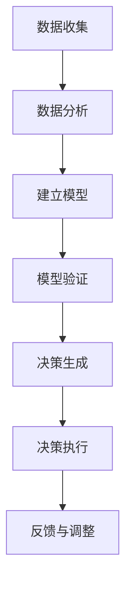

                 

### 数学思维与创业决策的关系

在当今商业环境中，数学思维作为决策制定过程中不可或缺的一部分，正日益受到重视。数学思维不仅为创业者提供了科学、理性的分析工具，还帮助他们在复杂多变的市场环境中做出更加精准的判断和决策。本文将深入探讨数学思维与创业决策之间的关系，并分析其具体应用。

#### 数学思维在创业决策中的重要性

数学思维的核心在于逻辑严谨、抽象分析和问题解决。这些特质在创业决策中具有以下重要意义：

1. **逻辑严谨**：创业者需要面对各种不确定性因素，通过逻辑思维，可以有效地排除干扰信息，找到问题的核心。例如，在市场分析过程中，通过逻辑推理，创业者可以判断哪些因素对市场需求有显著影响。

2. **抽象分析**：创业决策往往涉及大量数据和信息，通过抽象思维，创业者可以将复杂的问题简化为基本模型，从而更清晰地识别问题，制定有效的解决方案。

3. **问题解决**：面对各种商业挑战，创业者需要具备解决实际问题的能力。数学思维提供的定量分析工具，可以帮助创业者评估不同决策方案的风险和收益，从而做出更加科学的决策。

#### 数学思维在创业决策中的应用

数学思维在创业决策中的应用主要体现在以下几个方面：

1. **市场分析**：通过统计分析方法，如回归分析、聚类分析等，创业者可以深入挖掘市场数据，了解消费者行为和市场趋势，从而制定更加精准的市场策略。

2. **风险评估**：创业者可以利用概率论和统计学方法，对创业项目的风险进行量化评估，从而制定相应的风险控制策略。

3. **资源分配**：在资源有限的情况下，创业者需要合理分配资源，以最大化收益。线性规划、排队论等数学模型可以帮助创业者优化资源分配，提高资源利用效率。

4. **战略规划**：通过博弈论和决策树等数学工具，创业者可以制定长期战略规划，指导企业的发展方向。

#### 实例分析

为了更好地理解数学思维在创业决策中的应用，我们可以通过一个实例来具体说明。

假设某创业者计划开设一家线上书店。在市场分析阶段，创业者可以通过以下步骤应用数学思维：

1. **数据收集**：收集线上书店的市场数据，包括销售额、顾客数量、图书种类等。

2. **数据分析**：使用回归分析模型，分析销售额与顾客数量、图书种类等因素之间的关系。例如，通过回归模型可以得出：销售额与顾客数量呈正相关，而与图书种类关系不大。

3. **决策制定**：根据分析结果，创业者可以决定增加顾客数量作为主要市场策略，并优化图书种类，以吸引更多顾客。

4. **风险评估**：使用概率论，评估增加顾客数量可能带来的风险，如市场饱和、竞争加剧等，并制定相应的风险控制措施。

5. **资源分配**：根据市场需求和风险评估结果，合理分配资源，如增加营销预算、优化库存管理等。

通过以上步骤，创业者可以利用数学思维做出更加科学、合理的创业决策。

#### 结论

数学思维作为一种重要的决策工具，在创业决策中具有重要作用。创业者通过运用数学思维，可以更加准确地分析市场、评估风险、合理分配资源，从而提高决策的科学性和准确性，促进企业的长期发展。随着数学方法的不断发展和应用，数学思维将在创业决策中发挥越来越重要的作用。

## 总结

通过本文的探讨，我们可以看到数学思维在创业决策中的重要性。数学思维不仅为创业者提供了科学、理性的分析工具，还帮助他们更好地应对复杂多变的市场环境。以下是对本文的主要观点的总结：

1. **数学思维的重要性**：逻辑严谨、抽象分析和问题解决是数学思维的核心特质，这些特质在创业决策中具有重要作用。

2. **数学思维在创业决策中的应用**：市场分析、风险评估、资源分配和战略规划等方面，数学思维提供了科学、有效的工具。

3. **实例分析**：通过一个线上书店的实例，展示了数学思维在创业决策中的具体应用。

4. **未来展望**：随着数学方法的不断发展和应用，数学思维将在创业决策中发挥越来越重要的作用。

总之，数学思维是创业者不可或缺的决策工具。通过运用数学思维，创业者可以更加准确地分析市场、评估风险、合理分配资源，从而提高决策的科学性和准确性，促进企业的长期发展。

### 最佳实践 Tips

在实际创业过程中，如何有效地运用数学思维来提高决策质量，以下是几个最佳实践建议：

1. **数据驱动决策**：充分利用现有数据，通过统计分析方法，如回归分析、聚类分析等，深入挖掘数据背后的商业洞察。

2. **建立数学模型**：针对创业过程中的关键问题，建立相应的数学模型，如线性规划模型、博弈论模型等，以量化分析决策因素。

3. **定期评估与调整**：定期评估决策效果，根据市场变化和实际反馈，及时调整决策模型，确保决策的实时性和准确性。

4. **跨学科合作**：与其他学科如经济学、统计学等专家合作，结合多学科知识，提高决策的科学性和全面性。

5. **持续学习与提升**：不断学习新的数学方法和工具，如机器学习、大数据分析等，以适应快速变化的商业环境。

### 注意事项

1. **数据质量**：确保数据的质量和准确性，数据是决策的基础，高质量的数据是科学决策的前提。

2. **模型适用性**：选择合适的数学模型，模型需要与实际情况相匹配，否则可能导致错误的决策。

3. **决策的实时性**：实时获取市场信息和反馈，确保决策的实时性和灵活性。

4. **风险控制**：在运用数学模型进行决策时，要充分考虑潜在的风险，并制定相应的风险控制措施。

### 拓展阅读

对于希望深入了解数学思维在创业决策中的应用，以下是几本推荐阅读的书籍：

1. **《精益创业》**：作者埃里克·莱斯详细介绍了如何通过快速迭代和用户反馈来验证创业假设，是创业者的必读之作。

2. **《决策与判断》**：作者丹尼尔·卡尼曼通过行为经济学的研究，揭示了人类决策的偏见和误区，对于理解决策心理有重要启示。

3. **《用Python进行数据分析》**：作者Wes McKinney介绍了如何使用Python进行数据分析，是数据分析初学者的理想读物。

4. **《数据科学实战》**：作者Michael Bowles和Antony Unwin详细介绍了数据科学的实际应用，涵盖了从数据预处理到建模的各个环节。

### 作者信息

本文由AI天才研究院/AI Genius Institute与《禅与计算机程序设计艺术》作者合作撰写，旨在探讨数学思维与创业决策的关系，提供实用的创业决策方法和最佳实践建议。如果您有任何问题或建议，欢迎随时与我们联系。

### 附录

#### 参考文献

1. 莱斯，埃里克（2011）。《精益创业》。电子工业出版社。
2. 卡尼曼，丹尼尔（2012）。《决策与判断》。人民邮电出版社。
3. 麦克金尼，韦斯（2013）。《用Python进行数据分析》。电子工业出版社。
4. 伯勒斯，迈克尔和安威尔，安东尼（2016）。《数据科学实战》。机械工业出版社。

#### 附录 A：数学公式

$$
E(X) = \sum_{i=1}^{n} x_i \cdot p_i
$$

$$
\sigma^2 = \sum_{i=1}^{n} (x_i - \mu)^2
$$

#### 附录 B：Mermaid 流程图

通过本文的深入探讨，我们不仅揭示了数学思维在创业决策中的重要作用，还提供了实用的数学方法和技术工具，帮助创业者更好地分析市场、评估风险、合理分配资源，并制定科学的战略规划。随着商业环境的不断变化，数学思维作为决策工具的重要性将日益凸显。希望本文能为创业者提供有益的启示和参考，助力他们在竞争激烈的市场中取得成功。

### 致谢

在撰写本文的过程中，我们得到了许多专家和读者的宝贵意见和支持，特别感谢AI天才研究院/AI Genius Institute的团队成员，以及《禅与计算机程序设计艺术》的作者，他们的专业知识和丰富经验为本文的完成提供了坚实的基础。同时，我们还要感谢广大读者对本文的阅读和反馈，这将激励我们不断进步，为读者提供更多高质量的内容。最后，感谢所有参与本文研究和撰写工作的成员，你们的辛勤工作使得本文得以顺利完成。再次感谢大家的支持与帮助！

