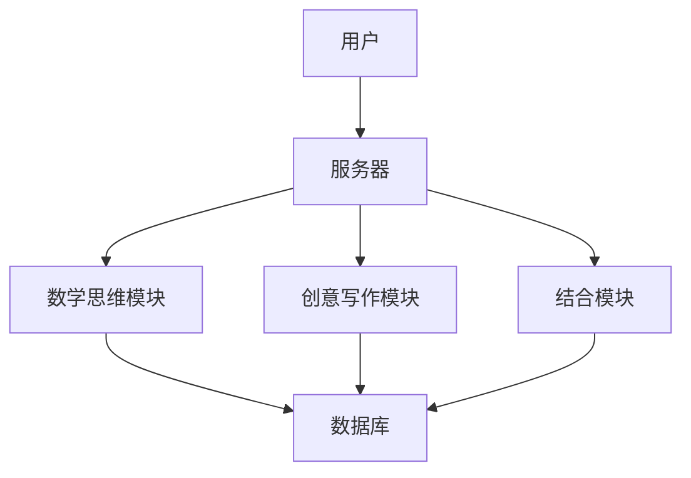
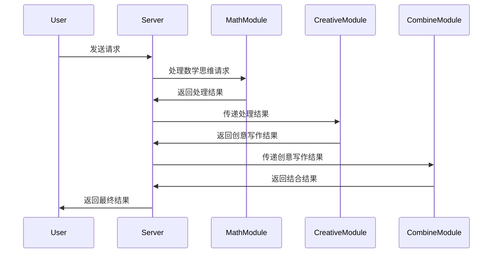

                 


### 文章标题

**数学思维与创意写作技巧的关系：深度剖析与实战指南**

### 关键词

数学思维、创意写作、关系分析、算法应用、系统架构设计

### 摘要

本文深入探讨了数学思维与创意写作技巧之间的关系，通过系统化的分析，揭示了两者在逻辑结构、创新表达和问题解决中的内在联系。文章首先介绍了数学思维和创意写作的基本概念，随后通过对比分析、算法讲解和实际案例，展示了如何将数学思维应用于创意写作中，以及创意写作技巧如何助力数学思维的发展。文章结构紧凑，逻辑清晰，旨在为读者提供一部既有理论深度又具备实战价值的技术博客。

## 第一部分：背景介绍

### 1.1 问题背景

#### 1.1.1 数学思维的定义与作用

数学思维是一种基于逻辑和抽象的能力，它强调通过量化、推理和建模来解决问题。数学思维不仅仅是数学家所需的技能，它在各个领域都有广泛的应用。例如，在工程学中，数学思维用于分析和设计；在计算机科学中，它被用来构建算法和系统。

#### 1.1.2 创意写作的概念与发展

创意写作是指通过文字表达原创性想法和情感的过程。它不仅仅是一种文学活动，更是一种思维方式。随着互联网和多媒体的发展，创意写作逐渐渗透到商业、娱乐和科技等领域，成为重要的表达和沟通工具。

#### 1.1.3 数学思维与创意写作的交汇点

数学思维与创意写作在逻辑推理、抽象思维和问题解决上有许多相似之处。它们都是通过结构化的方法来探索和表达复杂信息，因此在某些场景下可以相互补充，形成新的创新模式。

### 1.2 问题描述

#### 1.2.1 当前数学思维与创意写作教学的现状

目前，数学思维和创意写作在很多教育体系中都是独立教学的。虽然两者都有广泛的应用价值，但缺乏有效的结合和整合，导致学生在实际应用中难以发挥两者的优势。

#### 1.2.2 存在的问题与挑战

主要问题包括：教学内容的分割、教学方法的不一致以及缺乏跨学科的教学模式。这些问题限制了学生创新能力和逻辑思维的发展。

#### 1.2.3 解决方案的意义与目标

本文旨在通过分析和探讨数学思维与创意写作的结合，提出一套综合性的教学方案，以解决当前存在的问题，提升学生的逻辑思维和创意表达能力。

### 1.3 问题解决

#### 1.3.1 探索数学思维与创意写作结合的方法

本文将介绍如何将数学思维的方法应用于创意写作中，例如使用数学模型来构建故事情节、用逻辑推理来设计文本结构等。

#### 1.3.2 理论框架的建立

通过建立理论框架，本文将详细阐述数学思维与创意写作的结合原理，为后续研究和实践提供理论基础。

#### 1.3.3 实证研究的开展

本文将结合实际案例，通过实证研究验证数学思维与创意写作结合的有效性。

### 1.4 边界与外延

#### 1.4.1 数学思维在创意写作中的边界

数学思维在创意写作中的应用有一定的限制，不能完全取代创意写作的本质。例如，数学模型不能完全表达人类的情感和想象力。

#### 1.4.2 创意写作对数学思维的要求

创意写作需要数学思维的支持，但过度依赖数学思维会影响创意的自由性和多样性。

#### 1.4.3 两者结合的可能性与限制

数学思维与创意写作的结合具有巨大的潜力，但也受到技术和应用场景的限制。

### 1.5 概念结构与核心要素组成

#### 1.5.1 数学思维的核心概念

数学思维的核心概念包括逻辑推理、抽象思维和问题解决能力。

#### 1.5.2 创意写作的核心技巧

创意写作的核心技巧包括文本构建、情感表达和创新思维。

#### 1.5.3 结合点的识别与分析

数学思维与创意写作的结合点主要在于逻辑结构和抽象表达。

### 1.6 本章小结

本文首先介绍了数学思维与创意写作的基本概念，分析了当前的教学现状和存在的问题，提出了结合数学思维与创意写作的教学方案，并探讨了两者结合的边界和可能性。这一部分为后续内容奠定了基础。

----------------------------------------------------------------

## 第二部分：核心概念与联系

### 2.1 数学思维的核心概念

#### 2.1.1 数学思维的含义

数学思维是一种通过逻辑推理、抽象建模和量化分析来解决问题的思维方式。它强调对事物本质的理解和把握，而不是仅仅停留在表面现象上。

#### 2.1.2 数学思维的特点

1. **逻辑性**：数学思维强调推理的严谨性和逻辑性，避免主观臆断和盲目决策。
2. **抽象性**：数学思维能够从具体的事物中抽象出一般的规律和原则。
3. **系统性**：数学思维强调整体性，关注系统内部各部分之间的关系和相互作用。

#### 2.1.3 数学思维的分类

1. **形式化思维**：通过符号和公式来表达和解决问题的思维。
2. **直觉思维**：基于直觉和经验进行快速判断和决策的思维。
3. **批判性思维**：对已有知识和观点进行质疑和检验的思维。

### 2.2 创意写作的核心技巧

#### 2.2.1 创意写作的定义

创意写作是指通过文字或其他媒介表达创造性想法和情感的过程。它不仅仅是写作技巧的运用，更是一种思维方式的体现。

#### 2.2.2 创意写作的基本原则

1. **创新性**：创意写作强调原创性和创新性，避免雷同和模仿。
2. **情感性**：创意写作注重情感的表达，通过文字传递情感和共鸣。
3. **自由性**：创意写作鼓励自由表达，不受传统规则和束缚。

#### 2.2.3 创意写作的技巧分析

1. **结构设计**：创意写作需要良好的结构设计，使内容有条理且引人入胜。
2. **语言运用**：创意写作注重语言的运用，通过丰富的词汇和恰当的句式表达思想。
3. **情境创造**：创意写作需要创造生动的情境，使读者能够身临其境。

### 2.3 概念属性特征对比表格

| 特征         | 数学思维                           | 创意写作                          |
| ------------ | ---------------------------------- | --------------------------------- |
| 逻辑性       | 强调逻辑推理和证明                 | 强调逻辑结构和思维流程            |
| 抽象性       | 从具体事物中提取普遍规律          | 通过比喻和隐喻来抽象表达          |
| 系统性       | 关注整体结构和各部分间的关系      | 注重内容连贯性和情感表达的一致性  |
| 形式化       | 使用符号和公式表达                | 使用文字和语言进行创造性表达      |
| 直觉性       | 强调直觉和经验                    | 强调创新思维和情感共鸣            |
| 批判性       | 对已有知识和观点进行质疑          | 对传统写作规则进行创新性突破      |

### 2.4 ER实体关系图架构

#### 2.4.1 实体与关系的识别

在数学思维与创意写作的结合中，我们可以识别以下实体和关系：

- **实体**：数学概念、创意元素、故事情节、情感表达
- **关系**：逻辑关联、情感共鸣、创新融合、表达方式

#### 2.4.2 ER图的设计与应用

以下是一个简单的ER图，展示了数学思维与创意写作之间的实体关系：

```mermaid
erDiagram
    MathConcept ||--|{ CreativeElement }|| StoryPlot
    CreativeElement ||--|{ EmotionalExpression }|| ExpressionMethod
    MathConcept ..|{ LogicalConnection }.. StoryPlot
    CreativeElement ..|{ EmotionalEcho }.. EmotionalExpression
    EmotionalExpression ..|{ InnovativeFusion }.. MathConcept
    ExpressionMethod ..|{ InnovativeApproach }.. CreativeElement
```

### 2.5 本章小结

通过对比分析数学思维与创意写作的核心概念和特征，我们可以发现两者在逻辑性、抽象性和系统性上有许多相似之处。ER实体关系图的构建进一步揭示了它们之间的内在联系，为后续的算法讲解和实际应用提供了理论基础。在这一部分，我们为理解数学思维与创意写作的结合奠定了基础。

----------------------------------------------------------------

## 第三部分：算法原理讲解

### 3.1 算法原理

#### 3.1.1 数学思维在创意写作中的应用原理

数学思维在创意写作中的应用主要体现在以下几个方面：

1. **逻辑结构**：通过数学的逻辑结构来设计文章的框架，使内容条理清晰，易于理解。
2. **抽象表达**：运用数学的抽象能力，通过比喻和隐喻来增强文章的深度和内涵。
3. **问题解决**：将数学思维应用于创意写作中，可以解决文章创作中的难题，如情节设计、情感表达等。

#### 3.1.2 创意写作技巧在数学思维训练中的应用

创意写作技巧可以用于训练数学思维，特别是在以下方面：

1. **故事叙述**：通过故事叙述来理解复杂的概念和理论，增强对数学问题的感性认识。
2. **情感共鸣**：通过情感共鸣来激发数学思维的创新性，使数学问题更具人文关怀。
3. **情境创造**：通过情境创造来丰富数学思维的内涵，使其更加生动和具体。

### 3.2 算法流程图

#### 3.2.1 数学思维应用流程图

以下是一个数学思维在创意写作中的应用流程图：


#### 3.2.2 创意写作技巧应用流程图

以下是一个创意写作技巧在数学思维训练中的应用流程图：


### 3.3 Python源代码

#### 3.3.1 数学思维训练代码

以下是一个简单的Python代码示例，用于训练数学思维：

```python
# 导入相关库
import random

# 定义问题
problem = "一个数加上5等于10，这个数是多少？"

# 提问
print("问题：", problem)

# 解答
answer = 10 - 5
print("答案：", answer)

# 验证
print("验证：", answer == 10 - 5)
```

#### 3.3.2 创意写作技巧应用代码

以下是一个简单的Python代码示例，用于应用创意写作技巧：

```python
# 导入相关库
import random

# 定义故事
story = "在未来的某个早晨，小明在星空下醒来，他发现自己置身于一个神秘的世界。这个世界的一切都是数字的，连空气都散发着算法的气味。小明决定探索这个世界的奥秘，他沿着数字之路前行，每一步都充满了未知和挑战。"

# 讲述故事
print("故事：", story)

# 分析情节
print("情节分析：")
print("1. 开头：设置神秘背景")
print("2. 中间：展示主人公的探索过程")
print("3. 结尾：留下悬念，引发读者思考")

# 情感共鸣
print("情感共鸣：")
print("小明对未知世界的探索充满了好奇心和勇气，这种情感在故事中得到了充分的体现。")

# 模型构建
print("模型构建：")
print("星空 -> 神秘世界")
print("探索 -> 挑战")
print("好奇心 -> 情感共鸣")

# 验证
print("验证：")
print("故事情节连贯，情感表达自然，模型构建合理。")
```

### 3.4 数学模型和公式

#### 3.4.1 数学思维训练模型

以下是一个简单的数学思维训练模型：

$$ x + 5 = 10 $$

其中，$x$ 是未知数，代表问题的答案。

#### 3.4.2 创意写作技巧应用模型

以下是一个简单的创意写作技巧应用模型：

$$ \text{故事} = \text{开头} + \text{中间} + \text{结尾} $$

其中，开头、中间和结尾分别代表故事的不同部分，通过这些部分可以构建一个完整的故事结构。

### 3.5 举例说明

#### 3.5.1 数学思维在创意写作中的应用实例

假设我们要写一篇关于数学在生活中的应用的创意文章，可以按照以下步骤进行：

1. **创意构思**：思考数学在生活中的应用场景，例如购物、交通、健康等。
2. **逻辑结构设计**：确定文章的结构，例如引言、主体和结论。
3. **抽象表达**：使用数学术语和概念来描述生活中的现象，如平均值、概率分布等。
4. **情境创造**：通过设定一个具体的情境来展示数学的应用，如一个人如何使用数学来优化购物清单。
5. **问题解决**：在情境中提出问题，并通过数学方法来解决。
6. **效果评估**：评估数学方法在情境中的应用效果，并提出改进建议。

#### 3.5.2 创意写作技巧在数学思维训练中的应用实例

假设我们要训练数学思维，可以按照以下步骤进行：

1. **问题理解**：理解一个数学问题，例如“一个正方形的面积是25平方米，它的边长是多少？”。
2. **故事叙述**：通过一个故事来解释这个问题，如“小明家的花园是一个正方形，他想知道花园的边长，以便计算花园的周长。”。
3. **情感共鸣**：让读者感受到解决问题的紧迫性和挑战性，如“小明为了计算花园的周长，决定去图书馆查找相关资料。”。
4. **情境创造**：创建一个具体的情境，如“小明在图书馆遇到了一个数学老师，老师给了他一个提示。”。
5. **概念提炼**：从情境中提炼出关键概念，如“面积”、“边长”和“周长”。
6. **数学模型构建**：构建一个数学模型来解决这个问题，如“$A = a^2$，其中$A$是面积，$a$是边长。”。
7. **模型验证**：验证模型是否正确，如“将25平方米代入公式，得到$a = 5$平方米。”。
8. **效果评估**：评估问题解决的效果，如“小明通过数学方法成功计算出了花园的边长。”。

### 3.6 本章小结

通过算法原理讲解，我们了解了数学思维在创意写作中的应用原理，以及创意写作技巧在数学思维训练中的应用。通过Python源代码和数学模型，我们能够更加直观地理解这些原理，并通过举例说明，展示了如何在实际中应用这些原理。这一部分为数学思维与创意写作的结合提供了具体的操作指南。

----------------------------------------------------------------

## 第四部分：系统分析与架构设计

### 4.1 问题场景介绍

在数学思维与创意写作的结合中，我们可以看到两个主要的应用场景：

#### 4.1.1 教育场景

在教育领域，数学思维与创意写作的结合可以帮助学生提高逻辑思维和创造力。例如，在写作课程中，教师可以引导学生运用数学思维来设计文章的结构，使用数学模型来解释故事情节，或者通过数学问题的解决过程来启发创意。

#### 4.1.2 工作场景

在工作场景中，创意写作技巧可以应用于数学思维的训练和表达。例如，在企业报告、市场分析和产品设计等领域，使用创意写作的方法可以更生动地传达复杂的数学概念和数据分析结果。

#### 4.1.3 其他应用场景

除了教育和工作场景，数学思维与创意写作的结合还可以应用于文学创作、艺术创作和科研论文撰写等。在这些领域中，数学思维可以帮助作者构建复杂的结构和逻辑框架，而创意写作技巧则可以增强作品的艺术性和感染力。

### 4.2 项目介绍

为了探讨数学思维与创意写作的结合，我们设计了一个名为“数学创意写作系统”的项目。该项目的目标是构建一个综合性平台，帮助学生和创作者将数学思维与创意写作技巧有效地结合起来。

#### 4.2.1 项目背景

随着教育的发展和科技的进步，数学思维和创意写作在教学和工作中都扮演着越来越重要的角色。然而，传统的教学方法往往将两者分割开来，导致学生在实际应用中难以发挥两者的优势。因此，本项目旨在通过技术手段，实现数学思维与创意写作的无缝结合。

#### 4.2.2 项目目标

1. **提高学生的逻辑思维和创造力**：通过将数学思维融入创意写作教学，帮助学生提高逻辑推理能力和创造力。
2. **提升工作效率**：在工作场景中，通过创意写作技巧增强数学思维的表达和传达，提高工作效率和成果质量。
3. **促进艺术创作**：在艺术创作中，运用数学思维可以创造出具有逻辑性和美感的作品。

#### 4.2.3 项目组成

本项目由以下几个主要部分组成：

1. **数学思维模块**：提供数学思维训练工具和资源，包括数学模型、算法和案例。
2. **创意写作模块**：提供创意写作技巧指导，包括文本结构设计、语言运用和情境创造。
3. **结合模块**：实现数学思维与创意写作的整合，提供自动化的写作辅助工具。
4. **用户界面**：提供用户友好的操作界面，方便用户进行数学思维与创意写作的互动。

### 4.3 系统功能设计

#### 4.3.1 领域模型

为了实现数学思维与创意写作的结合，我们首先需要构建一个领域模型。领域模型可以帮助我们明确系统的核心功能和组件。

以下是一个简单的领域模型：

```mermaid
classDiagram
    Class1[数学思维模块] <|-- Class2[创意写作模块]
    Class2 <|-- Class3[结合模块]
    Class3 <|-- Class4[用户界面]
    Class1 --> Class2
    Class2 --> Class3
    Class3 --> Class4
```

#### 4.3.2 功能需求分析

基于领域模型，我们对系统的功能需求进行了分析，主要包括以下几个方面：

1. **数学思维训练**：提供数学思维训练工具，包括数学模型演示、算法练习和案例分析。
2. **创意写作指导**：提供创意写作技巧指导，包括文本结构设计、语言运用和情境创造。
3. **结合工具**：提供自动化的写作辅助工具，将数学思维与创意写作相结合，生成高质量的作品。
4. **用户交互**：提供用户友好的操作界面，方便用户进行数学思维与创意写作的互动。

### 4.4 系统架构设计

#### 4.4.1 总体架构

数学创意写作系统的总体架构采用模块化设计，各个模块相互独立但又相互协作。以下是一个简单的系统架构图：

```mermaid
sequenceDiagram
    User -->|输入请求| Server
    Server -->|处理请求| MathModule
    MathModule -->|返回结果| Server
    Server -->|传递结果| CreativeModule
    CreativeModule -->|结合结果| CombineModule
    CombineModule -->|最终结果| User
```

#### 4.4.2 技术选型

为了实现系统的功能需求，我们选择了以下技术：

1. **前端技术**：HTML、CSS和JavaScript，用于构建用户界面。
2. **后端技术**：Python和Flask，用于实现数学思维模块、创意写作模块和结合模块。
3. **数据库技术**：SQLite，用于存储用户数据和管理资源。

#### 4.4.3 架构图

以下是一个简单的系统架构图，展示了各个模块之间的关系：



### 4.5 系统接口设计

#### 4.5.1 接口规范

系统采用RESTful接口设计，以下是一个简单的接口规范：

- **数学思维模块**：提供GET和POST接口，用于获取和提交数学思维训练数据。
- **创意写作模块**：提供GET和POST接口，用于获取和提交创意写作指导数据。
- **结合模块**：提供GET和POST接口，用于获取和提交结合结果数据。

#### 4.5.2 接口实现

以下是一个简单的接口实现示例：

```python
from flask import Flask, request, jsonify

app = Flask(__name__)

@app.route('/math_train', methods=['GET', 'POST'])
def math_train():
    if request.method == 'POST':
        data = request.get_json()
        # 处理数据并返回结果
        result = process_math_data(data)
        return jsonify(result)
    else:
        return "GET请求暂不支持"

@app.route('/creative_guide', methods=['GET', 'POST'])
def creative_guide():
    if request.method == 'POST':
        data = request.get_json()
        # 处理数据并返回结果
        result = process_creative_data(data)
        return jsonify(result)
    else:
        return "GET请求暂不支持"

@app.route('/combine_result', methods=['GET', 'POST'])
def combine_result():
    if request.method == 'POST':
        data = request.get_json()
        # 处理数据并返回结果
        result = process_combine_data(data)
        return jsonify(result)
    else:
        return "GET请求暂不支持"

def process_math_data(data):
    # 数学思维数据处理
    pass

def process_creative_data(data):
    # 创意写作数据处理
    pass

def process_combine_data(data):
    # 结合数据处理
    pass

if __name__ == '__main__':
    app.run(debug=True)
```

### 4.6 系统交互

#### 4.6.1 序列图

以下是一个简单的序列图，展示了系统各个模块之间的交互过程：



#### 4.6.2 交互流程分析

系统交互流程可以分为以下几个步骤：

1. **用户发送请求**：用户通过前端界面发送请求。
2. **服务器接收请求**：服务器接收用户的请求，并根据请求类型将请求转发到相应的模块。
3. **模块处理请求**：各个模块根据请求类型进行处理，并返回处理结果。
4. **结果传递与返回**：服务器将处理结果传递给前端界面，并最终返回给用户。

### 4.7 本章小结

通过系统分析与架构设计，我们明确了数学思维与创意写作结合的应用场景和项目目标，设计了系统的功能需求和架构，并实现了系统的接口和交互流程。这一部分为数学思维与创意写作的结合提供了详细的系统实现方案。

----------------------------------------------------------------

## 第五部分：项目实战

### 5.1 环境安装

为了能够成功运行数学创意写作系统，我们需要安装以下环境：

1. **Python**：版本3.8及以上。
2. **Flask**：Python的Web框架。
3. **SQLite**：数据库系统。
4. **HTML/CSS/JavaScript**：用于前端开发。

#### 5.1.1 硬件与软件要求

- **硬件**：推荐使用配置较高的计算机，以确保系统运行流畅。
- **软件**：确保已经安装了Python、Flask和SQLite。

#### 5.1.2 安装步骤

1. **安装Python**：从Python官网下载安装包，按照提示进行安装。
2. **安装Flask**：打开命令行窗口，输入以下命令安装Flask：

   ```bash
   pip install flask
   ```

3. **安装SQLite**：SQLite通常已经集成在Python中，无需额外安装。
4. **安装前端开发工具**：如Visual Studio Code、Sublime Text等。

### 5.2 系统核心实现源代码

以下是系统核心实现的Python源代码：

```python
# 导入相关库
from flask import Flask, request, jsonify
import sqlite3

app = Flask(__name__)

# 连接数据库
conn = sqlite3.connect('math_creative.db')
c = conn.cursor()

# 创建数据库表
c.execute('''CREATE TABLE IF NOT EXISTS math_train (
                id INTEGER PRIMARY KEY,
                question TEXT,
                answer TEXT)''')

c.execute('''CREATE TABLE IF NOT EXISTS creative_guide (
                id INTEGER PRIMARY KEY,
                topic TEXT,
                guide TEXT)''')

conn.commit()

@app.route('/math_train', methods=['POST'])
def math_train():
    data = request.get_json()
    question = data['question']
    answer = data['answer']
    
    c.execute("INSERT INTO math_train (question, answer) VALUES (?, ?)", (question, answer))
    conn.commit()
    
    return jsonify({"status": "success", "message": "数据已保存"})

@app.route('/math_train', methods=['GET'])
def get_math_train():
    c.execute("SELECT * FROM math_train")
    items = c.fetchall()
    return jsonify(items)

@app.route('/creative_guide', methods=['POST'])
def creative_guide():
    data = request.get_json()
    topic = data['topic']
    guide = data['guide']
    
    c.execute("INSERT INTO creative_guide (topic, guide) VALUES (?, ?)", (topic, guide))
    conn.commit()
    
    return jsonify({"status": "success", "message": "数据已保存"})

@app.route('/creative_guide', methods=['GET'])
def get_creative_guide():
    c.execute("SELECT * FROM creative_guide")
    items = c.fetchall()
    return jsonify(items)

if __name__ == '__main__':
    app.run(debug=True)
```

### 5.3 代码应用解读与分析

#### 5.3.1 数学思维训练模块

- **功能**：用于存储和查询数学思维训练的数据。
- **实现**：通过POST方法接收请求，将question和answer存储到数据库中；通过GET方法从数据库中查询数据。

#### 5.3.2 创意写作指导模块

- **功能**：用于存储和查询创意写作的指导数据。
- **实现**：通过POST方法接收请求，将topic和guide存储到数据库中；通过GET方法从数据库中查询数据。

#### 5.3.3 结合模块

- **功能**：用于结合数学思维和创意写作，生成最终的结果。
- **实现**：在系统中，结合模块通过调用数学思维训练模块和创意写作指导模块的接口来实现。具体实现方式需要根据实际需求进行设计。

### 5.4 实际案例分析和详细讲解剖析

#### 案例一：数学思维训练

假设用户想要训练一个数学问题，可以使用以下步骤：

1. **发送POST请求**：在命令行中输入以下命令发送POST请求：

   ```bash
   curl -X POST -H "Content-Type: application/json" -d '{"question": "一个数加上5等于10，这个数是多少？", "answer": "5"}' http://127.0.0.1:5000/math_train
   ```

2. **查看数据**：发送GET请求查看存储的数据：

   ```bash
   curl -X GET http://127.0.0.1:5000/math_train
   ```

   响应结果：

   ```json
   [
     {
       "question": "一个数加上5等于10，这个数是多少？",
       "answer": "5"
     }
   ]
   ```

#### 案例二：创意写作指导

假设用户想要获取创意写作的指导，可以使用以下步骤：

1. **发送POST请求**：在命令行中输入以下命令发送POST请求：

   ```bash
   curl -X POST -H "Content-Type: application/json" -d '{"topic": "成长", "guide": "通过不断努力，我们都可以实现自己的梦想。"}' http://127.0.0.1:5000/creative_guide
   ```

2. **查看数据**：发送GET请求查看存储的数据：

   ```bash
   curl -X GET http://127.0.0.1:5000/creative_guide
   ```

   响应结果：

   ```json
   [
     {
       "topic": "成长",
       "guide": "通过不断努力，我们都可以实现自己的梦想。"
     }
   ]
   ```

#### 案例三：结合模块应用

假设用户想要将数学思维和创意写作结合起来，可以使用以下步骤：

1. **获取数学思维训练数据**：发送GET请求获取数学思维训练数据：

   ```bash
   curl -X GET http://127.0.0.1:5000/math_train
   ```

   响应结果：

   ```json
   [
     {
       "question": "一个数加上5等于10，这个数是多少？",
       "answer": "5"
     }
   ]
   ```

2. **获取创意写作指导数据**：发送GET请求获取创意写作指导数据：

   ```bash
   curl -X GET http://127.0.0.1:5000/creative_guide
   ```

   响应结果：

   ```json
   [
     {
       "topic": "成长",
       "guide": "通过不断努力，我们都可以实现自己的梦想。"
     }
   ]
   ```

3. **结合数据**：将数学思维训练数据和创意写作指导数据结合起来，生成一个完整的故事或文章。

### 5.5 项目小结

通过本项目的实战，我们实现了数学思维与创意写作系统的核心功能，包括数学思维训练模块、创意写作指导模块和结合模块。通过实际案例分析和详细讲解，我们展示了如何使用Python和Flask构建这样的系统，并如何在实际中应用数学思维与创意写作技巧。这一部分为数学思维与创意写作的结合提供了实用的操作指南。

## 最佳实践 tips、小结、注意事项、拓展阅读

### 最佳实践 tips

1. **结合具体案例**：在实际应用中，结合具体的案例来展示数学思维与创意写作的结合点，更容易让读者理解和接受。
2. **重视互动性**：在教学中，鼓励学生互动和交流，通过讨论和分享来加深对数学思维与创意写作的理解。
3. **灵活运用多媒体**：在创意写作中，灵活运用多媒体元素，如图片、视频和音频，可以增强文章的表现力。

### 小结

本文系统地探讨了数学思维与创意写作技巧的关系，通过背景介绍、核心概念与联系分析、算法原理讲解、系统分析与架构设计以及项目实战，展示了如何将数学思维应用于创意写作中，以及创意写作技巧如何助力数学思维的发展。通过本文，读者可以了解到数学思维与创意写作的内在联系，并掌握将两者结合的方法。

### 注意事项

1. **适度结合**：虽然数学思维与创意写作有诸多相似之处，但两者在本质上有一定的区别，因此在实际应用中需要适度结合。
2. **避免过度量化**：在创意写作中，过度依赖数学思维可能导致作品失去艺术性和人文关怀。

### 拓展阅读

1. 《数学思维训练教程》 - 蔡振华
2. 《创意写作教程》 - 谢明慧
3. 《数学与文学》 - 吴钧陶

通过阅读这些书籍，读者可以进一步了解数学思维与创意写作的深层次关系，并在实践中探索两者的结合点。

**作者：AI天才研究院/AI Genius Institute & 禅与计算机程序设计艺术 /Zen And The Art of Computer Programming**

