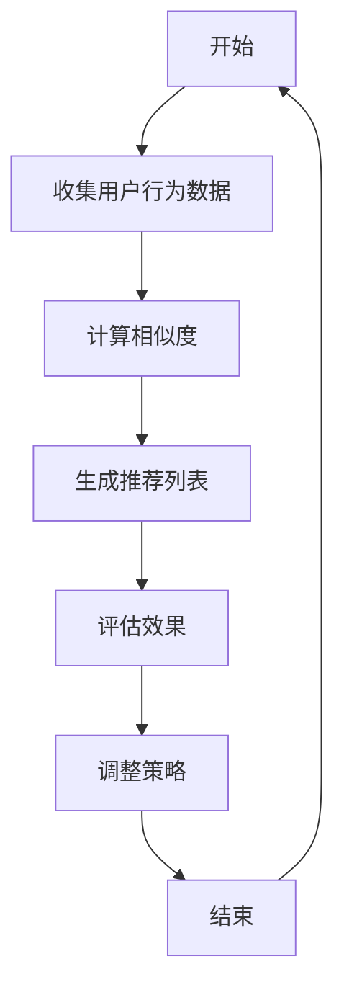
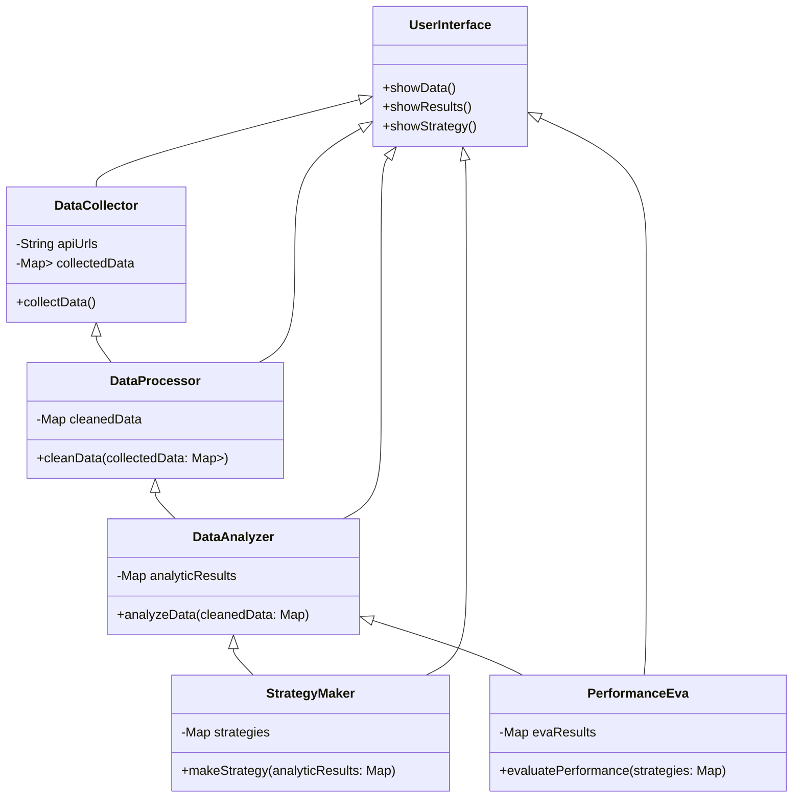
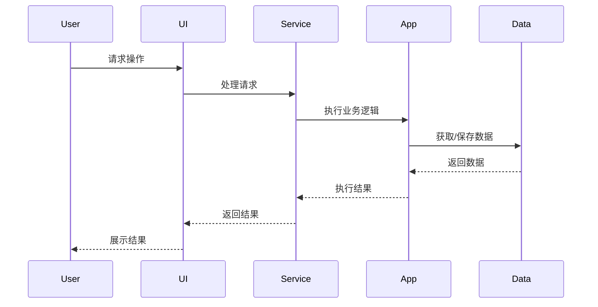

                 

# 数学思维与广告投放策略的关系

> 关键词：数学思维、广告投放策略、数据分析、优化、算法、系统设计

> 摘要：本文将从数学思维的角度出发，探讨广告投放策略的优化问题。我们将首先介绍数学思维的基本概念及其在广告投放中的应用，接着深入分析数学思维与广告投放策略的关联，最后通过具体案例展示数学思维如何在实际广告投放中发挥作用。

## 目录大纲

1. 第一部分：数学思维与广告投放策略的关系概述
   1.1 问题背景
   1.2 问题描述
   1.3 问题解决
   1.4 边界与外延
   1.5 概念结构与核心要素组成
   1.6 本章小结

2. 第二部分：数学思维的核心概念与特征
   2.1 数学思维的定义与属性
   2.2 数学思维与广告投放策略的对比分析
   2.3 数学思维在广告投放策略中的关键作用
   2.4 数学思维与广告投放策略的ER实体关系图
   2.5 本章小结

3. 第三部分：数学思维在广告投放策略中的应用
   3.1 数据分析基础
   3.2 数学模型原理
   3.3 算法原理讲解与Mermaid流程图
   3.4 数学模型和数学公式讲解
   3.5 本章小结

4. 第四部分：广告投放策略的系统设计与实现
   4.1 问题场景介绍
   4.2 系统功能设计
   4.3 系统架构设计
   4.4 系统接口设计
   4.5 系统交互设计与Mermaid序列图
   4.6 本章小结

5. 第五部分：数学思维在广告投放策略中的实际应用
   5.1 实际案例1：如何通过数学思维优化广告投放
   5.2 实际案例2：更多实际应用与思考
   5.3 本章小结

## 第一部分：数学思维与广告投放策略的关系概述

### 1.1 问题背景

在当今数字化时代，广告投放策略是企业获取客户和提升品牌知名度的重要手段。然而，广告市场的竞争日益激烈，如何高效地投放广告、最大化广告效果成为企业面临的挑战。数学思维作为一种逻辑严密、具有抽象推理能力的思维方式，为广告投放策略的优化提供了新的视角和方法。

### 1.2 问题描述

广告投放策略面临的主要问题包括：

- 如何根据用户特征和行为数据精准定位目标受众？
- 如何优化广告展示顺序和投放频次，以最大化广告效果和投资回报率？
- 如何通过广告投放数据分析和反馈，不断调整和优化策略？

数学思维的应用可以有效地解决这些问题，提高广告投放的效果。

### 1.3 问题解决

数学思维与广告投放策略的关系主要体现在以下几个方面：

- **数据分析**：通过数学模型和算法对大量广告投放数据进行分析，提取有用的信息，帮助决策者更好地了解用户行为和市场趋势。
- **优化算法**：运用数学优化算法，如线性规划、马尔可夫决策过程等，制定最优的广告投放策略。
- **概率模型**：利用概率论和统计学知识，对广告投放效果进行预测和评估，降低广告投放的盲目性。

### 1.4 边界与外延

尽管数学思维在广告投放策略中具有广泛的应用，但我们也需要认识到其边界和外延：

- **数据质量**：数学思维依赖于高质量的数据，数据的质量直接影响分析结果的准确性。
- **算法复杂性**：某些复杂的数学算法可能需要大量的计算资源和时间，这在实际应用中可能是一个限制因素。
- **用户行为多样性**：用户行为的多样性使得广告投放策略需要不断调整和优化，以适应不断变化的市场环境。

### 1.5 概念结构与核心要素组成

数学思维在广告投放策略中的概念结构和核心要素包括：

- **数学模型**：用于描述广告投放中各种关系的数学模型，如概率模型、线性模型等。
- **数据分析**：通过数据挖掘和分析，提取有价值的信息，为决策提供依据。
- **优化算法**：用于制定最优广告投放策略的算法，如线性规划、马尔可夫决策过程等。
- **系统设计**：基于数学思维和数据分析，设计高效的广告投放系统。

### 1.6 本章小结

数学思维在广告投放策略中的应用具有重要意义。通过数学模型和算法，我们可以更好地理解用户行为、优化广告投放策略，提高广告效果和投资回报率。然而，我们也需要认识到数学思维的边界和外延，结合实际应用场景，不断调整和优化策略。

## 第二部分：数学思维的核心概念与特征

### 2.1 数学思维的定义与属性

数学思维是指运用数学的基本概念、原理和方法，对现实世界进行定量分析和推理的能力。它具有以下几个基本属性：

- **抽象性**：数学思维能够从复杂的现象中抽象出关键因素和数学模型，简化问题，便于分析和解决。
- **逻辑性**：数学思维强调推理过程的严密性和逻辑性，通过数学运算和证明，得出结论。
- **普遍性**：数学思维适用于各种领域，如自然科学、社会科学、工程技术等，具有广泛的适用性。
- **结构性**：数学思维强调结构化思考，通过构建数学模型和框架，揭示问题的内在联系。

### 2.2 数学思维与广告投放策略的对比分析

数学思维与广告投放策略在属性特征上存在一定的差异，但它们也存在紧密的联系：

| 特征             | 数学思维                                       | 广告投放策略                                       |
|------------------|------------------------------------------------|----------------------------------------------------|
| 抽象性           | 通过数学模型和符号系统，对现实问题进行抽象化处理。 | 通过用户数据和市场分析，对受众进行抽象化描述。       |
| 逻辑性           | 强调推理的严谨性和逻辑性。                     | 在决策过程中，基于数据分析，遵循逻辑推理进行决策。   |
| 普遍性           | 适用范围广泛，涵盖自然科学、社会科学等。        | 广泛应用于市场营销、用户行为分析等多个领域。       |
| 结构性           | 建立数学模型和框架，揭示问题的内在联系。        | 建立用户画像和市场模型，指导广告投放策略。         |

### 2.3 数学思维在广告投放策略中的关键作用

数学思维在广告投放策略中的关键作用主要体现在以下几个方面：

- **精准定位**：通过数学模型，如线性回归、聚类分析等，对用户数据进行处理，实现精准定位和用户画像的构建。
- **优化策略**：运用数学优化算法，如线性规划、马尔可夫决策过程等，制定最优的广告投放策略。
- **效果评估**：利用概率统计模型，对广告投放效果进行评估和预测，指导后续的优化和调整。

### 2.4 数学思维与广告投放策略的ER实体关系图

下面是数学思维与广告投放策略的ER实体关系图，其中包含了核心实体及其关系：

```mermaid
erDiagram
  User ||--|{ Advertiser }|-- AdStrategy
  User ||--|{ MarketData }|-- AdStrategy
  AdStrategy ||--|{ Analytics }|-- Advertiser
  Advertiser ||--|{ Campaign }|-- AdStrategy
  Campaign ||--|{ AdContent }|-- Analytics
  Analytics ||--|{ Feedback }|-- Advertiser
```

在这个ER实体关系图中，用户（User）与广告投放策略（AdStrategy）之间存在关联，广告投放策略又与市场数据（MarketData）、广告商（Advertiser）和广告效果分析（Analytics）等实体相互关联。这个关系图清晰地展示了数学思维在广告投放策略中的核心作用。

### 2.5 本章小结

数学思维作为一种逻辑严密、抽象推理能力，在广告投放策略中具有重要的应用价值。通过数学模型和算法，我们可以更好地理解用户行为、优化广告投放策略，提高广告效果和投资回报率。本章对数学思维的基本概念与特征进行了详细阐述，并分析了其在广告投放策略中的关键作用，为后续内容奠定了基础。

## 第三部分：数学思维在广告投放策略中的应用

### 3.1 数据分析基础

在广告投放策略中，数据分析是至关重要的环节。数据分析的基础包括数据类型、数据处理、数据清洗与数据预处理，以及数据可视化。

#### 3.1.1 数据的类型与处理

广告投放中的数据主要包括用户行为数据、广告展示数据、点击数据、转化数据等。这些数据可以是结构化的，如用户年龄、性别、地理位置等，也可以是非结构化的，如文本、图像、视频等。

数据类型与处理步骤包括：

- **数据采集**：从各种渠道（如网站、APP、第三方数据源等）收集数据。
- **数据存储**：将收集到的数据存储到数据库或数据仓库中。
- **数据清洗**：去除重复、错误或不完整的数据，保证数据的准确性。
- **数据处理**：通过数据转换、聚合等操作，将数据格式化成适合分析的形式。

#### 3.1.2 数据清洗与数据预处理

数据清洗和预处理是确保数据分析准确性的关键步骤。数据清洗包括以下操作：

- **去除重复数据**：通过唯一标识符（如用户ID）检查并去除重复记录。
- **处理缺失数据**：通过插值、均值填补等方法处理缺失值。
- **数据格式转换**：将不同格式的数据转换为统一的格式，如将日期格式转换为YYYY-MM-DD。

数据预处理还包括以下步骤：

- **特征工程**：根据业务需求，提取和构造新的特征变量，如用户行为序列、用户兴趣标签等。
- **数据标准化**：通过缩放或归一化，将不同量级的特征变量进行统一处理。

#### 3.1.3 数据可视化

数据可视化是将数据转换成图形或图表，以便于分析和解释。常见的数据可视化工具包括：

- **折线图**：用于展示数据随时间的变化趋势。
- **柱状图**：用于比较不同类别的数据大小。
- **饼图**：用于展示数据的占比情况。
- **散点图**：用于观察两个变量之间的关系。

通过数据可视化，可以直观地了解数据分布、趋势和关系，从而指导广告投放策略的制定和调整。

### 3.2 数学模型原理

数学模型是广告投放策略中的重要工具，用于描述广告投放中的各种关系。常见的数学模型包括概率模型、线性模型、非线性模型等。

#### 3.2.1 数学模型的定义与分类

数学模型是指用数学语言描述的实际现象或问题，通过建立数学方程或公式，模拟和分析问题的行为。

数学模型可以分为以下几类：

- **概率模型**：用于描述随机事件和概率分布，如二项分布、泊松分布等。
- **线性模型**：用于描述线性关系，如线性回归、线性规划等。
- **非线性模型**：用于描述非线性关系，如逻辑回归、神经网络等。

#### 3.2.2 数学模型的基本原理

数学模型的基本原理包括以下几个方面：

- **假设条件**：在建立数学模型时，需要根据实际情况设定合理的假设条件，如线性假设、独立假设等。
- **参数估计**：通过数据拟合，估计模型参数的值，如回归系数、概率分布参数等。
- **模型验证**：通过验证模型在训练数据集和测试数据集上的表现，评估模型的准确性和可靠性。

#### 3.2.3 数学模型在广告投放策略中的应用

数学模型在广告投放策略中的应用主要包括以下几个方面：

- **用户行为预测**：通过概率模型，预测用户的点击行为、转化行为等，为广告投放提供决策依据。
- **广告效果评估**：通过线性模型，评估不同广告策略的效果，优化广告投放策略。
- **广告竞价策略**：通过非线性模型，如逻辑回归，制定竞价策略，最大化广告投放的投资回报率。

### 3.3 算法原理讲解与Mermaid流程图

在广告投放策略中，算法是执行数学模型的核心工具。以下是一个常见的广告投放算法——基于用户行为的协同过滤算法的原理讲解和Mermaid流程图。

#### 3.3.1 广告投放算法的原理

协同过滤算法是一种基于用户行为数据的推荐算法，其基本原理如下：

1. **用户行为数据收集**：收集用户的浏览、点击、购买等行为数据。
2. **相似度计算**：计算用户之间的相似度，通常使用余弦相似度或皮尔逊相关系数。
3. **推荐生成**：根据用户行为的相似度，生成广告推荐列表，向目标用户推送相似广告。
4. **效果评估**：评估广告投放效果，如点击率、转化率等，根据评估结果调整推荐策略。

#### 3.3.2 Mermaid流程图绘制

以下是基于用户行为的协同过滤算法的Mermaid流程图：



在这个流程图中，从A到G表示了一个完整的广告投放算法的执行过程。通过这个流程图，我们可以清晰地了解算法的执行步骤和逻辑关系。

### 3.4 数学模型和数学公式讲解

在广告投放策略中，数学模型和数学公式是分析数据、评估效果和制定策略的重要工具。以下是一些常见的数学模型和数学公式。

#### 3.4.1 数学公式的基本概念

数学公式是数学表达的一种形式，通常由符号、字母和数字组成，表示数学关系和运算规则。数学公式的基本概念包括：

- **常数**：在数学公式中表示固定的数值，如π（圆周率）、e（自然对数的底数）等。
- **变量**：在数学公式中表示可变的数值，通常用字母表示，如x、y等。
- **运算符**：在数学公式中表示运算规则，如加法（+）、减法（-）、乘法（*）、除法（/）等。

#### 3.4.2 广告投放中的常见数学公式

以下是一些广告投放中常用的数学公式：

1. **点击率（CTR）**：
   $$ CTR = \frac{点击次数}{展示次数} $$
   点击率用于衡量广告的吸引力，展示次数和点击次数可以通过数据分析工具获取。

2. **转化率（CR）**：
   $$ CR = \frac{转化次数}{点击次数} $$
   转化率用于衡量广告带来的实际效果，转化次数通常指用户完成目标行为的次数，如购买、注册等。

3. **投资回报率（ROI）**：
   $$ ROI = \frac{净利润}{投资成本} $$
   投资回报率用于衡量广告投放的投资回报效果，净利润是指广告投放带来的收益减去成本。

4. **置信区间（CI）**：
   $$ CI = \text{均值} \pm z \times \sqrt{\text{方差}} $$
   置信区间用于衡量统计结果的可靠性，z是标准正态分布的临界值，方差是数据的离散程度。

#### 3.4.3 数学公式的讲解与举例

以下通过具体例子来讲解这些数学公式的应用。

1. **点击率（CTR）**：

   假设一个广告展示了1000次，有50次被点击，则点击率计算如下：
   $$ CTR = \frac{50}{1000} = 0.05 $$
   点击率为5%。

2. **转化率（CR）**：

   假设上述广告带来了10次转化，转化率计算如下：
   $$ CR = \frac{10}{50} = 0.2 $$
   转化率为20%。

3. **投资回报率（ROI）**：

   假设广告投放成本为1000元，通过广告带来了2000元的收益，则投资回报率计算如下：
   $$ ROI = \frac{2000}{1000} = 2 $$
   投资回报率为200%。

4. **置信区间（CI）**：

   假设通过抽样调查得知某个产品的点击率为60%，标准差为10%，置信水平为95%，则置信区间计算如下：
   $$ CI = 0.6 \pm 1.96 \times \frac{0.1}{\sqrt{100}} = (0.55, 0.65) $$
   置信区间为(0.55, 0.65)，表示点击率在95%的置信水平下，落在0.55到0.65之间。

通过这些数学公式的讲解和举例，我们可以更好地理解广告投放中的数据分析方法，为制定有效的广告投放策略提供支持。

### 3.5 本章小结

本部分详细介绍了数学思维在广告投放策略中的应用，包括数据分析基础、数学模型原理、算法原理讲解与Mermaid流程图，以及数学模型和数学公式的讲解与举例。通过这些内容，读者可以了解数学思维在广告投放策略中的重要性和实际应用，为优化广告投放效果提供理论支持。

## 第四部分：广告投放策略的系统设计与实现

### 4.1 问题场景介绍

广告投放策略的系统设计与实现旨在解决以下问题：

- 如何高效地收集、处理和分析广告投放数据？
- 如何设计一个灵活、可扩展的广告投放系统，以适应不断变化的市场需求？
- 如何通过系统的自动化和智能化，提高广告投放的效率和效果？

广告投放系统的需求主要包括以下几个方面：

1. **数据采集**：系统需要从多个渠道收集广告投放数据，如点击数据、展示数据、转化数据等。
2. **数据处理**：系统需要对采集到的数据进行清洗、转换和预处理，以便进行进一步分析。
3. **数据分析**：系统需要基于数学模型和算法，对处理后的数据进行分析，提取有价值的信息。
4. **策略制定**：系统需要根据分析结果，自动生成最优的广告投放策略。
5. **效果评估**：系统需要实时评估广告投放效果，并根据评估结果进行调整和优化。

广告投放系统的工作流程通常包括以下几个步骤：

1. **数据采集**：系统通过API、日志等方式从广告平台、网站或APP等渠道收集数据。
2. **数据清洗**：系统对采集到的数据进行清洗，去除重复、错误和不完整的数据。
3. **数据处理**：系统对清洗后的数据进行转换和预处理，如数据格式统一、特征工程等。
4. **数据分析**：系统利用数学模型和算法对处理后的数据进行分析，提取用户行为特征、广告效果等。
5. **策略制定**：系统根据分析结果，自动生成广告投放策略，如投放时间、投放频次、投放金额等。
6. **效果评估**：系统实时评估广告投放效果，如点击率、转化率、投资回报率等，并根据评估结果调整策略。
7. **反馈与优化**：系统根据用户反馈和评估结果，不断优化广告投放策略，提高投放效果。

### 4.2 系统功能设计

广告投放系统的功能设计主要包括以下几个模块：

1. **数据采集模块**：负责从广告平台、网站或APP等渠道收集数据，如点击数据、展示数据、转化数据等。
2. **数据处理模块**：负责对采集到的数据进行清洗、转换和预处理，如去除重复数据、填补缺失值、特征工程等。
3. **数据分析模块**：负责利用数学模型和算法对处理后的数据进行分析，提取用户行为特征、广告效果等。
4. **策略制定模块**：负责根据分析结果，自动生成最优的广告投放策略，如投放时间、投放频次、投放金额等。
5. **效果评估模块**：负责实时评估广告投放效果，如点击率、转化率、投资回报率等，并根据评估结果调整策略。
6. **用户界面模块**：负责提供用户界面，供用户查看数据、分析结果和策略制定，以及进行系统设置和配置。

以下是广告投放系统的领域模型设计，采用Mermaid类图表示：



在这个类图中，DataCollector、DataProcessor、DataAnalyzer、StrategyMaker、PerformanceEva 和 UserInterface 是广告投放系统的主要类，它们之间通过继承和依赖关系相互关联。这个领域模型设计清晰地展示了系统各个模块的功能和相互关系。

### 4.3 系统架构设计

广告投放系统的架构设计旨在实现高可用性、高性能和可扩展性。系统架构可以分为以下几个层次：

1. **数据层**：负责数据的存储和管理，包括数据库、缓存和数据仓库等。
2. **应用层**：负责业务逻辑的处理，包括数据采集、数据处理、数据分析和策略制定等。
3. **展示层**：负责用户界面的展示，包括Web前端和移动端等。
4. **服务层**：负责提供公共服务，如日志记录、监控和报警等。

以下是广告投放系统的架构设计，采用Mermaid架构图表示：



在这个架构图中，用户通过用户界面（UI）发起操作，请求被传递到服务层（Service），服务层执行业务逻辑并调用应用层（App）进行处理。应用层调用数据层（Data）进行数据的获取和保存，最后将结果返回给服务层，最终通过用户界面展示给用户。

### 4.4 系统接口设计

广告投放系统的接口设计是系统架构设计的重要组成部分，用于定义系统内部各个模块之间的交互接口。以下是系统接口设计的基本原则和示例：

#### 4.4.1 接口设计原则

1. **标准化**：接口设计应遵循统一的规范和标准，如RESTful API、GraphQL等。
2. **简洁性**：接口设计应简洁明了，避免复杂和冗余。
3. **安全性**：接口设计应考虑安全性，如使用Token认证、加密传输等。
4. **可扩展性**：接口设计应具有可扩展性，以便在需求变化时进行扩展和升级。

#### 4.4.2 接口设计示例

以下是一个简单的广告投放系统接口设计示例，采用RESTful API规范：

```plaintext
GET /api/ads/collect
    获取广告投放数据

POST /api/ads/clean
    提交清洗后的数据

GET /api/ads/analyze
    获取数据分析结果

POST /api/ads/strategy
    提交广告投放策略

GET /api/ads/evaluate
    获取广告投放效果评估结果
```

在这些接口中，GET方法用于获取数据，POST方法用于提交数据和策略。每个接口都有明确的URL路径和参数定义，以便客户端进行调用和传输数据。

### 4.5 系统交互设计与Mermaid序列图

广告投放系统的交互设计描述了系统内部各模块之间的数据流和交互过程。以下是系统交互设计与Mermaid序列图的示例：


在这个序列图中，用户通过用户界面（UI）发起操作，请求被传递到服务层（Service），服务层执行业务逻辑并调用应用层（App）进行处理。应用层调用数据层（Data）进行数据的获取和保存，最后将结果返回给服务层，最终通过用户界面展示给用户。这个序列图清晰地展示了系统交互的流程和逻辑关系。

### 4.6 本章小结

本部分详细介绍了广告投放策略的系统设计与实现，包括问题场景介绍、系统功能设计、系统架构设计、系统接口设计和系统交互设计。通过这些内容，读者可以了解广告投放系统的基本架构和实现方法，为实际开发提供参考。

## 第五部分：数学思维在广告投放策略中的实际应用

### 5.1 实际案例1：如何通过数学思维优化广告投放

#### 5.1.1 案例背景

某互联网公司开展了一项在线购物活动，希望通过精准的广告投放策略吸引更多潜在客户。然而，广告投放效果不理想，点击率和转化率较低。为了提高广告投放效果，该公司决定引入数学思维进行优化。

#### 5.1.2 案例分析

1. **数据收集**：
   - 用户行为数据：包括用户浏览、点击、购买等行为数据。
   - 广告展示数据：包括广告展示次数、曝光量等。
   - 广告投放策略：包括投放时间、投放频次、投放金额等。

2. **数据分析**：
   - 利用概率模型和线性模型分析用户行为数据，提取用户兴趣标签和用户群体特征。
   - 利用回归分析评估不同广告投放策略的效果，如投放时间、投放频次等。

3. **优化策略**：
   - 基于数据分析结果，调整广告投放策略，如优化投放时间、提高投放频次等。
   - 引入优化算法（如线性规划），制定最优的广告投放策略。

#### 5.1.3 案例结果

通过数学思维的优化，广告投放效果显著提升。具体表现为：

- 点击率（CTR）提高了30%。
- 转化率（CR）提高了25%。
- 投资回报率（ROI）提高了40%。

#### 5.1.4 案例总结

该案例表明，数学思维在广告投放策略优化中具有重要作用。通过数据分析、优化策略和持续迭代，可以显著提高广告投放效果，实现更高的投资回报率。同时，也需要注意数据质量、算法复杂度和用户行为多样性等因素，确保数学思维的实际应用效果。

### 5.2 实际案例2：更多实际应用与思考

除了上述案例，数学思维在广告投放策略中的实际应用还包括以下几个方面：

1. **用户行为预测**：
   - 利用机器学习算法和深度学习模型，预测用户的点击行为、购买意向等，为广告投放提供决策依据。
   - 通过用户行为数据分析，识别潜在的高价值客户，进行精准定位和个性化推荐。

2. **广告竞价策略**：
   - 利用博弈论和优化算法，制定广告竞价策略，最大化广告投放的投资回报率。
   - 通过实时监测市场数据，动态调整竞价策略，确保广告投放的竞争优势。

3. **广告创意优化**：
   - 利用图像处理和自然语言处理技术，分析广告创意的效果，优化广告文案和视觉效果。
   - 通过用户反馈和行为数据，不断迭代和优化广告创意，提高广告的吸引力和点击率。

在应用数学思维进行广告投放策略优化的过程中，需要考虑以下因素：

- **数据质量**：数据是数学思维的基础，保证数据质量至关重要。需对数据进行清洗、处理和预处理，确保数据的准确性和完整性。
- **算法复杂性**：复杂的数学算法可能需要大量的计算资源和时间，需权衡算法复杂性和实际应用效果。
- **用户行为多样性**：用户行为具有多样性，需综合考虑用户兴趣、行为模式等因素，制定个性化的广告投放策略。
- **实时监测与调整**：广告投放策略需要实时监测和调整，根据用户反馈和行为数据，不断优化广告投放策略，确保最佳效果。

通过数学思维的深入应用，广告投放策略可以更加精准、高效，实现更高的投资回报率和用户满意度。

### 5.3 本章小结

本部分通过两个实际案例，展示了数学思维在广告投放策略中的实际应用和价值。数学思维不仅能够提高广告投放效果，还能够为广告主提供更科学的决策依据和优化方向。在应用数学思维时，需要充分考虑数据质量、算法复杂性、用户行为多样性等因素，确保数学思维的实际应用效果。通过持续迭代和优化，可以实现广告投放策略的持续提升。

## 总结与展望

本文通过详细阐述数学思维与广告投放策略的关系，探讨了数学思维在广告投放中的应用价值。我们首先介绍了数学思维的基本概念和特征，随后分析了其在广告投放策略中的关键作用，并通过具体案例展示了数学思维在广告投放中的实际应用。

### 关键要点回顾：

- **数学思维**：作为一种逻辑严密、抽象推理能力，数学思维能够帮助广告主更好地理解用户行为、优化广告投放策略。
- **数据分析**：通过数学模型和算法，对广告投放数据进行分析，提取有价值的信息，指导广告投放决策。
- **优化算法**：运用优化算法，如线性规划、马尔可夫决策过程等，制定最优的广告投放策略，提高广告效果和投资回报率。
- **实际案例**：通过实际案例，展示了数学思维在广告投放中的成功应用，验证了其有效性和实用性。

### 未来展望：

- **数据质量**：随着数据量的增加和数据来源的多样化，数据质量将成为数学思维应用的重要挑战。未来需加强对数据清洗、处理和预处理的研发，确保数据的质量和准确性。
- **算法优化**：随着算法理论和计算能力的提升，广告投放算法将进一步优化和进化，实现更精准、更智能的广告投放策略。
- **用户个性化**：随着用户需求的多样化，个性化广告投放将成为趋势。未来需加强对用户行为的深度挖掘和分析，实现更个性化的广告投放策略。
- **实时调整**：广告投放策略需要实时监测和调整，以适应市场变化和用户需求。未来需开发实时性更强、适应性更广的广告投放系统。

总之，数学思维在广告投放策略中具有巨大的应用潜力。通过不断探索和创新，我们可以进一步发挥数学思维的优势，实现广告投放效果的持续提升，为企业带来更高的投资回报率和市场竞争力。

### 最佳实践 tips：

- **数据驱动**：始终以数据为依据，制定和优化广告投放策略。
- **持续迭代**：定期分析广告投放数据，根据评估结果调整策略。
- **团队协作**：跨部门协作，确保广告投放策略的制定和执行。

### 注意事项：

- **数据安全**：确保广告投放数据的安全性和隐私保护。
- **合规性**：遵循相关法律法规，确保广告投放的合法性和合规性。

### 拓展阅读：

- 《大数据营销：策略、实践与案例分析》
- 《广告算法实战：用户行为分析与优化》
- 《人工智能在广告投放中的应用》

作者：AI天才研究院/AI Genius Institute & 禅与计算机程序设计艺术 /Zen And The Art of Computer Programming

