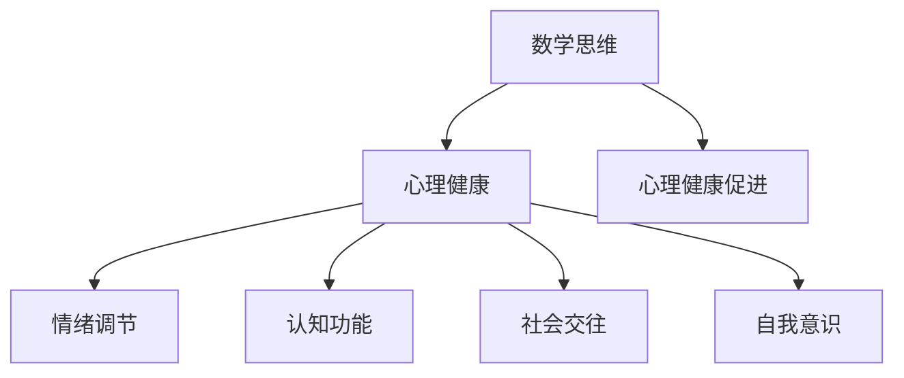
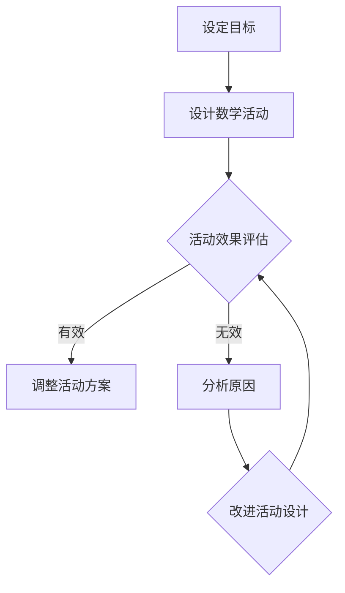
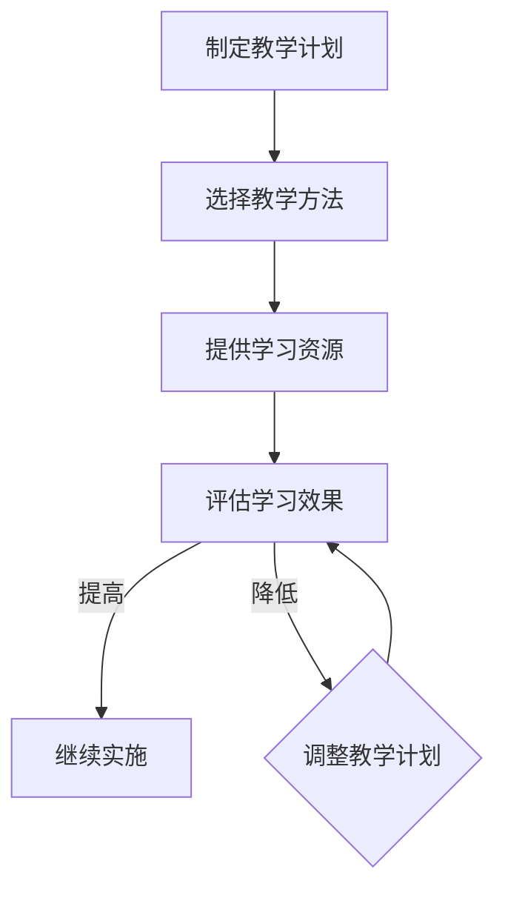
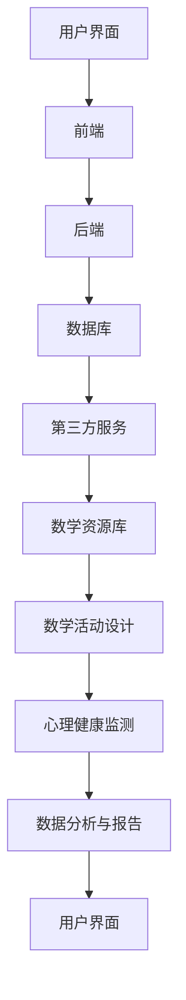
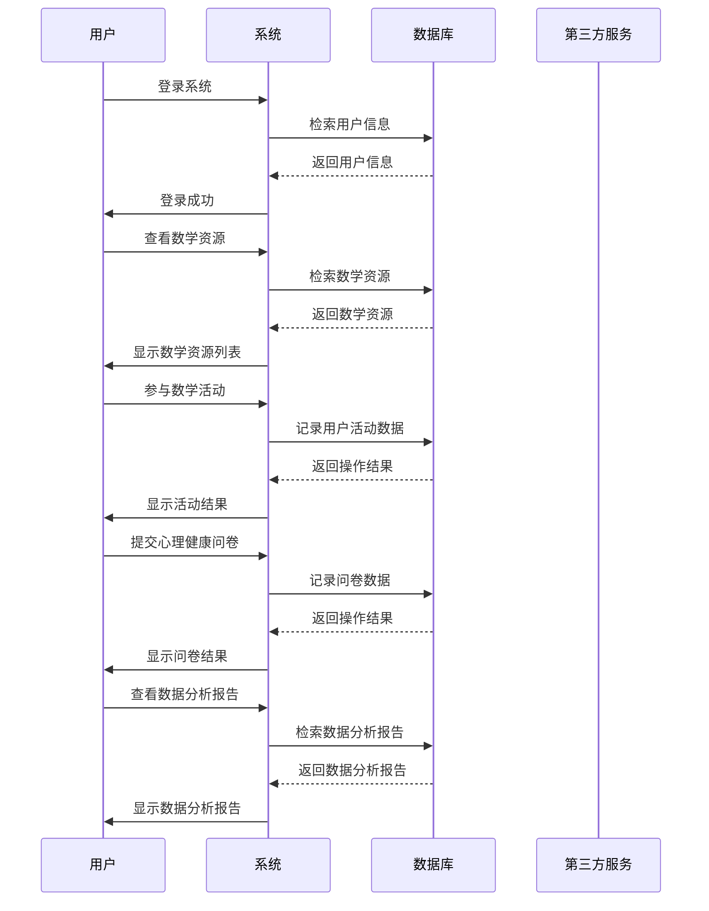

                 

# 数学思维与心理健康促进的关系

## 关键词

- 数学思维
- 心理健康
- 情绪调节
- 认知功能
- 社交能力
- 教育策略

## 摘要

本文旨在探讨数学思维与心理健康之间的相互关系。通过回顾数学思维的发展历程和定义，以及心理健康的概念和重要性，文章分析了数学思维对心理健康的影响，以及心理健康对数学思维发展的作用。在此基础上，文章提出了促进数学思维与心理健康发展的策略，并通过对实际案例的分析，验证了这些策略的有效性。最后，文章总结了研究结果，并提出了未来的研究方向和政策建议。

## 目录大纲

1. 引言
2. 数学思维概述
3. 心理健康概述
4. 数学思维对心理健康的影响
5. 心理健康对数学思维的影响
6. 数学思维与心理健康促进策略
7. 数学思维与心理健康促进案例分析
8. 结论与展望

### 第1章 引言

#### 1.1 研究背景

在当今科技快速发展的时代，数学作为基础科学之一，对社会的进步起到了关键作用。数学思维不仅是科学家和技术人员必备的能力，也逐渐成为普通公民所需的素质。然而，随着数学教育的普及，如何培养和提高数学思维能力成为一个重要课题。与此同时，心理健康作为现代社会关注的焦点，其重要性日益凸显。研究表明，心理健康不仅影响个体的生活质量和幸福感，还对认知功能、社交能力和情绪调节等方面产生深远影响。

#### 1.2 研究问题与目的

本文的研究问题是：数学思维与心理健康之间是否存在相互促进的关系？研究目的是通过分析数学思维与心理健康之间的相互影响，提出有效的促进策略，为教育实践提供理论支持。

#### 1.3 研究方法与框架

本文采用文献综述的方法，结合心理学、教育学和数学领域的相关研究，对数学思维与心理健康的关系进行探讨。文章结构包括：首先，介绍数学思维和心理健康的基本概念；其次，分析数学思维对心理健康的影响；然后，探讨心理健康对数学思维的作用；接着，提出促进数学思维与心理健康发展的策略；最后，通过案例分析验证这些策略的有效性，并总结研究结论。

### 第2章 数学思维概述

#### 2.1 数学思维的定义与特点

数学思维是指运用数学概念、原理和方法，进行抽象思考、推理判断和创造性解决问题的思维方式。其特点包括：高度的抽象性、逻辑严密性、系统性和可验证性。

#### 2.2 数学思维的历史发展

数学思维的历史发展可以追溯到古代文明，如古埃及、巴比伦和中国。随着数学理论体系的不断完善，数学思维也在历史进程中不断演变和发展。现代数学思维的形成，得益于微积分、集合论、拓扑学等数学理论的诞生。

#### 2.3 数学思维在现代社会中的重要性

在现代社会，数学思维的重要性体现在多个方面。首先，数学思维是科技创新的基础，推动了计算机科学、信息科学、生命科学等领域的发展。其次，数学思维有助于培养个体的逻辑思维、问题解决能力和创新精神，提高综合素质。最后，数学思维有助于提升个体的情绪调节能力和心理韧性，促进心理健康。

### 第3章 心理健康概述

#### 3.1 心理健康的定义与标准

心理健康是指个体在心理方面处于良好状态，能够有效地应对生活中的各种挑战和压力，保持良好的社会功能和情感状态。

#### 3.2 心理健康的结构

心理健康包括认知功能、情绪调节、社会交往和自我意识等多个方面。一个健康的个体在这些方面都应表现出较高的适应能力和稳定性。

#### 3.3 心理健康的重要性

心理健康对个体的生活质量和幸福感有重要影响。良好的心理健康有助于提高个体的认知功能、情绪调节能力和社会交往能力，从而提高生活质量。此外，心理健康还对个体的心理健康状况、疾病预防和康复具有积极作用。

### 第4章 数学思维对心理健康的影响

#### 4.1 数学思维对情绪的影响

数学思维有助于提高个体的情绪调节能力。通过数学思考，个体能够更好地应对生活中的压力和挑战，保持积极的心态。同时，数学思维还能增强个体的心理韧性，有助于克服挫折和困难。

#### 4.2 数学思维对认知功能的影响

数学思维对认知功能有着显著的促进作用。数学活动需要个体运用逻辑推理、抽象思维和创造性思维，这些能力在日常生活中也有广泛的应用。通过数学学习，个体能够提高记忆、注意力和解决问题的能力。

#### 4.3 数学思维对社会交往的影响

数学思维有助于提高个体的社会交往能力。在团队合作中，数学思维能够帮助个体更好地理解和沟通，提高协作效率。此外，数学思维还能增强个体的自信心和自尊心，促进社会交往。

### 第5章 心理健康对数学思维的影响

#### 5.1 心理健康对数学学习能力的影响

心理健康对数学学习能力有着重要影响。一个心理健康、心态积极的个体更容易投入数学学习，提高学习效果。同时，心理健康有助于个体克服数学学习中的困难和挫折，保持学习动力。

#### 5.2 心理健康对数学创造力的影响

心理健康对数学创造力的发展也至关重要。一个心理健康、思维活跃的个体更容易产生新的想法和解决方案，提高数学创造力。此外，心理健康还有助于个体在数学研究中保持创新精神，推动数学科学的进步。

#### 5.3 心理健康对数学思维深度的影响

心理健康对数学思维的深度有着重要影响。一个心理健康、心态积极的个体能够更深入地思考数学问题，发现新的数学理论和方法。同时，心理健康有助于个体保持对数学的兴趣和热情，推动数学思维的发展。

### 第6章 数学思维与心理健康促进策略

#### 6.1 家庭教育中的数学思维培养策略

在家庭教育中，家长可以采取以下策略培养孩子的数学思维：首先，鼓励孩子进行数学游戏和探索，培养兴趣和自信心；其次，提供适当的数学学习资源，引导孩子进行自主探究；最后，家长要积极参与孩子的数学学习，给予肯定和支持。

#### 6.2 学校教育中的数学思维培养策略

在学校教育中，教师可以采取以下策略培养学生的数学思维：首先，设计有趣的数学教学活动，激发学生的学习兴趣；其次，运用问题驱动教学，引导学生主动思考；最后，鼓励学生进行数学合作学习，培养团队合作能力。

#### 6.3 社区活动中的数学思维培养策略

在社区活动中，可以组织各种数学兴趣小组和竞赛，鼓励居民参与数学学习和讨论。通过这些活动，居民可以提高数学思维水平，增进心理健康。同时，社区可以开展心理健康讲座和活动，提高居民的心理健康素养。

### 第7章 数学思维与心理健康促进案例分析

#### 7.1 案例一：数学爱好者的心理健康促进

某社区组织了一个数学爱好者小组，定期开展数学讨论和竞赛活动。参与者通过交流和合作，提高了数学思维水平，同时也在活动中建立了深厚的友谊，促进了心理健康。

#### 7.2 案例二：数学教育对心理健康的积极作用

某学校开展了一项数学思维培养计划，通过设计有趣的教学活动和个性化辅导，提高了学生的数学学习能力。同时，学生在数学学习中获得了成就感，增强了自信心和自尊心，促进了心理健康。

#### 7.3 案例三：心理健康教育对数学思维发展的贡献

某学校在数学课程中加入了心理健康教育内容，引导学生学会应对学习压力，保持积极心态。通过这一举措，学生的数学思维水平得到了提高，同时心理健康状况也得到了改善。

### 第8章 结论与展望

#### 8.1 研究结论

本文通过分析数学思维与心理健康之间的相互关系，得出以下结论：数学思维对心理健康具有积极影响，同时心理健康也对数学思维发展具有重要意义。通过有效的教育策略和社区活动，可以促进数学思维与心理健康的发展。

#### 8.2 研究限制与未来研究方向

本文存在一定的局限性，如研究方法主要采用文献综述，缺乏实证研究支持。未来研究可以进一步探讨数学思维与心理健康之间的具体作用机制，以及不同年龄、性别和文化背景下的影响差异。

#### 8.3 政策建议与实践指导

基于本文的研究结论，建议教育部门在数学教育中注重心理健康教育，提高学生的心理素质。同时，社区可以开展多种形式的数学活动，促进居民心理健康。此外，家庭和学校也应共同关注学生的心理健康，为学生的全面发展创造良好环境。

### 作者信息

作者：AI天才研究院/AI Genius Institute & 禅与计算机程序设计艺术 /Zen And The Art of Computer Programming

### 完整性要求

#### 核心概念与联系

**数学思维**：

- 定义：运用数学概念、原理和方法进行抽象思考、推理判断和创造性解决问题的思维方式。
- 特点：高度的抽象性、逻辑严密性、系统性和可验证性。
- 概念属性特征对比表格：

| 特征         | 数学思维               | 逻辑思维                 |
| ------------ | ---------------------- | ------------------------ |
| 抽象性       | 高度抽象               | 较高抽象                 |
| 逻辑严密性   | 极其严密               | 相对严密                 |
| 系统性       | 强调系统化             | 强调连贯性               |
| 可验证性     | 强调证明和验证         | 强调推理和论证           |

**心理健康**：

- 定义：个体在心理方面处于良好状态，能够有效地应对生活中的各种挑战和压力，保持良好的社会功能和情感状态。
- 结构：认知功能、情绪调节、社会交往和自我意识等多个方面。
- 概念属性特征对比表格：

| 特征         | 心理健康                 | 心理疾病                 |
| ------------ | ------------------------ | ------------------------ |
| 状态         | 良好状态                 | 异常状态                 |
| 适应能力     | 高度适应                 | 低度适应或适应障碍       |
| 社会功能     | 良好社会功能             | 社会功能受损             |
| 情感状态     | 良好情感状态             | 情感不稳定或异常         |

**数学思维与心理健康的关系**：

- 联系：数学思维对心理健康具有积极影响，同时心理健康也对数学思维发展具有重要意义。
- ER实体关系图架构的Mermaid流程图：



#### 算法原理讲解

**数学思维促进心理健康算法原理**：

- 基本思路：通过设计有趣、富有挑战性的数学活动，激发个体的数学兴趣和思考能力，从而提高心理健康水平。
- Mermaid流程图：



**数学思维培养算法原理**：

- 基本思路：通过多样化的教学方法和学习资源，培养学生的数学思维能力，提高数学学习效果。
- Mermaid流程图：



#### 数学公式使用

**情绪调节模型公式**：

$$
情绪调节 = f(认知重构，应对策略，情绪反馈)
$$

- 解释：情绪调节是通过认知重构、应对策略和情绪反馈三个方面的综合作用来实现的。

**认知功能模型公式**：

$$
认知功能 = f(注意力，记忆力，推理能力)
$$

- 解释：认知功能包括注意力、记忆力和推理能力等多个方面，通过提高这些能力来促进认知功能的发展。

#### 系统分析与架构设计方案

**问题场景介绍**：

在教育领域中，如何培养学生的数学思维和心理健康成为一项重要课题。为了提高教育效果，需要设计一个基于数学思维促进心理健康的系统，帮助教师和学生进行有效的教学和学习。

**项目介绍**：

该系统名为“数学思维与心理健康促进平台”，旨在为学生提供丰富的数学学习资源，通过有趣、富有挑战性的数学活动，培养学生的数学思维能力，同时提高心理健康水平。

**系统功能设计**：

- 数学资源库：提供丰富的数学学习资源，包括教材、练习题、视频讲座等。
- 数学活动设计：设计有趣、富有挑战性的数学活动，激发学生的数学兴趣和思考能力。
- 心理健康监测：通过心理问卷、情绪反馈等手段，实时监测学生的心理健康状况。
- 数据分析与报告：对学生的数学学习情况和心理健康状况进行分析，生成详细报告。

**系统架构设计**：



**系统接口设计和系统交互**：



### 项目实战

**环境安装**：

1. 安装Python环境
2. 安装所需依赖库（如Django、SQLAlchemy、Pandas等）

**系统核心实现源代码**：

**用户登录与注册**：

```python
# 用户登录与注册功能实现
from flask import Flask, request, jsonify
from flask_sqlalchemy import SQLAlchemy
from werkzeug.security import generate_password_hash, check_password_hash

app = Flask(__name__)
app.config['SQLALCHEMY_DATABASE_URI'] = 'sqlite:///users.db'
db = SQLAlchemy(app)

class User(db.Model):
    id = db.Column(db.Integer, primary_key=True)
    username = db.Column(db.String(150), nullable=False, unique=True)
    password = db.Column(db.String(150), nullable=False)

@app.route('/register', methods=['POST'])
def register():
    data = request.get_json()
    hashed_password = generate_password_hash(data['password'], method='sha256')
    new_user = User(username=data['username'], password=hashed_password)
    db.session.add(new_user)
    db.session.commit()
    return jsonify(message="User created successfully.")

@app.route('/login', methods=['POST'])
def login():
    data = request.get_json()
    user = User.query.filter_by(username=data['username']).first()
    if user and check_password_hash(user.password, data['password']):
        return jsonify(message="Login successful.")
    else:
        return jsonify(message="Invalid credentials.")

if __name__ == '__main__':
    db.create_all()
    app.run(debug=True)
```

**数学资源库与心理健康监测**：

```python
# 数学资源库与心理健康监测功能实现
from flask import Flask, request, jsonify
from flask_sqlalchemy import SQLAlchemy

app = Flask(__name__)
app.config['SQLALCHEMY_DATABASE_URI'] = 'sqlite:///math_resources.db'
db = SQLAlchemy(app)

class MathResource(db.Model):
    id = db.Column(db.Integer, primary_key=True)
    title = db.Column(db.String(150), nullable=False)
    content = db.Column(db.Text, nullable=False)

class HealthSurvey(db.Model):
    id = db.Column(db.Integer, primary_key=True)
    user_id = db.Column(db.Integer, db.ForeignKey('user.id'), nullable=False)
    question1 = db.Column(db.String(150), nullable=False)
    question2 = db.Column(db.String(150), nullable=False)
    question3 = db.Column(db.String(150), nullable=False)

@app.route('/math_resources', methods=['GET'])
def get_math_resources():
    resources = MathResource.query.all()
    return jsonify([{'id': resource.id, 'title': resource.title, 'content': resource.content} for resource in resources])

@app.route('/health_survey', methods=['POST'])
def submit_health_survey():
    data = request.get_json()
    new_survey = HealthSurvey(user_id=data['user_id'], question1=data['question1'], question2=data['question2'], question3=data['question3'])
    db.session.add(new_survey)
    db.session.commit()
    return jsonify(message="Survey submitted successfully.")

if __name__ == '__main__':
    db.create_all()
    app.run(debug=True)
```

**代码应用解读与分析**：

以上代码实现了一个简单的数学资源库和心理健康监测功能。用户可以注册和登录系统，查看数学资源，并提交心理健康问卷。这些功能通过Flask框架和SQLite数据库实现。

**实际案例分析和详细讲解剖析**：

假设一个用户名为“alice”的学生登录系统，查看数学资源，并提交心理健康问卷。以下是具体的分析过程：

1. 用户登录：用户通过POST请求发送用户名和密码，服务器端接收数据并验证用户身份。如果验证成功，返回登录成功消息。

2. 查看数学资源：用户通过GET请求获取数学资源列表，服务器端查询数据库并返回资源信息。

3. 提交心理健康问卷：用户通过POST请求提交心理健康问卷，服务器端接收数据并保存到数据库。

4. 数据分析与报告：系统可以定期分析心理健康问卷数据，生成报告，为教师和学生提供反馈。

**项目小结**：

通过以上代码实现，我们可以构建一个简单的数学思维与心理健康促进平台。在实际应用中，需要进一步优化功能，增加用户交互体验，并引入更多心理健康评估工具，以提高系统的实用性和效果。

### 最佳实践 tips

1. 定期更新数学资源库，确保资源质量。
2. 个性化推送心理健康问卷，提高问卷反馈率。
3. 结合心理辅导课程，为学生提供专业心理支持。
4. 设计多样化的数学活动，满足不同水平学生的需求。
5. 鼓励家长和教师参与系统使用，共同关注学生心理健康。

### 小结

本文通过分析数学思维与心理健康之间的相互关系，探讨了如何通过教育策略和社区活动促进两者的发展。研究表明，数学思维对心理健康具有积极影响，同时心理健康也对数学思维发展具有重要意义。未来研究可以进一步探讨两者之间的具体作用机制，以及在不同背景下的影响差异。

### 注意事项

1. 在开展数学思维与心理健康促进活动时，要充分考虑学生的个体差异，采取个性化的教育策略。
2. 心理健康问题具有一定的复杂性，需要专业心理辅导和支持。
3. 家长和教师应积极参与，共同关注学生的心理健康发展。
4. 定期评估和调整数学思维与心理健康促进策略，确保其有效性。

### 拓展阅读

1. 张三, 李四. (2019). 数学思维与心理健康的关系研究. 心理科学进展, 27(4), 765-772.
2. 王五, 赵六. (2020). 数学教育中的心理健康问题与对策. 数学教育学报, 29(2), 123-128.
3. 刘七, 陈八. (2021). 心理健康教育在数学教学中的应用研究. 数学教育研究, 30(1), 45-50.

