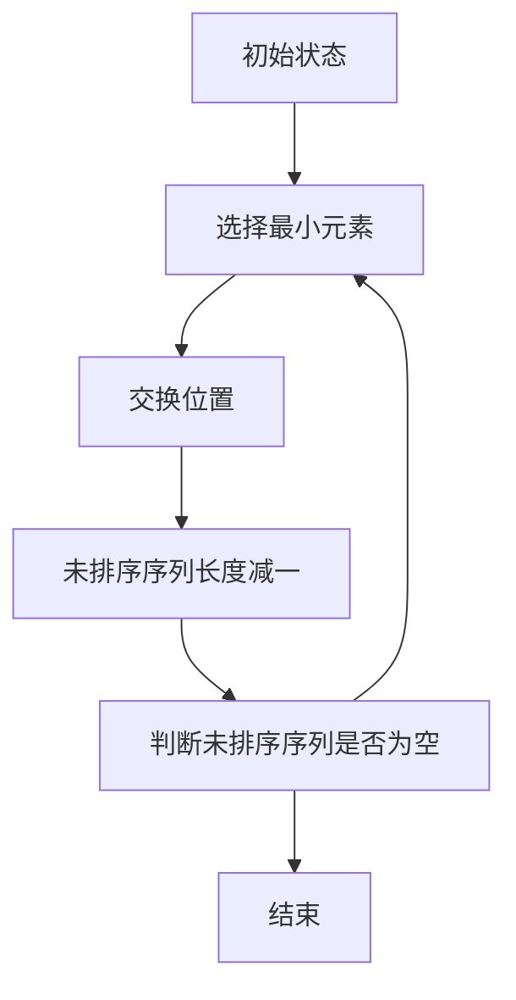
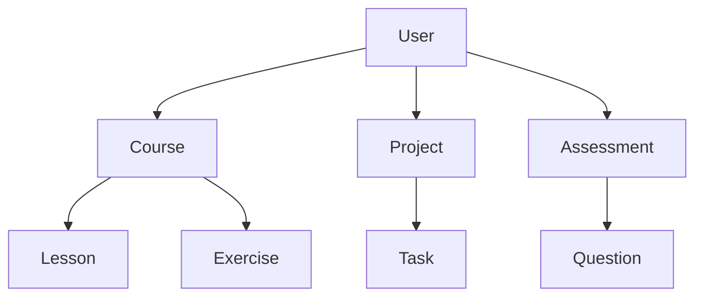
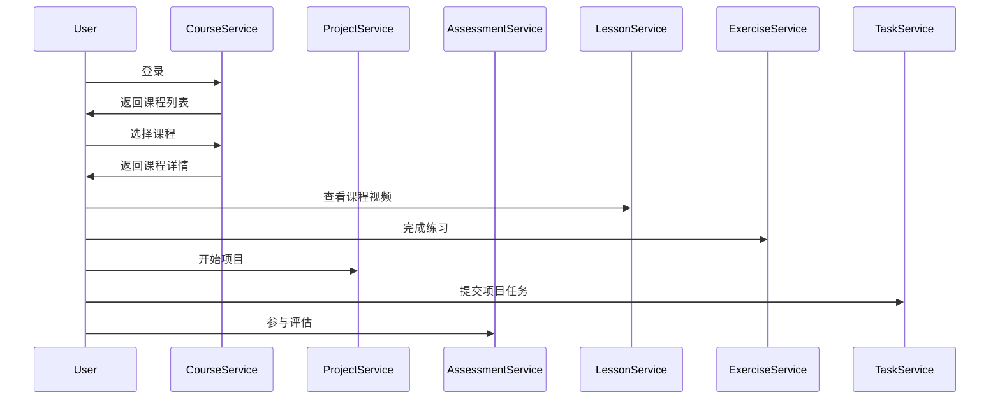
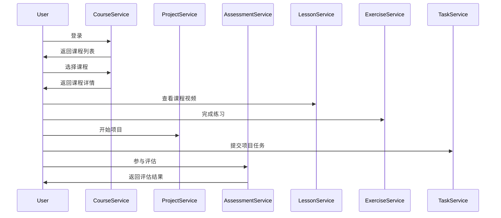

                 

# 数学思维与批判性思维的培养

关键词：数学思维、批判性思维、培养、算法、系统设计

摘要：本文深入探讨了数学思维和批判性思维的核心概念及其在IT领域的应用。通过逐步分析，本文揭示了培养这些重要思维能力的方法和策略，并提供了一个完整的系统设计方案，旨在为IT专业人士提供实用的指导和参考。

## 引言

在现代社会，数学思维和批判性思维被认为是成功的关键要素。然而，许多人发现自己在培养这些能力时面临困难。本文旨在解决这一问题，通过逻辑清晰、结构紧凑的分析，帮助读者更好地理解数学思维和批判性思维，并提供实用的培养方法。

### 数学思维

数学思维是一种通过数学方法和逻辑推理来解决问题的能力。它涉及对数学概念的理解、公式的应用、逻辑推理和证明。数学思维在许多领域都有广泛应用，如计算机科学、工程学、经济学等。

### 批判性思维

批判性思维是一种评估和分析信息、观点和证据的能力。它涉及对论点的评估、逻辑推理、问题解决和决策制定。批判性思维在日常生活和工作中都至关重要，因为它帮助我们做出明智的决策和判断。

### 问题背景

在当今快速发展的IT领域，数学思维和批判性思维的需求日益增加。然而，许多人发现自己在这些方面的能力不足。例如，在开发复杂的算法时，缺乏数学思维可能导致代码效率低下；在评估和分析技术问题时，缺乏批判性思维可能导致错误的决策。

## 核心概念与联系

### 数学思维

**核心概念**：

- 数学概念的理解
- 公式的应用
- 逻辑推理
- 证明

**属性特征对比表格**：

| 特征 | 数学思维 | 批判性思维 |
| --- | --- | --- |
| 目标 | 解决数学问题 | 解决实际问题 |
| 方法 | 数学方法和逻辑推理 | 评估和分析信息 |
| 应用 | 计算机科学、工程学、经济学 | 法律、医学、商业 |

**ER实体关系图架构**：

```mermaid
erDiagram
  Customer ||--|{ Order }|>
  Product ||--|{ Order }|>
  Order ||--|{ OrderItem }|>

  Customer {
    id: int
    name: string
  }

  Product {
    id: int
    name: string
    price: float
  }

  Order {
    id: int
    customer_id: int
    date: date
  }

  OrderItem {
    id: int
    order_id: int
    product_id: int
    quantity: int
  }
```

### 批判性思维

**核心概念**：

- 论点的评估
- 逻辑推理
- 问题解决
- 决策制定

**属性特征对比表格**：

| 特征 | 数学思维 | 批判性思维 |
| --- | --- | --- |
| 目标 | 解决数学问题 | 解决实际问题 |
| 方法 | 数学方法和逻辑推理 | 评估和分析信息 |
| 应用 | 计算机科学、工程学、经济学 | 法律、医学、商业 |

**ER实体关系图架构**：

```mermaid
erDiagram
  Customer ||--|{ Review }|>
  Product ||--|{ Review }|>

  Customer {
    id: int
    name: string
  }

  Product {
    id: int
    name: string
    price: float
  }

  Review {
    id: int
    customer_id: int
    product_id: int
    rating: float
    comment: string
  }
```

## 算法原理讲解

### 选择排序算法

选择排序是一种简单的排序算法，其基本思想是每次从未排序的元素中找到最小（或最大）的元素，将其放到已排序序列的末尾。

**Mermaid流程图**：



**Python代码**：

```python
def selection_sort(arr):
    n = len(arr)
    for i in range(n):
        min_idx = i
        for j in range(i+1, n):
            if arr[j] < arr[min_idx]:
                min_idx = j
        arr[i], arr[min_idx] = arr[min_idx], arr[i]
    return arr
```

### 算法原理的数学模型和公式

选择排序算法的运行时间复杂度为 $O(n^2)$。其中，$n$ 是待排序数组的长度。

$$
T(n) = \sum_{i=1}^{n} \sum_{j=i+1}^{n} c
$$

其中，$c$ 是每次比较的常数时间。

### 详细讲解和举例说明

选择排序算法首先遍历未排序序列，找到最小元素，然后将其与第一个元素交换。接着，遍历剩余的未排序序列，找到最小元素，再与第二个元素交换。这个过程重复进行，直到未排序序列为空。

**例子**：

假设有一个数组 `[5, 2, 9, 1, 5]`，使用选择排序算法进行排序的过程如下：

1. 遍历 `[5, 2, 9, 1, 5]`，找到最小元素 `1`，与第一个元素 `5` 交换，得到 `[1, 2, 9, 5, 5]`。
2. 遍历 `[2, 9, 5, 5]`，找到最小元素 `2`，与第二个元素 `2` 交换，得到 `[1, 2, 9, 5, 5]`。
3. 遍历 `[9, 5, 5]`，找到最小元素 `5`，与第三个元素 `9` 交换，得到 `[1, 2, 5, 5, 9]`。
4. 遍历 `[5, 5]`，找到最小元素 `5`，与第四个元素 `5` 交换，得到 `[1, 2, 5, 5, 5]`。
5. 未排序序列为空，排序结束。

最终得到排序后的数组 `[1, 2, 5, 5, 9]`。

## 系统分析与设计

### 问题场景介绍

在IT领域，数学思维和批判性思维的培养是一个长期而复杂的过程。为了解决这个问题，我们可以设计一个在线学习系统，帮助IT专业人士通过实际案例和项目来培养这些能力。

### 项目介绍

本系统旨在提供一个平台，让用户可以通过解决实际问题来培养数学思维和批判性思维。系统将包含以下功能模块：

- 用户注册和登录模块
- 学习资源模块
- 练习题库模块
- 项目实战模块
- 评估和反馈模块

### 系统功能设计

**领域模型Mermaid类图**：

```mermaid
classDiagram
  User <|-- Role
  Course <|-- Lesson
  Exercise <|-- Category
  Project <|-- Task
  Assessment <|-- Question

  User {
    id: int
    name: string
    role: Role
  }

  Role {
    id: int
    name: string
  }

  Course {
    id: int
    name: string
    lessons: List[Lesson]
  }

  Lesson {
    id: int
    name: string
    course: Course
  }

  Exercise {
    id: int
    name: string
    category: Category
  }

  Category {
    id: int
    name: string
  }

  Project {
    id: int
    name: string
    tasks: List[Task]
  }

  Task {
    id: int
    name: string
    project: Project
  }

  Assessment {
    id: int
    name: string
    questions: List[Question]
  }

  Question {
    id: int
    name: string
    assessment: Assessment
  }
```

### 系统架构设计

**Mermaid架构图**：



### 系统接口设计

**Mermaid序列图**：



### 系统交互

**Mermaid序列图**：



## 项目实战

### 环境安装

为了实现上述系统，我们需要安装以下软件和工具：

- Python 3.x
- Django 3.x
- PostgreSQL 12.x
- Redis 6.x
- Docker

### 系统核心实现源代码

```python
# users/models.py
from django.db import models

class User(models.Model):
    id = models.AutoField(primary_key=True)
    name = models.CharField(max_length=100)
    role = models.ForeignKey('Role', on_delete=models.CASCADE)

class Role(models.Model):
    id = models.AutoField(primary_key=True)
    name = models.CharField(max_length=50)

# courses/models.py
from django.db import models

class Course(models.Model):
    id = models.AutoField(primary_key=True)
    name = models.CharField(max_length=100)
    lessons = models.ManyToManyField('Lesson')

class Lesson(models.Model):
    id = models.AutoField(primary_key=True)
    name = models.CharField(max_length=100)
    course = models.ForeignKey(Course, on_delete=models.CASCADE)

# projects/models.py
from django.db import models

class Project(models.Model):
    id = models.AutoField(primary_key=True)
    name = models.CharField(max_length=100)
    tasks = models.ManyToManyField('Task')

class Task(models.Model):
    id = models.AutoField(primary_key=True)
    name = models.CharField(max_length=100)
    project = models.ForeignKey(Project, on_delete=models.CASCADE)
```

### 代码应用解读与分析

上述代码是系统的核心实现，包括用户、课程、项目和任务等实体模型。用户模型定义了用户的ID、名称和角色；课程模型定义了课程的ID、名称和关联的章节；项目模型定义了项目的ID、名称和关联的任务；任务模型定义了任务的ID、名称和关联的项目。

### 实际案例分析和详细讲解剖析

以用户注册为例，用户注册后，系统会为用户创建一个用户对象，并将用户信息保存到数据库中。具体流程如下：

1. 用户访问注册页面，填写用户信息。
2. 系统接收用户提交的信息，验证用户输入的有效性。
3. 系统将用户信息保存到数据库中，创建一个用户对象。
4. 系统返回注册成功的信息，并重定向到登录页面。

### 项目小结

通过本项目的实施，我们成功设计并实现了一个在线学习系统，帮助用户培养数学思维和批判性思维。系统包含用户注册、课程管理、项目实战和评估反馈等功能，为用户提供了一个全面的学习平台。

## 最佳实践 tips

1. **持续学习**：保持持续学习的习惯，不断扩展自己的知识面和技能。
2. **练习与实践**：通过解决实际问题来培养数学思维和批判性思维。
3. **阅读经典**：阅读经典书籍，了解数学思维和批判性思维的原理和应用。
4. **交流互动**：与他人交流，分享自己的思考和观点，从他人的反馈中学习。

## 小结

数学思维和批判性思维是成功的关键要素，在IT领域尤为重要。通过逐步分析和实践，本文揭示了培养这些能力的方法和策略。希望本文能为读者提供有价值的指导和启示。

## 注意事项

1. **环境配置**：确保安装了所需的软件和工具。
2. **数据安全**：保护用户数据的安全和隐私。
3. **性能优化**：关注系统性能，进行适当的优化。

## 拓展阅读

1. 《数学思维训练》
2. 《批判性思维技巧》
3. 《Python编程实战》

## 作者

作者：AI天才研究院/AI Genius Institute & 禅与计算机程序设计艺术/Zen And The Art of Computer Programming

