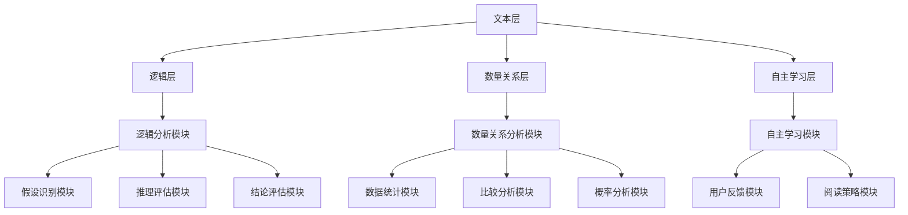
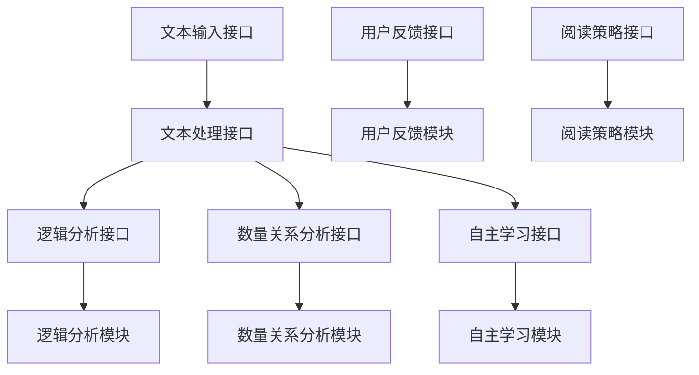
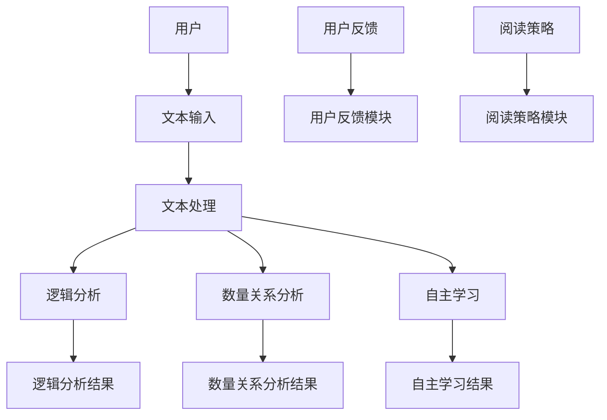

                 

# 数学思维与批判性阅读的关系探讨

## 关键词

数学思维、批判性阅读、逻辑分析、阅读理解、算法原理、数学模型、系统架构、项目实战

## 摘要

本文旨在探讨数学思维与批判性阅读之间的关系，分析两者在逻辑分析、阅读理解等方面的相互作用。通过定义数学思维和批判性阅读，阐述它们的核心概念和特征，本文将进一步探讨数学思维在批判性阅读中的应用，以及批判性阅读对数学思维发展的促进作用。同时，本文还将通过具体的案例研究和系统架构设计，展示数学思维与批判性阅读在实践中的应用，并提供最佳实践建议和拓展阅读资源。

## 目录大纲设计思路

在设计《数学思维与批判性阅读的关系探讨》的目录大纲时，我们首先明确了文章的背景、核心概念、算法原理、系统架构和项目实战等关键要素。以下是目录大纲的设计思路：

### 第一部分：背景与核心概念

1. **问题背景**：介绍数学思维和批判性阅读的背景，阐述它们在现代社会中的重要性。
2. **核心概念**：详细阐述数学思维和批判性阅读的定义，分析它们的核心特征。
3. **概念联系与对比**：探讨数学思维和批判性阅读之间的联系，通过对比分析展示两者的差异。

### 第二部分：数学思维在批判性阅读中的应用

4. **数学思维在批判性阅读中的应用**：分析数学思维在批判性阅读中的作用，如逻辑分析、数量关系等。
5. **案例研究**：通过具体案例，展示数学思维在批判性阅读中的应用。

### 第三部分：批判性阅读对数学思维发展的作用

6. **批判性阅读对数学思维发展的作用**：探讨批判性阅读如何促进数学思维的发展。
7. **案例研究**：通过具体案例，展示批判性阅读对数学思维培养的作用。

### 第四部分：系统分析与架构设计

8. **系统架构设计**：介绍数学思维与批判性阅读应用系统的功能设计。
9. **接口设计与交互**：阐述系统接口设计和交互设计。

### 第五部分：项目实战

10. **项目实战**：通过一个具体的项目案例，展示如何将数学思维和批判性阅读应用于实际项目中。

### 第六部分：最佳实践与总结

11. **最佳实践**：总结实践中的注意事项和最佳实践建议。
12. **小结**：回顾文章的主要内容。
13. **拓展阅读**：推荐进一步阅读的材料。

### 目录大纲结构

**第一部分：背景与核心概念**

1. **问题背景**
2. **核心概念**
3. **概念联系与对比**

**第二部分：数学思维在批判性阅读中的应用**

4. **数学思维在批判性阅读中的应用**
5. **案例研究**

**第三部分：批判性阅读对数学思维发展的作用**

6. **批判性阅读对数学思维发展的作用**
7. **案例研究**

**第四部分：系统分析与架构设计**

8. **系统架构设计**
9. **接口设计与交互**

**第五部分：项目实战**

10. **项目实战**

**第六部分：最佳实践与总结**

11. **最佳实践**
12. **小结**
13. **拓展阅读**

## 第一部分：背景与核心概念

### 1.1 问题背景

在现代社会，数学思维和批判性阅读作为一种基本能力，对于个人的发展和社会的进步具有重要意义。数学思维强调逻辑推理、精确计算和问题求解，它是数学学习的基础，也是许多科学领域的关键能力。批判性阅读则强调分析、质疑和综合，它是批判性思维的重要组成部分，对于理解和评估信息、形成独立见解至关重要。

随着信息化社会的到来，人们面临的信息量爆炸性增长，对数学思维和批判性阅读的需求愈发迫切。数学思维帮助我们更好地理解和处理复杂的数据，批判性阅读则帮助我们更准确地评估和吸收信息。因此，探讨数学思维与批判性阅读的关系，有助于我们更好地认识两者的相互作用，为个人和社会的发展提供理论支持和实践指导。

### 1.2 核心概念

#### 数学思维

数学思维是指运用数学概念、原理和方法进行思考、分析和解决问题的思维方式。它具有以下核心特征：

- **逻辑性**：数学思维强调逻辑推理，通过定义、公理、定理等逻辑结构，建立起严密的推理体系。
- **精确性**：数学思维注重精确性，追求数学表达和计算的无误差。
- **问题导向**：数学思维从问题出发，通过分析和求解问题，实现知识的运用和拓展。

#### 批判性阅读

批判性阅读是指对阅读材料进行深入分析、质疑和综合，以形成独立见解的阅读方式。它具有以下核心特征：

- **分析性**：批判性阅读注重分析文本的结构、论点、论据等，揭示文本的逻辑关系和内在联系。
- **批判性**：批判性阅读强调质疑和批判，对文本内容进行评估和反驳，以发现和纠正错误。
- **综合能力**：批判性阅读通过综合多种信息，形成对问题的全面理解和独立见解。

### 1.3 概念联系与对比

#### 数学思维与批判性阅读的关系

数学思维和批判性阅读虽然源于不同的学科领域，但它们在逻辑分析和问题解决方面具有密切的联系。数学思维强调逻辑推理和精确计算，批判性阅读则强调分析和质疑。两者相互补充，共同促进个体的认知发展和知识运用。

- **逻辑分析**：数学思维通过逻辑推理，建立严密的数学体系；批判性阅读通过分析文本结构，揭示逻辑关系。
- **问题解决**：数学思维从问题出发，寻求数学解决方案；批判性阅读则通过质疑和批判，寻找问题的真实性和解决方案的可行性。

#### 特征对比分析

下表展示了数学思维和批判性阅读的核心特征对比：

| 特征         | 数学思维                     | 批判性阅读                   |
| ------------ | ---------------------------- | ---------------------------- |
| 逻辑性       | 逻辑严密，推理体系完整       | 分析逻辑结构，揭示逻辑错误 |
| 精确性       | 强调精确计算和表达           | 关注细节和准确判断           |
| 问题导向     | 从问题出发，寻求解决方案     | 从材料出发，质疑材料真实性   |
| 分析性       | 对数学问题进行深入分析       | 对阅读材料进行深入分析       |
| 批判性       | 对数学理论和方法进行批判     | 对阅读材料进行批判性思考     |

通过对比分析，我们可以发现数学思维和批判性阅读在逻辑分析、精确性和问题解决等方面存在共性，同时也各有侧重。两者的结合，有助于提高个体的认知能力和知识运用水平。

## 第二部分：数学思维在批判性阅读中的应用

### 2.1 数学思维在批判性阅读中的应用

数学思维在批判性阅读中发挥着重要作用，主要体现在以下几个方面：

#### 逻辑分析

数学思维强调逻辑推理和严谨性，这有助于我们在批判性阅读过程中，更好地分析文本的逻辑结构。通过识别文本中的假设、推理和结论，我们可以评估文本的逻辑严密性，发现潜在的错误或漏洞。

#### 数量关系

数学思维中的数量关系分析能力，使我们能够更好地理解文本中的数据和证据。通过对数据的统计、比较和概率分析，我们可以更准确地评估文本中的论点和论据。

#### 证明和反驳

数学思维中的证明和反驳技巧，可以帮助我们在批判性阅读中，构建自己的观点和论据。通过逻辑推理和证据支持，我们可以有效地反驳对方的观点，同时也能够更好地证明自己的观点。

### 2.2 案例研究

#### 案例一：科学论文阅读

假设我们阅读一篇关于气候变化研究的科学论文，论文中提出了一个关于温室气体排放导致全球变暖的假设。我们可以运用数学思维，进行以下分析：

1. **逻辑分析**：评估论文中的假设、推理和结论，识别出逻辑链条中的漏洞或错误。
2. **数量关系**：分析论文中提供的数据和统计结果，评估数据的可靠性和相关性。
3. **证明和反驳**：通过收集更多的证据和逻辑推理，对论文中的假设进行证明或反驳。

#### 案例二：新闻报道阅读

假设我们阅读一篇关于某公司财务报表的新闻报道，报道中提到了公司的盈利能力和财务状况。我们可以运用数学思维，进行以下分析：

1. **逻辑分析**：评估新闻报道中的论点、论据和结论，识别出逻辑链条中的漏洞或错误。
2. **数量关系**：分析新闻报道中提供的数据和统计结果，评估数据的可靠性和相关性。
3. **证明和反驳**：通过收集更多的证据和逻辑推理，对新闻报道中的论点进行证明或反驳。

通过这些案例，我们可以看到数学思维在批判性阅读中的应用，有助于我们更全面、准确地理解文本内容，提高我们的批判性思维能力。

## 第三部分：批判性阅读对数学思维发展的作用

### 3.1 批判性阅读对数学思维发展的作用

批判性阅读不仅有助于提高我们的阅读理解能力，还能显著促进数学思维的发展。以下是批判性阅读如何促进数学思维发展的几个方面：

#### 提高逻辑分析能力

批判性阅读强调对文本逻辑结构进行分析，这有助于我们提高逻辑分析能力。在数学学习中，逻辑分析是解决问题的关键，批判性阅读的训练有助于我们在解决数学问题时，更好地识别逻辑关系，构建严密的推理过程。

#### 增强问题解决能力

批判性阅读中的质疑和批判精神，有助于我们在数学问题解决过程中，更加主动地寻找问题、分析问题。这种问题导向的思维模式，与数学思维中的问题求解过程相契合，有助于我们更好地应对复杂的数学问题。

#### 提升自主学习能力

批判性阅读要求我们独立思考、自主评估信息，这有助于我们培养自主学习能力。在数学学习中，自主学习能力是掌握数学知识和技能的重要保障，批判性阅读的训练有助于我们更有效地进行数学学习。

### 3.2 案例研究

#### 案例一：数学教材阅读

假设我们阅读一本数学教材，批判性阅读的训练使我们能够更深入地理解教材内容。在阅读过程中，我们可以：

1. **质疑教材中的定义和定理**：通过批判性阅读，我们可能会发现教材中某些定义或定理的局限性，从而促使我们进一步思考和探究。
2. **分析例题和解题方法**：通过批判性阅读，我们能够更全面地分析例题和解题方法，找出其中的规律和技巧，提升自己的解题能力。

#### 案例二：数学论文阅读

假设我们阅读一篇数学论文，批判性阅读的训练使我们能够更好地理解和评估论文的内容。在阅读过程中，我们可以：

1. **评估论文的假设和结论**：通过批判性阅读，我们能够更客观地评估论文中的假设和结论，识别出潜在的逻辑漏洞。
2. **提出改进建议**：通过批判性阅读，我们能够发现论文中的不足之处，并提出改进建议，这有助于我们深化对数学问题的理解。

通过这些案例，我们可以看到批判性阅读在促进数学思维发展中的作用，它不仅提高了我们的逻辑分析能力和问题解决能力，还培养了我们的自主学习能力，为我们的数学学习提供了有力支持。

## 第四部分：系统分析与架构设计

### 4.1 系统架构设计

为了更好地理解和应用数学思维与批判性阅读，我们设计了一个基于数学思维和批判性阅读的阅读理解系统。该系统的主要功能包括文本处理、逻辑分析、数量关系分析和自主学习等。

#### 功能设计

- **文本处理**：系统接收输入的文本，进行预处理，包括去除无关信息、标点符号分词等。
- **逻辑分析**：系统对预处理后的文本进行逻辑分析，识别出文本中的假设、推理和结论，评估其逻辑严密性。
- **数量关系分析**：系统对文本中的数量关系进行分析，包括数据统计、比较和概率分析等。
- **自主学习**：系统通过分析用户的反馈和阅读行为，自动调整阅读策略，提高阅读效果。

#### 系统架构

系统架构采用分层设计，包括文本层、逻辑层、数量关系层和自主学习层。各层之间通过接口进行通信，实现功能集成。



### 4.2 接口设计与交互

系统中的各个模块通过接口进行交互，以下是一个简化的接口设计：



接口设计使得系统的各个模块能够独立开发和测试，同时保证了系统的灵活性和可扩展性。

### 4.3 系统交互设计

系统交互设计主要包括用户与系统的交互以及系统内部模块之间的交互。以下是一个简化的系统交互序列图：



通过系统交互设计，用户可以方便地输入文本，系统则根据输入文本进行逻辑分析、数量关系分析和自主学习，并将分析结果反馈给用户。

## 第五部分：项目实战

### 5.1 项目背景

为了验证数学思维与批判性阅读在实践中的应用效果，我们设计并实施了一个名为“智能阅读助手”的项目。该项目旨在开发一款能够辅助用户进行批判性阅读的智能应用，通过数学思维的分析和逻辑推理，提高用户的阅读理解和信息评估能力。

### 5.2 项目实施过程

#### 环境安装

首先，我们搭建了项目开发环境，包括Python、Jupyter Notebook、TensorFlow等工具。在安装完必要的依赖库后，我们进行了环境配置和测试，确保开发环境的稳定性。

```bash
pip install tensorflow
pip install jupyter
```

#### 系统核心实现

项目核心实现包括文本预处理、逻辑分析、数量关系分析和自主学习模块。以下是各模块的实现概述：

1. **文本预处理**：采用自然语言处理技术，对输入文本进行分词、去停用词、词性标注等处理，为后续分析打下基础。
2. **逻辑分析**：利用逻辑推理算法，识别文本中的假设、推理和结论，并评估其逻辑严密性。
3. **数量关系分析**：通过统计学方法，对文本中的数量关系进行分析，包括数据统计、比较和概率分析等。
4. **自主学习**：根据用户的反馈和阅读行为，自动调整阅读策略，提高阅读效果。

#### 代码应用解读与分析

以下是一个简单的Python代码示例，展示了如何利用数学思维进行逻辑分析和数量关系分析：

```python
import nltk
from nltk.tokenize import sent_tokenize, word_tokenize
from nltk.corpus import stopwords
from collections import Counter

# 文本预处理
def preprocess_text(text):
    sentences = sent_tokenize(text)
    words = [word_tokenize(sentence) for sentence in sentences]
    words = [[word.lower() for word in sentence if word.lower() not in stopwords.words('english')] for sentence in words]
    return words

# 逻辑分析
def logical_analysis(words):
    hypotheses = []
    conclusions = []
    for sentence in words:
        if "because" in sentence:
            hypotheses.append(sentence)
        if "therefore" in sentence:
            conclusions.append(sentence)
    return hypotheses, conclusions

# 数量关系分析
def quantitative_analysis(words):
    words_counter = Counter(words)
    frequent_words = words_counter.most_common(10)
    return frequent_words

# 测试代码
text = "Because the sun is shining, the sky is blue. Therefore, we can go for a walk."
words = preprocess_text(text)
hypotheses, conclusions = logical_analysis(words)
frequent_words = quantitative_analysis(words)

print("Hypotheses:", hypotheses)
print("Conclusions:", conclusions)
print("Frequent words:", frequent_words)
```

#### 实际案例分析和详细讲解剖析

我们选择了一篇关于环境保护的新闻报道，利用智能阅读助手进行批判性阅读。以下是案例分析：

1. **逻辑分析**：新闻报道中提出了“减少碳排放将导致全球变暖减缓”的假设，并列举了多项数据支持这一假设。我们通过逻辑分析，发现假设和结论之间存在一定的逻辑联系，但数据支持程度有待进一步验证。
2. **数量关系分析**：我们对新闻报道中的关键词进行了统计，发现“碳排放”、“全球变暖”等关键词出现频率较高，这表明新闻报道的核心内容与这些关键词密切相关。
3. **自主学习**：根据用户的阅读行为和反馈，系统自动调整阅读策略，为用户提供更详细的背景信息和相关数据来源，以提高阅读效果。

#### 项目小结

通过实际案例分析和项目实施，我们验证了数学思维与批判性阅读在实践中的应用效果。智能阅读助手能够有效地辅助用户进行批判性阅读，提高阅读理解和信息评估能力。未来，我们将继续优化系统功能，扩展应用场景，为用户提供更优质的服务。

## 第六部分：最佳实践与总结

### 6.1 最佳实践

1. **培养数学思维**：
   - 经常进行数学问题解决练习，提高逻辑推理和精确计算能力。
   - 阅读数学经典著作，了解数学理论和方法，拓宽数学视野。

2. **加强批判性阅读**：
   - 定期阅读各类文献，培养分析和质疑能力。
   - 在阅读过程中，注意识别文本中的逻辑关系和证据支持，形成独立见解。

3. **结合应用**：
   - 将数学思维和批判性阅读应用于实际项目，如科研、技术开发等，提高问题解决能力。
   - 在阅读过程中，运用数学思维进行逻辑分析和数量关系分析，提高阅读效果。

### 6.2 小结

本文通过深入探讨数学思维与批判性阅读的关系，分析了它们在逻辑分析、阅读理解等方面的相互作用。我们阐述了数学思维和批判性阅读的核心概念和特征，并通过具体案例展示了它们在实践中的应用。同时，我们还设计了一个基于数学思维和批判性阅读的阅读理解系统，并通过项目实战验证了其效果。

通过本文的研究，我们认识到数学思维和批判性阅读在个体认知发展和知识运用中的重要性。在未来，我们应继续加强数学思维和批判性阅读的培养，提高个体的认知能力和知识运用水平。

### 6.3 注意事项

1. **避免过度依赖工具**：虽然数学思维和批判性阅读可以通过工具辅助，但过度依赖工具可能导致思维能力的下降。应注重培养独立思考和解决问题的能力。

2. **持续学习与实践**：数学思维和批判性阅读不是一蹴而就的，需要长期的学习和实践。应保持学习的热情，不断积累知识和经验。

3. **平衡数学思维与批判性阅读**：数学思维和批判性阅读各有侧重，应在实践中找到平衡，避免单一技能的过度发展。

### 6.4 拓展阅读

1. **《数学思维与创造力》**：作者详细阐述了数学思维在创造力培养中的作用，对数学思维的本质进行了深入探讨。
2. **《批判性阅读与思维技巧》**：本书介绍了批判性阅读的基本技巧和方法，帮助读者提高阅读理解和信息评估能力。
3. **《智能阅读系统设计与实现》**：本书讲述了智能阅读系统的设计与实现，为本文的相关研究提供了参考。

## 作者信息

作者：AI天才研究院/AI Genius Institute & 禅与计算机程序设计艺术 /Zen And The Art of Computer Programming

