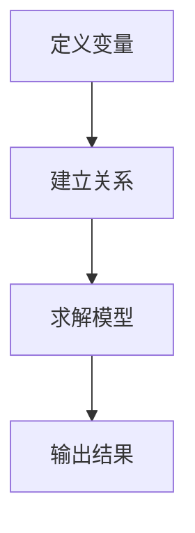
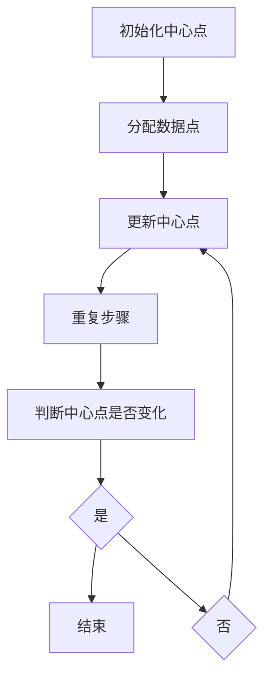
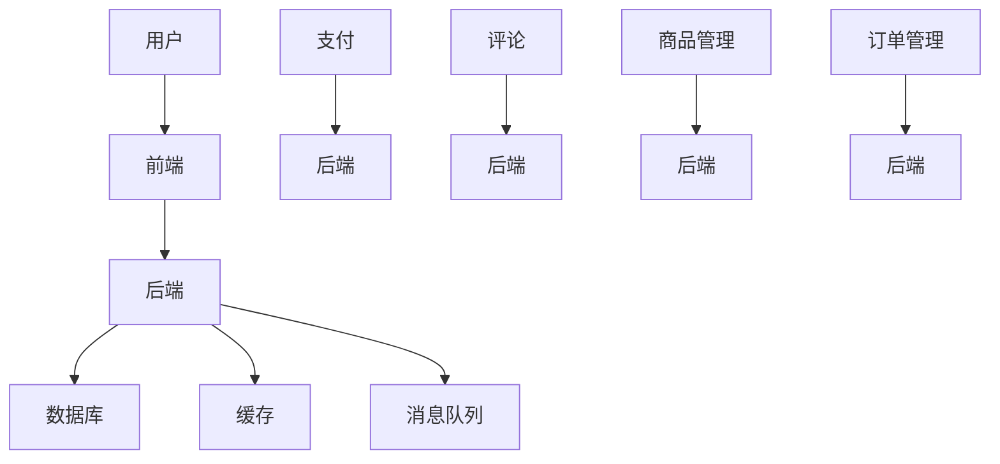

                 

### 数学思维与系统思考能力的培养

> 关键词：数学思维、系统思考、能力培养、IT领域、算法、模型、架构设计

> 摘要：本文将探讨数学思维与系统思考能力的培养，如何通过数学工具和系统方法提升IT领域的专业能力。文章将首先介绍数学思维的基础概念和原理，然后深入分析系统思考的基本原则和重要性，接着通过具体案例展示数学思维和系统思考在算法、模型和架构设计中的应用，最后总结最佳实践和未来展望。

### 引言

在当今高度复杂和快速变化的信息技术领域，数学思维与系统思考能力变得尤为重要。数学思维强调逻辑严密、推理精准和抽象能力，它不仅为算法设计、模型构建和数据分析提供了坚实的基础，还培养了程序员解决复杂问题的能力。系统思考则强调从整体角度理解系统的结构和功能，通过识别反馈循环和关键变量来预测系统的行为，这对于架构设计和项目管理至关重要。

本文旨在通过以下几个步骤详细探讨数学思维与系统思考能力的培养：

1. **数学思维的基础概念和原理**：介绍数学思维的核心概念，如逻辑推理、抽象思考和量化分析，并探讨其与IT领域的相关性。
2. **系统思考的基本原则**：阐述系统思考的基本概念，如反馈循环、关键变量和整体视角，并解释其在IT项目中的应用。
3. **数学思维在算法和模型中的应用**：通过具体案例，展示数学思维如何用于算法设计和模型构建，并提供实用的Python代码示例。
4. **系统思考在架构设计中的应用**：介绍系统思考在架构设计中的重要性，并通过Mermaid图展示架构设计流程和系统接口设计。
5. **案例分析**：提供实际项目案例，分析数学思维和系统思考在实际项目中的应用，并进行深入探讨。
6. **总结与未来展望**：总结本文的主要观点，提出最佳实践建议，并展望数学思维和系统思考在IT领域的未来发展。

### 数学思维的基础概念和原理

数学思维是一种以数学为基础，通过逻辑推理、抽象思考和量化分析来解决实际问题的思维方式。在IT领域，数学思维的重要性不言而喻，它不仅为算法设计、模型构建和数据挖掘提供了理论依据，还提高了程序员解决复杂问题的能力。

#### 逻辑推理

逻辑推理是数学思维的核心之一。它通过一系列逻辑规则和推理步骤，从已知的事实或假设中得出新的结论。在IT领域，逻辑推理广泛应用于算法设计、测试用例编写和问题排查。例如，在编写一个排序算法时，程序员需要通过逻辑推理确保算法能够在所有情况下正确执行。

#### 抽象思考

抽象思考是数学思维的另一个重要方面。它涉及将具体的问题转化为抽象的数学模型，以便更好地分析和解决。在IT领域，抽象思考帮助程序员从复杂的数据结构和算法中提炼出核心的逻辑和结构。例如，在处理大数据时，程序员需要通过抽象思考将大规模数据分解为可管理的子集。

#### 量化分析

量化分析是数学思维的重要组成部分，它通过使用数学工具和公式来量化问题和解决方案。在IT领域，量化分析广泛应用于性能优化、成本分析和风险控制。例如，在性能优化中，程序员需要通过量化分析来确定系统瓶颈，从而采取相应的优化措施。

#### 数学思维与IT领域的相关性

数学思维在IT领域的应用范围非常广泛，包括但不限于以下几个方面：

1. **算法设计**：数学思维为算法设计提供了理论支持，帮助程序员构建高效的算法。
2. **数据挖掘**：数学思维使程序员能够更好地理解和处理复杂数据，提取有用的信息。
3. **性能优化**：通过量化分析，程序员可以更准确地识别系统瓶颈，从而优化性能。
4. **风险管理**：数学思维帮助程序员评估和降低项目风险。

#### 案例分析

为了更好地理解数学思维在IT领域的应用，我们可以通过一个具体的案例来分析。假设我们需要设计一个推荐系统，该系统需要根据用户的历史行为数据推荐产品。以下是一个简化的步骤：

1. **数据预处理**：首先，我们需要对用户的历史行为数据（如购买记录、浏览记录等）进行预处理，将其转换为可供分析的格式。
2. **特征提取**：接下来，我们需要从预处理后的数据中提取关键特征，如用户的购买频率、偏好类别等。
3. **模型构建**：基于提取的特征，我们构建一个推荐模型。这通常涉及机器学习算法，如协同过滤、决策树等。
4. **模型评估**：通过测试集评估模型的效果，调整参数以优化模型性能。
5. **部署应用**：最后，将优化后的模型部署到生产环境中，为用户提供个性化推荐。

在这个案例中，数学思维的应用体现在以下几个方面：

- **逻辑推理**：在数据预处理和特征提取阶段，程序员需要使用逻辑推理来确保数据的准确性和一致性。
- **抽象思考**：通过将具体的数据和问题抽象为数学模型，程序员可以更轻松地分析和解决复杂问题。
- **量化分析**：在模型评估和参数调整阶段，程序员需要使用量化分析来评估模型性能，并进行优化。

### 系统思考的基本原则

系统思考是一种从整体角度理解和解决复杂问题的思维方式。它强调识别系统的各个组成部分及其相互关系，通过理解系统的动态行为来预测和影响系统的未来状态。在IT领域，系统思考对于架构设计、项目管理和技术决策至关重要。

#### 反馈循环

反馈循环是系统思考的核心概念之一。它描述了系统内部或系统与环境之间的信息交换和调节过程。反馈循环可以是正反馈（增强系统行为）或负反馈（抑制系统行为）。在IT项目中，反馈循环常见于性能监控、用户反馈和需求迭代。

1. **正反馈循环**：例如，在电商网站的推荐系统中，用户对推荐商品的点击和购买行为会增强推荐算法的推荐效果，形成正反馈循环。
2. **负反馈循环**：例如，在系统性能监控中，系统检测到高负载时会自动触发优化策略，从而降低负载，形成负反馈循环。

#### 关键变量

关键变量是影响系统行为的关键因素。在系统思考中，识别关键变量有助于理解系统的动态行为和预测系统状态。在IT项目中，关键变量可能包括性能指标、资源利用率、用户满意度等。

1. **性能指标**：例如，在一个电子商务平台上，关键变量可能是页面加载时间、响应时间和交易处理速度。
2. **资源利用率**：例如，在一个数据中心中，关键变量可能是服务器利用率、网络带宽利用率等。

#### 整体视角

系统思考强调从整体角度理解系统，而不是仅仅关注单个组件。这种整体视角有助于识别系统中的复杂性和相互依赖关系。

1. **系统架构设计**：在系统架构设计中，整体视角有助于识别关键组件及其交互关系，从而构建灵活、可扩展的系统。
2. **项目管理**：在项目管理中，整体视角有助于识别项目中的关键任务和依赖关系，从而优化项目进度和资源分配。

#### 系统思考在IT项目中的应用

系统思考在IT项目中的应用非常广泛，以下是一些具体的例子：

1. **性能优化**：通过分析系统的反馈循环和关键变量，可以识别系统瓶颈并进行优化。
2. **需求迭代**：通过系统思考，可以更好地理解用户需求，并将其转化为具体的系统功能。
3. **风险管理**：通过识别系统中的关键变量和潜在风险，可以制定有效的风险应对策略。

#### 案例分析

为了更好地理解系统思考在IT项目中的应用，我们可以通过一个电子商务平台的性能优化案例来分析。

**案例背景**：一个电子商务平台在促销期间遇到了严重的性能瓶颈，导致用户访问速度缓慢，用户体验下降。

**分析步骤**：

1. **识别反馈循环**：分析系统的反馈循环，发现用户访问高峰期会导致服务器负载急剧增加，形成正反馈循环。
2. **确定关键变量**：识别关键变量，如服务器负载、数据库查询延迟、缓存命中率等。
3. **性能优化策略**：根据关键变量的分析结果，采取以下策略：
   - **增加服务器资源**：通过垂直和水平扩展增加服务器资源，提高处理能力。
   - **数据库优化**：优化数据库查询，使用索引和缓存减少查询延迟。
   - **缓存策略**：引入分布式缓存，减少对数据库的依赖。
   - **负载均衡**：使用负载均衡器分散用户访问，降低单个服务器的负载。

**效果评估**：通过上述优化措施，平台性能得到了显著提升，用户访问速度加快，用户体验得到改善。

### 数学思维在算法和模型中的应用

数学思维在算法和模型中的应用是IT领域中不可或缺的一部分。通过数学工具和公式，程序员可以更精确地描述问题，构建高效的算法和模型，从而解决复杂的实际问题。

#### 数学模型的基本原理

数学模型是一种用数学语言描述现实世界问题的方法。它通过定义变量、关系和约束，将实际问题转化为数学问题。数学模型的基本原理包括以下几个步骤：

1. **定义变量**：确定问题中的主要变量，如输入变量、输出变量和中间变量。
2. **建立关系**：根据问题背景和条件，建立变量之间的关系，通常使用函数或方程表示。
3. **设定约束**：确定问题的约束条件，如资源的限制、时间的要求等。
4. **求解模型**：使用数学工具和算法求解模型，得到变量的最优解。

#### 数学模型在算法设计中的应用

数学模型在算法设计中扮演着关键角色。以下是一些常见的数学模型及其在算法中的应用：

1. **线性规划**：用于解决资源分配和优化问题。例如，在项目管理中，线性规划可以用于确定项目的最优进度安排。
2. **决策树**：用于分类和回归问题。决策树通过递归划分数据集，构建树状结构，以便预测目标变量的值。
3. **神经网络**：用于复杂的数据分析和模式识别。神经网络通过多层神经元和激活函数，模拟人脑的决策过程。

#### 算法原理讲解与Python代码示例

为了更好地理解数学模型在算法设计中的应用，以下通过一个简单的线性规划案例进行讲解。

**案例**：假设我们需要设计一个背包问题求解器，目标是选择一定数量的物品放入背包中，使得总价值最大。

**步骤**：

1. **定义变量**：设$x_i$为放入背包中的第$i$个物品的数量，$v_i$为第$i$个物品的价值，$w_i$为第$i$个物品的重量，$C$为背包的容量。
2. **建立关系**：建立目标函数和约束条件：
   $$\max z = \sum_{i=1}^{n} v_i x_i$$
   $$\sum_{i=1}^{n} w_i x_i \leq C$$
   $$x_i \geq 0, \forall i$$
3. **求解模型**：使用Python的线性规划库`scipy.optimize`求解上述模型。

**Python代码示例**：

```python
import numpy as np
from scipy.optimize import linprog

# 参数设置
c = [-1] * n  # 目标函数系数，最大化价值
A = [[0] * n for _ in range(n)]  # 约束条件矩阵
b = [1] * n  # 约束条件向量
x0 = [0] * n  # 初始解

# 求解线性规划问题
result = linprog(c, A_ub=A, b_ub=b, x0=x0, method='highs')

# 输出结果
if result.success:
    print("最优解：", result.x)
    print("最大价值：", -result.fun)
else:
    print("求解失败：", result.message)
```

**Mermaid流程图**：



#### 数学思维在数据挖掘中的应用

数学思维在数据挖掘中同样发挥着重要作用。以下通过一个简单的聚类算法案例进行讲解。

**案例**：使用K-means算法对一组数据进行聚类。

**步骤**：

1. **初始化中心点**：随机选择K个数据点作为初始中心点。
2. **分配数据点**：将每个数据点分配到距离其最近的中心点所在的簇。
3. **更新中心点**：计算每个簇的质心，将其作为新的中心点。
4. **重复步骤2和3，直至中心点不再变化**。

**Python代码示例**：

```python
import numpy as np

# 数据集
data = np.array([[1, 2], [1, 4], [1, 0], [10, 2], [10, 4], [10, 0]])

# 初始化中心点
centroids = data[np.random.choice(data.shape[0], k, replace=False)]

# K-means算法
for i in range(100):
    # 计算距离
    distances = np.linalg.norm(data - centroids, axis=1)
    # 分配数据点
    labels = np.argmin(distances, axis=1)
    # 更新中心点
    new_centroids = np.array([data[labels == k].mean(axis=0) for k in range(k)])
    # 判断中心点是否变化
    if np.all(centroids == new_centroids):
        break
    centroids = new_centroids

# 输出结果
print("聚类中心点：", centroids)
print("聚类结果：", labels)
```

**Mermaid流程图**：



### 系统思考在架构设计中的应用

系统思考在架构设计中的应用至关重要，它帮助工程师从整体视角理解系统的结构和功能，从而构建灵活、可扩展和高效的系统。以下是系统思考在架构设计中的应用：

#### 系统架构设计的基本原则

1. **模块化**：将系统分解为多个模块，每个模块负责特定的功能，便于维护和扩展。
2. **解耦**：减少模块之间的依赖关系，提高系统的灵活性和可维护性。
3. **可扩展性**：设计可扩展的系统架构，以应对未来需求的变化。
4. **容错性**：设计具有容错能力的系统，确保在故障发生时系统能够正常运行。

#### 系统架构设计的过程

系统架构设计通常包括以下步骤：

1. **需求分析**：明确系统的功能需求、性能要求和安全需求等。
2. **领域模型**：使用Mermaid绘制领域模型类图，识别系统的主要实体和关系。
3. **系统架构设计**：使用Mermaid绘制系统架构图，明确系统的关键组件和交互关系。
4. **接口设计**：设计系统的接口，确保模块之间的通信和协作。
5. **测试与优化**：通过测试和优化确保系统架构的有效性和性能。

#### 案例分析

以下通过一个在线购物平台的项目案例，展示系统思考在架构设计中的应用。

**案例背景**：设计一个能够处理海量用户请求的在线购物平台，确保系统的高性能、高可用性和可扩展性。

**步骤**：

1. **需求分析**：
   - 功能需求：商品浏览、购物车、订单管理、支付、用户评论等。
   - 性能要求：响应时间小于1秒，支持百万级并发用户。
   - 安全需求：保护用户隐私，确保交易安全。

2. **领域模型**：
   - 使用Mermaid绘制领域模型类图，识别实体如用户、商品、订单、评论等，以及它们之间的关系。

3. **系统架构设计**：
   - 使用Mermaid绘制系统架构图，包括前端、后端、数据库、缓存、消息队列等关键组件。
   - 明确各组件之间的交互关系和通信协议。

4. **接口设计**：
   - 设计API接口，定义数据格式和通信协议，确保模块之间的协作。

5. **测试与优化**：
   - 通过性能测试和压力测试验证系统性能，优化架构和代码。
   - 识别潜在风险和瓶颈，采取相应措施进行优化。

**Mermaid图示例**：



### 案例分析：数学思维与系统思考在实际项目中的应用

为了更好地展示数学思维与系统思考在实际项目中的应用，以下通过一个电子商务平台的项目案例进行分析。

**案例背景**：一家电子商务平台在高峰期遇到了严重的性能问题，导致用户访问速度缓慢，用户体验下降。

**问题分析**：

1. **性能瓶颈**：通过性能分析，发现系统在高峰期存在以下几个瓶颈：
   - **数据库查询延迟**：频繁的数据库查询导致响应时间过长。
   - **缓存失效**：缓存失效导致需要重新查询数据库，增加查询负载。
   - **负载不均**：部分服务器负载过高，而其他服务器资源闲置。

2. **系统架构问题**：通过系统思考，发现系统架构存在以下几个问题：
   - **解耦不足**：部分模块之间的依赖关系过于紧密，导致性能瓶颈无法有效隔离。
   - **可扩展性差**：系统设计缺乏弹性，无法应对突发流量。

**解决方案**：

1. **性能优化**：
   - **数据库优化**：通过索引优化、查询缓存和读写分离等手段降低数据库查询延迟。
   - **缓存优化**：增加缓存命中率，减少数据库查询次数。
   - **负载均衡**：使用负载均衡器分散用户访问，确保服务器负载均衡。

2. **系统架构优化**：
   - **模块化**：将系统分解为多个独立模块，降低模块之间的依赖关系。
   - **可扩展性**：引入分布式架构，提高系统的扩展性和弹性。

**实施过程**：

1. **性能优化实施**：
   - **数据库优化**：通过分析数据库查询日志，发现频繁的查询语句，并对其进行优化。
   - **缓存优化**：引入Redis缓存，缓存热点数据，减少数据库查询次数。
   - **负载均衡**：使用Nginx负载均衡器，根据用户地理位置和服务器负载均衡分配请求。

2. **系统架构优化实施**：
   - **模块化**：将订单管理、商品管理、用户评论等模块独立部署，降低模块之间的依赖关系。
   - **可扩展性**：使用Kubernetes进行容器编排，实现系统的弹性扩展。

**效果评估**：

1. **性能提升**：通过上述优化措施，系统的响应时间显著降低，用户访问速度得到明显提升。
2. **系统稳定性**：系统的可扩展性和容错性得到显著提升，在高峰期能够稳定运行。

### 总结与未来展望

本文通过详细的分析和案例分析，展示了数学思维与系统思考在IT领域的广泛应用和重要性。数学思维为算法设计、模型构建和数据分析提供了理论基础，而系统思考则帮助工程师从整体视角理解和解决复杂问题。

**最佳实践**：

1. **培养数学思维**：通过学习数学原理和算法，提高逻辑推理和抽象思考能力。
2. **应用系统思考**：在项目设计中，从整体视角分析系统的结构和功能，优化系统性能和可扩展性。

**未来展望**：

1. **人工智能与数学思维的结合**：随着人工智能的发展，数学思维将在人工智能算法设计和优化中发挥越来越重要的作用。
2. **系统思考在敏捷开发中的应用**：在敏捷开发中，系统思考将帮助团队更好地应对变化，提高项目成功率。

通过本文的探讨，我们希望能够为读者提供关于数学思维与系统思考的深入理解，并激发其在实际项目中的应用。

### 作者信息

作者：AI天才研究院/AI Genius Institute & 禅与计算机程序设计艺术 /Zen And The Art of Computer Programming

### 注意事项

1. **深入理解核心概念**：在应用数学思维和系统思考时，确保对核心概念有深入的理解。
2. **持续学习和实践**：数学思维和系统思考是不断发展的领域，需要持续学习和实践。
3. **注重团队合作**：在项目实践中，团队合作和沟通至关重要，有助于发挥数学思维和系统思考的优势。

### 拓展阅读

1. **《数学之美》[美] 傅伯杰**：一本深入浅出的数学思维书籍，适合希望提高数学思维能力的读者。
2. **《系统思考》[美] 戴维·弗里德曼**：介绍系统思考的基本原理和应用，适合希望提高系统思考能力的读者。
3. **《大话数据挖掘》[美] 詹姆斯·格利克曼**：一本关于数据挖掘的入门书籍，涵盖数学思维在数据挖掘中的应用。

### 结束语

本文通过详细的分析和案例分析，探讨了数学思维与系统思考在IT领域的应用。希望读者能够通过本文的学习，提高自己的数学思维和系统思考能力，更好地应对复杂的问题和项目挑战。

