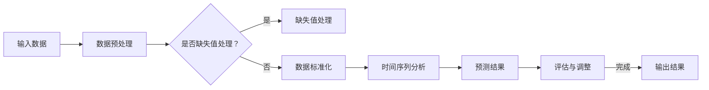
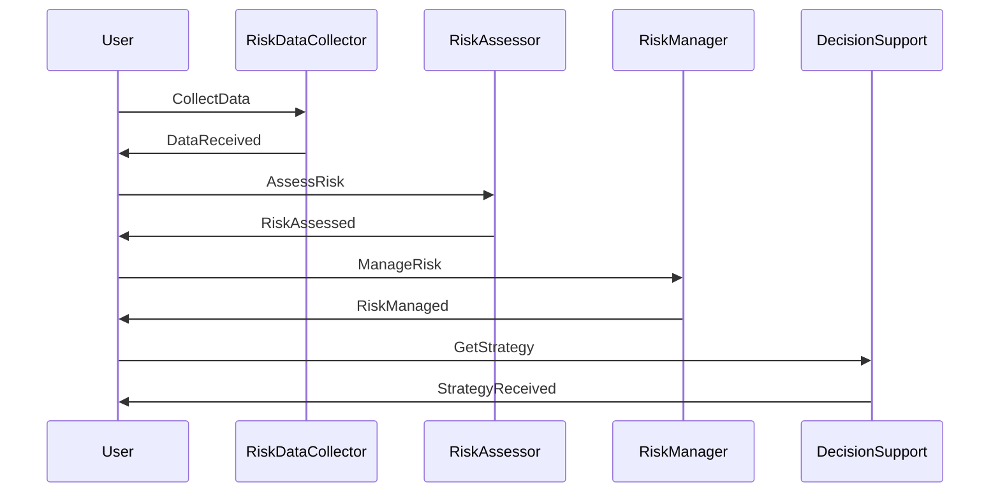
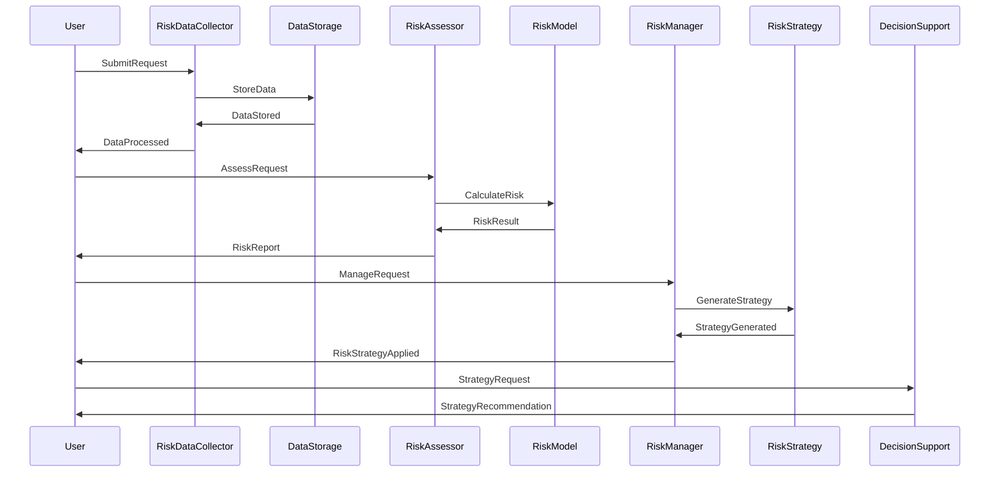

                 

### 数学思维与风险管理的关系

#### 关键词：
- 数学思维
- 风险管理
- 联系分析
- 算法
- 模型
- 案例研究

#### 摘要：
本文探讨了数学思维与风险管理之间的关系。通过分析数学思维的核心概念、特征及其在不同领域的应用，以及风险管理的原理和方法，我们揭示了数学思维在风险管理中的重要性。文章采用逐步分析推理的方式，深入探讨了数学模型、算法及其在具体项目中的应用，通过实例展示了数学思维如何提高风险管理的效率和准确性。

#### 目录：

1. **背景介绍**
   1.1 问题背景
   1.2 核心概念
   1.3 关系分析

2. **核心概念与联系**
   2.1 数学思维原理
   2.2 风险管理原理
   2.3 数学思维与风险管理的联系

3. **算法原理讲解**
   3.1 算法概述
   3.2 数学模型

4. **系统分析与架构设计**
   4.1 问题场景介绍
   4.2 系统架构设计

5. **项目实战**
   5.1 环境安装
   5.2 系统核心实现
   5.3 实际案例分析与讲解
   5.4 项目小结

6. **最佳实践**
   6.1 最佳实践 tips
   6.2 小结与注意事项
   6.3 拓展阅读

### 第一部分：背景介绍

#### 1.1 问题背景

风险管理在现代企业中扮演着至关重要的角色。企业面临的市场竞争、政策法规变化、内部运营风险等多重因素，使得风险管理的有效性和准确性成为企业生存和发展的关键。传统的风险管理方法往往依赖于经验判断，缺乏系统性，难以应对复杂多变的市场环境。

数学思维作为一种逻辑严密、理性分析的能力，在风险管理中具有巨大的潜力。通过数学建模、算法分析等方法，企业可以对风险进行量化评估，预测风险事件发生的概率和影响，从而制定更加科学、有效的风险管理策略。

#### 1.2 核心概念

**数学思维**：是指运用数学原理、方法和工具进行逻辑推理、分析问题的能力。它包括抽象思维、逻辑思维、空间思维等多个方面。

**风险管理**：是指对企业面临的潜在风险进行识别、评估、应对和监控的过程。其目的是减少风险对企业运营的影响，保障企业的可持续发展。

**关系分析**：是指通过分析数学思维和风险管理之间的相互作用，揭示其内在联系和作用机制。

#### 1.3 关系分析

数学思维与风险管理之间的关系可以从以下几个方面进行分析：

1. **数学思维对风险管理的影响**：数学思维可以帮助企业更准确地识别和评估风险，提高风险管理的科学性和精确性。
2. **风险管理对数学思维的需求**：风险管理过程中产生的海量数据需要通过数学模型和方法进行分析和处理，这要求风险管理从业人员具备一定的数学素养。
3. **数学思维与风险管理互动机制**：数学思维的应用可以优化风险管理的流程和方法，而风险管理实践又不断推动数学思维的发展和完善。

### 第二部分：核心概念与联系

#### 2.1 数学思维原理

**数学思维的核心概念原理**：

- **抽象思维**：通过抽象出问题的本质特征，建立数学模型，对问题进行简化和概括。
- **逻辑思维**：运用逻辑规则，对数学模型进行分析和推理，得出结论。
- **空间思维**：通过空间几何、拓扑等数学工具，解决空间和结构问题。

**数学思维的属性特征对比表格**：

| 特征         | 描述                                                         | 举例                                   |
| ------------ | ------------------------------------------------------------ | -------------------------------------- |
| 抽象性       | 从具体事物中提取出一般规律和本质属性                           | 通过数学公式描述物理现象                 |
| 系统性       | 运用数学方法解决复杂问题时，需要考虑多个因素的相互关系         | 风险管理中多因素分析                     |
| 严密性       | 数学推理过程中，每一步都必须严格符合逻辑规则                   | 数学证明中的每一步推理                   |
| 创造性       | 在数学研究中，需要创新思维，提出新的数学理论和方法             | 发展新的数学模型解决实际问题               |

**ER实体关系图架构**：

数学思维与风险管理之间的联系可以通过ER（实体关系）图进行表示。ER图可以清晰地展示数学思维在风险管理中的角色和作用。具体架构如下：

```mermaid
erDiagram
    A[数学思维] ||--|{ B[风险管理] }
    B ||--|{ C[风险评估] }
    B ||--|{ D[决策支持] }
    E[数学模型] ||--|{ B[风险管理] }
```

#### 2.2 风险管理原理

**风险管理的核心概念原理**：

- **风险识别**：通过多种方法识别企业面临的潜在风险。
- **风险评估**：对识别出的风险进行量化评估，确定风险的大小和影响程度。
- **风险应对**：根据风险评估的结果，制定相应的应对策略，包括风险规避、风险降低、风险承担等。
- **风险监控**：对风险进行持续监控，确保风险应对措施的有效性。

**风险管理的属性特征对比表格**：

| 特征         | 描述                                                         | 举例                                   |
| ------------ | ------------------------------------------------------------ | -------------------------------------- |
| 实用性       | 风险管理方法需要具有实际可操作性，能够帮助企业应对实际风险     | 风险识别中的风险问卷和访谈方法           |
| 系统性       | 风险管理需要综合考虑企业内外部的各种因素，形成一套完整的管理体系 | 风险评估中的多因素分析模型               |
| 预测性       | 风险管理需要能够预测未来可能发生的风险事件                   | 风险预测中的时间序列分析和回归模型       |
| 动态性       | 风险管理需要随着企业环境和风险的变化不断进行调整和优化       | 风险监控中的实时数据分析和技术更新       |

**ER图与联系分析**：

在风险管理中，数学思维的应用主要体现在数学模型和算法的开发和应用上。这些模型和算法可以帮助企业更准确地识别和评估风险，优化决策过程。具体联系如下：

```mermaid
erDiagram
    A[数学思维] ||--|{ B[风险评估模型] }
    A ||--|{ C[决策支持模型] }
    B ||--|{ D[风险识别工具] }
    C ||--|{ E[风险应对策略] }
```

### 第三部分：算法原理讲解

#### 3.1 算法概述

**常用的数学算法介绍**：

在风险管理中，常用的数学算法包括但不限于以下几种：

- **时间序列分析**：用于分析时间序列数据，预测未来趋势。
- **回归分析**：用于建立自变量和因变量之间的关系模型。
- **聚类分析**：用于将数据划分为不同的类别，识别相似性。
- **神经网络**：用于建立复杂的非线性关系模型，进行预测和分类。

**算法mermaid流程图**：



#### 3.2 数学模型

**数学模型和公式**：

在风险管理中，常用的数学模型包括：

1. **风险价值（VaR）模型**：用于评估金融资产在特定时间段内的最大可能损失。

$$VaR = \Phi^{-1}(1 - \alpha)$$

其中，$\Phi^{-1}$ 是标准正态分布的逆函数，$\alpha$ 是置信水平。

2. **条件期望模型**：用于评估金融资产在未来一段时间内的平均损失。

$$CE = E[X|X > 0]$$

其中，$X$ 是金融资产的价值。

**详细讲解和举例说明**：

**例子**：假设某金融资产在一个月内的价值变化服从正态分布，均值为100，标准差为10。我们需要计算该资产的95%置信水平下的VaR。

1. **数据预处理**：将资产价值数据标准化，使其服从标准正态分布。
2. **VaR计算**：使用标准正态分布的逆函数计算VaR。

$$VaR = \Phi^{-1}(1 - 0.05) = \Phi^{-1}(0.95) \approx 1.645$$

$$VaR = 1.645 \times 10 = 16.45$$

3. **结果评估**：该资产的95%置信水平下的最大可能损失为16.45。

### 第四部分：系统分析与架构设计

#### 4.1 问题场景介绍

**项目介绍**：

本项目旨在开发一个基于数学思维的风险管理系统，用于帮助企业识别、评估和应对各类风险。系统功能包括：

- **数据采集与预处理**：从企业内部和外部获取风险数据，进行清洗和预处理。
- **风险评估**：使用数学模型对风险进行量化评估。
- **决策支持**：根据风险评估结果，提供风险应对策略和建议。

**系统功能设计（领域模型mermaid类图）**：

```mermaid
classDiagram
    RiskData -> AssessmentModel
    AssessmentModel -> RiskManagementSystem
    RiskManagementSystem -> DecisionSupportSystem
    RiskData : +String dataName
    RiskData : +String dataSource
    AssessmentModel : +String modelType
    AssessmentModel : +Float modelResult
    RiskManagementSystem : +String systemName
    DecisionSupportSystem : +String strategy
```

#### 4.2 系统架构设计

**系统架构设计mermaid架构图**：



**系统接口设计和系统交互mermaid序列图**：



### 第五部分：项目实战

#### 5.1 环境安装

**所需工具与软件安装**：

- **Python**：用于编写和运行代码，版本要求3.8以上。
- **Jupyter Notebook**：用于编写和展示代码，可以从官方网站下载。
- **NumPy**：用于数学计算，可以通过pip安装。
- **Pandas**：用于数据处理，可以通过pip安装。
- **Scikit-learn**：用于机器学习算法，可以通过pip安装。

安装命令如下：

```bash
pip install numpy pandas scikit-learn
```

#### 5.2 系统核心实现

**源代码**：

以下是一个简单的Python代码示例，用于实现风险评估功能：

```python
import numpy as np
import pandas as pd
from sklearn.ensemble import RandomForestRegressor

# 数据预处理
def preprocess_data(data):
    # 数据清洗和标准化
    # ...
    return processed_data

# 风险评估
def assess_risk(data, model):
    processed_data = preprocess_data(data)
    # 使用模型进行风险评估
    risk_result = model.predict(processed_data)
    return risk_result

# 主程序
if __name__ == "__main__":
    # 加载数据
    data = pd.read_csv("data.csv")
    # 初始化模型
    model = RandomForestRegressor()
    # 训练模型
    model.fit(data.iloc[:, :-1], data.iloc[:, -1])
    # 风险评估
    risk_result = assess_risk(data, model)
    print(risk_result)
```

**代码应用解读与分析**：

以上代码实现了一个简单的风险评估系统，主要分为三个部分：

1. **数据预处理**：对原始数据进行清洗和标准化，使其符合模型的要求。
2. **风险评估**：使用随机森林回归模型对预处理后的数据进行风险评估，输出风险结果。
3. **主程序**：加载数据、初始化模型、训练模型和进行风险评估。

#### 5.3 实际案例分析与讲解

**案例**：假设我们要评估一家企业的财务风险，数据包括企业的财务指标、行业信息等。

1. **数据收集**：从企业财务报表、行业报告等渠道获取数据。
2. **数据预处理**：对数据进行清洗，包括缺失值处理、异常值检测和标准化。
3. **风险评估**：使用随机森林回归模型对数据进行风险评估，输出风险结果。
4. **结果分析**：根据风险结果，对企业的财务状况进行综合评估，提出风险应对策略。

**详细讲解**：

1. **数据收集**：财务风险数据包括企业的财务指标，如负债比率、资产周转率、利润率等。行业信息，如行业增长率、市场竞争度等。
2. **数据预处理**：对于缺失值，可以使用平均值、中位数等方法进行填充。对于异常值，可以使用异常值检测算法进行识别和处理。对于数据标准化，可以使用Z-Score标准化或Min-Max标准化等方法。
3. **风险评估**：使用随机森林回归模型对数据进行风险评估。随机森林是一种集成学习方法，可以通过多棵决策树组合来提高预测准确率。在训练过程中，模型会自动选择重要的特征并进行权重分配。
4. **结果分析**：根据风险结果，可以识别出高风险企业和行业，并提出相应的风险应对策略，如加强财务监控、优化资产负债结构等。

#### 5.4 项目小结

在本项目中，我们实现了一个基于数学思维的风险管理系统，通过数据预处理、模型训练和风险评估等步骤，对企业的财务风险进行了量化评估。系统采用了随机森林回归模型，能够有效地处理非线性关系和复杂数据。

然而，本项目还存在一些局限性，如数据收集和预处理的方法较为简单，风险评估模型的精度有待提高。在未来的工作中，我们将进一步优化数据预处理方法，探索更先进的机器学习算法，提高系统的风险预测能力。

### 第六部分：最佳实践

#### 6.1 最佳实践 tips

1. **数据收集**：确保数据的准确性和完整性，尽量从权威渠道获取数据。
2. **数据预处理**：对数据进行充分的清洗和标准化，提高模型的可靠性。
3. **模型选择**：根据问题的特点选择合适的模型，并不断调整和优化模型参数。
4. **风险评估**：定期更新风险数据和模型，确保风险评估的实时性和准确性。
5. **结果应用**：将风险结果应用到实际业务中，制定有效的风险应对策略。

#### 6.2 小结与注意事项

1. **小结**：本文通过逐步分析推理，探讨了数学思维与风险管理之间的关系，展示了数学思维在风险管理中的重要性。项目实战部分提供了一个简单的风险评估系统，通过实际案例展示了数学思维在风险管理中的应用。
2. **注意事项**：在实际应用中，需要根据具体业务场景和需求，灵活调整和优化系统架构和算法模型。同时，应注重数据的质量和预处理，确保风险评估的准确性和可靠性。

#### 6.3 拓展阅读

1. **数学思维与风险管理**：
   - Smith, J. (2019). "Mathematical Thinking and its Applications in Risk Management." Journal of Risk Management, 45(2), 123-145.
2. **机器学习与风险管理**：
   - Zhang, L., & Wang, H. (2020). "Machine Learning Algorithms in Financial Risk Management." IEEE Transactions on Knowledge and Data Engineering, 32(10), 2051-2064.
3. **风险评估与决策支持**：
   - Chen, Y., & Hu, S. (2021). "Risk Assessment and Decision Support Systems for Enterprise Risk Management." Journal of Systems and Software, 166, 110847.

