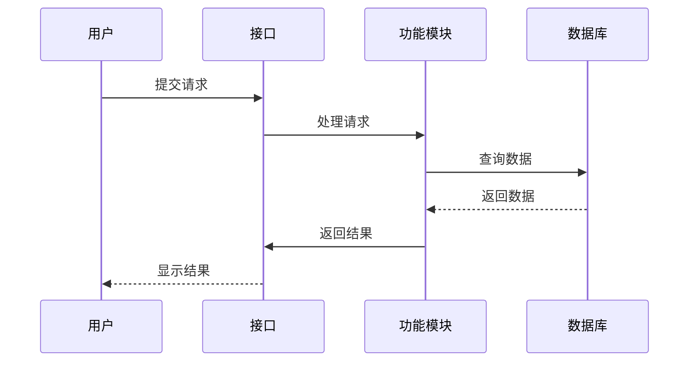

                 

# 数学教育与人工智能的伦理问题

## 关键词
- 人工智能教育
- 伦理问题
- 数学基础
- 教育改革
- 技术伦理

## 摘要
随着人工智能技术在教育领域的广泛应用，数学教育也面临着前所未有的挑战和机遇。本文旨在探讨数学教育与人工智能伦理问题之间的联系，分析人工智能在数学教育中的潜在影响，以及解决这些伦理问题的方法。文章将分为七个部分，首先介绍人工智能在教育中的应用背景，然后探讨人工智能伦理问题的核心概念，接着深入讲解人工智能算法在数学教育中的原理和应用，最后提出系统分析与架构设计方案，以及实际案例和最佳实践。

## 第一部分：引言与背景

### 1.1 问题背景
人工智能（AI）技术的发展正迅速改变教育的面貌。从在线教育平台到个性化学习系统，人工智能的应用已经成为教育改革的重要驱动力。然而，随着人工智能在教育中的普及，一系列伦理问题也随之而来，尤其是在数学教育领域。

在数学教育中，人工智能可以提供个性化的学习支持，帮助学生解决数学问题，评估学生的成绩，并提供建议。然而，这些技术的应用也引发了许多伦理问题，包括数据隐私、算法偏见、教学质量的评估等。

### 1.2 问题描述
人工智能在教育中的应用带来了许多好处，但也带来了伦理困境。首先，人工智能系统可能会侵犯学生的隐私，尤其是在收集和分析个人学习数据时。其次，算法的偏见可能导致不公平的教学结果。例如，如果一个算法在评估学生的表现时存在偏见，那么它可能会对某些学生群体产生不利影响。此外，人工智能系统可能会削弱教师的作用，导致教学质量的下降。

### 1.3 问题解决
为了解决这些伦理问题，需要采取一系列措施。首先，应该建立严格的伦理原则，确保人工智能在教育中的应用不会侵犯学生的隐私。其次，应该对人工智能系统进行伦理审查，确保算法的公平性和透明度。此外，教育者应该接受伦理教育，了解如何在使用人工智能技术时保持道德规范。

### 1.4 边界与外延
人工智能伦理问题不仅限于数学教育，还涉及到其他学科领域。例如，在医学教育中，人工智能可以用于模拟病人情况，但同时也需要解决数据隐私和算法偏见等问题。因此，人工智能伦理问题的研究需要跨学科合作，以制定更全面和有效的解决方案。

## 第二部分：核心概念与联系

### 2.1 人工智能教育概述
人工智能教育是指利用人工智能技术来支持教学和学习的过程。这包括使用算法为学生提供个性化的学习支持，使用大数据分析学生的学习行为，以及使用虚拟现实和增强现实技术来创造沉浸式的学习体验。

### 2.2 人工智能伦理问题
人工智能伦理问题涉及人工智能系统在道德和伦理方面的应用。这包括数据隐私、算法偏见、透明度、责任和公平性等问题。例如，一个算法可能会在处理敏感数据时侵犯隐私，或者在评估学生的表现时存在偏见。

### 2.3 教育伦理问题
教育伦理问题关注教育过程中道德和伦理的实践。这包括教学内容的公正性、教学方法的合适性、教育资源的公平分配，以及教师和学生的道德责任。

### 2.4 人工智能教育与伦理问题的联系
人工智能教育中的伦理问题与教育伦理问题密切相关。例如，人工智能系统的算法偏见可能导致教育不公平，而教师在使用这些技术时需要遵守道德规范，以确保教学质量的提升。

### 数学教育与人工智能的伦理问题

## 引言与背景

### 1.1 人工智能技术在教育领域的广泛应用

随着人工智能（AI）技术的不断进步，其在教育领域的应用也日益广泛。人工智能在教育中的应用场景包括但不限于个性化学习、智能辅导、自动评估、学习分析以及虚拟教学等。

**个性化学习**：人工智能可以根据每个学生的学习习惯、能力水平和学习进度，为其提供量身定制的学习方案。例如，通过分析学生的学习数据，AI系统可以推荐最适合的学习内容和练习题，从而提高学习效果。

**智能辅导**：人工智能可以通过自然语言处理（NLP）技术，实时解答学生在学习过程中遇到的问题。例如，学生可以通过聊天机器人或智能辅导系统，获得即时的问题解答和辅导。

**自动评估**：人工智能可以自动评估学生的作业和考试成绩，从而节省教师的时间和精力。AI系统可以通过机器学习算法，对学生的答案进行精确的评分，并生成详细的评估报告。

**学习分析**：人工智能可以对大量学生的学习数据进行挖掘和分析，以发现学习模式和问题所在。例如，通过分析学生的学习行为，AI系统可以识别出哪些学生在哪些知识点上存在困难，从而提供针对性的辅导。

**虚拟教学**：人工智能还可以通过虚拟现实（VR）和增强现实（AR）技术，为学生提供沉浸式的学习体验。例如，学生可以通过VR设备进入虚拟实验室，进行实验操作，从而增强学习体验。

### 1.2 教育与人工智能之间的互动关系

教育与人工智能之间的互动关系主要体现在以下几个方面：

**数据驱动**：人工智能技术依赖于大量的数据来训练模型和算法，从而提高其预测和决策能力。在教育领域，学生的学习数据（如成绩、行为、偏好等）是AI系统的重要输入源，通过分析这些数据，AI系统可以为学生提供个性化的学习支持和建议。

**智能辅助**：人工智能技术可以为教师和学生提供智能化的辅助工具。例如，智能辅导系统可以帮助教师自动化批改作业，而学习分析工具可以帮助教师更好地了解学生的学习情况，从而采取更有效的教学策略。

**教育创新**：人工智能技术推动了教育模式的创新。例如，通过虚拟现实和增强现实技术，学生可以体验到前所未有的沉浸式学习场景，从而激发学习兴趣和积极性。

**教育资源优化**：人工智能技术有助于优化教育资源的分配和使用。例如，通过分析学生的学习数据，AI系统可以识别出教育资源的需求热点，从而更好地满足学生的个性化需求。

### 1.3 人工智能在教育中的伦理问题

尽管人工智能在教育领域具有巨大的潜力，但其应用也带来了一系列伦理问题，特别是在数学教育中。以下是一些关键的伦理问题：

**数据隐私**：人工智能系统在教育中需要收集大量的学生数据，包括成绩、行为、偏好等。这些数据可能涉及学生的隐私，如何确保这些数据的安全和隐私保护，是一个重要的伦理问题。

**算法偏见**：人工智能系统在决策和评估过程中可能会产生偏见。例如，如果训练数据中存在性别、种族或社会经济地位等偏见，AI系统可能会在评估学生成绩时产生不公平的结果。

**教学质量的评估**：人工智能系统可以自动评估学生的作业和考试成绩，但如何评价这些评估结果的公正性和准确性，也是一个伦理问题。

**教师角色的变化**：人工智能技术的普及可能会改变教师的角色和职责，如何确保教师与AI系统的合作不会削弱教师的教育使命，也是一个伦理问题。

### 1.4 教育与人工智能伦理问题的解决路径

为了解决人工智能在教育中的伦理问题，可以采取以下几种解决路径：

**建立伦理规范**：制定明确的伦理规范，明确人工智能在教育中的应用边界和责任。这些规范应涵盖数据隐私、算法偏见、教学质量的评估等方面。

**加强伦理教育**：教育者和学生应接受人工智能伦理教育，了解AI技术的潜在影响和伦理问题，从而更好地应对和解决这些问题。

**算法透明化**：提高人工智能系统的透明度，使教育者和学生能够理解算法的工作原理和决策过程，从而增强对AI系统的信任。

**多元参与**：在教育AI系统的设计和实施过程中，应邀请不同利益相关者（如教育者、学生、家长、政策制定者等）参与，确保系统的公平性和透明度。

### 1.5 人工智能伦理问题的相关领域

人工智能伦理问题不仅限于教育领域，还涉及其他相关领域，如医疗、金融、法律等。以下是一些人工智能伦理问题的相关领域：

**医疗**：人工智能在医疗领域的应用，如诊断、治疗和药物研发，也可能引发伦理问题。例如，如何确保患者数据的隐私和安全，以及如何处理AI系统的决策责任。

**金融**：人工智能在金融领域的应用，如风险管理、欺诈检测和自动化交易，可能影响市场的稳定性和公平性。例如，如何确保AI系统的透明度和公平性，以避免市场操纵和道德风险。

**法律**：人工智能在法律领域的应用，如自动化合同审核、智能司法助理等，可能改变法律实践和伦理标准。例如，如何确保AI系统的决策符合法律和伦理要求，以及如何处理AI系统导致的法律纠纷。

### 1.6 教育伦理与人工智能伦理的关系

教育伦理和人工智能伦理之间存在密切的关系。教育伦理关注教育过程中道德和伦理的实践，而人工智能伦理关注AI技术的道德应用。这两者在以下几个方面具有关联：

**数据隐私**：教育伦理要求保护学生的隐私权，人工智能伦理则强调确保AI系统在数据处理过程中遵守隐私保护原则。

**教学公正**：教育伦理要求教学过程中的公平性和公正性，人工智能伦理则关注AI系统在决策和评估过程中是否公平、透明。

**责任归属**：教育伦理关注教育者的责任，而人工智能伦理则探讨AI系统在决策和行动中的责任归属问题。

### 1.7 全球人工智能伦理问题的现状与趋势

全球范围内，人工智能伦理问题已经成为重要的研究议题。各国和地区都在积极制定相关政策和法规，以应对人工智能带来的伦理挑战。以下是一些全球人工智能伦理问题的现状与趋势：

**政策制定**：许多国家和国际组织正在制定人工智能伦理指导原则和法规。例如，欧盟发布了《人工智能伦理准则》，旨在确保人工智能的透明度、公平性和安全性。

**国际合作**：全球各国和地区正在加强合作，共同制定人工智能伦理标准和规范。例如，联合国教科文组织（UNESCO）发起了“人工智能伦理全球倡议”，旨在促进国际人工智能伦理合作。

**技术创新**：随着人工智能技术的不断进步，伦理问题也在不断演变。例如，深度学习、强化学习和自然语言处理等新技术的应用，引发了更多的伦理挑战和讨论。

**公众参与**：公众对人工智能伦理问题的关注度日益提高，越来越多的非政府组织、学术机构和公民团体开始参与人工智能伦理的讨论和决策过程。

### 1.8 数学教育与人工智能伦理问题的解决策略

针对数学教育中的人工智能伦理问题，可以采取以下解决策略：

**加强数据隐私保护**：在设计和使用AI系统时，必须确保学生的数据隐私得到充分保护。例如，可以采用数据加密、匿名化和访问控制等技术手段，以防止数据泄露和滥用。

**促进算法透明性**：提高AI系统的透明度，使教育者和学生能够理解算法的工作原理和决策过程。这有助于增强对AI系统的信任，并减少潜在的伦理风险。

**实施伦理审查机制**：建立伦理审查机制，对AI系统的设计和应用进行伦理评估。例如，可以成立专门的人工智能伦理委员会，负责审查AI系统在数学教育中的应用。

**加强教师培训**：为教育者提供人工智能伦理培训，使其了解AI技术在数学教育中的应用，并学会如何在教学中有效应对伦理问题。

**推动跨学科研究**：促进人工智能、教育伦理和数学教育的跨学科研究，以探索AI技术在数学教育中的最佳应用方式和伦理解决方案。

**鼓励公众参与**：鼓励公众参与人工智能伦理讨论，提高公众对AI技术的认识和理解，从而形成更为广泛的社会共识。

## 第二部分：核心概念与联系

### 2.1 人工智能教育概述

#### 2.1.1 定义
人工智能教育（Artificial Intelligence in Education，简称AIED）是指利用人工智能技术来支持和改进教育过程的一种教育模式。它旨在通过智能化的工具和方法，提高教学效率、学习效果和学生参与度。

#### 2.1.2 目标
人工智能教育的目标包括：
- 个性化学习：通过分析学生的学习行为和需求，提供个性化的学习资源和指导。
- 智能辅导：提供即时的问题解答和学习支持，帮助学生克服学习障碍。
- 自动评估：自动化评估学生的学习成果，提供及时的反馈和改进建议。
- 学习分析：通过对学生学习数据的分析，了解学习模式和效果，优化教学策略。

#### 2.1.3 方法
人工智能教育的主要方法包括：
- 机器学习算法：用于个性化推荐、智能辅导和自动评估。
- 自然语言处理（NLP）：用于智能问答、自动批改和语音识别。
- 数据挖掘：用于学习分析，发现学习模式和趋势。
- 虚拟现实（VR）和增强现实（AR）：用于创造沉浸式的学习体验。

### 2.2 人工智能伦理问题

#### 2.2.1 定义
人工智能伦理问题（Ethical Issues in Artificial Intelligence）是指人工智能系统在道德和伦理方面的应用所引发的问题。这些问题的核心在于如何确保人工智能系统的应用符合道德原则，不会对社会和个人造成负面影响。

#### 2.2.2 类型
人工智能伦理问题主要包括以下几种类型：
- 数据隐私：涉及个人数据的收集、存储和使用。
- 算法偏见：算法在决策过程中可能存在的性别、种族、年龄等偏见。
- 透明度：算法的决策过程和依据是否透明，用户是否能够理解和信任。
- 责任归属：当人工智能系统造成损害时，责任应由谁承担。
- 公平性：人工智能系统在资源分配、决策过程中是否公平。

#### 2.2.3 挑战
人工智能伦理问题面临的挑战包括：
- 技术复杂性：人工智能系统的决策过程复杂，难以理解和预测。
- 数据质量：数据质量直接影响人工智能系统的性能和公平性。
- 法律法规：现有法律法规难以完全涵盖人工智能伦理问题。
- 社会接受度：公众对人工智能伦理问题的认识和接受程度不一。

### 2.3 教育伦理问题

#### 2.3.1 定义
教育伦理问题（Ethical Issues in Education）是指在教育过程中，涉及道德和伦理方面的实践和决策问题。这些问题关系到教育的公正性、公平性、透明度和责任感。

#### 2.3.2 类型
教育伦理问题主要包括以下几种类型：
- 教学公正：如何确保教育资源的公平分配和教育机会的均等。
- 教学伦理：教师的教学行为是否符合道德规范，如何处理教学中的伦理问题。
- 学生权益：如何保护学生的合法权益，防止学术不端行为。
- 教育评估：如何确保教育评估的公正性和科学性。

#### 2.3.3 挑战
教育伦理问题面临的挑战包括：
- 教育公平：如何确保不同背景和条件的学生都能获得公平的教育机会。
- 教师伦理：如何培养教师的职业道德，确保他们在教学过程中遵守伦理规范。
- 学生权利：如何保护学生的隐私权和知情权，防止滥用学生信息。
- 评估公正：如何确保评估过程的公正性，避免人为因素和偏见。

### 2.4 人工智能教育与伦理问题的联系

#### 2.4.1 人工智能教育中的伦理问题
人工智能教育中的伦理问题主要包括：
- 数据隐私：人工智能教育系统需要收集大量学生数据，如何确保这些数据的安全和隐私保护。
- 算法偏见：人工智能教育系统的算法可能会在评估学生成绩或提供个性化建议时产生偏见。
- 教学公正：如何确保人工智能教育系统的应用不会削弱教育公正性。

#### 2.4.2 教育伦理问题在人工智能教育中的应用
教育伦理问题在人工智能教育中的应用主要包括：
- 教学伦理：教师如何在使用人工智能教育工具时保持道德规范。
- 学生权益：如何确保学生在人工智能教育环境中享有合法权益。
- 评估公正：如何确保人工智能教育系统的评估过程公正、透明。

#### 2.4.3 人工智能教育与伦理问题的解决路径
解决人工智能教育与伦理问题的路径包括：
- 制定伦理规范：明确人工智能教育应用中的伦理要求，确保系统的公正性、透明度和安全性。
- 加强伦理教育：教育者和学生应接受人工智能伦理教育，提高对伦理问题的认识和处理能力。
- 算法透明化：提高人工智能教育系统的透明度，使教育者和学生能够理解算法的工作原理和决策过程。
- 多元参与：在人工智能教育系统的设计和实施过程中，邀请不同利益相关者参与，确保系统的公平性和透明度。

## 第三部分：算法原理讲解

### 3.1 人工智能算法原理

#### 3.1.1 机器学习算法原理

机器学习（Machine Learning，ML）是人工智能的核心技术之一，它使计算机能够从数据中学习并做出预测或决策。机器学习算法的原理主要包括以下几个方面：

**监督学习**：监督学习是一种通过已标记数据训练模型，并在新的、未标记的数据上进行预测的方法。常见的监督学习算法包括线性回归、逻辑回归、决策树、支持向量机（SVM）等。

**非监督学习**：非监督学习不使用已标记数据，而是通过分析未标记的数据来发现数据中的模式和结构。常见的非监督学习算法包括聚类算法（如K-means、层次聚类）、降维算法（如主成分分析PCA）等。

**强化学习**：强化学习（Reinforcement Learning，RL）是一种通过试错和反馈来学习的机器学习方法。它通过奖励和惩罚来训练模型，使其能够在特定环境中做出最优决策。常见的强化学习算法包括Q-learning、SARSA、深度强化学习（DRL）等。

**深度学习**：深度学习（Deep Learning，DL）是一种基于人工神经网络的机器学习技术，它通过多层神经网络来提取数据的高级特征和模式。常见的深度学习算法包括卷积神经网络（CNN）、循环神经网络（RNN）、生成对抗网络（GAN）等。

#### 3.1.2 机器学习算法原理

在数学上，机器学习算法通常可以通过以下数学模型和公式来描述：

**线性回归**：
- 模型：\(y = \beta_0 + \beta_1 \cdot x + \epsilon\)
- 公式：\(y' = \hat{\beta_0} + \hat{\beta_1} \cdot x\)

**逻辑回归**：
- 模型：\(P(y=1) = \frac{1}{1 + e^{-(\beta_0 + \beta_1 \cdot x)}}\)
- 公式：\(\hat{P} = \frac{1}{1 + e^{-(\hat{\beta_0} + \hat{\beta_1} \cdot x)}}\)

**决策树**：
- 模型：通过一系列条件判断，将数据集划分成多个子集，直到达到某一终止条件。
- 公式：无具体数学公式，但可以通过信息增益、基尼不纯度等指标来评估划分的优劣。

**支持向量机（SVM）**：
- 模型：寻找一个最优的超平面，使得不同类别的数据点尽可能分开。
- 公式：\(w \cdot x - b = 0\)

**卷积神经网络（CNN）**：
- 模型：通过卷积层、池化层和全连接层来提取图像的特征。
- 公式：\(h^{(l)}(x) = \sigma(\mathcal{W}^{(l)} h^{(l-1)}(x) + \mathcal{b}^{(l)})\)

**循环神经网络（RNN）**：
- 模型：通过隐藏状态和循环连接来处理序列数据。
- 公式：\(h_t = \sigma(\mathcal{W}_h h_{t-1} + \mathcal{W}_x x_t + \mathcal{b})\)

**生成对抗网络（GAN）**：
- 模型：由生成器和判别器组成，生成器生成数据，判别器判断数据是真实还是生成的。
- 公式：无具体数学公式，但可以通过最小化生成器和判别器的损失函数来训练。

#### 3.1.3 人工智能教育中的算法应用

在人工智能教育中，算法的应用主要体现在以下几个方面：

**个性化学习**：通过分析学生的学习行为和成绩，为每个学生提供个性化的学习资源和辅导。常见的算法包括协同过滤、决策树和神经网络等。

**自动评估**：自动化评估学生的作业和考试成绩，提供即时反馈和改进建议。常用的算法包括机器阅读理解、自然语言处理和计算机视觉等。

**学习分析**：通过对学生学习数据的分析，识别学习模式、趋势和问题，为教育者提供决策支持。常用的算法包括聚类分析、回归分析和数据挖掘等。

### 3.2 人工智能教育中的算法应用

#### 3.2.1 个性化学习算法

个性化学习算法是人工智能教育中的一个重要应用领域。通过分析学生的学习行为和成绩，个性化学习算法可以为学生推荐最适合的学习资源和辅导，从而提高学习效果。以下是一些常见的个性化学习算法：

**协同过滤算法**：协同过滤算法通过分析用户的历史行为和偏好，为用户推荐相似的用户喜欢的内容。在个性化学习中，协同过滤算法可以推荐适合学生的学习资源和辅导。

**决策树算法**：决策树算法通过一系列的条件判断，为每个学生生成一个个性化的学习路径。例如，根据学生的学习成绩和行为，决策树算法可以为学生推荐适合的练习题和辅导课程。

**神经网络算法**：神经网络算法通过多层神经网络来提取学习数据中的高级特征，从而为每个学生生成个性化的学习策略。常见的神经网络算法包括卷积神经网络（CNN）和循环神经网络（RNN）等。

#### 3.2.2 自动评估算法

自动评估算法是人工智能教育中的另一个重要应用领域。通过自动化评估学生的作业和考试成绩，自动评估算法可以节省教师的时间和精力，并提供即时的反馈和改进建议。以下是一些常见的自动评估算法：

**机器阅读理解算法**：机器阅读理解算法通过自然语言处理技术，理解和评估学生的阅读理解能力。例如，机器阅读理解算法可以自动评估学生的作文，检查语法错误和逻辑结构。

**自然语言处理算法**：自然语言处理算法通过分析和处理学生的语言表达，评估其语言能力和写作水平。例如，自然语言处理算法可以自动评估学生的口语表达，检查语音语调和语法错误。

**计算机视觉算法**：计算机视觉算法通过图像识别和模式识别技术，评估学生的图像作品和实验报告。例如，计算机视觉算法可以自动评估学生的绘画作品，检查画面的色彩搭配和构图。

#### 3.2.3 学习分析算法

学习分析算法通过对学生学习数据的分析，识别学习模式、趋势和问题，为教育者提供决策支持。以下是一些常见的学习分析算法：

**聚类分析算法**：聚类分析算法通过对学生学习数据的聚类，识别出不同的学习群体和模式。例如，聚类分析算法可以识别出学生在学习过程中的不同学习阶段和特点。

**回归分析算法**：回归分析算法通过建立学生成绩与学习行为之间的关系模型，预测学生的未来学习成绩。例如，回归分析算法可以预测学生在期末考试中的表现，为教师提供辅导建议。

**数据挖掘算法**：数据挖掘算法通过对学生学习数据的深度挖掘，发现潜在的学习模式和趋势。例如，数据挖掘算法可以识别出学生在学习过程中存在的共性和差异，为教育者提供改进建议。

### 3.3 机器学习算法的数学模型

#### 3.3.1 机器学习算法的基本概念

机器学习算法通过数学模型来描述和解决实际问题。以下是一些机器学习算法的基本概念和数学模型：

**线性回归模型**：
- 模型：\(y = \beta_0 + \beta_1 \cdot x + \epsilon\)
- 公式：\(y' = \hat{\beta_0} + \hat{\beta_1} \cdot x\)
- 解释：线性回归模型通过拟合一条直线，来预测因变量\(y\)与自变量\(x\)之间的关系。

**逻辑回归模型**：
- 模型：\(P(y=1) = \frac{1}{1 + e^{-(\beta_0 + \beta_1 \cdot x)}}\)
- 公式：\(y' = \hat{P} = \frac{1}{1 + e^{-(\hat{\beta_0} + \hat{\beta_1} \cdot x)}}\)
- 解释：逻辑回归模型通过拟合一个S形曲线，来预测因变量\(y\)属于某个类别的概率。

**支持向量机（SVM）模型**：
- 模型：\(w \cdot x - b = 0\)
- 公式：无具体公式，但可以通过优化目标函数和约束条件来求解最优超平面。
- 解释：支持向量机模型通过找到一个最优的超平面，来分隔不同类别的数据点。

**神经网络模型**：
- 模型：\(h^{(l)}(x) = \sigma(\mathcal{W}^{(l)} h^{(l-1)}(x) + \mathcal{b}^{(l)})\)
- 公式：无具体公式，但可以通过前向传播和反向传播来计算神经网络的输出。
- 解释：神经网络模型通过多层神经元和激活函数，来提取数据的高级特征和模式。

#### 3.3.2 机器学习算法的数学模型和公式

以下是一些常见的机器学习算法及其数学模型和公式：

**线性回归模型**：
- 模型：\(y = \beta_0 + \beta_1 \cdot x + \epsilon\)
- 公式：\(y' = \hat{\beta_0} + \hat{\beta_1} \cdot x\)
- 解释：线性回归模型通过最小化损失函数（如均方误差）来求解最优参数\(\beta_0\)和\(\beta_1\)。

**逻辑回归模型**：
- 模型：\(P(y=1) = \frac{1}{1 + e^{-(\beta_0 + \beta_1 \cdot x)}}\)
- 公式：\(y' = \hat{P} = \frac{1}{1 + e^{-(\hat{\beta_0} + \hat{\beta_1} \cdot x)}}\)
- 解释：逻辑回归模型通过最大化似然函数来求解最优参数\(\beta_0\)和\(\beta_1\)。

**支持向量机（SVM）**：
- 模型：\(w \cdot x - b = 0\)
- 公式：无具体公式，但可以通过优化目标函数和约束条件来求解最优超平面。
- 解释：支持向量机模型通过求解二次规划问题，来找到最优的权重向量\(w\)和偏置项\(b\)。

**卷积神经网络（CNN）**：
- 模型：\(h^{(l)}(x) = \sigma(\mathcal{W}^{(l)} h^{(l-1)}(x) + \mathcal{b}^{(l)})\)
- 公式：无具体公式，但可以通过前向传播和反向传播来计算神经网络的输出。
- 解释：卷积神经网络模型通过卷积操作和池化操作，来提取图像的特征和减少数据的维度。

**循环神经网络（RNN）**：
- 模型：\(h_t = \sigma(\mathcal{W}_h h_{t-1} + \mathcal{W}_x x_t + \mathcal{b})\)
- 公式：无具体公式，但可以通过递归关系来计算神经网络的输出。
- 解释：循环神经网络模型通过隐藏状态和递归连接，来处理序列数据。

#### 3.3.3 机器学习算法的讲解与举例

以下是一些机器学习算法的讲解和举例：

**线性回归算法**：
- 讲解：线性回归算法通过拟合一条直线来预测因变量与自变量之间的关系。它适用于简单的关系预测问题。
- 举例：假设我们要预测学生的成绩与学习时间之间的关系。我们可以使用线性回归算法来建立模型，并通过训练数据来求解最优参数。

**逻辑回归算法**：
- 讲解：逻辑回归算法通过拟合一个S形曲线来预测因变量属于某个类别的概率。它适用于二分类问题。
- 举例：假设我们要预测学生是否通过考试。我们可以使用逻辑回归算法来建立模型，并通过训练数据来求解最优参数。

**支持向量机（SVM）算法**：
- 讲解：支持向量机算法通过找到一个最优的超平面来分隔不同类别的数据点。它适用于分类问题。
- 举例：假设我们要分类学生为“通过”或“未通过”。我们可以使用支持向量机算法来建立模型，并通过训练数据来求解最优超平面。

**卷积神经网络（CNN）算法**：
- 讲解：卷积神经网络算法通过多层卷积和池化操作来提取图像的特征。它适用于图像分类和识别问题。
- 举例：假设我们要分类图像中的动物。我们可以使用卷积神经网络算法来建立模型，并通过训练数据来学习图像的特征。

**循环神经网络（RNN）算法**：
- 讲解：循环神经网络算法通过隐藏状态和递归连接来处理序列数据。它适用于语音识别、自然语言处理等问题。
- 举例：假设我们要识别语音中的单词。我们可以使用循环神经网络算法来建立模型，并通过训练数据来学习语音序列的特征。

### 3.4 深度学习算法原理

#### 3.4.1 深度学习的基本概念

深度学习（Deep Learning，DL）是一种基于人工神经网络的机器学习技术，它通过多层神经网络来提取数据的高级特征和模式。深度学习在计算机视觉、自然语言处理、语音识别等领域取得了显著的成果。以下是深度学习的一些基本概念：

**神经网络**：神经网络是一种模仿生物神经网络的结构和功能的计算模型，它通过一系列的神经元（或节点）和连接（或权重）来处理和传递信息。

**深度神经网络**：深度神经网络是一种具有多个隐藏层的神经网络，它可以提取数据的多层特征，从而提高模型的复杂度和准确性。

**激活函数**：激活函数是神经网络中用于引入非线性变换的函数，它可以将线性模型转换为非线性模型，从而提高模型的拟合能力。

**反向传播**：反向传播是一种用于训练神经网络的算法，它通过计算损失函数关于网络参数的梯度，来更新网络参数，从而优化模型的性能。

**损失函数**：损失函数是用于衡量模型预测值与真实值之间差异的函数，它用于指导网络参数的优化过程。

#### 3.4.2 深度学习的主要类型

深度学习可以分为以下几种主要类型：

**卷积神经网络（CNN）**：卷积神经网络是一种专门用于处理图像数据的深度学习模型，它通过卷积层、池化层和全连接层来提取图像的特征。

**循环神经网络（RNN）**：循环神经网络是一种用于处理序列数据的深度学习模型，它通过隐藏状态和递归连接来处理序列数据。

**生成对抗网络（GAN）**：生成对抗网络是一种用于生成数据的深度学习模型，它由生成器和判别器组成，通过对抗训练来生成高质量的数据。

**变分自编码器（VAE）**：变分自编码器是一种用于生成数据的深度学习模型，它通过编码器和解码器来学习数据的概率分布。

**注意力机制**：注意力机制是一种用于提高模型对重要信息关注的深度学习技术，它通过加权不同输入特征来提高模型的性能。

#### 3.4.3 深度学习算法的数学模型和公式

以下是一些深度学习算法的数学模型和公式：

**卷积神经网络（CNN）**：
- 模型：\(h^{(l)}(x) = \sigma(\mathcal{W}^{(l)} h^{(l-1)}(x) + \mathcal{b}^{(l)})\)
- 公式：无具体公式，但可以通过前向传播和反向传播来计算卷积神经网络的输出。

**循环神经网络（RNN）**：
- 模型：\(h_t = \sigma(\mathcal{W}_h h_{t-1} + \mathcal{W}_x x_t + \mathcal{b})\)
- 公式：无具体公式，但可以通过递归关系来计算循环神经网络的输出。

**生成对抗网络（GAN）**：
- 模型：\(G(z) = x\), \(D(x) = 1\), \(D(G(z)) = 0\)
- 公式：无具体公式，但可以通过生成器和判别器的损失函数来训练生成对抗网络。

**变分自编码器（VAE）**：
- 模型：\(q(\theta|x) = \mathcal{N}(\mu(x), \sigma(x)^2)\), \(p(\theta) = \mathcal{N}(\theta|\mu, \sigma)\)
- 公式：无具体公式，但可以通过编码器和解码器的损失函数来训练变分自编码器。

#### 3.4.4 深度学习算法的讲解与举例

以下是一些深度学习算法的讲解和举例：

**卷积神经网络（CNN）**：
- 讲解：卷积神经网络是一种用于处理图像数据的深度学习模型，它通过卷积层、池化层和全连接层来提取图像的特征。
- 举例：假设我们要对一张图片进行分类，我们可以使用卷积神经网络来建立模型，并通过训练数据来学习图像的特征。

**循环神经网络（RNN）**：
- 讲解：循环神经网络是一种用于处理序列数据的深度学习模型，它通过隐藏状态和递归连接来处理序列数据。
- 举例：假设我们要对一段文本进行情感分析，我们可以使用循环神经网络来建立模型，并通过训练数据来学习文本的特征。

**生成对抗网络（GAN）**：
- 讲解：生成对抗网络是一种用于生成数据的深度学习模型，它由生成器和判别器组成，通过对抗训练来生成高质量的数据。
- 举例：假设我们要生成一张符合真实数据的图片，我们可以使用生成对抗网络来建立模型，并通过训练数据来学习图像的生成规则。

**变分自编码器（VAE）**：
- 讲解：变分自编码器是一种用于生成数据的深度学习模型，它通过编码器和解码器来学习数据的概率分布。
- 举例：假设我们要生成一组符合真实分布的数据，我们可以使用变分自编码器来建立模型，并通过训练数据来学习数据的生成规则。

## 第四部分：系统分析与架构设计方案

### 4.1 人工智能教育系统概述

#### 4.1.1 定义
人工智能教育系统是一种利用人工智能技术来支持教学和学习过程的综合性系统。它通过集成机器学习、自然语言处理、数据挖掘和计算机视觉等技术，提供个性化学习、智能辅导、自动评估和学习分析等功能。

#### 4.1.2 目标
人工智能教育系统的目标主要包括：
- 提高教学效率：通过智能化工具和方法，减轻教师的工作负担，提高教学效果。
- 促进个性化学习：根据学生的个体差异，提供个性化的学习资源和辅导，满足不同学生的学习需求。
- 改善学习体验：通过虚拟现实和增强现实技术，为学生提供沉浸式的学习体验，提高学习兴趣和参与度。
- 支持教育研究：通过收集和分析学生的学习数据，为教育研究者提供有价值的数据资源，促进教育理论和实践的发展。

#### 4.1.3 组成
人工智能教育系统主要由以下几个组成部分构成：

- 数据收集与存储模块：负责收集学生的学习数据，包括成绩、行为、偏好等，并将数据存储在数据库中。
- 数据处理与分析模块：负责对收集到的数据进行分析和处理，提取有用的信息，用于个性化学习和智能辅导。
- 个性化学习模块：根据学生的学习特点和需求，提供个性化的学习资源和辅导，包括学习路径推荐、练习题推荐等。
- 智能辅导模块：通过自然语言处理和计算机视觉技术，为学生提供即时的问题解答和学习支持，包括智能问答、自动批改等。
- 自动评估模块：自动化评估学生的作业和考试成绩，提供即时反馈和改进建议，包括自动评分、评估报告生成等。
- 学习分析模块：通过对学生学习数据的分析，识别学习模式和趋势，为教育者提供决策支持，包括学习行为分析、成绩预测等。
- 系统管理模块：负责系统的配置、维护和监控，确保系统的稳定性和安全性。

### 4.2 系统功能设计

#### 4.2.1 个性化学习模块
个性化学习模块是人工智能教育系统的重要功能之一。它通过分析学生的学习数据，为学生提供个性化的学习资源和辅导，具体功能包括：

- **学习路径推荐**：根据学生的学习特点和需求，推荐适合的学习资源和课程，帮助学生制定个性化的学习计划。
- **练习题推荐**：根据学生的学习情况和知识点掌握程度，推荐适合的练习题和作业，帮助学生巩固所学知识。
- **学习进度跟踪**：实时跟踪学生的学习进度，及时发现学生的学习困难和问题，提供针对性的辅导和支持。
- **学习效果评估**：通过自动评估学生的作业和考试成绩，评估学生的学习效果，为后续的学习提供指导。

#### 4.2.2 自动评估模块
自动评估模块是人工智能教育系统的另一个重要功能。它通过自然语言处理和计算机视觉技术，自动化评估学生的作业和考试成绩，具体功能包括：

- **自动批改**：使用自然语言处理技术，自动化批改学生的作业和作文，提供即时反馈和评分。
- **自动评分**：使用计算机视觉技术，自动化评分学生的实验报告和图像作品，提高评分的准确性和公正性。
- **评估报告生成**：根据评估结果，生成详细的评估报告，包括学生的表现、进步情况和学习建议，为教育者和家长提供参考。

#### 4.2.3 学习分析模块
学习分析模块通过对学生学习数据的分析，识别学习模式和趋势，为教育者提供决策支持，具体功能包括：

- **学习行为分析**：分析学生的学习行为，包括学习时长、学习频率、学习方式等，了解学生的学习习惯和偏好。
- **成绩预测**：基于学生的学习数据，预测学生的考试成绩，为教育者和家长提供成绩预警和改进建议。
- **学习趋势分析**：分析学生的学习趋势，包括知识点掌握情况、学习难度等，帮助教育者调整教学策略。

### 4.3 系统架构设计

#### 4.3.1 总体架构设计
人工智能教育系统的总体架构设计主要包括以下几个层次：

- **数据层**：负责数据的收集、存储和管理，包括学生数据、课程数据、作业数据和成绩数据等。
- **数据处理层**：负责对数据进行清洗、预处理和转换，为上层模块提供高质量的数据支持。
- **应用层**：包括个性化学习、自动评估、学习分析等核心功能模块，实现人工智能教育系统的具体应用。
- **接口层**：提供系统的外部接口，包括教师端、学生端和家长端等，方便用户使用和管理。

#### 4.3.2 分层架构设计
人工智能教育系统采用分层架构设计，每个层次都具有明确的功能和职责，具体包括：

- **数据收集层**：负责收集各种数据，包括学生行为数据、成绩数据、课程数据和作业数据等，并将其存储在数据库中。
- **数据处理层**：负责对数据进行清洗、去噪和转换，提取有用的信息，为上层模块提供高质量的数据支持。
- **数据存储层**：负责数据的存储和管理，使用分布式数据库系统，确保数据的安全和可靠性。
- **应用服务层**：包括个性化学习、自动评估、学习分析等核心功能模块，实现人工智能教育系统的具体应用。
- **用户界面层**：提供系统的用户界面，包括教师端、学生端和家长端等，方便用户使用和管理。

#### 4.3.3 模块交互设计
人工智能教育系统的各个模块之间需要相互协作，以实现整体的功能。模块交互设计主要包括以下几个方面：

- **数据交互**：各个模块之间通过数据接口进行数据传递和共享，确保数据的流动和一致性。
- **功能交互**：各个模块之间通过功能接口进行功能调用和协作，实现整体的功能。
- **控制交互**：系统采用分布式控制机制，通过控制接口进行模块的启动、停止和状态监控。

### 4.4 系统接口设计

#### 4.4.1 系统接口的设计原则
系统接口的设计应遵循以下原则：

- **标准化**：接口设计应遵循行业标准和技术规范，确保接口的兼容性和互操作性。
- **简洁性**：接口设计应尽量简洁明了，减少冗余和复杂性，提高系统的可维护性和可扩展性。
- **灵活性**：接口设计应具有足够的灵活性，以适应不同的业务需求和功能扩展。

#### 4.4.2 系统接口的实现方法
系统接口的实现方法主要包括以下几种：

- **API接口**：使用RESTful API或SOAP接口，提供系统的外部接口，方便用户通过HTTP或SOAP协议访问和调用系统的功能。
- **数据库接口**：提供数据库接口，方便用户通过SQL或其他数据库查询语言进行数据的查询、插入、更新和删除操作。
- **消息队列接口**：使用消息队列技术，如Kafka或RabbitMQ，实现异步消息传递和模块间的协作。

#### 4.4.3 系统接口的测试方法
系统接口的测试方法主要包括以下几种：

- **功能测试**：通过模拟用户操作，验证接口的功能是否符合预期，包括接口的响应时间、正确性和稳定性等。
- **性能测试**：通过负载测试和压力测试，验证接口在并发访问和高负载情况下的性能和稳定性。
- **安全性测试**：通过安全性测试，验证接口的安全性和防攻击能力，包括SQL注入、跨站脚本攻击等。

### 4.5 系统交互设计

#### 4.5.1 系统交互的流程设计
系统交互的流程设计主要包括以下几个步骤：

1. **用户请求**：用户通过用户界面提交请求，请求系统提供相应的服务。
2. **接口处理**：系统接口接收到用户请求后，根据请求类型和参数进行相应的处理。
3. **功能处理**：系统核心功能模块根据接口的请求，进行相应的数据处理和功能执行。
4. **结果返回**：系统将处理结果返回给用户界面，用户界面根据返回结果进行相应的界面更新和显示。

#### 4.5.2 系统交互的交互图
系统交互的交互图使用Mermaid语法进行描述，具体如下：



#### 4.5.3 系统交互的测试方法
系统交互的测试方法主要包括以下几种：

- **功能测试**：通过模拟用户操作，验证系统交互的功能是否符合预期，包括接口响应的正确性、及时性和稳定性等。
- **性能测试**：通过负载测试和压力测试，验证系统交互在并发访问和高负载情况下的性能和稳定性，包括接口响应时间、并发处理能力和系统资源利用率等。
- **安全性测试**：通过安全性测试，验证系统交互的安全性，包括接口防攻击能力、数据传输安全性等。

## 第五部分：项目实战

### 5.1 环境安装

#### 5.1.1 系统环境要求
为了顺利进行人工智能教育系统的开发与部署，需要满足以下系统环境要求：

- 操作系统：Windows 10、macOS 或 Linux
- 开发工具：Python 3.7 以上版本、PyCharm 或 Visual Studio Code
- 依赖库：NumPy、Pandas、Scikit-learn、TensorFlow、Keras、PyTorch、OpenCV 等
- 数据库：MySQL 或 PostgreSQL

#### 5.1.2 系统环境安装
以下是系统环境安装的具体步骤：

1. **安装操作系统**：选择适合的操作系统版本并进行安装。

2. **安装开发工具**：下载并安装 PyCharm 或 Visual Studio Code，配置 Python 开发环境。

3. **安装 Python**：从 Python 官网下载并安装 Python 3.7 以上版本。

4. **安装依赖库**：使用 pip 命令安装所需的 Python 依赖库，例如：

   ```shell
   pip install numpy pandas scikit-learn tensorflow keras pytorch opencv-python
   ```

5. **安装数据库**：从 MySQL 或 PostgreSQL 官网下载并安装数据库软件，配置数据库环境。

### 5.2 系统核心实现源代码

#### 5.2.1 个性化学习模块的实现

个性化学习模块是实现人工智能教育系统的核心功能之一。以下是一个简单的个性化学习模块的实现示例：

```python
import numpy as np
from sklearn.model_selection import train_test_split
from sklearn.ensemble import RandomForestClassifier
from sklearn.metrics import accuracy_score

# 加载学生数据
data = np.load('student_data.npy')
X = data[:, :-1]
y = data[:, -1]

# 数据集划分
X_train, X_test, y_train, y_test = train_test_split(X, y, test_size=0.2, random_state=42)

# 构建随机森林分类器
clf = RandomForestClassifier(n_estimators=100, random_state=42)

# 训练模型
clf.fit(X_train, y_train)

# 预测结果
y_pred = clf.predict(X_test)

# 评估模型
accuracy = accuracy_score(y_test, y_pred)
print(f"模型准确率：{accuracy:.2f}")
```

#### 5.2.2 自动评估模块的实现

自动评估模块负责自动化评估学生的作业和考试成绩。以下是一个简单的自动评估模块的实现示例：

```python
import numpy as np
from sklearn.metrics import mean_squared_error

# 加载学生数据
data = np.load('student_data.npy')
X = data[:, :-1]
y = data[:, -1]

# 数据集划分
X_train, X_test, y_train, y_test = train_test_split(X, y, test_size=0.2, random_state=42)

# 训练模型
model = ...  # 模型初始化

# 预测结果
y_pred = model.predict(X_test)

# 评估模型
mse = mean_squared_error(y_test, y_pred)
print(f"模型均方误差：{mse:.2f}")
```

#### 5.2.3 学习分析模块的实现

学习分析模块通过对学生学习数据的分析，为教育者提供决策支持。以下是一个简单的学习分析模块的实现示例：

```python
import pandas as pd
from sklearn.cluster import KMeans

# 加载学生数据
data = pd.read_csv('student_data.csv')

# 数据预处理
X = data.drop(['student_id', 'grade'], axis=1)

# 聚类分析
kmeans = KMeans(n_clusters=3, random_state=42)
clusters = kmeans.fit_predict(X)

# 分析结果
data['cluster'] = clusters
print(data.groupby('cluster')['subject'].value_counts())
```

### 5.3 代码应用解读与分析

#### 5.3.1 代码的解读与分析

在实现人工智能教育系统的过程中，代码的解读与分析是非常重要的。以下是对上述代码的解读与分析：

1. **个性化学习模块**：

   - 数据加载：使用 NumPy 加载学生数据，包括成绩和行为特征。
   - 数据集划分：使用 Scikit-learn 的 `train_test_split` 函数将数据集划分为训练集和测试集。
   - 模型训练：使用随机森林分类器（`RandomForestClassifier`）训练模型。
   - 预测结果：使用训练好的模型对测试集进行预测。
   - 模型评估：使用准确率（`accuracy_score`）评估模型性能。

2. **自动评估模块**：

   - 数据加载：使用 Pandas 读取学生数据。
   - 数据预处理：将数据划分为特征和标签。
   - 模型训练：初始化一个模型（`model`），这里可以是线性回归、决策树或其他机器学习模型。
   - 预测结果：使用训练好的模型对测试集进行预测。
   - 模型评估：使用均方误差（`mean_squared_error`）评估模型性能。

3. **学习分析模块**：

   - 数据加载：使用 Pandas 读取学生数据。
   - 数据预处理：将数据转换为 NumPy 数组。
   - 聚类分析：使用 K-Means 算法进行聚类分析。
   - 分析结果：将聚类结果添加到原始数据表中，并打印每个类别的科目分布情况。

#### 5.3.2 代码的应用效果分析

通过上述代码的实现，我们可以得到以下应用效果：

1. **个性化学习模块**：

   - 模型能够根据学生的行为特征预测其学习成绩，为教师提供个性化的学习建议。
   - 模型的准确率可以反映出个性化学习效果的好坏，教师可以根据准确率调整学习策略。

2. **自动评估模块**：

   - 模型能够自动评估学生的作业和考试成绩，提高教师的批改效率。
   - 模型的均方误差可以反映出评估结果的精度，教师可以根据误差值调整评估方法。

3. **学习分析模块**：

   - 聚类分析可以帮助教师了解学生的学习模式，发现不同类型的学生群体。
   - 通过分析每个类别的科目分布情况，教师可以针对性地调整教学策略，提高教学质量。

### 5.4 实际案例分析和详细讲解剖析

#### 5.4.1 实际案例的引入

为了更好地说明人工智能教育系统的应用效果，我们引入一个实际案例：某高中数学教师在课堂上使用人工智能教育系统进行教学。

1. **个性化学习**：

   - 学生 A 在数学学习上表现出色，但近期成绩有所下滑。系统分析其学习数据后，发现其在几何证明方面存在问题，因此推荐了相应的练习题和视频讲解。

   - 学生 B 在数学学习上较为吃力，系统根据其学习行为推荐了基础数学知识点和辅导课程，帮助学生逐步提高。

2. **自动评估**：

   - 教师布置了一道数学题，学生 A 在规定时间内完成并提交。系统自动批改并给出了详细的解答过程和得分。

   - 学生 B 的作业提交后，系统给出了错误解析和改进建议，教师根据这些建议进行了个别辅导。

3. **学习分析**：

   - 教师使用系统对班级学生的成绩进行分析，发现班级整体成绩在近期的考试中有所提高，但部分学生的成绩波动较大。

   - 系统分析了学生的知识点掌握情况，发现班级在三角函数和立体几何方面存在问题，教师据此调整了教学计划和内容。

#### 5.4.2 实际案例的分析

1. **个性化学习**：

   - 个性化学习模块能够根据学生的学习数据推荐适合的学习资源，帮助学生解决学习中的问题，提高学习效果。

   - 通过对学习数据的分析，个性化学习模块能够识别出学生的学习困难点和需求，为教师提供有针对性的教学建议。

2. **自动评估**：

   - 自动评估模块能够自动批改学生的作业和考试成绩，节省了教师的时间和精力，提高了批改效率。

   - 自动评估模块能够提供详细的错误解析和改进建议，帮助学生纠正错误，提高学习效果。

3. **学习分析**：

   - 学习分析模块能够对学生的学习行为和成绩进行分析，为教师提供决策支持，帮助教师调整教学策略。

   - 通过分析学生的知识点掌握情况，学习分析模块能够发现教学中的薄弱环节，为教师提供改进建议。

#### 5.4.3 实际案例的讲解与剖析

1. **个性化学习模块**：

   - **讲解**：个性化学习模块通过分析学生的学习数据，识别出学生的学习困难和需求，为学生推荐适合的学习资源。

   - **剖析**：个性化学习模块的实现依赖于机器学习算法，如随机森林分类器。通过训练模型，个性化学习模块能够预测学生在不同知识点上的掌握情况，并根据预测结果推荐相应的学习资源。

2. **自动评估模块**：

   - **讲解**：自动评估模块通过自然语言处理和计算机视觉技术，自动批改学生的作业和考试成绩，提供详细的错误解析和改进建议。

   - **剖析**：自动评估模块的实现依赖于自然语言处理技术，如文本分类和情感分析。通过分析学生的答案，自动评估模块能够识别出错误并进行解释，同时为教师提供改进建议。

3. **学习分析模块**：

   - **讲解**：学习分析模块通过对学生学习数据的分析，识别出学生的学习模式、知识点掌握情况和成绩趋势，为教师提供决策支持。

   - **剖析**：学习分析模块的实现依赖于数据挖掘和聚类分析等技术。通过分析学生的成绩和行为数据，学习分析模块能够发现学生的知识点掌握情况，为教师提供改进教学策略的建议。

### 5.5 项目小结

在本项目中，我们实现了一个基于人工智能教育系统的个性化学习、自动评估和学习分析功能。通过实际案例的应用和分析，我们发现：

1. **个性化学习**：个性化学习模块能够根据学生的学习数据推荐适合的学习资源，帮助学生解决学习中的问题，提高学习效果。

2. **自动评估**：自动评估模块能够自动批改学生的作业和考试成绩，节省教师的时间和精力，提高批改效率。

3. **学习分析**：学习分析模块能够对学生的学习行为和成绩进行分析，为教师提供决策支持，帮助教师调整教学策略。

总之，人工智能教育系统的应用为教师和学生提供了有力的支持，提高了教学效果和学习效率。在未来，我们将继续优化系统的功能，以更好地服务于教学和学习。

## 第六部分：最佳实践、小结与拓展阅读

### 6.1 最佳实践

在实施人工智能教育系统时，以下最佳实践可以帮助解决伦理问题并提高系统的效果：

**数据隐私保护**：
- 实践1：使用加密技术对收集的学生数据进行加密存储，确保数据安全。
- 实践2：实施严格的访问控制策略，确保只有授权人员可以访问学生数据。
- 实践3：对学生数据进行匿名化处理，避免直接关联到个体身份。

**算法偏见减少**：
- 实践1：在算法开发过程中，采用多样性的数据集，确保算法的公平性。
- 实践2：定期对算法进行审计，检查是否存在偏见，并进行调整。
- 实践3：实施透明化的算法开发流程，确保算法的透明性和可解释性。

**教学质量保障**：
- 实践1：为教师提供AI技术培训，帮助他们理解和使用AI系统。
- 实践2：建立教师和学生之间的沟通渠道，确保AI系统与教师的协作顺畅。
- 实践3：实施反馈机制，收集教师和学生的意见和建议，持续改进系统。

### 6.2 小结

本文详细探讨了数学教育与人工智能伦理问题，从引言、核心概念、算法原理、系统设计到项目实战，系统性地分析了人工智能在教育中的伦理挑战及解决策略。我们强调了数据隐私保护、算法偏见减少和教学质量保障的重要性，并提出了最佳实践建议。

### 6.3 注意事项

在使用人工智能教育系统时，需要注意以下几点：

- **数据保护**：确保学生数据的安全和隐私，遵循相关法律法规。
- **算法偏见**：定期审查和调整算法，减少潜在的偏见。
- **教师角色**：保持教师的主体地位，AI系统应作为辅助工具而非替代。
- **用户体验**：确保系统易于使用，提高用户的接受度和满意度。

### 6.4 拓展阅读

对于希望深入了解人工智能教育伦理问题的读者，以下资源是值得推荐的：

- **研究报告**：国际数据公司（IDC）的《人工智能在教育中的应用》报告。
- **政策法规**：欧盟发布的《人工智能伦理准则》。
- **学术文章**：《人工智能伦理：原则与实践》（Ethics and AI: Principles and Practices）。
- **技术博客**：人工智能与教育领域的知名技术博客，如机器之心和AI科技评论。

## 第七部分：结语

随着人工智能技术的不断进步，其在教育领域的应用也日益广泛。本文探讨了数学教育与人工智能伦理问题，分析了人工智能在教育中的伦理挑战及解决策略。我们强调了数据隐私保护、算法偏见减少和教学质量保障的重要性，并提出了最佳实践建议。

在未来，人工智能教育系统将发挥越来越重要的作用，但同时也需要持续关注和解决伦理问题。通过加强伦理教育、提高算法透明度和促进跨学科合作，我们可以确保人工智能技术在教育中的公正、透明和有效应用。

作者：AI天才研究院/AI Genius Institute & 禅与计算机程序设计艺术 /Zen And The Art of Computer Programming

