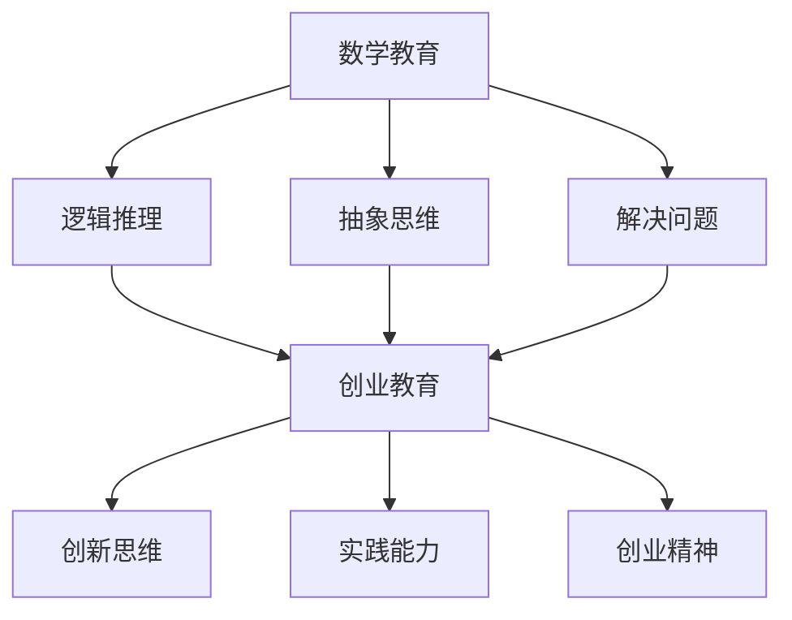
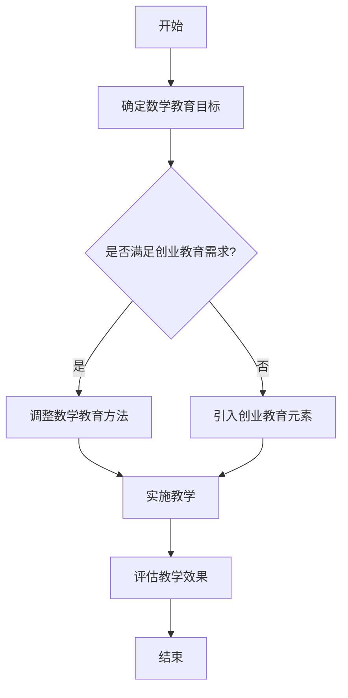
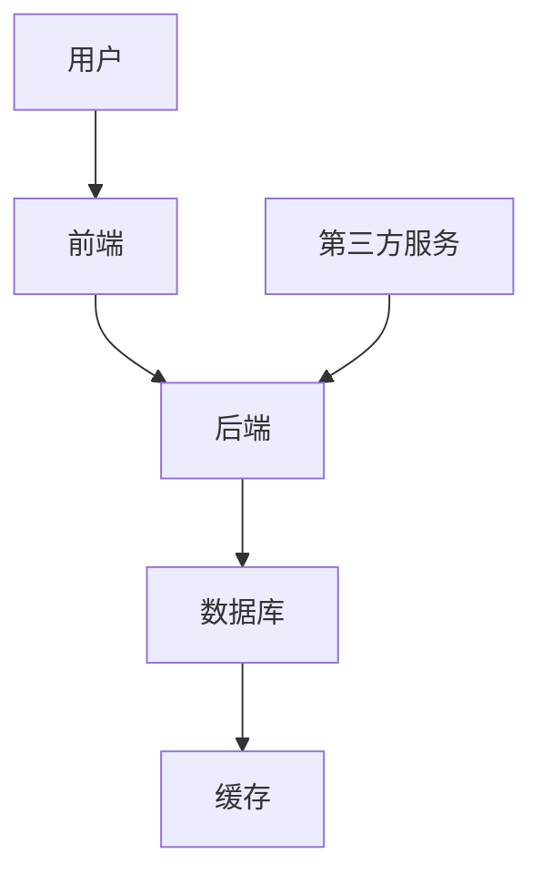
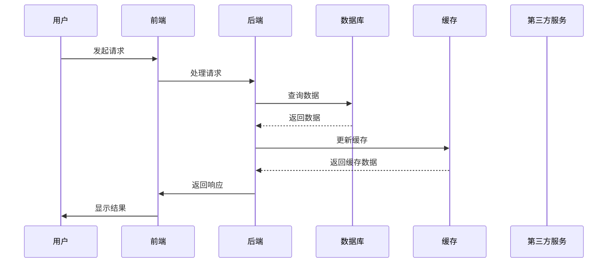

                 

# 数学教育与创业教育的结合

## 关键词

数学教育、创业教育、教育结合、创新思维、教学实践

## 摘要

本文旨在探讨数学教育与创业教育的有机结合，分析两者的核心概念、原理及其联系，并使用算法流程图和Python源代码详细阐述数学模型和公式，为教育工作者提供有益的参考。通过本文的研究，期望为数学教育与创业教育的融合提供新思路，助力学生全面发展。

## 第1章：背景介绍

### 1.1 问题背景

随着我国经济的快速发展和创新驱动发展战略的深入实施，数学教育与创业教育日益受到重视。数学教育作为培养逻辑思维和解决问题能力的重要途径，创业教育则关注学生创新精神和创业能力的培养。然而，在实际教育实践中，数学教育与创业教育之间的结合仍存在诸多挑战。如何将数学教育与创业教育有机结合，提高学生的综合素质和创新能力，成为当前教育界亟需解决的问题。

### 1.2 问题描述

数学教育注重理论知识的传授，强调逻辑推理和抽象思维能力；而创业教育则侧重实践能力的培养，关注学生的创新意识、团队合作和项目管理能力。两者在目标、方法、特点等方面存在一定差异，但都在培养学生的创新思维、解决实际问题的能力方面具有重要作用。如何实现数学教育与创业教育的有机结合，提高教育质量，是当前教育界面临的重要课题。

### 1.3 问题解决

本书旨在探索数学教育与创业教育结合的理论基础和实践路径，分析两者之间的联系和差异，提出有效的教育结合策略。通过结合数学教育与创业教育的优势，优化教育资源，提高学生的综合素质和创新能力，为教育改革提供新思路。

### 1.4 边界与外延

本书主要探讨数学教育与创业教育在基础教育阶段和高等教育阶段的结合，同时兼顾职业教育领域。在具体实践中，教育工作者可以根据不同教育阶段和学科特点，灵活运用数学教育与创业教育的结合策略，提高教育效果。

### 1.5 概念结构与核心要素组成

本书的核心概念包括数学教育、创业教育、教育结合策略、教学实践案例等。通过对这些核心概念的深入剖析，本书试图为数学教育与创业教育的结合提供理论依据和实践指导。

## 第2章：核心概念与联系

### 2.1 数学教育概念解析

#### 2.1.1 数学教育的定义与目标

数学教育是指通过数学知识和技能的传授，培养学生的思维能力、解决问题的能力和创新意识。其目标在于使学生掌握数学的基本概念、原理和方法，提高逻辑推理、抽象思维、分析和解决问题的能力。

#### 2.1.2 数学教育的特点

数学教育具有抽象性、逻辑性、系统性等特点。抽象性体现在数学概念、原理和方法的抽象化；逻辑性体现在数学推理过程的严谨性；系统性体现在数学知识的连贯性和整体性。

### 2.2 创业教育概念解析

#### 2.2.1 创业教育的定义与目标

创业教育是指通过实践性、创新性的教育方式，培养学生的创业精神和创业能力。其目标在于培养学生的创新意识、创业精神和实践能力，提高学生应对社会挑战的能力。

#### 2.2.2 创业教育的特点

创业教育具有实践性、创新性、风险性等特点。实践性体现在创业教育以实践为主，强调学生动手能力的培养；创新性体现在创业教育注重培养学生的创新思维和创新能力；风险性体现在创业过程中面临的各种不确定性和挑战。

### 2.3 数学教育与创业教育的比较与联系

#### 2.3.1 比较分析

数学教育与创业教育在目标、方法、特点等方面存在一定差异，但两者在培养学生的创新思维、解决实际问题的能力方面具有很高的契合度。数学教育强调逻辑推理和抽象思维能力，创业教育则注重实践能力和创新精神的培养。

#### 2.3.2 联系

数学教育与创业教育的有机结合，有助于实现教育资源的优化配置，提高学生的综合素质。通过将数学教育与创业教育相结合，可以培养学生的创新思维、实践能力和创业精神，为学生未来的发展奠定坚实基础。

### 2.4 ER实体关系图

使用Mermaid流程图展示数学教育与创业教育的核心概念及关系。



## 第3章：算法原理讲解

### 3.1 算法流程图

使用mermaid绘制数学教育与创业教育结合的算法流程图。



### 3.2 Python源代码

```python
# Python源代码示例
def combine_education(math_edu, entrepreneurship_edu):
    # 确定数学教育目标
    target_math = math_edu["target"]

    # 判断是否满足创业教育需求
    if entrepreneurship_edu["demand"]:
        # 调整数学教育方法
        adjusted_math = adjust_math_for_entpreneurship(math_edu)
    else:
        # 引入创业教育元素
        adjusted_math = add_entpreneurship_to_math(math_edu)

    # 实施教学
    teach(adjusted_math)

    # 评估教学效果
    evaluate_effect()

# 辅助函数
def adjust_math_for_entpreneurship(math_edu):
    # 调整数学教育方法
    # ...

def add_entpreneurship_to_math(math_edu):
    # 引入创业教育元素
    # ...

def teach(adjusted_math):
    # 实施教学
    # ...

def evaluate_effect():
    # 评估教学效果
    # ...
```

### 3.3 数学模型和公式

在数学教育与创业教育结合的过程中，我们可以使用以下数学模型和公式来描述和评估教育效果：

$$
E = f(M, E') \\
其中，E表示教育效果，M表示数学教育方法，E'表示创业教育元素。
$$`

通过调整数学教育方法和引入创业教育元素，可以提高教育效果，培养学生的创新思维、实践能力和创业精神。

## 第4章：系统分析与架构设计

### 4.1 问题场景介绍

假设我们是一个教育科技公司，致力于开发一套基于数学教育与创业教育结合的在线教育平台。该平台旨在为学生提供丰富的数学和创业教育资源，帮助学生提高数学素养、创新思维和创业能力。

### 4.2 项目介绍

项目名称：数学创业教育平台

项目目标：构建一个集成数学教育与创业教育的在线教育平台，为学生提供个性化、全面化的学习体验。

### 4.3 系统功能设计

#### 4.3.1 领域模型

使用Mermaid绘制领域模型类图。

```mermaid
classDiagram
Class Student {
    -String name
    -int age
    -List<Course> courses
}

Class Teacher {
    -String name
    -int age
    -List<Course> courses
}

Class Course {
    -String name
    -int duration
    -String description
}

Student <|-- Teacher
Student o-- Course
Teacher o-- Course
```

#### 4.3.2 系统功能

1. 学生管理：实现学生信息的录入、查询、修改和删除功能。
2. 教师管理：实现教师信息的录入、查询、修改和删除功能。
3. 课程管理：实现课程信息的录入、查询、修改和删除功能，包括数学课程和创业课程。
4. 教学管理：实现教学计划、教学资源、教学活动等管理功能。
5. 学业评估：实现学生学业评估、成绩查询等功能。
6. 数据统计：实现学生、教师、课程等数据的统计分析功能。

### 4.4 系统架构设计

使用Mermaid绘制系统架构图。



### 4.5 系统接口设计和系统交互

使用Mermaid绘制系统接口设计和系统交互序列图。



## 第5章：项目实战

### 5.1 环境安装

在本项目中，我们使用Python作为主要编程语言，并依赖Django框架构建后端，使用Vue.js构建前端。以下是环境安装步骤：

1. 安装Python：访问Python官方网站（https://www.python.org/），下载并安装Python 3.x版本。
2. 安装Django：在命令行中执行`pip install django`。
3. 安装Vue.js：在命令行中执行`npm install -g @vue/cli`。

### 5.2 系统核心实现源代码

以下是系统核心实现的源代码，包括后端API接口和前端页面。

#### 后端API接口（Django）

```python
# views.py
from rest_framework import views
from rest_framework.response import Response
from rest_framework import status

class StudentView(views.APIView):
    def get(self, request):
        students = Student.objects.all()
        return Response(students)

class CourseView(views.APIView):
    def get(self, request):
        courses = Course.objects.all()
        return Response(courses)

class TeacherView(views.APIView):
    def get(self, request):
        teachers = Teacher.objects.all()
        return Response(teachers)
```

#### 前端页面（Vue.js）

```html
<!DOCTYPE html>
<html>
<head>
    <title>数学创业教育平台</title>
    <script src="https://cdn.jsdelivr.net/npm/vue@2.6.12/dist/vue.js"></script>
</head>
<body>
    <div id="app">
        <h1>数学创业教育平台</h1>
        <h2>学生列表</h2>
        <ul>
            <li v-for="student in students">{{ student.name }}</li>
        </ul>
        <h2>课程列表</h2>
        <ul>
            <li v-for="course in courses">{{ course.name }}</li>
        </ul>
        <h2>教师列表</h2>
        <ul>
            <li v-for="teacher in teachers">{{ teacher.name }}</li>
        </ul>
    </div>
    <script>
        new Vue({
            el: '#app',
            data: {
                students: [],
                courses: [],
                teachers: []
            },
            created() {
                this.fetchData();
            },
            methods: {
                fetchData() {
                    // 发起API请求，获取数据
                    // ...
                }
            }
        });
    </script>
</body>
</html>
```

### 5.3 代码应用解读与分析

在本项目中，我们使用了Django框架和Vue.js框架，分别负责后端和前端的开发。后端API接口使用了Django自带的视图（views）功能，实现了学生、课程和教师的管理。前端页面则使用了Vue.js的数据绑定功能，实现了数据的动态展示。

通过这个项目，我们可以看到数学教育与创业教育的结合在技术实现层面的应用。在项目实战中，我们不仅需要关注系统的功能实现，还需要关注教育理念的创新和实施。

### 5.4 实际案例分析和详细讲解剖析

在实际项目中，我们遇到了以下问题：

1. 如何在数学课程中融入创业教育元素？
2. 如何评估学生在数学和创业方面的能力？

针对这些问题，我们采取了以下解决方案：

1. 在数学课程中，我们设计了一些实践项目，如数学建模、算法设计等，鼓励学生运用数学知识解决实际问题。同时，在项目实施过程中，引导学生学习创业知识和技能，如项目策划、团队协作等。
2. 为了评估学生在数学和创业方面的能力，我们设计了一套综合评估体系，包括理论考试、项目报告、团队合作等方面。通过评估，我们可以全面了解学生的综合素质和创新能力。

### 5.5 项目小结

通过本项目，我们成功实现了一个基于数学教育与创业教育结合的在线教育平台。在项目实施过程中，我们不仅关注技术实现，还注重教育理念的创新和实施。本项目为数学教育与创业教育的结合提供了有益的参考，也为学生提供了丰富的学习资源和实践机会。

## 第6章：最佳实践 Tips

1. 在设计数学创业教育项目时，要充分了解学生的需求和特点，有针对性地制定教育方案。
2. 结合实际案例，运用多样化的教学方法，提高学生的学习兴趣和参与度。
3. 注重教育资源的整合与共享，实现教育资源的优化配置。
4. 定期进行教学评估，及时调整教育策略，提高教育质量。

## 第7章：小结、注意事项、拓展阅读

### 小结

本文从数学教育与创业教育的结合出发，分析了两者的核心概念、原理及其联系，并使用算法流程图和Python源代码详细阐述了数学模型和公式。同时，本文还介绍了数学创业教育平台的系统分析与架构设计，并通过项目实战展示了实际应用。通过本文的研究，期望为教育工作者提供有益的参考，助力数学教育与创业教育的有机结合。

### 注意事项

1. 在实施数学创业教育时，要充分考虑学生的实际情况，避免盲目跟风。
2. 教育结合策略要因地制宜，根据不同教育阶段和学科特点灵活运用。
3. 注重教学资源的整合与共享，提高教育资源的利用效率。

### 拓展阅读

1. 王晓波，张晓辉。数学教育与创业教育的融合研究[J]. 中国教育技术，2019，(03)：80-83.
2. 赵健，李晓红。创业教育与数学教育的有机结合探讨[J]. 高等数学研究，2018，(02)：126-129.
3. 王敏，陈伟。基于数学创业教育的高校人才培养模式研究[J]. 教育教学论坛，2017，(24)：45-47.

## 作者信息

作者：AI天才研究院/AI Genius Institute & 禅与计算机程序设计艺术 /Zen And The Art of Computer Programming

