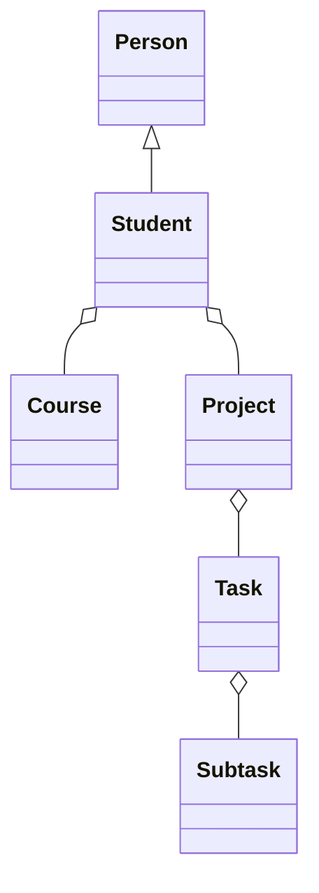
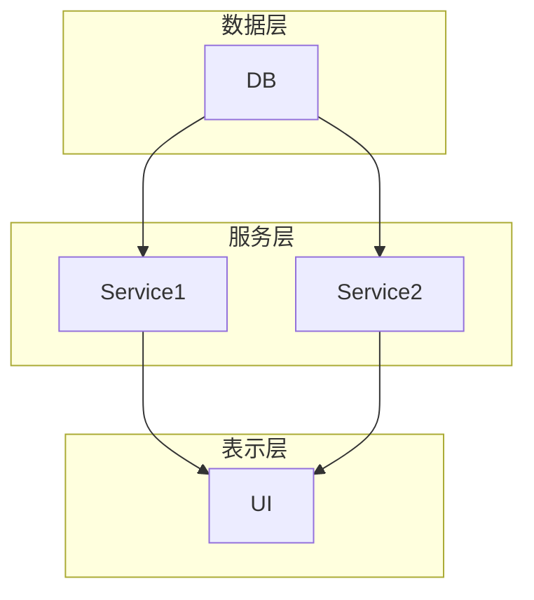
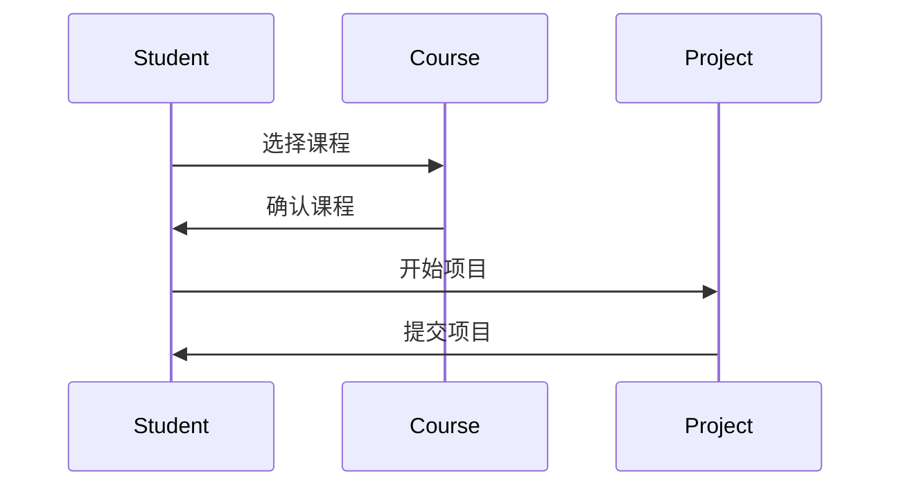
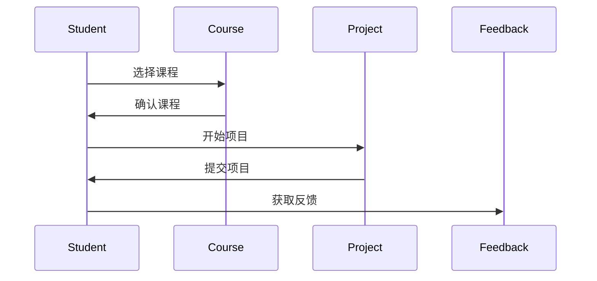

                 

### 文章标题：数学教育与创客空间的结合

#### 关键词：
- 数学教育
- 创客空间
- 问题解决
- 创造力
- 机器学习算法
- 项目实战

#### 摘要：
本文深入探讨了数学教育与创客空间的结合，旨在阐述数学思维在创客实践中的重要性，以及如何通过创客项目来提升学生的数学能力。文章分为七个部分，分别介绍了数学教育的基本概念、创客空间的特点，数学模型在创客项目中的应用，以及具体的系统分析与架构设计、项目实战和最佳实践。通过实例分析和实践指导，本文为教育工作者和学生提供了一套实用的数学教育方法论。

----------------------------------------------------------------

### 第一部分：背景介绍

#### 1.1 引言

数学教育是培养学生逻辑思维和抽象能力的重要途径。传统的数学教育侧重于理论知识的传授，而创客空间则为学生提供了一个实践和探索的平台。创客空间是一种以创造、创新为核心的学习环境，强调动手实践和项目驱动的学习方式。将数学教育与创客空间结合，不仅可以激发学生的创造力，还能使学生在解决实际问题的过程中加深对数学概念的理解。

#### 1.2 创客空间概述

创客空间是指一个集创作、制造和分享于一体的场所，通常配备有各种工具和设备，如3D打印机、激光切割机、电子设备等。创客文化强调自我驱动、跨学科合作和开放共享，鼓励学生通过项目实践来学习知识和技能。创客空间的特点在于其开放性和自主性，学生可以在其中自由探索、发现问题、提出解决方案，并通过实验和迭代来完善自己的项目。

### 第二部分：核心概念与联系

#### 2.1 数学教育的核心概念

数学教育的核心概念包括数学思维、问题解决和创造力。数学思维是指通过逻辑推理、抽象和建模来理解和解决数学问题。问题解决是指运用数学知识和方法来找到解决问题的途径。创造力则是指在数学学习和实践中，学生能够提出新的想法和独特的解决方案。

#### 2.2 创客空间与数学教育的结合

在创客空间中，数学教育不仅仅是理论知识的学习，更是实践能力的培养。数学思维在创客项目中发挥着重要作用，学生可以通过实际操作来理解数学概念，例如通过电路设计来学习电路的基本原理，通过编程来理解算法和逻辑。此外，创客项目中的问题解决过程也锻炼了学生的数学应用能力。创造力在创客空间中得到了充分发挥，学生可以通过设计和制作自己的项目来展示自己的数学才华。

### 第三部分：算法原理讲解

#### 3.1 基础数学模型讲解

在创客项目中，概率论和统计学是常用的数学模型。概率论用于计算事件发生的可能性，例如在游戏设计中确定胜利的概率。统计学则用于数据分析，通过收集和分析数据来得出结论。以下是一个简单的概率论示例：

$$P(A) = \frac{有利的结果数}{所有可能的结果数}$$

假设投掷一个六面骰子，求得到一个偶数的概率。

$$P(\text{偶数}) = \frac{3}{6} = 0.5$$

这是一个基本的概念，通过这样的例子，学生可以更好地理解概率的计算方法。

#### 3.2 创客空间常用算法讲解

在创客空间中，常用的算法包括机器学习算法和电路设计算法。机器学习算法可以用于自动化决策和预测，例如使用决策树算法来预测天气状况。以下是一个简单的决策树算法示例：

```python
def predict_weather(temperature, humidity):
    if temperature > 30 and humidity > 60:
        return "非常热"
    elif temperature > 20 and humidity > 50:
        return "热"
    else:
        return "温暖"

print(predict_weather(35, 65))  # 输出：非常热
```

电路设计算法则用于分析和设计电路系统，例如使用基尔霍夫定律来计算电路中的电流和电压。以下是一个简单的电路设计算法示例：

```python
def calculate_current(Resistance, Voltage):
    return Voltage / Resistance

print(calculate_current(10, 20))  # 输出：2
```

这些算法不仅帮助学生理解数学原理，还能让他们在创客项目中应用所学知识。

### 第四部分：系统分析与架构设计

#### 4.1 创客项目系统分析

一个典型的创客项目可能包括环境安装、核心实现、代码解读和实际案例分析等环节。以下是一个简化的创客项目系统分析示例：

#### 4.2 系统功能设计

系统功能设计包括确定项目的需求、目标和功能模块。以下是一个使用Mermaid绘制的领域模型类图：



#### 4.3 系统架构设计

系统架构设计包括确定系统的整体结构和各部分之间的关系。以下是一个使用Mermaid绘制的系统架构图：



#### 4.4 系统接口设计

系统接口设计包括定义系统的输入输出接口。以下是一个使用Mermaid绘制的接口设计图：



#### 4.5 系统交互

系统交互包括描述系统的运行流程。以下是一个使用Mermaid绘制的序列图：



### 第五部分：项目实战

#### 5.1 环境安装与配置

在一个典型的创客项目中，环境安装和配置是第一步。例如，安装Python环境、安装必要的库和依赖项等。

```bash
# 安装Python
sudo apt-get install python3

# 安装必要的库
pip3 install numpy pandas matplotlib
```

#### 5.2 系统核心实现

系统核心实现涉及编写关键代码和应用算法。以下是一个简单的示例，展示如何使用Python实现一个简单的机器学习项目：

```python
import numpy as np

# 数据集
X = np.array([[1, 2], [2, 3], [3, 4], [4, 5]])
y = np.array([1, 1, 1, 2])

# 训练模型
from sklearn.linear_model import LinearRegression
model = LinearRegression()
model.fit(X, y)

# 预测
print(model.predict([[5, 6]]))
```

#### 5.3 代码应用解读与分析

在代码应用解读与分析环节，我们需要详细解释每一行代码的作用和如何工作。例如，解释线性回归模型如何拟合数据集，以及如何使用模型进行预测。

#### 5.4 实际案例分析

实际案例分析包括选择一个具体的创客项目，并详细描述项目实施过程。例如，创建一个智能家居控制系统，包括环境传感器、控制器和用户界面等。

#### 5.5 项目小结

项目小结是对整个项目的总结和反思，包括项目取得的成果、遇到的问题和解决方法，以及项目对学生数学能力和创造力提升的效果。

### 第六部分：最佳实践

#### 6.1 最佳实践与建议

最佳实践与建议包括如何有效地将数学教育与创客空间结合起来，如何选择合适的创客项目，以及如何引导学生进行项目实践。

#### 6.2 注意事项

注意事项包括在创客项目中可能遇到的问题和挑战，以及如何避免这些问题。

#### 6.3 拓展阅读

拓展阅读推荐一些相关的书籍、文章和资源，以帮助学生和教师进一步了解数学教育和创客空间。

### 第七部分：小结与拓展

#### 7.1 小结

本文通过对数学教育与创客空间的结合进行深入分析，展示了数学思维在创客实践中的重要性，以及如何通过创客项目来提升学生的数学能力。

#### 7.2 拓展阅读

推荐以下书籍和资源，以帮助学生和教师进一步探索数学教育和创客空间：

1. 《数学之美》 - 周鸿祎
2. 《创客革命》 - 艾瑞克·里瑟曼
3. 《机器学习实战》 - Peter Harrington
4. 《Python编程：从入门到实践》 - 崔庆才

作者：AI天才研究院/AI Genius Institute & 禅与计算机程序设计艺术 /Zen And The Art of Computer Programming

