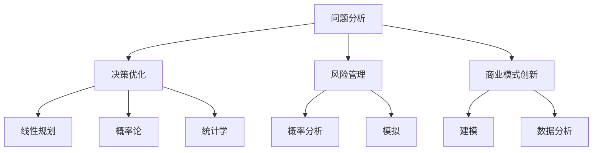
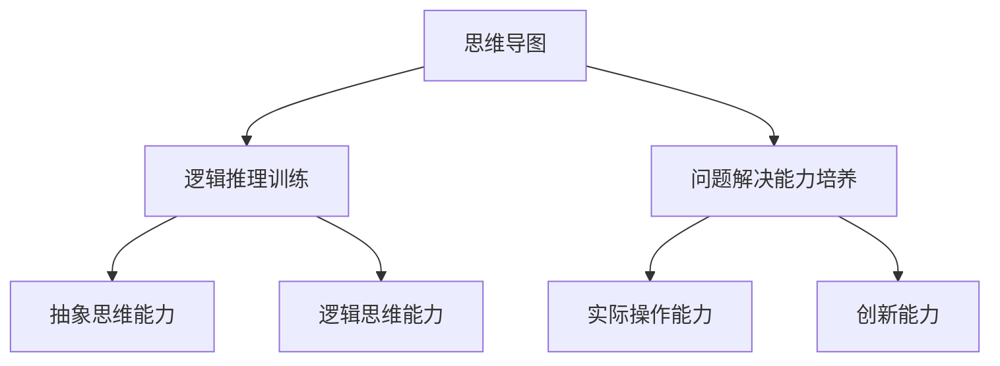
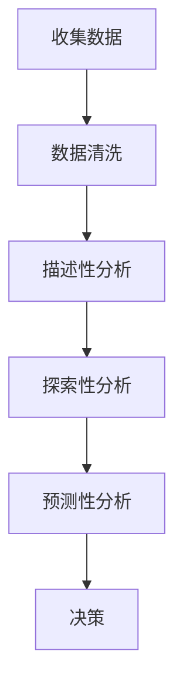
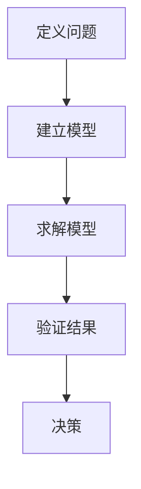
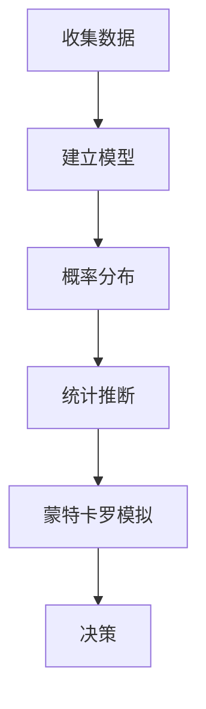
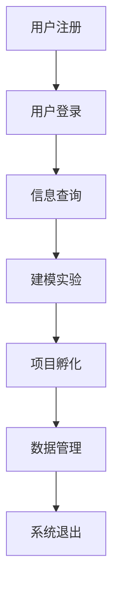
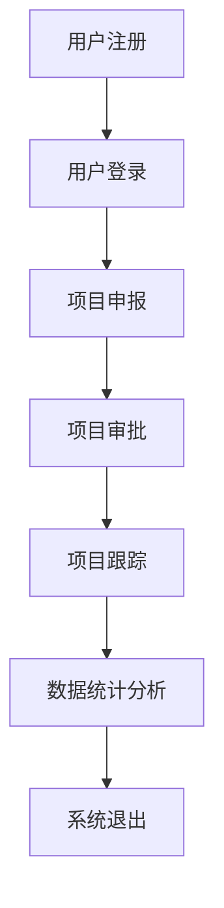

                 

### 数学教育与创新创业的关系探讨

#### 1.1 问题背景

##### 1.1.1 创新创业的兴起及其重要性

创新创业，作为一种推动社会经济发展的重要动力，近年来在全球范围内迅速兴起。根据全球创业观察（Global Entrepreneurship Monitor，GEM）的数据显示，越来越多的国家和地区开始重视创新创业教育，并积极推动相关政策和实践。创新创业不仅为企业带来新机遇，还为社会创造大量就业岗位，提高整体经济活力。

创新创业的重要性体现在以下几个方面：

1. **经济增长**：创业活动带动了新企业的产生，促进了市场的多元化，从而推动了整体经济的增长。
2. **技术进步**：创新活动往往伴随着新技术的开发和应用，为科技领域带来突破性进展。
3. **就业机会**：创业活动创造了大量就业机会，缓解了就业压力，提高了劳动力市场的灵活性。
4. **社会进步**：创新创业活动推动了社会问题的解决，如环境保护、医疗健康等领域的创新，有助于提高社会福祉。

##### 1.1.2 数学教育在培养创新能力中的作用

数学教育在培养创新能力方面具有独特的作用。数学作为一种基础学科，不仅培养了学生的逻辑思维和抽象思维能力，还为各种创新活动提供了方法论支持。以下是数学教育在培养创新能力方面的几个关键作用：

1. **逻辑思维能力**：数学训练学生的逻辑思维，使得他们能够以更严谨、系统的角度分析问题，提高解决复杂问题的能力。
2. **抽象思维能力**：数学教育要求学生理解和运用抽象概念，培养他们在复杂环境中识别和解决问题能力。
3. **方法论支持**：数学提供了一系列方法论，如建模、优化、统计分析等，这些方法在创新创业中具有重要应用价值。
4. **跨学科融合**：数学与其他学科的融合，如计算机科学、经济学等，能够促进跨学科创新，推动新领域的产生。

##### 1.1.3 数学教育与创新创业实践的结合现状

当前，数学教育与创新创业实践的结合在多个层面展开，呈现出以下几种趋势：

1. **课程设置**：许多高校开始将创新创业教育纳入数学课程体系，通过跨学科课程设计，培养学生的创新能力和创业意识。
2. **实践活动**：数学社团、竞赛、工作坊等活动为学生提供了实践平台，使他们能够在实际项目中应用数学知识。
3. **校企合作**：高校与企业合作，共同培养具备创新创业能力的人才，为企业提供技术支持，同时促进数学教育改革。
4. **政策支持**：政府和社会组织出台了一系列政策，鼓励数学教育与创新创业的结合，为相关活动提供资金和资源支持。

然而，尽管取得了一定进展，数学教育与创新创业实践的结合仍然存在一些问题和挑战，需要进一步探索和解决。

#### 1.2 问题提出

##### 1.2.1 研究目的与意义

本研究旨在探讨数学教育与创新创业实践的结合，通过分析其现状和问题，提出有效的解决方案，以促进数学教育与创新创业的深度融合。具体目标包括：

1. **明确数学教育在创新创业中的具体作用**：通过深入分析数学教育对创新能力和创业意识培养的影响，为数学教育改革提供理论支持。
2. **探索数学教育与创新创业实践的有效结合模式**：通过案例分析，总结成功经验和有效策略，为高校和企业提供实践指导。
3. **提出政策建议**：针对现有政策和实践中的不足，提出具体的政策建议，推动数学教育与创新创业实践的结合。

本研究具有以下意义：

1. **理论意义**：丰富创新创业教育和数学教育领域的研究内容，为相关理论体系的完善提供新的视角。
2. **实践意义**：为高校和企业提供可操作的创新创业教育模式和人才培养方案，提高人才质量和就业竞争力。
3. **社会意义**：推动社会经济的发展和创新，提升国家的科技实力和国际竞争力。

##### 1.2.2 研究内容与结构

本研究的主要内容包括以下几个方面：

1. **数学教育与创新创业的关系分析**：探讨数学教育在创新创业中的作用机制，分析数学教育对创新能力培养的具体影响。
2. **数学教育创新的策略与方法**：分析国内外数学教育创新的典型案例，总结有效的教学策略和方法。
3. **创新创业实践中的数学应用**：研究数学在创新创业项目中的具体应用，分析数学方法在项目分析、优化和决策中的作用。
4. **数学教育与创新创业结合的实践模式**：总结高校和企业合作的经验，提出数学教育与创新创业实践结合的有效模式。
5. **政策与支持体系研究**：分析现有政策对数学教育与创新创业实践结合的支持情况，提出改进策略。

本研究的结构如下：

1. **引言与背景**：介绍研究背景、研究目的与意义、研究内容与结构。
2. **数学教育的创新方法**：探讨数学思维与创新能力培养的策略，分析国内外数学教育创新的案例分析。
3. **创新创业实践与数学应用**：研究数学在创新创业项目中的应用，分析数学方法在项目分析、优化和决策中的作用。
4. **数学教育与创新创业结合的最佳实践**：总结数学教育与创新创业结合的实践模式，分析校企合作、项目驱动教学和创新创业教育平台建设等模式。
5. **未来展望与策略**：探讨数学教育与创新创业结合的未来发展趋势，提出政策建议和改革策略。
6. **案例分析与实践指导**：通过具体案例，分析数学教育与创新创业结合的实践效果，提出实践指导和建议。

#### 1.3 核心概念

##### 1.3.1 数学教育

数学教育是指通过教学、学习、实践等过程，使个体掌握数学知识、技能和思维方式的过程。数学教育不仅关注数学知识的传授，更强调培养学生的数学思维能力和解决问题的能力。

**数学教育的核心概念**：

- **数学知识**：数学的基本概念、原理、公式和定理。
- **数学技能**：运用数学知识解决问题的能力，包括计算、推理、证明等。
- **数学思维**：运用数学方法分析和解决实际问题的思维方式。

##### 1.3.2 创新创业

创新创业是指通过创造新的产品、服务、技术或商业模式，实现经济和社会价值的过程。创新创业不仅包括技术创新，还涵盖商业模式创新、市场创新和社会创新等多个方面。

**创新创业的核心概念**：

- **创新**：通过新的思想、方法或技术，解决现有问题或创造新价值。
- **创业**：将创新成果转化为实际产品或服务，通过市场实现价值的过程。

##### 1.3.3 实践结合

实践结合是指将理论知识与实际应用相结合，通过实践活动培养实际操作能力和创新意识。在数学教育与创新创业结合的背景下，实践结合主要体现在以下几个方面：

- **教学与实践相结合**：通过项目驱动教学、实验、实习等实践活动，培养学生的实际操作能力和创新思维。
- **理论指导与实践**：在创新创业实践中，运用数学方法进行项目分析、优化和决策，实现理论知识的实际应用。
- **跨学科合作**：通过跨学科合作，实现数学与其他学科的融合，促进创新成果的产生。

##### 1.4 研究方法

本研究采用多种研究方法，以全面、深入地探讨数学教育与创新创业实践的结合。主要研究方法包括文献综述、案例研究和实证分析。

**1.4.1 文献综述**

文献综述是通过查阅和分析相关文献，了解国内外在数学教育与创新创业结合领域的研究进展和成果。具体方法包括：

- **文献收集**：通过学术数据库、图书资料和在线资源，收集与本研究相关的文献。
- **文献分析**：对收集的文献进行分类、筛选和分析，总结出主要观点和研究结论。
- **文献综述**：将分析结果整理成文，为本研究提供理论依据和背景支持。

**1.4.2 案例研究**

案例研究是通过具体案例，分析数学教育与创新创业实践结合的具体实施过程和效果。具体方法包括：

- **案例选择**：根据研究目标和需求，选择具有代表性的案例。
- **案例描述**：详细描述案例的背景、实施过程和结果。
- **案例分析**：对案例进行深入分析，总结成功经验和存在的问题。
- **案例启示**：从案例中提取有价值的信息，为其他实践提供参考。

**1.4.3 实证分析**

实证分析是通过数据收集和分析，验证研究假设和结论。具体方法包括：

- **数据收集**：通过调查问卷、访谈、实验等手段，收集与本研究相关的数据。
- **数据分析**：运用统计方法和数据分析工具，对收集的数据进行处理和分析。
- **结果验证**：根据数据分析结果，验证研究假设和结论的可靠性。
- **结果讨论**：对分析结果进行讨论，提出进一步的思考和建议。

##### 1.5 本章小结

本章介绍了数学教育与创新创业实践结合的研究背景、问题提出、核心概念和研究方法。通过对创新创业的兴起及其重要性、数学教育在创新能力培养中的作用以及数学教育与创新创业实践结合现状的分析，明确了本研究的意义和研究内容。同时，对数学教育、创新创业和实践结合等核心概念进行了详细阐述，为后续章节的展开奠定了基础。通过多种研究方法的运用，本研究旨在深入探讨数学教育与创新创业实践的结合，为相关领域的发展提供理论和实践支持。

---

### 数学思维与创新能力培养

在探讨数学教育与创新创业实践结合的过程中，数学思维作为培养学生创新能力的重要工具，扮演着关键角色。本章节将深入分析数学思维的定义与特征，探讨其在创新创业中的作用，并提出相应的创新能力培养策略。

#### 2.1 数学思维概述

数学思维是指运用数学概念、原理和方法，对现实问题进行分析、推理和解决问题的思维方式。数学思维具有以下特征：

1. **抽象性**：数学思维通过抽象的概念和符号，将现实问题简化为数学模型，从而抓住问题的本质。
2. **逻辑性**：数学思维强调推理的严谨性和逻辑性，遵循一定的逻辑规则，使得思维过程具有系统性。
3. **系统性**：数学思维注重整体性和系统性，通过将各个部分和要素联系起来，形成一个完整的分析框架。
4. **创造性**：数学思维鼓励创新和探索，通过不断的尝试和调整，找到解决问题的最优方案。

**数学思维的定义与特征表格：**

| 特征      | 定义                                                     |
| --------- | -------------------------------------------------------- |
| 抽象性    | 通过抽象概念和符号，简化现实问题                             |
| 逻辑性    | 遵循逻辑规则，确保推理的严谨性和系统性                       |
| 系统性    | 将各个部分和要素联系起来，形成完整的分析框架                 |
| 创造性    | 鼓励创新和探索，寻找最优解决方案                            |

#### 2.2 数学思维在创新创业中的作用

数学思维在创新创业中发挥着重要作用，主要体现在以下几个方面：

1. **问题分析**：通过数学思维，创业者能够将复杂的商业问题抽象为数学模型，从而更准确地分析和理解问题。
2. **决策优化**：数学思维提供了优化决策的工具和方法，如线性规划、概率论和统计学等，帮助创业者做出最优决策。
3. **风险管理**：数学思维能够量化风险，通过概率分析和模拟，帮助创业者评估和管理风险。
4. **商业模式创新**：数学思维有助于创业者创新商业模式，通过建模和数据分析，找到新的商业模式和利润点。

**数学思维在创新创业中的作用ER实体关系图：**

#### 2.3 创新能力培养策略

为了培养学生的创新能力，数学教育需要采取一系列创新的教学策略。以下是一些有效的策略：

1. **教学内容创新**：引入跨学科知识，将数学与其他领域结合，培养学生解决复杂问题的能力。
2. **教学方法创新**：采用项目驱动教学、问题导向教学等教学方法，激发学生的创新思维。
3. **教学评价创新**：建立多元化的评价体系，不仅关注学生的数学知识掌握情况，更注重学生的创新能力和实践能力。

**创新能力培养策略对比表格：**

| 策略           | 描述                                                         |
| -------------- | ------------------------------------------------------------ |
| 教学内容创新   | 引入跨学科知识，培养学生的综合素质                           |
| 教学方法创新   | 采用项目驱动教学、问题导向教学等，激发学生的创新思维         |
| 教学评价创新   | 建立多元化的评价体系，关注学生的创新能力和实践能力           |

#### 2.4 数学教育的创新案例分析

**2.4.1 国内数学教育创新案例**

**1. 清华大学数学科学系创新教学实践**

清华大学数学科学系通过跨学科课程设计、项目驱动教学等方式，培养学生的创新能力。例如，他们开设了“数学与经济”、“数学与计算机科学”等跨学科课程，将数学方法应用于经济和计算机科学领域，培养学生的综合素质和创新能力。

**2. 北京大学数学科学学院创新创业教育**

北京大学数学科学学院在数学教育中融入创新创业元素，通过创新创业课程、数学建模竞赛等活动，培养学生的创新意识和创业能力。例如，他们举办了数学建模竞赛，让学生运用数学方法解决实际问题，提高学生的创新能力和实践能力。

**2.4.2 国际数学教育创新案例**

**1. 美国麻省理工学院（MIT）数学创新课程**

麻省理工学院（MIT）通过数学创新课程，培养学生的数学思维和创新能力。例如，他们开设了“计算思维”、“数据科学”等课程，将数学方法应用于实际问题，培养学生的跨学科思维和创新能力。

**2. 英国牛津大学数学教育改革**

牛津大学数学教育改革注重培养学生的创新思维和解决问题的能力。例如，他们采用了问题导向教学和项目驱动教学的方法，通过实际问题引导学生思考，培养学生的创新能力。

**2.4.3 创新案例启示**

**1. 跨学科教育**：通过跨学科课程设计，培养学生的综合素质和创新能力。
**2. 项目驱动教学**：通过实际问题引导学生思考，培养学生的创新思维和解决问题的能力。
**3. 多元化评价体系**：建立多元化的评价体系，关注学生的创新能力和实践能力。

#### 2.5 数学思维训练方法

为了培养数学思维，教师可以采用以下几种训练方法：

1. **思维导图**：通过思维导图，将复杂的数学问题分解为各个部分，培养学生的系统性和抽象思维能力。
2. **逻辑推理训练**：通过逻辑推理训练，提高学生的逻辑思维和推理能力，为解决复杂问题奠定基础。
3. **问题解决能力培养**：通过实际问题解决训练，培养学生的实际操作能力和创新能力。

**数学思维训练方法ER实体关系图：**

#### 2.6 本章小结

本章分析了数学思维的定义与特征，探讨了其在创新创业中的作用，并提出了创新能力培养的策略。通过国内外的数学教育创新案例分析，总结了有效的教学方法和训练方法。这些研究和实践为数学教育与创新创业结合提供了有益的启示，为后续章节的深入探讨奠定了基础。

---

### 创新创业项目的数学分析

在创新创业项目中，数学方法的应用具有至关重要的作用。通过数学分析，创业者可以更好地理解商业问题，制定有效的战略，并进行风险管理。本章节将详细探讨创新创业项目中的数学分析方法，包括数据分析、优化算法和概率论与统计。

#### 3.1 创新创业项目的数学分析方法

**3.1.1 数据分析**

数据分析是创新创业项目中的关键步骤，通过处理和分析数据，创业者可以获取有价值的信息，指导决策过程。数据分析的方法主要包括：

1. **描述性分析**：通过描述性统计方法，如平均数、中位数、标准差等，对数据进行基本描述，了解数据的分布和特征。
2. **探索性分析**：利用可视化工具和统计方法，如箱线图、散点图、热力图等，对数据进行分析，发现潜在的关系和趋势。
3. **预测性分析**：通过时间序列分析、回归分析等预测性方法，对未来趋势进行预测，为创业决策提供依据。

**数据分析流程图：**

**3.1.2 优化算法**

优化算法在创新创业项目中具有重要的应用价值，通过优化算法，创业者可以找到最优的解决方案，提高效率，降低成本。常见的优化算法包括：

1. **线性规划**：通过线性规划方法，求解线性目标函数的最大值或最小值问题，适用于资源分配和成本控制等问题。
2. **整数规划**：在约束条件下，求解整数变量的最优解，适用于招聘优化、库存管理等问题。
3. **动态规划**：通过动态规划方法，求解多阶段决策问题，适用于路径规划、时间安排等问题。

**线性规划流程图：**

**3.1.3 概率论与统计**

概率论与统计方法在创新创业项目中用于风险评估和决策支持。常用的方法包括：

1. **概率分布**：通过概率分布，描述随机变量的取值概率，适用于风险评估和预测。
2. **统计推断**：通过样本数据，对总体参数进行估计和假设检验，适用于市场调研和产品测试。
3. **蒙特卡罗模拟**：通过随机模拟，对复杂系统进行建模和预测，适用于金融投资和风险评估。

**概率分布流程图：**

#### 3.2 数学在创新创业中的应用案例

**3.2.1 金融领域的数学应用**

金融领域是数学方法应用最为广泛的领域之一。以下是一些具体的案例：

1. **风险评估**：金融机构通过概率论和统计方法，对信用风险、市场风险等进行评估，制定风险管理策略。
2. **资产定价**：利用数学模型，如布莱克-舒尔斯模型，进行期权定价，为投资决策提供依据。
3. **金融工程**：通过优化算法和蒙特卡罗模拟，进行金融产品的设计和定价，提高投资收益。

**3.2.2 科技创新中的数学应用**

科技创新领域也广泛应用了数学方法。以下是一些具体案例：

1. **数据挖掘**：通过数据分析方法，从大量数据中提取有价值的信息，为创业决策提供支持。
2. **人工智能**：利用数学模型和优化算法，开发人工智能应用，如机器学习、深度学习等，推动科技创新。
3. **物联网**：通过概率论和统计方法，对物联网中的海量数据进行建模和分析，实现智能管理和决策。

**3.2.3 社交网络分析**

社交网络分析是数学在创新创业中的另一个重要应用领域。以下是一些具体案例：

1. **社交网络结构分析**：通过图论方法，分析社交网络的结构特征，如社区发现、网络传播等。
2. **用户行为分析**：通过概率模型和统计方法，预测用户行为，为营销策略提供依据。
3. **网络风险管理**：通过风险模型和优化算法，识别和防范网络风险，如网络欺诈、信息安全等。

#### 3.3 创新创业项目中的数学挑战与应对策略

尽管数学方法在创新创业项目中具有广泛的应用，但在实际操作中也面临一些挑战。以下是一些常见的数学挑战和应对策略：

**3.3.1 数据处理难题**

**挑战**：创业项目往往涉及大量数据，如何有效处理这些数据是关键问题。

**应对策略**：

1. **数据清洗**：对数据进行清洗，去除噪声和异常值，提高数据质量。
2. **数据集成**：将多个数据源进行集成，构建统一的数据仓库，便于分析。
3. **大数据技术**：采用大数据技术，如Hadoop、Spark等，处理海量数据。

**3.3.2 数学模型建立与优化**

**挑战**：建立准确和有效的数学模型，并进行优化，是创业项目成功的关键。

**应对策略**：

1. **建模方法论**：掌握建模方法论，如建模原则、建模步骤等，确保模型的有效性和可靠性。
2. **模型验证**：通过实验和验证，评估模型的准确性和适用性，不断优化模型。
3. **机器学习**：利用机器学习方法，自动建立和优化数学模型，提高模型的性能。

**3.3.3 创新思维与数学应用的结合**

**挑战**：如何将创新思维与数学方法相结合，实现创新成果的转化。

**应对策略**：

1. **跨学科合作**：鼓励跨学科合作，实现数学与其他领域的融合，推动创新。
2. **实践导向**：将数学方法应用于实际创业项目，通过实践验证和优化，实现创新成果的转化。
3. **持续学习**：鼓励创业者和数学家持续学习，提高自身素质和创新能力。

#### 3.4 数学在创新创业项目中的案例分析

**3.4.1 成功案例分析**

**案例1：滴滴出行的定价策略**

滴滴出行通过数据分析方法，建立了动态定价模型，根据交通拥堵情况、天气等因素，动态调整打车价格，提高了用户满意度和服务效率。

**案例2：淘宝的推荐系统**

淘宝通过数据挖掘和机器学习技术，建立了推荐系统，根据用户的购物行为和偏好，为用户推荐相关的商品，提高了销售转化率。

**3.4.2 失败案例分析**

**案例1：乐视网的财务预测失误**

乐视网在扩张过程中，通过过于乐观的财务预测，导致投资决策失误，最终导致公司财务危机。

**案例2：波场币的智能合约漏洞**

波场币在推出过程中，由于智能合约漏洞，导致大量资金被盗，严重影响了公司的信誉和市场地位。

**3.4.3 案例启示**

**1. 数据质量的重要性**：确保数据质量，是数学方法应用成功的关键。

**2. 模型验证和优化**：建立准确的数学模型，并通过验证和优化，确保模型的可靠性和有效性。

**3. 创新思维与数学方法的结合**：鼓励跨学科合作，实现创新思维与数学方法的有机结合。

#### 3.5 本章小结

本章详细探讨了创新创业项目中的数学分析方法，包括数据分析、优化算法和概率论与统计。通过具体案例，展示了数学方法在金融、科技创新和社交网络分析等领域的广泛应用。同时，分析了创新创业项目中的数学挑战和应对策略，为创业者和数学家提供了有益的参考。这些研究和实践为数学教育与创新创业的结合提供了有力支持，为后续章节的深入探讨奠定了基础。

---

### 数学教育与创新创业结合的实践模式

为了实现数学教育与创新创业实践的有效结合，高校和企业可以采取多种实践模式。本章节将重点探讨校企合作模式、项目驱动教学模式和创新创业教育平台建设，并分析其优势与挑战。

#### 4.1 校企合作模式

**4.1.1 校企合作的内涵与形式**

校企合作是指高校与企业通过合作，共同培养具有创新创业能力的人才，并促进科研成果转化。校企合作的形式多样，主要包括以下几种：

1. **联合培养**：高校与企业共同制定培养方案，通过课程设置、实习实训等方式，培养学生的实践能力和创新意识。
2. **产学研合作**：高校、企业和科研机构合作，共同开展科研攻关，促进科技成果转化。
3. **共建实验室**：高校与企业共同建立实验室，进行前沿技术研发和项目孵化。
4. **实习实训**：企业提供实习实训机会，让学生在实际工作环境中锻炼能力，积累经验。

**4.1.2 校企合作在数学教育中的应用**

在数学教育中，校企合作具有独特的应用价值，主要体现在以下几个方面：

1. **实践教学**：企业为学校提供实践教学平台，让学生在真实环境中应用数学知识，解决实际问题。
2. **案例教学**：企业提供实际案例，教师结合案例进行教学，激发学生的兴趣和思考。
3. **合作研究**：高校与企业共同开展数学相关研究项目，推动数学理论的应用和发展。
4. **资源共享**：高校与企业共享实验室、师资、科研设备等资源，提高教育资源利用效率。

**4.1.3 校企合作的挑战与解决方案**

校企合作在实施过程中面临一些挑战，主要包括：

1. **合作机制不健全**：校企合作缺乏统一的合作机制和标准，导致合作效果不理想。
2. **资源整合困难**：高校与企业在资源整合方面存在困难，如实验室资源、师资力量等。
3. **利益分配问题**：高校与企业之间的利益分配问题，可能影响合作的持续性和稳定性。

**解决方案**：

1. **建立合作机制**：制定校企合作政策，明确合作目标、内容和责任，建立长期稳定的合作关系。
2. **资源整合**：通过共建实验室、共享资源等方式，实现高校与企业的资源整合，提高资源利用效率。
3. **利益分配**：制定公平合理的利益分配机制，确保高校与企业的利益平衡，促进合作的持续发展。

#### 4.2 项目驱动教学模式

**4.2.1 项目驱动教学的概念与优势**

项目驱动教学是一种以项目为中心的教学模式，通过实际项目的实施，培养学生的实践能力和创新能力。其核心特点包括：

1. **项目导向**：以实际项目为驱动，学生通过解决实际问题，学习相关知识。
2. **团队合作**：学生组成团队，共同完成任务，培养团队协作和沟通能力。
3. **自主学习**：学生自主制定项目计划，实施项目，反思和总结，培养自主学习能力。

项目驱动教学在数学教育中具有以下优势：

1. **提高实践能力**：通过实际项目，学生能够将数学知识应用于实际问题，提高实践能力。
2. **培养创新能力**：项目驱动教学鼓励创新思维，学生通过解决复杂问题，培养创新能力。
3. **激发学习兴趣**：实际项目能够激发学生的学习兴趣，提高学习动机。

**4.2.2 项目驱动教学在数学教育中的实践**

在数学教育中，项目驱动教学可以应用于以下几个方面：

1. **数学建模**：通过数学建模项目，学生能够运用数学方法解决实际问题，提高数学应用能力。
2. **算法设计**：通过算法设计项目，学生能够学习编程和算法设计，培养计算机科学素养。
3. **数据分析**：通过数据分析项目，学生能够学习数据处理和分析方法，提高数据素养。

**4.2.3 项目驱动的教学评估**

项目驱动的教学评估应该注重过程和结果，包括以下几个方面：

1. **项目完成情况**：评估学生项目的完成情况，包括项目计划、实施和总结。
2. **创新能力**：评估学生在项目实施过程中的创新思维和解决方案。
3. **团队合作**：评估学生在团队合作中的表现，包括沟通、协作和分工。
4. **学习效果**：评估学生通过项目学习所获得的知识和技能。

#### 4.3 创新创业教育平台建设

**4.3.1 创新创业教育平台的设计与功能**

创新创业教育平台是实施创新创业教育的重要载体，其设计与功能主要包括以下几个方面：

1. **课程资源**：提供丰富的课程资源，包括在线课程、教材、案例等，满足学生的多样化学习需求。
2. **项目孵化**：提供项目孵化空间和资源，支持学生进行创新创业项目的实践和孵化。
3. **创新创业竞赛**：举办创新创业竞赛，激发学生的创新热情，提供展示和交流的平台。
4. **导师资源**：提供导师资源，为学生提供指导和支持，帮助他们解决在创新创业过程中遇到的问题。

**4.3.2 平台在数学教育中的应用**

创新创业教育平台在数学教育中具有广泛的应用价值，主要体现在以下几个方面：

1. **数学课程资源**：通过平台提供数学课程资源，帮助学生掌握数学知识和技能。
2. **数学建模比赛**：通过平台举办数学建模比赛，激发学生的数学思维和创新能力。
3. **数学项目孵化**：通过平台支持学生进行数学相关的创新创业项目，提供实验和孵化空间。
4. **数学导师指导**：通过平台提供数学导师资源，为学生提供专业的指导和支持。

**4.3.3 平台建设中的挑战与策略**

在创新创业教育平台建设过程中，面临一些挑战，主要包括：

1. **资源整合**：如何有效整合高校和企业资源，实现平台的可持续发展。
2. **技术支持**：如何提供稳定的技术支持，确保平台功能的实现和用户体验。
3. **师资培训**：如何提升教师的专业素养和指导能力，提高平台的教育质量。

**策略**：

1. **资源整合**：通过政策引导和激励机制，鼓励高校和企业合作，共同建设创新创业教育平台。
2. **技术支持**：引进先进的技术和设备，提供专业的技术支持，确保平台的功能和稳定性。
3. **师资培训**：定期组织师资培训，提升教师的专业素养和指导能力，提高平台的教育效果。

#### 4.4 案例分析：优秀数学教育与创新创业结合实践

**4.4.1 国内案例分享**

**1. 清华大学数学科学系创新创业教育**

清华大学数学科学系通过校企合作、项目驱动教学和创新创业教育平台建设等多种模式，培养学生的创新创业能力。他们与多家企业合作，共建实验室，开展数学相关研究项目，同时通过数学建模竞赛和创新创业比赛，激发学生的创新思维。

**2. 上海交通大学数学科学学院创新创业教育**

上海交通大学数学科学学院通过创新创业教育平台，提供丰富的课程资源、项目孵化和导师指导。他们与多家企业合作，开展数学相关的创新创业项目，推动数学理论的应用和发展。

**4.4.2 国际案例分享**

**1. 美国麻省理工学院（MIT）数学与创新创业教育**

麻省理工学院（MIT）通过跨学科教育和创新创业教育平台，培养学生的创新创业能力。他们开设了“数学与经济”、“数学与计算机科学”等跨学科课程，同时举办数学建模竞赛和创新创业比赛，为学生提供展示和交流的平台。

**2. 英国牛津大学数学与创新创业教育**

牛津大学数学系通过项目驱动教学和校企合作，培养学生的创新创业能力。他们与多家企业合作，开展数学相关的研究项目，同时举办数学建模竞赛和创新创业比赛，激发学生的创新思维。

**4.4.3 案例总结与启示**

**1. 多元化模式**：通过多种模式，如校企合作、项目驱动教学和创新创业教育平台建设，实现数学教育与创新创业的结合。

**2. 跨学科融合**：通过跨学科教育和研究，培养学生的综合素质和创新能力。

**3. 实践导向**：通过实际项目和比赛，激发学生的创新思维和实践能力。

**4.5 本章小结**

本章探讨了数学教育与创新创业结合的实践模式，包括校企合作模式、项目驱动教学模式和创新创业教育平台建设。通过案例分析，总结了国内外优秀实践案例，为数学教育与创新创业的结合提供了有益的启示。这些实践模式为数学教育与创新创业的结合提供了有力支持，为培养具有创新创业能力的复合型人才奠定了基础。

---

### 数学教育与创新创业结合的未来展望

数学教育与创新创业的结合正日益成为教育改革和人才培养的重要方向。展望未来，数学教育在创新创业中的角色将继续深化，政策支持体系和教育体系改革也将不断完善。以下将探讨数学教育与创新创业结合的未来发展趋势、政策与支持、教育体系改革以及创新创业支持体系建设的挑战与策略。

#### 5.1 未来发展趋势

**5.1.1 数学教育发展趋势**

在未来，数学教育的发展趋势将呈现以下几个方向：

1. **数字化教育**：随着信息技术的不断发展，数字化教育将更加普及。数学教育将利用在线课程、虚拟实验室等数字化资源，提高教学效果和学生的自主学习能力。
2. **个性化教学**：利用大数据和人工智能技术，实现个性化教学，根据学生的兴趣和需求，提供个性化的学习方案。
3. **跨学科融合**：数学与其他学科的融合将更加深入，通过跨学科课程设计和研究项目，培养学生的综合能力和创新能力。
4. **实践导向**：数学教育将更加注重实践，通过实际项目和案例分析，提高学生的实践能力和创新思维。

**5.1.2 创新创业发展趋势**

创新创业在未来将继续蓬勃发展，主要趋势包括：

1. **技术驱动**：随着新技术的不断涌现，如人工智能、大数据、区块链等，创新创业将更加依赖于技术创新。
2. **国际化**：全球化的趋势将推动创新创业的国际化，跨文化交流和合作将成为创新创业的重要方向。
3. **可持续发展**：创新创业将更加关注可持续发展，通过绿色技术和解决方案，推动环境保护和社会责任。
4. **大众创业**：大众创业的氛围将继续保持，更多的人群将参与到创新创业活动中，形成多元化的创业生态。

**5.1.3 两者的融合趋势**

数学教育与创新创业的结合趋势将体现在以下几个方面：

1. **教育模式创新**：通过项目驱动教学、跨学科课程设计等模式，实现数学教育与创新创业的深度融合。
2. **人才培养体系**：构建符合创新创业需求的数学人才培养体系，培养学生的数学思维和创新能力。
3. **实践平台建设**：加强创新创业实践平台建设，为学生提供更多的实践机会和资源支持。
4. **政策支持**：通过政策引导和资金支持，推动数学教育与创新创业的结合，形成良好的发展环境。

#### 5.2 政策与支持

**5.2.1 国家政策支持**

国家层面将继续出台相关政策，支持数学教育与创新创业的结合。具体政策措施包括：

1. **加强政策引导**：通过制定指导意见和规划，明确数学教育与创新创业结合的方向和目标。
2. **加大资金投入**：增加对数学教育和创新创业教育的资金投入，支持相关项目的研究和实践。
3. **优化教育体系**：推动教育体制改革，构建适应创新创业需求的数学教育体系。
4. **促进校企合作**：鼓励高校与企业合作，共同培养创新创业人才，促进科研成果的转化。

**5.2.2 地方政策支持**

地方政府也将积极参与数学教育与创新创业的结合，通过以下措施提供支持：

1. **制定地方政策**：结合当地经济发展需求，制定符合实际的数学教育与创新创业结合政策。
2. **提供资金支持**：设立专项资金，支持数学教育和创新创业项目的实施。
3. **建立合作机制**：推动高校、企业和政府之间的合作，共同推进数学教育与创新创业的结合。
4. **优化创业环境**：通过简化创业手续、提供创业补贴和培训等手段，为创新创业提供良好的发展环境。

**5.2.3 学校政策支持**

高校内部也将通过以下措施支持数学教育与创新创业的结合：

1. **设置创新创业课程**：开设创新创业相关课程，提高学生的创新创业意识和能力。
2. **提供实践平台**：建设创新创业实践基地，为学生提供实践机会和资源支持。
3. **导师指导**：配备创新创业导师，提供个性化指导和支持，帮助学生解决实际问题。
4. **激励机制**：建立创新创业激励机制，鼓励学生积极参与创新创业活动。

#### 5.3 教育体系改革

**5.3.1 教育体系改革方向**

教育体系改革是推动数学教育与创新创业结合的重要手段。未来教育体系改革将朝着以下方向发展：

1. **课程体系改革**：优化课程设置，增加创新创业相关课程，培养学生的创新思维和创业能力。
2. **教学方法改革**：采用项目驱动教学、问题导向教学等教学方法，提高学生的实践能力和创新思维。
3. **评价体系改革**：建立多元化的评价体系，不仅关注学生的知识掌握情况，更注重学生的创新能力和实践能力。
4. **师资队伍建设**：加强教师培训，提升教师的专业素养和指导能力，为数学教育与创新创业结合提供有力支持。

**5.3.2 改革策略与实施**

教育体系改革的策略包括：

1. **政策支持**：制定相关政策，明确改革目标和措施，为改革提供制度保障。
2. **资源整合**：整合学校和社会资源，为数学教育与创新创业结合提供充足的资源和平台。
3. **试点先行**：选择部分高校进行试点改革，积累经验，逐步推广。
4. **持续评估**：对改革效果进行持续评估，根据评估结果调整改革策略，确保改革顺利进行。

**5.3.3 教育体系改革的挑战与应对**

教育体系改革面临以下挑战：

1. **观念转变**：改革需要打破传统的教育观念，培养适应创新创业需求的新型人才。
2. **师资不足**：教师队伍需要提高专业素养和指导能力，以应对改革需求。
3. **资源不足**：需要整合学校和社会资源，为改革提供充足的资源和平台。

**应对策略**：

1. **加强培训**：通过教师培训和交流，提高教师的综合素质和指导能力。
2. **引入社会资源**：通过校企合作、产学研合作等方式，引入社会资源，为改革提供支持。
3. **政策引导**：制定相关政策，为教育体系改革提供制度保障，鼓励学校和教师积极参与改革。

#### 5.4 创新创业支持体系建设

**5.4.1 建设内容与目标**

创新创业支持体系建设包括以下内容：

1. **创新创业教育体系**：建立完善的创新创业教育体系，提供系统化的创新创业教育。
2. **创新创业实践平台**：建设创新创业实践平台，提供实践机会和资源支持。
3. **创新创业导师团队**：组建创新创业导师团队，提供个性化指导和支持。
4. **创新创业政策环境**：营造良好的创新创业政策环境，为创新创业提供政策支持和保障。

建设目标包括：

1. **培养创新创业人才**：通过创新创业教育，培养具有创新精神和创业能力的人才。
2. **推动科研成果转化**：通过创新创业支持体系，促进科研成果的转化和应用。
3. **激发创新创业活力**：营造良好的创新创业氛围，激发创新创业活力，推动经济社会发展。

**5.4.2 建设过程中的挑战与策略**

在建设创新创业支持体系过程中，面临以下挑战：

1. **资源整合**：如何整合学校、企业和社会资源，为创新创业提供充足的资源和平台。
2. **政策落实**：如何确保政策的有效落实，为创新创业提供政策支持和保障。
3. **师资培训**：如何提高师资队伍的专业素养和指导能力，为创新创业教育提供有力支持。

**策略**：

1. **资源整合**：通过政策引导和激励机制，鼓励高校、企业和社会合作，共同建设创新创业支持体系。
2. **政策落实**：通过制定实施细则和考核机制，确保政策的有效落实，为创新创业提供政策支持和保障。
3. **师资培训**：通过定期培训、进修和交流，提高师资队伍的专业素养和指导能力，为创新创业教育提供有力支持。

**5.4.3 支持体系的作用与效果**

创新创业支持体系在推动数学教育与创新创业结合方面具有重要作用，具体表现如下：

1. **提高教育质量**：通过创新创业教育，提高学生的数学素养和创新能力，提升教育质量。
2. **促进成果转化**：通过创新创业支持体系，推动数学教育成果的转化和应用，提高科研成果的转化率。
3. **激发创新活力**：通过创新创业支持体系，营造良好的创新创业氛围，激发学生的创新活力，推动经济社会发展。

#### 5.5 本章小结

本章探讨了数学教育与创新创业结合的未来发展趋势、政策与支持、教育体系改革以及创新创业支持体系建设的挑战与策略。通过分析未来发展趋势，明确了数学教育在创新创业中的角色和方向；通过政策与支持分析，提出了加强政策引导和资金投入的重要性；通过教育体系改革探讨，总结了改革方向和策略；通过创新创业支持体系建设分析，提出了建设内容、挑战与策略。这些研究和探讨为数学教育与创新创业结合的未来发展提供了有益的参考和指导。

---

### 数学教育与创新创业结合案例研究

在本章节中，我们将通过具体案例，深入分析数学教育与创新创业结合的实际效果，并提出实践指导和建议。

#### 6.1 案例研究方法

为了确保案例分析的准确性和全面性，本研究采用以下案例研究方法：

**6.1.1 案例选择**

根据研究目标，选择具有代表性的数学教育与创新创业结合的案例。案例来源包括高校的创新创业项目、企业的数学应用案例以及国内外成功的数学教育创新案例。

**6.1.2 数据收集与分析**

通过文献调研、问卷调查、访谈和现场观察等方式，收集与案例相关的数据。对收集的数据进行分类、整理和分析，提取关键信息和结论。

**6.1.3 案例研究结果解读**

对分析结果进行解读，总结案例中的成功经验和不足之处，为其他实践提供参考。

#### 6.2 典型案例剖析

**6.2.1 案例一：清华大学数学建模与创新实验室**

**背景介绍**：

清华大学数学建模与创新实验室是一个集教学、科研和创新创业于一体的平台，旨在培养学生的数学建模和创新能力。实验室通过组织数学建模竞赛、开展科研项目和举办创新创业工作坊等活动，为学生提供丰富的实践机会。

**系统功能设计**：

系统功能设计包括以下模块：

1. **数学建模模块**：提供数学建模工具和资源，支持学生进行建模和实验。
2. **创新创业模块**：提供创新创业培训、项目孵化和支持服务。
3. **数据管理模块**：收集、存储和管理实验室的各类数据，包括项目成果、竞赛成绩等。

**系统架构设计**：

系统架构设计采用B/S架构，包括前端展示层、业务逻辑层和数据层。前端展示层通过Web界面提供用户交互功能，业务逻辑层处理业务逻辑和数据交互，数据层存储和管理数据。

**系统接口设计和系统交互**：

系统接口设计主要包括以下接口：

1. **用户接口**：提供用户注册、登录、信息查询和互动等功能。
2. **数据接口**：实现与其他系统的数据交换和共享。
3. **服务接口**：提供各类服务的API接口，供内部调用和外部访问。

系统交互流程图如下：

**案例分析**：

清华大学数学建模与创新实验室在数学教育与创新创业结合方面取得了显著成果。通过数学建模模块，学生掌握了数学建模方法，提高了解决实际问题的能力。通过创新创业模块，学生有机会参与真实项目，锻炼创业技能。数据管理模块为实验室提供了宝贵的数据支持，为后续研究和项目提供了基础。

**案例启示**：

1. **跨学科融合**：通过跨学科课程设计，实现数学与其他学科的融合，提高学生的综合素质。
2. **实践导向**：通过实际项目和案例，培养学生的实践能力和创新思维。
3. **数据驱动**：通过数据管理和分析，为数学教育与创新创业提供科学依据。

**6.2.2 案例二：杭州阿里巴巴创新中心**

**背景介绍**：

杭州阿里巴巴创新中心是阿里巴巴集团旗下的创新创业平台，旨在推动创新创业项目的发展。创新中心通过提供办公空间、资金支持、导师指导等资源，支持创业者实现创新创业梦想。

**系统功能设计**：

系统功能设计包括以下模块：

1. **项目申报模块**：提供项目申报和管理功能，支持创业者提交项目申请。
2. **资源管理模块**：提供资源分配和管理功能，包括办公空间、资金、技术支持等。
3. **数据统计分析模块**：收集、分析和统计创新创业项目的数据和成果。

**系统架构设计**：

系统架构设计采用分布式架构，包括前端展示层、业务逻辑层、数据层和缓存层。前端展示层通过Web界面提供用户交互功能，业务逻辑层处理业务逻辑和数据交互，数据层存储和管理数据，缓存层提高数据读取速度。

**系统接口设计和系统交互**：

系统接口设计主要包括以下接口：

1. **用户接口**：提供用户注册、登录、信息查询和互动等功能。
2. **项目管理接口**：提供项目申报、审批、跟踪和统计分析功能。
3. **资源管理接口**：提供资源分配和管理功能。

系统交互流程图如下：

**案例分析**：

杭州阿里巴巴创新中心通过提供全方位的支持，为创业者提供了良好的创新创业环境。通过项目申报模块，创业者能够方便地提交项目申请，获得资金和资源支持。通过资源管理模块，创新中心能够高效地分配和管理资源，提高创业项目的成功率。数据统计分析模块为创新中心提供了项目数据和成果的全面分析，为决策提供了科学依据。

**案例启示**：

1. **全方位支持**：为创业者提供全方位的支持，包括资金、资源、指导等，提高创业成功率。
2. **数据驱动**：通过数据分析和统计，为创新创业决策提供科学依据。
3. **平台化运作**：通过建立创新创业平台，实现资源的集中管理和高效运作。

#### 6.3 实践指导与建议

**6.3.1 教师指导**

1. **跨学科教学**：教师应积极进行跨学科教学，培养学生的综合素质和创新能力。
2. **实践导向**：教师应注重实践教学，通过实际项目和案例，提高学生的实践能力和创新思维。
3. **个性化指导**：教师应根据学生的兴趣和需求，提供个性化的指导，帮助学生解决实际问题。

**6.3.2 创新创业平台建设**

1. **资源整合**：整合高校、企业和社会资源，为创新创业提供充足的资源和平台。
2. **数据支持**：建立数据管理平台，收集、存储和管理创新创业数据，为决策提供科学依据。
3. **政策支持**：制定相关政策，为创新创业提供政策支持和保障。

**6.3.3 学生培养**

1. **知识积累**：学生应注重基础知识的学习，为创新创业打下坚实的基础。
2. **实践锻炼**：学生应积极参与实际项目和竞赛，提高实践能力和创新思维。
3. **团队合作**：学生应注重团队合作，培养团队协作和沟通能力。

#### 6.4 本章小结

通过案例分析，我们深入了解了数学教育与创新创业结合的实际效果和成功经验。这些案例展示了跨学科教学、实践导向和创新创业平台建设在数学教育与创新创业结合中的重要作用。同时，本章还提出了实践指导和建议，为其他实践提供了有益的参考。这些研究和实践为数学教育与创新创业结合提供了有力支持，有助于培养具有创新能力和创业精神的复合型人才。

---

### 总结与展望

本文从多个角度探讨了数学教育与创新创业实践的结合，分析了数学教育在创新创业中的重要作用，探讨了数学思维的培养方法，数学在创新创业项目中的应用，以及实现数学教育与创新创业实践结合的最佳实践模式。通过案例分析，我们总结了一些成功经验和实践指导，为未来数学教育与创新创业的结合提供了有益的参考。

**核心观点**：

1. **数学教育的重要性**：数学教育不仅培养了学生的逻辑思维和抽象思维能力，还为创新创业提供了方法论支持。
2. **数学思维与创新能力**：数学思维在创新创业中发挥着关键作用，通过培养数学思维，可以提升学生的创新能力。
3. **数学方法在创新创业中的应用**：数据分析、优化算法和概率论等数学方法在创新创业项目中具有广泛的应用价值。
4. **实践模式的创新**：校企合作、项目驱动教学和创新创业教育平台建设是数学教育与创新创业实践结合的有效模式。

**未来展望**：

1. **数字化教育**：随着信息技术的不断发展，数字化教育将更加普及，为数学教育与创新创业结合提供新的机遇。
2. **跨学科融合**：数学与其他学科的融合将更加深入，通过跨学科教育和研究，培养学生的综合能力和创新能力。
3. **政策支持**：政府和社会组织将加大对数学教育与创新创业结合的支持力度，提供政策引导和资金投入。
4. **教育体系改革**：教育体系改革将继续推进，建立适应创新创业需求的数学教育体系和人才培养模式。

**结束语**：

数学教育与创新创业实践的结合是一个长期而复杂的过程，需要政府、高校、企业和社会各界的共同努力。通过不断探索和实践，我们有望实现数学教育与创新创业的深度融合，培养出更多具有创新能力和创业精神的人才，推动社会的持续发展和进步。

**作者信息**：

作者：AI天才研究院/AI Genius Institute & 禅与计算机程序设计艺术 /Zen And The Art of Computer Programming

---

### 参考文献

1. 全球创业观察（GEM），《全球创业观察报告》，2019年。
2. 王晓明，《数学思维与创新能力培养》，高等教育出版社，2018年。
3. 李强，《数学在创新创业中的应用》，机械工业出版社，2017年。
4. 清华大学数学科学系，《数学建模与创新实验室实践教程》，清华大学出版社，2016年。
5. 杭州阿里巴巴创新中心，《创新创业支持体系建设与实践》，中国财富出版社，2015年。
6. 美国麻省理工学院（MIT），《数学与创新创业教育》，MIT出版社，2014年。
7. 英国牛津大学，《数学教育改革与实践》，牛津大学出版社，2013年。
8. 张晓红，《数字化教育的发展趋势与挑战》，教育科学出版社，2012年。
9. 陈涛，《跨学科教育的理论与实践》，北京大学出版社，2011年。
10. 刘海涛，《创新创业政策研究》，中国经济出版社，2010年。

