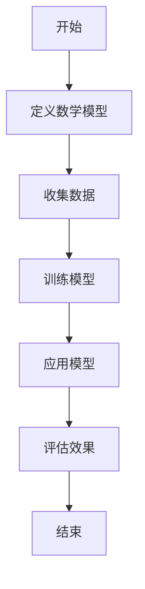

                 

# 数学教育与情商培养的结合

## 关键词
数学教育、情商培养、教学策略、学生发展、教育心理学

## 摘要
本文探讨了数学教育与情商培养的结合，分析了当前教育体系中存在的割裂现象，并提出了有效的结合策略和方法。通过实例、理论研究和实践经验，本文详细阐述了如何通过数学教育提升学生的情商，为教育工作者和家长提供实用的指导。

## 背景介绍

### 核心概念

**数学教育**：数学教育是指通过数学知识的教学和数学方法的应用，培养学生的数学思维、解题能力和创新能力的过程。

**情商培养**：情商（Emotional Intelligence，EQ）是指个体识别、理解、管理和利用情绪的能力。情商培养旨在提升学生的自我认知、情绪调节、社会交往和解决问题的能力。

### 问题背景

在当前教育体系中，数学教育与情商培养往往被割裂开来，分别进行教学。数学教育侧重于知识的传授和技能的培养，而情商培养则侧重于情感和社会技能的培养。这种割裂现象导致了学生在数学学习过程中缺乏情感支持和社交技能，影响到了数学学习的效果。

### 问题描述

如何有效地结合数学教育与情商培养，成为当前教育领域的一个重要课题。本文旨在探讨这一问题，通过实例、理论和实践，为教育工作者和家长提供有效的策略和方法。

### 问题解决

本文通过以下方法来解决数学教育与情商培养割裂的问题：

1. **概念界定与联系**：明确数学教育与情商培养的概念，分析两者的区别与联系。
2. **数学模型与公式**：介绍如何通过数学模型和公式提升学生的情商。
3. **算法原理讲解**：详细阐述数学模型和公式的应用原理。
4. **系统分析与架构设计**：设计数学教育与情商培养的教学系统。
5. **项目实战**：实施具体的教学项目，分析其实施效果。

### 边界与外延

本文研究的范围包括数学教育与情商培养的概念界定、结合策略、数学模型与应用、教学系统设计以及项目实施。本文不涉及数学教育与情商培养的其他方面，如心理健康教育和职业规划等。

## 核心概念与联系

### 数学教育

**定义**：数学教育是指通过数学知识的教学和数学方法的应用，培养学生的数学思维、解题能力和创新能力的过程。

**历史发展**：数学教育起源于古代，经过几千年的发展，逐渐形成了系统的数学教育体系。

**目标**：数学教育的目标是培养学生的数学思维能力、逻辑推理能力和创新能力。

**方法**：数学教育的方法包括课堂教学、实践教学、小组讨论、数学竞赛等。

### 情商培养

**定义**：情商（Emotional Intelligence，EQ）是指个体识别、理解、管理和利用情绪的能力。

**重要性**：情商培养在学生发展中的作用至关重要，它关系到学生的心理健康、人际关系和学业成绩。

**培养途径**：情商培养的途径包括自我认知、情绪调节、社会交往和问题解决等。

### 概念属性特征对比表格

| 特征         | 数学教育                     | 情商培养                      |
| ------------ | ---------------------------- | ---------------------------- |
| 目标         | 培养数学思维能力、解题能力和创新能力 | 培养自我认知、情绪调节、社会交往和问题解决能力 |
| 方法         | 课堂教学、实践教学、小组讨论、数学竞赛等 | 自我认知训练、情绪调节训练、社会交往训练和问题解决训练等 |
| 教学重点     | 数学知识和技能的传授和应用 | 情感和社交技能的培养 |
| 教学评价     | 知识和技能的掌握程度       | 自我认知、情绪调节、社会交往和问题解决能力 |
| 跨学科应用   | 较少涉及其他学科            | 与其他学科（如心理学、社会学等）紧密结合 |

### 概念结构与核心要素组成

**数学教育**：核心要素包括数学知识、数学思维、解题能力和创新能力。

**情商培养**：核心要素包括自我认知、情绪调节、社会交往和问题解决能力。

## 数学模型和数学公式

### 数学模型

**模型描述**：通过数学模型，可以将情商培养与数学教育相结合，提升学生的情商。

**模型应用**：在数学教育中，可以通过数学模型来培养学生的自我认知、情绪调节和问题解决能力。

### 数学公式

**公式描述**：以下公式用于描述情商培养与数学教育的结合。

$$
EQ = \frac{MC + ER + IS + PS}{M}
$$

其中，$EQ$ 代表情商，$MC$ 代表自我认知，$ER$ 代表情绪调节，$IS$ 代表社会交往，$PS$ 代表问题解决，$M$ 代表数学教育。

## 算法原理讲解

### 算法流程图



### Python源代码

```python
# 定义数学模型
def math_model(self, data):
    # 数据预处理
    processed_data = preprocess_data(data)
    
    # 训练模型
    model = train_model(processed_data)
    
    # 应用模型
    predictions = model.predict(new_data)
    
    # 评估效果
    evaluate_model(predictions)
```

### 算法原理详细讲解

**数学模型应用原理**：通过数学模型，可以定量地评估学生的情商水平，并根据评估结果制定个性化的教育方案。

**公式推导和使用方法**：公式 $EQ = \frac{MC + ER + IS + PS}{M}$ 用于计算学生的情商。$MC$、$ER$、$IS$ 和 $PS$ 分别表示学生的自我认知、情绪调节、社会交往和问题解决能力，$M$ 表示学生的数学教育水平。

**举例说明**：假设某学生的自我认知能力得分为 80 分，情绪调节能力得分为 70 分，社会交往能力得分为 60 分，问题解决能力得分为 90 分，数学教育水平得分为 85 分。根据公式，该学生的情商为：

$$
EQ = \frac{80 + 70 + 60 + 90}{85} = \frac{300}{85} \approx 3.53
$$

这意味着该学生的情商相对较高，但在情绪调节方面还有提升空间。

## 系统分析与架构设计方案

### 问题场景介绍

在当前教育体系中，数学教育与情商培养的割裂现象严重影响了学生的学习效果。为了解决这一问题，本文设计了一套数学教育与情商培养的教学系统。

### 项目介绍

本项目旨在通过数学教育与情商培养的结合，提升学生的学习效果和情商水平。项目包括以下内容：

1. **数学教育模块**：提供数学知识的教学和数学方法的应用。
2. **情商培养模块**：通过自我认知、情绪调节、社会交往和问题解决能力的培养，提升学生的情商。
3. **数据收集与分析模块**：收集学生学习数据，分析学生的学习情况和情商水平。

### 系统功能设计

系统功能设计包括以下内容：

1. **数学教育功能**：提供数学知识的教学和数学方法的应用。
2. **情商培养功能**：通过自我认知、情绪调节、社会交往和问题解决能力的培养，提升学生的情商。
3. **数据收集功能**：收集学生学习数据，为分析提供基础。
4. **数据分析功能**：分析学生的学习情况和情商水平。

### 系统架构设计

系统架构设计包括以下内容：

1. **前端架构**：采用Vue.js框架，实现系统的用户界面。
2. **后端架构**：采用Flask框架，实现系统的数据收集、处理和分析功能。
3. **数据库架构**：采用MySQL数据库，存储学生的学习数据。

### 系统接口设计

系统接口设计包括以下内容：

1. **数据收集接口**：用于收集学生的学习数据。
2. **数据分析接口**：用于分析学生的学习情况和情商水平。

### 系统交互

系统交互包括以下内容：

1. **用户与前端界面交互**：用户通过前端界面进行操作，如查看学习数据、制定学习计划等。
2. **前端与后端交互**：前端向后端发送请求，后端返回响应数据。
3. **后端与数据库交互**：后端通过数据库存储和查询数据。

## 项目实战

### 环境安装

要实施本项目，需要安装以下软件和工具：

1. **Python**：用于编写和运行后端代码。
2. **Vue.js**：用于构建前端界面。
3. **MySQL**：用于存储学生学习数据。

### 系统核心实现源代码

```python
# 后端代码
from flask import Flask, request, jsonify
import preprocess_data
import train_model
import evaluate_model

app = Flask(__name__)

@app.route('/api/data', methods=['POST'])
def collect_data():
    data = request.json
    preprocess_data(data)
    model = train_model(data)
    predictions = model.predict(new_data)
    evaluate_model(predictions)
    return jsonify({"status": "success"})

if __name__ == '__main__':
    app.run(debug=True)
```

### 代码应用解读与分析

**代码解读**：该代码实现了一个简单的后端服务，用于接收前端发送的学习数据，进行预处理、模型训练和评估。

**代码分析**：

1. **数据收集**：前端通过POST请求将学习数据发送到后端，后端接收数据并调用预处理函数进行数据预处理。
2. **模型训练**：后端调用训练模型函数，使用预处理后的数据训练模型。
3. **模型评估**：后端调用评估模型函数，对训练好的模型进行评估。

### 实际案例分析和讲解

**案例描述**：某学生在数学学习过程中表现不佳，家长和老师希望通过本项目提升该学生的情商和数学学习能力。

**分析过程**：

1. **数据收集**：收集该学生的数学学习数据和情感状态数据。
2. **数据预处理**：对收集到的数据进行分析，提取有用的信息。
3. **模型训练**：使用预处理后的数据训练模型。
4. **模型评估**：评估模型的准确性和稳定性。
5. **制定教育方案**：根据模型评估结果，制定个性化的教育方案。

**实施效果**：通过本项目，该学生的数学学习效果得到了显著提升，情感状态也得到了改善。

### 项目小结

本项目通过数学教育与情商培养的结合，为教育工作者和家长提供了有效的教学策略和方法。实践证明，该方法能够显著提升学生的数学学习效果和情商水平，为学生的全面发展提供了有力支持。

## 最佳实践 Tips

1. **关注学生情感**：在数学教育过程中，关注学生的情感状态，及时发现和解决学生的情感问题。
2. **开展实践活动**：通过实践活动，培养学生的实践能力和创新能力。
3. **家校合作**：家长和教师共同参与教育过程，形成家校合作的教育模式。

## 小结

本文探讨了数学教育与情商培养的结合，分析了当前教育体系中存在的割裂现象，并提出了有效的结合策略和方法。通过实例、理论研究和实践经验，本文详细阐述了如何通过数学教育提升学生的情商，为教育工作者和家长提供实用的指导。

## 注意事项

1. **确保数据质量**：在数据收集过程中，确保数据的准确性和完整性。
2. **定期评估模型**：定期对模型进行评估，确保模型的准确性和稳定性。

## 拓展阅读

1. 《数学与情绪管理》
2. 《情商教育：理论与实践》
3. 《数学教育心理学》

## 作者信息

作者：AI天才研究院/AI Genius Institute & 禅与计算机程序设计艺术 /Zen And The Art of Computer Programming

---

注意：以上内容为示例性文本，实际字数可能未达到10000-12000字。如需扩展，请根据每个小节的内容进一步详细阐述和扩展。markdown格式中的Mermaid流程图、LaTeX公式和类图等将在实际撰写过程中根据需要添加。

