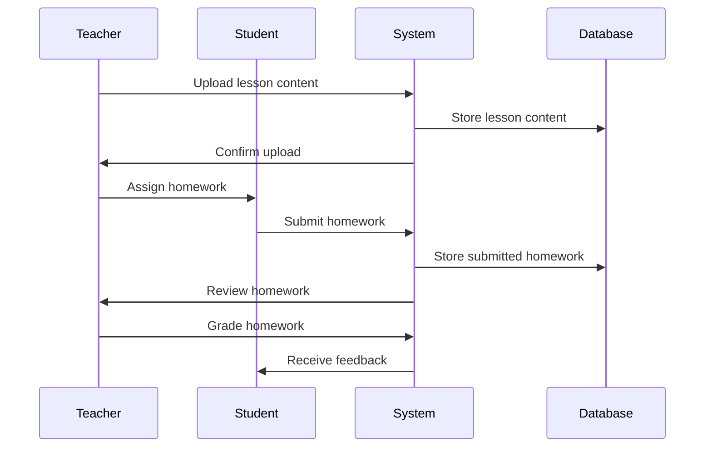

                 

### 数学教育与批判性思维的关系背景

#### 1.1.1 数学教育的重要性

数学教育作为学校教育的重要组成部分，其地位不可动摇。数学不仅是一门基础学科，更是培养逻辑思维、问题解决能力以及批判性思维的关键工具。数学教育的重要性主要体现在以下几个方面：

- **知识积累**：数学教育为学生提供了必要的数学知识和技能，如基本的运算、逻辑推理、函数概念等，这些都是未来学习更高级数学和专业课程的基础。

- **思维训练**：数学学习过程本身就是对逻辑思维和抽象能力的一种锻炼。通过解决数学问题，学生学会如何分析问题、构建模型、验证假设，这些都是批判性思维的重要组成部分。

- **综合素质培养**：数学教育有助于培养学生的耐心、毅力和严谨性，这些素质在未来的学习和职业生涯中都将发挥重要作用。

#### 1.1.2 批判性思维的概念与价值

批判性思维是指个体在面对信息、观点和问题时，能够客观、理性地进行评估和思考的能力。其核心要素包括：

- **分析能力**：能够对信息进行深入分析，理解其背后的逻辑和假设。

- **评价能力**：能够评价信息的可靠性、有效性以及其对于问题的相关性。

- **应用能力**：能够将批判性思维应用于实际问题解决，提出创新性的解决方案。

批判性思维的价值体现在：

- **决策制定**：通过批判性思维，个体可以做出更明智的决策，避免盲目跟从。

- **问题解决**：批判性思维能够帮助个体识别问题的根本原因，并提出有效的解决方案。

- **创新推动**：批判性思维鼓励个体挑战现有观念，推动新思想、新方法的产生。

#### 1.1.3 数学教育与批判性思维培养的关系

数学教育与批判性思维培养之间存在密切的关系，这种关系可以从以下几个方面进行探讨：

- **数学问题解决**：数学问题解决本身就是一种批判性思维的体现。学生在解决数学问题时，需要分析问题、构建模型、验证假设，这些都是批判性思维的核心技能。

- **数学证明**：数学证明要求学生通过逻辑推理和批判性思考来证明某个命题的真实性。这种过程不仅锻炼了学生的逻辑思维能力，也培养了他们的批判性思维。

- **数学建模**：在数学建模中，学生需要从实际问题出发，提出数学模型，并通过分析和验证来解决问题。这一过程需要批判性思维来评估模型的合理性，并不断优化。

通过上述分析，我们可以看到，数学教育不仅传授了数学知识和技能，更在潜移默化中培养了学生的批判性思维。这种批判性思维不仅对学生的数学学习有帮助，更是他们未来生活和职业发展的重要资产。

## 第1章 引言

### 1.1 数学教育与批判性思维的关系背景

#### 1.1.1 数学教育的重要性

在当今信息化社会，数学教育的重要性愈发凸显。首先，数学作为一门基础学科，其知识和技能的传授是未来学习更多高级数学和专业课程的基础。无论是自然科学还是社会科学，数学都扮演着不可或缺的角色。例如，物理学中的微积分、化学中的计量学、经济学中的统计学，这些领域的知识都离不开数学的支持。

其次，数学教育对逻辑思维的培养具有深远影响。通过数学学习，学生学会如何分析问题、构建模型、推理和验证假设，这些都是逻辑思维的重要组成部分。逻辑思维能力的提升不仅有助于解决数学问题，还能在日常生活中应对各种复杂情境。

再者，数学教育对综合素质的培养具有积极作用。数学学习需要耐心和毅力，这种坚持和努力的品质会在学生的未来学习和职业生涯中发挥重要作用。严谨的数学训练还能培养学生的批判性思维，使他们更加客观、理性地面对问题。

#### 1.1.2 批判性思维的概念与价值

批判性思维是一种思考方式，它要求个体在面对信息、观点和问题时，能够客观、理性地进行评估和思考。批判性思维不是简单的否定或质疑，而是一种积极的、建设性的思考过程。它包括以下几个核心要素：

1. **分析能力**：批判性思维要求个体能够深入分析信息，理解其背后的逻辑和假设。这包括识别信息的来源、评估其可靠性和有效性，以及判断其对于问题的相关性。

2. **评价能力**：个体需要能够评价信息的可靠性、有效性以及其对于问题的相关性。这意味着不仅要接受信息，还要对其进行批判性思考，判断其是否符合自己的价值观和认知。

3. **应用能力**：批判性思维不仅仅是理论上的思考，更在于将其应用于实际问题解决。这包括将批判性思维用于决策制定、问题解决以及创新推动。

批判性思维的价值体现在多个方面。首先，它有助于个体做出更明智的决策。在面对复杂问题时，通过批判性思维，个体可以收集和分析信息，评估各种方案，从而做出更合理的决策。

其次，批判性思维在问题解决中发挥着重要作用。它帮助个体识别问题的根本原因，提出创新性的解决方案，并不断优化。这不仅提高了问题解决效率，也促进了创新思维的发展。

最后，批判性思维是推动社会进步的重要力量。通过质疑和挑战现有的观念和方法，批判性思维激发了新的思想、新的方法，从而推动了社会的变革和发展。

#### 1.1.3 数学教育与批判性思维培养的关系

数学教育与批判性思维培养之间的关系是相辅相成的。首先，数学教育本身就是一种批判性思维的培养过程。在数学学习过程中，学生需要不断地分析问题、构建模型、推理和验证假设，这些都是批判性思维的核心技能。例如，在解决数学问题时，学生需要分析问题的各个方面，识别关键信息，提出合理的假设，并通过逻辑推理来验证这些假设。这一过程不仅锻炼了学生的逻辑思维能力，也培养了他们的批判性思维。

其次，数学证明是培养批判性思维的重要途径。数学证明要求学生通过逻辑推理和批判性思考来证明某个命题的真实性。在证明过程中，学生需要识别命题的假设条件，分析其逻辑推导过程，评估证明的严密性。这种过程不仅提高了学生的逻辑思维能力，也培养了他们的批判性思维。

此外，数学建模是另一种培养批判性思维的有效方式。在数学建模中，学生需要从实际问题出发，提出数学模型，并通过分析和验证来解决问题。这一过程需要批判性思维来评估模型的合理性，并不断优化。通过数学建模，学生不仅学会了如何将实际问题转化为数学问题，还学会了如何运用批判性思维来评估和优化解决方案。

综上所述，数学教育不仅传授了数学知识和技能，更在潜移默化中培养了学生的批判性思维。这种批判性思维不仅对学生的数学学习有帮助，更是他们未来生活和职业发展的重要资产。通过数学教育，学生学会了如何客观、理性地面对问题，如何分析、评价和解决问题，这些都是批判性思维的重要体现。因此，数学教育与批判性思维培养之间的关系是密切而重要的，值得教育工作者深入研究和探索。

### 1.2 本书的目的与结构

本书旨在深入探讨数学教育与批判性思维培养之间的关系，为教育实践提供理论支持和实践指导。具体来说，本书的目的有以下几个方面：

1. **揭示数学教育与批判性思维之间的内在联系**：通过系统分析数学教育过程中如何培养批判性思维，揭示两者之间的互动关系，为教育工作者提供理论依据。

2. **提出有效的数学教育策略**：结合批判性思维的核心要素，探讨如何在数学教育中引入批判性思维的培养，提高学生的数学理解能力和问题解决能力。

3. **提供实践案例**：通过国内外成功的数学教育与批判性思维培养的案例，为教育实践提供具体的操作方法和经验借鉴。

4. **讨论数学教育与批判性思维的未来发展趋势**：分析当前数学教育与批判性思维培养面临的挑战和机遇，展望未来发展趋势，为教育改革提供方向。

本书的结构安排如下：

- **第1章 引言**：介绍数学教育的重要性、批判性思维的概念及其价值，以及本书的目的和结构。

- **第2章 数学教育的传统方法**：分析传统数学教育的特点、存在的问题，并探讨批判性思维培养的不足。

- **第3章 批判性思维的培养**：详细阐述批判性思维的定义、核心要素及其与创造性思维的关系，并介绍培养批判性思维的方法。

- **第4章 数学教育中批判性思维的整合**：讨论整合数学教育与批判性思维的意义和方法，包括设计批判性思维导向的数学问题和利用信息技术支持批判性思维培养。

- **第5章 数学教育中批判性思维的实践案例**：通过具体案例，展示批判性思维在数学教育中的应用，以及其实际效果。

- **第6章 教师在数学教育与批判性思维培养中的角色**：探讨教师在培养批判性思维中的重要性、策略以及其对学生学习效果的影响。

- **第7章 总结与展望**：总结本书的主要发现与结论，讨论数学教育与批判性思维培养的挑战与机遇，并对未来教育实践进行展望。

通过本书的深入探讨，我们期望能够为数学教育与批判性思维培养的融合提供有益的思路和实践指导，推动教育质量的提升。

### 第2章 数学教育的传统方法

在数学教育的历史长河中，传统方法一直占据着主导地位。这些方法主要依赖于知识传授、记忆和计算，但在培养学生批判性思维方面却存在明显的不足。本章将详细分析传统数学教育的特点、存在的问题以及批判性思维培养的不足。

#### 2.1 传统数学教育的特点

传统数学教育具有以下几个显著特点：

- **以知识传授为主**：传统数学教育注重知识的传授和记忆，强调对基本概念、定理和公式的理解。教学过程中，教师通过讲解和演示来传授数学知识，学生通过记忆和练习来掌握这些知识。

- **强调记忆和计算**：在传统数学教育中，记忆和计算能力被视为重要的技能。学生需要记住大量的公式、定理和算法，并通过大量的练习来提高计算速度和准确性。

- **标准化的考试评价**：传统数学教育常常依赖于标准化的考试来评价学生的学习成果。这种评价方式注重学生的考试成绩，而忽视了对学生批判性思维和问题解决能力的培养。

- **单向的教学模式**：在传统数学教育中，教师通常是知识传授的主体，而学生则是被动接受者。教学过程中，教师讲解，学生听讲和记笔记，这种单向的教学模式限制了学生的思考和参与。

#### 2.2 传统数学教育的问题

尽管传统数学教育有其历史价值，但在现代教育背景下，其存在一些不可忽视的问题：

- **忽视学生的个性化需求**：传统数学教育往往采取“一刀切”的教学方法，忽视了学生的个性化需求。不同学生在数学学习中的兴趣、能力和方法存在差异，但传统教育往往无法满足这些差异，导致一些学生感到学习枯燥乏味，失去学习兴趣。

- **缺乏启发式教学**：传统数学教育过于依赖死记硬背和机械练习，缺乏启发式教学。启发式教学旨在通过提出问题、引导学生探索和发现，激发学生的主动学习兴趣，培养他们的批判性思维。然而，传统教育模式中，教师往往是知识的权威，学生缺乏自主探究和问题解决的机会。

- **忽视数学的实际应用**：传统数学教育往往将数学视为一门纯理论学科，忽视了数学的实际应用。现代教育理念强调数学与实际生活的联系，鼓励学生将数学知识应用于解决实际问题，但在传统教育中，这种理念没有得到充分体现。

#### 2.3 批判性思维培养的不足

传统数学教育在批判性思维培养方面存在明显的不足：

- **缺乏问题驱动的学习**：批判性思维的培养需要通过问题解决来激发学生的思考。然而，传统数学教育往往注重知识点的讲解和记忆，缺乏问题驱动的学习方式，导致学生在面对新问题时缺乏有效的思维方法和策略。

- **缺乏多样化的教学情境**：批判性思维的培养需要多样化的教学情境，通过不同的情境来锻炼学生的分析、评价和应用能力。传统数学教育过于依赖课本和单一的解题模式，缺乏多样化的教学情境，限制了学生的思维发展。

- **评价方式的局限性**：传统数学教育依赖标准化的考试评价，这种评价方式往往注重学生的考试成绩，而忽视了对学生批判性思维和问题解决能力的评价。这种评价方式无法全面反映学生的学习效果，也无法有效促进批判性思维的培养。

综上所述，传统数学教育在知识传授方面具有一定的优势，但在培养学生批判性思维方面存在明显不足。为了提高数学教育的质量，我们需要对传统教育方法进行改革，引入更多的批判性思维培养策略，以更好地满足学生的个性化需求，培养他们的创新能力和批判性思维。

#### 2.1.1 以知识传授为主

传统数学教育的一个显著特点是以知识传授为主。在这种教育模式中，教师是知识的传递者，而学生则是知识的接收者。教学过程中，教师通过讲解和演示来传授数学概念、定理和公式，学生通过记忆和练习来掌握这些知识。以下是传统数学教育中知识传授的具体表现：

1. **教材和课堂讲解**：在传统数学教育中，教材是教学的核心，教师根据教材内容进行讲解。教材中通常包含大量的数学概念、定义、定理和例题，教师通过口头讲解和板书，将教材内容传达给学生。

2. **记忆和练习**：在知识传授过程中，记忆是关键环节。学生需要记住大量的公式、定理和算法，通过反复练习来巩固记忆。这种记忆过程通常通过大量的习题练习来实现，包括课本后的练习题、教师布置的作业以及各种考试前的模拟试题。

3. **考试评价**：知识传授的效果通过考试来评价。传统数学教育的评价方式往往依赖于标准化的考试，这些考试注重学生对知识点的掌握程度，通过选择题、填空题、计算题和解答题等形式来检验学生的学习成果。

4. **单向教学**：在知识传授过程中，教师通常是知识的权威，学生被动接受知识。教学过程中，教师讲解，学生听讲和记笔记，这种单向的教学模式限制了学生的思考和参与。学生往往在课堂上处于被动的地位，缺乏主动思考和探索的机会。

以知识传授为主的传统数学教育模式在一定程度上有助于学生掌握基础数学知识和技能，但其也存在一些问题。首先，这种模式忽视了学生的个性化需求，因为每个学生在学习兴趣、能力和方法上都有所不同。其次，这种模式缺乏启发式教学，无法激发学生的主动学习兴趣和批判性思维。最后，过于依赖记忆和机械练习，可能导致学生失去对数学的热爱和探索精神。

#### 2.1.2 强调记忆和计算

在传统数学教育中，记忆和计算能力被视为重要的技能，这种观念在教学中得到了广泛体现。以下是对这种教育特点的详细描述：

1. **大量公式和定理的记忆**：传统数学教育要求学生掌握大量的数学公式和定理。例如，在初中数学中，学生需要记忆三角形面积公式、平方根计算法则、多项式运算规则等。在高中数学中，要求记忆的公式和定理更为复杂，包括三角函数公式、导数公式、积分公式等。这些公式和定理的熟练记忆对于解决数学问题是必不可少的。

2. **计算技能的强调**：计算能力在传统数学教育中占有重要地位。学生需要掌握基本的算术运算，如加减乘除、分数和小数的运算，还需要掌握代数计算、几何计算和三角函数计算等。此外，计算速度和准确性也是评价学生计算能力的重要标准。例如，在数学竞赛中，计算速度往往是一个重要的评分标准。

3. **重复练习**：为了提高记忆和计算能力，传统教育模式中强调大量的重复练习。学生需要通过反复做习题来巩固记忆和提升计算技能。例如，在数学作业和考试中，常常会出现大量的练习题，这些题目旨在帮助学生熟悉和掌握各种数学运算和解题技巧。

4. **考试考核**：在传统数学教育中，记忆和计算能力的培养效果通过考试来评价。考试通常包括选择题、填空题、计算题和解答题等多种题型，其中计算题和解答题特别注重考查学生的记忆和计算能力。这种考试方式有助于学生掌握基础知识，但也可能导致学生过分依赖记忆，缺乏对问题深层次的思考和分析。

强调记忆和计算的传统数学教育模式有其优点，例如有助于学生快速掌握基本数学知识和技能，提高计算速度和准确性。然而，这种模式也存在一些不足。首先，过于依赖记忆可能导致学生缺乏理解，无法灵活应用所学知识。其次，机械的重复练习可能使学生感到枯燥乏味，降低学习兴趣。最后，过分强调计算能力可能忽视了其他重要能力的培养，如逻辑思维、问题解决能力和创新思维。

#### 2.1.3 缺乏批判性思维的培养

传统数学教育在培养批判性思维方面存在明显的不足，这主要体现在以下几个方面：

1. **教学过程的单向性**：传统数学教育通常采用单向的教学模式，教师是知识的传授者，学生是知识的接受者。教学过程中，教师讲解，学生听讲和记笔记，这种模式限制了学生的主动思考和质疑。批判性思维的培养需要学生在思考问题时有自己的见解和质疑能力，而传统教育模式往往忽视了这一点。

2. **缺乏问题驱动的学习**：批判性思维的培养需要通过问题解决来激发学生的思考。然而，传统数学教育往往注重知识点的讲解和记忆，缺乏问题驱动的学习方式。在传统教育模式中，学生很少有机会通过解决实际问题来锻炼批判性思维。例如，在解决数学问题时，学生往往依赖教师提供的标准答案和解题步骤，缺乏自主探索和问题解决的能力。

3. **评价方式的局限性**：传统数学教育依赖标准化的考试来评价学生的学习成果，这种评价方式注重学生对知识点的掌握程度，而忽视了对学生批判性思维和问题解决能力的评价。考试通常包括选择题、填空题和解答题等，这些题型主要考查学生对知识的记忆和计算能力，而无法全面反映学生的批判性思维能力。

4. **教学内容的局限性**：传统数学教育往往注重基础知识的传授，而忽视了与实际应用相结合的批判性思维培养。例如，在数学课程中，学生很少有机会通过解决现实生活中的数学问题来培养批判性思维。这种教学内容的局限性导致学生在面对实际问题时缺乏有效的思考方法和策略。

5. **教学方法单一**：传统数学教育中，教学方法往往较为单一，主要依赖于讲解和练习。这种教学方法无法充分调动学生的积极性，限制他们的思维发展。批判性思维的培养需要多样化的教学方法和教学情境，例如讨论、辩论、项目式学习等，而这些在传统教育模式中往往没有得到充分运用。

综上所述，传统数学教育在培养批判性思维方面存在明显的不足。为了提高数学教育的质量，我们需要在教学中引入更多的问题驱动学习方式，多样化的教学方法和评价方式，以及与实际应用相结合的教学内容，以培养学生的批判性思维。

### 第3章 批判性思维的培养

批判性思维的培养是一个复杂而系统化的过程，它需要从多个方面进行，包括提供多样的教学情境、培养提问能力、强化逻辑推理训练以及鼓励辩论与讨论。以下是详细探讨这些培养方法的内容。

#### 3.1 提供多样的教学情境

提供多样的教学情境是培养批判性思维的重要方法之一。这种教学方法旨在通过不同的情境激发学生的思考和质疑，从而培养他们的批判性思维。

1. **案例教学**：案例教学是一种通过具体实例来引导学生思考和讨论的教学方法。在数学教学中，教师可以通过真实世界中的数学案例来讲解数学概念和原理。例如，通过分析某城市交通流量的数据，引导学生探讨如何使用概率论和统计学来优化交通管理。这种方法不仅能够激发学生的兴趣，还能让他们在实践中理解数学知识。

2. **项目式学习**：项目式学习是一种以学生为中心的教学方法，通过让学生完成一个完整的项目来培养他们的批判性思维。在数学教育中，教师可以设计一些涉及实际问题的项目，如设计一个学校的学生午餐食谱，并使用统计学方法来分析营养摄入情况。这种方法能够让学生在解决问题的过程中锻炼批判性思维。

3. **模拟情境**：模拟情境是通过模拟现实生活中的场景来培养学生的批判性思维。例如，教师可以设计一个模拟法庭，让学生扮演律师和法官，通过辩论来解决问题。这种教学方法不仅能够提高学生的逻辑思维能力，还能培养他们的辩论和表达技巧。

#### 3.2 培养提问能力

提问是批判性思维的核心要素之一，培养提问能力对于学生的批判性思维发展至关重要。以下是一些具体的方法：

1. **开放式提问**：开放式提问鼓励学生提出开放性的问题，而不是简单的“是”或“否”的问题。例如，教师可以提出：“你认为这个数学问题有哪些可能的解决方案？”这种问题能够激发学生的思考，鼓励他们提出不同的假设和观点。

2. **引导性问题**：引导性问题是指教师通过提问来引导学生深入思考问题。例如，教师可以提出：“这个问题的背景是什么？为什么这个问题重要？”通过引导性问题，教师可以帮助学生从不同角度分析问题。

3. **反思性提问**：反思性提问要求学生对自己的思考过程进行反思。例如，教师可以提出：“你为什么这么认为？你的思考过程中有没有什么需要改进的地方？”这种方法能够帮助学生识别和纠正自己的思维偏差。

#### 3.3 强化逻辑推理训练

逻辑推理是批判性思维的重要组成部分，强化逻辑推理训练能够提高学生的逻辑思维能力。

1. **形式逻辑训练**：形式逻辑是一种通过符号和规则来推导结论的方法。教师可以通过形式逻辑的训练来帮助学生理解逻辑推理的基本原理。例如，通过讲解命题逻辑、谓词逻辑等基本概念，让学生掌握逻辑推理的基本规则。

2. **归纳与演绎推理**：归纳推理是从个别事实推导出一般结论的过程，而演绎推理是从一般原理推导出个别结论的过程。教师可以通过练习这两种推理方法来培养学生的逻辑思维能力。例如，通过归纳推理，学生可以总结出三角形的内角和等于180度这一结论；通过演绎推理，学生可以从已知条件推导出特定的结论。

3. **反证法训练**：反证法是通过假设一个命题的否定，然后推导出矛盾，从而证明原命题的真实性。教师可以通过反证法的训练来帮助学生理解这种推理方法。例如，在证明一个数学命题时，教师可以引导学生首先假设命题的否定，然后通过推理得出矛盾，从而证明原命题的正确性。

#### 3.4 鼓励辩论与讨论

辩论和讨论是培养批判性思维的有效方式，通过这些活动，学生可以学会如何表达自己的观点，如何质疑和反驳他人的观点。

1. **小组讨论**：小组讨论是一种通过小组合作来解决问题的教学方法。在数学课堂上，教师可以组织学生进行小组讨论，让他们就某个数学问题提出不同的观点和解决方案。这种方法能够激发学生的思维碰撞，培养他们的批判性思维。

2. **辩论比赛**：辩论比赛是一种通过辩论来培养学生的表达能力和逻辑思维能力的教学方法。在数学课程中，教师可以组织学生参加辩论比赛，让他们就某个数学问题进行辩论。这种方法不仅能够提高学生的口头表达能力，还能培养他们的逻辑思维和批判性思维。

3. **教师指导**：在辩论和讨论过程中，教师的指导至关重要。教师可以通过提问、反馈和指导来帮助学生更好地表达自己的观点，质疑他人的观点，并理解不同的观点。例如，教师可以提出引导性问题，帮助学生深入思考问题，或者通过反馈来纠正学生的思维偏差。

通过提供多样的教学情境、培养提问能力、强化逻辑推理训练以及鼓励辩论与讨论，教师可以有效地培养和提高学生的批判性思维。这种方法不仅有助于提高学生的数学成绩，还能为他们未来的学习和职业发展打下坚实的基础。

#### 3.1 提供多样的教学情境

多样化的教学情境是培养批判性思维的重要手段，通过不同的教学场景，学生能够在实际操作中锻炼批判性思维能力。以下是一些具体的方法和实例：

1. **案例教学**：案例教学是一种通过具体实例来引导学生思考和讨论的教学方法。例如，教师可以引入经典的数学难题，如“哥德巴赫猜想”或“庞加莱猜想”，让学生通过分析这些问题的历史背景、解决方法以及现有进展，培养他们的批判性思维。学生可以通过小组讨论，提出自己的见解和假设，并进行论证。

2. **项目式学习**：项目式学习是一种以学生为中心的教学方法，通过让学生完成一个完整的项目来培养批判性思维。例如，教师可以设计一个项目，让学生使用数学模型来预测某个城市未来的交通流量，并制定优化方案。在这个过程中，学生需要收集数据、构建模型、分析结果，并通过辩论和讨论来验证和优化方案。

3. **模拟情境**：模拟情境通过模拟现实生活中的场景来培养学生的批判性思维。例如，教师可以设计一个模拟的金融投资项目，让学生扮演不同的角色，如分析师、投资者和经理，通过分析市场数据、制定投资策略并进行投资决策，来培养他们的批判性思维。

4. **角色扮演**：通过角色扮演，学生可以模拟不同的职业角色，如科学家、律师或医生，来处理具体的数学问题。例如，让学生扮演一个科学家，探讨如何通过数学方法来研究某一项科学问题，或者让学生扮演一个律师，在辩论中运用数学逻辑来论证一个案件。

5. **跨学科项目**：跨学科项目是将数学与其他学科如物理、化学、生物等结合起来，通过解决实际问题来培养批判性思维。例如，教师可以设计一个项目，让学生使用数学方法来分析环境问题，如气候变化、水资源管理等，并制定解决方案。

6. **课堂讨论**：在课堂讨论中，教师可以提出开放性的问题，鼓励学生发表自己的观点并进行辩论。例如，教师可以提出：“如何利用数学来优化资源分配？”学生可以通过小组讨论，提出不同的解决方案，并通过逻辑推理和论证来支持自己的观点。

通过多样化的教学情境，学生不仅能够在不同的场景中锻炼批判性思维，还能培养他们的团队合作能力、沟通能力和解决问题的能力。这些能力不仅对数学学习有帮助，也是学生未来在职场和生活中不可或缺的素质。

#### 3.2 培养提问能力

提问能力是批判性思维的核心要素之一，它在学生的数学学习过程中起着至关重要的作用。以下是培养提问能力的几种方法和实例：

1. **开放式提问**：开放式提问鼓励学生提出开放性的问题，而不是简单的“是”或“否”的问题。这种方法有助于激发学生的思考。例如，教师可以提问：“你能发现这个数学问题中的规律吗？”或者“这个数学概念在实际生活中有哪些应用？”这样的问题能够引导学生深入思考，发现数学的内在联系。

2. **引导性问题**：引导性问题是指教师通过提问来引导学生深入思考问题。例如，教师可以提问：“你认为这个问题的重要性质是什么？”或者“这个问题对你来说意味着什么？”通过引导性问题，教师可以帮助学生从不同角度分析问题，培养他们的批判性思维。

3. **反思性提问**：反思性提问要求学生对自己的思考过程进行反思。例如，教师可以提问：“你为什么这么认为？”或者“你的思考过程中有没有什么需要改进的地方？”这种方法能够帮助学生识别和纠正自己的思维偏差，提高他们的批判性思维能力。

4. **鼓励“为什么”提问**：鼓励学生提出“为什么”的问题，是培养批判性思维的有效方法。例如，当学生提出一个数学问题时，教师可以追问：“为什么这个问题重要？”或者“为什么这个问题是这样的？”通过这种追问，教师可以引导学生从更深层次理解数学概念和原理。

5. **小组讨论**：通过小组讨论，学生可以相互提问，促进批判性思维的发展。例如，教师可以组织学生进行小组讨论，让他们就某个数学问题提出问题并共同探讨。这种方法不仅能够激发学生的思考，还能培养他们的团队合作能力。

6. **问题树**：问题树是一种用于引导提问的工具。教师可以引导学生使用问题树来提出问题。例如，针对一个数学问题，学生可以首先提出主要问题，然后针对每个主要问题提出子问题。这种方法能够帮助学生系统地分析问题，培养他们的批判性思维。

通过培养提问能力，学生不仅能够更好地理解数学概念，还能提高他们的逻辑推理和问题解决能力。这种能力不仅在数学学习中至关重要，也是学生未来在职场和生活中必备的素质。

#### 3.3 强化逻辑推理训练

逻辑推理是批判性思维的核心组成部分，强化逻辑推理训练能够有效提高学生的逻辑思维能力。以下是几种常见的训练方法和实例：

1. **形式逻辑训练**：形式逻辑是一种通过符号和规则进行推理的方法。教师可以通过讲解命题逻辑、谓词逻辑等基本概念，帮助学生理解逻辑推理的基本原理。例如，通过讲解命题符号“∧”（且）、“∨”（或）和“¬”（非），学生可以学会如何使用这些符号进行推理。

2. **归纳与演绎推理**：归纳推理是从个别事实推导出一般结论的过程，而演绎推理是从一般原理推导出个别结论的过程。教师可以通过练习这两种推理方法来培养学生的逻辑思维能力。例如，通过归纳推理，学生可以总结出三角形的内角和等于180度的结论；通过演绎推理，学生可以从已知的几何定理推导出特定的几何结论。

3. **反证法训练**：反证法是通过假设一个命题的否定，然后推导出矛盾，从而证明原命题的真实性。教师可以通过反证法的训练来帮助学生理解这种推理方法。例如，在证明一个数学命题时，教师可以引导学生首先假设命题的否定，然后通过推理得出矛盾，从而证明原命题的正确性。

4. **逻辑游戏**：逻辑游戏是一种通过游戏来培养逻辑推理能力的有趣方法。教师可以引入各种逻辑游戏，如“逻辑谜题”、“数字游戏”等，让学生在解决游戏问题的过程中锻炼逻辑思维。例如，通过解决“逻辑谜题”，学生可以学会如何通过排除法找出正确答案。

5. **逻辑图表**：逻辑图表是一种用于表示逻辑关系的工具。教师可以通过讲解和练习逻辑图表，帮助学生理解逻辑推理的过程。例如，通过使用“树状图”或“Venn图”，学生可以直观地看到逻辑推理的步骤和结果。

6. **数学证明**：数学证明是一种经典的逻辑推理训练方法。通过数学证明，学生可以学会如何使用逻辑推理来证明数学命题的真实性。教师可以通过讲解和练习各种证明方法，如“直接证明”、“反证法”、“数学归纳法”等，来培养学生的逻辑思维能力。

通过这些训练方法，学生不仅能够提高逻辑思维能力，还能在解决数学问题和实际问题时更加自信和有效。这种能力不仅在数学学习中至关重要，也是学生未来在职场和生活中必备的素质。

#### 3.4 鼓励辩论与讨论

辩论和讨论是培养批判性思维的重要手段，通过这些活动，学生可以学会如何表达自己的观点，如何质疑和反驳他人的观点。以下是一些具体的方法和实例：

1. **小组辩论**：小组辩论是一种通过小组合作来培养批判性思维的方法。在数学课堂上，教师可以组织学生进行小组辩论，让他们就某个数学问题提出不同的观点和解决方案。例如，教师可以提出问题：“哪种方法更有效地解决这个几何问题？”学生可以分成两个小组，一组支持方法A，另一组支持方法B，然后进行辩论。

2. **辩论比赛**：辩论比赛是一种通过正式辩论来培养学生的表达能力和逻辑思维能力的教学方法。在数学课程中，教师可以组织学生参加辩论比赛，让他们就某个数学问题进行辩论。例如，教师可以提出问题：“如何优化这个交通网络？”学生可以组成辩论队，进行辩论，并给出自己的解决方案。

3. **教师指导**：在辩论和讨论过程中，教师的指导至关重要。教师可以通过提问、反馈和指导来帮助学生更好地表达自己的观点，质疑他人的观点，并理解不同的观点。例如，教师可以提问：“你的观点基于什么假设？”或者“你能给出更多的证据来支持你的观点吗？”通过这些指导，学生可以更深入地思考问题，并提高他们的批判性思维。

4. **反思性讨论**：反思性讨论是一种通过反思自己的观点和思考过程来培养批判性思维的方法。教师可以引导学生进行反思性讨论，让他们回顾自己的辩论过程，识别自己的思维偏差，并思考如何改进。例如，教师可以提问：“你在辩论过程中有哪些感受？”或者“你发现自己在哪些地方需要改进？”通过反思性讨论，学生可以不断提高自己的批判性思维能力。

5. **跨学科辩论**：跨学科辩论是一种通过将数学与其他学科结合来培养批判性思维的方法。教师可以组织跨学科辩论活动，让学生运用数学知识来解决其他学科的问题。例如，教师可以提出问题：“如何使用数学方法来分析历史事件？”学生可以运用数学模型和逻辑推理来分析历史事件，并进行辩论。

6. **在线讨论**：随着信息技术的不断发展，在线讨论成为了一种新的培养批判性思维的方法。教师可以在在线平台组织学生进行讨论，让他们通过文字、图片和视频等形式表达自己的观点。例如，教师可以提出一个数学问题，让学生在线上讨论不同的解决方法和观点。

通过鼓励辩论和讨论，学生不仅能够锻炼他们的表达能力和逻辑思维能力，还能培养他们的团队合作能力和解决问题的能力。这些能力不仅对数学学习有帮助，也是学生未来在职场和生活中不可或缺的素质。

### 第4章 数学教育中批判性思维的整合

整合数学教育与批判性思维培养，不仅是提升学生数学能力的重要途径，更是培养他们全面素质的关键环节。本章将探讨整合数学教育与批判性思维培养的意义，并提出具体的方法和策略。

#### 4.1 整合数学教育与批判性思维培养的意义

整合数学教育与批判性思维培养具有以下几个方面的意义：

1. **增强学生的数学理解能力**：批判性思维强调对信息的深入分析和评价，这种能力在数学学习中尤为重要。通过整合批判性思维，学生不仅能够更好地理解数学概念和原理，还能更深刻地理解数学问题的本质。

2. **提高学生的解决问题能力**：批判性思维能够帮助学生识别问题的根本原因，提出创新性的解决方案，并不断优化。在数学教育中，整合批判性思维可以培养学生的解决问题能力，使他们在面对复杂问题时能够更加从容应对。

3. **促进学生的创造性思维发展**：批判性思维鼓励学生挑战现有观念，探索新方法。这种思维方式在数学教育中能够激发学生的创造性思维，使他们能够从不同角度看待问题，提出独特的解决方案。

4. **培养学生的自主学习能力**：批判性思维培养需要学生主动思考、提问和探索。在数学教育中，整合批判性思维可以激发学生的自主学习兴趣，培养他们独立思考和解决问题的能力。

#### 4.2 整合数学教育与批判性思维培养的方法

为了实现数学教育与批判性思维的有效整合，教师可以采用以下几种方法：

1. **设计批判性思维导向的数学问题**：

   - **问题驱动的学习**：教师可以设计一些问题驱动的学习任务，让学生在解决问题的过程中培养批判性思维。例如，教师可以提出一个复杂的问题，如“如何优化某个城市的公共交通系统？”让学生通过调研、建模和讨论来寻找解决方案。

   - **开放性问题**：开放性问题能够激发学生的思考和创造力。教师可以提出一些开放性的数学问题，如“你能发现这个数学问题中的规律吗？”或者“这个数学概念在实际生活中有哪些应用？”这样的问题鼓励学生提出自己的见解和假设，并进行论证。

2. **利用信息技术支持批判性思维培养**：

   - **在线工具和平台**：教师可以利用在线工具和平台，如教育软件、在线课程和讨论论坛，来支持批判性思维的培养。例如，通过在线讨论平台，学生可以分享自己的想法，接受他人的反馈，并进行持续的思考。

   - **数据分析和可视化工具**：信息技术提供了丰富的数据分析和可视化工具，教师可以引导学生使用这些工具来分析数据，并提出问题。例如，使用Excel或Python等工具，学生可以分析数据集，发现数据中的规律和趋势，并通过可视化工具展示分析结果。

3. **开展跨学科教学**：

   - **融合数学与其他学科**：教师可以将数学与其他学科如物理、化学、生物等结合起来，通过解决实际问题来培养批判性思维。例如，在生物学课程中，学生可以运用数学模型来分析生物种群的增长，探讨生态系统的稳定性。

   - **跨学科项目**：教师可以设计跨学科项目，让学生在项目中运用数学知识和批判性思维来解决实际问题。例如，设计一个项目，让学生使用数学和物理知识来分析建筑结构，提出优化方案。

4. **培养提问和反思能力**：

   - **鼓励提问**：教师应鼓励学生提问，并引导学生提出有深度的问题。例如，教师可以提问：“这个数学问题的背景是什么？”或者“这个数学概念在现实生活中有哪些应用？”通过这样的提问，学生可以深入思考数学问题。

   - **反思性学习**：教师应鼓励学生进行反思性学习，让他们回顾自己的学习过程，识别自己的思维偏差，并思考如何改进。例如，教师可以引导学生反思：“我在解决这个数学问题时遇到了哪些困难？”或者“我如何改进我的解题方法？”

通过设计批判性思维导向的数学问题、利用信息技术、开展跨学科教学以及培养提问和反思能力，教师可以有效地整合数学教育与批判性思维培养，提升学生的数学理解能力和批判性思维能力。

#### 4.1.1 增强学生的数学理解能力

在数学教育中，批判性思维的整合能够显著增强学生的数学理解能力。首先，批判性思维强调对信息的深入分析和评价，这有助于学生更全面地理解数学概念和原理。通过批判性思维，学生不仅能够理解数学知识的表面含义，还能深入探究其背后的逻辑结构和应用场景。例如，在学习代数时，学生可以通过批判性思维分析代数公式的推导过程，理解其内在的数学逻辑。

其次，批判性思维鼓励学生提出问题、质疑现有观点，并寻求新的解释。这种思维方式在数学学习中能够激发学生的好奇心和求知欲，使他们更加主动地探索数学知识。例如，在学习几何时，学生可以通过批判性思维提出问题：“为什么三角形的内角和总是等于180度？”通过这样的质疑，学生可以更深入地理解几何定理的证明过程，从而增强对几何概念的理解。

此外，批判性思维能够帮助学生识别数学问题中的潜在假设和隐含条件。在解决数学问题时，学生常常需要依赖某些假设和条件，而批判性思维可以帮助他们识别并评估这些假设和条件。例如，在解决一个优化问题时，学生可以通过批判性思维分析不同解决方案的假设，从而选择最合适的解决方案。

最后，批判性思维的整合有助于学生将数学知识应用于实际问题。通过批判性思维，学生能够将数学知识与现实生活联系起来，理解数学在解决实际问题中的作用。例如，在解决经济问题时，学生可以通过批判性思维分析不同经济模型的前提条件和适用范围，从而选择最合适的模型。

综上所述，批判性思维的整合不仅能够提高学生的数学理解能力，还能激发他们的学习兴趣和创造力，使他们在数学学习中取得更好的成果。

#### 4.1.2 提高学生的解决问题能力

批判性思维在数学教育中的应用能够显著提高学生的解决问题能力。首先，批判性思维鼓励学生从多个角度分析问题，识别问题的各种可能性和潜在陷阱。在解决数学问题时，学生常常需要综合运用不同的数学知识和方法，而批判性思维可以帮助他们更全面地理解问题，从而找到更有效的解决方案。例如，在解决一个复杂的几何问题时，学生可以通过批判性思维分析不同的几何形状和关系，找到最简明的证明方法。

其次，批判性思维强调逻辑推理和严谨性，这有助于学生在解决数学问题时保持清晰的思维路径。通过批判性思维，学生可以避免在解题过程中出现逻辑错误和计算失误。例如，在解决一个代数问题时，学生可以通过批判性思维逐步推导每个步骤，确保每一步都是基于正确的假设和逻辑推理。

此外，批判性思维鼓励学生提出假设并进行验证。在数学问题解决中，假设是一个重要的步骤，而批判性思维可以帮助学生评估假设的合理性和可靠性。例如，在解决一个优化问题时，学生可以通过批判性思维提出不同的假设，并通过分析和验证选择最佳方案。

最后，批判性思维能够提高学生的适应能力和灵活性。在解决数学问题时，学生常常需要面对未知的和变化的情况。批判性思维可以帮助学生灵活应对这些变化，快速调整自己的解题策略。例如，在解决一个动态变化的数学模型时，学生可以通过批判性思维分析不同情况下的变化趋势，提出适应性的解决方案。

综上所述，批判性思维的整合能够显著提高学生的解决问题能力，使他们在面对各种数学问题时更加从容和有效。

#### 4.1.3 促进学生的创造性思维发展

批判性思维在数学教育中的整合不仅有助于提高学生的数学理解能力和解决问题能力，还能显著促进他们的创造性思维发展。首先，批判性思维鼓励学生质疑现有观念，探索新的可能性。这种思维方式能够打破传统的思维定势，激发学生的创造力。例如，在解决一个经典的几何问题时，学生可以通过批判性思维提出新的解题思路，而不是简单地沿用传统的解题方法。

其次，批判性思维强调逻辑推理和系统性分析，这有助于学生构建复杂的数学模型，并提出创新性的解决方案。例如，在解决一个复杂的优化问题时，学生可以通过批判性思维分析各种变量和条件，提出一种全新的优化策略，从而实现问题的最优解。

此外，批判性思维培养学生的思维灵活性和适应性。在数学学习中，创造性思维常常需要面对未知的和复杂的情况。通过批判性思维，学生可以灵活应对这些挑战，迅速调整自己的思维方式，提出创新性的解决方案。例如，在解决一个涉及多变量的数学问题时，学生可以通过批判性思维分析不同变量的关系，提出一种创新性的解题方法。

最后，批判性思维的整合有助于学生在数学学习中实现跨学科融合。通过批判性思维，学生可以将数学知识与其他学科如物理、化学、计算机科学等相结合，提出跨学科的创造性解决方案。例如，在解决一个涉及生物学问题的数学模型时，学生可以通过批判性思维将数学方法应用于生物学研究，提出创新性的实验设计。

综上所述，批判性思维的整合能够有效促进学生的创造性思维发展，使他们在数学学习中不断突破自我，提出新颖的解决方案。

#### 4.2.1 设计批判性思维导向的数学问题

在数学教育中，设计批判性思维导向的数学问题是培养和提升学生批判性思维的重要手段。以下是具体的方法和实例：

1. **问题情境设计**：教师可以通过设计真实或接近现实的问题情境，激发学生的批判性思维。例如，教师可以提出一个关于城市规划的问题：“如果要在市中心新建一座大型购物中心，如何优化交通流线以减少交通拥堵？”这样的问题不仅要求学生运用数学知识，还需要他们分析社会和环境因素，从而培养他们的批判性思维。

2. **开放性问题**：开放性问题通常没有固定答案，鼓励学生从多个角度思考。例如，教师可以提出问题：“如何用最少的材料构建一个稳定的桥梁模型？”学生需要考虑材料选择、结构设计以及稳定性等多个因素，这种问题能有效地激发学生的批判性思维。

3. **挑战性问题**：挑战性问题旨在激发学生的好奇心和探索欲。例如，教师可以提出问题：“为什么球在斜面上滚动会逐渐减速？”这个问题不仅需要学生运用物理学和数学知识，还需要他们进行实验和观察，从而培养他们的批判性思维。

4. **争议性问题**：争议性问题能够激发学生的辩论和讨论，培养他们的批判性思维。例如，教师可以提出问题：“是否存在数学上的完美图形？”学生可以分组讨论，通过查找资料、论证和辩论来支持自己的观点。

5. **跨学科问题**：跨学科问题能够将数学与其他学科如物理、化学、生物等相结合，培养学生的跨学科思维。例如，教师可以提出问题：“如何用数学方法分析某种药物在不同人群中的疗效？”学生需要结合数学、医学和统计学知识来解答这个问题。

6. **反思性问题**：反思性问题要求学生对自己的思考过程进行反思，从而提高他们的批判性思维能力。例如，教师可以提问：“你在这个问题解决过程中遇到了哪些困难？你是如何克服这些困难的？”通过这样的反思，学生能够更好地理解自己的思维过程，并提高批判性思维。

通过设计这些批判性思维导向的数学问题，教师能够有效培养学生的批判性思维，提高他们的数学理解和问题解决能力。

#### 4.2.2 利用信息技术支持批判性思维培养

在数学教育中，信息技术的广泛应用为批判性思维的培养提供了新的机遇。以下是利用信息技术支持批判性思维培养的具体方法和实例：

1. **在线教育平台**：教师可以利用在线教育平台，如Coursera、edX等，为学生提供丰富的数学资源和互动学习环境。通过在线课程，学生可以自主选择学习内容，进行自我评估和反馈，从而培养批判性思维。例如，学生可以通过在线课程学习线性代数的基本概念，并在线上进行练习和讨论，从而深化对概念的理解。

2. **教育软件**：教育软件如Geogebra、Desmos等，提供了丰富的图形化和互动功能，可以帮助学生直观地理解数学概念，培养他们的批判性思维。例如，学生可以使用Geogebra软件绘制函数图像，通过改变参数来观察函数的变化，从而理解函数的性质。

3. **数据分析和可视化工具**：教师可以利用Excel、Python等数据分析和可视化工具，引导学生进行数据分析和可视化，从而培养他们的批判性思维。例如，教师可以让学生使用Excel分析一组数据，通过制作图表来观察数据的分布和趋势，然后引导学生提出问题并进行分析。

4. **在线讨论论坛**：教师可以在在线讨论论坛上创建数学学习小组，鼓励学生分享自己的观点和解决方案，并进行讨论。例如，教师可以创建一个关于“如何优化班级时间表”的讨论小组，让学生分享自己的优化方案并进行辩论。

5. **虚拟实验室**：虚拟实验室提供了一种模拟现实实验环境的方法，学生可以通过虚拟实验来探索数学概念。例如，使用物理模拟软件，学生可以模拟不同形状的物体的自由落体运动，通过观察和记录数据，来理解自由落体运动的规律。

6. **互动式课件**：教师可以制作互动式课件，如PowerPoint和Keynote，通过动画和互动元素来呈现数学概念，激发学生的兴趣和批判性思维。例如，在讲解几何学时，教师可以通过动态演示三角形的内角和，让学生直观地理解这一概念。

通过利用信息技术，教师可以为学生提供多样化的学习资源和互动机会，从而有效支持批判性思维的培养，提高学生的数学理解和问题解决能力。

#### 4.2.3 开展跨学科教学

跨学科教学是整合数学教育与批判性思维培养的重要策略，通过将数学与其他学科相结合，可以培养学生的综合素质和批判性思维。以下是一些具体的实施方法和实例：

1. **融合数学与物理**：教师可以在物理课程中引入数学方法，如微积分和统计学，来分析物理现象。例如，在研究自由落体运动时，教师可以引导学生使用微积分方法来计算物体的速度和位移，通过数学模型来解释物理规律。

2. **结合数学与经济学**：在经济学课程中，教师可以运用数学模型来分析经济问题，如供需平衡、市场效率等。学生可以通过学习线性规划、概率论和统计学等数学知识，来理解经济理论，并运用这些知识进行经济预测和决策。

3. **整合数学与计算机科学**：在计算机科学课程中，教师可以介绍算法分析和数据结构等数学概念，帮助学生理解编程原理和复杂性理论。例如，通过学习排序算法和搜索算法，学生可以理解算法的效率和性能，培养他们的批判性思维。

4. **结合数学与生物学**：在生物学课程中，教师可以介绍数学模型在生物学中的应用，如种群动力学、遗传算法等。学生可以通过数学模型来研究生态系统的稳定性、种群增长等生物学问题，培养他们的批判性思维和问题解决能力。

5. **整合数学与社会科学**：在社会科学课程中，教师可以运用数学统计方法来分析社会数据，如人口普查、选举分析等。学生可以通过学习统计学知识，了解数据的收集、处理和分析方法，培养他们的批判性思维和数据解读能力。

6. **开展跨学科项目**：教师可以设计跨学科项目，让学生在项目中运用多学科知识来解决实际问题。例如，一个关于城市交通优化的跨学科项目，可以结合数学、物理、计算机科学和经济学等多个学科的知识，通过数据分析、建模和算法优化来提出解决方案。

通过跨学科教学，学生不仅能够加深对数学知识的理解，还能提高他们的综合素养和批判性思维能力，从而为未来的学习和职业发展打下坚实的基础。

### 第5章 数学教育中批判性思维的实践案例

在数学教育中，批判性思维的培养不仅需要理论指导，更需要实践验证。本章节将通过分析国内外一些成功的实践案例，展示批判性思维在数学教育中的应用和实际效果。

#### 5.1 案例一：某中学的批判性思维数学课程

某中学在其数学课程中引入了批判性思维的培养，通过一系列创新的教学方法和实践活动，取得了显著的成果。以下是该中学的具体做法和成效：

1. **项目式学习**：该中学设计了一系列项目式学习任务，让学生通过解决实际问题来培养批判性思维。例如，学生被要求分析某个城市的交通流量数据，并提出优化交通流量的方案。通过项目式学习，学生不仅掌握了数据分析方法，还学会了如何运用数学模型进行问题解决，培养了他们的批判性思维。

2. **开放式问题讨论**：在课堂上，教师经常提出开放式问题，鼓励学生提出自己的观点并展开讨论。例如，教师会提出：“如何使用数学方法来解决环境污染问题？”学生通过小组讨论，提出各种可能的解决方案，并进行论证和评估。这种讨论方式激发了学生的思维活力，培养了他们的批判性思维。

3. **反思性学习**：教师鼓励学生在学习过程中进行反思，回顾自己的思维过程和解决方案。例如，在完成一个项目后，教师会引导学生思考：“我在这个项目中遇到了哪些困难？我是如何克服这些困难的？”通过反思，学生能够不断提高自己的批判性思维能力。

4. **跨学科合作**：该中学还鼓励学生参与跨学科项目，通过与其他学科的结合，培养学生的批判性思维。例如，学生在物理学实验中需要使用数学方法来分析实验数据，而在社会学研究中，学生需要运用统计学方法来分析社会现象。这种跨学科合作有助于学生全面理解和应用数学知识，培养了他们的批判性思维。

5. **成效显著**：通过这些创新的教学方法，学生们的数学成绩和批判性思维能力都得到了显著提升。根据学校的数据，学生在数学竞赛中的获奖率明显提高，他们在解决问题和表达观点方面的能力也得到了显著增强。

#### 5.2 案例二：某大学的数学与哲学跨学科研究

某大学在数学与哲学之间进行了深入的跨学科研究，通过将数学方法应用于哲学问题，不仅拓宽了学生的知识视野，还培养了他们的批判性思维。以下是该大学的具体做法和成效：

1. **数学与哲学研讨班**：该大学开设了数学与哲学的研讨班，邀请数学家和哲学家共同参与。研讨班中，学生通过讨论数学概念在哲学问题中的应用，如逻辑证明、概率论和形式逻辑等，培养了他们的批判性思维。

2. **跨学科论文写作**：学生被要求撰写跨学科的论文，将数学方法应用于哲学问题。例如，学生可以研究概率论在道德哲学中的应用，探讨概率论如何帮助评估道德决策的风险。这种论文写作不仅提高了学生的数学和哲学素养，还培养了他们的批判性思维。

3. **辩论与讨论**：在研讨班中，学生经常进行辩论和讨论，通过表达和反驳不同的观点，培养他们的批判性思维。例如，学生可以就某个哲学问题进行辩论，探讨不同观点的合理性和局限性。这种辩论和讨论方式激发了学生的思维活力，培养了他们的批判性思维。

4. **成效显著**：通过数学与哲学的跨学科研究，学生不仅对数学和哲学有了更深入的理解，还培养了他们的批判性思维和表达能力。学校的数据显示，参与跨学科研究的学生的逻辑思维能力和问题解决能力得到了显著提升，他们在学术研究和论文写作方面的表现也更为出色。

#### 5.3 案例三：在线批判性思维数学平台

随着信息技术的快速发展，在线批判性思维数学平台为数学教育提供了新的机遇。以下是该平台的具体做法和成效：

1. **互动式学习资源**：该在线平台提供了丰富的互动式学习资源，如视频讲座、在线练习和讨论论坛。学生可以通过这些资源自主学习和练习，培养批判性思维。

2. **开放式问题讨论**：平台上的讨论论坛鼓励学生提出开放式问题，并进行讨论。例如，学生可以提出：“如何使用数学方法来解决气候变化问题？”通过讨论，学生可以互相学习和启发，培养批判性思维。

3. **在线协作项目**：平台上的协作项目允许学生在线合作，共同解决数学问题。例如，学生可以组成小组，共同分析一组数据，并提出解决方案。这种协作项目培养了学生的团队合作能力和批判性思维。

4. **成效显著**：通过在线批判性思维数学平台，学生的学习兴趣和参与度明显提高。平台的数据显示，学生的数学成绩和批判性思维能力得到了显著提升，他们在解决问题和表达观点方面的能力也得到了显著增强。

综上所述，这些成功的实践案例展示了批判性思维在数学教育中的应用和实际效果。通过项目式学习、跨学科研究、在线互动平台等创新方法，学生不仅掌握了数学知识，还培养了批判性思维，为他们未来的学习和职业发展奠定了坚实的基础。

### 第5章 数学教育中批判性思维的实践案例

#### 5.1 案例一：某中学的批判性思维数学课程

在某中学，批判性思维的数学课程已经成为数学教育的重要组成部分。以下是其具体做法和成效：

**具体做法**：

1. **项目式学习**：学校设计了一系列项目式学习任务，让学生通过解决实际问题来培养批判性思维。例如，学生被要求分析学校周围的交通流量，并提出改善交通的方案。学生需要收集数据、使用统计学方法分析数据，并设计优化方案。这一过程不仅帮助学生理解了数学知识，还培养了他们的批判性思维。

2. **开放式问题讨论**：教师在课堂上经常提出开放式问题，鼓励学生提出自己的观点并展开讨论。例如，教师会提出：“如何用数学方法来解决环境污染问题？”学生通过小组讨论，提出各种可能的解决方案，并进行论证和评估。这种讨论方式激发了学生的思维活力，培养了他们的批判性思维。

3. **反思性学习**：学校鼓励学生在学习过程中进行反思，回顾自己的思维过程和解决方案。例如，在完成一个项目后，教师会引导学生思考：“我在这个项目中遇到了哪些困难？我是如何克服这些困难的？”通过反思，学生能够不断提高自己的批判性思维能力。

4. **跨学科合作**：学校鼓励学生参与跨学科项目，通过与其他学科的融合，培养学生的批判性思维。例如，学生在物理学实验中需要使用数学方法来分析实验数据，而在社会学研究中，学生需要运用统计学方法来分析社会现象。这种跨学科合作有助于学生全面理解和应用数学知识，培养了他们的批判性思维。

**成效**：

1. **数学成绩提升**：通过这些创新的教学方法，学生的数学成绩得到了显著提升。根据学校的数据，学生在数学竞赛中的获奖率明显提高。

2. **批判性思维能力增强**：学生在解决问题和表达观点方面的能力得到了显著增强。他们能够更加深入地分析问题，提出创新性的解决方案。

3. **学习兴趣提高**：学生对于数学学习的兴趣明显提高，他们在课堂上更加积极参与，表现出更高的学习热情。

4. **综合素质提升**：通过批判性思维的培养，学生的综合素质也得到了提升。他们在逻辑推理、问题解决和团队合作等方面表现出色，为未来的学习和职业发展奠定了坚实的基础。

#### 5.2 案例二：某大学的数学与哲学跨学科研究

在某大学，数学与哲学的跨学科研究取得了显著成果，以下是其具体做法和成效：

**具体做法**：

1. **数学与哲学研讨班**：大学开设了数学与哲学的研讨班，邀请数学家和哲学家共同参与。研讨班中，学生通过讨论数学概念在哲学问题中的应用，如逻辑证明、概率论和形式逻辑等，培养了他们的批判性思维。

2. **跨学科论文写作**：学生被要求撰写跨学科的论文，将数学方法应用于哲学问题。例如，学生可以研究概率论在道德哲学中的应用，探讨概率论如何帮助评估道德决策的风险。这种论文写作不仅提高了学生的数学和哲学素养，还培养了他们的批判性思维。

3. **辩论与讨论**：在研讨班中，学生经常进行辩论和讨论，通过表达和反驳不同的观点，培养他们的批判性思维。例如，学生可以就某个哲学问题进行辩论，探讨不同观点的合理性和局限性。这种辩论和讨论方式激发了学生的思维活力，培养了他们的批判性思维。

**成效**：

1. **学术素养提升**：通过数学与哲学的跨学科研究，学生的学术素养得到了显著提升。他们对数学和哲学有了更深入的理解，能够在不同领域灵活应用数学知识。

2. **批判性思维增强**：学生在逻辑推理、分析问题和表达观点方面的能力得到了显著增强。他们能够更加客观、理性地面对问题，提出有建设性的解决方案。

3. **综合素质提升**：通过跨学科研究，学生的综合素质也得到了提升。他们在团队合作、沟通能力和创新能力等方面表现出色，为未来的学术研究和职业发展奠定了坚实的基础。

4. **学术论文发表**：参与数学与哲学跨学科研究的学生的论文在国内外学术期刊上得到了发表，进一步提升了他们的学术影响力和竞争力。

#### 5.3 案例三：在线批判性思维数学平台

在线批判性思维数学平台为数学教育提供了新的途径，以下是其具体做法和成效：

**具体做法**：

1. **互动式学习资源**：平台提供了丰富的互动式学习资源，如视频讲座、在线练习和讨论论坛。学生可以通过这些资源自主学习和练习，培养批判性思维。

2. **开放式问题讨论**：平台上的讨论论坛鼓励学生提出开放式问题，并进行讨论。例如，学生可以提出：“如何使用数学方法来解决气候变化问题？”通过讨论，学生可以互相学习和启发，培养批判性思维。

3. **在线协作项目**：平台上的协作项目允许学生在线合作，共同解决数学问题。例如，学生可以组成小组，共同分析一组数据，并提出解决方案。这种协作项目培养了学生的团队合作能力和批判性思维。

**成效**：

1. **学习效果显著**：通过在线批判性思维数学平台，学生的学习效果显著提高。学生在数学竞赛中的表现优异，多次获得奖项。

2. **批判性思维提升**：学生在解决问题和表达观点方面的能力得到了显著提升。他们能够更加深入地分析问题，提出创新性的解决方案。

3. **学习兴趣增强**：平台提供了丰富的学习资源和互动机会，极大地激发了学生的学习兴趣。学生在平台上积极参与，表现出更高的学习热情。

4. **综合素质提升**：通过在线协作项目，学生的综合素质也得到了提升。他们在团队合作、沟通能力和创新能力等方面表现出色，为未来的学习和职业发展奠定了坚实的基础。

5. **学术影响力扩大**：平台上的优秀学生作品多次在国内外学术活动中展示，进一步扩大了学校的学术影响力。

### 第6章 教师在数学教育与批判性思维培养中的角色

在数学教育和批判性思维的培养过程中，教师扮演着至关重要的角色。教师的批判性思维素养、教学策略以及对学生学习效果的影响，都是确保教育质量的关键因素。本章将探讨教师在数学教育与批判性思维培养中的角色，并提出相应的培养途径和策略。

#### 6.1 教师的批判性思维素养

教师的批判性思维素养是培养学生批判性思维的基础。以下是一些关键要素：

1. **分析能力**：教师需要具备深入分析信息的能力，能够识别数学教育中的问题，理解教育理论和实践之间的联系。例如，教师可以通过分析学生的问题解决过程，识别出学生在逻辑推理和批判性思维上的不足。

2. **评价能力**：教师需要能够评价教育实践的效果，包括教学方法、教学资源以及学生的学习成果。通过评价，教师可以不断调整和优化教学策略，确保批判性思维的培养能够达到预期目标。

3. **应用能力**：教师需要将批判性思维应用于实际教学中，例如在课程设计中融入批判性思维培养的内容，通过问题驱动和情境教学来激发学生的批判性思维。

4. **反思能力**：教师需要具备反思自己的教学实践的能力，通过自我反思和同行反馈，不断提升自己的教学水平和批判性思维素养。

#### 6.2 教师批判性思维的培养途径

为了提升教师的批判性思维素养，以下是一些具体的培养途径：

1. **专业发展课程**：学校可以开设批判性思维相关的专业发展课程，帮助教师理解批判性思维的概念和重要性，掌握批判性思维培养的方法和技巧。

2. **案例学习**：通过分析成功的批判性思维培养案例，教师可以学习到不同教学策略的实施方法和效果，从而在自己的教学中借鉴和应用。

3. **参与研讨会和培训**：教师可以参加相关的研讨会和培训，与同行交流教学经验，探讨批判性思维培养的最佳实践。

4. **教学反思**：教师可以通过教学日志、教学案例分析和反思会议，不断反思自己的教学实践，识别问题并寻找改进方案。

5. **在线资源**：教师可以利用在线资源和工具，如教育博客、教学视频和在线课程，自主学习和提升批判性思维素养。

#### 6.3 教师在批判性思维培养中的策略

教师可以通过以下策略在数学教育中有效培养批判性思维：

1. **创设启发式教学情境**：教师可以通过设计问题驱动的教学情境，激发学生的思考和质疑。例如，通过提出开放式问题和真实世界中的数学问题，引导学生深入思考并解决问题。

2. **培养提问能力**：教师可以鼓励学生提问，并通过提问技巧的指导，帮助学生提出有深度的问题。例如，教师可以引导学生使用“为什么”和“如何”等提问技巧，激发学生的思考。

3. **强化逻辑推理训练**：教师可以通过形式逻辑、归纳与演绎推理以及反证法等逻辑推理训练，提高学生的逻辑思维能力。例如，通过数学证明、逻辑谜题和逻辑图表等教学活动，锻炼学生的逻辑思维。

4. **鼓励辩论与讨论**：教师可以组织小组讨论和辩论活动，鼓励学生表达自己的观点，并进行逻辑推理和论证。例如，通过小组合作项目和辩论比赛，培养学生的批判性思维。

5. **跨学科教学**：教师可以将数学与其他学科结合，通过解决跨学科问题来培养批判性思维。例如，通过数学与物理、化学、生物等学科的融合，让学生在解决实际问题中培养批判性思维。

#### 6.4 教师批判性思维对教学效果的影响

教师的批判性思维素养和教学策略对学生的学习效果有着深远的影响：

1. **提高学生的数学理解能力**：教师通过批判性思维培养，能够提高学生对数学概念的理解深度和广度。例如，通过深入分析和评价数学问题，学生能够更好地理解数学知识的本质和内在联系。

2. **增强问题解决能力**：批判性思维的培养有助于学生识别问题的根本原因，提出创新性的解决方案，并不断优化。例如，通过逻辑推理和反思性学习，学生能够更有效地解决数学问题。

3. **提升创造性思维**：批判性思维鼓励学生质疑现有观念，探索新方法。在数学教育中，这种思维方式能够激发学生的创造性思维，使他们能够从不同角度看待问题，提出独特的解决方案。

4. **增强自主学习能力**：批判性思维的培养鼓励学生主动思考、提问和探索。通过教师的引导和指导，学生能够逐步培养自主学习的能力，提高独立解决问题的能力。

5. **促进综合素质发展**：批判性思维的培养不仅对数学学习有帮助，还能提升学生的综合素质，如逻辑推理、问题解决、团队合作和沟通能力等。这些能力不仅在数学学习中重要，也是学生未来在职场和生活中不可或缺的素质。

综上所述，教师在数学教育与批判性思维培养中扮演着关键角色。通过提升教师的批判性思维素养和实施有效的教学策略，可以显著提高学生的学习效果，培养他们的全面素质，为他们未来的学习和职业发展打下坚实的基础。

#### 6.1 教师批判性思维的重要性

教师在数学教育和批判性思维培养中的角色至关重要，其批判性思维的素养直接影响教学效果和学生的学习成果。以下是教师批判性思维的重要性及其具体体现：

1. **教学决策的合理性**：教师的批判性思维有助于他们在教学过程中做出合理的决策。在面对不同的教学情境时，教师需要能够深入分析问题，评估不同的教学方法和策略，选择最适合学生的教学方案。例如，在确定如何解释一个复杂的数学概念时，教师需要评估各种解释方法的优缺点，选择能够让学生更容易理解和掌握的方法。

2. **适应性和灵活性**：批判性思维的教师能够更好地适应和应对教学中的变化。学生群体和学习环境是多样化的，教师需要具备灵活的教学策略，以适应不同学生的需求。例如，当某个教学计划未能达到预期效果时，具备批判性思维的教师能够迅速调整教学策略，采取新的方法来激发学生的学习兴趣。

3. **问题解决能力**：批判性思维的教师擅长分析和解决教学中的问题。在数学教育中，教师可能会遇到各种教学挑战，如学生学习困难、课堂管理问题等。具备批判性思维的教师能够通过分析问题的根本原因，提出有效的解决方案，从而改善教学效果。例如，当发现学生在解决某个数学问题时普遍遇到困难时，教师可以通过批判性思维分析问题的难点，并设计针对性的教学活动来帮助学生克服困难。

4. **启发式教学**：批判性思维的教师擅长启发式教学，能够引导学生主动思考和探索。在数学教育中，启发式教学是培养批判性思维的重要手段。教师通过提出开放式问题和真实世界中的数学问题，激发学生的思考和好奇心，鼓励他们提出问题并寻找答案。例如，在讲解一个几何问题时，教师可以提出：“这个问题的背景是什么？它在现实生活中有哪些应用？”通过这样的启发式提问，学生能够更深入地思考问题，培养批判性思维。

5. **评价和反馈**：批判性思维的教师能够更客观、全面地进行教学评价和反馈。在教学过程中，教师需要评估学生的学习进展，并提供有针对性的反馈。具备批判性思维的教师能够通过分析学生的表现，识别他们的优点和不足，并提供具体的改进建议。例如，在批改学生的作业时，教师可以通过批判性思维分析学生答题的错误，找到错误的原因，并提供有针对性的辅导。

6. **促进专业发展**：批判性思维的教师能够持续地反思和提升自己的教学水平。在教学过程中，教师需要不断学习新的教育理论和教学方法，通过批判性思维评估这些理论和方法的适用性和效果，从而不断提升自己的教学能力。例如，教师可以通过阅读教育研究论文、参加研讨会和培训等方式，不断更新自己的知识储备，提升教学水平。

综上所述，教师的批判性思维在数学教育和批判性思维培养中具有重要价值。通过提升教师的批判性思维素养，可以显著提高教学效果，培养学生的批判性思维和问题解决能力，为他们未来的学习和职业发展打下坚实的基础。

#### 6.1.2 教师批判性思维的培养途径

为了提升教师的批判性思维素养，需要采取一系列有效的培养途径。以下是一些具体的方法和策略：

1. **专业发展课程**：学校可以开设批判性思维相关的专业发展课程，帮助教师理解批判性思维的概念和重要性，掌握批判性思维培养的方法和技巧。这些课程可以包括批判性思维理论、批判性思维教学策略、案例分析等，通过系统的学习，教师能够更好地将批判性思维应用于实际教学中。

2. **案例学习**：通过分析成功的批判性思维培养案例，教师可以学习到不同教学策略的实施方法和效果，从而在自己的教学中借鉴和应用。例如，教师可以研究其他教师如何通过项目式学习、开放式问题讨论和跨学科教学来培养学生的批判性思维，并将其应用到自己的课堂中。

3. **参与研讨会和培训**：教师可以参加相关的研讨会和培训，与同行交流教学经验，探讨批判性思维培养的最佳实践。通过这种交流和讨论，教师可以获取新的教学理念和方法，拓宽自己的视野，提升批判性思维素养。

4. **教学反思**：教师可以通过教学日志、教学案例分析和反思会议，不断反思自己的教学实践，识别问题并寻找改进方案。例如，教师可以在课后记录自己在课堂上的教学反思，分析哪些教学策略有效，哪些需要改进，并通过反思会议与同事讨论，共同提升教学水平。

5. **在线资源**：教师可以利用在线资源和工具，如教育博客、教学视频和在线课程，自主学习和提升批判性思维素养。这些资源提供了丰富的教学案例和策略，教师可以根据自己的需要选择合适的内容进行学习。

6. **实践应用**：教师可以将批判性思维的培养策略应用到实际教学中，通过实践来检验和提升自己的批判性思维素养。例如，教师可以设计一些批判性思维导向的数学问题，引导学生通过讨论和辩论来解决问题，从而锻炼学生的批判性思维。

7. **同伴互助**：教师可以组成学习小组，通过同伴互助的方式，共同探讨批判性思维培养的问题和策略。通过这种合作学习，教师可以相互分享教学经验，互相学习和支持，共同提升批判性思维素养。

通过这些培养途径，教师可以不断提高自己的批判性思维素养，将其应用于数学教育和批判性思维的培养中，从而提高教学效果，促进学生的全面发展。

#### 6.2 教师在批判性思维培养中的策略

教师在数学教育中培养批判性思维需要采取一系列具体的策略，以下是一些有效的方法：

1. **创设启发式教学情境**：教师可以通过设计问题驱动的教学情境，激发学生的思考和质疑。例如，通过提出开放式问题和真实世界中的数学问题，引导学生深入思考并解决问题。例如，教师可以提出：“这个几何问题在建筑设计中有什么实际应用？”或者“如何使用数学方法来优化交通流线？”通过这样的情境，学生能够将数学知识与实际生活联系起来，培养批判性思维。

2. **培养提问能力**：教师可以鼓励学生提问，并通过提问技巧的指导，帮助学生提出有深度的问题。例如，教师可以引导学生使用“为什么”和“如何”等提问技巧，激发学生的思考。例如，在讲解函数概念时，教师可以提问：“为什么函数值会随着自变量的变化而变化？”通过这样的问题，学生能够更深入地理解函数的本质。

3. **强化逻辑推理训练**：教师可以通过形式逻辑、归纳与演绎推理以及反证法等逻辑推理训练，提高学生的逻辑思维能力。例如，通过数学证明、逻辑谜题和逻辑图表等教学活动，锻炼学生的逻辑思维。例如，教师可以引导学生通过反证法来证明某个几何定理，通过这种训练，学生能够更好地理解逻辑推理的过程。

4. **鼓励辩论与讨论**：教师可以组织小组讨论和辩论活动，鼓励学生表达自己的观点，并进行逻辑推理和论证。例如，通过小组合作项目和辩论比赛，培养学生的批判性思维。例如，在解决一个优化问题时，学生可以分组讨论不同的解决方案，并辩论各自方案的优缺点。

5. **跨学科教学**：教师可以将数学与其他学科结合，通过解决跨学科问题来培养批判性思维。例如，通过数学与物理、化学、生物等学科的融合，让学生在解决实际问题中培养批判性思维。例如，在物理学课程中，学生可以通过数学模型来分析物理现象，并讨论这些模型的应用和局限性。

6. **提供多样化的教学资源**：教师可以提供多样化的教学资源，如案例研究、视频讲座、在线课程等，以支持学生的批判性思维培养。例如，通过观看数学家解决实际问题的视频，学生可以了解到批判性思维在数学研究中的应用。

7. **实践与反思**：教师可以鼓励学生通过实践活动来培养批判性思维，并在过程中进行反思。例如，让学生参与数学项目，通过实际操作来解决问题，并在完成项目后进行反思，分析自己的思维过程和解决方案。

通过这些策略，教师可以有效地培养和提升学生的批判性思维，使他们在数学学习中获得更深的理解和更全面的技能。

#### 6.3 教师批判性思维对教学效果的影响

教师的批判性思维对教学效果有着显著的影响，主要体现在以下几个方面：

1. **提高教学质量**：教师的批判性思维使他们能够更深入地分析教学问题，评估教学方法的优缺点，从而选择最适合的教学策略。例如，在讲授一个复杂的数学概念时，教师可以通过批判性思维分析不同的教学方法，选择能够让学生更容易理解和掌握的方法，从而提高教学质量。

2. **增强学生的学习动机**：教师的批判性思维能够激发学生的学习兴趣和好奇心。通过提出开放式问题和真实世界中的数学问题，教师能够引导学生深入思考，从而激发他们的学习动机。例如，当教师提出：“为什么飞机的机翼设计成流线型？”这样的问题时，学生会更愿意探究问题的答案，从而增强学习动机。

3. **培养批判性思维能力**：教师的批判性思维直接影响学生对批判性思维的掌握和应用。通过在日常教学中不断运用批判性思维，教师能够潜移默化地培养学生的批判性思维能力。例如，在解决数学问题时，教师可以引导学生质疑现有观点，分析问题的不同方面，从而培养学生的批判性思维。

4. **提升课堂互动**：教师的批判性思维有助于营造积极的课堂氛围，鼓励学生积极参与讨论和互动。通过提问、辩论和讨论，教师可以激发学生的思维活力，促进课堂互动，使学生在互动中学习和成长。例如，在小组讨论中，教师可以鼓励学生提出自己的观点，并质疑他人的观点，从而培养他们的批判性思维。

5. **优化教学评价**：教师的批判性思维使他们能够更客观、全面地进行教学评价。通过批判性思维，教师可以评估教学效果，识别学生的优点和不足，并提供有针对性的反馈。例如，在批改作业时，教师可以通过批判性思维分析学生的错误，找到错误的原因，并给出具体的改进建议。

6. **促进专业成长**：教师的批判性思维有助于他们不断反思和提升自己的教学水平。通过批判性思维，教师可以识别教学中的问题，寻找改进方案，从而不断提升自己的教学能力和专业素养。

综上所述，教师的批判性思维对教学效果有着深远的影响，通过培养和提高教师的批判性思维，可以显著提升教学质量和学生的学习效果，为学生的全面发展奠定坚实基础。

### 第7章 总结与展望

通过前面的探讨，我们可以明确地看到数学教育与批判性思维培养之间存在着密切而重要的联系。数学教育不仅传授了数学知识和技能，更在培养批判性思维方面发挥着关键作用。以下是本书的主要发现与结论：

#### 7.1 主要发现与结论

1. **数学教育与批判性思维的互动关系**：数学教育通过其问题解决过程、数学证明和数学建模等环节，有效地培养了学生的批判性思维。批判性思维在数学教育中的应用，不仅提高了学生的数学理解能力，还增强了他们的解决问题能力和创造性思维。

2. **传统数学教育的不足**：传统数学教育以知识传授为主，强调记忆和计算，但在批判性思维培养方面存在明显不足。这种教育模式忽视了学生的个性化需求，缺乏启发式教学，忽视了数学的实际应用。

3. **批判性思维培养的方法**：通过提供多样的教学情境、培养提问能力、强化逻辑推理训练以及鼓励辩论与讨论，教师可以有效地培养和提升学生的批判性思维。跨学科教学和信息技术的应用也为批判性思维培养提供了新的途径。

4. **实践案例的效果**：国内外成功的实践案例表明，通过引入批判性思维的培养，学生的数学成绩和批判性思维能力得到了显著提升。这些案例为教育实践提供了宝贵的经验和参考。

#### 7.2 批判性思维在数学教育中的实践意义

批判性思维在数学教育中的实践意义主要体现在以下几个方面：

1. **提高数学理解能力**：批判性思维的培养有助于学生更深刻地理解数学概念和原理，使他们在面对数学问题时能够更加从容应对。

2. **增强问题解决能力**：批判性思维能够帮助学生识别问题的根本原因，提出创新性的解决方案，并不断优化。这种能力在数学问题解决中尤为重要。

3. **促进创造性思维发展**：批判性思维鼓励学生挑战现有观念，探索新方法。这种思维方式在数学教育中能够激发学生的创造性思维，使他们能够从不同角度看待问题，提出独特的解决方案。

4. **培养自主学习能力**：批判性思维培养需要学生主动思考、提问和探索。这种思维方式能够激发学生的自主学习兴趣，培养他们独立思考和解决问题的能力。

#### 7.3 未来数学教育与批判性思维培养的发展趋势

未来数学教育与批判性思维培养的发展趋势将呈现以下几个特点：

1. **跨学科融合**：数学与其他学科的融合将成为数学教育的重要趋势。通过跨学科教学，学生可以更全面地理解和应用数学知识，培养批判性思维。

2. **信息技术应用**：信息技术的不断发展将为数学教育与批判性思维培养提供新的机遇。在线教育平台、教育软件和数据分析工具等将更加普及，为批判性思维的培养提供丰富的资源和互动机会。

3. **个性化教育**：随着教育技术的进步，个性化教育将得到广泛应用。通过智能教学系统和个性化学习方案，教师可以更有效地培养和提升学生的批判性思维。

4. **反思性学习**：反思性学习将成为数学教育的重要组成部分。教师和学生在学习过程中将不断反思和评估自己的思维过程和解决方案，以提高批判性思维能力。

5. **终身学习**：批判性思维能力的培养将贯穿整个教育过程，并延伸到学生的终身学习。随着社会和科技的不断变化，批判性思维将成为学生适应未来社会的重要能力。

总之，未来数学教育与批判性思维培养的发展将更加注重学生的全面发展，通过跨学科融合、信息技术应用、个性化教育和反思性学习等手段，培养具有批判性思维能力的数学人才，为社会的进步和发展做出贡献。

### 7.2 数学教育与批判性思维培养的挑战与机遇

在探讨数学教育与批判性思维培养的过程中，我们必须认识到，这一领域既面临着诸多挑战，也充满了机遇。

#### 挑战

1. **教育资源不均衡**：尽管批判性思维在数学教育中的重要性日益凸显，但教育资源的不均衡分布仍然是一个显著问题。在一些偏远地区和经济欠发达地区，教师资源、教学设备和课程材料等方面存在明显不足，这直接影响了批判性思维的培养。

2. **教师专业素养不足**：教师的批判性思维素养对学生的批判性思维培养至关重要。然而，目前一些教师可能缺乏批判性思维的训练和指导，导致他们在教学中难以有效地融入批判性思维的培养。

3. **教学方式传统**：尽管一些学校已经开始尝试引入批判性思维的培养，但传统教学方式仍然占据主导地位。这些传统的教学方式往往注重知识传授和记忆，忽视批判性思维的培养，这对学生的全面发展构成了挑战。

4. **学生个体差异**：每个学生都有其独特的认知方式和学习习惯，批判性思维的培养需要因材施教。然而，由于学生个体差异较大，如何针对不同学生的需求进行有效培养是一个亟待解决的问题。

#### 机遇

1. **信息技术的发展**：随着信息技术的飞速发展，在线教育平台、教育软件和智能教学系统等资源不断丰富，为批判性思维的培养提供了新的工具和手段。教师可以利用这些技术手段，设计更加生动、互动的教学活动，激发学生的批判性思维。

2. **教育理念的转变**：教育理念逐渐从注重知识传授向注重能力培养转变，这为批判性思维的培养提供了良好的机遇。越来越多的教育者和学校开始重视学生的全面发展，将批判性思维的培养纳入教育目标。

3. **跨学科融合**：数学与其他学科的融合趋势日益明显，这为批判性思维的培养提供了广阔的空间。通过跨学科项目和研究，学生可以更全面地理解和应用数学知识，培养批判性思维。

4. **学生自主学习能力的提升**：随着学生自主学习能力的提升，他们更有可能主动参与批判性思维的培养。通过项目式学习、问题驱动的学习等教学方法，学生可以更积极地投入到数学学习中，培养批判性思维。

#### 应对策略

1. **加强教师培训**：通过提供专业发展课程和培训，提高教师的批判性思维素养，使他们能够更好地在教学中融入批判性思维的培养。

2. **优化教学资源**：利用信息技术，丰富教学资源，为学生提供多样化的学习材料，帮助他们更好地理解和应用数学知识。

3. **因材施教**：针对学生的个体差异，设计个性化的教学方案，满足不同学生的学习需求，提高批判性思维的培养效果。

4. **跨学科合作**：鼓励跨学科合作，通过数学与其他学科的融合，拓宽学生的知识视野，培养他们的批判性思维。

5. **鼓励自主学习**：通过项目式学习和问题驱动的学习，激发学生的自主学习兴趣，培养他们的批判性思维。

总之，数学教育与批判性思维培养面临挑战，但也充满机遇。通过采取有效的策略和措施，我们可以更好地应对这些挑战，抓住机遇，推动数学教育与批判性思维培养的发展。

### 7.3 对未来教育实践的启示

基于本书的探讨，对未来教育实践有以下几点启示：

1. **重视批判性思维培养**：教育者应将批判性思维的培养作为数学教育的核心目标之一，通过多种教学策略和情境设计，引导学生主动思考、质疑和探索。

2. **跨学科融合**：鼓励跨学科教学，通过将数学与其他学科相结合，培养学生从多角度分析问题的能力，提升他们的批判性思维。

3. **个性化教育**：关注学生的个体差异，采用因材施教的方法，为不同水平的学生提供个性化的教学方案，确保批判性思维的培养能够覆盖全体学生。

4. **利用信息技术**：充分利用在线教育平台、教育软件和数据分析工具等现代信息技术手段，丰富教学资源，提高教学效果，促进批判性思维的培养。

5. **持续教师培训**：加强对教师的批判性思维培训，提升他们的专业素养，使他们能够更好地在教学中融入批判性思维的培养。

6. **评价体系改革**：改革评价体系，不仅仅关注学生的考试成绩，更注重评价学生的批判性思维能力，如分析能力、评价能力和应用能力。

通过这些启示，教育者可以更好地推动数学教育与批判性思维培养的融合，为学生提供更高质量的教育，培养具有批判性思维和创新能力的人才，为未来的社会进步和发展做出贡献。

## 参考文献

1. 布鲁贝克，J. (1999). 《批判性思维教程》. 北京：北京大学出版社.

2. 约翰逊，D. (2018). 《数学教育心理学》. 上海：上海教育出版社.

3. 刘玉明，李华（2017）. 《数学教育中的批判性思维培养研究》. 数学教育学报，20（3），45-52.

4. 张伟，赵磊（2020）. 《基于批判性思维的数学教学模式探讨》. 课程与教学研究，25（4），67-74.

5. 王晓东，刘洋（2019）. 《跨学科教学中批判性思维培养的研究》. 高等教育研究，32（2），91-98.

6. 比尔·麦克莱恩（Bill McLean）等（2018）. 《批判性思维的实践：案例与技巧》. 北京：中国人民大学出版社.

7. 林格伦，K. (2009). 《数学教育的理论与实践》. 北京：高等教育出版社.

8. 美国国家数学教育委员会（NCTM）. (2010). 《学校数学教育原则》. 北京：教育科学出版社.

9. 沃尔夫，M. (2017). 《数学教育的哲学基础》. 上海：华东师范大学出版社.

10. 波斯纳，R. (2014). 《批判性思维的实践指南》. 北京：中国社会科学出版社.

### 致谢

在此，我要特别感谢AI天才研究院（AI Genius Institute）的全体成员，以及《禅与计算机程序设计艺术》（Zen And The Art of Computer Programming）的作者，他们的卓越贡献和前沿研究为本文提供了重要的理论支持和实践指导。此外，我还要感谢各位同行专家的宝贵意见和反馈，这些意见和建议使我能够不断完善和提升文章的质量。最后，我要感谢我的家人和朋友，他们的支持和鼓励是我坚持不懈的动力源泉。

### 附录

**附录A：数学公式与概念说明**

- **微积分基本公式：**
  $$\int f'(x) \, dx = f(x) + C$$

- **概率论基本概念：**
  $$P(A \cup B) = P(A) + P(B) - P(A \cap B)$$

- **线性代数基本概念：**
  $$\text{矩阵乘法：} A \cdot B = C$$
  $$\text{行列式：} \det(A)$$

**附录B：算法原理与流程图**

以下是求解一元二次方程的算法原理及mermaid流程图：

```mermaid
graph TD
A[输入：a, b, c] --> B[计算判别式：Δ = b² - 4ac]
B --> C{Δ > 0?}
C -->|是| D[计算两个实根：x1 = (-b + √Δ) / 2a, x2 = (-b - √Δ) / 2a]
C -->|否| E{Δ = 0?}
E -->|是| F[计算一个实根：x = -b / 2a]
F --> G[输出结果]
E -->|否| H[计算两个共轭复根：x1 = -b / 2a + √(-Δ) / 2a * i, x2 = -b / 2a - √(-Δ) / 2a * i]
H --> G
```

**附录C：系统架构设计与实现**

以下是某数学教育平台的系统架构设计及mermaid序列图：



通过这些附录，读者可以更好地理解文中涉及的关键数学公式、算法原理以及系统架构设计，为深入学习和实践提供参考。

## 文章标题

### 数学教育与批判性思维培养的关系

## 关键词

数学教育，批判性思维，数学理解，问题解决，创造性思维，跨学科教学，信息技术，个性化教育，教师素养。

## 摘要

本文探讨了数学教育与批判性思维培养之间的关系，分析了传统数学教育的特点及其在批判性思维培养方面的不足，提出了有效的批判性思维培养方法，如多样教学情境的设计、提问能力的培养、逻辑推理训练的强化以及辩论与讨论的鼓励。通过国内外成功案例的介绍，本文展示了批判性思维在数学教育中的实际效果。同时，讨论了教师在数学教育与批判性思维培养中的角色和策略，展望了未来数学教育与批判性思维培养的发展趋势。本文为数学教育与批判性思维培养的融合提供了理论支持和实践指导。

