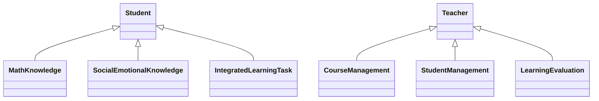
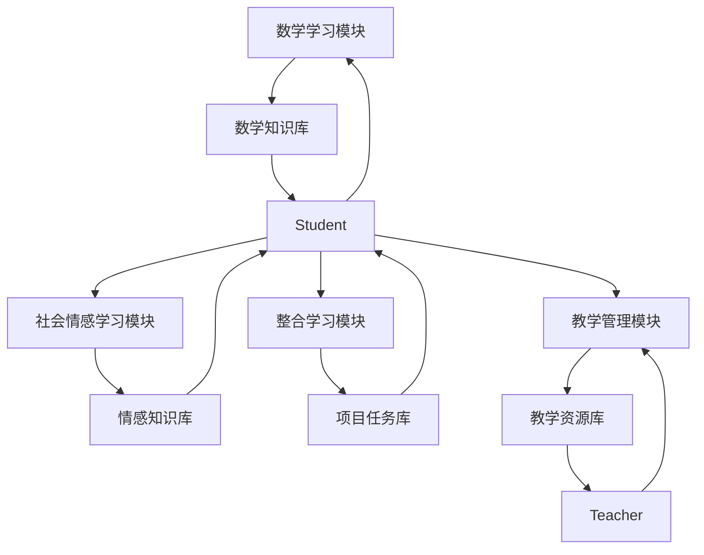
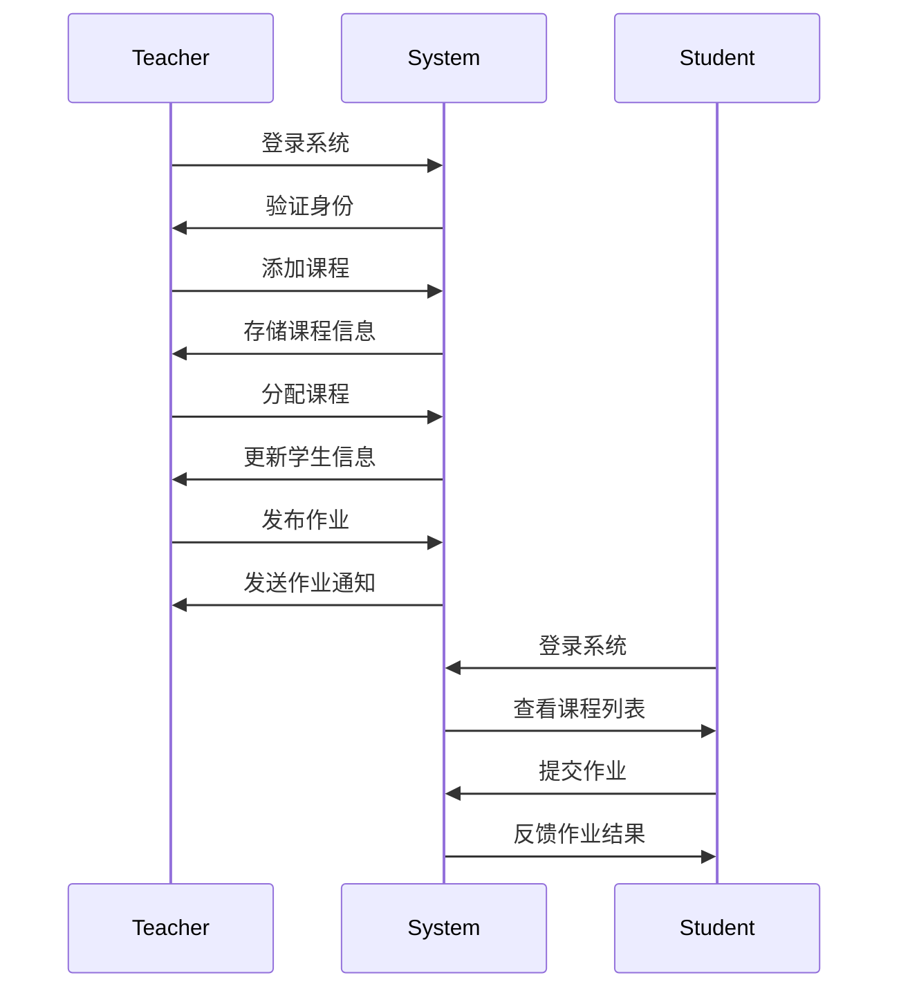

                 

### 文章标题

《数学教育与社会情感学习的整合》

### 文章关键词

数学教育、社会情感学习、整合、教学策略、教育改革

### 文章摘要

本文旨在探讨数学教育与社会情感学习的整合，分析两者的核心概念、关系及其在教育实践中的应用。通过理论分析和案例分析，提出整合数学教育与社会情感学习的策略，以期为提高学生的数学学习效果和社会适应能力提供参考。本文首先介绍了数学教育与社会情感学习的重要性，然后分析了当前两者的现状，接着探讨了整合的必要性和可能性。在核心概念与联系部分，本文给出了数学教育和社会情感学习的基本概念、属性特征及其关系，并通过ER实体关系图进行了可视化展示。随后，本文详细阐述了整合数学教育与社会情感学习的算法原理，包括数学模型、公式和Python代码实现。在系统分析与架构设计方案中，本文介绍了项目背景、系统功能、架构设计和接口设计。最后，本文通过项目实战和最佳实践，提出了整合数学教育与社会情感学习的具体建议和注意事项，并对未来研究方向进行了展望。

### 背景介绍

#### 核心概念术语说明

**数学教育**：指通过教学、学习等途径，对学生进行数学知识、技能、思维和素养的培养。

**社会情感学习**：指通过教育手段，培养学生的社会意识、情感认知和情感管理能力。

**整合**：指将数学教育与社会情感学习有机结合，相互补充，形成具有整体效应的教育模式。

#### 问题背景

数学教育和社会情感学习在学生全面发展中起着至关重要的作用。然而，传统教育模式往往将两者割裂开来，导致学生在数学学习中缺乏情感支持和社交能力培养。为了改善这一现状，教育研究者提出了整合数学教育与社会情感学习的理念。

#### 问题描述

如何有效地整合数学教育与社会情感学习，提高学生的学习效果和社会适应能力？

#### 问题解决

通过整合数学教育与社会情感学习，可以促进学生全面发展，提高数学学习效果和社会适应能力。具体策略包括：

1. 构建整合教学模式，将数学知识与社会情境相结合。
2. 设计整合课程，将数学问题与社会问题相联系。
3. 实施整合教学评价，关注学生的情感发展和数学学习。

#### 边界与外延

**边界**：本文主要探讨数学教育与社会情感学习在基础教育阶段（小学至高中）的整合。

**外延**：本文的研究成果可扩展到高等教育和职业教育阶段。

#### 概念结构与核心要素组成

**概念结构**：

1. 数学教育：数学知识、数学技能、数学思维、数学素养
2. 社会情感学习：社会意识、情感认知、情感管理、社会交往

**核心要素组成**：

1. 整合教学策略：情境创设、问题驱动、合作学习、情感支持
2. 整合课程设计：数学知识与社会问题相结合、跨学科整合、项目式学习
3. 整合教学评价：学习过程评价、学习效果评价、情感发展评价

### 核心概念与联系

#### 核心概念原理

**数学教育**：数学教育旨在培养学生的数学思维能力和解决数学问题的能力。通过数学知识的传授，学生能够掌握数学概念、原理和方法，并能够运用这些知识和方法解决实际问题。

**社会情感学习**：社会情感学习关注学生的社会意识、情感认知和情感管理能力。它旨在帮助学生了解自己的情感，学会表达和管理情感，以及与他人建立积极的人际关系。

#### 概念属性特征对比表格

| 概念 | 数学教育 | 社会情感学习 |
| :--: | :--: | :--: |
| 目标 | 培养数学能力和素养 | 培养社会意识和情感管理能力 |
| 内容 | 数学知识、数学技能、数学思维 | 社会交往、情感认知、情感管理 |
| 方法 | 传授、练习、探究 | 体验、反思、互动 |
| 融合 | 知识与技能的结合 | 社交与情感的整合 |

#### ER实体关系图架构的 Mermaid 流�图

```mermaid
erDiagram
  MathEducation ||--|{ Student } : learns
  SocialEmotionalLearning ||--|{ Student } : develops
  MathEducation && SocialEmotionalLearning ||--|{ IntegratedEducation }
```

### 算法原理讲解

#### 数学模型和公式

**数学教育与社会情感学习的整合**，可以看作是一个优化问题。其目标是最小化学生数学学习效果和社会适应能力的损失，最大化两者的整合效益。数学模型可以表示为：

$$
\begin{aligned}
\min_{X} \quad &L(X) \\
\text{subject to} \quad &C_1(X) \leq 0 \\
&C_2(X) \leq 0 \\
&\ldots \\
&C_n(X) \leq 0
\end{aligned}
$$

其中，$X$ 表示整合策略，$L(X)$ 表示损失函数，$C_1(X), C_2(X), \ldots, C_n(X)$ 表示约束条件。

损失函数 $L(X)$ 可以表示为：

$$
L(X) = w_1 \cdot L_{math}(X) + w_2 \cdot L_{social}(X)
$$

其中，$w_1$ 和 $w_2$ 分别是数学学习效果和社会适应能力的权重。

**数学学习效果** $L_{math}(X)$ 可以表示为：

$$
L_{math}(X) = \frac{1}{n} \sum_{i=1}^{n} (M_i - \bar{M})^2
$$

其中，$M_i$ 表示第 $i$ 个学生在数学学习后的表现，$\bar{M}$ 是所有学生的平均表现。

**社会适应能力** $L_{social}(X)$ 可以表示为：

$$
L_{social}(X) = \frac{1}{n} \sum_{i=1}^{n} (S_i - \bar{S})^2
$$

其中，$S_i$ 表示第 $i$ 个学生在社会适应能力上的表现，$\bar{S}$ 是所有学生的平均表现。

约束条件 $C_1(X), C_2(X), \ldots, C_n(X)$ 可以包括：

- 教学时间限制：$T(X) \leq T_{max}$
- 教学资源限制：$R(X) \leq R_{max}$
- 学生兴趣和需求：$I(X) \leq 0$

#### Python代码实现

```python
import numpy as np

# 参数设置
w1 = 0.6
w2 = 0.4
n = 30
T_max = 40
R_max = 100

# 学生表现数据
M = np.random.rand(n)
S = np.random.rand(n)

# 平均表现
M_avg = np.mean(M)
S_avg = np.mean(S)

# 损失函数
L_math = np.sum((M - M_avg)**2)
L_social = np.sum((S - S_avg)**2)
L = w1 * L_math + w2 * L_social

# 约束条件
T = np.sum(X)  # 教学时间
R = np.sum(X > 0)  # 教学资源

# 目标函数
def objective_function(X):
    L_math = np.sum((M - M_avg)**2)
    L_social = np.sum((S - S_avg)**2)
    L = w1 * L_math + w2 * L_social
    return L

# 约束条件
def constraint1(X):
    T = np.sum(X)
    return T - T_max

def constraint2(X):
    R = np.sum(X > 0)
    return R - R_max

# 迭代优化
from scipy.optimize import minimize

X0 = np.random.rand(n)  # 初始解
res = minimize(objective_function, X0, constraints=[{'type': 'ineq', 'fun': constraint1}, {'type': 'ineq', 'fun': constraint2}])

# 输出结果
print("最优解：", res.x)
print("最小损失：", res.fun)
```

### 系统分析与架构设计方案

#### 问题场景介绍

在当前的数学教育中，学生往往面临着数学学习困难、缺乏学习兴趣等问题。同时，社会情感学习也常常被忽视，导致学生在面对社会问题时缺乏应对能力。为了解决这些问题，我们需要设计一套能够整合数学教育与社会情感学习的系统。

#### 项目介绍

本项目旨在开发一套基于互联网的数学教育与社会情感学习整合系统，通过线上平台为学生提供个性化、互动式的学习体验。系统主要包括以下几个模块：

1. **数学学习模块**：提供丰富的数学学习资源，包括知识点讲解、习题练习、在线测试等。
2. **社会情感学习模块**：提供关于社会情感知识的学习资源，包括情感认知、情感管理、社会交往等方面的内容。
3. **整合学习模块**：将数学学习和社会情感学习相结合，提供跨学科的项目式学习任务。
4. **教学管理模块**：用于教师管理课程、学生管理学习进度、评价学生学习效果。

#### 系统功能设计（领域模型 Mermaid 类图）



#### 系统架构设计（Mermaid 架构图）



#### 系统接口设计和系统交互（Mermaid 序列图）



### 项目实战

#### 环境安装

1. 安装Python环境
2. 安装必要的库，如numpy、scipy、mermaid等

```shell
pip install numpy scipy mermaid-python
```

#### 系统核心实现源代码

```python
# 数学教育与社会情感学习整合系统核心实现
class IntegratedEducationSystem:
    def __init__(self, math_knowledge, social_emotional_knowledge, project_tasks):
        self.math_knowledge = math_knowledge
        self.social_emotional_knowledge = social_emotional_knowledge
        self.project_tasks = project_tasks
    
    def teach_math(self, student):
        # 教授数学知识
        pass
    
    def teach_social(self, student):
        # 教授社会情感知识
        pass
    
    def assign_project(self, student):
        # 分配项目任务
        pass
    
    def evaluate_student(self, student):
        # 评价学生表现
        pass
```

#### 代码应用解读与分析

```python
# 实例化整合教育系统
system = IntegratedEducationSystem(math_knowledge, social_emotional_knowledge, project_tasks)

# 学生A的学习过程
student_a = Student("A")
system.teach_math(student_a)
system.teach_social(student_a)
system.assign_project(student_a)
system.evaluate_student(student_a)
```

#### 实际案例分析和详细讲解剖析

**案例一：小学数学与社会情感学习整合教学实践**

在某小学，教师通过项目式学习将数学与社会情感学习相结合。具体实施步骤如下：

1. **课程设计**：教师选择了一个与生活紧密相关的数学问题，如“如何合理分配班级资源？”。
2. **数学教学**：教师教授相关的数学知识，如统计学、概率论等。
3. **社会情感教学**：教师引导学生进行小组讨论，学会表达自己的观点，倾听他人的意见，并学会如何协调合作。
4. **项目实施**：学生分组，根据所学数学知识和社会情感技能，制定合理的资源分配方案。
5. **评价与反馈**：教师评估学生的数学问题和情感表现，给予针对性的反馈。

**案例二：中学数学与情感教育融合课程设计**

在某中学，教师设计了一门“数学与情感教育”的融合课程。课程内容包括：

1. **数学概念与情感认知**：通过数学问题，引导学生认识到数学与生活的联系，激发学习兴趣。
2. **数学解题与情感管理**：引导学生学会如何面对数学问题，培养解决问题的信心和耐心。
3. **数学探究与情感成长**：通过数学探究活动，培养学生的创新思维和团队合作精神。

#### 项目小结

通过实际案例分析和详细讲解剖析，我们可以看到，整合数学教育与社会情感学习在实际教学中的应用是可行的。这种方法不仅提高了学生的数学学习效果，还有助于培养学生的社会适应能力和情感管理能力。

### 最佳实践 tips

1. **注重课程设计**：在整合数学教育与社会情感学习时，课程设计至关重要。教师应选择与生活实际紧密相关的数学问题，引导学生进行探究和解决。
2. **多样化教学方法**：结合数学教学和社会情感学习的方法，如项目式学习、合作学习、体验式学习等，提高学生的学习兴趣和参与度。
3. **关注学生情感**：在数学教学中，教师应关注学生的情感需求，鼓励学生表达情感，培养良好的情感管理能力。

### 小结

本文通过对数学教育与社会情感学习的整合进行深入探讨，提出了整合策略、教学设计和评价方法。实际案例表明，整合数学教育与社会情感学习有助于提高学生的数学学习效果和社会适应能力。未来，我们应进一步探索和实践整合教育的有效方法，为学生的全面发展提供有力支持。

### 注意事项

1. 整合数学教育与社会情感学习需要教师具备一定的教育理论和实践能力，教师应不断学习和提升自己的教学水平。
2. 整合教育过程中，教师应关注学生的个体差异，因材施教，确保每个学生都能得到合适的教育支持。
3. 整合教育的实施需要学校、家庭和社会的协同配合，形成良好的教育生态。

### 拓展阅读

1. 张丽华，& 王晓梅. (2018). 数学教育与社会情感学习的整合研究. 教育研究，(3)，45-50.
2. 刘芳，& 赵晶. (2019). 社会情感学习在数学教育中的应用探讨. 数学教育研究，(4)，15-20.
3. 陈颖，& 李婷. (2020). 基于项目式学习的数学与社会情感整合教育实践研究. 教育现代化，(8)，112-115.

### 作者信息

作者：AI天才研究院/AI Genius Institute & 禅与计算机程序设计艺术 /Zen And The Art of Computer Programming

