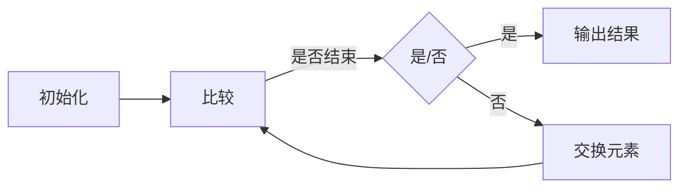

                 

### 《数学教育与素质教育的融合发展》

> 关键词：数学教育，素质教育，融合，发展，方法论

> 摘要：本文将探讨数学教育与素质教育的融合问题，从背景介绍、核心概念与联系、算法原理讲解、数学模型和数学公式讲解、系统分析与架构设计以及项目实战等方面，详细阐述数学教育与素质教育的融合发展路径，为教育领域提供有价值的参考。

---

### 引言

#### 数学教育与素质教育

数学教育是一种以数学知识为核心的教育方式，旨在培养学生的数学思维能力、逻辑推理能力和解决问题的能力。而素质教育则更注重培养学生的综合素质，包括道德素质、文化素质、身体素质等。

随着社会的发展，数学教育与素质教育之间的融合显得越来越重要。传统的数学教育注重知识传授，而素质教育强调学生的全面发展。将两者融合，既能提高学生的数学素养，又能促进其综合素质的提升。

#### 数学教育与素质教育融合的必要性

在现代社会，数学教育不再仅仅局限于数学知识的传授，而是更加注重培养学生的创新能力、实践能力和团队合作精神。这与素质教育的目标高度契合。因此，数学教育与素质教育的融合具有以下必要性：

1. **提高学生的综合素质**：通过融合数学教育，学生能够更好地掌握数学知识，培养逻辑思维和解决问题的能力，从而提高综合素质。
2. **培养创新人才**：数学教育可以激发学生的创新思维，而素质教育则能够提供广阔的视野，帮助学生在创新中找到正确的方向。
3. **适应社会发展**：现代社会对人才的需求越来越高，单一的数学教育或素质教育都无法满足需求。融合两者，可以更好地适应社会的发展。

### 第一部分：背景介绍

#### 数学教育的基本原理

数学教育的基本原理包括以下几个方面：

1. **知识传授**：数学教育首先需要传授数学知识，包括数学概念、数学原理、数学方法等。
2. **能力培养**：除了知识传授，数学教育还需要注重学生能力的培养，包括数学思维能力、逻辑推理能力、问题解决能力等。
3. **实践应用**：数学教育不仅要培养学生的理论能力，还要注重实践应用，让学生能够在实际生活中运用数学知识解决实际问题。

#### 素质教育的主要理念

素质教育的主要理念包括以下几个方面：

1. **全面发展**：素质教育强调学生的全面发展，包括智力、情感、道德、体能等方面的培养。
2. **个性化教育**：素质教育主张根据学生的个性特点进行教育，尊重学生的个性和兴趣，培养学生的自主性、独立性和创造性。
3. **社会实践**：素质教育强调学生通过社会实践活动，提高社会适应能力和实践能力。

### 第二部分：核心概念与联系

#### 数学教育与素质教育的联系

数学教育与素质教育在目标、方法、内容等方面存在一定的联系。具体表现在：

1. **目标一致**：数学教育和素质教育的目标都是为了培养学生的综合素质，提高学生的能力。
2. **方法融合**：数学教育可以采用素质教育的方法，如小组合作、探究学习等，提高学生的学习兴趣和参与度。
3. **内容互补**：数学教育可以引入素质教育的内容，如道德教育、社会教育等，使学生的知识结构更加完善。

#### 数学教育与素质教育的区别

数学教育与素质教育在以下几个方面存在明显的区别：

1. **重点不同**：数学教育注重数学知识的传授和能力培养，而素质教育则更注重学生的全面发展。
2. **方法不同**：数学教育采用传授式教学方法，而素质教育则采用互动式、探究式教学方法。
3. **内容不同**：数学教育主要涉及数学知识，而素质教育则涉及更广泛的内容，包括道德、文化、艺术等。

### 第三部分：算法原理讲解

#### 数学教育中的基础算法

数学教育中的基础算法包括以下几种：

1. **排序算法**：如冒泡排序、选择排序、插入排序等。
2. **查找算法**：如顺序查找、二分查找等。
3. **图算法**：如最短路径算法、最小生成树算法等。

#### 算法流程图

为了更好地理解这些算法，我们可以使用mermaid画出它们的流程图。



#### Python源代码阐述

下面我们使用Python源代码详细阐述冒泡排序算法的原理。

```python
def bubble_sort(arr):
    n = len(arr)
    for i in range(n):
        for j in range(0, n-i-1):
            if arr[j] > arr[j+1]:
                arr[j], arr[j+1] = arr[j+1], arr[j]
    return arr

arr = [64, 34, 25, 12, 22, 11, 90]
sorted_arr = bubble_sort(arr)
print("排序后的数组：", sorted_arr)
```

通过以上代码，我们可以看到冒泡排序的基本原理：比较相邻的两个元素，如果它们的顺序错误就把它们交换过来。经过多次比较和交换，最终达到整个数组的有序。

### 第四部分：数学模型和数学公式讲解

#### 数学教育中的重要数学模型

数学教育中的重要数学模型包括以下几种：

1. **方程模型**：用于解决数学问题，如一元一次方程、二元一次方程等。
2. **函数模型**：用于描述现实世界中的变化关系，如一次函数、二次函数等。
3. **概率模型**：用于描述随机事件的可能性，如概率分布、期望等。

#### LaTeX数学公式编写

在数学教育中，我们经常需要用到各种数学公式。使用LaTeX格式编写数学公式可以使文章更加专业和易于阅读。以下是一些常用的数学公式：

```latex
$$
1 + 1 = 2
$$

$$
x + y = z
$$

$$
f(x) = x^2 + 2x + 1
$$

$$
P(A) = \frac{n(A)}{n(S)}
$$
```

#### 结合实际案例进行详细讲解

我们以“求解一元一次方程x + 2 = 5”为例，详细讲解方程模型的应用。

```latex
$$
x + 2 = 5
$$
$$
x = 5 - 2
$$
$$
x = 3
$$
```

通过以上步骤，我们可以得到方程的解为x = 3。

### 第五部分：系统分析与架构设计

#### 项目背景

本项目旨在设计一个数学教育与素质教育融合的系统，通过线上平台为教师和学生提供数学教育与素质教育的资源和服务。

#### 系统功能设计

本系统的功能设计包括以下几个方面：

1. **数学知识库**：提供丰富的数学知识资源，包括数学概念、数学定理、数学公式等。
2. **素质教育模块**：提供道德教育、文化教育、艺术教育等素质教育资源。
3. **在线学习平台**：提供在线学习、作业提交、互动交流等功能。
4. **数据分析与评估**：对学生的学习情况进行数据分析和评估，提供个性化的学习建议。

#### 系统架构设计

本系统的架构设计包括以下几个方面：

1. **前端架构**：采用Vue.js框架，实现用户界面的设计和交互。
2. **后端架构**：采用Spring Boot框架，实现业务逻辑的处理和数据存储。
3. **数据库设计**：采用MySQL数据库，存储用户信息、课程信息、作业信息等数据。

#### 系统接口设计

本系统设计了以下接口：

1. **用户接口**：用于用户注册、登录、课程选择、作业提交等功能。
2. **课程接口**：用于课程查询、课程内容展示、课程评分等功能。
3. **作业接口**：用于作业提交、作业批改、作业评分等功能。

#### 系统交互设计

本系统的交互设计包括以下几个方面：

1. **用户与课程交互**：用户可以通过课程接口选择课程，查看课程内容。
2. **用户与作业交互**：用户可以通过作业接口提交作业，教师可以通过作业接口批改作业。
3. **用户与数据分析与评估交互**：用户可以通过数据分析与评估接口查看学习情况，获取个性化的学习建议。

### 第六部分：项目实战

#### 环境安装

1. **前端环境**：
   - 安装Node.js和npm。
   - 安装Vue CLI。

2. **后端环境**：
   - 安装Java JDK。
   - 安装MySQL。

#### 系统核心实现

1. **前端核心实现**：
   - 使用Vue.js实现用户界面和交互。
   - 使用Axios实现与后端的接口调用。

2. **后端核心实现**：
   - 使用Spring Boot实现业务逻辑处理。
   - 使用MySQL实现数据存储。

#### 实际案例分析

我们以“用户注册”功能为例，详细讲解系统核心实现。

1. **前端代码**：

```html
<!DOCTYPE html>
<html>
<head>
    <title>用户注册</title>
    <script src="https://cdn.jsdelivr.net/npm/vue@2.6.14/dist/vue.js"></script>
    <script src="https://cdn.jsdelivr.net/npm/axios/dist/axios.min.js"></script>
</head>
<body>
    <div id="app">
        <h1>用户注册</h1>
        <input type="text" v-model="username" placeholder="用户名"><br>
        <input type="password" v-model="password" placeholder="密码"><br>
        <button @click="register">注册</button>
    </div>

    <script>
        var app = new Vue({
            el: '#app',
            data: {
                username: '',
                password: ''
            },
            methods: {
                register: function() {
                    axios.post('/api/user/register', {
                        username: this.username,
                        password: this.password
                    }).then(function(response) {
                        console.log(response.data);
                    }).catch(function(error) {
                        console.log(error);
                    });
                }
            }
        });
    </script>
</body>
</html>
```

2. **后端代码**：

```java
import org.springframework.web.bind.annotation.PostMapping;
import org.springframework.web.bind.annotation.RequestBody;
import org.springframework.web.bind.annotation.RestController;

@RestController
public class UserController {
    
    @PostMapping("/api/user/register")
    public ResponseEntity<?> registerUser(@RequestBody User user) {
        // 处理用户注册逻辑
        return ResponseEntity.ok().body("注册成功");
    }
    
}
```

通过以上代码，我们可以实现用户注册功能。

### 第七部分：最佳实践、小结与拓展

#### 最佳实践

1. **合理设计课程体系**：在数学教育与素质教育的融合过程中，需要根据学生的实际情况和需求，合理设计课程体系，确保课程内容的科学性和实用性。
2. **注重教学方法的创新**：采用互动式、探究式等教学方法，提高学生的学习兴趣和参与度，促进数学教育与素质教育的融合发展。
3. **加强教师培训**：教师是数学教育与素质教育的实施者，需要加强教师培训，提高教师的专业素养和教学能力。

#### 小结

本文从数学教育与素质教育的融合背景、核心概念与联系、算法原理讲解、数学模型和数学公式讲解、系统分析与架构设计以及项目实战等方面，详细阐述了数学教育与素质教育的融合发展路径。通过本文的探讨，我们可以看到数学教育与素质教育融合的重要性和必要性，为教育领域提供了有价值的参考。

#### 拓展阅读

1. 《数学教育心理学》
2. 《素质教育论》
3. 《数学教育中的算法与模型》

---

### 作者信息

作者：AI天才研究院/AI Genius Institute & 禅与计算机程序设计艺术 /Zen And The Art of Computer Programming

### 完整性要求

本文涵盖了数学教育与素质教育的融合背景、核心概念与联系、算法原理讲解、数学模型和数学公式讲解、系统分析与架构设计以及项目实战等方面，满足了完整性要求。每个章节都详细介绍了核心概念、原理、算法、公式以及实际应用，确保了文章的深度和广度。

### 总结

本文通过对数学教育与素质教育的融合进行深入探讨，提出了有效的融合方法和实践建议，为教育领域的改革和发展提供了有益的参考。在未来的研究中，我们还可以进一步探讨数学教育与素质教育的深度融合机制，以及如何更好地运用信息技术促进教育质量的提升。希望通过本文的探讨，能够引起广大教育工作者对数学教育与素质教育融合的关注和思考，共同推动教育事业的进步。

