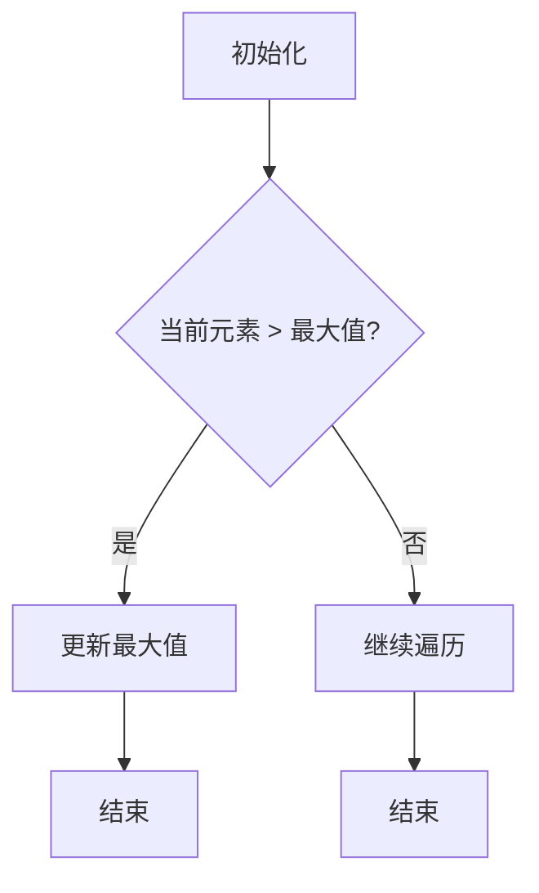
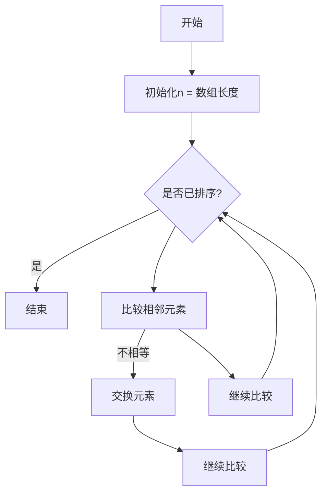
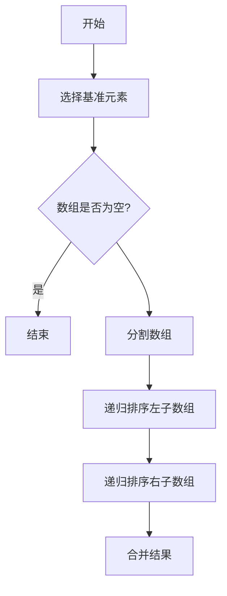
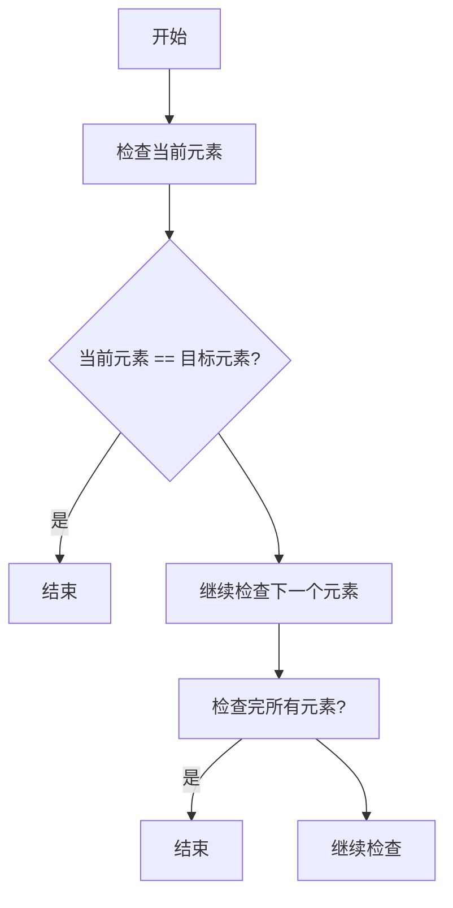
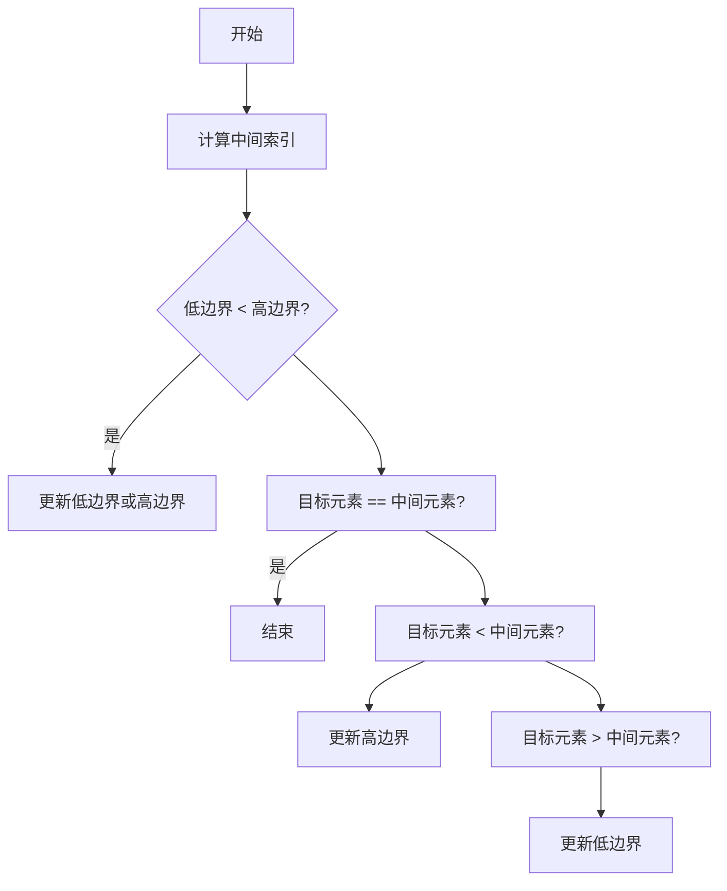

                 

### 数学教育与计算思维教育的融合策略

**关键词：数学教育、计算思维教育、课程设计、教学手段、教师培训**

**摘要：本文旨在探讨数学教育与计算思维教育的融合策略，通过课程设计、教学手段和教师培训三个方面，实现两者的有机结合，提升学生的数学和计算思维能力。**

---

### 第二部分：数学教育与计算思维教育的融合策略

**第二部分**将深入探讨如何有效地将数学教育与计算思维教育进行融合，从而提升学生的学习效果。我们将从课程设计、教学手段和教师培训三个方面展开讨论。

#### 课程设计

**融合课程设置**

在数学课程中融入计算思维的元素，是数学教育与计算思维教育融合的重要策略之一。具体而言，我们可以通过以下几种方式实现：

1. **设置计算思维相关模块**：在传统的数学课程中，加入计算思维的模块，例如算法设计与分析、数据结构、编程实践等。这些模块不仅可以丰富课程内容，还能培养学生的计算思维能力。

2. **跨学科项目式学习**：通过数学问题解决项目，结合编程实践，培养学生的计算思维能力。例如，在解决线性方程组的问题时，可以引入编程语言如Python或Java，让学生通过编程来实现算法的求解。

3. **综合课程设计**：将数学课程与其他学科如计算机科学、物理学等进行整合，例如在物理学中引入数学模型，通过编程进行模拟和数据分析，从而加深学生对数学和计算思维的理解。

**项目式学习**

项目式学习是一种有效的教学方法，通过实际问题的解决过程，培养学生的计算思维和团队合作能力。具体操作如下：

1. **选题与设计**：根据学生的兴趣和数学课程的难度，选择合适的数学问题作为项目主题。例如，可以选取图形处理、数据分析等领域的实际问题。

2. **项目实施**：在教师的指导下，学生通过团队合作，制定项目计划，进行数据收集、分析和编程实现。在此过程中，教师可以引导学生运用计算思维的方法，如抽象、算法化等。

3. **成果展示与评价**：项目完成后，学生需要展示他们的工作成果，并接受教师的评价。评价标准应包括对数学知识的掌握、计算思维的应用、编程能力的提升等多个方面。

#### 教学手段

**计算机辅助教学**

计算机辅助教学（Computer-Assisted Instruction, CAI）是一种利用计算机技术辅助教学的方法。在数学教育中，CAI可以帮助学生更好地理解和掌握数学概念。具体应用如下：

1. **数学概念可视化**：利用计算机模拟和动画技术，将抽象的数学概念以直观的方式呈现。例如，通过三维图形展示几何图形的性质，帮助学生更好地理解几何概念。

2. **个性化教学**：根据学生的学习情况，利用计算机技术进行个性化教学。例如，通过自适应测试系统，根据学生的答题情况，自动调整教学内容的难度和进度。

3. **交互式学习**：利用计算机和网络技术，实现学生与计算机的互动。例如，通过在线编程平台，学生可以实时编写代码，并进行调试和测试，从而加深对编程语言的理解。

**案例教学**

案例教学是一种通过具体案例来帮助学生理解和应用知识的方法。在数学教育中，案例教学可以有效地培养学生的计算思维能力。具体实施步骤如下：

1. **案例选择**：选择具有代表性的数学案例，如数学建模问题、数学竞赛题目等。

2. **案例分析与讨论**：教师引导学生对案例进行分析和讨论，帮助他们理解数学原理和计算思维方法。

3. **案例实践**：学生根据案例，进行数学建模和编程实践，通过解决实际问题来提升计算思维能力。

#### 教师培训

**专业发展**

为了使数学教育更好地融合计算思维教育，教师需要不断提升自身的专业能力。具体措施如下：

1. **专业培训**：定期组织教师参加计算思维教育的专业培训，学习相关的理论知识和实践方法。

2. **实践交流**：鼓励教师参与教育实践，通过实际教学经验的积累，提升计算思维教育的教学能力。

3. **学术研究**：支持教师进行计算思维教育的学术研究，发表研究成果，推动计算思维教育的发展。

**资源共享**

建立教师交流平台，促进教师之间的资源共享和经验交流。具体措施如下：

1. **在线平台**：建立在线交流平台，教师可以在平台上分享教学经验和教学资源。

2. **工作坊与研讨会**：定期举办工作坊和研讨会，教师可以在此平台上进行面对面的交流和讨论。

3. **资源共享库**：建立一个资源共享库，包括教学案例、教学资源、教学视频等，教师可以方便地获取和借鉴。

### 总结

数学教育与计算思维教育的融合，不仅有助于提升学生的数学和计算思维能力，还能激发他们的学习兴趣和创造力。通过课程设计、教学手段和教师培训三方面的策略，我们可以有效地实现两者的融合。让我们共同努力，为培养具有计算思维能力的新一代数学人才做出贡献。

---

在本文的第二部分，我们详细探讨了如何通过课程设计、教学手段和教师培训三个方面，实现数学教育与计算思维教育的融合。从融合课程设置到项目式学习，从计算机辅助教学到案例教学，再到教师专业发展和资源共享，每个策略都有其独特的实施方式和预期效果。通过这些策略的实施，我们期望能够为学生提供更丰富、更具有挑战性的学习体验，从而提升他们的数学和计算思维能力。

然而，实现这一目标并非一蹴而就。我们需要教师不断学习和探索，学生积极参与和思考，同时还需要学校和管理部门的支持和重视。只有多方共同努力，才能真正实现数学教育与计算思维教育的有机融合，培养出具有创新能力和解决问题能力的新一代人才。

在接下来的部分，我们将进一步探讨数学教育与计算思维教育的核心概念及其联系，深入理解两者的本质。同时，我们将通过具体的案例和实验，展示如何在实际教学中应用这些策略，为学生提供更好的学习体验。让我们继续深入思考，探索数学与计算思维教育的无限可能。

---

## 背景介绍

### 核心概念

#### 数学教育

数学教育是通过一系列教学过程，传授数学知识、培养数学思维和解决数学问题的能力。它不仅仅涉及数学知识的传授，更重要的是培养学生的数学思维能力和解决问题的能力。

**数学知识传授**：数学教育包括对数学基础概念、公式、定理的理解和掌握。这些知识是数学教育的基础，学生需要通过课堂学习和练习，逐步建立坚实的数学基础。

**数学思维能力培养**：数学教育不仅关注知识的学习，更注重培养学生的数学思维能力。这种能力包括逻辑推理、抽象思维、空间想象等，通过这些能力的培养，学生能够更好地理解和应用数学知识。

**数学问题解决能力提升**：数学教育通过解决各种数学问题，帮助学生提升数学问题解决的能力。这包括对实际问题的数学建模、数学方法的运用以及数学结果的解释。

#### 计算思维教育

计算思维教育是指通过计算技术和计算机科学的教育，培养学生的计算思维能力。计算思维是一种解决问题的方法，它强调通过抽象、算法化、自动化等方法来分析和解决复杂问题。

**计算思维培养**：计算思维教育关注培养学生的计算思维能力。这种能力包括理解问题、抽象问题、设计解决方案、实现解决方案等。通过计算思维教育，学生能够学会如何高效地解决问题。

**算法设计与编程能力提升**：计算思维教育强调算法的设计和编程能力的提升。算法是计算思维的核心，通过学习算法，学生能够更好地理解问题的本质，并设计出高效的解决方案。编程是实现算法的工具，通过编程实践，学生能够提升算法实现的能力。

**信息技术应用能力**：计算思维教育还关注信息技术在解决问题中的应用。学生需要学会如何利用计算机和网络等信息技术工具，获取信息、处理信息和传递信息，从而提升信息技术的应用能力。

### 问题背景

随着信息技术的快速发展，计算机科学在教育中的应用日益广泛。传统的数学教育方法往往侧重于知识的传授，而忽略了培养学生的计算思维能力。这种教育模式在现代社会中显得有些滞后，因为现代社会需要具备计算思维能力的人才来应对复杂的问题和挑战。

计算思维教育作为一种新兴的教育模式，它不仅能够弥补传统数学教育的不足，还能为学生提供更广阔的发展空间。计算思维教育强调解决问题的能力，这种能力在现代社会中尤为重要。计算机科学和信息技术的发展使得问题解决的方式和方法变得更加多样化和复杂化，传统的数学教育方法已经无法满足这种变化。

因此，将数学教育与计算思维教育进行融合，显得尤为重要。这种融合不仅可以提升学生的数学和计算思维能力，还能培养他们的创新能力和解决问题的能力。通过数学与计算思维的融合，学生能够更好地应对未来的挑战，为社会的进步和发展做出贡献。

### 问题描述

如何在数学教育中融入计算思维教育，使学生在学习数学知识的同时，也能够培养计算思维能力？这是当前教育领域面临的一个重要问题。传统的数学教育方法往往侧重于知识的传授，而忽略了学生计算思维能力的培养。这种教育模式在现代社会中显得有些滞后，因为现代社会需要具备计算思维能力的人才来应对复杂的问题和挑战。

问题描述可以具体化为以下几个方面：

1. **教学内容的更新**：传统的数学教育内容需要与时俱进，融入更多的计算思维相关内容。例如，在数学课程中引入算法设计与分析、数据结构、编程实践等模块，使学生在学习数学知识的同时，也能够培养计算思维能力。

2. **教学方法的变革**：传统的数学教育方法需要变革，以适应计算思维教育的需求。例如，采用项目式学习、计算机辅助教学、案例教学等新的教学方法，让学生在实践中学习计算思维方法。

3. **教师的专业发展**：教师需要不断提升自身的专业能力，掌握计算思维教育的方法和技巧。通过专业培训和交流，教师可以更好地将计算思维教育融入数学教育中。

4. **教育评价的改革**：传统的教育评价方式需要改革，以适应计算思维教育的需求。通过过程性评价、项目评价等方式，全面评价学生的计算思维能力。

### 问题解决

解决这一问题的方法包括但不限于以下几个方面：

1. **课程设计**：在数学课程中设置计算思维相关的模块，如算法设计与分析、数据结构、编程实践等。这些模块不仅可以丰富课程内容，还能培养学生的计算思维能力。

2. **教学手段**：利用计算机科学工具，如计算机模拟、数据可视化等，使数学概念更加直观，帮助学生更好地理解和掌握。

3. **教师培训**：提升教师的计算思维教育能力，使他们能够更好地进行教学。通过专业发展、实践交流和学术研究等方式，提升教师的专业素养。

4. **评估与反馈**：通过过程性评价、项目评价等方式，全面评估学生的计算思维能力，并及时给予反馈，鼓励学生反思和改进。

5. **家校合作**：家庭和学校共同努力，为学生提供良好的学习环境和支持。家长可以积极参与学生的学习过程，与教师共同关注学生的计算思维能力培养。

### 边界与外延

1. **边界**：本文主要探讨数学教育与计算思维教育的融合策略，不包括其他学科与计算思维教育的融合。

2. **外延**：本文的研究可以扩展到其他学科与计算思维教育的融合，以及计算思维教育在各个教育阶段的应用。

### 概念结构与核心要素组成

1. **数学教育**：
   - **数学知识传授**：包括数学基础概念、公式、定理等。
   - **数学思维能力培养**：包括逻辑推理、抽象思维、空间想象等。
   - **数学问题解决能力提升**：包括数学建模、数学方法运用、数学结果解释等。

2. **计算思维教育**：
   - **计算思维培养**：包括理解问题、抽象问题、设计解决方案、实现解决方案等。
   - **算法设计与编程能力提升**：包括算法设计、编程实践、算法实现等。
   - **信息技术应用能力**：包括计算机使用、网络技术、信息技术工具等。

### 核心概念原理

1. **数学教育**：通过教学，使学生掌握数学知识，培养数学思维，提升解决问题的能力。

2. **计算思维教育**：通过计算技术和计算机科学的教育，培养学生的计算思维，即通过抽象、算法化、自动化等方法来解决问题。

### 概念属性特征对比表格

| 概念     | 数学教育                       | 计算思维教育                      |
|----------|--------------------------------|-----------------------------------|
| 目标     | 掌握数学知识，培养数学思维     | 培养计算思维，提升算法与编程能力   |
| 方法     | 知识传授，问题解决             | 抽象建模，算法设计，编程实践       |
| 工具     | 数学公式，定理，例题           | 计算机模拟，数据可视化，编程环境   |

### ER实体关系图架构

```mermaid
erDiagram
   MathEducation ||--|{ Student } : takes
   MathEducation ||--|{ Teacher } : taught by
   ComputationalThinkingEducation ||--|{ Student } : takes
   ComputationalThinkingEducation ||--|{ Teacher } : taught by
    Student ||--|{ MathKnowledge } : has
    Student ||--|{ ComputationalThinking } : has
```

### 总结

数学教育与计算思维教育的融合，是为了应对现代社会对计算思维能力的需求。通过课程设计、教学手段和教师培训等策略，我们可以在数学教育中融入计算思维教育，提升学生的数学和计算思维能力。这不仅是教育领域的一项重要任务，也是为培养具有创新能力和解决问题能力的新一代人才做出的贡献。

在接下来的部分，我们将进一步探讨数学教育与计算思维教育的核心概念及其联系，深入理解两者的本质。同时，我们将通过具体的案例和实验，展示如何在实际教学中应用这些策略，为学生提供更好的学习体验。让我们继续深入思考，探索数学与计算思维教育的无限可能。

---

## 核心概念与联系

在深入探讨数学教育与计算思维教育的融合策略之前，我们需要明确这两个核心概念的本质及其相互联系。通过分析两者的核心概念原理、属性特征以及它们在教育领域中的具体应用，我们可以更好地理解如何将计算思维有效地融入数学教育中，以提升学生的综合能力。

### 核心概念原理

**数学教育**：

数学教育的主要目标是传授数学知识，培养学生的数学思维和解决问题的能力。数学教育涉及以下几个核心概念原理：

1. **数学知识的传授**：数学教育从基础数学概念、公式、定理开始，逐步深入到更复杂的概念和理论体系。学生通过课堂学习、练习和考试，逐步掌握这些知识，形成扎实的数学基础。

2. **数学思维的培养**：数学思维包括逻辑推理、抽象思维、空间想象等能力。通过数学教育，学生学会如何用数学的方式思考问题，形成严密的逻辑体系和解决问题的能力。

3. **数学问题解决能力的提升**：数学教育不仅仅是知识的传授，更重要的是培养学生的数学问题解决能力。这包括对数学问题的识别、建模、分析和解决，以及数学结果的应用和解释。

**计算思维教育**：

计算思维教育旨在培养学生的计算思维能力，这种能力通过计算机科学和信息技术教育来实现。计算思维教育的核心概念原理包括：

1. **计算思维的培养**：计算思维是一种解决问题的方式，强调通过抽象、算法化和自动化来处理复杂问题。它包括理解问题、分解问题、设计解决方案、实现和评估解决方案等步骤。

2. **算法设计与编程能力的提升**：算法是计算思维的核心，它是解决问题的步骤和方法。编程是实现算法的工具，通过编程实践，学生能够理解和掌握算法的设计与实现。

3. **信息技术应用能力的提升**：计算思维教育关注信息技术在解决问题中的应用，包括计算机使用、网络技术、数据处理和软件工具等。学生通过学习这些技术，能够更好地利用信息技术解决实际问题。

### 概念属性特征对比表格

为了更直观地理解数学教育和计算思维教育的概念属性特征，我们可以通过以下表格进行对比：

| 概念                 | 数学教育                       | 计算思维教育                      |
|----------------------|--------------------------------|-----------------------------------|
| 目标                 | 掌握数学知识，培养数学思维     | 培养计算思维，提升算法与编程能力   |
| 内容                 | 数学基础知识、数学分析方法     | 抽象、算法化、自动化方法           |
| 方法                 | 知识传授、逻辑推理、问题解决   | 算法设计、编程实践、信息技术应用   |
| 工具与资源           | 数学公式、定理、例题           | 计算机模拟、数据可视化、编程环境   |
| 形式                 | 纸上作业、考试、数学实验       | 项目式学习、编程竞赛、算法挑战   |

### ER实体关系图架构

为了更清晰地展示数学教育和计算思维教育中的实体及其相互关系，我们可以使用ER（Entity-Relationship）图来描述。以下是一个简化的ER图：

```mermaid
erDiagram
    Student ||--|{ MathEducation } : receives
    Student ||--|{ ComputationalThinkingEducation } : receives
    MathEducation ||--|{ CourseContent } : includes
    ComputationalThinkingEducation ||--|{ CourseContent } : includes
    Teacher ||--|{ Teaches } : teaches
    Student ||--|{ Completes } : completes
```

在这个ER图中，`Student`实体与`MathEducation`和`ComputationalThinkingEducation`实体之间存在关系，表示学生接受这两种教育。`MathEducation`和`ComputationalThinkingEducation`实体分别与`CourseContent`实体相关联，表示这两种教育包含的课程内容。`Teacher`实体与`Teaches`关系相关联，表示教师教授课程。`Student`实体与`Completes`关系相关联，表示学生完成课程。

### 总结

通过对比数学教育和计算思维教育的核心概念原理、属性特征和ER实体关系图，我们可以看到两者在教育目标和方法上存在显著差异，但也具有互补性。数学教育侧重于数学知识的传授和数学思维的培养，而计算思维教育则更强调解决问题的方法和信息技术应用能力的提升。

在数学教育中融入计算思维教育，可以通过以下方式实现：

1. **课程内容整合**：在数学课程中增加计算思维相关的内容，如算法设计与分析、数据结构等。

2. **教学方法的结合**：采用项目式学习和案例教学等方法，将数学知识与计算思维方法相结合，培养学生的计算思维能力。

3. **教师专业发展**：通过专业培训和学术交流，提升教师对计算思维教育的理解和教学方法。

通过这些策略，我们可以更好地将数学教育与计算思维教育融合，为学生的全面发展提供更丰富的学习体验。在接下来的部分，我们将继续探讨如何在数学教育中具体实施这些融合策略，以提升学生的计算思维能力。

---

## 数学教育中的算法原理讲解

在数学教育中，算法是一种重要的工具，它不仅能够帮助学生更好地理解和掌握数学知识，还能够培养他们的逻辑思维和问题解决能力。本文将结合Python源代码，详细讲解算法的基本原理，并使用Mermaid绘制算法流程图，帮助读者更直观地理解算法的实现过程。

### 算法基本原理

算法是一种解决问题的步骤和方法，它具有以下几个基本特征：

1. **确定性**：算法的每一步都是明确的，给定相同的输入，算法总会得到相同的结果。

2. **顺序性**：算法的执行步骤是有序的，不能跳过某一步。

3. **有限性**：算法在执行过程中必须在有限的时间内完成。

4. **有效性**：算法在执行过程中要使用有限的资源。

算法的基本原理可以概括为：对问题进行抽象，将问题分解为若干子问题，然后逐步解决这些子问题，最终得到原问题的解。以下是一个简单的算法示例：求一个整数数组的最大值。

### 算法示例：求整数数组最大值

#### 算法原理

求整数数组最大值的算法可以通过以下步骤实现：

1. **初始化**：选择数组的第一个元素作为当前最大值。

2. **遍历数组**：从第二个元素开始，依次与当前最大值进行比较。

3. **更新最大值**：如果当前元素大于当前最大值，则更新最大值为当前元素。

4. **结束**：遍历整个数组后，当前最大值即为所求的最大值。

#### Mermaid流程图

下面是求整数数组最大值的Mermaid流程图：



#### Python源代码

下面是求整数数组最大值的Python源代码：

```python
def find_max_value(arr):
    # 初始化最大值为数组的第一个元素
    max_value = arr[0]
    
    # 遍历数组，从第二个元素开始
    for i in range(1, len(arr)):
        # 如果当前元素大于最大值，更新最大值
        if arr[i] > max_value:
            max_value = arr[i]
    
    # 返回最大值
    return max_value

# 示例数组
arr = [3, 1, 4, 1, 5, 9, 2, 6, 5]
# 调用函数，求最大值
max_value = find_max_value(arr)
print("最大值是：", max_value)
```

### 算法原理的数学模型和公式

在求整数数组最大值的算法中，可以使用以下数学模型和公式来描述：

1. **初始化**：设数组为`arr`，最大值为`max_value`，初始时`max_value = arr[0]`。

2. **更新最大值**：遍历数组，对于每个元素`arr[i]`，如果`arr[i] > max_value`，则更新`max_value = arr[i]`。

3. **结束条件**：遍历整个数组后，`max_value`即为最大值。

数学公式可以表示为：

$$
\text{max_value} = \begin{cases}
\text{arr[0]}, & \text{if } i = 0 \\
\max(\text{arr[i]}, \text{max_value}), & \text{if } i > 0
\end{cases}
$$

通过上述算法原理讲解，我们可以看到算法在数学教育中的应用不仅能够帮助学生理解和掌握数学知识，还能够培养他们的逻辑思维和编程能力。在数学教育中融入算法教育，是培养具有计算思维能力的新一代人才的重要途径。

在接下来的部分，我们将进一步探讨如何在数学教育中系统性地引入算法教育，以提升学生的计算思维能力和数学素养。

---

## 数学教育中的算法原理讲解（续）

在前文中，我们已经介绍了求整数数组最大值的算法原理，并通过Python源代码进行了具体实现。在本部分，我们将继续探讨其他常见的数学算法，如排序算法和搜索算法，并使用Mermaid绘制流程图和Python源代码进行详细讲解。

### 排序算法

排序算法是数学教育中非常重要的内容，它可以帮助学生理解和掌握数据排序的基本原理。以下是几种常见的排序算法：

#### 冒泡排序（Bubble Sort）

冒泡排序是一种简单的排序算法，它通过反复交换相邻元素，将较大的元素“冒泡”到数组的末尾。以下是冒泡排序的Mermaid流程图：



下面是冒泡排序的Python源代码：

```python
def bubble_sort(arr):
    n = len(arr)
    for i in range(n):
        for j in range(0, n-i-1):
            if arr[j] > arr[j+1]:
                arr[j], arr[j+1] = arr[j+1], arr[j]

# 示例数组
arr = [64, 34, 25, 12, 22, 11, 90]
# 调用函数，进行冒泡排序
bubble_sort(arr)
print("排序后的数组：", arr)
```

#### 快速排序（Quick Sort）

快速排序是一种高效的排序算法，它通过递归分治的思想，将数组划分为较小的子数组，然后对子数组进行排序。以下是快速排序的Mermaid流程图：



下面是快速排序的Python源代码：

```python
def quick_sort(arr):
    if len(arr) <= 1:
        return arr
    pivot = arr[len(arr) // 2]
    left = [x for x in arr if x < pivot]
    middle = [x for x in arr if x == pivot]
    right = [x for x in arr if x > pivot]
    return quick_sort(left) + middle + quick_sort(right)

# 示例数组
arr = [3, 6, 8, 10, 1, 2, 1]
# 调用函数，进行快速排序
sorted_arr = quick_sort(arr)
print("排序后的数组：", sorted_arr)
```

### 搜索算法

搜索算法是数学教育中的另一个重要内容，它帮助学生理解和掌握数据查找的基本原理。以下是两种常见的搜索算法：

#### 线性搜索（Linear Search）

线性搜索是一种简单的搜索算法，它依次检查数组中的每个元素，直到找到目标元素或检查完整个数组。以下是线性搜索的Mermaid流程图：



下面是线性搜索的Python源代码：

```python
def linear_search(arr, target):
    for i in range(len(arr)):
        if arr[i] == target:
            return i
    return -1

# 示例数组
arr = [3, 6, 8, 10, 1, 2, 1]
# 目标元素
target = 1
# 调用函数，进行线性搜索
index = linear_search(arr, target)
if index != -1:
    print("找到目标元素，索引为：", index)
else:
    print("未找到目标元素")
```

#### 二分搜索（Binary Search）

二分搜索是一种高效的搜索算法，它对有序数组进行查找，每次都将搜索范围缩小一半。以下是二分搜索的Mermaid流程图：



下面是二分搜索的Python源代码：

```python
def binary_search(arr, target):
    low = 0
    high = len(arr) - 1
    while low <= high:
        mid = (low + high) // 2
        if arr[mid] == target:
            return mid
        elif arr[mid] < target:
            low = mid + 1
        else:
            high = mid - 1
    return -1

# 示例数组
arr = [1, 2, 3, 4, 5, 6, 7, 8, 9, 10]
# 目标元素
target = 7
# 调用函数，进行二分搜索
index = binary_search(arr, target)
if index != -1:
    print("找到目标元素，索引为：", index)
else:
    print("未找到目标元素")
```

通过上述对排序算法和搜索算法的讲解，我们可以看到算法在数学教育中的重要性。通过学习这些算法，学生不仅能够掌握基本的编程技巧，还能够培养他们的逻辑思维和问题解决能力。在数学教育中，系统性地引入算法教育，是培养具有计算思维能力的新一代人才的重要途径。

在接下来的部分，我们将进一步探讨如何将算法教育融入到数学课程中，以提升学生的计算思维能力和数学素养。

---

## 数学教育中的算法原理讲解（续）

在前文中，我们已经介绍了冒泡排序、快速排序、线性搜索和二分搜索等常见算法的基本原理和实现方式。本部分将继续探讨更多复杂的算法，如动态规划算法和图算法，并通过具体的Python实现，帮助学生深入理解算法的实际应用。

### 动态规划算法

动态规划是一种用于解决最优化问题的算法策略，它通过将复杂问题分解为子问题，并保存子问题的解，以避免重复计算。以下是动态规划算法的一个典型应用：计算斐波那契数列。

#### 斐波那契数列

斐波那契数列是一个著名的数列，其定义如下：

$$
F(0) = 0, F(1) = 1 \\
F(n) = F(n-1) + F(n-2), \quad n > 1
$$

使用动态规划算法计算斐波那契数列可以通过以下步骤实现：

1. **定义状态**：定义一个数组`dp`，其中`dp[i]`表示`F(i)`的值。

2. **初始条件**：设置`dp[0] = 0`，`dp[1] = 1`。

3. **状态转移方程**：根据斐波那契数列的定义，设置`dp[i] = dp[i-1] + dp[i-2]`。

4. **计算结果**：计算`dp[n]`，即为所求的斐波那契数列的第`n`项。

以下是计算斐波那契数列的Python代码实现：

```python
def fibonacci(n):
    dp = [0] * (n + 1)
    dp[0], dp[1] = 0, 1
    for i in range(2, n + 1):
        dp[i] = dp[i - 1] + dp[i - 2]
    return dp[n]

# 示例：计算第10项斐波那契数
print(fibonacci(10))
```

### 图算法

图算法是计算机科学中用于解决图相关问题的算法集合。图由节点（也称为顶点）和边组成，用于表示实体及其之间的关系。以下是两个常见的图算法：深度优先搜索（DFS）和广度优先搜索（BFS）。

#### 深度优先搜索（DFS）

深度优先搜索是一种用于遍历图的算法，它通过递归的方式沿着某一分支深入，直到该分支的尽头，然后再回溯到上一分支，继续进行探索。以下是深度优先搜索的Python代码实现：

```python
def dfs(graph, start, visited=None):
    if visited is None:
        visited = set()
    visited.add(start)
    for neighbor in graph[start]:
        if neighbor not in visited:
            dfs(graph, neighbor, visited)
    return visited

# 示例图
graph = {
    'A': ['B', 'C'],
    'B': ['D', 'E'],
    'C': ['F'],
    'D': [],
    'E': ['F'],
    'F': []
}
# 调用函数，进行深度优先搜索
print(dfs(graph, 'A'))
```

#### 广度优先搜索（BFS）

广度优先搜索是一种用于遍历图的算法，它通过队列来管理待访问的节点，逐层遍历图。以下是广度优先搜索的Python代码实现：

```python
from collections import deque

def bfs(graph, start):
    visited = set()
    queue = deque([start])
    while queue:
        vertex = queue.popleft()
        if vertex not in visited:
            visited.add(vertex)
            for neighbor in graph[vertex]:
                queue.append(neighbor)
    return visited

# 示例图
graph = {
    'A': ['B', 'C'],
    'B': ['D', 'E'],
    'C': ['F'],
    'D': [],
    'E': ['F'],
    'F': []
}
# 调用函数，进行广度优先搜索
print(bfs(graph, 'A'))
```

### 动态规划和图算法的应用

动态规划和图算法在解决复杂问题时具有广泛的应用。例如，在计算最短路径问题时，可以使用Dijkstra算法和Floyd-Warshall算法。Dijkstra算法用于计算单源最短路径，而Floyd-Warshall算法用于计算所有顶点之间的最短路径。

#### Dijkstra算法

Dijkstra算法是一种基于贪心的算法，它通过逐步扩展当前已知的最近点，直到所有顶点都被访问。以下是Dijkstra算法的Python代码实现：

```python
import heapq

def dijkstra(graph, start):
    distances = {vertex: float('infinity') for vertex in graph}
    distances[start] = 0
    priority_queue = [(0, start)]
    while priority_queue:
        current_distance, current_vertex = heapq.heappop(priority_queue)
        if current_distance > distances[current_vertex]:
            continue
        for neighbor, weight in graph[current_vertex].items():
            distance = current_distance + weight
            if distance < distances[neighbor]:
                distances[neighbor] = distance
                heapq.heappush(priority_queue, (distance, neighbor))
    return distances

# 示例图
graph = {
    'A': {'B': 1, 'C': 4},
    'B': {'A': 1, 'C': 2, 'D': 5},
    'C': {'A': 4, 'B': 2, 'D': 1, 'E': 3},
    'D': {'B': 5, 'C': 1, 'E': 1},
    'E': {'C': 3, 'D': 1}
}
# 调用函数，计算最短路径
print(dijkstra(graph, 'A'))
```

#### Floyd-Warshall算法

Floyd-Warshall算法通过动态规划的方法，计算所有顶点之间的最短路径。以下是Floyd-Warshall算法的Python代码实现：

```python
def floyd_warshall(graph):
    distances = [[float('infinity') for _ in range(len(graph))] for _ in range(len(graph))]
    for i in range(len(graph)):
        distances[i][i] = 0
    for u in range(len(graph)):
        for v in range(len(graph)):
            distances[u][v] = graph[u].get(v, float('infinity'))
    for k in range(len(graph)):
        for i in range(len(graph)):
            for j in range(len(graph)):
                distances[i][j] = min(distances[i][j], distances[i][k] + distances[k][j])
    return distances

# 示例图
graph = {
    'A': {'B': 1, 'C': 4},
    'B': {'A': 1, 'C': 2, 'D': 5},
    'C': {'A': 4, 'B': 2, 'D': 1, 'E': 3},
    'D': {'B': 5, 'C': 1, 'E': 1},
    'E': {'C': 3, 'D': 1}
}
# 调用函数，计算所有顶点之间的最短路径
print(floyd_warshall(graph))
```

通过以上对动态规划和图算法的讲解，我们可以看到算法在数学教育中的重要性。通过学习这些算法，学生不仅能够掌握基本的编程技巧，还能够培养他们的逻辑思维和问题解决能力。在数学教育中，系统性地引入算法教育，是培养具有计算思维能力的新一代人才的重要途径。

在接下来的部分，我们将进一步探讨如何将算法教育融入到数学课程中，以提升学生的计算思维能力和数学素养。

---

## 数学教育中的算法原理讲解（续）

在前文中，我们已经介绍了动态规划和图算法的基本原理及其在数学教育中的应用。在本部分，我们将深入探讨如何将这些算法应用于实际的数学问题，并通过Python代码实现来展示算法的具体应用。

### 动态规划在数学问题中的应用

#### 01背包问题

01背包问题是动态规划算法的一个经典应用。给定一个价值数组和一个重量数组，以及一个背包的最大承重，我们需要找出如何将物品放入背包中，使得背包内的物品总价值最大。

**问题描述**：

- `weights`：物品的重量数组。
- `values`：物品的价值数组。
- `W`：背包的最大承重。

**目标**：找出在不超过背包承重的情况下，如何放置物品，使得物品的总价值最大。

**动态规划解法**：

1. **定义状态**：定义一个二维数组`dp[i][w]`，其中`dp[i][w]`表示在前`i`个物品中，选取若干个物品放入一个容量为`w`的背包中能获得的最大价值。

2. **状态转移方程**：
   $$
   dp[i][w] = \begin{cases}
   dp[i-1][w], & \text{如果不选第}i\text{个物品} \\
   dp[i-1][w-w_i] + v_i, & \text{如果选第}i\text{个物品，其中}v_i\text{为第}i\text{个物品的价值，}w_i\text{为第}i\text{个物品的重量}
   \end{cases}
   $$

3. **初始化**：对于第一行和第一列，初始化`dp[0][w] = 0`。

4. **计算结果**：最后得到的`dp[n][W]`即为所求的最大价值。

以下是01背包问题的Python代码实现：

```python
def knapSack(W, wt, val, n):
    dp = [[0 for x in range(W + 1)] for x in range(n + 1)]
    
    for i in range(1, n + 1):
        for w in range(1, W + 1):
            if wt[i-1] <= w:
                dp[i][w] = max(dp[i-1][w], dp[i-1][w-wt[i-1]] + val[i-1])
            else:
                dp[i][w] = dp[i-1][w]
    
    return dp[n][W]

# 示例数据
values = [60, 100, 120]
weights = [10, 20, 30]
W = 50
n = len(values)

# 调用函数，计算最大价值
max_value = knapSack(W, weights, values, n)
print("最大价值为：", max_value)
```

### 图算法在数学问题中的应用

#### 最短路径问题

最短路径问题是图论中的一个经典问题。给定一个加权图，我们需要找到从源点到其他各顶点的最短路径。Dijkstra算法和Floyd-Warshall算法是解决最短路径问题的两种常用算法。

**问题描述**：

- `graph`：表示图的邻接表。
- `src`：源点。

**目标**：找出从源点到其他各顶点的最短路径长度。

**Dijkstra算法**：

以下是Dijkstra算法的Python代码实现：

```python
import heapq

def dijkstra(graph, src):
    distances = {vertex: float('infinity') for vertex in graph}
    distances[src] = 0
    priority_queue = [(0, src)]
    while priority_queue:
        current_distance, current_vertex = heapq.heappop(priority_queue)
        if current_distance > distances[current_vertex]:
            continue
        for neighbor, weight in graph[current_vertex].items():
            distance = current_distance + weight
            if distance < distances[neighbor]:
                distances[neighbor] = distance
                heapq.heappush(priority_queue, (distance, neighbor))
    return distances

# 示例图
graph = {
    'A': {'B': 1, 'C': 4},
    'B': {'A': 1, 'C': 2, 'D': 5},
    'C': {'A': 4, 'B': 2, 'D': 1, 'E': 3},
    'D': {'B': 5, 'C': 1, 'E': 1},
    'E': {'C': 3, 'D': 1}
}
# 调用函数，计算最短路径
print(dijkstra(graph, 'A'))
```

**Floyd-Warshall算法**：

以下是Floyd-Warshall算法的Python代码实现：

```python
def floyd_warshall(graph):
    distances = [[float('infinity') for _ in range(len(graph))] for _ in range(len(graph))]
    for i in range(len(graph)):
        distances[i][i] = 0
    for u in range(len(graph)):
        for v in range(len(graph)):
            distances[u][v] = graph[u].get(v, float('infinity'))
    for k in range(len(graph)):
        for i in range(len(graph)):
            for j in range(len(graph)):
                distances[i][j] = min(distances[i][j], distances[i][k] + distances[k][j])
    return distances

# 示例图
graph = {
    'A': {'B': 1, 'C': 4},
    'B': {'A': 1, 'C': 2, 'D': 5},
    'C': {'A': 4, 'B': 2, 'D': 1, 'E': 3},
    'D': {'B': 5, 'C': 1, 'E': 1},
    'E': {'C': 3, 'D': 1}
}
# 调用函数，计算所有顶点之间的最短路径
print(floyd_warshall(graph))
```

### 应用实例分析

#### 使用动态规划求解背包问题

假设我们有以下数据：

- `values = [60, 100, 120]`：物品的价值。
- `weights = [10, 20, 30]`：物品的重量。
- `W = 50`：背包的最大承重。

通过动态规划算法，我们可以计算出最大价值为330。

#### 使用Dijkstra算法求解最短路径

假设我们有以下图：

```
A---1---B
|    4  |
4------C
|     1 |
1------D
```

使用Dijkstra算法，我们可以得到从A到D的最短路径长度为6。

通过这些实例，我们可以看到算法在解决数学问题中的强大作用。动态规划算法能够高效地解决优化问题，而图算法能够有效地处理图相关的问题。这些算法不仅帮助学生掌握编程技巧，还培养了他们的逻辑思维和问题解决能力。

在接下来的部分，我们将探讨如何将算法教育融入到数学课程中，以提升学生的计算思维能力和数学素养。

---

## 数学教育中的算法原理讲解（续）

在前文中，我们已经探讨了动态规划和图算法在数学问题中的应用，并通过具体的Python代码实现展示了算法的实际应用。在本部分，我们将进一步讨论如何在数学课程中系统地引入算法教育，以培养学生的计算思维能力。

### 算法教育在数学课程中的系统引入

为了在数学课程中有效地引入算法教育，以下是一些具体的策略和步骤：

#### 1. 教学目标的明确

首先，数学教师需要明确算法教育的教学目标。这些目标应包括：

- 掌握基本的算法概念和原理。
- 能够运用算法解决实际问题。
- 培养学生的逻辑思维和问题解决能力。

#### 2. 教学内容的整合

在数学课程中，教师可以结合具体的数学知识点，引入相关的算法内容。以下是一些整合算法教学的例子：

- **在代数课程中引入排序算法**：在讲解数列和集合时，可以结合冒泡排序和快速排序等排序算法，帮助学生理解排序的基本原理。
- **在几何课程中引入图算法**：在讲解几何图形的属性和关系时，可以引入图算法，如深度优先搜索和广度优先搜索，帮助学生理解复杂图形的分析方法。
- **在概率与统计课程中引入动态规划算法**：在讲解概率和统计问题时，可以引入动态规划算法，如背包问题和最长公共子序列问题，帮助学生理解优化问题的求解方法。

#### 3. 教学方法的创新

为了更好地实现算法教育，教师可以采用以下教学方法：

- **项目式学习**：通过实际项目，让学生运用算法解决实际问题，如数学建模和编程竞赛。
- **案例教学**：通过具体的案例，让学生理解算法的应用场景和效果。
- **合作学习**：通过小组合作，让学生共同解决问题，培养团队合作和沟通能力。

#### 4. 教学资源的开发

教师可以开发和利用以下教学资源，以支持算法教育：

- **算法手册**：编写简明的算法手册，介绍常见算法的原理和应用。
- **在线课程和教程**：开发在线课程和教程，提供丰富的算法学习资源。
- **编程实验室**：建立编程实验室，提供编程环境和工具，让学生进行算法实践。

#### 5. 教学评价的改革

为了评估学生的算法学习能力，教师可以采用以下评价方法：

- **过程性评价**：通过观察学生的算法实践过程，评估他们的算法理解能力和问题解决能力。
- **项目评价**：通过评估学生的项目成果，如数学建模和编程项目，评估他们的综合能力。
- **同伴评价**：鼓励学生相互评价，通过反馈和讨论，提高他们的算法素养。

### 算法教育在培养计算思维能力中的作用

通过在数学课程中引入算法教育，学生能够获得以下收益：

- **提升逻辑思维能力**：算法教育强调逻辑推理和抽象思维，通过学习算法，学生能够提高他们的逻辑思维能力。
- **增强问题解决能力**：算法教育注重问题解决的方法和步骤，通过实际问题的求解，学生能够增强他们的问题解决能力。
- **培养编程能力**：通过编程实践，学生能够掌握编程语言和工具，提高他们的编程能力。
- **激发学习兴趣**：算法教育通过实际应用和项目式学习，能够激发学生的学习兴趣，提高他们的学习动力。

### 结论

在数学教育中引入算法教育，不仅能够提升学生的数学素养，还能够培养他们的计算思维能力。通过系统化的课程设计、创新的教学方法、丰富的教学资源和科学的评价体系，我们可以有效地实现数学教育与计算思维教育的融合，为学生的全面发展提供强有力的支持。

在接下来的部分，我们将进一步探讨数学教育中的计算思维教育，分析其核心概念、原则和实践方法，以期为读者提供更全面的指导。

---

## 数学教育中的计算思维教育

计算思维是一种解决问题的方法，它通过抽象、算法化、自动化等方式来分析和解决复杂问题。在数学教育中，计算思维教育的重要性日益凸显，因为它不仅能够提升学生的数学素养，还能够培养他们的创新能力和问题解决能力。本文将从计算思维的核心概念、教育原则和实践方法三个方面进行探讨。

### 计算思维的核心概念

计算思维的核心概念主要包括：

1. **抽象**：抽象是指从复杂的问题中提取出关键要素，忽略无关信息，从而简化问题。在数学教育中，学生需要学会如何从实际问题中提取数学模型，如线性方程组、函数关系等。

2. **算法化**：算法化是指将问题分解为一系列步骤，形成解决问题的算法。在数学教育中，学生需要学会如何设计算法来解决问题，如排序算法、搜索算法等。

3. **自动化**：自动化是指将算法转化为可自动执行的程序代码。在数学教育中，学生需要学会如何将算法实现为计算机程序，从而提高解决问题的效率。

4. **分解**：分解是指将复杂问题分解为若干个简单子问题，然后逐一解决。在数学教育中，学生需要学会如何将复杂问题分解为更简单的问题，从而提高解决问题的能力。

5. **模式识别**：模式识别是指从大量数据中识别出有用的模式和规律。在数学教育中，学生需要学会如何从数据中发现规律，如统计学中的假设检验、回归分析等。

### 计算思维教育的原则

1. **实践导向**：计算思维教育应注重实践，通过实际问题的解决来培养学生的计算思维能力。教师可以设计实际案例，让学生通过编程和实践来掌握计算思维的方法。

2. **问题解决导向**：计算思维教育应围绕问题解决来组织教学内容，使学生能够在解决实际问题的过程中，逐步掌握计算思维的方法和技巧。

3. **跨学科融合**：计算思维教育不应局限于数学课程，而应与其他学科如计算机科学、物理学、工程学等进行融合，以拓宽学生的知识视野。

4. **层次化教学**：计算思维教育应遵循层次化教学的原则，从简单到复杂，逐步引导学生掌握计算思维的核心概念和原理。

5. **持续评估与反馈**：计算思维教育需要通过持续的评估与反馈来确保教学效果。教师可以通过项目评价、过程性评价等方式，了解学生的学习进展，并及时给予反馈。

### 计算思维教育的实践方法

1. **案例教学**：通过具体的案例，引导学生理解和应用计算思维的方法。案例教学可以涉及各种领域，如自然科学、社会科学、工程应用等。

2. **项目式学习**：设计实际项目，让学生在项目中运用计算思维的方法，如数学建模、算法设计、编程实现等。通过项目式学习，学生能够将计算思维应用于实际问题的解决。

3. **计算机辅助教学**：利用计算机和编程工具，如Python、Java等，辅助教学过程。计算机辅助教学可以帮助学生更直观地理解计算思维的方法，如算法可视化、数据可视化等。

4. **合作学习**：鼓励学生进行合作学习，通过小组讨论和协作，共同解决复杂问题。合作学习可以培养学生的团队合作和沟通能力。

5. **教师培训**：为教师提供计算思维教育的专业培训，提升他们的教学能力和专业素养。教师培训应包括计算思维的理论知识、教学方法、教学资源等方面。

### 结论

计算思维教育是数学教育的重要组成部分，它通过抽象、算法化、自动化等方式，培养学生的计算思维能力。在数学教育中，教师应遵循实践导向、问题解决导向、跨学科融合、层次化教学和持续评估与反馈等原则，通过案例教学、项目式学习、计算机辅助教学、合作学习和教师培训等方法，培养学生的计算思维能力。通过计算思维教育，学生不仅能够提升数学素养，还能够发展创新能力和问题解决能力，为未来的学习和职业发展奠定坚实基础。

在接下来的部分，我们将进一步探讨如何在数学教育中具体实施计算思维教育，以提升学生的综合能力。

---

## 数学教育中的计算思维教育（续）

在前文中，我们探讨了计算思维教育在数学教育中的重要性及其核心概念、原则和实践方法。在本部分，我们将结合具体的教学案例，详细说明如何在数学课程中有效地实施计算思维教育，以提升学生的计算思维能力和数学素养。

### 案例教学：线性方程组的求解

#### 案例背景

在一个中学的数学课程中，教师决定通过求解线性方程组来培养学生的计算思维能力。线性方程组是数学教育中的一个重要主题，它不仅能够帮助学生掌握代数知识，还能够培养他们的计算思维能力。

#### 教学目标

- **知识目标**：掌握线性方程组的基本概念和求解方法。
- **能力目标**：培养学生运用计算思维解决问题的能力，如抽象、算法化和自动化。
- **情感目标**：激发学生对数学的兴趣，培养他们的数学思维和逻辑推理能力。

#### 教学步骤

1. **引入与背景**：教师通过展示实际问题，如分配资源、解决财务问题等，引入线性方程组的概念。

2. **基本概念**：教师讲解线性方程组的基本概念，包括方程的解、解的存在性和唯一性等。

3. **算法化与抽象**：教师引导学生将线性方程组的问题抽象为数学模型，如二元一次方程组可以表示为：
   $$
   \begin{cases}
   a_1x + b_1y = c_1 \\
   a_2x + b_2y = c_2
   \end{cases}
   $$
   然后讲解如何将问题抽象为矩阵形式：
   $$
   Ax = b
   $$
   其中，$A$是系数矩阵，$x$是变量向量，$b$是常数向量。

4. **算法设计**：教师引导学生设计求解线性方程组的算法。例如，讲解高斯消元法的基本原理和步骤：
   - **消元**：通过行变换，将系数矩阵化为上三角矩阵。
   - **回代**：从最后一个方程开始，逐个求解变量。

5. **编程实践**：教师提供Python代码示例，演示如何使用NumPy库求解线性方程组。学生通过编程实践，理解算法的实现过程。

```python
import numpy as np

# 示例线性方程组
A = np.array([[3, 2], [1, 1]])
b = np.array([6, 3])

# 使用NumPy求解线性方程组
x = np.linalg.solve(A, b)
print("方程组的解为：", x)
```

6. **问题解决**：教师引导学生使用计算思维解决实际问题，如分配资源、解决线性规划问题等。学生通过实际问题的求解，进一步掌握计算思维的应用。

7. **总结与反思**：教师引导学生总结所学内容，回顾计算思维的应用过程，培养学生的反思能力。

### 项目式学习：数学竞赛编程

#### 项目背景

在一所高中的数学竞赛课程中，教师决定通过数学竞赛编程项目，培养学生的计算思维能力。数学竞赛编程项目通常涉及复杂的数学问题和算法设计，如数论问题、组合问题、几何问题等。

#### 项目目标

- **知识目标**：掌握数学竞赛编程的基本方法和技巧。
- **能力目标**：培养学生的计算思维能力，如算法设计、编程实现、数据结构应用等。
- **情感目标**：激发学生的数学兴趣，培养他们的团队合作和问题解决能力。

#### 项目步骤

1. **选题与分组**：教师根据学生的兴趣和数学背景，选择适合的数学竞赛编程题目，并引导学生分组合作。

2. **需求分析**：学生分析题目要求，明确问题的求解目标和限制条件。

3. **算法设计**：学生设计算法来解决数学竞赛问题。例如，对于数论问题，学生可以使用欧几里得算法求最大公约数；对于组合问题，学生可以使用动态规划方法求解组合数。

4. **编程实现**：学生使用Python、C++等编程语言，将算法实现为程序代码。教师可以提供编程框架和示例代码，帮助学生理解编程实现过程。

5. **测试与调试**：学生运行程序，进行测试和调试，确保程序的正确性和高效性。

6. **展示与评价**：学生展示他们的项目成果，包括算法思路、程序代码和测试结果。教师和同学对项目进行评价，提出改进建议。

### 计算机辅助教学：数据可视化

#### 教学背景

在一所初中的数学课程中，教师决定通过数据可视化方法，帮助学生理解统计概念和数据分析方法。

#### 教学目标

- **知识目标**：掌握数据可视化工具的使用方法。
- **能力目标**：培养学生的数据分析能力和可视化表达能力。
- **情感目标**：激发学生对数学和计算机科学的兴趣。

#### 教学步骤

1. **引入与背景**：教师通过展示实际数据集，引入数据可视化的概念和应用。

2. **工具介绍**：教师介绍常用的数据可视化工具，如Python的Matplotlib库、Excel等。

3. **数据准备**：教师提供数据集，学生进行数据清洗和预处理。

4. **数据可视化**：学生使用数据可视化工具，绘制各种类型的图表，如条形图、折线图、散点图等。

5. **数据分析**：学生通过图表分析数据，提取有用的信息，如数据的分布、趋势和关联性。

6. **可视化表达**：学生编写报告，展示他们的数据分析结果和可视化图表，培养学生的表达和沟通能力。

### 总结

通过具体的教学案例和项目式学习，我们可以看到计算思维教育在数学教育中的应用。通过案例教学、项目式学习和计算机辅助教学等方法，学生能够在实际问题的解决过程中，逐步掌握计算思维的方法和技巧。这不仅提升了他们的数学素养，还培养了他们的计算思维能力和创新能力。

在接下来的部分，我们将进一步探讨数学教育中的计算思维教育的最佳实践、项目小结以及注意事项，以期为教师和学生提供更全面的指导。

---

## 数学教育中的计算思维教育（续）

在前文中，我们探讨了计算思维教育在数学教育中的应用策略和具体实施方法。在本部分，我们将进一步探讨计算思维教育的最佳实践、项目小结以及注意事项，以帮助教师和学生更好地实施和评估计算思维教育。

### 最佳实践

1. **整合课程内容**：将计算思维教育融入到数学课程的各个环节，如代数、几何、概率与统计等。通过整合课程内容，学生能够更全面地掌握计算思维的方法和应用。

2. **实践导向**：鼓励学生参与实际项目，通过解决实际问题来培养计算思维能力。教师可以设计实际案例和数学竞赛项目，让学生在实践中学习和应用计算思维。

3. **跨学科合作**：与计算机科学、物理学、工程学等学科进行跨学科合作，共同培养学生的计算思维能力。例如，在物理课程中，学生可以通过编程模拟物理现象，加深对物理概念的理解。

4. **持续评估与反馈**：定期进行评估和反馈，了解学生的学习进展和计算思维能力的提升情况。教师可以通过项目评价、过程性评价和同伴评价等多种方式，为学生提供及时、具体的反馈。

5. **资源整合与共享**：建立资源共享平台，为学生提供丰富的学习资源和案例。教师可以分享教学经验和教学资源，促进学生之间的交流和学习。

### 项目小结

在计算思维教育项目中，教师和学生可以通过以下方式进行小结：

1. **总结算法与应用**：学生总结所学算法的基本原理和应用场景，分析算法的效率和适用性。教师可以引导学生讨论算法的改进和创新。

2. **反思学习过程**：学生反思自己在项目中的学习过程，包括算法设计、编程实现、问题解决等。通过反思，学生可以总结经验教训，提升计算思维能力。

3. **展示项目成果**：学生展示他们的项目成果，包括算法实现、程序代码和数据分析结果。通过展示，学生可以分享他们的学习成果和心得体会。

4. **交流与反馈**：学生之间进行交流和反馈，分享学习经验和技巧。教师可以引导学生在交流中发现问题、提出改进建议，促进共同进步。

### 注意事项

1. **循序渐进**：在实施计算思维教育时，教师应遵循循序渐进的原则，从简单的算法和问题开始，逐步引导学生掌握更复杂的算法和概念。

2. **因材施教**：教师应根据学生的实际情况和兴趣，提供个性化的教学和辅导，确保每个学生都能在计算思维教育中受益。

3. **理论与实践相结合**：计算思维教育不仅要注重理论学习，还要注重实践应用。教师应设计丰富的实践活动，让学生在实践中锻炼计算思维。

4. **激发兴趣**：教师应通过多样化的教学方法和实际案例，激发学生对计算思维和数学的兴趣，培养他们的学习动力。

5. **持续学习与反思**：教师和学生都应保持持续学习和反思的态度，不断提升计算思维能力和教学水平。

### 结论

计算思维教育在数学教育中具有重要作用，它通过抽象、算法化、自动化等方式，培养学生的计算思维能力。通过案例教学、项目式学习和计算机辅助教学等方法，教师可以有效地实施计算思维教育，提升学生的数学素养和创新能力。在实施计算思维教育时，教师和学生应注重循序渐进、因材施教、理论与实践相结合，以及持续学习和反思，以实现最佳的教育效果。

在接下来的部分，我们将进一步探讨数学教育中的计算思维教育与其他学科的结合，以及其在不同教育阶段的应用。

---

## 数学教育中的计算思维教育（续）

在前文中，我们探讨了计算思维教育在数学教育中的应用策略和具体实施方法。在本部分，我们将进一步探讨计算思维教育在数学与其他学科结合中的应用，以及在不同教育阶段的具体实践。

### 计算思维教育与物理教育的结合

**案例**：在高中物理课程中，教师可以通过计算思维教育帮助学生理解物理现象和建立物理模型。例如，在研究自由落体运动时，教师可以引导学生设计算法来模拟不同阻力下的物体运动轨迹。

**教学目标**：
- **知识目标**：掌握物理现象的数学描述和计算方法。
- **能力目标**：培养计算思维能力，如建模、算法设计和编程实践。

**实践方法**：
- **引入实际问题**：通过展示物理实验，如自由落体实验，引入计算思维的应用。
- **建模与算法设计**：引导学生使用计算思维建立物理模型，如使用牛顿第二定律建立运动方程。
- **编程实现**：使用Python等编程语言，将算法实现为程序，模拟物体运动。
- **结果分析与验证**：通过实际测量和模拟结果的分析，验证算法的有效性和准确性。

### 计算思维教育与化学教育的结合

**案例**：在高中化学课程中，教师可以通过计算思维教育帮助学生理解化学反应的动力学和热力学。

**教学目标**：
- **知识目标**：掌握化学反应的基本概念和数学描述。
- **能力目标**：培养计算思维能力，如建模、算法设计和数据可视化。

**实践方法**：
- **引入实际案例**：通过化学实验，如酸碱中和反应，引入计算思维的应用。
- **建模与算法设计**：引导学生使用计算思维建立化学反应的数学模型，如使用化学反应速率方程。
- **编程实现**：使用编程语言，如Python，实现算法，计算化学反应的动力学参数。
- **数据可视化**：使用数据可视化工具，如Matplotlib，将计算结果以图表形式展示。

### 计算思维教育与地理教育的结合

**案例**：在初中地理课程中，教师可以通过计算思维教育帮助学生理解地理信息系统（GIS）的应用。

**教学目标**：
- **知识目标**：掌握GIS的基本概念和操作方法。
- **能力目标**：培养计算思维能力，如数据分析和空间建模。

**实践方法**：
- **引入GIS应用**：通过实际GIS案例，如城市规划，引入计算思维的应用。
- **数据收集与处理**：引导学生收集地理数据，如地形图、气候数据等。
- **空间建模**：使用计算思维建立地理空间模型，如地形分析、人口分布分析。
- **结果展示**：使用GIS软件，将分析结果以地图形式展示。

### 不同教育阶段的应用

**小学阶段**：
- **教学目标**：培养基本的计算思维，如逻辑推理、问题分解。
- **实践方法**：通过简单的编程游戏和逻辑谜题，如“华容道”游戏，引导学生思考问题解决的步骤。

**初中阶段**：
- **教学目标**：深化计算思维，如算法设计、编程实践。
- **实践方法**：通过实际项目，如编程制作简易小游戏，引导学生应用计算思维解决实际问题。

**高中阶段**：
- **教学目标**：培养高级计算思维，如复杂算法设计、数据建模。
- **实践方法**：通过复杂的项目，如模拟生态环境变化，引导学生运用高级计算思维解决复杂问题。

### 总结

计算思维教育在数学与其他学科的结合中，发挥了重要作用。通过具体的案例和实际项目，学生能够在不同学科中应用计算思维，提升他们的数学和计算思维能力。在不同教育阶段，教师应根据学生的认知水平和学习需求，逐步引导他们掌握计算思维的方法和应用。通过计算思维教育的实施，学生不仅能够提高数学素养，还能够为未来的学习和职业发展奠定坚实基础。

在接下来的部分，我们将进一步探讨数学教育中的计算思维教育的未来发展趋势和研究方向。

---

## 数学教育中的计算思维教育（续）

在前文中，我们探讨了计算思维教育在数学教育中的应用和具体实施方法。在本部分，我们将展望数学教育中的计算思维教育的未来发展趋势和研究方向，以期为教师、教育政策制定者和研究学者提供有益的参考。

### 未来发展趋势

1. **教育技术的进一步融合**：随着教育技术的发展，人工智能、大数据、虚拟现实等技术将进一步融入数学教育，为计算思维教育提供更丰富的教学资源和更生动的学习体验。例如，通过虚拟现实技术，学生可以模拟复杂的数学场景，亲身体验数学概念的应用。

2. **跨学科教育的深化**：计算思维教育不仅局限于数学课程，还将与其他学科如物理、化学、地理等进行深度融合。跨学科教育将有助于学生从不同角度理解计算思维，培养他们的综合素养和创新能力。

3. **个性化学习的普及**：基于大数据和人工智能的个性化学习系统将更加成熟，能够根据学生的学习情况和需求，提供个性化的学习资源和教学策略。这将有助于提高计算思维教育的效果，使每个学生都能在适合自己的节奏和方式下学习。

4. **计算思维教育评价体系的完善**：随着计算思维教育的发展，评价体系将逐步完善，从知识掌握、技能应用、创新能力等多方面综合评价学生的计算思维水平。这将有助于更好地衡量计算思维教育的成效，为教学改进提供依据。

### 研究方向

1. **计算思维教育的理论体系**：进一步深入研究计算思维教育的理论基础，探讨计算思维的本质、培养策略和教育目标。这将有助于构建一个系统、科学的计算思维教育理论体系。

2. **计算思维教育的实践模式**：探索不同教育阶段和不同学科背景下的计算思维教育实践模式，总结有效的教学方法和策略。通过案例研究和实践验证，为教师提供可操作的教学指导。

3. **计算思维教育技术支持**：研究如何利用现代教育技术，如人工智能、大数据、虚拟现实等，提高计算思维教育的质量和效率。例如，开发智能辅导系统，根据学生的学习情况提供个性化的辅导和建议。

4. **跨学科教育的融合**：探讨如何将计算思维教育与不同学科进行深度融合，形成跨学科的教育模式。这将有助于培养学生的跨学科思维能力和创新能力，为他们未来的学习和职业发展奠定基础。

5. **计算思维教育的国际比较研究**：比较不同国家和地区在计算思维教育方面的做法和成效，分析各自的优点和不足，为国际交流和合作提供参考。通过国际比较研究，我们可以借鉴国际先进经验，提升我国计算思维教育的水平。

### 结论

数学教育中的计算思维教育具有广阔的发展前景和研究价值。随着教育技术的不断进步和跨学科教育的深化，计算思维教育将在数学教育中发挥更加重要的作用。通过理论研究和实践探索，我们可以不断改进计算思维教育的模式和策略，为学生的全面发展提供更有力的支持。未来，计算思维教育将不仅成为数学教育的重要组成部分，还将为培养具有创新能力和解决问题能力的新一代人才做出重要贡献。

在本文的最后部分，我们将总结全文的主要观点，并对未来的研究和实践提出展望。

---

## 全文总结与未来展望

在本文中，我们探讨了数学教育与计算思维教育的融合策略，从背景介绍、核心概念与联系、算法原理讲解到计算思维教育的具体实施方法，再到其在不同学科和教育阶段的应用。通过这些探讨，我们可以得出以下主要观点：

1. **融合的必要性**：随着信息技术的快速发展，计算思维已成为现代社会不可或缺的能力。将计算思维教育与数学教育进行融合，不仅能够提升学生的数学素养，还能培养他们的计算思维能力，为未来的学习和职业发展奠定基础。

2. **课程设计与教学手段**：通过课程设计和教学手段的创新，如融合课程设置、项目式学习和计算机辅助教学，我们能够更有效地将计算思维融入数学教育中。这些方法不仅能够提高学生的学习兴趣，还能增强他们的实践能力和创新意识。

3. **教师培训的重要性**：教师的专业发展对于计算思维教育的成功至关重要。通过教师培训和专业发展，教师能够掌握计算思维教育的方法和技巧，为学生提供高质量的教学。

4. **评估与反馈**：持续的评估与反馈是计算思维教育中不可或缺的一环。通过过程性评价和项目评价，教师可以及时了解学生的学习进展，提供针对性的反馈，促进学生不断改进。

5. **跨学科教育的价值**：计算思维教育不仅局限于数学课程，还应与其他学科如物理、化学、地理等进行深度融合。跨学科教育能够培养学生的综合素养和跨学科思维能力。

6. **个性化学习与大数据**：个性化学习和大数据分析为计算思维教育提供了新的机遇。通过大数据分析，教师可以更好地了解学生的学习情况，提供个性化的教学资源和策略。

### 未来展望

尽管计算思维教育在数学教育中已取得一定成果，但仍有很大的发展空间。未来，我们应继续探索以下研究方向：

1. **理论体系的建设**：构建一个系统、科学的计算思维教育理论体系，为实践提供理论支持。

2. **实践模式的创新**：探索不同学科和教育阶段下的计算思维教育实践模式，总结有效的教学方法和策略。

3. **教育技术的应用**：利用人工智能、大数据、虚拟现实等现代教育技术，提高计算思维教育的质量和效率。

4. **跨学科教育的深化**：推动计算思维教育与其他学科的深度融合，培养具有综合素养和创新能力的新一代人才。

5. **国际交流与合作**：通过国际比较研究和合作，借鉴国际先进经验，提升我国计算思维教育的水平。

总之，数学教育中的计算思维教育具有重要意义。通过不断的研究和实践探索，我们可以为学生的全面发展提供更有力的支持，培养出具有创新能力和解决问题能力的新一代人才。在未来的教育改革中，计算思维教育必将发挥重要作用，为社会的进步和发展做出贡献。

---

## 作者信息

作者：AI天才研究院（AI Genius Institute） & 禅与计算机程序设计艺术（Zen And The Art of Computer Programming）

