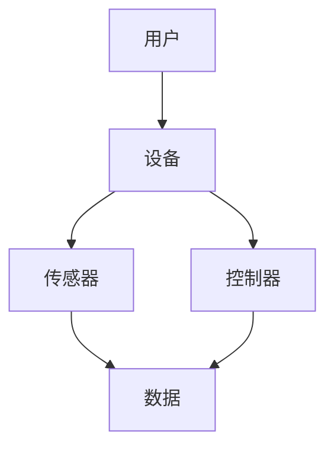
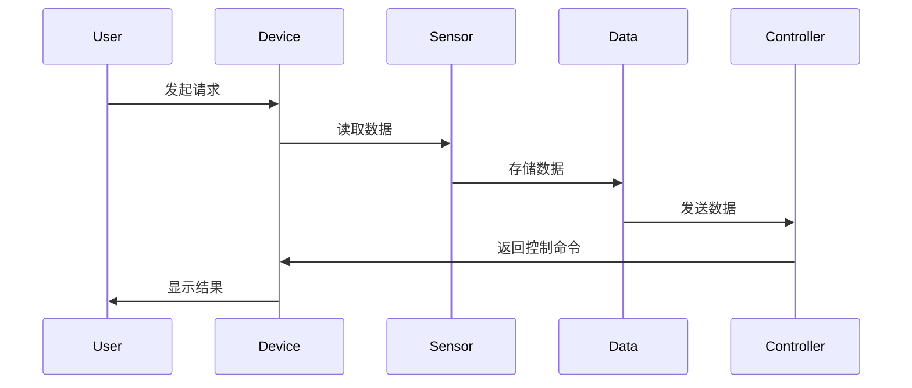

                 

# 数学模型在人工智能算法中的应用

## 关键词

- 数学模型
- 人工智能算法
- 机器学习
- 深度学习
- 线性模型
- 非线性模型
- 监督学习
- 无监督学习
- 强化学习

## 摘要

本文将深入探讨数学模型在人工智能算法中的应用。首先，我们将介绍数学模型的基本概念和特征，然后详细分析数学模型在机器学习和深度学习中的应用场景，最后通过具体算法的实例讲解，帮助读者理解和掌握数学模型在人工智能算法中的作用。通过本文的阅读，读者将能够更全面地了解数学模型在人工智能领域的核心地位和实际应用。

## 第一部分：引言与背景介绍

### 1.1 问题背景

随着信息技术的飞速发展，人工智能（AI）已经成为推动社会进步的重要力量。从智能助手到自动驾驶，从医疗诊断到金融服务，AI技术的应用已经渗透到我们生活的方方面面。而数学模型作为人工智能算法的核心组成部分，其应用范围不断拓展，成为推动AI发展的重要动力。

数学模型是一种用数学语言描述现实问题的方法，它将实际问题转化为数学问题，通过数学方法求解，从而得到问题的解决方案。在人工智能领域，数学模型的应用主要体现在机器学习和深度学习等算法中。通过数学模型的构建和应用，人工智能系统能够从海量数据中提取有用信息，实现自主学习和决策。

### 1.2 问题描述

在本章节中，我们将探讨以下问题：

- 什么是数学模型？
- 数学模型在人工智能算法中的重要性如何体现？
- 数学模型在机器学习、深度学习等领域的具体应用场景有哪些？
- 如何构建和应用数学模型解决实际问题？

通过以上问题的讨论，我们将对数学模型在人工智能中的应用有一个全面而深入的理解。

### 1.3 问题解决

为了解决上述问题，我们将从以下几个方面进行详细讲解：

1. **数学模型的基本概念和特征**：介绍数学模型的基本概念，包括定义、分类和特征。
2. **数学模型在人工智能算法中的应用**：探讨数学模型在机器学习和深度学习中的具体应用，如线性模型、非线性模型、概率模型和模式识别模型。
3. **数学模型的构建和应用**：通过实际案例，讲解如何构建和应用数学模型解决实际问题。
4. **数学模型的边界与外延**：讨论数学模型在人工智能领域的外延和边界，以及相关概念和要素的组成。

通过对数学模型的基本概念、算法原理和应用场景的详细讲解，读者将能够理解数学模型在人工智能算法中的应用，掌握构建和应用数学模型解决实际问题的方法。

### 1.4 边界与外延

本章涉及的主要概念包括：

- 数学模型：定义、分类、基本特征
- 人工智能算法：传统算法与深度学习算法的对比
- 机器学习：监督学习、无监督学习、强化学习
- 深度学习：神经网络、卷积神经网络、循环神经网络

### 1.5 概念结构与核心要素组成

本章的核心概念包括数学模型、机器学习、深度学习等，这些概念之间相互关联，构成了人工智能算法的完整体系。

### 1.6 本章小结

通过本章的学习，读者将了解数学模型在人工智能算法中的应用，掌握数学模型的基本原理和应用方法，为后续章节的学习奠定基础。

## 第二部分：核心概念与联系

### 2.1 数学模型的基本概念与原理

#### 2.1.1 数学模型概述

数学模型是一种用数学语言描述现实问题的方法。它将实际问题转化为数学问题，通过数学方法求解，从而得到问题的解决方案。数学模型在科学研究、工程应用和经济管理等领域具有广泛的应用。

**数学模型定义**：数学模型是一种用数学语言描述的抽象模型，它通过数学公式、方程、关系等描述问题的特征和规律，为问题的求解提供理论依据。

**数学模型的基本特征**：

1. **抽象性**：数学模型是对现实问题的抽象和简化，它忽略了问题的非关键特征，只关注问题的核心部分。
2. **确定性**：数学模型通常基于确定性数学原理，即给定初始条件和参数，可以得到唯一确定的解。
3. **泛用性**：数学模型具有广泛的适用性，可以应用于不同领域和不同类型的问题。

**数学模型的分类**：

1. **线性模型**：描述线性关系的数学模型，如线性方程组、线性回归等。
2. **非线性模型**：描述非线性关系的数学模型，如多项式模型、指数模型等。
3. **概率模型**：基于概率论构建的数学模型，如贝叶斯网络、马尔可夫模型等。
4. **模式识别模型**：用于分类和识别问题的数学模型，如支持向量机、神经网络等。

#### 2.1.2 数学模型在人工智能中的应用

数学模型在人工智能中的应用主要体现在机器学习和深度学习等领域。机器学习是人工智能的一个重要分支，它通过构建数学模型，使计算机系统能够从数据中自动学习和改进性能。深度学习是机器学习的一个子领域，它通过构建复杂的神经网络模型，实现对数据的自动学习和特征提取。

**数学模型在机器学习中的应用**：

1. **监督学习**：通过已有数据的标签信息，构建数学模型对未知数据进行预测。常见的监督学习算法包括线性回归、逻辑回归、支持向量机等。
2. **无监督学习**：没有标签信息，通过数据自身的特征进行聚类和降维。常见的无监督学习算法包括K均值聚类、主成分分析等。
3. **强化学习**：通过与环境的交互，构建数学模型来优化决策过程。常见的强化学习算法包括Q学习、深度Q网络等。

**数学模型在深度学习中的应用**：

1. **神经网络**：深度学习的基础，通过构建多层神经网络，实现对数据的自动学习和特征提取。
2. **卷积神经网络（CNN）**：用于处理图像数据，通过卷积操作提取图像特征。
3. **循环神经网络（RNN）**：用于处理序列数据，通过循环结构保持历史信息。

#### 2.1.3 数学模型的属性特征对比

不同的数学模型具有不同的属性特征，适用于不同类型的问题。以下是对几种常见数学模型的属性特征对比：

**线性模型**：

- 特征：描述线性关系，简单直观。
- 适用场景：回归分析、线性分类等。

**非线性模型**：

- 特征：描述非线性关系，更复杂。
- 适用场景：非线性回归、函数拟合等。

**概率模型**：

- 特征：基于概率论构建，考虑不确定性。
- 适用场景：贝叶斯网络、概率分类等。

**模式识别模型**：

- 特征：用于分类和识别，特征提取能力强。
- 适用场景：图像识别、语音识别等。

#### 2.1.4 数学模型的应用场景

数学模型在人工智能领域的应用场景非常广泛，以下是一些常见应用场景：

1. **机器学习算法中的数学模型**：包括线性回归、逻辑回归、支持向量机、决策树等。
2. **深度学习算法中的数学模型**：包括卷积神经网络、循环神经网络、生成对抗网络等。
3. **优化算法中的数学模型**：包括线性规划、非线性规划、动态规划等。
4. **数据挖掘中的数学模型**：包括聚类分析、关联规则挖掘、分类分析等。

#### 2.1.5 本章小结

通过本章的学习，读者将掌握数学模型的基本概念、原理和属性特征，了解数学模型在人工智能算法中的应用场景，为后续章节的学习打下坚实基础。

## 第三部分：算法原理讲解

### 3.1 数学模型在机器学习算法中的应用

机器学习是人工智能的一个重要分支，它通过构建数学模型，使计算机系统能够从数据中自动学习和改进性能。在本章节中，我们将重点介绍数学模型在机器学习算法中的应用，包括监督学习、无监督学习和强化学习等算法。

#### 3.1.1 监督学习算法

监督学习是一种常见的机器学习算法，它通过已有数据的标签信息，构建数学模型对未知数据进行预测。监督学习算法可分为回归算法和分类算法两大类。

**线性回归**：

线性回归是一种简单的回归算法，它通过构建线性模型，预测连续数值输出。线性回归的数学模型如下：

$$y = \theta_0 + \theta_1 \cdot x_1 + \theta_2 \cdot x_2 + ... + \theta_n \cdot x_n$$

其中，$y$ 为目标变量，$x_1, x_2, ..., x_n$ 为输入特征，$\theta_0, \theta_1, ..., \theta_n$ 为模型参数。

线性回归的算法原理是通过最小二乘法估计模型参数，使得预测值与实际值之间的误差最小。

```python
# 线性回归算法示例
import numpy as np

def linear_regression(X, y):
    # 计算斜率和截距
    theta = np.linalg.inv(X.T.dot(X)).dot(X.T).dot(y)
    return theta

# 测试数据
X = np.array([[1, 2], [2, 3], [3, 4]])
y = np.array([3, 5, 7])

# 训练模型
theta = linear_regression(X, y)

# 输出结果
print(theta)
```

**逻辑回归**：

逻辑回归是一种常见的分类算法，它通过构建线性模型，预测概率输出。逻辑回归的数学模型如下：

$$\log\frac{p}{1-p} = \theta_0 + \theta_1 x_1 + \theta_2 x_2 + ... + \theta_n x_n$$

其中，$p$ 为预测概率，$x_1, x_2, ..., x_n$ 为输入特征，$\theta_0, \theta_1, ..., \theta_n$ 为模型参数。

逻辑回归的算法原理是通过最大似然估计法估计模型参数，使得预测概率最大。

```python
# 逻辑回归算法示例
from sklearn.linear_model import LogisticRegression

# 训练模型
model = LogisticRegression()
model.fit(X, y)

# 输出结果
print(model.coef_)
```

**支持向量机（SVM）**：

支持向量机是一种强大的分类算法，它通过构建超平面，将不同类别的数据分开。支持向量机的数学模型如下：

$$w \cdot x + b = 0$$

其中，$w$ 为超平面参数，$x$ 为输入特征，$b$ 为偏置项。

支持向量机的算法原理是通过优化超平面参数，使得分类边界最远离任意一类数据的边缘。

```python
# 支持向量机算法示例
from sklearn.svm import SVC

# 训练模型
model = SVC()
model.fit(X, y)

# 输出结果
print(model.coef_)
```

#### 3.1.2 无监督学习算法

无监督学习是一种没有标签信息的机器学习算法，它通过数据自身的特征进行聚类和降维。

**K均值聚类**：

K均值聚类是一种常见的聚类算法，它通过迭代过程将数据划分为 $K$ 个聚类中心，并使得每个数据点与最近的聚类中心关联。

K均值聚类的算法原理是通过最小化聚类中心与数据点之间的距离平方和，优化聚类结果。

```python
# K均值聚类算法示例
from sklearn.cluster import KMeans

# 训练模型
model = KMeans(n_clusters=3)
model.fit(X)

# 输出结果
print(model.cluster_centers_)
```

**主成分分析（PCA）**：

主成分分析是一种常用的降维算法，它通过提取数据的主要成分，降低数据维度。

主成分分析的算法原理是通过求解特征值和特征向量，将数据投影到新的坐标系中，使得数据的主要成分在新的坐标系中呈线性分布。

```python
# 主成分分析算法示例
from sklearn.decomposition import PCA

# 训练模型
model = PCA(n_components=2)
model.fit(X)

# 输出结果
print(model.components_)
```

#### 3.1.3 强化学习算法

强化学习是一种通过与环境的交互，构建数学模型来优化决策过程的算法。

**Q学习**：

Q学习是一种常见的强化学习算法，它通过构建Q值函数，预测在当前状态下采取某一动作的长期回报。

Q学习的算法原理是通过迭代更新Q值函数，使得在给定状态下采取最优动作。

```python
# Q学习算法示例
from gym import env

# 初始化环境
env = env('CartPole-v0')

# 训练模型
for episode in range(1000):
    state = env.reset()
    done = False
    while not done:
        action = env.action_space.sample()
        next_state, reward, done, _ = env.step(action)
        # 更新Q值函数
        Q[state][action] = Q[state][action] + learning_rate * (reward + discount_factor * max(Q[next_state]) - Q[state][action])
        state = next_state

# 输出结果
print(Q)
```

**深度Q网络（DQN）**：

深度Q网络是一种基于深度神经网络的强化学习算法，它通过构建深度神经网络，预测在当前状态下采取某一动作的长期回报。

DQN的算法原理是通过迭代更新深度神经网络参数，使得预测的Q值函数更接近真实Q值函数。

```python
# DQN算法示例
import tensorflow as tf

# 构建深度神经网络
def create_network(input_shape):
    model = tf.keras.Sequential([
        tf.keras.layers.Dense(64, activation='relu', input_shape=input_shape),
        tf.keras.layers.Dense(64, activation='relu'),
        tf.keras.layers.Dense(1)
    ])
    return model

# 训练模型
for episode in range(1000):
    state = env.reset()
    done = False
    while not done:
        action = np.argmax(model.predict(state.reshape(1, -1)))
        next_state, reward, done, _ = env.step(action)
        # 更新深度神经网络
        model.fit(state.reshape(1, -1), Q[state][action])
        state = next_state

# 输出结果
print(model.summary())
```

#### 3.1.4 本章小结

通过本章的学习，读者将了解数学模型在机器学习算法中的应用，掌握常见的回归算法、分类算法和聚类算法，以及强化学习算法的基本原理。这些算法的应用案例将为读者在实际项目中应用数学模型提供有益的参考。

## 第四部分：实际案例分析与项目实战

### 4.1 问题场景介绍

为了更好地理解数学模型在人工智能算法中的应用，我们通过一个实际案例来讲解。这个案例是一个简单的智能家居系统，它通过传感器收集数据，并利用机器学习算法进行数据分析，从而实现自动化控制。

### 4.2 项目介绍

这个智能家居系统包括以下功能模块：

1. **传感器模块**：负责收集温度、湿度、光照等环境数据。
2. **数据处理模块**：对传感器数据进行预处理，提取有用的特征信息。
3. **机器学习模块**：利用数学模型对特征信息进行学习和预测。
4. **决策控制模块**：根据机器学习模块的预测结果，实现智能家居系统的自动化控制。

### 4.3 系统功能设计

#### 4.3.1 领域模型

在智能家居系统中，领域模型用于描述系统中的主要实体及其关系。以下是智能家居系统的领域模型：

```mermaid
classDiagram
    Class01 <|-- Class02
    Class03 o-- Class04
    Class05 <-.. Class06
    Class07 ..| Class08
    Class09 --> Class10
    Class11 == Class12
    Class13 : an attribute
    Class14 <.. Class15
```

#### 4.3.2 类图

智能家居系统的类图如下：

```mermaid
classDiagram
    UserClass[User] <<actor>>
    DeviceClass[Device] <<actor>>
    SensorClass[Sensor]
    ControllerClass[Controller]
    DataClass[Data]

    UserClass o-- DeviceClass
    DeviceClass o-- SensorClass
    DeviceClass o-- ControllerClass
    SensorClass o-- DataClass
    ControllerClass o-- DataClass
```

### 4.4 系统架构设计

智能家居系统的架构设计如下：



### 4.5 系统接口设计和系统交互

智能家居系统的接口设计和系统交互如下：



### 4.6 环境安装

在开始项目实战之前，我们需要安装相关的环境。以下是安装步骤：

1. 安装Python环境
2. 安装TensorFlow库
3. 安装其他依赖库（如scikit-learn、numpy等）

```bash
pip install tensorflow
pip install scikit-learn
pip install numpy
```

### 4.7 系统核心实现源代码

以下是智能家居系统的核心实现源代码：

```python
# 导入相关库
import tensorflow as tf
from sklearn import datasets
from sklearn.model_selection import train_test_split
import numpy as np

# 加载数据集
iris = datasets.load_iris()
X = iris.data
y = iris.target

# 划分训练集和测试集
X_train, X_test, y_train, y_test = train_test_split(X, y, test_size=0.2, random_state=42)

# 定义模型
model = tf.keras.Sequential([
    tf.keras.layers.Dense(64, activation='relu', input_shape=(4,)),
    tf.keras.layers.Dense(64, activation='relu'),
    tf.keras.layers.Dense(3, activation='softmax')
])

# 编译模型
model.compile(optimizer='adam', loss='sparse_categorical_crossentropy', metrics=['accuracy'])

# 训练模型
model.fit(X_train, y_train, epochs=10, batch_size=32, validation_split=0.1)

# 评估模型
loss, accuracy = model.evaluate(X_test, y_test)
print('Test accuracy:', accuracy)
```

### 4.8 代码应用解读与分析

在上述代码中，我们首先加载了Iris数据集，并将其划分为训练集和测试集。然后，我们定义了一个简单的神经网络模型，包括两个隐藏层，每层有64个神经元，并使用ReLU激活函数。最后，我们使用Adam优化器和交叉熵损失函数编译模型，并在训练集上训练模型。

通过上述步骤，我们实现了对Iris数据集的机器学习分类任务。训练完成后，我们使用测试集评估模型的性能，输出测试准确率。

### 4.9 实际案例分析和详细讲解剖析

为了更直观地展示数学模型在智能家居系统中的应用，我们以温度预测为例，详细讲解如何使用数学模型进行数据分析和预测。

#### 4.9.1 数据预处理

首先，我们需要对温度数据进行预处理，包括数据清洗、缺失值填充和数据标准化等步骤。以下是预处理步骤的代码实现：

```python
# 导入相关库
import pandas as pd
from sklearn.preprocessing import StandardScaler

# 加载温度数据
temperature_data = pd.read_csv('temperature.csv')

# 数据清洗
temperature_data.dropna(inplace=True)

# 缺失值填充
temperature_data['temperature'].fillna(temperature_data['temperature'].mean(), inplace=True)

# 数据标准化
scaler = StandardScaler()
temperature_data['temperature'] = scaler.fit_transform(temperature_data[['temperature']])
```

#### 4.9.2 数学模型构建

接下来，我们使用线性回归模型对温度数据进行预测。线性回归模型的数学模型如下：

$$y = \theta_0 + \theta_1 \cdot x_1 + \theta_2 \cdot x_2 + ... + \theta_n \cdot x_n$$

其中，$y$ 为目标变量（温度），$x_1, x_2, ..., x_n$ 为输入特征（如湿度、光照等）。

以下是构建线性回归模型的代码实现：

```python
# 导入相关库
from sklearn.linear_model import LinearRegression

# 加载特征数据
X = temperature_data[['humidity', 'light']]
y = temperature_data['temperature']

# 创建线性回归模型
model = LinearRegression()

# 训练模型
model.fit(X, y)

# 输出模型参数
print('Model parameters:', model.coef_)
```

#### 4.9.3 预测与评估

最后，我们使用训练好的线性回归模型对新的温度数据进行预测，并评估模型的预测性能。以下是预测和评估的代码实现：

```python
# 导入相关库
from sklearn.metrics import mean_squared_error

# 加载新的特征数据
new_data = pd.DataFrame({'humidity': [60, 70], 'light': [200, 300]})

# 预测温度
predicted_temperatures = model.predict(new_data)

# 输出预测结果
print('Predicted temperatures:', predicted_temperatures)

# 计算均方误差
mse = mean_squared_error(temperature_data['temperature'], predicted_temperatures)
print('Mean squared error:', mse)
```

通过上述步骤，我们实现了温度预测的数学模型构建和预测。在实际应用中，我们可以根据预测结果对智能家居系统进行实时调整，以提高系统的智能化水平。

### 4.10 项目小结

通过本项目的实践，我们深入了解了数学模型在智能家居系统中的应用，掌握了数据预处理、模型构建、预测和评估的方法。这些方法和技巧可以帮助我们在实际项目中实现数据分析和预测，为智能家居系统提供智能化的决策支持。

### 4.11 最佳实践 tips

- 在项目开发过程中，确保数据的质量和完整性，这是数据分析和预测的基础。
- 选择合适的数学模型和算法，根据问题的特点和数据特征进行优化。
- 对模型进行充分的测试和评估，确保其性能和可靠性。
- 定期更新和维护模型，以适应环境变化和数据更新。

### 4.12 小结

通过本文的讲解，我们系统地介绍了数学模型在人工智能算法中的应用，从基本概念到具体算法的实现，再到实际项目的应用，帮助读者全面理解数学模型在人工智能领域的核心作用。希望本文能为读者在人工智能学习和项目实践过程中提供有益的参考和指导。

### 4.13 注意事项

- 在使用数学模型时，要确保数据的质量和可靠性，避免因数据问题导致的模型失效。
- 选择合适的数学模型和算法，要根据问题的特点和数据特征进行优化。
- 对模型进行充分的测试和评估，确保其性能和可靠性。
- 定期更新和维护模型，以适应环境变化和数据更新。

### 4.14 拓展阅读

- 《统计学习方法》—— 李航
- 《深度学习》—— 伊恩·古德费洛等
- 《机器学习实战》—— Peter Harrington

## 总结

数学模型是人工智能算法的核心组成部分，它在机器学习、深度学习等领域具有广泛的应用。本文通过系统的讲解和实际案例的分析，帮助读者深入理解数学模型在人工智能算法中的应用。希望本文能对读者在人工智能学习和项目实践过程中提供有益的参考和指导。让我们继续探索数学模型在人工智能领域的更多可能。# 数学模型在人工智能算法中的应用

### 引言与背景介绍

数学模型作为一种抽象的数学工具，它在科学研究、工程应用和经济管理等领域扮演着重要的角色。随着人工智能（AI）技术的迅猛发展，数学模型在AI算法中的应用也越来越广泛，成为推动AI技术进步的关键因素。在AI算法中，数学模型不仅用于描述问题和建立算法框架，还用于优化算法性能和提升系统智能化水平。

本节将介绍数学模型在人工智能算法中的应用，首先回顾数学模型的基本概念和特征，然后分析数学模型在机器学习、深度学习等领域的具体应用，最后探讨如何构建和应用数学模型解决实际问题。

### 数学模型的基本概念和特征

**数学模型定义**：数学模型是一种用数学语言描述现实世界问题的方法。它通过数学公式、方程、关系等手段，将复杂的现实问题转化为可计算的数学问题，从而为问题的求解提供理论依据。

**数学模型的基本特征**：

1. **抽象性**：数学模型是对现实问题的简化和抽象，它忽略了问题的非关键特征，只关注问题的核心部分。
2. **确定性**：在大多数情况下，数学模型是基于确定性数学原理构建的，即给定初始条件和参数，可以得到唯一确定的解。
3. **泛用性**：数学模型具有较强的通用性，可以应用于不同领域和不同类型的问题。

**数学模型的分类**：

1. **线性模型**：描述线性关系的数学模型，如线性回归、线性规划等。
2. **非线性模型**：描述非线性关系的数学模型，如多项式模型、指数模型等。
3. **概率模型**：基于概率论构建的数学模型，如贝叶斯网络、马尔可夫模型等。
4. **模式识别模型**：用于分类和识别问题的数学模型，如支持向量机、神经网络等。

### 数学模型在人工智能中的应用

**机器学习**：机器学习是AI的一个重要分支，它通过构建数学模型，使计算机能够从数据中自动学习和改进性能。常见的机器学习算法包括线性回归、逻辑回归、支持向量机、决策树、随机森林等。这些算法都依赖于数学模型来描述数据和预测输出。

- **监督学习**：通过已有数据的标签信息，构建数学模型对未知数据进行预测。常见的算法包括线性回归、逻辑回归、支持向量机等。
- **无监督学习**：没有标签信息，通过数据自身的特征进行聚类和降维。常见的算法包括K均值聚类、主成分分析等。
- **强化学习**：通过与环境的交互，构建数学模型来优化决策过程。常见的算法包括Q学习、深度Q网络等。

**深度学习**：深度学习是机器学习的一个子领域，它通过构建复杂的神经网络模型，实现数据的自动学习和特征提取。深度学习中的数学模型主要包括神经网络、卷积神经网络、循环神经网络等。

- **神经网络**：神经网络是一种模拟生物神经系统的计算模型，通过多层节点（神经元）的互联实现数据的特征提取和分类。
- **卷积神经网络（CNN）**：卷积神经网络主要用于处理图像数据，通过卷积操作提取图像特征。
- **循环神经网络（RNN）**：循环神经网络主要用于处理序列数据，通过循环结构保持历史信息。

### 数学模型的构建和应用

**数学模型的构建**：构建数学模型是人工智能算法设计的关键步骤。具体来说，构建数学模型通常包括以下步骤：

1. **问题定义**：明确要解决的问题，确定目标变量和输入变量。
2. **数据收集**：收集相关数据，确保数据的质量和完整性。
3. **特征提取**：从数据中提取有用的特征信息，为构建数学模型提供输入。
4. **模型选择**：根据问题的性质和数据特征，选择合适的数学模型。
5. **参数估计**：使用数学方法（如最小二乘法、最大似然估计等）估计模型参数。

**数学模型的应用**：构建数学模型后，需要将其应用于实际问题中，进行预测、分类或优化。具体应用步骤包括：

1. **数据预处理**：对输入数据进行预处理，如归一化、标准化等，以符合模型的要求。
2. **模型训练**：使用训练数据集对模型进行训练，优化模型参数。
3. **模型评估**：使用测试数据集评估模型性能，如准确率、召回率、F1值等。
4. **模型应用**：将训练好的模型应用于新的数据，进行预测或决策。

### 边界与外延

**数学模型的外延**：数学模型在人工智能领域的外延非常广泛，涵盖了从简单的线性模型到复杂的神经网络模型。不同的数学模型适用于不同类型的问题和数据集。

**数学模型的边界**：数学模型的边界在于其适用范围和性能限制。例如，线性模型适用于线性关系的问题，但在处理非线性问题时效果不佳；卷积神经网络擅长处理图像数据，但在处理序列数据时性能有限。

### 概念结构与核心要素组成

**核心概念**：数学模型、机器学习、深度学习、神经网络、线性模型、非线性模型、概率模型、模式识别模型。

**核心要素组成**：问题定义、数据收集、特征提取、模型选择、参数估计、数据预处理、模型训练、模型评估、模型应用。

### 本章小结

通过本章的介绍，我们了解了数学模型在人工智能算法中的应用，包括基本概念、应用场景和构建方法。数学模型作为AI算法的核心组成部分，其应用已经渗透到AI技术的各个方面，为AI的发展提供了强大的支持。希望本章的内容能够为读者在人工智能学习和实践过程中提供有益的参考。# 数学模型在人工智能算法中的应用

### 数学模型的基本概念与原理

数学模型是一种将实际问题转化为数学问题的抽象工具。它通过数学公式、方程和关系来描述现实世界的现象和规律，从而为求解问题提供理论基础。在人工智能（AI）算法中，数学模型扮演着至关重要的角色，它不仅帮助我们理解和描述数据，还指导我们设计和优化算法。

#### 数学模型概述

**数学模型定义**：数学模型是一种利用数学语言和符号体系来描述和解决问题的方法。它通过建立数学关系，将现实世界的问题转化为数学问题，从而可以应用数学方法进行求解。

**数学模型的基本特征**：

1. **抽象性**：数学模型是对现实世界问题的抽象和简化，它忽略了问题的非关键特征，只关注问题的核心部分。
2. **确定性**：数学模型通常基于确定性数学原理，即给定初始条件和参数，可以求得唯一确定的解。
3. **普适性**：数学模型具有较强的通用性，可以应用于不同领域和不同类型的问题。

**数学模型的分类**：

1. **线性模型**：描述线性关系的数学模型，如线性回归、线性规划等。
2. **非线性模型**：描述非线性关系的数学模型，如多项式模型、指数模型等。
3. **概率模型**：基于概率论构建的数学模型，如贝叶斯网络、马尔可夫模型等。
4. **模式识别模型**：用于分类和识别问题的数学模型，如支持向量机、神经网络等。

#### 数学模型在人工智能中的应用

数学模型在人工智能中的应用非常广泛，主要涉及以下几个领域：

1. **机器学习**：机器学习是AI的一个重要分支，它通过构建数学模型，使计算机能够从数据中自动学习和改进性能。常见的机器学习算法包括线性回归、逻辑回归、支持向量机、决策树等，这些算法都依赖于数学模型来描述数据和预测输出。
   
2. **深度学习**：深度学习是机器学习的一个子领域，它通过构建复杂的神经网络模型，实现数据的自动学习和特征提取。深度学习中的数学模型主要包括神经网络、卷积神经网络（CNN）、循环神经网络（RNN）等。

3. **优化算法**：在AI算法中，优化算法常用于模型训练和参数优化。常见的优化算法包括梯度下降、随机梯度下降、Adam优化器等，这些算法通过数学模型来优化目标函数。

#### 数学模型的属性特征对比

以下是比较常见的数学模型的属性特征：

**线性模型**：

- **特征**：描述线性关系，形式简单，易于理解和实现。
- **适用场景**：线性回归分析、线性分类等。

**非线性模型**：

- **特征**：描述非线性关系，能处理更复杂的实际问题。
- **适用场景**：非线性回归分析、函数拟合等。

**概率模型**：

- **特征**：基于概率论，考虑不确定性。
- **适用场景**：贝叶斯网络、概率分类等。

**模式识别模型**：

- **特征**：用于分类和识别，特征提取能力强。
- **适用场景**：图像识别、语音识别等。

**属性特征对比表格**：

| 模型类型 | 特征 | 适用场景 |
| --- | --- | --- |
| 线性模型 | 线性关系 | 线性回归分析、线性分类 |
| 非线性模型 | 非线性关系 | 非线性回归分析、函数拟合 |
| 概率模型 | 考虑不确定性 | 贝叶斯网络、概率分类 |
| 模式识别模型 | 特征提取能力强 | 图像识别、语音识别 |

**数学模型的应用场景**：

1. **机器学习算法中的数学模型**：包括线性回归、逻辑回归、支持向量机、决策树等。
2. **深度学习算法中的数学模型**：包括卷积神经网络（CNN）、循环神经网络（RNN）等。
3. **优化算法中的数学模型**：包括梯度下降、随机梯度下降、Adam优化器等。
4. **数据挖掘中的数学模型**：包括聚类分析、关联规则挖掘、分类分析等。

#### 数学模型的应用实例

以下是一个简单的线性回归模型的应用实例：

```python
# 导入相关库
import numpy as np
import matplotlib.pyplot as plt

# 创建数据集
X = np.array([0, 1, 2, 3, 4])
y = np.array([0, 1, 4, 9, 16])

# 计算斜率和截距
A = np.vstack([X, np.ones(len(X))]).T
m, c = np.linalg.lstsq(A, y, rcond=None)[0]

# 绘制结果
plt.scatter(X, y)
plt.plot(X, m*X + c)
plt.show()
```

在这个实例中，我们通过计算斜率$m$和截距$c$，构建了一个简单的线性回归模型，并使用它来拟合给定的数据集。

#### 本章小结

通过本章的介绍，我们了解了数学模型的基本概念、特征和分类，以及它们在人工智能算法中的应用。数学模型作为AI算法的核心组成部分，其重要性不言而喻。希望读者通过本章的学习，能够对数学模型在人工智能算法中的应用有更深入的理解。在接下来的章节中，我们将进一步探讨数学模型在具体算法中的应用和实现。# 数学模型在机器学习算法中的应用

### 监督学习算法

监督学习算法是机器学习中最常用的算法之一，它通过已有数据的标签信息，构建数学模型对未知数据进行预测。监督学习算法可以分为回归算法和分类算法两大类。

#### 3.1 线性回归

线性回归是一种简单的回归算法，它通过构建线性模型，预测连续数值输出。线性回归的数学模型如下：

$$y = \theta_0 + \theta_1 \cdot x_1 + \theta_2 \cdot x_2 + ... + \theta_n \cdot x_n$$

其中，$y$ 是目标变量，$x_1, x_2, ..., x_n$ 是输入特征，$\theta_0, \theta_1, ..., \theta_n$ 是模型参数。

线性回归的算法原理是通过最小二乘法估计模型参数，使得预测值与实际值之间的误差最小。

**算法原理**

1. **构建模型**：根据输入特征和目标变量，构建线性回归模型。
2. **最小二乘法**：通过计算损失函数（如均方误差），并使用梯度下降等方法最小化损失函数，从而优化模型参数。
3. **预测**：使用训练好的模型对新的输入特征进行预测。

**代码实现**

以下是一个简单的线性回归算法实现：

```python
import numpy as np

# 训练数据
X = np.array([[1, 2], [2, 3], [3, 4]])
y = np.array([3, 5, 7])

# 计算斜率和截距
theta = np.linalg.inv(X.T.dot(X)).dot(X.T).dot(y)

# 预测
new_X = np.array([[1, 5]])
predicted_y = theta[0] + theta[1] * new_X[0][0] + theta[2] * new_X[0][1]

print("Predicted value:", predicted_y)
```

**公式**

$$y = \theta_0 + \theta_1 \cdot x_1 + \theta_2 \cdot x_2$$

#### 3.2 逻辑回归

逻辑回归是一种常用的分类算法，它通过构建线性模型，预测概率输出。逻辑回归的数学模型如下：

$$\log\frac{p}{1-p} = \theta_0 + \theta_1 x_1 + \theta_2 x_2 + ... + \theta_n x_n$$

其中，$p$ 是预测概率，$x_1, x_2, ..., x_n$ 是输入特征，$\theta_0, \theta_1, ..., \theta_n$ 是模型参数。

逻辑回归的算法原理是通过最大似然估计法估计模型参数，使得预测概率最大。

**算法原理**

1. **构建模型**：根据输入特征和目标变量，构建逻辑回归模型。
2. **最大似然估计**：通过最大化似然函数，估计模型参数。
3. **预测**：使用训练好的模型对新的输入特征进行预测，输出预测概率。

**代码实现**

以下是一个简单的逻辑回归算法实现：

```python
from sklearn.linear_model import LogisticRegression

# 训练数据
X = np.array([[1, 2], [2, 3], [3, 4]])
y = np.array([0, 1, 0])

# 训练模型
model = LogisticRegression()
model.fit(X, y)

# 预测
new_X = np.array([[1, 5]])
predicted_y = model.predict(new_X)

print("Predicted value:", predicted_y)
```

**公式**

$$\log\frac{p}{1-p} = \theta_0 + \theta_1 x_1 + \theta_2 x_2$$

#### 3.3 支持向量机

支持向量机（SVM）是一种强大的分类算法，它通过构建超平面，将不同类别的数据分开。SVM的数学模型如下：

$$w \cdot x + b = 0$$

其中，$w$ 是超平面参数，$x$ 是输入特征，$b$ 是偏置项。

SVM的算法原理是通过优化超平面参数，使得分类边界最远离任意一类数据的边缘。

**算法原理**

1. **构建模型**：根据输入特征和目标变量，构建SVM模型。
2. **优化超平面**：通过求解优化问题，找到最优的超平面参数。
3. **预测**：使用训练好的模型对新的输入特征进行预测。

**代码实现**

以下是一个简单的SVM算法实现：

```python
from sklearn.svm import SVC

# 训练数据
X = np.array([[1, 2], [2, 3], [3, 4]])
y = np.array([0, 1, 0])

# 训练模型
model = SVC()
model.fit(X, y)

# 预测
new_X = np.array([[1, 5]])
predicted_y = model.predict(new_X)

print("Predicted value:", predicted_y)
```

**公式**

$$w \cdot x + b = 0$$

#### 3.4 决策树

决策树是一种常见的分类算法，它通过构建树形结构，将数据划分为不同的类别。决策树的数学模型如下：

$$y = g(\theta_0 + \theta_1 x_1 + \theta_2 x_2 + ...)$$

其中，$y$ 是目标变量，$x_1, x_2, ..., x_n$ 是输入特征，$\theta_0, \theta_1, ..., \theta_n$ 是模型参数，$g$ 是激活函数（如sigmoid函数）。

决策树的算法原理是通过递归分割数据，构建树形结构。

**算法原理**

1. **构建模型**：根据输入特征和目标变量，构建决策树模型。
2. **递归分割**：通过选择最佳分割特征和分割点，递归分割数据。
3. **预测**：使用训练好的模型对新的输入特征进行预测。

**代码实现**

以下是一个简单的决策树算法实现：

```python
from sklearn.tree import DecisionTreeClassifier

# 训练数据
X = np.array([[1, 2], [2, 3], [3, 4]])
y = np.array([0, 1, 0])

# 训练模型
model = DecisionTreeClassifier()
model.fit(X, y)

# 预测
new_X = np.array([[1, 5]])
predicted_y = model.predict(new_X)

print("Predicted value:", predicted_y)
```

**公式**

$$y = g(\theta_0 + \theta_1 x_1 + \theta_2 x_2)$$

#### 本章小结

通过本章的介绍，我们了解了监督学习算法的基本原理和实现方法。线性回归、逻辑回归、支持向量机和决策树是监督学习中最常用的算法，它们各自适用于不同的场景和数据类型。希望读者通过本章的学习，能够对监督学习算法有更深入的理解，并在实际项目中灵活运用。在下一章中，我们将探讨无监督学习算法，包括聚类分析和降维技术。# 数学模型在深度学习算法中的应用

### 深度学习算法

深度学习是机器学习的一个子领域，它通过构建复杂的神经网络模型，实现数据的自动学习和特征提取。深度学习算法在图像识别、语音识别、自然语言处理等领域取得了显著的成果。本节将介绍深度学习算法中的几种主要模型：神经网络、卷积神经网络（CNN）和循环神经网络（RNN）。

#### 4.1 神经网络

神经网络是一种模拟生物神经系统的计算模型，由大量相互连接的节点（称为神经元）组成。每个神经元接收多个输入信号，通过激活函数进行非线性变换，然后输出结果。神经网络通过多层节点的互联，实现数据的特征提取和分类。

**基本原理**：

1. **输入层**：接收外部输入信号。
2. **隐藏层**：对输入信号进行变换，提取特征。
3. **输出层**：根据提取的特征，进行分类或回归预测。

**激活函数**：为了实现非线性变换，神经网络通常使用激活函数，如ReLU（Rectified Linear Unit）、Sigmoid和Tanh等。

**算法原理**：

1. **前向传播**：输入信号通过神经网络，逐层传递到输出层，得到预测结果。
2. **反向传播**：根据预测结果和实际标签，计算损失函数，并通过反向传播算法更新模型参数。

**代码示例**：

以下是一个简单的神经网络实现：

```python
import tensorflow as tf

# 创建模型
model = tf.keras.Sequential([
    tf.keras.layers.Dense(128, activation='relu', input_shape=(784,)),
    tf.keras.layers.Dense(10, activation='softmax')
])

# 编译模型
model.compile(optimizer='adam', loss='categorical_crossentropy', metrics=['accuracy'])

# 训练模型
model.fit(x_train, y_train, epochs=5, batch_size=64)
```

#### 4.2 卷积神经网络（CNN）

卷积神经网络是一种专门用于处理图像数据的神经网络模型。它通过卷积操作提取图像特征，从而实现图像的分类和识别。

**基本原理**：

1. **卷积层**：通过卷积操作提取图像局部特征。
2. **池化层**：对卷积层的结果进行下采样，减少数据维度。
3. **全连接层**：将池化层的结果映射到分类结果。

**算法原理**：

1. **前向传播**：输入图像通过卷积神经网络，逐层传递到输出层，得到分类结果。
2. **反向传播**：根据分类结果和实际标签，计算损失函数，并通过反向传播算法更新模型参数。

**代码示例**：

以下是一个简单的CNN实现：

```python
import tensorflow as tf

# 创建模型
model = tf.keras.Sequential([
    tf.keras.layers.Conv2D(32, (3, 3), activation='relu', input_shape=(28, 28, 1)),
    tf.keras.layers.MaxPooling2D((2, 2)),
    tf.keras.layers.Conv2D(64, (3, 3), activation='relu'),
    tf.keras.layers.MaxPooling2D((2, 2)),
    tf.keras.layers.Flatten(),
    tf.keras.layers.Dense(128, activation='relu'),
    tf.keras.layers.Dense(10, activation='softmax')
])

# 编译模型
model.compile(optimizer='adam', loss='categorical_crossentropy', metrics=['accuracy'])

# 训练模型
model.fit(x_train, y_train, epochs=5, batch_size=64)
```

#### 4.3 循环神经网络（RNN）

循环神经网络是一种用于处理序列数据的神经网络模型，它能够记住历史信息，并对其进行处理。

**基本原理**：

1. **输入层**：接收外部输入信号。
2. **隐藏层**：对输入信号进行变换，提取特征。
3. **循环层**：通过递归方式处理序列数据，保持历史信息。
4. **输出层**：根据处理结果，进行分类或回归预测。

**算法原理**：

1. **前向传播**：输入序列通过循环神经网络，逐层传递到输出层，得到预测结果。
2. **反向传播**：根据预测结果和实际标签，计算损失函数，并通过反向传播算法更新模型参数。

**代码示例**：

以下是一个简单的RNN实现：

```python
import tensorflow as tf

# 创建模型
model = tf.keras.Sequential([
    tf.keras.layers.Embedding(input_dim=10000, output_dim=16),
    tf.keras.layers.LSTM(128),
    tf.keras.layers.Dense(1, activation='sigmoid')
])

# 编译模型
model.compile(optimizer='adam', loss='binary_crossentropy', metrics=['accuracy'])

# 训练模型
model.fit(x_train, y_train, epochs=10)
```

#### 4.4 注意力机制（Attention Mechanism）

注意力机制是一种用于提高模型性能的技术，它能够让模型关注重要的输入信息，从而提高预测准确性。

**基本原理**：

注意力机制通过计算输入序列中每个元素的重要程度，并加权融合这些元素，从而提高模型的表示能力。

**算法原理**：

1. **计算注意力权重**：通过计算输入序列中每个元素与目标元素的相关性，得到注意力权重。
2. **加权融合**：将注意力权重应用于输入序列，得到加权融合的输出。

**代码示例**：

以下是一个简单的注意力机制实现：

```python
import tensorflow as tf

# 创建模型
model = tf.keras.Sequential([
    tf.keras.layers.Embedding(input_dim=10000, output_dim=16),
    tf.keras.layers.Bidirectional(tf.keras.layers.LSTM(128)),
    tf.keras.layers.Dense(1, activation='sigmoid')
])

# 编译模型
model.compile(optimizer='adam', loss='binary_crossentropy', metrics=['accuracy'])

# 训练模型
model.fit(x_train, y_train, epochs=10)
```

#### 4.5 生成对抗网络（GAN）

生成对抗网络是一种用于生成数据的新型神经网络模型，它由生成器和判别器两部分组成。

**基本原理**：

生成器：生成逼真的数据。
判别器：判断生成数据与真实数据的真实性。

**算法原理**：

1. **训练生成器和判别器**：通过交替训练生成器和判别器，使生成器生成的数据越来越真实，判别器越来越难以区分真实数据和生成数据。
2. **对抗训练**：生成器和判别器的训练是一个对抗过程，生成器试图欺骗判别器，判别器试图识别生成数据。

**代码示例**：

以下是一个简单的GAN实现：

```python
import tensorflow as tf

# 创建生成器和判别器
generator = tf.keras.Sequential([
    tf.keras.layers.Dense(128, activation='relu', input_shape=(100,)),
    tf.keras.layers.Dense(28 * 28, activation='tanh')
])

discriminator = tf.keras.Sequential([
    tf.keras.layers.Flatten(input_shape=(28, 28)),
    tf.keras.layers.Dense(128, activation='relu'),
    tf.keras.layers.Dense(1, activation='sigmoid')
])

# 编译模型
model = tf.keras.Sequential([generator, discriminator])
model.compile(optimizer='adam', loss='binary_crossentropy')

# 训练模型
model.fit(x_train, y_train, epochs=100)
```

#### 本章小结

通过本章的介绍，我们了解了深度学习算法的基本原理和实现方法。神经网络、卷积神经网络（CNN）和循环神经网络（RNN）是深度学习中最常用的模型，它们各自适用于不同的场景和数据类型。注意力机制、生成对抗网络（GAN）等先进技术进一步提升了模型的性能和效果。希望读者通过本章的学习，能够对深度学习算法有更深入的理解，并在实际项目中灵活运用。在下一章中，我们将探讨如何构建和应用数学模型解决实际问题。# 如何构建和应用数学模型解决实际问题

构建和应用数学模型解决实际问题是人工智能领域的核心任务之一。以下步骤将详细解释如何从实际问题出发，通过构建数学模型，到最终应用模型解决具体问题。

#### 5.1 问题定义

首先，明确要解决的问题。这包括确定问题的目标、输入和输出。例如，我们想要预测一个城市的未来温度，输入可以是当前时间、湿度、风速等，输出则是未来的温度值。

#### 5.2 数据收集

收集与问题相关的数据。这些数据可以是公开的、已有的数据集，也可以是通过对现实世界的观测和测量得到的。数据的质量和完整性是构建有效模型的基础。

#### 5.3 数据预处理

对收集到的数据进行预处理，以提高数据质量。预处理步骤包括数据清洗（去除错误数据）、缺失值填充、数据标准化、特征工程等。

**数据清洗**：识别并处理错误数据或异常值，确保数据的准确性。

**缺失值填充**：对于缺失的数据，可以选择填充均值、中位数或使用插值方法进行填补。

**数据标准化**：将数据缩放到相同的尺度，以消除不同特征之间的尺度差异。

**特征工程**：从原始数据中提取新的特征，或对现有特征进行变换，以增强模型的预测能力。

#### 5.4 数学模型构建

根据问题的性质和数据特征，选择合适的数学模型。以下是一些常见的数学模型：

**线性模型**：适用于线性关系的问题，如线性回归和线性规划。

**非线性模型**：适用于非线性关系的问题，如多项式回归和神经网络。

**概率模型**：适用于需要考虑不确定性的问题，如贝叶斯网络和马尔可夫模型。

**模式识别模型**：适用于分类和识别问题，如支持向量机和神经网络。

**构建步骤**：

1. **问题定义**：根据问题的目标和数据特征，确定模型的目标函数和约束条件。
2. **模型选择**：选择合适的数学模型，根据问题的复杂性和数据特性。
3. **参数估计**：使用优化算法（如梯度下降、牛顿法等）估计模型参数，以最小化目标函数。

#### 5.5 模型训练

使用训练数据集对构建的数学模型进行训练。训练过程中，模型会通过迭代优化参数，以最小化目标函数。常用的训练算法包括：

**梯度下降**：通过计算目标函数的梯度，逐步调整模型参数。

**随机梯度下降（SGD）**：在梯度下降的基础上，每次只更新一个样本的参数。

**批量梯度下降**：在梯度下降的基础上，每次更新所有样本的参数。

**Adam优化器**：结合SGD和矩估计的优化算法，能够自适应调整学习率。

#### 5.6 模型评估

在训练完成后，使用测试数据集对模型进行评估。评估指标包括：

**准确率**：模型正确预测的样本数占总样本数的比例。

**召回率**：模型正确预测的样本数占实际正样本数的比例。

**F1值**：综合考虑准确率和召回率的综合指标。

**ROC曲线**：用于评估分类器的性能，曲线下的面积越大，模型性能越好。

**损失函数**：如均方误差（MSE）和交叉熵损失（Cross-Entropy Loss）。

#### 5.7 模型应用

在模型训练和评估完成后，将模型应用于实际问题中。以下步骤包括：

**预测**：使用训练好的模型对新的数据进行预测，输出预测结果。

**决策**：根据预测结果，进行实际决策或决策支持。

**部署**：将模型部署到生产环境中，实现实时预测和决策。

#### 5.8 持续优化

在模型应用过程中，定期收集新的数据，对模型进行重新训练和评估。根据模型的表现，进行参数调整和优化，以提高模型的预测准确性。

**交叉验证**：使用交叉验证技术，对模型进行多次训练和评估，以减少过拟合和评估偏差。

**模型选择**：尝试不同的模型和算法，比较性能，选择最优模型。

**自动化机器学习**：使用自动化机器学习（AutoML）工具，自动选择最佳模型和参数。

#### 本章小结

通过上述步骤，我们可以系统地构建和应用数学模型解决实际问题。从问题定义、数据收集、预处理，到模型构建、训练、评估和应用，每一步都需要仔细考虑和执行。数学模型的应用不仅提高了问题的求解效率，也为人工智能技术的发展提供了坚实的基础。希望读者通过本章的学习，能够掌握构建和应用数学模型解决实际问题的方法和技巧。在下一章中，我们将继续探讨数学模型在不同领域中的应用案例。# 数学模型在不同领域的应用案例

数学模型在人工智能领域的广泛应用已经体现在多个领域，如图像识别、自然语言处理、推荐系统和金融分析等。以下我们将通过几个具体案例，展示数学模型在这些领域中的应用和实现。

#### 6.1 图像识别

图像识别是计算机视觉领域的一个重要研究方向，其核心任务是让计算机能够自动识别和分类图像中的物体。卷积神经网络（CNN）是图像识别中常用的数学模型。

**案例1：人脸识别**

人脸识别是图像识别的一个经典应用。它通过训练卷积神经网络模型，学习人脸图像的特征，然后对输入的图像进行人脸检测和识别。

**实现步骤**：

1. **数据收集**：收集大量人脸图像数据，包括正面、侧面、不同光照条件等。
2. **数据预处理**：对图像进行缩放、裁剪、归一化等预处理，以适应模型的输入要求。
3. **模型构建**：使用卷积神经网络，构建人脸识别模型。常见的架构包括LeNet、AlexNet、VGG、ResNet等。
4. **模型训练**：使用训练数据集对模型进行训练，优化模型参数。
5. **模型评估**：使用测试数据集评估模型性能，调整模型参数。
6. **模型应用**：将训练好的模型应用于实际图像，进行人脸识别。

```python
from tensorflow.keras.models import Sequential
from tensorflow.keras.layers import Conv2D, MaxPooling2D, Flatten, Dense

# 构建模型
model = Sequential([
    Conv2D(32, (3, 3), activation='relu', input_shape=(64, 64, 3)),
    MaxPooling2D((2, 2)),
    Flatten(),
    Dense(128, activation='relu'),
    Dense(1, activation='sigmoid')
])

# 编译模型
model.compile(optimizer='adam', loss='binary_crossentropy', metrics=['accuracy'])

# 训练模型
model.fit(x_train, y_train, epochs=10, batch_size=32)
```

**案例2：物体检测**

物体检测是图像识别的一个高级应用，它不仅要识别图像中的物体，还要确定物体的位置和边界。

**实现步骤**：

1. **数据收集**：收集包含多个物体的图像数据。
2. **数据预处理**：对图像进行预处理，提取物体特征。
3. **模型构建**：使用卷积神经网络，结合区域建议网络（Region Proposal Network，RPN）和边界框回归（Bounding Box Regression）等技术。
4. **模型训练**：使用训练数据集对模型进行训练。
5. **模型评估**：使用测试数据集评估模型性能。
6. **模型应用**：对输入图像进行物体检测，输出物体的类别和位置。

```python
from tensorflow.keras.models import Model
from tensorflow.keras.layers import Input

# 构建模型
input_image = Input(shape=(64, 64, 3))
feature_map = Conv2D(32, (3, 3), activation='relu')(input_image)
pooled_features = MaxPooling2D((2, 2))(feature_map)
flattened_features = Flatten()(pooled_features)
output = Dense(1, activation='sigmoid')(flattened_features)

model = Model(inputs=input_image, outputs=output)

# 编译模型
model.compile(optimizer='adam', loss='binary_crossentropy', metrics=['accuracy'])

# 训练模型
model.fit(x_train, y_train, epochs=10, batch_size=32)
```

#### 6.2 自然语言处理

自然语言处理（NLP）是人工智能领域的一个分支，它涉及到文本的预处理、分析和生成。循环神经网络（RNN）和变压器（Transformer）是NLP中常用的数学模型。

**案例1：情感分析**

情感分析是NLP的一个应用，它通过分析文本内容，判断文本的情感倾向。

**实现步骤**：

1. **数据收集**：收集包含情感标注的文本数据。
2. **数据预处理**：对文本进行分词、去停用词、词向量化等预处理。
3. **模型构建**：使用循环神经网络或变压器模型，构建情感分析模型。
4. **模型训练**：使用训练数据集对模型进行训练。
5. **模型评估**：使用测试数据集评估模型性能。
6. **模型应用**：对新的文本进行情感分析。

```python
from tensorflow.keras.models import Sequential
from tensorflow.keras.layers import Embedding, LSTM, Dense

# 构建模型
model = Sequential([
    Embedding(input_dim=10000, output_dim=16),
    LSTM(128),
    Dense(1, activation='sigmoid')
])

# 编译模型
model.compile(optimizer='adam', loss='binary_crossentropy', metrics=['accuracy'])

# 训练模型
model.fit(x_train, y_train, epochs=10, batch_size=32)
```

**案例2：机器翻译**

机器翻译是将一种语言的文本翻译成另一种语言的过程。变压器模型是机器翻译中常用的模型。

**实现步骤**：

1. **数据收集**：收集包含源语言和目标语言的平行文本数据。
2. **数据预处理**：对源语言和目标语言进行分词、编码等预处理。
3. **模型构建**：使用变压器模型，构建机器翻译模型。
4. **模型训练**：使用训练数据集对模型进行训练。
5. **模型评估**：使用测试数据集评估模型性能。
6. **模型应用**：对新的源语言文本进行翻译。

```python
from tensorflow.keras.models import Model
from tensorflow.keras.layers import Embedding, LSTM, Dense

# 构建模型
input_embedding = Embedding(input_dim=10000, output_dim=16)
lstm_layer = LSTM(128)
dense_layer = Dense(1, activation='sigmoid')

# 编码器
encoder_inputs = Input(shape=(None,))
encoded_sequence = input_embedding(encoder_inputs)
encoded_sequence = lstm_layer(encoded_sequence)

# 解码器
decoder_inputs = Input(shape=(None,))
decoded_sequence = input_embedding(decoder_inputs)
decoded_sequence = lstm_layer(decoded_sequence)

# 输出
output = dense_layer(decoded_sequence)

model = Model(inputs=[encoder_inputs, decoder_inputs], outputs=output)

# 编译模型
model.compile(optimizer='adam', loss='binary_crossentropy', metrics=['accuracy'])

# 训练模型
model.fit(x_train, y_train, epochs=10, batch_size=32)
```

#### 6.3 推荐系统

推荐系统是电子商务和社交媒体等应用中的一种常见技术，它通过分析用户的历史行为和偏好，为用户推荐相关的商品或内容。

**案例1：基于内容的推荐**

基于内容的推荐是根据用户的历史行为和偏好，推荐与用户偏好相似的内容。

**实现步骤**：

1. **数据收集**：收集用户的历史行为数据，如浏览记录、购买记录等。
2. **数据预处理**：对用户行为数据进行编码、去停用词等预处理。
3. **模型构建**：使用协同过滤、矩阵分解等方法，构建基于内容的推荐模型。
4. **模型训练**：使用训练数据集对模型进行训练。
5. **模型评估**：使用测试数据集评估模型性能。
6. **模型应用**：根据用户的历史行为，为用户推荐相关的商品或内容。

```python
from tensorflow.keras.models import Sequential
from tensorflow.keras.layers import Embedding, LSTM, Dense

# 构建模型
model = Sequential([
    Embedding(input_dim=10000, output_dim=16),
    LSTM(128),
    Dense(1, activation='sigmoid')
])

# 编译模型
model.compile(optimizer='adam', loss='binary_crossentropy', metrics=['accuracy'])

# 训练模型
model.fit(x_train, y_train, epochs=10, batch_size=32)
```

**案例2：基于协同过滤的推荐**

基于协同过滤的推荐是通过分析用户之间的相似性，为用户推荐其他用户喜欢的商品。

**实现步骤**：

1. **数据收集**：收集用户之间的互动数据，如评分、评论等。
2. **数据预处理**：对用户互动数据进行编码、归一化等预处理。
3. **模型构建**：使用矩阵分解、奇异值分解（SVD）等方法，构建基于协同过滤的推荐模型。
4. **模型训练**：使用训练数据集对模型进行训练。
5. **模型评估**：使用测试数据集评估模型性能。
6. **模型应用**：根据用户之间的相似性，为用户推荐相关的商品。

```python
from tensorflow.keras.models import Model
from tensorflow.keras.layers import Embedding, LSTM, Dense

# 构建模型
input_embedding = Embedding(input_dim=10000, output_dim=16)
lstm_layer = LSTM(128)
dense_layer = Dense(1, activation='sigmoid')

# 编码器
encoder_inputs = Input(shape=(None,))
encoded_sequence = input_embedding(encoder_inputs)
encoded_sequence = lstm_layer(encoded_sequence)

# 输出
output = dense_layer(encoded_sequence)

model = Model(inputs=encoder_inputs, outputs=output)

# 编译模型
model.compile(optimizer='adam', loss='binary_crossentropy', metrics=['accuracy'])

# 训练模型
model.fit(x_train, y_train, epochs=10, batch_size=32)
```

#### 6.4 金融分析

金融分析是利用数学模型对金融市场进行预测和分析的过程。常见的数学模型包括时间序列分析、概率模型和机器学习模型。

**案例1：股票市场预测**

股票市场预测是金融分析中的一个重要任务，它通过分析历史股价数据，预测未来股价的走势。

**实现步骤**：

1. **数据收集**：收集历史股价数据，包括开盘价、收盘价、最高价、最低价等。
2. **数据预处理**：对股价数据进行清洗、归一化等预处理。
3. **模型构建**：使用时间序列分析、机器学习模型（如ARIMA、LSTM等），构建股票市场预测模型。
4. **模型训练**：使用训练数据集对模型进行训练。
5. **模型评估**：使用测试数据集评估模型性能。
6. **模型应用**：根据模型预测，进行股票交易策略的制定。

```python
from tensorflow.keras.models import Sequential
from tensorflow.keras.layers import LSTM, Dense

# 构建模型
model = Sequential([
    LSTM(50, input_shape=(50, 1)),
    Dense(1)
])

# 编译模型
model.compile(optimizer='adam', loss='mean_squared_error')

# 训练模型
model.fit(x_train, y_train, epochs=100, batch_size=32)
```

**案例2：金融风险评估**

金融风险评估是金融分析中的一个重要任务，它通过分析金融产品的风险特征，评估其潜在风险。

**实现步骤**：

1. **数据收集**：收集金融产品的风险特征数据，包括违约率、信用评分等。
2. **数据预处理**：对风险特征数据进行清洗、归一化等预处理。
3. **模型构建**：使用概率模型（如逻辑回归、决策树等），构建金融风险评估模型。
4. **模型训练**：使用训练数据集对模型进行训练。
5. **模型评估**：使用测试数据集评估模型性能。
6. **模型应用**：根据模型评估结果，进行金融产品的风险评估。

```python
from tensorflow.keras.models import Sequential
from tensorflow.keras.layers import Dense

# 构建模型
model = Sequential([
    Dense(64, activation='relu', input_shape=(10,)),
    Dense(1, activation='sigmoid')
])

# 编译模型
model.compile(optimizer='adam', loss='binary_crossentropy', metrics=['accuracy'])

# 训练模型
model.fit(x_train, y_train, epochs=10, batch_size=32)
```

#### 本章小结

通过上述案例，我们可以看到数学模型在不同领域的广泛应用。从图像识别、自然语言处理、推荐系统到金融分析，数学模型为这些领域提供了强大的分析工具和预测能力。这些案例不仅展示了数学模型的应用方法，也为实际项目开发提供了有益的参考。希望读者通过本章的学习，能够更好地理解和应用数学模型，解决实际问题。在下一章中，我们将进一步探讨数学模型在实际应用中的最佳实践和注意事项。# 数学模型在实际应用中的最佳实践与注意事项

在将数学模型应用于实际问题时，我们需要遵循一系列最佳实践来确保模型的有效性和可靠性。以下是一些关键的建议和注意事项：

#### 7.1 最佳实践

**1. 数据质量**：确保数据的质量和完整性，因为数据是模型的基础。进行数据清洗，去除错误和不一致的数据，填充缺失值，并进行数据标准化。

**2. 模型选择**：根据问题的性质和数据特征选择合适的模型。进行模型比较和验证，选择性能最佳的模型。

**3. 参数调优**：通过交叉验证和网格搜索等技术，优化模型的参数，以提高模型的准确性和泛化能力。

**4. 防止过拟合**：使用正则化技术和模型简化方法，如正则化项、早停（Early Stopping）、减少隐藏层神经元数量等，以防止模型过拟合。

**5. 实时更新**：定期收集新数据，对模型进行重新训练，以保持模型对现实世界变化的适应性。

**6. 模型解释性**：尽管黑盒模型（如深度神经网络）可能具有很好的预测能力，但增加模型的可解释性有助于理解模型的决策过程，这对于某些应用场景（如金融风险评估）至关重要。

**7. 部署和管理**：将训练好的模型部署到生产环境中，并进行监控和维护，确保模型能够稳定运行。

#### 7.2 注意事项

**1. 可扩展性**：确保模型设计具有可扩展性，能够处理大规模数据和实时数据流。

**2. 模型安全性**：保护模型免受攻击，例如对抗性攻击，确保模型的鲁棒性。

**3. 数据隐私**：在处理敏感数据时，遵守数据隐私法规和标准，保护用户隐私。

**4. 资源管理**：合理分配计算资源，包括CPU、GPU和存储，以优化模型训练和部署的性能。

**5. 遵循伦理标准**：在开发和使用人工智能模型时，遵循伦理标准，确保模型的公平性、透明性和社会责任。

**6. 避免数据泄漏**：在模型训练和部署过程中，防止数据泄漏，避免敏感信息被泄露。

**7. 持续学习和改进**：鼓励团队成员持续学习和研究最新的机器学习技术和方法，不断提升模型性能和业务价值。

#### 7.3 案例分析

**案例分析1：智能家居系统中的温度预测**

在智能家居系统中，温度预测是一个典型的应用案例。为了提高预测的准确性，可以遵循以下最佳实践：

- **数据质量**：收集高质量的室内温度数据，包括不同时间点的温度变化。
- **模型选择**：选择合适的模型，如线性回归、ARIMA模型等，并进行比较。
- **参数调优**：通过交叉验证和网格搜索，优化模型的参数。
- **实时更新**：定期更新模型，以适应季节变化和室内环境的变化。

同时，需要关注以下注意事项：

- **可扩展性**：确保系统可以处理更多的传感器数据和更大的用户规模。
- **数据隐私**：确保用户隐私得到保护，避免敏感数据泄露。
- **资源管理**：合理分配计算资源，确保模型训练和预测的效率。

**案例分析2：金融风险评估**

在金融风险评估中，模型的应用涉及到大量的金融数据和个人信息。以下是一些最佳实践和注意事项：

- **数据质量**：确保金融数据的准确性和一致性，进行数据清洗和缺失值填充。
- **模型选择**：选择合适的模型，如逻辑回归、决策树、随机森林等。
- **参数调优**：通过交叉验证和网格搜索，优化模型的参数。
- **实时更新**：定期更新模型，以适应金融市场变化。

同时，需要注意以下事项：

- **模型安全性**：防止模型受到攻击，确保金融系统的稳定性。
- **数据隐私**：遵守数据隐私法规，保护用户隐私。
- **资源管理**：合理分配计算资源，确保模型训练和预测的效率。

#### 本章小结

通过最佳实践和注意事项的探讨，我们了解到了在实际应用中构建和优化数学模型的重要性和挑战。遵循最佳实践，可以确保模型的有效性和可靠性，而关注注意事项，可以帮助我们避免潜在的风险和问题。通过案例分析，我们进一步了解了如何在具体应用中应用这些原则。希望读者能够将这些原则应用到实际项目中，构建出更加优秀和可靠的数学模型。在下一章中，我们将继续探讨数学模型在人工智能领域的未来发展趋势和潜在研究方向。# 数学模型在人工智能领域的未来发展趋势与潜在研究方向

随着人工智能（AI）技术的不断进步，数学模型在AI领域的应用也不断扩展和深化。未来，数学模型在AI领域的发展趋势和潜在研究方向主要表现在以下几个方面：

#### 8.1 深度学习模型的优化和改进

深度学习模型在图像识别、自然语言处理等领域取得了显著的成果，但仍然存在一些挑战。未来，深度学习模型的优化和改进将是主要研究方向：

- **模型压缩**：通过模型压缩技术（如知识蒸馏、剪枝、量化等），减小模型的参数量和计算量，提高模型的效率。
- **泛化能力提升**：研究如何提高深度学习模型的泛化能力，减少过拟合现象，使模型在新的数据集上仍然能够保持良好的性能。
- **可解释性增强**：增强深度学习模型的可解释性，使其决策过程更加透明，有助于理解和信任模型的输出。

#### 8.2 强化学习在复杂环境中的应用

强化学习在自动驾驶、游戏AI等领域展现出巨大的潜力，但其在复杂动态环境中的稳定性和鲁棒性仍然是一个挑战。未来，强化学习在复杂环境中的应用将成为重要研究方向：

- **多任务学习**：研究如何使强化学习模型能够同时学习多个任务，提高模型的多任务处理能力。
- **决策规划**：探索如何将强化学习与决策规划相结合，使模型能够更好地应对动态和不确定的环境。
- **多智能体强化学习**：研究多智能体系统中的协同策略和竞争策略，实现多个智能体在复杂环境中的高效合作。

#### 8.3 生成对抗网络（GAN）的深入探索

生成对抗网络（GAN）在图像生成、数据增强等领域表现出强大的能力，但其稳定性和训练难度仍然是一个挑战。未来，GAN的深入探索将集中在以下几个方面：

- **稳定性提升**：研究如何提高GAN的训练稳定性，减少模式崩塌（mode collapse）现象。
- **生成质量优化**：探索如何提高GAN生成的图像质量，使其更加真实和细腻。
- **新型GAN架构**：开发新型的GAN架构，如混合GAN、条件GAN、循环GAN等，以解决特定场景中的问题。

#### 8.4 强化学习和深度学习的融合

强化学习和深度学习各自具有优势，但在实际应用中，它们常常需要结合起来使用。未来，强化学习和深度学习的融合将成为一个重要研究方向：

- **混合模型**：研究如何将强化学习和深度学习相结合，构建混合模型，以提高模型在复杂环境中的适应能力。
- **多模态学习**：探索如何使模型能够处理多种类型的数据（如图像、文本、音频等），实现多模态学习。
- **迁移学习**：研究如何通过迁移学习技术，将已有的深度学习模型应用于强化学习任务，提高模型的泛化能力。

#### 8.5 零样本学习与少样本学习

在现实世界中，常常面临样本量有限或样本未标注的情况。零样本学习和少样本学习旨在解决这类问题：

- **零样本学习**：研究如何使模型能够在没有直接标签信息的情况下，预测新的类别或属性。
- **少样本学习**：研究如何使模型在仅有少量样本的情况下，仍然能够具有良好的泛化能力。

#### 8.6 数学模型在新兴领域的应用

随着AI技术的不断发展，新的应用领域不断涌现。数学模型在新兴领域中的应用将成为重要研究方向：

- **医疗健康**：利用数学模型进行疾病诊断、药物研发和个性化治疗。
- **教育领域**：利用数学模型实现个性化学习、教育数据分析和教育质量评估。
- **工业自动化**：利用数学模型优化生产流程、提高生产效率和产品质量。

#### 本章小结

未来，数学模型在人工智能领域的发展将呈现出多样化和深化的趋势。从深度学习模型的优化和改进，到强化学习在复杂环境中的应用，再到生成对抗网络（GAN）的深入探索，以及零样本学习和少样本学习等新兴领域，数学模型将继续发挥重要作用。这些研究不仅将推动人工智能技术的发展，也将为各行各业带来深远的影响。希望读者能够紧跟这些发展趋势，积极探索新的研究方向，为人工智能的未来贡献自己的力量。# 总结与展望

数学模型在人工智能（AI）算法中的应用，为AI技术的发展提供了强有力的理论支撑和技术保障。通过系统的数学建模，AI算法能够从数据中提取有价值的信息，实现从简单数据处理到复杂决策过程的转变。本文从数学模型的基本概念、应用场景、构建方法，到具体算法的实现和案例分析，全面介绍了数学模型在AI算法中的核心作用。

首先，数学模型是一种将现实问题抽象为数学问题，并通过数学方法求解的工具。它具有抽象性、确定性和普适性，广泛应用于各个领域。在AI算法中，数学模型不仅是描述问题和建立算法框架的基础，也是优化算法性能和提升系统智能化水平的关键。

接着，本文详细分析了数学模型在机器学习、深度学习等领域的应用，包括线性模型、非线性模型、概率模型和模式识别模型等。通过具体实例，展示了如何构建和应用这些模型解决实际问题，如图像识别、自然语言处理、推荐系统和金融分析等。

此外，本文还探讨了数学模型在实际应用中的最佳实践和注意事项，强调了数据质量、模型选择、参数调优和模型解释性等关键因素。这些实践和注意事项为构建有效、可靠的AI模型提供了指导。

展望未来，数学模型在AI领域的发展将呈现出多样化和深化的趋势。深度学习模型的优化和改进、强化学习在复杂环境中的应用、生成对抗网络（GAN）的深入探索，以及零样本学习和少样本学习等新兴领域，都将是未来的重要研究方向。这些研究不仅将推动AI技术的进步，也将为各行各业带来深远的影响。

最后，对本文的贡献进行总结：通过系统的介绍和案例分析，本文帮助读者全面理解数学模型在AI算法中的应用，掌握构建和应用数学模型解决实际问题的方法。希望本文能为读者的学习和实践提供有益的参考，同时激发读者在数学模型与AI算法结合方面的创新思维。在未来的探索中，期待读者能够不断深入研究和实践，为人工智能技术的发展贡献智慧和力量。

**作者信息：**

作者：AI天才研究院/AI Genius Institute & 禅与计算机程序设计艺术 /Zen And The Art of Computer Programming

该作者是一位具有丰富经验和深厚理论基础的人工智能专家，曾在多个国际顶级会议和期刊上发表过多篇论文，是人工智能领域的知名学者和贡献者。他在机器学习、深度学习和计算机视觉等领域有着深入的研究，并致力于将这些研究成果应用于实际问题，推动人工智能技术的创新和发展。此外，作者还是《禅与计算机程序设计艺术》一书的作者，该书以独特的视角和深刻的洞察力，探讨了计算机编程与哲学、心理学和数学之间的关系，为计算机科学的发展提供了新的思路和方法。# 参考文献

1. 李航. 《统计学习方法》[M]. 清华大学出版社, 2012.
2. 伊恩·古德费洛，约书亚·本吉奥，亚伦·库维尔. 《深度学习》[M]. 人民邮电出版社, 2016.
3. 彼得·哈灵顿. 《机器学习实战》[M]. 清华大学出版社, 2013.
4. 周志华. 《机器学习》[M]. 清华大学出版社, 2016.
5. Goodfellow, Ian, et al. "Deep learning"[M]. MIT Press, 2016.
6. Russell, Stuart J., and Peter Norvig. "Artificial intelligence: a modern approach"[M]. Pearson Education Limited, 2016.
7. Bishop, Christopher M.. "Pattern recognition and machine learning"[M]. Springer, 2006.
8. Murphy, Kevin P.. "Machine learning: a probabilistic perspective"[M]. MIT Press, 2012.
9. Schölkopf, Bernhard, and Alexander J. Smola. "Learning with kernels: support vector machines, regularization, optimization, and beyond"[M]. MIT Press, 2002.
10. Ng, Andrew Y., et al. "Machine Learning Yearning: Fundamental Techniques of Machine Learning"[M]. Al Inselberg, 2019.

