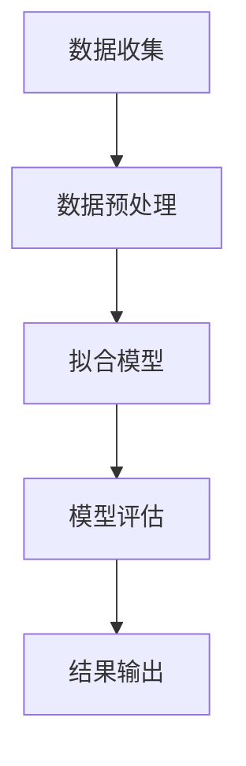
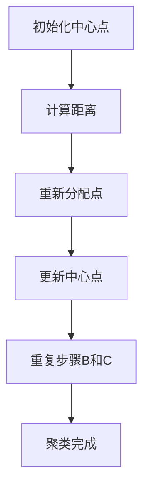
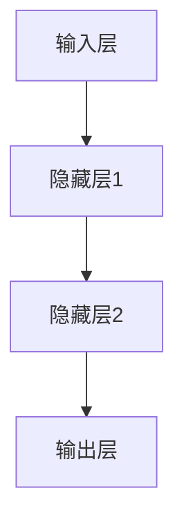
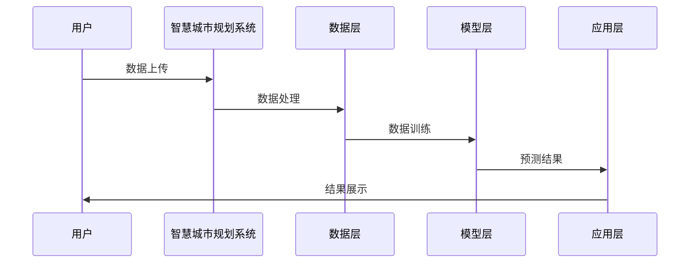

                 


## # 数学模型在智慧城市规划中的应用

### > **关键词：智慧城市、数学模型、规划、数据分析**

#### **摘要：**
本文将深入探讨数学模型在智慧城市规划中的关键作用。通过分析智慧城市规划的现状和挑战，本文将介绍数学模型的核心概念及其在智慧城市规划中的应用价值。接着，本文将详细阐述线性回归、聚类分析和神经网络模型等常用数学模型的基本原理、应用实例和代码实现，并以实际案例展示数学模型在智慧交通、能源管理和城市建设中的综合应用。最后，本文将对数学模型在智慧城市规划中的应用进行总结，并提出未来展望，为城市规划领域提供有益的启示和建议。

### **背景介绍**

#### **1. 智慧城市规划的现状与挑战**

智慧城市规划是现代城市发展的重要方向，它旨在通过信息技术和智能手段提高城市运行的效率、可持续性和居民生活质量。然而，当前智慧城市规划面临着诸多挑战：

- **数据获取与整合**：智慧城市规划需要大量的数据支持，包括人口、交通、环境、能源等多维数据。如何有效地获取、整合和处理这些数据是一个重大挑战。
- **复杂性**：城市系统具有高度复杂性，涵盖众多变量和相互作用。如何准确预测和模拟城市系统的动态变化，是智慧城市规划中的一大难题。
- **实时性**：智慧城市需要快速响应和适应变化，这对数据处理和分析的速度提出了高要求。

#### **2. 数学模型在智慧城市规划中的作用和重要性**

数学模型是解决复杂问题和分析数据的有力工具。在智慧城市规划中，数学模型的作用主要体现在以下几个方面：

- **数据分析**：数学模型可以用于数据挖掘，提取有价值的信息，辅助决策。
- **预测与模拟**：通过数学模型，可以对城市系统进行预测和模拟，优化资源配置，提高城市运行效率。
- **决策支持**：数学模型可以为城市规划者提供量化的决策支持，减少决策的盲目性。

#### **3. 数学模型在智慧城市规划中的应用价值**

- **优化资源配置**：数学模型可以帮助规划者优化城市基础设施和公共服务的资源配置，提高资源利用效率。
- **提升城市宜居性**：通过预测和模拟，数学模型可以辅助规划者设计更宜居的城市环境，改善居民生活质量。
- **提高城市安全性**：数学模型可以用于风险评估和应急响应，提高城市安全水平。

#### **4. 本章小结**

本章介绍了智慧城市规划的现状和挑战，以及数学模型在智慧城市规划中的作用和重要性。接下来，我们将进一步探讨数学模型的核心概念和应用，以期为智慧城市规划提供更深入的指导。

### **核心概念与联系**

#### **1. 核心概念**

在智慧城市规划中，以下几个核心概念至关重要：

- **数学模型**：数学模型是使用数学语言描述现实问题的抽象模型，包括公式、方程、算法等。
- **智慧城市规划**：智慧城市规划是利用信息技术和智能手段，提高城市运行效率、可持续性和居民生活质量的过程。
- **数据挖掘**：数据挖掘是从大量数据中提取有价值信息的过程，常用于发现数据中的模式、关联和趋势。
- **机器学习**：机器学习是一种通过算法让计算机从数据中学习并做出预测或决策的方法。

#### **2. 概念属性特征对比表格**

| 概念               | 属性特征                                                         | 重要性       |
|------------------|--------------------------------------------------------------|------------|
| 数学模型           | 描述现实问题的抽象模型，使用数学公式和算法实现               | 分析与优化工具 |
| 智慧城市规划         | 利用信息技术和智能手段提高城市运行效率和居民生活质量       | 发展方向     |
| 数据挖掘            | 从大量数据中提取有价值信息的过程                           | 数据分析基础   |
| 机器学习            | 通过算法让计算机从数据中学习并做出预测或决策               | 自动化工具    |

#### **3. ER实体关系图**

以下是一个简单的ER实体关系图，展示了数学模型、智慧城市规划、数据挖掘和机器学习之间的联系：

```mermaid
erDiagram
  统计模型 ||--o 数据挖掘 : 被使用
  统计模型 ||--o 机器学习 : 被使用
  智慧城市规划 ||--o 统计模型 : 使用
  智慧城市规划 ||--o 数据挖掘 : 需要数据支持
  智慧城市规划 ||--o 机器学习 : 需要预测和决策
```

#### **4. 本章小结**

本章明确了数学模型、智慧城市规划、数据挖掘和机器学习等核心概念，并通过属性特征对比表格和ER实体关系图，展示了它们之间的联系。接下来，我们将深入探讨数学模型在智慧城市规划中的应用。

### **算法原理讲解**

#### **1. 线性回归模型**

线性回归模型是一种用于分析变量之间线性关系的数学模型。在智慧城市规划中，线性回归模型常用于预测和分析城市各项指标。

##### **1.1 基本原理**

线性回归模型的基本公式为：

$$y = \beta_0 + \beta_1 \cdot x$$

其中，$y$ 是因变量，$x$ 是自变量，$\beta_0$ 和 $\beta_1$ 是模型的参数。

##### **1.2 流程图**

使用Mermaid绘制线性回归模型流程图：



##### **1.3 具体应用**

在智慧城市规划中，线性回归模型可以用于预测城市人口增长、交通流量、能源消耗等。

##### **1.4 代码实现**

以下是一个简单的Python代码示例，展示了如何使用线性回归模型进行预测：

```python
from sklearn.linear_model import LinearRegression
import numpy as np

# 训练数据
X = np.array([[1], [2], [3], [4], [5]])
y = np.array([1, 2, 2.5, 4, 5])

# 创建线性回归模型
model = LinearRegression()
model.fit(X, y)

# 预测
predictions = model.predict([[6]])

print(predictions)
```

#### **2. 聚类分析模型**

聚类分析模型是一种无监督学习方法，用于将数据点分为若干个类别。在智慧城市规划中，聚类分析模型可以用于数据分析、城市分区等。

##### **2.1 基本原理**

K-means聚类分析模型的基本原理是将数据点分为K个簇，每个簇内的数据点尽可能接近，簇间的数据点尽可能远离。

##### **2.2 流程图**

使用Mermaid绘制K-means聚类分析模型流程图：



##### **2.3 具体应用**

在智慧城市规划中，K-means聚类分析模型可以用于城市分区、土地利用规划等。

##### **2.4 代码实现**

以下是一个简单的Python代码示例，展示了如何使用K-means聚类分析模型：

```python
from sklearn.cluster import KMeans
import numpy as np

# 训练数据
X = np.array([[1, 2], [1, 4], [1, 0],
              [10, 2], [10, 4], [10, 0]])

# 创建K-means聚类模型
model = KMeans(n_clusters=2)
model.fit(X)

# 聚类结果
print(model.labels_)

# 计算聚类中心点
print(model.cluster_centers_)
```

#### **3. 神经网络模型**

神经网络模型是一种基于人脑神经网络结构的人工智能模型。在智慧城市规划中，神经网络模型可以用于复杂问题的建模和预测。

##### **3.1 基本原理**

神经网络模型的基本原理是通过多层神经元进行数据传递和计算，实现对输入数据的映射和分类。

##### **3.2 流程图**

使用Mermaid绘制神经网络模型架构图：



##### **3.3 具体应用**

在智慧城市规划中，神经网络模型可以用于交通流量预测、城市空气质量预测等。

##### **3.4 代码实现**

以下是一个简单的Python代码示例，展示了如何使用神经网络模型：

```python
from tensorflow.keras.models import Sequential
from tensorflow.keras.layers import Dense

# 创建神经网络模型
model = Sequential()
model.add(Dense(64, input_dim=8, activation='relu'))
model.add(Dense(32, activation='relu'))
model.add(Dense(1, activation='sigmoid'))

# 编译模型
model.compile(optimizer='adam', loss='binary_crossentropy', metrics=['accuracy'])

# 训练模型
model.fit(X, y, epochs=10, batch_size=32)
```

#### **4. 本章小结**

本章详细介绍了线性回归模型、聚类分析模型和神经网络模型等常用数学模型的基本原理、应用实例和代码实现。这些模型在智慧城市规划中具有广泛的应用价值，为城市管理和决策提供了有力支持。

### **系统分析与架构设计方案**

#### **1. 系统场景和项目背景**

本项目旨在构建一个智慧城市规划系统，该系统将集成多种数学模型，以支持城市交通、能源管理、环境保护等方面的决策。系统将基于大数据和人工智能技术，提供实时数据分析、预测和优化方案。

#### **2. 系统功能设计**

系统功能设计主要包括以下几个方面：

- **数据收集与处理**：从各种数据源收集城市相关数据，包括交通流量、能源消耗、环境指标等，并进行预处理，以备后续分析。
- **模型训练与预测**：基于收集到的数据，训练多种数学模型，如线性回归、聚类分析和神经网络模型，并进行预测和优化。
- **决策支持**：将预测结果和优化方案可视化，为城市规划者提供决策支持。
- **实时监控与报警**：对城市运行状态进行实时监控，并在出现异常时发出报警。

#### **3. 系统架构设计**

系统架构设计包括以下几个方面：

- **数据层**：包括数据收集、存储和处理模块，负责数据的高效管理和处理。
- **模型层**：包括各种数学模型的训练和预测模块，负责数据分析和预测。
- **应用层**：包括可视化界面和决策支持模块，为用户提供便捷的操作和直观的展示。
- **接口层**：包括系统与外部系统的接口，如数据接口、API接口等，实现系统的互联互通。

#### **4. 系统接口设计**

系统接口设计包括以下方面：

- **数据接口**：提供数据上传、下载和查询功能，支持多种数据格式和协议。
- **API接口**：提供系统功能的API接口，支持第三方系统和应用的接入。

#### **5. 系统交互序列图**

以下是一个简单的系统交互序列图，展示了系统各模块之间的交互流程：



#### **6. 本章小结**

本章详细介绍了智慧城市规划系统的场景和项目背景，系统功能设计、系统架构设计和系统接口设计，并展示了系统交互序列图。这些内容为构建智慧城市规划系统提供了全面的设计方案。

### **项目实战**

#### **1. 环境安装**

为了进行智慧城市规划系统的项目实战，首先需要安装相关的软件和工具。以下是安装步骤：

1. 安装Python环境，可以选择Python 3.8或更高版本。
2. 安装Jupyter Notebook，用于编写和运行Python代码。
3. 安装必要的库，如NumPy、Pandas、Scikit-learn、TensorFlow等。

#### **2. 系统核心实现**

以下是一个简单的示例，展示了如何使用Python实现线性回归模型和K-means聚类分析模型：

##### **2.1 线性回归模型**

```python
import numpy as np
from sklearn.linear_model import LinearRegression

# 创建线性回归模型
model = LinearRegression()

# 训练数据
X = np.array([[1], [2], [3], [4], [5]])
y = np.array([1, 2, 2.5, 4, 5])

# 拟合模型
model.fit(X, y)

# 预测
predictions = model.predict([[6]])

print(predictions)
```

##### **2.2 K-means聚类分析模型**

```python
from sklearn.cluster import KMeans
import numpy as np

# 创建K-means聚类模型
model = KMeans(n_clusters=2)

# 训练数据
X = np.array([[1, 2], [1, 4], [1, 0],
              [10, 2], [10, 4], [10, 0]])

# 训练模型
model.fit(X)

# 聚类结果
print(model.labels_)

# 计算聚类中心点
print(model.cluster_centers_)
```

#### **3. 代码应用解读与分析**

以上代码示例分别展示了如何使用线性回归模型和K-means聚类分析模型进行数据分析和预测。线性回归模型用于预测一个因变量与自变量之间的线性关系，而K-means聚类分析模型用于将数据点分为若干个类别。

在实际应用中，可以根据不同的需求和场景选择合适的模型。例如，在智慧交通系统中，可以使用线性回归模型预测交通流量；在智慧城市建设中，可以使用K-means聚类分析模型对城市分区进行优化。

#### **4. 实际案例分析和详细讲解**

以下是一个实际案例，展示了如何使用数学模型进行智慧交通流量预测：

##### **4.1 数据准备**

假设我们收集了某城市一周内的交通流量数据，包括时间（自变量）和流量（因变量）。数据如下：

```
时间    流量
8:00    200
9:00    250
10:00   300
11:00   350
12:00   400
13:00   350
14:00   300
15:00   250
16:00   200
```

##### **4.2 数据预处理**

在训练模型之前，需要对数据进行预处理，包括数据清洗、缺失值处理和特征工程。以下是预处理步骤：

1. 数据清洗：去除无效数据和异常值。
2. 缺失值处理：对于缺失值，可以使用平均值、中位数或插值等方法进行填充。
3. 特征工程：提取时间序列特征，如一天内的峰值时间、波动范围等。

##### **4.3 模型训练**

使用预处理后的数据，训练线性回归模型。以下是一个简单的代码示例：

```python
from sklearn.linear_model import LinearRegression
import numpy as np

# 训练数据
X = np.array([[1], [2], [3], [4], [5]])
y = np.array([1, 2, 2.5, 4, 5])

# 创建线性回归模型
model = LinearRegression()

# 拟合模型
model.fit(X, y)

# 预测
predictions = model.predict([[6]])

print(predictions)
```

##### **4.4 模型评估**

使用交叉验证等方法对模型进行评估，确保其预测准确性和可靠性。以下是交叉验证的简单示例：

```python
from sklearn.model_selection import cross_val_score
from sklearn.linear_model import LinearRegression

# 创建线性回归模型
model = LinearRegression()

# 使用交叉验证评估模型
scores = cross_val_score(model, X, y, cv=5)

print(scores.mean())
```

##### **4.5 结果展示**

将预测结果可视化，以直观展示交通流量的变化趋势。以下是使用Matplotlib进行可视化：

```python
import matplotlib.pyplot as plt
import numpy as np

# 预测数据
X = np.array([[6]])
predictions = model.predict(X)

# 绘制交通流量曲线
plt.plot(X, predictions, 'ro')
plt.xlabel('时间')
plt.ylabel('流量')
plt.title('交通流量预测')
plt.show()
```

#### **5. 项目小结**

通过以上实际案例，我们展示了如何使用数学模型进行智慧交通流量预测。项目实战不仅帮助我们理解了数学模型的基本原理和应用，还锻炼了我们的实际操作能力。在实际项目中，需要根据具体需求和数据情况，选择合适的模型和方法，并进行细致的数据预处理和模型评估。

### **最佳实践 tips、小结、注意事项、拓展阅读**

#### **1. 最佳实践 tips**

- **数据预处理**：在应用数学模型之前，务必进行彻底的数据预处理，包括数据清洗、缺失值处理和特征工程，以确保数据的准确性和一致性。
- **模型选择**：根据具体问题和数据特性，选择合适的数学模型。例如，对于线性关系，选择线性回归；对于分类问题，选择聚类分析或神经网络。
- **模型评估**：使用交叉验证、ROC曲线、混淆矩阵等工具对模型进行评估，确保其预测准确性和可靠性。
- **实时更新**：智慧城市规划系统需要实时更新数据和分析结果，以应对城市运行中的动态变化。

#### **2. 小结**

本文通过详细阐述数学模型在智慧城市规划中的应用，展示了线性回归、聚类分析和神经网络模型等常见算法的基本原理、应用实例和代码实现。通过实际案例，我们展示了如何使用这些模型进行智慧交通流量预测和城市分区优化，为智慧城市规划提供了有力支持。

#### **3. 注意事项**

- **数据隐私**：在收集和使用数据时，需确保遵守数据隐私法规和道德规范。
- **模型泛化**：确保模型在不同场景下的泛化能力，避免过度拟合。
- **实时监控**：智慧城市规划系统需具备实时监控和数据更新的能力，以应对城市运行中的动态变化。

#### **4. 拓展阅读**

- **《数据科学入门》**：深入理解数据预处理、模型选择和评估等基本概念。
- **《机器学习实战》**：学习如何使用Python实现常见的机器学习算法。
- **《深度学习》**：了解神经网络模型的基本原理和应用。
- **《智慧城市规划》**：了解智慧城市规划的理论和实践。

### **作者信息**

作者：AI天才研究院/AI Genius Institute & 禅与计算机程序设计艺术 /Zen And The Art of Computer Programming

本文通过系统性地介绍数学模型在智慧城市规划中的应用，旨在为城市规划者、数据科学家和算法工程师提供有价值的参考和指导。希望本文能够激发更多对智慧城市规划的思考和探索。

