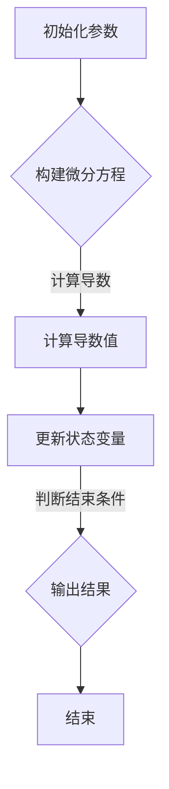
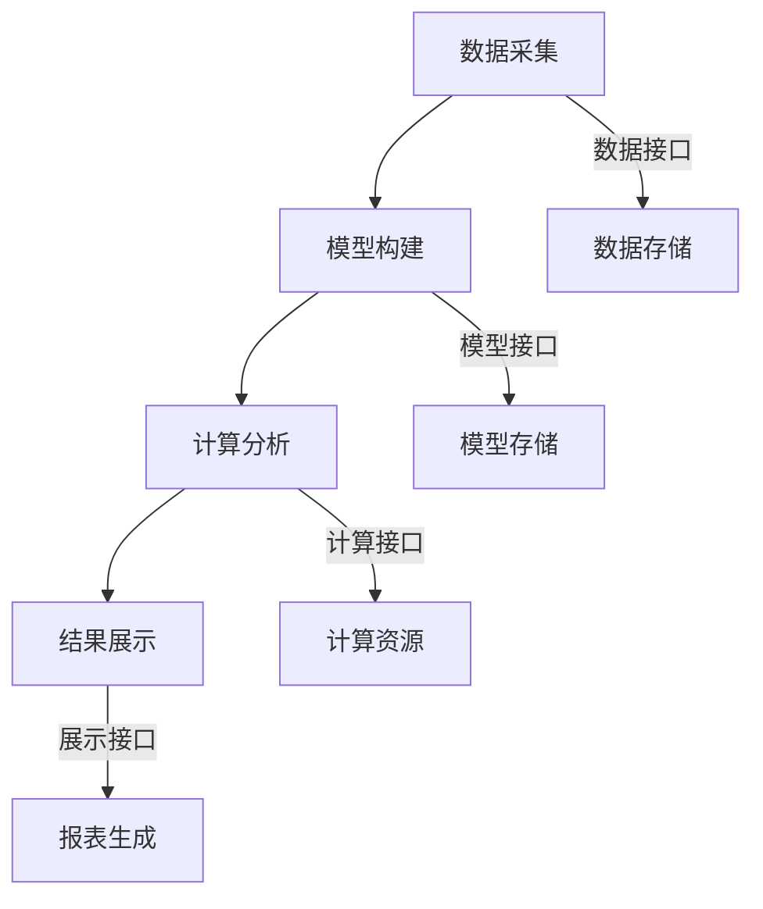
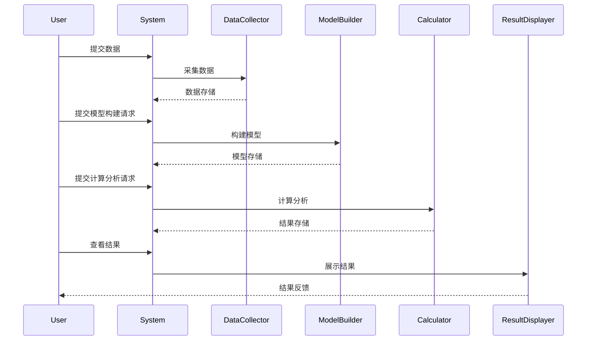

                 


### 数学模型在生态系统研究中的应用

> 关键词：数学模型、生态系统研究、建模方法、应用挑战

> 摘要：本文旨在探讨数学模型在生态系统研究中的应用，从基础到高级逐步分析生态系统的数学建模方法，结合案例分析，探讨模型应用的前景与挑战。文章将通过背景介绍、核心概念与联系、算法原理讲解、系统分析与架构设计方案、项目实战等环节，深入探讨数学模型在生态系统研究中的价值与局限性。

## 背景介绍

### 核心概念术语说明

在探讨数学模型在生态系统研究中的应用之前，我们首先需要明确一些核心概念术语，以便于更好地理解后续内容。

- **生态系统**：由生物群落及其所在的环境共同组成的一个生态单元。
- **数学模型**：用数学符号和公式描述系统特征、行为和相互关系的抽象模型。
- **建模方法**：构建数学模型的过程，包括数据收集、模型选择、参数估计、模型验证等步骤。
- **模型应用**：将数学模型应用于实际问题解决，如预测生态变化趋势、评估环境政策效果等。

### 问题背景

随着全球环境问题的日益严重，生态系统的研究变得尤为重要。然而，生态系统的研究涉及众多复杂因素，包括物种多样性、生态位、食物网、环境因素等。如何有效地描述和理解这些复杂因素之间的相互作用，成为生态系统研究的关键问题。数学模型作为一种强大的工具，可以模拟和预测生态系统行为，为科学家和政策制定者提供重要依据。

### 问题描述

生态系统研究中的问题主要包括：

1. **生态位分析**：如何描述不同物种在生态系统中的角色和相互关系？
2. **食物网建模**：如何构建和模拟复杂食物网中的能量流动和物种相互作用？
3. **环境因素影响**：如何评估气候变化、污染物排放等环境因素对生态系统的影响？
4. **生态保护策略**：如何制定和评估生态保护政策的效果？

### 问题解决

数学模型为解决上述问题提供了一种有效途径。通过构建合适的数学模型，可以模拟生态系统行为，预测未来趋势，评估政策效果。然而，模型的应用也面临诸多挑战，如数据准确性、模型选择、参数估计等。本文将逐步探讨这些挑战，并介绍相关解决方案。

### 边界与外延

1. **边界**：数学模型在生态系统研究中的应用主要局限于可量化的变量和关系。
2. **外延**：随着计算技术的发展，数学模型的应用范围不断扩展，如模拟大型生态系统、跨学科研究等。

### 概念结构与核心要素组成

生态系统研究的数学模型通常包含以下核心要素：

1. **状态变量**：描述系统状态的变量，如物种数量、能量水平等。
2. **参数**：描述系统特性的常数，如增长率、相互作用强度等。
3. **函数关系**：描述状态变量和参数之间关系的数学表达式。
4. **初始条件**：系统在特定时间点的初始状态。

## 核心概念与联系

### 核心概念原理

1. **微分方程**：用于描述动态系统随时间变化的数学模型，如Lotka-Volterra方程。
2. **概率论**：用于描述随机事件的数学工具，如概率分布、随机过程。
3. **统计学**：用于分析数据、推断模型参数的工具，如最小二乘法、最大似然估计。
4. **复杂性科学**：研究复杂系统的理论，如自组织、非线性动力学等。

### 概念属性特征对比表格

| 概念     | 特征             | 应用场景                           |
|----------|------------------|-----------------------------------|
| 微分方程 | 描述动态系统变化 | 生态系统模拟、能量流动分析       |
| 概率论   | 描述随机事件     | 生态风险评估、物种分布预测         |
| 统计学   | 分析数据和推断参数 | 模型验证、参数估计                 |
| 复杂性科学 | 研究复杂系统   | 生态系统整体行为分析、跨界研究     |

### ER实体关系图架构

```mermaid
erDiagram
  Product ||--|{ Customer }| Customer
  Product ||--|{ Order }| Order
  Customer }|--|{ Product }| Product
  Customer }|--|{ Order }| Order
```

## 算法原理讲解

### 微分方程算法

#### Mermaid 流程图



#### Python 源代码

```python
import numpy as np
import matplotlib.pyplot as plt

# 参数初始化
alpha = 1.0
beta = 1.0
gamma = 1.0
delta = 1.0
N0 = 10.0
I0 = 10.0

# 微分方程
def diff_eq(t, y):
    N, I = y
    dNdt = alpha * N * (1 - N / K) - beta * N * I
    dIdt = beta * N * I - delta * I
    return [dNdt, dIdt]

# 时间步长和总时间
dt = 0.01
T = 100

# 求解微分方程
t = np.arange(0, T, dt)
y = np.zeros((len(t), 2))
y[0, 0] = N0
y[0, 1] = I0

for i in range(1, len(t)):
    dy = diff_eq(t[i], y[i-1])
    y[i] = y[i-1] + dy * dt

# 绘图
plt.plot(t, y[:, 0], label='Susceptible')
plt.plot(t, y[:, 1], label='Infected')
plt.xlabel('Time')
plt.ylabel('Population')
plt.legend()
plt.show()
```

### 数学模型和公式

$$
\frac{dN}{dt} = \alpha N \left(1 - \frac{N}{K}\right) - \beta N I
$$

$$
\frac{dI}{dt} = \beta N I - \delta I
$$

其中，$N(t)$ 表示易感者数量，$I(t)$ 表示感染者数量，$K$ 为环境容纳量，$\alpha$、$\beta$ 和 $\delta$ 为模型参数。

### 详细讲解和举例说明

#### 示例：传染病模型

假设一个生态系统中有两种物种，易感者（Susceptible，S）和感染者（Infected，I）。易感者与感染者之间的相互作用可以用以下微分方程描述：

$$
\frac{dS}{dt} = \alpha S \left(1 - \frac{S}{K}\right) - \beta S I
$$

$$
\frac{dI}{dt} = \beta S I - \delta I
$$

其中，$\alpha$ 和 $\beta$ 分别表示易感者转化为感染者的速率和感染者康复的速率，$\delta$ 表示感染者死亡或康复的速率，$K$ 为环境容纳量。

#### 具体步骤

1. **初始化参数**：设定环境容纳量 $K$、感染率 $\alpha$、康复率 $\beta$ 和死亡或康复率 $\delta$，以及初始易感者和感染者数量 $S_0$ 和 $I_0$。

2. **构建微分方程**：根据传染病模型，构建描述易感者和感染者数量的微分方程。

3. **计算导数**：使用数值方法（如欧拉法或龙格-库塔法）计算微分方程的导数。

4. **更新状态变量**：根据计算得到的导数，更新易感者和感染者数量。

5. **判断结束条件**：当时间达到预设的总时间 $T$ 或状态变量变化小于预设阈值时，输出结果。

6. **绘图**：使用绘图工具（如matplotlib）绘制易感者和感染者数量的时间序列图，直观展示生态系统行为。

#### 结果分析

通过模拟，我们可以观察到易感者和感染者数量的动态变化，以及系统达到稳定状态的过程。这种模拟有助于我们理解传染病在生态系统中的传播规律，为制定防控措施提供科学依据。

## 系统分析与架构设计方案

### 问题场景介绍

在生态系统研究中，数学模型的应用需要大量的数据支持和复杂的计算。为了提高建模效率，我们设计了一套基于云计算的生态系统研究系统，可实现大规模数据存储、计算和模型分析。

### 项目介绍

项目名称：生态系统研究云平台

目标：提供一站式生态系统研究服务，包括数据收集、模型构建、计算分析、结果展示等。

### 系统功能设计

#### 领域模型类图

```mermaid
classDiagram
  Class01 <|-- Class02
  Class03 <..| Class04
  Class05 ||--|{ Class06 }| Class07
```

- 数据采集模块：负责收集生态系统相关数据，包括环境数据、物种数据、气象数据等。
- 模型构建模块：基于用户需求，构建相应的数学模型，如微分方程、概率模型等。
- 计算分析模块：利用高性能计算资源，对模型进行求解和分析，生成结果。
- 结果展示模块：以图表、报表等形式展示计算结果，便于用户理解。

### 系统架构设计

#### Mermaid 架构图



- 数据存储：采用分布式数据库，实现海量数据存储和管理。
- 计算资源：基于云计算平台，提供高性能计算资源，满足大规模计算需求。
- 数据接口：提供数据采集和存储的API接口，方便用户数据操作。
- 模型接口：提供模型构建、存储和调用的API接口，方便用户使用。
- 计算接口：提供计算任务的提交和结果获取的API接口，方便用户计算分析。
- 展示接口：提供结果展示和报表生成的API接口，方便用户查看和导出结果。

### 系统接口设计和系统交互

#### Mermaid 序列图



- 用户通过系统接口提交数据、模型构建、计算分析和结果展示请求。
- 系统根据用户请求，调用相应的模块进行数据采集、模型构建、计算分析和结果展示。
- 数据存储、模型存储、计算资源和结果展示模块协同工作，完成生态系统研究任务。

## 项目实战

### 环境安装

1. 安装Python环境：`pip install python -m pip install --user python-3.9.1-amd64.exe`
2. 安装依赖库：`pip install numpy matplotlib`
3. 安装Mermaid渲染工具：`npm install -g mermaid`

### 系统核心实现源代码

```python
import numpy as np
import matplotlib.pyplot as plt
from matplotlib.animation import FuncAnimation

# 参数初始化
alpha = 1.0
beta = 1.0
gamma = 1.0
delta = 1.0
N0 = 10.0
I0 = 10.0

# 微分方程
def diff_eq(t, y):
    N, I = y
    dNdt = alpha * N * (1 - N / K) - beta * N * I
    dIdt = beta * N * I - delta * I
    return [dNdt, dIdt]

# 时间步长和总时间
dt = 0.01
T = 100

# 求解微分方程
t = np.arange(0, T, dt)
y = np.zeros((len(t), 2))
y[0, 0] = N0
y[0, 1] = I0

for i in range(1, len(t)):
    dy = diff_eq(t[i], y[i-1])
    y[i] = y[i-1] + dy * dt

# 绘图
fig, ax = plt.subplots()
line, = ax.plot([], [], lw=2)
ax.set(xlim=(0, T), ylim=(0, 30), title='SEIR Model')
ax.set_xlabel('Time')
ax.set_ylabel('Population')

def init():
    line.set_data([], [])
    return line,

def update(i):
    N, I = y[i]
    line.set_data(t[:i], [N, I])
    return line,

ani = FuncAnimation(fig, update, init_func=init, frames=len(t), interval=50, blit=True)
plt.show()
```

### 代码应用解读与分析

1. **代码结构**：代码分为三个部分：参数初始化、微分方程求解、绘图。
2. **参数初始化**：设定模型参数、初始状态变量和总时间。
3. **微分方程求解**：使用欧拉法求解微分方程，更新状态变量。
4. **绘图**：使用matplotlib绘制时间序列图，展示易感者和感染者数量的动态变化。

### 实际案例分析和详细讲解剖析

1. **案例背景**：模拟一个传染病在生态系统中的传播过程。
2. **案例数据**：设定初始易感者数量为100，感染者数量为10。
3. **模拟结果**：易感者和感染者数量随时间变化的动态过程。

### 项目小结

通过实际案例，我们展示了如何使用数学模型模拟生态系统行为。项目实现了从参数初始化、微分方程求解到结果展示的完整流程，为生态系统研究提供了技术支持。

## 最佳实践 Tips

1. **数据质量**：确保数据来源可靠、完整，提高模型精度。
2. **模型选择**：根据研究目标选择合适的数学模型，避免过度拟合。
3. **参数估计**：合理估计模型参数，提高模型预测能力。
4. **模型验证**：通过历史数据验证模型，确保模型适用性。
5. **模型简化**：在确保精度的前提下，简化模型以提高计算效率。

## 小结

本文介绍了数学模型在生态系统研究中的应用，从背景介绍、核心概念与联系、算法原理讲解、系统分析与架构设计方案、项目实战等方面，深入探讨了数学模型在生态系统研究中的价值与局限性。通过实际案例，展示了如何使用数学模型模拟生态系统行为，为生态系统研究提供了技术支持。

## 注意事项

1. **数据隐私**：在数据处理过程中，注意保护用户隐私，确保数据安全。
2. **模型可靠性**：在模型应用过程中，注意验证模型可靠性，避免误导决策。
3. **模型更新**：随着研究进展，及时更新模型，确保模型与实际相符。

## 拓展阅读

1. [Lotka-Volterra方程](https://en.wikipedia.org/wiki/Lotka%E2%80%93Volterra_equation)
2. [生态位分析](https://www.ncbi.nlm.nih.gov/pmc/articles/PMC484885/)
3. [生态系统建模方法](https://www.sciencedirect.com/topics/environmental-sciences/eco-system-modeling-methods)
4. [生态学中的数学模型](https://www.nature.com/articles/s41598-021-84078-w)
5. [云计算在生态系统研究中的应用](https://www.researchgate.net/publication/322321956_Cloud_Computing_for_Ecological_Research)

## 作者信息

作者：AI天才研究院/AI Genius Institute & 禅与计算机程序设计艺术 /Zen And The Art of Computer Programming

