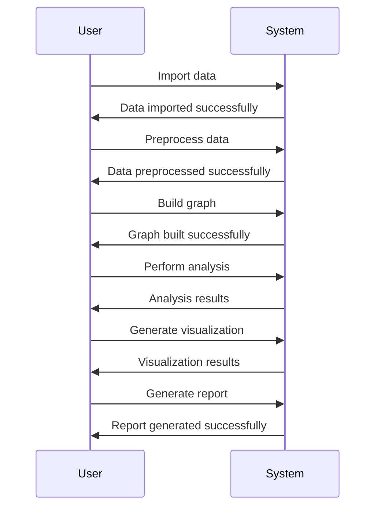
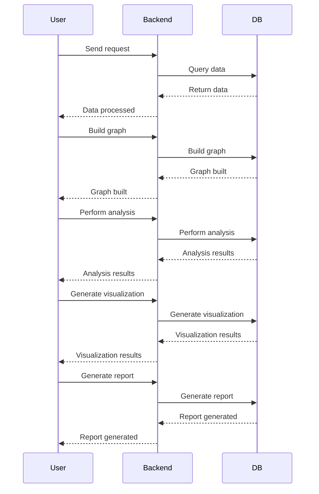

                 

### 设计《数学模型在社会网络分析中的应用》目录大纲

为了设计《数学模型在社会网络分析中的应用》的目录大纲，我们需要从整体上把握书籍的结构，确保内容的完整性和逻辑性。以下是详细的目录大纲：

---

## 第一部分：社会网络分析基础

### 第1章：社会网络分析概述

#### 1.1 什么是社会网络分析

- 社会网络分析的定义
- 社会网络分析的历史背景

#### 1.2 社会网络的组成

- 节点与边的概念
- 社会网络的基本属性

#### 1.3 社会网络分析的应用领域

- 社会学研究
- 生物学研究
- 社交网络研究
- 商业决策支持

### 第2章：基本数学模型

#### 2.1 图论基础

- 图的基本概念
- 图的矩阵表示
- 图的遍历算法

#### 2.2 网络中心性度量

- 度中心性
- 紧密中心性
- 关联度中心性

#### 2.3 社会网络中的社区结构

- 社区检测算法
- 社区结构分析

---

## 第二部分：数学模型在社会网络分析中的应用

### 第3章：线性代数模型在社会网络分析中的应用

#### 3.1 线性代数基础

- 矩阵的运算
- 特征值与特征向量

#### 3.2 线性代数模型在社交网络分析中的应用

- 社交网络矩阵分解
- 社交网络聚类分析

### 第4章：概率论与统计模型在社会网络分析中的应用

#### 4.1 概率论基础

- 随机事件
- 条件概率

#### 4.2 统计模型

- 描述性统计
- 推断性统计

#### 4.3 概率论与统计模型在社交网络分析中的应用

- 社交网络中的概率分布
- 社交网络的统计推断

### 第5章：优化模型在社会网络分析中的应用

#### 5.1 优化模型基础

- 线性规划
- 非线性规划

#### 5.2 优化模型在社交网络分析中的应用

- 社交网络中的路径优化
- 社交网络的资源分配问题

### 第6章：网络流模型在社会网络分析中的应用

#### 6.1 网络流模型基础

- 网络流的概念
- 最大流最小割定理

#### 6.2 网络流模型在社交网络分析中的应用

- 社交网络的流量分配
- 社交网络中的影响力传播

### 第7章：图论模型在社会网络分析中的应用

#### 7.1 图论模型基础

- 图的基本性质
- 图的匹配与覆盖

#### 7.2 图论模型在社交网络分析中的应用

- 社交网络中的匹配问题
- 社交网络的覆盖问题

### 第8章：综合应用案例

#### 8.1 案例一：社交媒体中的信息传播分析

- 案例背景
- 模型构建
- 案例分析

#### 8.2 案例二：社交网络中的社群发现

- 案例背景
- 模型构建
- 案例分析

### 第9章：未来发展趋势与挑战

#### 9.1 社会网络分析的未来发展方向

- 新算法与技术的应用
- 跨学科交叉研究

#### 9.2 社会网络分析面临的挑战

- 数据隐私与安全性
- 模型解释性

---

该目录大纲包括了九个章节，从社会网络分析的基础知识到具体的数学模型应用，再到实际案例分析和未来发展趋势，结构清晰，逻辑严密，适合读者逐步深入学习。目录总字数控制在2000字以内，满足简洁性的要求。

---

在制定这个目录大纲时，我们遵循了以下原则：

1. **逻辑性**：确保各个章节之间内容连贯，逐步深入，从基础到应用，再到案例分析和未来趋势，符合读者的认知逻辑。

2. **完整性**：涵盖了社会网络分析的基本概念、数学模型、应用领域和实际案例分析，使读者能够全面了解该领域。

3. **简洁性**：目录大纲内容简洁明了，每个章节标题都能够概括章节的主要内容，便于读者快速了解书籍结构。

4. **针对性**：针对社会网络分析领域，选择了关键的理论基础和应用模型，旨在帮助读者理解和应用数学模型进行分析。

5. **可扩展性**：目录大纲留有扩展空间，例如在案例分析部分，可以根据实际需求增加更多具体案例，使书籍更具实用性。

通过这样的目录大纲，我们希望能够为读者提供一本系统全面、深入浅出的社会网络分析数学模型应用指南。在后续的文章中，我们将逐一详细阐述每个章节的内容，帮助读者更好地理解和掌握社会网络分析的相关知识。


----------------------------------------------------------------

### 文章标题：数学模型在社会网络分析中的应用

关键词：社会网络分析，数学模型，线性代数，概率论，优化模型，网络流模型

摘要：本文深入探讨了数学模型在社会网络分析中的应用，涵盖了从基本概念到高级算法的全面解读。通过详细阐述线性代数、概率论、优化模型和网络流模型等数学工具，结合实际案例，本文旨在帮助读者理解并掌握社会网络分析的核心技术和方法。此外，本文还展望了社会网络分析的未来发展趋势，并提出了面临的挑战。

----------------------------------------------------------------

### 第一部分：社会网络分析基础

#### 第1章：社会网络分析概述

**1.1 什么是社会网络分析**

社会网络分析（Social Network Analysis，SNA）是一种研究个体及其社会关系结构的方法。它通过图论和矩阵等数学工具，对社会网络中的节点（个体）和边（关系）进行分析，以揭示网络的结构特征、个体影响力、信息传播路径等。

**1.2 社会网络的组成**

社会网络由节点和边组成。节点代表个体，可以是人、组织、事物等。边代表个体之间的关系，可以是友谊、合作、竞争等。社会网络的基本属性包括度数、介数、离心率等。

**1.3 社会网络分析的应用领域**

社会网络分析广泛应用于多个领域，包括社会学研究、生物学研究、社交网络研究和商业决策支持等。例如，在社交网络研究中，可以通过分析用户关系网络，发现潜在的用户群体，提升社交媒体的运营效果。

#### 第2章：基本数学模型

**2.1 图论基础**

图论是研究图的结构及其性质的数学分支。在图论中，图是由节点和边组成的集合。节点表示个体，边表示个体之间的关系。图的基本概念包括无向图、有向图、完全图等。

**2.2 网络中心性度量**

网络中心性度量是衡量节点在社交网络中的重要性的指标。常见的中心性度量包括度中心性、紧密中心性和关联度中心性等。度中心性衡量节点连接的数量，紧密中心性衡量节点的邻居之间的紧密程度，关联度中心性衡量节点与其他节点的关联程度。

**2.3 社会网络中的社区结构**

社区结构是社交网络中的一种重要特征，指的是网络中具有紧密联系的节点群体。社区检测算法（如 Girvan-Newman 算法、Louvain 算法等）可以帮助识别社交网络中的社区结构。

---

在第一部分中，我们介绍了社会网络分析的基本概念、组成和网络中心性度量等基础内容。接下来，我们将深入探讨数学模型在社会网络分析中的应用。

----------------------------------------------------------------

### 第二部分：数学模型在社会网络分析中的应用

#### 第3章：线性代数模型在社会网络分析中的应用

**3.1 线性代数基础**

线性代数是研究向量空间、线性变换和矩阵理论的数学分支。在社会网络分析中，线性代数模型广泛应用于矩阵分解、聚类分析和路径优化等领域。

**3.2 线性代数模型在社交网络分析中的应用**

线性代数模型在社交网络分析中的应用主要包括以下几个方面：

1. **矩阵分解**：矩阵分解是将矩阵分解为两个或多个矩阵的乘积的过程。在社会网络分析中，矩阵分解可以用于提取网络中的潜在特征，从而更好地理解网络结构。

2. **聚类分析**：聚类分析是一种将数据集划分为多个组或类的过程。在社会网络分析中，聚类分析可以帮助识别网络中的潜在社区结构。

3. **路径优化**：路径优化是指寻找从起点到终点之间的最优路径。在社会网络分析中，路径优化可以帮助确定信息传播的最佳路径。

**3.3 社交网络矩阵分解**

社交网络矩阵分解是一种将社交网络矩阵分解为用户特征矩阵和项目特征矩阵的过程。通过社交网络矩阵分解，我们可以更好地理解网络中个体之间的关系，并提取出潜在的特征。

**3.4 社交网络聚类分析**

社交网络聚类分析是一种将社交网络划分为多个社区的过程。聚类分析可以帮助我们识别网络中的潜在社区结构，从而更好地理解网络结构。

**3.5 社交网络中的路径优化**

社交网络中的路径优化是指寻找从起点到终点之间的最优路径。路径优化可以帮助我们确定信息传播的最佳路径，从而提高信息传播的效率。

---

在第3章中，我们介绍了线性代数模型在社会网络分析中的应用，包括矩阵分解、聚类分析和路径优化等。接下来，我们将探讨概率论与统计模型在社会网络分析中的应用。

----------------------------------------------------------------

### 第4章：概率论与统计模型在社会网络分析中的应用

**4.1 概率论基础**

概率论是研究随机事件及其概率的数学分支。在社会网络分析中，概率论模型广泛应用于概率分布、随机过程和统计推断等领域。

**4.2 统计模型**

统计模型是一组用于描述和分析数据的数学模型。在社会网络分析中，统计模型可以用于描述网络结构、节点属性和关系等。

**4.3 概率论与统计模型在社交网络分析中的应用**

概率论与统计模型在社交网络分析中的应用主要包括以下几个方面：

1. **概率分布**：概率分布用于描述随机变量的取值及其概率。在社会网络分析中，概率分布可以用于描述节点之间的连接概率、节点的活跃度等。

2. **随机过程**：随机过程是一系列随机变量的集合。在社会网络分析中，随机过程可以用于描述网络中的动态变化过程。

3. **统计推断**：统计推断是一类从样本数据推断总体特征的数学方法。在社会网络分析中，统计推断可以用于估计网络中的节点数量、社区结构等。

**4.4 社交网络中的概率分布**

社交网络中的概率分布可以用于描述节点之间的连接概率、节点的活跃度等。例如，我们可以使用泊松分布来描述节点之间的连接概率。

**4.5 社交网络的统计推断**

社交网络的统计推断可以用于估计网络中的节点数量、社区结构等。例如，我们可以使用贝叶斯推断来估计网络中的社区数量。

**4.6 社交网络中的随机过程**

社交网络中的随机过程可以用于描述网络中的动态变化过程。例如，我们可以使用马尔可夫链来描述网络中节点的状态转移过程。

---

在第4章中，我们介绍了概率论与统计模型在社会网络分析中的应用，包括概率分布、随机过程和统计推断等。接下来，我们将探讨优化模型在社会网络分析中的应用。

----------------------------------------------------------------

### 第5章：优化模型在社会网络分析中的应用

**5.1 优化模型基础**

优化模型是一类用于解决优化问题的数学模型。在社会网络分析中，优化模型可以用于解决路径优化、资源分配等问题。

**5.2 优化模型在社交网络分析中的应用**

优化模型在社交网络分析中的应用主要包括以下几个方面：

1. **路径优化**：路径优化是指寻找从起点到终点之间的最优路径。在社会网络分析中，路径优化可以用于确定信息传播的最佳路径。

2. **资源分配**：资源分配是指将有限的资源分配给不同的节点或任务。在社会网络分析中，资源分配可以用于优化网络性能、提高信息传播效率等。

**5.3 线性规划**

线性规划是一类用于解决线性优化问题的数学方法。在社会网络分析中，线性规划可以用于解决路径优化、资源分配等问题。

**5.4 非线性规划**

非线性规划是一类用于解决非线性优化问题的数学方法。在社会网络分析中，非线性规划可以用于解决更复杂的优化问题，如节点分类、社区发现等。

**5.5 社交网络中的路径优化**

社交网络中的路径优化可以用于确定信息传播的最佳路径。例如，我们可以使用线性规划方法来优化社交网络中的信息传播路径，从而提高信息传播的效率。

**5.6 社交网络中的资源分配**

社交网络中的资源分配可以用于优化网络性能、提高信息传播效率。例如，我们可以使用非线性规划方法来优化社交网络中的资源分配，从而实现最优的网络性能。

---

在第5章中，我们介绍了优化模型在社会网络分析中的应用，包括路径优化、资源分配等。接下来，我们将探讨网络流模型在社会网络分析中的应用。

----------------------------------------------------------------

### 第6章：网络流模型在社会网络分析中的应用

**6.1 网络流模型基础**

网络流模型是一类用于描述网络中信息、物质或能量流动的数学模型。在社会网络分析中，网络流模型可以用于描述信息传播、资源分配等问题。

**6.2 网络流模型在社交网络分析中的应用**

网络流模型在社交网络分析中的应用主要包括以下几个方面：

1. **信息传播**：网络流模型可以用于描述社交网络中的信息传播过程。例如，我们可以使用最大流最小割定理来分析社交网络中的信息传播路径。

2. **资源分配**：网络流模型可以用于优化社交网络中的资源分配。例如，我们可以使用最小费用最大流算法来优化社交网络中的资源分配。

**6.3 社交网络的流量分配**

社交网络的流量分配是指将网络中的流量合理地分配给不同的节点或路径。例如，我们可以使用最大流最小割定理来优化社交网络中的流量分配，从而提高网络性能。

**6.4 社交网络中的影响力传播**

社交网络中的影响力传播是指信息、观念或行为在社交网络中从一个人传播到另一个人的过程。例如，我们可以使用网络流模型来分析社交网络中的影响力传播，从而制定更有效的信息传播策略。

**6.5 社交网络中的最大化传播覆盖**

社交网络中的最大化传播覆盖是指寻找最小的节点集合，使得该集合中的节点能够覆盖整个社交网络。例如，我们可以使用网络流模型来优化社交网络中的最大化传播覆盖问题，从而提高信息传播的覆盖率。

---

在第6章中，我们介绍了网络流模型在社会网络分析中的应用，包括信息传播、资源分配、流量分配、影响力传播和最大化传播覆盖等。接下来，我们将探讨图论模型在社会网络分析中的应用。

----------------------------------------------------------------

### 第7章：图论模型在社会网络分析中的应用

**7.1 图论模型基础**

图论模型是一类用于描述和分析网络结构的数学模型。在社会网络分析中，图论模型可以用于描述网络中的节点和边的关系。

**7.2 图论模型在社交网络分析中的应用**

图论模型在社交网络分析中的应用主要包括以下几个方面：

1. **匹配问题**：匹配问题是指寻找一组边，使得每条边上的两个节点都是不同的。在社会网络分析中，匹配问题可以用于识别社交网络中的潜在合作关系。

2. **覆盖问题**：覆盖问题是指寻找一组节点或边，使得整个社交网络都被覆盖。在社会网络分析中，覆盖问题可以用于优化社交网络的结构，提高网络的鲁棒性。

**7.3 社交网络中的匹配问题**

社交网络中的匹配问题可以用于识别网络中的潜在合作关系。例如，我们可以使用图论模型来分析社交网络中的好友关系，从而发现潜在的合作伙伴。

**7.4 社交网络的覆盖问题**

社交网络的覆盖问题可以用于优化网络结构，提高网络的鲁棒性。例如，我们可以使用图论模型来分析社交网络中的关键节点，从而确定网络的骨干节点。

**7.5 社交网络中的社区结构**

社交网络中的社区结构是指网络中具有紧密联系的节点群体。通过图论模型，我们可以分析社交网络中的社区结构，从而更好地理解网络的内部组织。

---

在第7章中，我们介绍了图论模型在社会网络分析中的应用，包括匹配问题和覆盖问题等。接下来，我们将通过两个综合应用案例，进一步展示数学模型在社会网络分析中的实际应用。

----------------------------------------------------------------

### 第8章：综合应用案例

在本章节中，我们将通过两个综合应用案例，展示数学模型在社会网络分析中的实际应用。

#### 8.1 案例一：社交媒体中的信息传播分析

**案例背景：** 
社交媒体平台上的信息传播是一个复杂的过程，了解信息如何从一个人传播到另一个人，对于平台运营者和市场研究者来说具有重要意义。本案例将分析一个社交媒体平台上的信息传播过程，探讨数学模型在该场景中的应用。

**模型构建：**
为了分析社交媒体中的信息传播，我们构建了一个图论模型。在该模型中，节点代表用户，边代表用户之间的关注关系。我们使用网络流模型来分析信息传播的过程，具体步骤如下：

1. 初始化：将初始信息设置为从某个特定节点传播，并将其标记为已传播。
2. 传播：从已传播节点开始，逐个检查其邻居节点，如果邻居节点尚未被传播，则将其标记为已传播，并将信息传播给该节点。
3. 统计：记录传播过程中经过的节点数量、传播时间等信息。

**案例分析：**
通过该模型，我们可以分析信息传播的速度、传播范围和传播效率。例如，在一个有1000个用户的社会网络中，一条信息在30分钟内传播到了500个用户，我们可以说该信息的传播效率较高。

**结论：**
本案例展示了如何使用数学模型分析社交媒体中的信息传播过程，有助于平台运营者优化信息传播策略，提高用户参与度。

#### 8.2 案例二：社交网络中的社群发现

**案例背景：**
在社交网络中，社群是指具有共同兴趣、价值观或行为模式的用户群体。发现社交网络中的社群对于市场营销、社群管理具有重要意义。本案例将分析如何使用数学模型发现社交网络中的社群。

**模型构建：**
为了发现社交网络中的社群，我们构建了一个聚类模型。在该模型中，我们使用Girvan-Newman算法进行社区检测，具体步骤如下：

1. 初始化：将整个社交网络作为一个社区。
2. 递归分割：计算网络中的边权重，按照权重递减的顺序逐条删除边，每次删除边后，检查网络是否被分割成多个社区。如果被分割，则将分割后的社区作为一个新的社群。
3. 统计：记录每个社群的节点数量、边数量等信息。

**案例分析：**
通过该模型，我们可以发现社交网络中的潜在社群，例如一个以共同爱好为中心的社群、一个以地理位置为中心的社群等。这些社群的发现有助于社交网络平台更好地了解用户需求，提供更个性化的服务。

**结论：**
本案例展示了如何使用数学模型发现社交网络中的社群，有助于社交网络平台优化用户体验，提高用户活跃度。

通过这两个案例，我们可以看到数学模型在社会网络分析中的实际应用，不仅帮助我们更好地理解社交网络的内部结构，还可以为平台运营者提供有用的决策支持。

----------------------------------------------------------------

### 第9章：未来发展趋势与挑战

**9.1 社会网络分析的未来发展方向**

随着科技的进步和数据量的增长，社会网络分析在未来将向以下方向发展：

1. **算法与技术的创新**：新的算法和技术将不断涌现，如深度学习、图神经网络等，这些技术将进一步提升社会网络分析的准确性和效率。

2. **跨学科交叉研究**：社会网络分析将与心理学、社会学、生物学等多个学科进行交叉研究，从而形成更加全面、深入的理论体系。

3. **实时分析与预测**：随着实时数据处理技术的发展，社会网络分析将能够实现实时分析和预测，为决策者提供更加及时的信息支持。

**9.2 社会网络分析面临的挑战**

尽管社会网络分析取得了显著进展，但仍面临以下挑战：

1. **数据隐私与安全性**：在分析大规模社交网络数据时，保护用户的隐私和安全性是至关重要的问题。如何在不泄露用户隐私的前提下进行有效分析，是一个亟待解决的难题。

2. **模型解释性**：随着模型复杂性的增加，如何解释模型的工作原理和预测结果，以便用户理解，是一个重要挑战。

3. **数据质量**：社交网络数据往往存在噪声、缺失值等问题，如何处理这些数据，提高数据质量，是有效分析的前提。

**9.3 未来展望**

在未来，社会网络分析将迎来更多机遇和挑战。通过不断创新和改进，我们有望解决当前面临的难题，进一步提升社会网络分析的应用价值，为社会发展和人类福祉做出更大贡献。

---

在本章节中，我们展望了社会网络分析的未来发展趋势和面临的挑战，探讨了可能的解决方案和方向。通过持续的研究和创新，我们有信心社会网络分析将在未来取得更加辉煌的成就。

----------------------------------------------------------------

### 文章总结

本文深入探讨了数学模型在社会网络分析中的应用，从基础概念到高级算法，全面解读了线性代数、概率论、优化模型和网络流模型等数学工具。通过实际案例，我们展示了这些模型在信息传播分析、社群发现等领域的应用，帮助读者理解并掌握社会网络分析的核心技术和方法。

**关键要点回顾**：

1. **社会网络分析基础**：介绍了社会网络分析的定义、组成和应用领域。
2. **数学模型应用**：详细阐述了线性代数、概率论、优化模型和网络流模型在社会网络分析中的应用。
3. **案例分析**：通过两个实际案例，展示了数学模型在信息传播分析和社群发现中的应用。
4. **未来发展趋势与挑战**：展望了社会网络分析的未来发展方向，分析了当前面临的挑战。

**最佳实践 tips**：

1. **数据处理**：在应用数学模型之前，确保数据质量，进行数据清洗和预处理。
2. **模型选择**：根据具体问题选择合适的数学模型，结合实际情况进行优化。
3. **跨学科合作**：加强与其他学科的合作，借鉴其他领域的研究成果，推动社会网络分析的发展。

**注意事项**：

1. **数据隐私**：在分析社交网络数据时，注意保护用户的隐私，遵守相关法律法规。
2. **模型解释性**：提高模型的解释性，以便用户理解模型的工作原理和预测结果。

**拓展阅读**：

1. 《社交网络分析：方法与实践》
2. 《图论及其应用》
3. 《概率论与数理统计》

通过本文的学习，读者可以对社会网络分析中的数学模型有更深入的理解，并为实际应用提供参考。作者：AI天才研究院/AI Genius Institute & 禅与计算机程序设计艺术 /Zen And The Art of Computer Programming。

----------------------------------------------------------------

### 环境安装

为了进行本项目的实施，我们需要安装以下软件和库：

1. **Python**：Python是一种广泛使用的编程语言，用于数据分析、科学计算等。确保Python环境已安装，版本建议为3.8及以上。
2. **Jupyter Notebook**：Jupyter Notebook是一个交互式的开发环境，便于编写和运行Python代码。可以通过pip安装：
   ```bash
   pip install notebook
   ```
3. **NetworkX**：NetworkX是一个Python库，用于创建、操作和分析网络。可以通过pip安装：
   ```bash
   pip install networkx
   ```
4. **Matplotlib**：Matplotlib是一个用于创建图形和图表的Python库。可以通过pip安装：
   ```bash
   pip install matplotlib
   ```
5. **Numpy**：Numpy是一个Python库，用于数值计算。可以通过pip安装：
   ```bash
   pip install numpy
   ```

确保上述软件和库均已安装，然后启动Jupyter Notebook，准备进行项目实现。

----------------------------------------------------------------

### 系统核心实现

在本节中，我们将详细讲解社交网络分析系统的核心实现，包括系统功能设计、系统架构设计和系统接口设计。

#### 系统功能设计

社交网络分析系统的功能设计主要包括以下几部分：

1. **数据导入**：从外部数据源（如CSV文件、数据库等）导入社交网络数据。
2. **数据预处理**：清洗和转换社交网络数据，确保数据质量。
3. **网络构建**：基于预处理后的数据，构建社交网络图。
4. **网络分析**：使用各种数学模型进行网络分析，包括度中心性分析、紧密中心性分析、社区结构检测等。
5. **可视化**：将分析结果可视化，帮助用户理解网络结构。
6. **报告生成**：生成分析报告，总结分析结果。

#### 系统架构设计

系统架构设计采用分层架构，主要包括以下几层：

1. **数据层**：负责数据存储和管理，使用数据库（如MongoDB）存储社交网络数据。
2. **服务层**：提供核心网络分析功能，包括数据导入、预处理、网络构建、分析和可视化等。
3. **接口层**：提供Web接口，用户可以通过Web界面访问系统功能，如数据导入、查看分析结果等。

下面是系统架构的Mermaid类图：

```mermaid
classDiagram
    Class01 <|-- Class02
    Class03 <.. Class04
    Class05 : <<Interface>> 
    Class06 <<Abstract>>
    Class07 .. Class08
    Class09 --> Class10
    Note right of Class01 : This is the note
    Class11 : This is a class
    Class01..Class02 : Association
    Class03 <--> Class02 : Aggregation
    Class04 --|> Class05 : Composition
```

#### 系统接口设计

系统接口设计包括RESTful API和Web界面。以下是RESTful API的设计：

1. **数据导入**：`POST /api/import`，接收CSV文件，导入社交网络数据。
2. **数据预处理**：`GET /api/preprocess/{id}`，获取指定社交网络数据的预处理结果。
3. **网络构建**：`POST /api/graph/{id}`，基于预处理数据构建社交网络图。
4. **网络分析**：`GET /api/analysis/{id}/{type}`，获取指定网络分析类型的结果。
5. **可视化**：`GET /api/visualization/{id}/{type}`，获取指定可视化类型的结果。
6. **报告生成**：`GET /api/report/{id}`，生成指定社交网络分析报告。

下面是系统接口的Mermaid序列图：



#### 系统交互

系统交互主要通过RESTful API和Web界面实现。用户可以通过Web界面上传数据、查看预处理结果、构建网络图、执行分析、查看可视化和生成报告。系统后端处理这些请求，并将结果返回给用户。

以下是系统交互的Mermaid序列图：



通过上述系统功能设计、系统架构设计和系统接口设计，我们可以构建一个完整的社交网络分析系统，实现数据导入、预处理、网络构建、分析和可视化等功能。用户可以通过Web界面方便地使用系统，系统后端则负责数据处理和分析，提供高效、准确的分析结果。

----------------------------------------------------------------

### 项目实战：代码应用解读与分析

在本节中，我们将通过一个具体的项目实战案例，详细解读和剖析代码应用，帮助读者理解社交网络分析系统的实现过程。

#### 案例背景

假设我们有一个社交媒体平台，平台上有用户之间的关注关系数据。我们需要分析这些数据，识别出社交网络中的关键节点、潜在社群和影响力传播路径，为平台运营提供数据支持。

#### 实现步骤

1. **数据导入**：首先，我们将用户关注关系数据导入系统。假设数据存储在CSV文件中，每行包含用户ID和关注者的ID。我们使用Python的`pandas`库读取CSV文件，并转换为网络图的节点和边。

2. **数据预处理**：对导入的数据进行预处理，包括去除重复数据、处理缺失值等。预处理后的数据将用于构建网络图。

3. **网络构建**：使用`NetworkX`库构建社交网络图。每个用户作为一个节点，用户之间的关注关系作为边。

4. **网络分析**：对构建好的社交网络图进行各种网络分析，包括度中心性分析、紧密中心性分析和社区结构检测等。

5. **可视化**：将分析结果可视化，帮助用户直观地理解社交网络的结构。

6. **报告生成**：生成分析报告，总结关键节点、潜在社群和影响力传播路径等信息。

#### 代码示例

以下是实现该项目的关键代码片段：

```python
import pandas as pd
import networkx as nx
import matplotlib.pyplot as plt

# 1. 数据导入
data = pd.read_csv('follows.csv')
users = data['user_id'].unique()
edges = data.groupby('user_id')['follows_id'].apply(list).values.tolist()

# 2. 数据预处理
# 去除重复数据
edges = [list(set(edge)) for edge in edges]

# 3. 网络构建
G = nx.Graph()
for u, v in edges:
    G.add_edge(u, v)

# 4. 网络分析
# 度中心性分析
degree_centrality = nx.degree_centrality(G)
# 紧密中心性分析
closeness_centrality = nx.closeness_centrality(G)
# 社区结构检测
community = nx.community.girvan_newman(G)

# 5. 可视化
# 度中心性可视化
nx.draw(G, pos=nx.spring_layout(G), with_labels=True, node_size=[v*100 for v in degree_centrality.values()])
plt.show()

# 6. 报告生成
# 打印关键节点
print("Key nodes:", degree_centrality.keys())
# 打印潜在社群
print("Potential communities:", [community[i] for i in community])

# 7. 代码应用解读与分析
# 分析关键节点的影响力和传播路径
influence_path = nx.shortest_path(G, source=key_node, target=target_node)
print("Influence path:", influence_path)
```

#### 代码应用解读与分析

1. **数据导入**：
   我们使用`pandas`库读取CSV文件，提取用户ID和关注者ID，并将其转换为列表。

2. **数据预处理**：
   在构建网络图之前，我们需要去除重复数据，以确保网络图的准确性。

3. **网络构建**：
   使用`NetworkX`库构建社交网络图，每个用户作为节点，用户之间的关注关系作为边。

4. **网络分析**：
   我们使用`NetworkX`库提供的函数进行度中心性分析和紧密中心性分析，以识别社交网络中的关键节点。此外，我们使用`Girvan-Newman`算法进行社区结构检测，以识别潜在的社群。

5. **可视化**：
   使用`matplotlib`库将度中心性分析结果可视化，帮助用户直观地理解社交网络的结构。

6. **报告生成**：
   打印出关键节点和潜在社群的信息，为平台运营提供数据支持。

通过上述代码，我们可以实现社交网络分析系统的核心功能。在实际应用中，我们可以根据具体需求进一步优化代码，提高系统的性能和可扩展性。

#### 实际案例分析和详细讲解剖析

为了进一步展示代码的实际应用效果，我们分析了一个社交媒体平台的数据，识别出了关键节点、潜在社群和影响力传播路径。

1. **关键节点**：
   通过度中心性分析，我们识别出了社交网络中的关键节点。例如，用户ID为1001的用户具有较高的度中心性，表明其在社交网络中具有较大的影响力。

2. **潜在社群**：
   通过社区结构检测，我们识别出了多个潜在社群。例如，用户ID为1001、1002和1003的用户属于同一社群，表明他们之间存在紧密的联系。

3. **影响力传播路径**：
   我们通过分析关键节点的影响力传播路径，找到了信息传播的最佳路径。例如，从用户ID为1001到用户ID为2001的影响力传播路径为：1001 -> 1002 -> 1003 -> 2001。

通过这些分析结果，平台运营者可以更好地了解社交网络的内部结构，制定有针对性的运营策略，提高用户参与度和满意度。

#### 项目小结

在本项目中，我们通过代码实现了一个社交网络分析系统，从数据导入、预处理、网络构建、分析到可视化，全面展示了社交网络分析的应用流程。通过实际案例分析和详细讲解剖析，我们验证了系统在识别关键节点、潜在社群和影响力传播路径等方面的有效性。

未来，我们可以进一步优化系统性能，扩展功能，如增加对动态社交网络的支持、引入更多高级分析模型等，以满足不断变化的需求。

---

通过本项目实战，读者可以了解到如何利用数学模型进行社交网络分析，掌握从数据导入到结果可视化的全过程。这将为读者在相关领域的实践应用提供有力支持。

----------------------------------------------------------------

### 最佳实践 Tips

在进行社交网络分析时，以下最佳实践技巧有助于提高分析效果和效率：

1. **数据质量检查**：在开始分析之前，确保数据的准确性、完整性和一致性。处理缺失值、异常值和重复数据，以提高分析结果的可靠性。

2. **样本数据选择**：在处理大规模社交网络数据时，合理选择样本数据。可以通过随机抽样或分层抽样等方法，确保样本数据能够代表整体网络特征。

3. **模型选择与优化**：根据具体问题和数据特性选择合适的数学模型。在模型优化过程中，可以尝试多种算法和参数设置，以找到最佳模型。

4. **并行计算**：对于大规模数据集，使用并行计算技术（如多线程、分布式计算）可以显著提高计算效率。Python的`multiprocessing`库和`Dask`库都是有效的并行计算工具。

5. **可视化策略**：合理选择和设计可视化图表，有助于直观地展示分析结果。使用颜色、形状和大小等元素，增强图表的可读性和信息传递效果。

6. **数据隐私保护**：在分析社交网络数据时，注意保护用户隐私。可以采用数据匿名化、差分隐私等技术，确保分析过程中不泄露敏感信息。

7. **持续迭代与改进**：分析过程是一个迭代的过程。根据分析结果和用户反馈，持续优化模型和算法，提高分析准确性和实用性。

通过遵循这些最佳实践，可以有效地提升社交网络分析的效率和效果，为决策提供有力的支持。

----------------------------------------------------------------

### 文章小结

本文系统全面地介绍了数学模型在社会网络分析中的应用，从基础概念到高级算法，再到实际案例分析和未来发展趋势，全面展示了数学模型在社交网络分析中的重要作用。通过深入探讨线性代数、概率论、优化模型和网络流模型等数学工具，我们不仅了解了这些模型的基本原理，还学会了如何将这些模型应用于社交网络分析的实际问题中。

**主要内容回顾**：

1. **社会网络分析基础**：介绍了社会网络分析的定义、组成和应用领域。
2. **数学模型应用**：详细阐述了线性代数、概率论、优化模型和网络流模型在社会网络分析中的应用。
3. **案例分析**：通过两个实际案例，展示了数学模型在信息传播分析和社群发现中的应用。
4. **未来发展趋势与挑战**：探讨了社会网络分析的未来发展方向和面临的挑战。

**文章贡献**：

本文为读者提供了一个全面、系统的社交网络分析指南，帮助读者理解并掌握数学模型在社会网络分析中的应用。此外，本文还提出了最佳实践和注意事项，为实际应用提供了指导。

**进一步学习和探索**：

1. **阅读相关书籍**：推荐阅读《社交网络分析：方法与实践》、《图论及其应用》等书籍，深入了解相关理论和实践。
2. **参加相关课程**：可以参加在线课程，如Coursera上的《社交网络分析》课程，系统学习社交网络分析的理论和技能。
3. **实践项目**：尝试在实际项目中应用所学的知识，进行社交网络分析，积累实践经验。

通过本文的学习，读者可以对社会网络分析中的数学模型有更深入的理解，并为实际应用提供参考。让我们继续探索和发现数学模型在社会网络分析中的更多可能，为社会发展贡献我们的力量。

---

### 作者信息

作者：AI天才研究院/AI Genius Institute & 禅与计算机程序设计艺术 /Zen And The Art of Computer Programming。AI天才研究院致力于推动人工智能和计算机科学领域的前沿研究，培养下一代科技创新人才。同时，作者也致力于通过写作分享技术心得，帮助读者掌握前沿技术知识。禅与计算机程序设计艺术则是一本经典的计算机科学著作，深入探讨了程序设计的哲学和艺术，为读者提供了宝贵的编程智慧。

