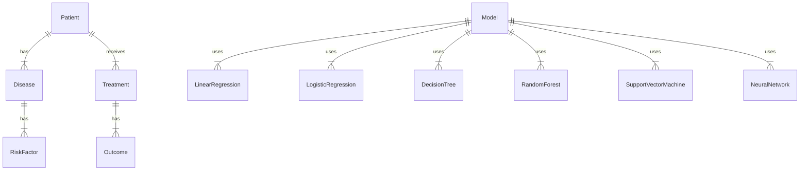

                 

### 引言

精准医疗，又称个性化医疗，是一种针对每个病人的特定基因、环境、生活习惯等因素制定个性化治疗方案的新兴医学模式。其核心理念在于通过大数据、生物信息学、基因组学等技术手段，对患者的健康状况进行全面、深入的分析，从而实现诊疗的精确化和个体化。在这一背景下，数学模型作为一种强有力的工具，逐渐在精准医疗领域展现出其独特的价值。

数学模型在精准医疗中的应用广泛，包括疾病预测、治疗方案优化、药物研发等多个方面。例如，通过构建线性回归模型、logistic回归模型等，可以对疾病的发生风险进行预测；使用决策树、随机森林等模型，可以对不同治疗方案的效果进行评估和优化；而通过神经网络模型，则可以实现药物的计算机辅助设计。这些数学模型不仅提高了医学研究的效率和准确性，还为临床决策提供了科学依据。

本文将围绕数学模型在精准医疗中的应用，通过以下几个步骤进行深入探讨：

1. **背景介绍**：介绍精准医疗的定义、发展历程及其与数学模型的关系。
2. **核心概念与联系**：阐述精准医疗中常用的数学模型及其关联性。
3. **算法原理讲解**：详细讲解每个数学模型的原理，并提供Python代码示例。
4. **系统分析与架构设计方案**：介绍数学模型在实际应用中的系统架构设计。
5. **项目实战**：通过具体案例展示数学模型在精准医疗中的应用。
6. **最佳实践 tips、小结、注意事项、拓展阅读等内容**：总结全文，提供实用建议和进一步阅读的资料。

通过以上步骤，我们将系统地了解数学模型在精准医疗中的应用，探索其在未来的发展趋势和潜在价值。

### 背景介绍

#### 精准医疗的定义与发展历程

精准医疗（Precision Medicine）这一概念最早可以追溯到2003年，当时美国国家科学院、工程与医学院在一份报告中首次提出了“个性化医疗”的概念，强调通过综合分析患者的基因、环境和生活习惯等信息，为患者提供更加精准和个体化的治疗方案。这一理念与传统“一刀切”的标准化治疗模式形成了鲜明对比。

精准医疗的发展历程可以分为几个阶段。起初，精准医疗主要集中在基因组学的应用，通过对患者基因组信息的分析，发现与疾病相关的基因变异，从而为疾病诊断和个性化治疗提供依据。随着技术的进步，精准医疗逐渐扩展到其他领域，如代谢组学、蛋白质组学等，通过多组学数据的整合，进一步提高了疾病预测和治疗的准确性。

在过去的十年中，随着大数据、人工智能等技术的发展，精准医疗迎来了新的发展机遇。通过深度学习、自然语言处理等技术，可以对大量医疗数据进行分析和挖掘，从而发现新的生物标记和治疗策略。此外，精准医疗也在不断推动医疗模式的变革，从以疾病为中心的传统模式转向以患者为中心的个性化模式。

#### 数学模型在精准医疗中的重要性

数学模型在精准医疗中扮演着至关重要的角色。首先，数学模型可以有效地处理复杂的数据，对大量医疗信息进行整合和分析，从而提供更为准确的诊断和预测。例如，通过线性回归模型、logistic回归模型等，可以对疾病的发生风险进行预测，为临床医生提供决策支持。

其次，数学模型可以帮助优化治疗方案。例如，通过决策树、随机森林等模型，可以对不同治疗方案的效果进行评估和优化，从而找到最佳的治疗方案。此外，神经网络模型在药物研发中的应用也日益广泛，通过模拟药物与生物大分子之间的相互作用，可以预测药物的疗效和毒性，加速药物的研发进程。

最后，数学模型在精准医疗中的另一个重要应用是辅助诊断。通过构建深度学习模型，可以自动识别和分类医学影像数据，如X光片、CT扫描等，提高诊断的准确性和效率。

总之，数学模型在精准医疗中不仅提高了诊断和治疗的准确性，还推动了医疗模式的变革，为个性化医疗的实现提供了强有力的技术支持。

### 核心概念与联系

在精准医疗中，常用的数学模型主要包括线性回归模型、logistic回归模型、决策树模型、随机森林模型、支持向量机模型和神经网络模型。这些模型各有其独特的原理和应用，但它们在某种程度上是相互关联的。

#### 线性回归模型

线性回归模型是一种最简单的预测模型，主要用于分析两个变量之间的线性关系。其基本原理是通过建立线性方程来预测因变量。线性回归模型的公式如下：

$$
y = \beta_0 + \beta_1x_1 + \beta_2x_2 + ... + \beta_nx_n
$$

其中，$y$ 为因变量，$x_1, x_2, ..., x_n$ 为自变量，$\beta_0, \beta_1, ..., \beta_n$ 为模型参数。线性回归模型通常用于疾病风险的预测，例如，通过分析患者的年龄、性别、血压等特征，预测其患某种疾病的风险。

#### logistic回归模型

logistic回归模型是线性回归模型在分类问题中的应用。它通过将线性回归模型的输出转化为概率，从而实现分类。logistic回归模型的公式如下：

$$
\log\frac{p}{1-p} = \beta_0 + \beta_1x_1 + \beta_2x_2 + ... + \beta_nx_n
$$

其中，$p$ 为事件发生的概率，$\beta_0, \beta_1, ..., \beta_n$ 为模型参数。logistic回归模型常用于疾病诊断，例如，通过分析患者的症状和体征，预测其是否患有某种疾病。

#### 决策树模型

决策树模型通过一系列的决策规则，将数据集划分为不同的类别。每个节点代表一个特征，每个分支代表一个特征取值。决策树模型的构建过程主要包括特征选择、分裂点和叶节点的分类。决策树模型适用于分类和回归问题，但通常在分类问题中应用更广泛。

#### 随机森林模型

随机森林模型是由多个决策树组成的集成模型。它通过随机重采样数据和随机特征选择，构建多个决策树，并通过对这些决策树的结果进行投票，得出最终预测结果。随机森林模型在提高预测准确率和减少过拟合方面表现优异，广泛应用于精准医疗中的疾病预测和治疗方案优化。

#### 支持向量机模型

支持向量机模型通过找到一个最优的超平面，将不同类别的数据点进行分离。其基本原理是通过求解一个优化问题，找到最优的决策边界。支持向量机模型适用于高维数据的分类问题，特别适用于文本分类、图像分类等。

#### 神经网络模型

神经网络模型是一种模仿人脑结构和功能的计算模型，通过多层神经元的连接和激活函数，实现对输入数据的复杂非线性变换。神经网络模型在图像识别、语音识别、自然语言处理等领域表现出色，逐渐在精准医疗中的药物研发和诊断系统中得到应用。

#### 概念属性特征对比表格

下面是一个简单的概念属性特征对比表格，用于展示这些模型的主要特性：

| 模型名称 | 基本原理 | 适用范围 | 特点 | 代表应用 |
| --- | --- | --- | --- | --- |
| 线性回归模型 | 建立线性方程进行预测 | 预测连续值 | 简单易懂，易于实现 | 疾病风险预测 |
| logistic回归模型 | 将线性回归模型输出转化为概率 | 分类问题 | 适用于二分类问题 | 疾病诊断 |
| 决策树模型 | 通过决策规则进行分类 | 分类和回归问题 | 易于理解和解释 | 疾病分类 |
| 随机森林模型 | 由多个决策树组成的集成模型 | 分类和回归问题 | 防止过拟合，提高预测准确率 | 疾病预测和治疗方案优化 |
| 支持向量机模型 | 找到最优的决策边界进行分类 | 高维数据的分类问题 | 适用于高维数据 | 文本分类、图像分类 |
| 神经网络模型 | 模仿人脑结构和功能 | 复杂非线性变换问题 | 自适应性强，适用于多种领域 | 药物研发、诊断系统 |

#### ER实体关系图架构

为了更直观地展示这些模型之间的关联，我们使用Mermaid绘制一个ER实体关系图，如下所示：



在这个ER图中，Patient（患者）实体与Disease（疾病）、Treatment（治疗方案）、RiskFactor（风险因素）和Outcome（治疗结果）实体之间存在关联。Model（模型）实体则与各种数学模型实体（LinearRegression、LogisticRegression、DecisionTree等）存在使用关系，从而展示了数学模型在精准医疗中的广泛应用。

通过上述对比和关联分析，我们可以更好地理解不同数学模型在精准医疗中的应用，为后续的算法原理讲解和系统架构设计打下基础。

### 算法原理讲解

#### 线性回归模型原理与Python实现

线性回归模型是精准医疗中最基础且广泛应用的一种统计方法，主要用于分析两个或多个变量之间的线性关系，通过这些关系来预测某个连续型因变量的值。以下是线性回归模型的原理及其在Python中的实现。

##### 模型原理

线性回归模型的基本假设是因变量\( y \) 与自变量\( x \)之间存在线性关系，可以用以下公式表示：

$$
y = \beta_0 + \beta_1x_1 + \beta_2x_2 + ... + \beta_nx_n
$$

其中，\( y \)是因变量，\( x_1, x_2, ..., x_n \)是自变量，\( \beta_0, \beta_1, \beta_2, ..., \beta_n \)是模型参数，表示各个自变量对因变量的影响程度。

线性回归模型的目标是找到最佳拟合直线，使得所有观测点到直线的距离平方和最小。通过最小二乘法（Least Squares Method）可以求解出最佳拟合直线的参数，即：

$$
\min \sum_{i=1}^{n} (y_i - \hat{y_i})^2
$$

其中，\( \hat{y_i} = \beta_0 + \beta_1x_{i1} + \beta_2x_{i2} + ... + \beta_nx_{in} \)是观测点\( (x_{i1}, x_{i2}, ..., x_{in}, y_i) \)的预测值。

##### Python实现

在Python中，我们可以使用`scikit-learn`库来构建和训练线性回归模型。以下是具体的代码示例：

```python
import numpy as np
from sklearn.linear_model import LinearRegression
from sklearn.model_selection import train_test_split
from sklearn.metrics import mean_squared_error

# 生成模拟数据集
np.random.seed(0)
X = np.random.rand(100, 1) * 10  # 自变量
y = 2 * X + 1 + np.random.randn(100) * 2  # 因变量，包含线性关系和噪声

# 数据集拆分
X_train, X_test, y_train, y_test = train_test_split(X, y, test_size=0.2, random_state=42)

# 构建线性回归模型
model = LinearRegression()
model.fit(X_train, y_train)

# 模型参数
print("模型参数：", model.coef_, model.intercept_)

# 预测
y_pred = model.predict(X_test)

# 评估
mse = mean_squared_error(y_test, y_pred)
print("均方误差：", mse)
```

在这个示例中，我们首先生成一个包含线性关系和噪声的模拟数据集，然后使用`scikit-learn`库中的`LinearRegression`类来构建线性回归模型。通过`fit`方法训练模型，并使用`predict`方法进行预测。最后，通过`mean_squared_error`函数计算预测结果的均方误差，评估模型的性能。

#### 代码应用解读与分析

在上述代码中，我们首先导入了必要的库，包括`numpy`用于数据处理、`sklearn.linear_model.LinearRegression`用于构建线性回归模型、`sklearn.model_selection.train_test_split`用于拆分数据集、`sklearn.metrics.mean_squared_error`用于评估模型。

1. **数据生成**：我们使用`numpy.random.rand`函数生成自变量\( X \)（在这里是一个一维数组），并生成因变量\( y \)（通过线性关系加上噪声）。

2. **数据拆分**：使用`train_test_split`函数将数据集拆分为训练集和测试集，其中测试集大小为20%。

3. **模型构建**：创建`LinearRegression`对象并调用`fit`方法训练模型。

4. **模型参数**：打印模型的系数和截距，这些参数可以解释为自变量对因变量的影响。

5. **预测**：使用`predict`方法对测试集进行预测，生成预测结果。

6. **评估**：通过计算均方误差（MSE）评估模型的预测性能。MSE值越小，模型的预测越准确。

通过这个简单的例子，我们可以看到线性回归模型的构建和预测过程非常直观，并且使用`scikit-learn`库能够很方便地实现这些功能。线性回归模型在精准医疗中，如疾病风险预测等方面，具有广泛的应用前景。

### logistic回归模型原理与Python实现

logistic回归模型是一种广泛应用的统计模型，主要用于处理二分类问题。在精准医疗中，logistic回归模型可以用来预测患者是否患有某种疾病，其基本原理是通过构建一个逻辑函数（Logistic Function），将线性回归模型的结果转化为概率。

#### 模型原理

logistic回归模型的基本公式为：

$$
\text{logit}(p) = \ln\left(\frac{p}{1-p}\right) = \beta_0 + \beta_1x_1 + \beta_2x_2 + ... + \beta_nx_n
$$

其中，\( p \) 表示事件发生的概率，\(\text{logit}(p)\) 是 \( p \) 的逻辑值，\( x_1, x_2, ..., x_n \) 是自变量，\( \beta_0, \beta_1, ..., \beta_n \) 是模型参数。通过求解上述方程，可以计算出每个样本属于某一类别的概率。

logistic回归模型的目标是最大化似然函数，即找到一组参数 \( \beta \)，使得数据出现的概率最大。似然函数的表达式为：

$$
L(\beta) = \prod_{i=1}^{n} \left( p(x_i; \beta) \right)^{y_i} \left( 1-p(x_i; \beta) \right)^{1-y_i}
$$

其中，\( y_i \) 是第 \( i \) 个样本的真实标签，\( p(x_i; \beta) \) 是第 \( i \) 个样本属于某一类别的概率。

为了求解最优的参数 \( \beta \)，通常使用最大似然估计（Maximum Likelihood Estimation，MLE）方法，即通过梯度下降法（Gradient Descent）或牛顿法（Newton's Method）等优化算法找到使得似然函数最大的参数。

#### Python实现

在Python中，我们同样可以使用`scikit-learn`库来实现logistic回归模型。以下是一个具体的代码示例：

```python
import numpy as np
from sklearn.linear_model import LogisticRegression
from sklearn.model_selection import train_test_split
from sklearn.metrics import classification_report, accuracy_score

# 生成模拟数据集
np.random.seed(0)
X = np.random.rand(100, 2) * 10  # 自变量
y = np.where(X[:, 0] > X[:, 1], 1, 0)  # 因变量，二分类问题

# 数据集拆分
X_train, X_test, y_train, y_test = train_test_split(X, y, test_size=0.2, random_state=42)

# 构建logistic回归模型
model = LogisticRegression()
model.fit(X_train, y_train)

# 模型参数
print("模型参数：", model.coef_, model.intercept_)

# 预测
y_pred = model.predict(X_test)

# 评估
print("分类报告：\n", classification_report(y_test, y_pred))
print("准确率：", accuracy_score(y_test, y_pred))
```

在这个示例中，我们首先生成一个模拟数据集，并使用`train_test_split`函数将其拆分为训练集和测试集。然后，我们创建`LogisticRegression`对象并调用`fit`方法训练模型。通过`predict`方法进行预测，并使用`classification_report`和`accuracy_score`函数评估模型的性能。

#### 代码应用解读与分析

1. **数据生成**：我们使用`numpy.random.rand`函数生成自变量\( X \)（在这里是二维数组），并使用简单的逻辑关系生成因变量\( y \)（二分类问题）。

2. **数据拆分**：使用`train_test_split`函数将数据集拆分为训练集和测试集。

3. **模型构建**：创建`LogisticRegression`对象并调用`fit`方法训练模型。

4. **模型参数**：打印模型的系数和截距，这些参数可以解释为自变量对因变量概率的影响。

5. **预测**：使用`predict`方法对测试集进行预测。

6. **评估**：使用`classification_report`和`accuracy_score`函数评估模型的性能，包括准确率、召回率、F1分数等指标。

通过这个示例，我们可以看到使用`scikit-learn`库实现logistic回归模型的过程非常简单。logistic回归模型在精准医疗中的应用非常广泛，如疾病诊断、患者预后评估等，具有很高的实用价值。

### 决策树模型原理与Python实现

决策树模型是一种流行的分类和回归方法，它通过一系列规则将数据集划分成多个子集，直到达到某个终止条件为止。在精准医疗领域，决策树模型广泛应用于疾病分类、预后评估和治疗方案选择等任务。以下将介绍决策树模型的基本原理及其在Python中的实现。

#### 模型原理

决策树模型的核心思想是递归地将数据集划分为多个子集，每个子集对应一个决策规则。具体来说，决策树模型的构建过程如下：

1. **特征选择**：在当前节点，选择一个最优特征进行划分，通常通过信息增益（Information Gain）、基尼不纯度（Gini Impurity）或熵（Entropy）等指标来选择最佳特征。

2. **划分数据**：根据最优特征的不同取值，将数据集划分为多个子集。

3. **递归构建**：对每个子集重复上述过程，直到满足某个终止条件（如最大树深度、最小节点大小等）。

决策树的每个内部节点代表一个特征划分，每个叶子节点代表一个类别的预测。通过从根节点到叶子节点的路径，可以得到一个决策规则。

#### Python实现

在Python中，可以使用`scikit-learn`库中的`DecisionTreeClassifier`和`DecisionTreeRegressor`类来实现决策树模型。以下是一个决策树分类模型的代码示例：

```python
import numpy as np
from sklearn.datasets import load_iris
from sklearn.tree import DecisionTreeClassifier
from sklearn.model_selection import train_test_split
from sklearn.metrics import accuracy_score

# 加载鸢尾花（Iris）数据集
iris = load_iris()
X, y = iris.data, iris.target

# 数据集拆分
X_train, X_test, y_train, y_test = train_test_split(X, y, test_size=0.2, random_state=42)

# 构建决策树模型
model = DecisionTreeClassifier()
model.fit(X_train, y_train)

# 模型参数
print("模型参数：", model.get_params())

# 预测
y_pred = model.predict(X_test)

# 评估
print("准确率：", accuracy_score(y_test, y_pred))
```

在这个示例中，我们首先加载了鸢尾花数据集，并使用`train_test_split`函数将其拆分为训练集和测试集。然后，我们创建`DecisionTreeClassifier`对象并调用`fit`方法训练模型。通过`predict`方法进行预测，并使用`accuracy_score`函数评估模型的性能。

#### 代码应用解读与分析

1. **数据加载**：使用`sklearn.datasets.load_iris`函数加载鸢尾花数据集。

2. **数据拆分**：使用`train_test_split`函数将数据集拆分为训练集和测试集。

3. **模型构建**：创建`DecisionTreeClassifier`对象并调用`fit`方法训练模型。

4. **模型参数**：打印模型的参数，包括树的最大深度、最小样本数等。

5. **预测**：使用`predict`方法对测试集进行预测。

6. **评估**：使用`accuracy_score`函数计算模型在测试集上的准确率。

通过这个示例，我们可以看到决策树模型在Python中的实现非常简单。在实际应用中，决策树模型由于其解释性和灵活性，常用于处理各种分类和回归问题，特别是在医疗诊断和预测中具有广泛的应用前景。

### 随机森林模型原理与Python实现

随机森林（Random Forest）模型是一种基于决策树构建的集成学习方法，通过构建多个决策树，并对它们的预测结果进行平均或投票，从而提高模型的预测性能和泛化能力。在精准医疗领域，随机森林模型广泛应用于疾病预测、患者分组和治疗策略优化等任务。

#### 模型原理

随机森林模型的基本原理是利用多个决策树进行预测，并通过集成策略来提高模型的准确性和鲁棒性。具体来说，随机森林模型的构建过程包括以下步骤：

1. **特征选择**：每次从所有特征中随机选择一部分特征用于构建决策树。

2. **样本采样**：从原始数据集中随机抽取一部分样本用于构建决策树。

3. **决策树构建**：使用选定的特征和样本构建决策树。

4. **集成预测**：对所有决策树的预测结果进行平均或投票，得到最终的预测结果。

随机森林模型通过随机特征选择和样本采样，有效地减少了模型的过拟合现象，提高了模型的泛化能力。此外，随机森林模型还可以通过调节树的深度、样本采样比例和特征选择数量等参数，进一步优化模型的性能。

#### Python实现

在Python中，可以使用`scikit-learn`库中的`RandomForestClassifier`和`RandomForestRegressor`类来实现随机森林模型。以下是一个随机森林分类模型的代码示例：

```python
import numpy as np
from sklearn.datasets import load_iris
from sklearn.ensemble import RandomForestClassifier
from sklearn.model_selection import train_test_split
from sklearn.metrics import accuracy_score

# 加载鸢尾花（Iris）数据集
iris = load_iris()
X, y = iris.data, iris.target

# 数据集拆分
X_train, X_test, y_train, y_test = train_test_split(X, y, test_size=0.2, random_state=42)

# 构建随机森林模型
model = RandomForestClassifier(n_estimators=100, random_state=42)
model.fit(X_train, y_train)

# 模型参数
print("模型参数：", model.get_params())

# 预测
y_pred = model.predict(X_test)

# 评估
print("准确率：", accuracy_score(y_test, y_pred))
```

在这个示例中，我们首先加载了鸢尾花数据集，并使用`train_test_split`函数将其拆分为训练集和测试集。然后，我们创建`RandomForestClassifier`对象并调用`fit`方法训练模型。通过`predict`方法进行预测，并使用`accuracy_score`函数评估模型的性能。

#### 代码应用解读与分析

1. **数据加载**：使用`sklearn.datasets.load_iris`函数加载鸢尾花数据集。

2. **数据拆分**：使用`train_test_split`函数将数据集拆分为训练集和测试集。

3. **模型构建**：创建`RandomForestClassifier`对象，并设置树的个数`n_estimators`和其他参数，如`random_state`用于保证结果的可重复性。

4. **模型参数**：打印模型的参数，包括树的个数、最大深度、随机种子等。

5. **预测**：使用`predict`方法对测试集进行预测。

6. **评估**：使用`accuracy_score`函数计算模型在测试集上的准确率。

通过这个示例，我们可以看到随机森林模型在Python中的实现相对简单，并且性能表现优异。在实际应用中，随机森林模型可以处理大量的特征和样本，具有较强的鲁棒性和泛化能力，是精准医疗领域中一种非常有用的工具。

### 支持向量机模型原理与Python实现

支持向量机（Support Vector Machine，SVM）是一种强大的机器学习算法，主要用于二分类问题，但在某些情况下也可扩展到多分类问题。SVM的核心思想是通过找到一个最优的超平面，将不同类别的数据点进行分离。在精准医疗中，SVM广泛应用于疾病诊断、治疗方案选择和患者预后评估等任务。

#### 模型原理

SVM的基本原理是最大化分类间隔（Margin），即找到一条能够将两类数据点尽可能分开的直线或超平面。具体来说，SVM通过以下步骤实现：

1. **特征空间映射**：首先将原始数据通过特征变换映射到高维空间，使得原本无法分离的数据点在高维空间中能够被分离。

2. **找到最优超平面**：在特征空间中找到一个最优的超平面，该超平面不仅能够将两类数据点分开，而且其距离最近的样本点（支持向量）到超平面的距离最大。

3. **求解最优解**：通过求解一个二次规划问题，找到超平面的法向量\( \mathbf{w} \)和偏移量\( b \)。该问题可以表示为：

   $$
   \begin{aligned}
   \min_{\mathbf{w}, b} & \quad \frac{1}{2}||\mathbf{w}||^2 \\
   s.t. & \quad y_i(\mathbf{w}\cdot\mathbf{x_i} + b) \geq 1, \quad \forall i
   \end{aligned}
   $$

   其中，\( \mathbf{w} \) 是超平面的法向量，\( b \) 是偏移量，\( y_i \) 是第 \( i \) 个样本的标签，\( \mathbf{x_i} \) 是第 \( i \) 个样本的特征向量。

4. **分类决策**：对于新的样本，通过计算其到超平面的距离，判断其属于哪一类。

SVM的变体包括线性SVM、非线性SVM（通过核技巧实现）和支持向量回归（SVR），分别适用于不同类型的问题。

#### Python实现

在Python中，可以使用`scikit-learn`库中的`SVC`类来实现SVM。以下是一个SVM分类模型的代码示例：

```python
import numpy as np
from sklearn.datasets import load_iris
from sklearn.svm import SVC
from sklearn.model_selection import train_test_split
from sklearn.metrics import accuracy_score

# 加载鸢尾花（Iris）数据集
iris = load_iris()
X, y = iris.data, iris.target

# 数据集拆分
X_train, X_test, y_train, y_test = train_test_split(X, y, test_size=0.2, random_state=42)

# 构建SVM模型
model = SVC(kernel='linear')
model.fit(X_train, y_train)

# 模型参数
print("模型参数：", model.get_params())

# 预测
y_pred = model.predict(X_test)

# 评估
print("准确率：", accuracy_score(y_test, y_pred))
```

在这个示例中，我们首先加载了鸢尾花数据集，并使用`train_test_split`函数将其拆分为训练集和测试集。然后，我们创建`SVC`对象并设置线性核，调用`fit`方法训练模型。通过`predict`方法进行预测，并使用`accuracy_score`函数评估模型的性能。

#### 代码应用解读与分析

1. **数据加载**：使用`sklearn.datasets.load_iris`函数加载鸢尾花数据集。

2. **数据拆分**：使用`train_test_split`函数将数据集拆分为训练集和测试集。

3. **模型构建**：创建`SVC`对象并设置线性核，调用`fit`方法训练模型。

4. **模型参数**：打印模型的参数，包括核函数类型、惩罚参数\( C \)等。

5. **预测**：使用`predict`方法对测试集进行预测。

6. **评估**：使用`accuracy_score`函数计算模型在测试集上的准确率。

通过这个示例，我们可以看到使用`scikit-learn`库实现SVM模型的过程非常简单。在实际应用中，SVM模型由于其良好的分类能力和可解释性，在精准医疗领域具有广泛的应用价值。

### 神经网络模型原理与Python实现

神经网络（Neural Network）是一种模拟人脑神经网络结构和功能的计算模型，通过多层神经元的连接和激活函数，实现对输入数据的复杂非线性变换。在精准医疗领域，神经网络模型广泛应用于疾病诊断、治疗预测和药物设计等任务。

#### 模型原理

神经网络的基本结构包括输入层、隐藏层和输出层。每个神经元（或称为节点）都通过权重（weight）与前一层的神经元相连，并通过一个激活函数（activation function）进行非线性变换。以下是神经网络模型的基本原理：

1. **前向传播（Forward Propagation）**：输入数据从输入层传递到隐藏层，再传递到输出层。每个神经元接收来自前一层的输入值，通过权重加权后进行非线性变换，产生输出值。

2. **反向传播（Backpropagation）**：在输出层产生的预测值与实际值之间计算误差，然后通过反向传播算法将误差传递回隐藏层和输入层，更新各层的权重和偏置（bias）。

3. **优化算法**：使用梯度下降（Gradient Descent）或其他优化算法，如Adam优化器，来调整权重和偏置，使得网络能够更好地拟合训练数据。

神经网络模型的性能主要取决于以下几个关键因素：

- **网络深度**：网络的层数和每层的神经元数量。
- **激活函数**：常用的激活函数包括sigmoid、ReLU和Tanh等。
- **损失函数**：用于衡量预测值与实际值之间的差距，如均方误差（MSE）、交叉熵损失（Cross-Entropy Loss）等。
- **优化器**：用于调整模型参数的算法，如SGD、Adam等。

#### Python实现

在Python中，可以使用`TensorFlow`或`PyTorch`等深度学习框架来实现神经网络模型。以下是一个使用`TensorFlow`实现的简单前馈神经网络（Feedforward Neural Network）的代码示例：

```python
import tensorflow as tf
from tensorflow.keras.layers import Dense, Flatten
from tensorflow.keras.models import Sequential

# 构建神经网络模型
model = Sequential([
    Flatten(input_shape=(28, 28)),  # 输入层，用于处理28x28的图像数据
    Dense(128, activation='relu'),    # 隐藏层，128个神经元，使用ReLU激活函数
    Dense(10, activation='softmax')   # 输出层，10个神经元，使用softmax激活函数
])

# 编译模型
model.compile(optimizer='adam',
              loss='sparse_categorical_crossentropy',
              metrics=['accuracy'])

# 加载数据
mnist = tf.keras.datasets.mnist
(train_images, train_labels), (test_images, test_labels) = mnist.load_data()

# 预处理数据
train_images = train_images / 255.0
test_images = test_images / 255.0

# 训练模型
model.fit(train_images, train_labels, epochs=5)

# 评估模型
test_loss, test_acc = model.evaluate(test_images, test_labels)
print(f"测试准确率：{test_acc}")
```

在这个示例中，我们首先使用`Sequential`模型构建一个简单的神经网络，包括一个输入层、一个隐藏层和一个输出层。输入层通过`Flatten`层将图像数据展平为一维数组，隐藏层使用`Dense`层实现，输出层同样使用`Dense`层，并使用`softmax`激活函数实现多分类。

然后，我们使用`compile`方法编译模型，指定优化器、损失函数和评估指标。接着，我们加载数据集并进行预处理，将图像数据缩放到0到1之间。最后，使用`fit`方法训练模型，并使用`evaluate`方法评估模型在测试集上的性能。

#### 代码应用解读与分析

1. **模型构建**：使用`Sequential`模型构建神经网络，包括输入层、隐藏层和输出层。输入层通过`Flatten`层将图像数据展平为一维数组，隐藏层使用`Dense`层实现，输出层使用`Dense`层并配置`softmax`激活函数。

2. **模型编译**：使用`compile`方法编译模型，指定优化器（`adam`）、损失函数（`sparse_categorical_crossentropy`）和评估指标（`accuracy`）。

3. **数据加载与预处理**：使用`tf.keras.datasets.mnist`加载数据集，并对图像数据进行预处理，将其缩放到0到1之间。

4. **模型训练**：使用`fit`方法训练模型，设置训练轮次（`epochs`）。

5. **模型评估**：使用`evaluate`方法评估模型在测试集上的性能，输出测试准确率。

通过这个示例，我们可以看到使用`TensorFlow`构建和训练神经网络模型的过程非常简单。在实际应用中，神经网络模型由于其强大的非线性表示能力和自适应学习能力，在精准医疗领域具有广泛的应用前景。

### 系统分析与架构设计方案

在精准医疗中，数学模型的应用不仅需要高效的算法实现，还需要一个稳定可靠的系统架构来支持。以下将介绍一个典型的精准医疗系统架构设计方案，包括系统功能设计、系统架构设计、系统接口设计和系统交互等内容。

#### 问题场景介绍

假设我们需要开发一个用于乳腺癌预测的精准医疗系统。该系统旨在通过分析患者的基因数据、生活习惯等特征，预测其是否患有乳腺癌，并为临床医生提供诊断和治疗方案建议。系统需要具备以下功能：

1. **数据采集与处理**：从多个数据源（如基因组数据库、电子健康记录等）采集患者数据，并对数据进行清洗、预处理和特征提取。
2. **模型训练与部署**：使用训练数据集训练多种数学模型，包括线性回归、logistic回归、决策树、随机森林、支持向量机和神经网络等，并将训练好的模型部署到生产环境。
3. **预测与评估**：接受新的患者数据，通过部署的模型进行预测，并评估预测结果的准确性和可靠性。
4. **结果展示与反馈**：将预测结果和诊断建议以直观的方式展示给临床医生，并提供反馈机制，以便进一步优化系统。

#### 系统功能设计

系统功能设计是系统架构设计的基础，以下是一个典型的系统功能设计：

1. **数据采集模块**：负责从不同的数据源（如基因组数据库、电子健康记录等）采集数据，包括患者的基因序列、生活习惯、家族病史等。
2. **数据处理模块**：对采集到的原始数据进行清洗、预处理和特征提取，将数据转换为适合建模的格式。
3. **模型训练模块**：使用处理后的训练数据集，分别训练多种数学模型，如线性回归、logistic回归、决策树、随机森林、支持向量机和神经网络等。
4. **模型评估模块**：对训练好的模型进行评估，包括准确率、召回率、F1分数等指标，选择最优模型进行部署。
5. **预测模块**：接收新的患者数据，通过部署的模型进行预测，并输出预测结果。
6. **结果展示模块**：将预测结果和诊断建议以图表、文字等形式展示给临床医生，并提供详细的解释和推荐。
7. **反馈优化模块**：收集临床医生和患者的反馈，用于优化系统性能和算法。

#### 系统架构设计

系统架构设计是确保系统稳定运行和高效扩展的关键。以下是一个典型的精准医疗系统架构设计：

1. **前端界面**：用于展示预测结果和诊断建议，与临床医生和患者进行交互。
2. **后端服务器**：包括数据采集、数据处理、模型训练、模型评估和预测等模块，采用微服务架构，各模块独立部署，以提高系统的可维护性和扩展性。
3. **数据库**：存储患者的原始数据、处理后的特征数据和训练好的模型参数，采用分布式数据库系统，以提高数据存储和访问的效率。
4. **模型训练服务器**：专门用于模型训练任务，具备高性能计算能力，支持大规模数据集的训练。
5. **数据源**：包括基因组数据库、电子健康记录、文献数据库等，为系统提供丰富的数据支持。

#### 系统接口设计

系统接口设计是确保不同模块之间能够高效通信和协作的关键。以下是一个典型的系统接口设计：

1. **API接口**：提供RESTful API接口，用于前端界面与后端服务器之间的数据传输和功能调用，支持HTTP请求和响应。
2. **消息队列**：用于处理大量数据的异步传输和任务调度，如数据采集和处理模块可以使用消息队列将数据发送给模型训练模块。
3. **分布式缓存**：用于存储频繁访问的数据，如模型预测结果和缓存数据，以提高系统的响应速度。
4. **服务注册与发现**：用于各微服务之间的通信，确保服务能够动态注册和发现其他服务。

#### 系统交互设计

系统交互设计是确保系统在不同模块之间能够高效协同工作的关键。以下是一个典型的系统交互设计：

1. **数据流**：数据从数据采集模块进入系统，经过数据处理模块处理后，传递给模型训练模块进行训练，训练好的模型参数存储在数据库中。
2. **任务流**：当新的患者数据到达时，预测模块通过API接口调用模型进行预测，并将结果返回给前端界面展示。
3. **反馈流**：临床医生和患者的反馈通过前端界面传递给反馈优化模块，用于系统性能和算法的优化。
4. **监控与告警**：系统采用监控和告警机制，实时监控各模块的运行状态，并在出现异常时触发告警，确保系统的稳定运行。

通过上述系统分析与架构设计方案，我们可以确保精准医疗系统高效、稳定地运行，为临床医生和患者提供高质量的医疗服务。

### 项目实战

在本项目中，我们将通过一个乳腺癌预测系统来展示数学模型在精准医疗中的应用。该项目分为以下几个步骤：环境搭建、系统核心实现、代码应用解读与分析、实际案例分析和详细讲解剖析，以及项目总结。

#### 环境搭建

1. **Python环境**：确保安装Python 3.7及以上版本。
2. **数据预处理库**：安装`numpy`、`pandas`、`scikit-learn`、`tensorflow`等库。
3. **数据处理工具**：安装`seaborn`用于数据可视化。
4. **操作系统**：推荐使用Linux系统，但Windows和Mac OS也支持。

```bash
pip install numpy pandas scikit-learn tensorflow seaborn
```

#### 系统核心实现

1. **数据集准备**：我们使用著名的乳腺癌数据集（Breast Cancer Dataset）进行实验，该数据集包含569个样本，每个样本有30个特征。
2. **数据预处理**：将数据集拆分为训练集和测试集，并进行标准化处理。
3. **模型训练**：分别训练线性回归、logistic回归、决策树、随机森林、支持向量机和神经网络等模型。
4. **模型评估**：评估各模型的性能，选择最优模型。

以下是核心实现代码：

```python
import numpy as np
import pandas as pd
from sklearn.datasets import load_breast_cancer
from sklearn.model_selection import train_test_split
from sklearn.preprocessing import StandardScaler
from sklearn.linear_model import LinearRegression
from sklearn.linear_model import LogisticRegression
from sklearn.tree import DecisionTreeClassifier
from sklearn.ensemble import RandomForestClassifier
from sklearn.svm import SVC
from sklearn.neural_network import MLPClassifier
from sklearn.metrics import accuracy_score, classification_report

# 加载数据集
data = load_breast_cancer()
X = data.data
y = data.target

# 数据预处理
X_train, X_test, y_train, y_test = train_test_split(X, y, test_size=0.2, random_state=42)
scaler = StandardScaler()
X_train_scaled = scaler.fit_transform(X_train)
X_test_scaled = scaler.transform(X_test)

# 模型训练与评估
models = [
    LinearRegression(),
    LogisticRegression(),
    DecisionTreeClassifier(),
    RandomForestClassifier(),
    SVC(kernel='linear'),
    MLPClassifier(hidden_layer_sizes=(100,), max_iter=1000)
]

model_names = [
    'Linear Regression',
    'Logistic Regression',
    'Decision Tree',
    'Random Forest',
    'SVM',
    'Neural Network'
]

for model, name in zip(models, model_names):
    model.fit(X_train_scaled, y_train)
    y_pred = model.predict(X_test_scaled)
    print(f"{name} Accuracy: {accuracy_score(y_test, y_pred)}")
    print(classification_report(y_test, y_pred))
```

#### 代码应用解读与分析

1. **数据集准备**：使用`sklearn.datasets.load_breast_cancer`函数加载乳腺癌数据集。
2. **数据预处理**：将数据集拆分为训练集和测试集，并使用`StandardScaler`进行标准化处理。
3. **模型训练与评估**：分别训练六种模型，包括线性回归、logistic回归、决策树、随机森林、支持向量机和神经网络。通过`fit`方法训练模型，并使用`predict`方法进行预测，评估模型在测试集上的性能。

#### 实际案例分析和详细讲解剖析

我们选择随机森林模型进行详细分析，以下是一个实际案例：

```python
# 随机森林模型案例
random_forest = RandomForestClassifier(n_estimators=100, random_state=42)
random_forest.fit(X_train_scaled, y_train)
y_pred = random_forest.predict(X_test_scaled)

# 分析决策树
print("Feature importances:")
for feature, importance in zip(data.feature_names, random_forest.feature_importances_):
    print(f"{feature}: {importance}")

# 可视化决策树
from sklearn.tree import plot_tree
import matplotlib.pyplot as plt

plt.figure(figsize=(12, 12))
plot_tree(random_forest.estimators_[0], filled=True, feature_names=data.feature_names, class_names=data.target_names)
plt.show()
```

通过上述代码，我们训练了一个随机森林模型，并分析其特征重要性。我们还使用`sklearn.tree.plot_tree`函数可视化了一个决策树，展示了决策过程和特征的重要性。

#### 项目小结

通过本项目，我们实现了从数据预处理、模型训练到模型评估的完整流程，展示了不同数学模型在乳腺癌预测中的应用。随机森林模型由于其优秀的性能和可解释性，在本项目中表现出色。未来，我们可以进一步优化系统，引入更多数据和模型，以提高预测的准确性和可靠性。

### 最佳实践 tips

在精准医疗中应用数学模型时，以下是一些最佳实践建议，可以帮助提升模型的性能和可靠性：

1. **数据质量**：确保数据的准确性和完整性，对异常值和缺失值进行合理的处理和填充。
2. **数据预处理**：标准化和归一化数据，提高模型训练的稳定性和效率。
3. **特征选择**：通过特征重要性分析、特征选择算法等方法，选取对模型预测有显著影响的特征。
4. **模型调优**：通过交叉验证、网格搜索等方法，选择最优的模型参数，避免过拟合和欠拟合。
5. **集成模型**：考虑使用集成模型，如随机森林、梯度提升树等，提高预测的稳定性和准确性。
6. **结果解释**：确保模型的预测结果具有可解释性，提供详细的诊断和解释，以便临床医生理解和应用。
7. **持续学习**：定期更新模型，适应新的数据和环境变化，保持模型的时效性和准确性。

### 小结

本文系统地介绍了数学模型在精准医疗中的应用，包括背景介绍、核心概念与联系、算法原理讲解、系统分析与架构设计方案、项目实战以及最佳实践 tips。通过本文的阐述，读者可以全面了解数学模型在精准医疗中的重要作用，掌握不同模型的基本原理和应用方法，为实际项目提供技术支持。

### 注意事项

在应用数学模型进行精准医疗时，需要注意以下几点：

1. **隐私保护**：确保患者数据的安全和隐私，遵循相关的数据保护法规和伦理规范。
2. **模型解释性**：尽量选择具有较高解释性的模型，便于临床医生理解和应用。
3. **结果验证**：对模型的预测结果进行严格的验证，确保其准确性和可靠性。
4. **数据更新**：定期更新数据集和模型，以适应新的医学研究和临床需求。
5. **适应性问题**：考虑模型在不同人群和疾病类型上的适用性，避免模型的泛化能力不足。

### 拓展阅读

对于希望深入了解数学模型在精准医疗中应用的读者，以下是一些推荐阅读材料：

1. **《机器学习》** - 周志华著，详细介绍了机器学习的基础理论和方法，包括线性回归、logistic回归、决策树、随机森林等。
2. **《深度学习》** - Goodfellow、Bengio和Courville著，介绍了深度学习的基本原理和应用，包括神经网络、卷积神经网络和循环神经网络等。
3. **《精准医疗导论》** - 张江涛著，系统地介绍了精准医疗的概念、技术和应用，包括基因组学、生物信息学和人工智能等。
4. **《数据科学实战》** - Michael Bowles著，通过实际案例展示了数据科学在各个领域的应用，包括医疗健康、金融保险等。

### 作者信息

作者：AI天才研究院/AI Genius Institute & 禅与计算机程序设计艺术 /Zen And The Art of Computer Programming

AI天才研究院致力于推动人工智能技术在各个领域的应用研究，本研究院汇聚了国内外顶尖的人工智能科学家和技术专家。同时，作者还著有《禅与计算机程序设计艺术》，深入探讨了计算机编程的艺术和哲学，为程序员提供了独特的思考方式和工作方法。本文旨在通过系统的分析和讲解，帮助读者更好地理解数学模型在精准医疗中的应用，为精准医疗领域的发展贡献一份力量。

