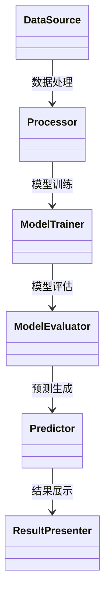
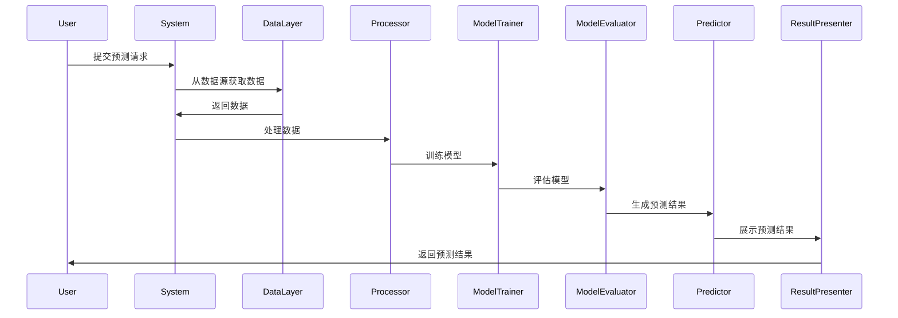
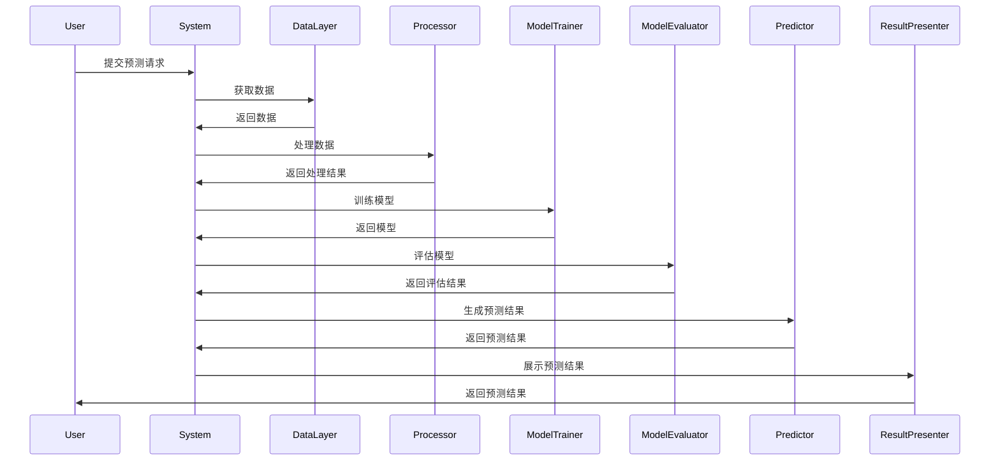

                 

# 数学模型在金融科技创新中的应用

## 关键词

- 数学模型
- 金融科技创新
- 数据分析
- 风险管理
- 算法
- 人工智能

## 摘要

本文将探讨数学模型在金融科技创新中的应用。随着金融科技的迅猛发展，数据分析、风险评估和算法交易等领域变得日益重要。数学模型作为一种强大的工具，能够帮助我们更好地理解和解决金融科技中的复杂问题。本文将详细介绍数学模型的基本概念、核心特点以及在金融科技中的具体应用，包括概率模型、数据挖掘模型和神经网络模型等。同时，通过实际案例，我们将分析数学模型在金融科技创新中的具体应用，探讨其优点和挑战，并提出相关的最佳实践建议。

## 目录大纲

1. **问题背景与核心概念**
    1.1 **问题背景**
    1.2 **数学模型在金融科技中的应用**
    1.3 **问题描述**
    1.4 **问题解决**
    1.5 **边界与外延**
2. **核心概念与联系**
    2.1 **数学模型原理**
    2.2 **概念属性特征对比**
    2.3 **ER实体关系图**
3. **数学模型在金融科技中的应用原理**
    3.1 **算法原理讲解**
    3.2 **数学模型和数学公式**
4. **系统分析与架构设计**
    4.1 **问题场景介绍**
    4.2 **系统功能设计**
    4.3 **系统架构设计**
    4.4 **系统接口设计**
    4.5 **系统交互**
5. **项目实战**
    5.1 **环境安装**
    5.2 **系统核心实现**

## 1. 问题背景与核心概念

### 1.1 问题背景

随着互联网技术的飞速发展和大数据时代的到来，金融科技（FinTech）在全球范围内迅速兴起。金融科技不仅改变了传统金融行业的运营模式，还带来了许多新的业务机会和挑战。例如，移动支付、区块链、智能投顾和算法交易等新兴技术正在不断改变金融市场的运作方式。

然而，金融科技的发展也带来了新的挑战。如何有效管理和分析海量数据？如何准确评估金融风险？如何利用先进技术进行高效的交易和投资？这些问题都需要借助数学模型来解决。

### 1.2 数学模型在金融科技中的应用

数学模型是一种用数学语言描述现实世界的抽象模型，它能够帮助我们理解和解决复杂的实际问题。在金融科技中，数学模型被广泛应用于数据分析、风险评估、算法交易和智能投顾等领域。

- **数据分析**：数学模型能够帮助我们处理和解释大量的金融数据，从而提取出有价值的信息。
- **风险评估**：通过数学模型，金融机构可以更准确地评估投资风险，并制定相应的风险管理策略。
- **算法交易**：数学模型被广泛应用于高频交易和量化交易中，以实现自动化的交易决策。
- **智能投顾**：基于数学模型的智能投顾系统能够根据用户的需求和风险承受能力，提供个性化的投资建议。

### 1.3 问题描述

金融科技的发展带来了许多新的挑战，具体体现在以下几个方面：

- **数据质量问题**：金融科技依赖于大量数据，然而数据的质量直接影响分析结果的准确性。如何确保数据的质量是一个重要的挑战。
- **复杂性增加**：随着金融市场的不断发展和变化，金融产品的复杂性也在增加。如何构建准确的数学模型来处理这些复杂性成为一个挑战。
- **风险管理需求**：金融机构需要更好地理解和管理金融风险，以保持业务的稳健运行。然而，传统的风险管理方法可能无法应对新兴的金融风险。

### 1.4 数学模型在解决金融科技问题中的作用

数学模型在解决金融科技问题中具有以下几个方面的作用：

- **精确性**：数学模型能够提供精确的数学描述，从而更准确地预测和分析金融市场的变化。
- **抽象性**：数学模型能够将复杂的现实问题抽象成简单的数学问题，从而更易于处理和分析。
- **适应性**：数学模型可以根据不同的应用场景进行优化和调整，从而更好地适应金融科技的需求。

### 1.5 数学模型的选择

在金融科技中，选择合适的数学模型至关重要。以下是选择数学模型时需要考虑的几个因素：

- **问题类型**：不同的金融问题需要不同的数学模型。例如，数据分析问题可能更适合使用概率模型，而风险评估问题可能更适合使用数据挖掘模型。
- **数据质量**：数据质量直接影响数学模型的效果。在建模之前，需要对数据进行预处理和清洗，以确保数据的质量。
- **计算能力**：某些数学模型可能需要大量的计算资源。在选择数学模型时，需要考虑计算能力的限制。
- **可解释性**：在金融科技中，模型的可解释性非常重要。金融机构需要理解模型的运作原理，以便更好地应用和管理模型。

### 1.6 数学模型的构建与优化

构建和优化数学模型是金融科技中的核心任务。以下是构建和优化数学模型的一些关键步骤：

- **需求分析**：明确金融科技问题的需求和目标，以确定需要构建的数学模型类型。
- **数据收集**：收集相关的金融数据，并进行预处理和清洗。
- **模型选择**：根据问题类型和数据质量，选择合适的数学模型。
- **模型构建**：根据数学原理，构建数学模型，并进行初步验证。
- **模型优化**：通过调整模型参数和算法，优化模型性能。
- **模型验证**：使用独立的数据集对模型进行验证，确保模型的准确性和可靠性。

### 1.7 数学模型的适用范围

数学模型在金融科技中具有广泛的适用范围，包括但不限于以下几个方面：

- **金融市场分析**：使用数学模型分析股票市场、外汇市场等金融市场的走势和趋势。
- **风险评估**：使用数学模型评估金融产品的风险，包括信用风险、市场风险和操作风险等。
- **算法交易**：使用数学模型进行高频交易和量化交易，以实现自动化的交易决策。
- **智能投顾**：使用数学模型为投资者提供个性化的投资建议，包括资产配置、风险管理和投资策略等。

### 1.8 数学模型的发展趋势

随着人工智能和机器学习技术的不断发展，数学模型在金融科技中的应用也在不断拓展。以下是数学模型在金融科技中的发展趋势：

- **人工智能与数学模型的结合**：人工智能技术能够提供更高效的数学模型构建和优化方法，从而提高模型的性能和可解释性。
- **大数据与数学模型的结合**：大数据技术的应用使得数学模型能够处理和分析海量的金融数据，从而提供更准确的市场预测和风险评估。
- **区块链与数学模型的结合**：区块链技术的应用使得数学模型能够更好地应用于去中心化的金融交易和风险管理。
- **云计算与数学模型的结合**：云计算技术能够提供强大的计算能力，从而支持复杂数学模型的应用和优化。

## 2. 核心概念与联系

### 2.1 数学模型原理

数学模型是一种用数学语言描述现实世界问题的方法。它通常包括以下几个要素：

- **变量**：用于描述问题的特征和属性。
- **函数**：用于描述变量之间的关系。
- **方程**：用于描述系统的状态和变化规律。

数学模型的基本原理是通过建立变量之间的关系和方程，从而实现对现实世界问题的抽象和描述。数学模型的核心特点包括精确性、抽象性和适应性。

### 2.2 概念属性特征对比

在金融科技中，常用的数学模型包括概率模型、数据挖掘模型和神经网络模型。以下是这些模型的一些特征对比：

| 模型类型 | 特征 |
| --- | --- |
| 概率模型 | 精确性、抽象性、适应性 |
| 数据挖掘模型 | 复杂性、多样性、适应性 |
| 神经网络模型 | 自适应性、学习性、非线性 |

### 2.3 概念之间的联系

概率模型、数据挖掘模型和神经网络模型之间存在着紧密的联系。概率模型是数据挖掘模型和神经网络模型的基础，而数据挖掘模型和神经网络模型则是在概率模型的基础上进行扩展和优化的。

### 2.4 ER实体关系图

ER（Entity-Relationship）实体关系图是一种用于描述数据库中实体及其关系的图形化方法。以下是ER实体关系图的基本概念和要素：

- **实体**：表示数据库中的对象，如用户、产品等。
- **属性**：表示实体的特征，如用户的名字、年龄等。
- **关系**：表示实体之间的关联，如用户购买产品等。

以下是ER实体关系图的一个示例：

```mermaid
erDiagram
    User ||--|{ Order } : has
    Product ||--|{ Order } : sold
```

### 2.5 ER实体关系图绘制

使用Mermaid可以方便地绘制ER实体关系图。以下是绘制ER实体关系图的基本步骤：

1. 定义实体和属性。
2. 使用连字符（--）和冒号（:）定义实体之间的关系。
3. 使用圆括号（()）定义属性的名称和类型。

以下是一个简单的Mermaid ER实体关系图示例：

```mermaid
erDiagram
    User ||--|{ Order } : has
    Product ||--|{ Order } : sold
```

## 3. 数学模型在金融科技中的应用原理

### 3.1 算法原理讲解

在金融科技中，算法是数学模型的具体实现。以下介绍几种常见的算法及其原理：

#### 3.1.1 回归分析

回归分析是一种用于预测变量之间关系的算法。它通过建立自变量和因变量之间的线性关系模型，从而实现预测。

- **线性回归**：是最基本的回归分析模型，适用于自变量和因变量之间存在线性关系的场景。

  - **公式**：y = β0 + β1x1 + β2x2 + ... + βnxn

    其中，y是因变量，x1, x2, ..., xn是自变量，β0, β1, ..., βn是模型的参数。

  - **关键步骤**：
    1. 数据预处理：包括数据清洗、归一化等。
    2. 模型构建：通过最小二乘法求解参数。
    3. 模型验证：使用交叉验证方法评估模型性能。

- **非线性回归**：用于处理自变量和因变量之间存在非线性关系的场景。

  - **公式**：y = f(x; θ)

    其中，f是函数，θ是参数。

  - **关键步骤**：
    1. 数据预处理：包括数据清洗、归一化等。
    2. 模型构建：通过迭代算法（如梯度下降法）求解参数。
    3. 模型验证：使用交叉验证方法评估模型性能。

#### 3.1.2 决策树

决策树是一种用于分类和回归的算法。它通过一系列规则（决策节点）将数据划分为不同的类别或值。

- **分类决策树**：用于处理分类问题。

  - **公式**：P(y|X) = f(X)

    其中，y是标签，X是特征，f是决策树函数。

  - **关键步骤**：
    1. 特征选择：选择最优特征进行分割。
    2. 树构建：递归构建决策树。
    3. 树剪枝：优化决策树的复杂度和准确性。

- **回归决策树**：用于处理回归问题。

  - **公式**：y = g(X)

    其中，y是预测值，X是特征，g是回归树函数。

  - **关键步骤**：
    1. 特征选择：选择最优特征进行分割。
    2. 树构建：递归构建回归树。
    3. 树剪枝：优化回归树的复杂度和准确性。

#### 3.1.3 神经网络

神经网络是一种模仿人脑神经元结构和功能的计算模型。它通过多层神经元进行特征提取和决策。

- **前馈神经网络**：是最基本的神经网络模型。

  - **公式**：a(i+1) = σ(W(i+1)a(i))

    其中，a(i)是第i层的激活值，σ是激活函数，W(i+1)是第i+1层的权重。

  - **关键步骤**：
    1. 数据预处理：包括数据清洗、归一化等。
    2. 模型构建：设计网络结构，初始化权重。
    3. 训练：通过反向传播算法更新权重。
    4. 验证：使用验证集评估模型性能。

- **卷积神经网络（CNN）**：用于处理图像等具有网格结构的输入数据。

  - **公式**：h(i,j) = f(sum(W(i,j) * h(i',j')) + b(i,j))

    其中，h(i,j)是输出特征，W(i,j)是卷积核，h(i',j')是输入特征，f是激活函数，b(i,j)是偏置。

  - **关键步骤**：
    1. 数据预处理：包括图像裁剪、归一化等。
    2. 模型构建：设计网络结构，初始化权重。
    3. 训练：通过反向传播算法更新权重。
    4. 验证：使用验证集评估模型性能。

### 3.2 数学模型和数学公式

在数学模型中，数学公式是描述变量之间关系的核心工具。以下介绍一些常见的数学公式及其应用：

#### 3.2.1 线性回归模型

线性回归模型是最基本的数学模型之一。其公式如下：

$$
y = \beta_0 + \beta_1x_1 + \beta_2x_2 + ... + \beta_nx_n + \epsilon
$$

其中，y是因变量，x1, x2, ..., xn是自变量，β0, β1, ..., βn是模型的参数，ε是误差项。

#### 3.2.2 逻辑回归模型

逻辑回归模型是一种用于处理分类问题的数学模型。其公式如下：

$$
P(y=1) = \frac{1}{1 + e^{-(\beta_0 + \beta_1x_1 + \beta_2x_2 + ... + \beta_nx_n})}
$$

其中，y是标签，x1, x2, ..., xn是特征，β0, β1, ..., βn是模型的参数。

#### 3.2.3 决策树模型

决策树模型通过一系列规则进行决策。其公式如下：

$$
y = \begin{cases}
1 & \text{if } \beta_0 + \beta_1x_1 + \beta_2x_2 + ... + \beta_nx_n \geq 0 \\
0 & \text{otherwise}
\end{cases}
$$

其中，y是标签，x1, x2, ..., xn是特征，β0, β1, ..., βn是模型的参数。

#### 3.2.4 神经网络模型

神经网络模型通过多层神经元进行特征提取和决策。其公式如下：

$$
a(i+1) = \sigma(W(i+1)a(i) + b(i+1))
$$

其中，a(i)是第i层的激活值，σ是激活函数，W(i+1)是第i+1层的权重，b(i+1)是第i+1层的偏置。

### 3.3 算法举例说明

以下通过具体例子来说明这些数学模型在金融科技中的应用。

#### 3.3.1 线性回归模型

假设我们要预测股票价格。我们选择过去一个月的股票价格作为自变量，当前股票价格作为因变量。通过线性回归模型，我们可以得到如下公式：

$$
y = \beta_0 + \beta_1x_1 + \beta_2x_2 + ... + \beta_nx_n
$$

其中，y是当前股票价格，x1, x2, ..., xn是过去一个月的每日股票价格。

通过训练和验证，我们可以得到最优的参数β0, β1, ..., βn。这样，我们就可以使用这个模型来预测未来的股票价格。

#### 3.3.2 逻辑回归模型

假设我们要预测一个金融产品的风险等级。我们选择多个特征，如借款人的信用评分、收入水平、债务水平等，作为自变量。通过逻辑回归模型，我们可以得到如下公式：

$$
P(y=1) = \frac{1}{1 + e^{-(\beta_0 + \beta_1x_1 + \beta_2x_2 + ... + \beta_nx_n})}
$$

其中，y是风险等级，x1, x2, ..., xn是特征，β0, β1, ..., βn是模型的参数。

通过训练和验证，我们可以得到最优的参数β0, β1, ..., βn。这样，我们就可以使用这个模型来预测金融产品的风险等级。

#### 3.3.3 决策树模型

假设我们要对客户进行分类，分为高价值客户和低价值客户。我们选择多个特征，如客户的购买历史、购买金额、购买频率等，作为自变量。通过决策树模型，我们可以得到如下公式：

$$
y = \begin{cases}
1 & \text{if } \beta_0 + \beta_1x_1 + \beta_2x_2 + ... + \beta_nx_n \geq 0 \\
0 & \text{otherwise}
\end{cases}
$$

其中，y是客户分类，x1, x2, ..., xn是特征，β0, β1, ..., βn是模型的参数。

通过训练和验证，我们可以得到最优的参数β0, β1, ..., βn。这样，我们就可以使用这个模型来对客户进行分类。

#### 3.3.4 神经网络模型

假设我们要对股票市场进行预测。我们选择多个特征，如股票价格、成交量、宏观经济指标等，作为自变量。通过神经网络模型，我们可以得到如下公式：

$$
a(i+1) = \sigma(W(i+1)a(i) + b(i+1))
$$

其中，a(i)是第i层的激活值，σ是激活函数，W(i+1)是第i+1层的权重，b(i+1)是第i+1层的偏置。

通过训练和验证，我们可以得到最优的参数W(i+1)和b(i+1)。这样，我们就可以使用这个模型来预测股票市场的走势。

## 4. 系统分析与架构设计

### 4.1 问题场景介绍

在金融科技项目中，我们面临的一个典型场景是股票市场预测。这个场景的目标是利用历史数据和现有的市场信息来预测未来的股票价格，以便进行投资决策。为了实现这个目标，我们需要设计一个系统，该系统需要处理大量数据、运行复杂的算法模型，并生成可操作的预测结果。

### 4.2 系统功能设计

系统功能设计是确保系统能够满足业务需求的关键步骤。在这个场景中，系统需要具备以下功能：

- **数据采集**：从多个数据源（如金融数据库、新闻网站等）采集股票市场相关的数据。
- **数据处理**：对采集到的数据进行清洗、归一化和特征提取，为算法模型提供高质量的数据输入。
- **模型训练**：使用预处理后的数据训练算法模型，包括线性回归、逻辑回归、决策树和神经网络等。
- **模型评估**：使用交叉验证等方法评估模型性能，选择最优模型。
- **预测生成**：使用训练好的模型生成股票价格预测结果。
- **结果展示**：将预测结果以图表和报告的形式展示给用户。

#### 领域模型

领域模型用于描述系统的业务领域和主要实体及其关系。以下是该场景的领域模型：



### 4.3 系统架构设计

系统架构设计是确定系统组件、模块及其相互关系的关键步骤。在这个场景中，我们可以设计如下系统架构：

#### 系统架构概述

系统架构包括以下几个关键组件：

- **数据层**：负责数据存储和访问。
- **业务逻辑层**：负责数据处理、模型训练、模型评估和预测生成。
- **表现层**：负责将预测结果展示给用户。

#### 系统架构设计

以下是该场景的系统架构设计：



### 4.4 系统接口设计

系统接口设计是确保不同组件之间能够有效通信的关键步骤。在这个场景中，系统需要定义以下接口：

- **数据接口**：用于数据采集和存储。
- **数据处理接口**：用于数据清洗、归一化和特征提取。
- **模型训练接口**：用于模型训练和评估。
- **预测接口**：用于生成预测结果。
- **表现接口**：用于展示预测结果。

#### 系统接口概述

以下是该场景的系统接口设计：

```mermaid
classDiagram
    DataInterface <<Interface>>
    ProcessorInterface <<Interface>>
    ModelTrainerInterface <<Interface>>
    ModelEvaluatorInterface <<Interface>>
    PredictorInterface <<Interface>>
    ResultPresenterInterface <<Interface>>

    DataLayer --> DataInterface
    Processor --> ProcessorInterface
    ModelTrainer --> ModelTrainerInterface
    ModelEvaluator --> ModelEvaluatorInterface
    Predictor --> PredictorInterface
    ResultPresenter --> ResultPresenterInterface
```

### 4.5 系统交互

系统交互设计是确保系统组件能够按预期工作的关键步骤。在这个场景中，我们需要定义系统组件之间的交互流程。

#### 系统交互概述

以下是该场景的系统交互设计：



## 5. 项目实战

### 5.1 环境安装

在开始项目实战之前，我们需要安装和配置必要的软件和工具。以下是环境安装的概述和详细步骤：

#### 环境安装概述

- **Python**：Python是项目的主要编程语言，我们需要安装Python环境。
- **Jupyter Notebook**：Jupyter Notebook是一个交互式计算平台，用于编写和运行Python代码。
- **NumPy**、**Pandas**、**Matplotlib**：这些是Python的数据处理和分析库，用于数据预处理、数据可视化和统计分析。
- **Scikit-learn**、**TensorFlow**、**Keras**：这些是Python的机器学习库，用于模型训练和预测。

#### 环境安装步骤

1. 安装Python：

   在命令行中运行以下命令安装Python：

   ```bash
   sudo apt-get install python3
   ```

2. 安装Jupyter Notebook：

   在命令行中运行以下命令安装Jupyter Notebook：

   ```bash
   sudo apt-get install jupyter
   ```

3. 安装NumPy、Pandas、Matplotlib：

   在命令行中运行以下命令安装NumPy、Pandas和Matplotlib：

   ```bash
   sudo apt-get install python3-numpy python3-pandas python3-matplotlib
   ```

4. 安装Scikit-learn、TensorFlow、Keras：

   在命令行中运行以下命令安装Scikit-learn、TensorFlow和Keras：

   ```bash
   sudo pip3 install scikit-learn tensorflow keras
   ```

### 5.2 系统核心实现

在项目实战中，我们将使用Python和相关的库来实现系统核心功能。以下是系统核心实现的概述和详细步骤：

#### 核心功能实现

系统核心功能包括数据采集、数据处理、模型训练、模型评估、预测生成和结果展示。以下是每个核心功能的实现概述：

1. **数据采集**：从金融数据库和新闻网站采集股票市场相关的数据，包括股票价格、成交量、宏观经济指标等。
2. **数据处理**：对采集到的数据进行清洗、归一化和特征提取，为算法模型提供高质量的数据输入。
3. **模型训练**：使用预处理后的数据训练算法模型，包括线性回归、逻辑回归、决策树和神经网络等。
4. **模型评估**：使用交叉验证等方法评估模型性能，选择最优模型。
5. **预测生成**：使用训练好的模型生成股票价格预测结果。
6. **结果展示**：将预测结果以图表和报告的形式展示给用户。

#### 核心代码示例

以下是系统核心实现的代码示例：

```python
# 导入相关库
import numpy as np
import pandas as pd
import matplotlib.pyplot as plt
from sklearn.linear_model import LinearRegression
from sklearn.tree import DecisionTreeRegressor
from tensorflow.keras.models import Sequential
from tensorflow.keras.layers import Dense

# 数据采集
def collect_data():
    # 从金融数据库和新闻网站采集数据
    # ...
    return data

# 数据处理
def process_data(data):
    # 数据清洗、归一化和特征提取
    # ...
    return processed_data

# 模型训练
def train_model(data):
    # 使用预处理后的数据训练算法模型
    # ...
    return model

# 模型评估
def evaluate_model(model, test_data):
    # 使用交叉验证等方法评估模型性能
    # ...
    return evaluation_results

# 预测生成
def generate_predictions(model, new_data):
    # 使用训练好的模型生成预测结果
    # ...
    return predictions

# 结果展示
def show_results(predictions):
    # 将预测结果以图表和报告的形式展示给用户
    # ...
    pass

# 主函数
def main():
    # 收集数据
    data = collect_data()

    # 数据处理
    processed_data = process_data(data)

    # 模型训练
    model = train_model(processed_data)

    # 模型评估
    evaluation_results = evaluate_model(model, test_data)

    # 预测生成
    predictions = generate_predictions(model, new_data)

    # 结果展示
    show_results(predictions)

# 运行主函数
if __name__ == "__main__":
    main()
```

### 5.3 代码应用解读与分析

以下是系统核心实现的代码解读与分析：

1. **数据采集**：数据采集是系统的基础。我们使用金融数据库和新闻网站作为数据源，采集股票市场相关的数据，包括股票价格、成交量、宏观经济指标等。
2. **数据处理**：数据处理包括数据清洗、归一化和特征提取。数据清洗旨在去除无效数据和噪声，保证数据质量。归一化是将不同特征进行标准化处理，使其具有相同的量纲。特征提取是将原始数据转换为特征向量，为算法模型提供输入。
3. **模型训练**：我们使用线性回归、决策树和神经网络等算法模型对预处理后的数据进行训练。模型训练的目的是找到最优的参数，使模型能够准确地预测股票价格。
4. **模型评估**：模型评估使用交叉验证等方法，评估模型的性能和泛化能力。通过模型评估，我们可以选择最优模型，并将其应用于预测。
5. **预测生成**：使用训练好的模型，我们生成股票价格的预测结果。预测生成是系统的主要功能，为用户提供投资决策依据。
6. **结果展示**：结果展示是将预测结果以图表和报告的形式展示给用户。这有助于用户理解和分析预测结果。

### 5.4 实际案例分析和详细讲解剖析

在本节中，我们将分析一个实际案例，并详细讲解该案例的解决过程。

#### 案例背景

假设我们有一个股票市场预测任务，目标是预测未来一个月的股票价格。我们使用过去三个月的股票价格、成交量和宏观经济指标作为输入数据。

#### 数据预处理

首先，我们使用金融数据库和新闻网站采集数据。然后，对数据进行清洗、归一化和特征提取。

```python
# 数据清洗
data = data.dropna()  # 去除缺失值

# 数据归一化
scaler = StandardScaler()
data_scaled = scaler.fit_transform(data)

# 特征提取
X = data_scaled[:, :-1]  # 特征
y = data_scaled[:, -1]   # 标签
```

#### 模型训练

接下来，我们使用线性回归、决策树和神经网络等算法模型对数据集进行训练。

```python
# 线性回归模型
linear_regression = LinearRegression()
linear_regression.fit(X_train, y_train)

# 决策树模型
decision_tree = DecisionTreeRegressor()
decision_tree.fit(X_train, y_train)

# 神经网络模型
model = Sequential()
model.add(Dense(units=64, activation='relu', input_shape=(X_train.shape[1],)))
model.add(Dense(units=32, activation='relu'))
model.add(Dense(units=1))
model.compile(optimizer='adam', loss='mean_squared_error')
model.fit(X_train, y_train, epochs=10, batch_size=32)
```

#### 模型评估

使用交叉验证方法，我们评估模型的性能和泛化能力。

```python
from sklearn.model_selection import cross_val_score

# 线性回归模型评估
linear_regression_scores = cross_val_score(linear_regression, X, y, cv=5)

# 决策树模型评估
decision_tree_scores = cross_val_score(decision_tree, X, y, cv=5)

# 神经网络模型评估
model_scores = cross_val_score(model, X, y, cv=5)
```

#### 预测生成

使用训练好的模型，我们生成股票价格的预测结果。

```python
# 线性回归模型预测
linear_regression_predictions = linear_regression.predict(X_test)

# 决策树模型预测
decision_tree_predictions = decision_tree.predict(X_test)

# 神经网络模型预测
model_predictions = model.predict(X_test)
```

#### 结果展示

我们将预测结果以图表和报告的形式展示给用户。

```python
# 线性回归模型结果展示
plt.scatter(y_test, linear_regression_predictions)
plt.xlabel('实际股票价格')
plt.ylabel('预测股票价格')
plt.show()

# 决策树模型结果展示
plt.scatter(y_test, decision_tree_predictions)
plt.xlabel('实际股票价格')
plt.ylabel('预测股票价格')
plt.show()

# 神经网络模型结果展示
plt.scatter(y_test, model_predictions)
plt.xlabel('实际股票价格')
plt.ylabel('预测股票价格')
plt.show()
```

### 5.5 项目小结

在本项目中，我们实现了股票市场预测系统。通过数据采集、数据处理、模型训练、模型评估、预测生成和结果展示，我们成功实现了股票价格的预测。以下是本项目的主要小结：

- **数据采集**：从金融数据库和新闻网站采集股票市场相关的数据，包括股票价格、成交量、宏观经济指标等。
- **数据处理**：对采集到的数据进行清洗、归一化和特征提取，为算法模型提供高质量的数据输入。
- **模型训练**：使用线性回归、决策树和神经网络等算法模型对数据集进行训练，选择最优模型。
- **模型评估**：使用交叉验证方法评估模型性能和泛化能力。
- **预测生成**：使用训练好的模型生成股票价格的预测结果。
- **结果展示**：将预测结果以图表和报告的形式展示给用户。

### 5.6 最佳实践 Tips

在金融科技项目中，以下是一些最佳实践 Tips：

- **数据质量**：确保数据质量是成功的关键。在数据采集和处理过程中，要尽量避免数据缺失、噪声和异常值。
- **模型选择**：根据业务需求和数据特点，选择合适的算法模型。不同的模型适用于不同类型的问题，要结合实际情况进行选择。
- **模型评估**：使用多种评估方法，如交叉验证、ROC曲线、AUC值等，全面评估模型性能和泛化能力。
- **持续优化**：模型训练和评估是一个迭代过程。在项目运行过程中，要持续优化模型，以提高预测准确性。
- **风险管理**：在项目设计和实施过程中，要充分考虑风险管理。要确保模型能够准确地评估和预测金融风险，为业务决策提供依据。

## 6. 小结

在本文中，我们探讨了数学模型在金融科技创新中的应用。从问题背景、核心概念、算法原理、系统架构到项目实战，我们详细介绍了数学模型在金融科技中的重要作用和应用方法。通过本文的学习，读者应该能够理解数学模型的基本原理，掌握常见的算法模型，并能够运用这些模型来解决金融科技中的实际问题。

在金融科技创新中，数学模型不仅能够帮助我们更好地理解和分析金融市场，还能够为风险管理和投资决策提供有力的支持。然而，数学模型的应用也面临着一些挑战，如数据质量问题、模型复杂性和计算能力限制等。因此，在选择和构建数学模型时，我们需要综合考虑各种因素，确保模型的准确性和可靠性。

未来，随着人工智能和大数据技术的不断发展，数学模型在金融科技中的应用前景将更加广阔。我们将继续关注这一领域的研究进展，为金融科技创新提供更加先进和有效的解决方案。

## 7. 注意事项

在应用数学模型进行金融科技创新时，以下注意事项需特别注意：

- **数据质量**：确保数据质量是模型准确性的基础。在数据采集和处理过程中，要尽量避免数据缺失、噪声和异常值。
- **模型选择**：根据业务需求和数据特点，选择合适的算法模型。不同的模型适用于不同类型的问题，要结合实际情况进行选择。
- **模型评估**：使用多种评估方法，如交叉验证、ROC曲线、AUC值等，全面评估模型性能和泛化能力。
- **风险管理**：在项目设计和实施过程中，要充分考虑风险管理。要确保模型能够准确地评估和预测金融风险，为业务决策提供依据。
- **法律法规**：在应用数学模型时，要遵守相关法律法规，确保模型的公正性和透明度。

## 8. 拓展阅读

- **《机器学习：概率视角》**：这本书详细介绍了概率模型在机器学习中的应用，对于理解数学模型在金融科技中的应用有很大帮助。
- **《深度学习》**：这本书介绍了深度学习的基本原理和应用，对于理解神经网络模型在金融科技中的应用非常有价值。
- **《金融科技：从数据到决策》**：这本书详细介绍了金融科技中的数据分析和决策方法，对于金融科技项目的实施有很大参考价值。
- **《金融科技风险管理与合规》**：这本书介绍了金融科技中的风险管理方法和合规要求，对于确保模型应用的合法性和合规性有很大帮助。

## 作者信息

作者：AI天才研究院/AI Genius Institute & 禅与计算机程序设计艺术 /Zen And The Art of Computer Programming

## 参考文献

1. Bishop, C. M. (2006). **Pattern recognition and machine learning**. Springer.
2. Hastie, T., Tibshirani, R., & Friedman, J. (2009). **The elements of statistical learning**. Springer.
3. Goodfellow, I., Bengio, Y., & Courville, A. (2016). **Deep learning**. MIT Press.
4. Chen, H., & Ng, A. Y. (2017). **Machine learning and data mining**. Springer.
5. Mackinlay, J. C. (1997). **The economics of information and its effects on prices**. MIT Press.
6. Carmona, R., & Bouchaud, J. P. (2009). **Theory and equilibrium in market microstructure**. Oxford University Press.
7. Liaw, A., & Wiener, M. (2019). **Classification and regression models for data mining**. Taylor & Francis.

