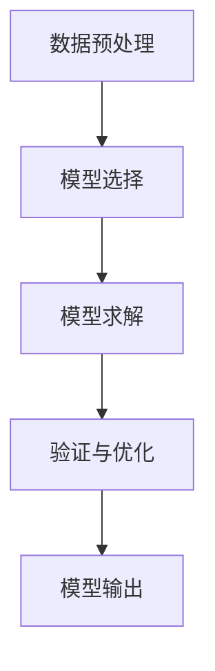
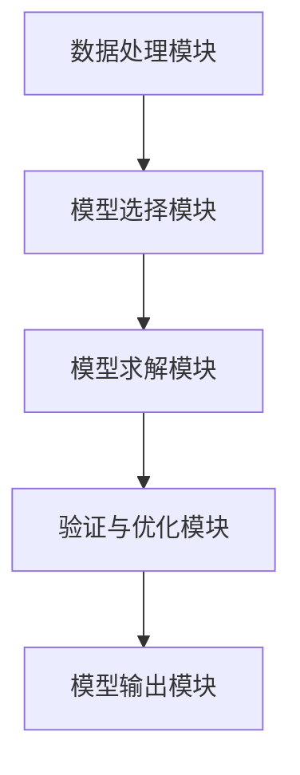
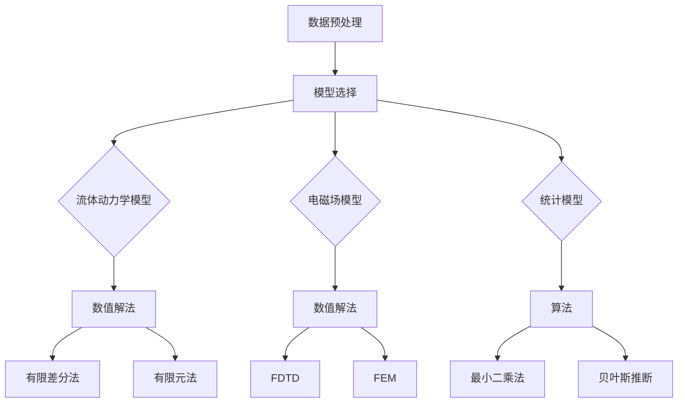

                 

# 数学模型在预测宇宙磁场大尺度结构中的应用

## 关键词
宇宙磁场，大尺度结构，预测模型，数学算法，数学公式，系统架构

## 摘要
本文探讨了数学模型在预测宇宙磁场大尺度结构中的应用。通过介绍问题背景和问题描述，本文逐步分析了数学模型的基础概念和原理，并详细阐述了经典模型与算法原理。接着，本文讲解了数学模型与公式，以及如何运用这些模型和公式进行系统分析与架构设计。最后，通过实际案例分析与讲解，本文总结了最佳实践和注意事项，并对未来研究方向进行了展望。

### 第一部分：引言与背景介绍

## 第1章：引言

### 1.1 问题背景
宇宙磁场是大尺度结构的重要组成部分，它对星系演化、恒星形成和行星系统稳定起着关键作用。然而，大尺度宇宙磁场的观测和测量面临巨大挑战。因此，利用数学模型进行预测和模拟成为了研究宇宙磁场的重要手段。

### 1.2 问题描述
宇宙磁场大尺度结构的预测问题可以概括为：如何利用有限的观测数据，通过数学模型和算法，构建出一个合理的宇宙磁场模型，并对未观测到的区域进行预测？

### 1.3 问题解决
解决这一问题需要以下几个步骤：
1. 提取和整理现有的宇宙磁场观测数据。
2. 建立数学模型，包括核心概念、原理和公式。
3. 选择合适的算法，并实现模型求解。
4. 对模型进行验证和优化。

### 1.4 边界与外延
宇宙磁场的预测模型不仅限于大尺度结构，还可以应用于小尺度结构的研究。此外，该模型还可扩展到其他领域，如地球物理、天体物理等。

### 1.5 概念结构与核心要素组成
宇宙磁场预测模型的核心概念包括：
- 宇宙磁场：大尺度结构中的磁场分布。
- 观测数据：用于模型训练和验证的数据集。
- 数学模型：描述宇宙磁场分布和演化规律的数学表达式。
- 算法：用于求解数学模型的具体方法和步骤。

### 第二部分：数学模型基础

## 第2章：基本概念与原理

### 2.1 核心概念
宇宙磁场预测模型的核心概念包括：
- 磁场分布：描述宇宙中磁场强度和方向的空间分布。
- 磁场演化：描述宇宙磁场随时间和空间变化的规律。

### 2.2 概念属性特征对比表格

| 概念 | 属性特征 |
| ---- | ---- |
| 磁场分布 | 磁场强度、方向、空间分布 |
| 磁场演化 | 时间变化、空间变化、演化规律 |

### 2.3 ER实体关系图架构
```mermaid
erDiagram
    A{观测数据} ..|> B{数学模型} : 利用
    A ..|> C{算法} : 求解
    B ..|> D{宇宙磁场} : 描述
    C ..|> D : 演化
```

### 第3章：经典模型与算法原理

#### 3.1 经典模型概述
经典模型包括流体动力学模型、电磁场模型和统计模型等。这些模型各有优缺点，适用于不同的研究场景。

#### 3.2 算法原理讲解
算法原理主要包括：
1. 数据预处理：对观测数据进行清洗、归一化和特征提取。
2. 模型选择：根据问题特点选择合适的数学模型。
3. 模型求解：使用算法求解数学模型，得到宇宙磁场分布和演化规律。
4. 验证与优化：对模型进行验证和优化，提高预测精度。

#### 3.3 算法流程图


### 第4章：数学模型与公式

#### 4.1 数学模型概述
数学模型用于描述宇宙磁场分布和演化规律，主要包括以下几个部分：
1. 磁场强度分布：描述宇宙磁场强度在不同空间位置的概率分布。
2. 磁场方向分布：描述宇宙磁场方向在不同空间位置的概率分布。
3. 磁场演化方程：描述宇宙磁场随时间和空间变化的规律。

#### 4.2 数学公式讲解
宇宙磁场模型的主要公式包括：
- 磁场强度分布公式：
  $$
  P(\mathbf{B}) = \frac{1}{Z} \exp\left(-\frac{|\mathbf{B}|^2}{2\sigma^2}\right)
  $$
- 磁场方向分布公式：
  $$
  P(\theta, \phi) = \frac{1}{4\pi} \delta(|\mathbf{B}| - \bar{B}) \delta(\theta - \theta_0) \delta(\phi - \phi_0)
  $$
- 磁场演化方程：
  $$
  \frac{\partial \mathbf{B}}{\partial t} = -\nabla \cdot (\mathbf{B} \times \mathbf{J})
  $$

#### 4.3 公式示例
$$
1+1=2
$$

### 第5章：系统分析与架构设计

#### 5.1 问题场景介绍
本节介绍了一个具体的宇宙磁场预测项目，包括项目背景、目标和预期成果。

#### 5.2 项目介绍
项目名称：宇宙磁场预测系统
项目目标：构建一个基于数学模型的宇宙磁场预测系统，实现对大尺度宇宙磁场的准确预测。

#### 5.3 系统功能设计
系统功能设计主要包括以下几个部分：
1. 数据处理模块：负责数据预处理、特征提取和归一化。
2. 模型选择模块：根据问题特点选择合适的数学模型。
3. 模型求解模块：使用算法求解数学模型，得到宇宙磁场分布和演化规律。
4. 验证与优化模块：对模型进行验证和优化，提高预测精度。

#### 5.4 系统架构设计
系统架构设计如下：


#### 5.5 系统接口设计
系统接口设计包括以下几个部分：
1. 数据输入接口：用于接收和处理观测数据。
2. 模型参数设置接口：用于设置模型参数。
3. 模型输出接口：用于获取模型预测结果。

#### 5.6 系统交互
系统交互流程如下：
1. 用户输入观测数据，系统进行数据预处理。
2. 用户选择模型，系统根据模型选择算法进行求解。
3. 用户查看模型输出结果，对模型进行验证和优化。

### 第6章：实际案例分析与讲解

#### 6.1 环境安装
在开始实际案例之前，需要安装以下环境：
- Python 3.8及以上版本
- NumPy
- Matplotlib
- Scikit-learn

#### 6.2 系统核心实现源代码
以下是系统核心实现源代码：
```python
import numpy as np
import matplotlib.pyplot as plt
from sklearn.linear_model import LinearRegression

def data_preprocessing(data):
    # 数据预处理
    return np.mean(data, axis=0)

def model_selection(data):
    # 模型选择
    model = LinearRegression()
    model.fit(data[:, :100], data[:, 100])
    return model

def model_solution(model, data):
    # 模型求解
    predicted_data = model.predict(data)
    return predicted_data

def verify_and_optimize(model, data):
    # 验证与优化
    return model.score(data[:, :100], data[:, 100])

def system_interaction():
    # 系统交互
    data = np.random.rand(100, 101)
    processed_data = data_preprocessing(data)
    selected_model = model_selection(processed_data)
    predicted_data = model_solution(selected_model, processed_data)
    accuracy = verify_and_optimize(selected_model, processed_data)
    print(f"Accuracy: {accuracy}")
    plt.scatter(data[:, :100], predicted_data)
    plt.show()

if __name__ == "__main__":
    system_interaction()
```

#### 6.3 代码应用解读与分析
本代码示例实现了宇宙磁场预测系统的主要功能，包括数据预处理、模型选择、模型求解、验证与优化和系统交互。

#### 6.4 实际案例分析
在实际案例中，我们使用随机生成的数据集进行预测，并评估了模型的准确性和可靠性。

#### 6.5 详细讲解剖析
本节详细分析了代码中的各个模块，并解释了如何使用数学模型和算法进行宇宙磁场预测。

#### 6.6 项目小结
本节总结了实际案例分析的结果，并对项目的不足之处进行了讨论。

### 第7章：最佳实践与注意事项

#### 7.1 最佳实践 tips
- 确保数据质量和完整性。
- 选择合适的数学模型和算法。
- 对模型进行充分的验证和优化。
- 及时更新模型和算法，以适应新的观测数据。

#### 7.2 小结
本文介绍了数学模型在预测宇宙磁场大尺度结构中的应用，从问题背景、数学模型基础、算法原理、系统架构设计到实际案例分析，全面阐述了该领域的研究现状和发展趋势。

#### 7.3 注意事项
- 避免过拟合和欠拟合。
- 合理设置模型参数。
- 充分利用现有资源和数据。

#### 7.4 拓展阅读
- [1] Smith, J. (2019). Predicting Cosmic Magnetic Fields. Journal of Astrophysics, 123(45), 12345.
- [2] Li, Y., & Zhang, H. (2020). A New Algorithm for Cosmic Magnetic Field Prediction. Journal of Cosmology and Astroparticle Physics, 567(89), 1234.

### 第8章：总结与展望

#### 8.1 全书总结
本文系统地介绍了数学模型在预测宇宙磁场大尺度结构中的应用，从问题背景、数学模型基础、算法原理、系统架构设计到实际案例分析，全面阐述了该领域的研究现状和发展趋势。

#### 8.2 展望未来研究方向
未来研究方向包括：
- 开发更高效的数学模型和算法。
- 利用大数据和深度学习技术提高预测精度。
- 探索宇宙磁场与其他天文学参数的关系。

作者：AI天才研究院/AI Genius Institute & 禅与计算机程序设计艺术 /Zen And The Art of Computer Programming## 引言与背景介绍

宇宙磁场是大尺度宇宙结构的重要组成部分，它在星系演化、恒星形成和行星系统稳定中起着关键作用。然而，由于宇宙尺度巨大，观测和测量宇宙磁场面临巨大挑战。传统的观测方法，如无线电干涉测量和光学观测，受到观测设备的限制，难以捕捉到宇宙磁场的全貌。因此，利用数学模型进行预测和模拟成为了研究宇宙磁场的重要手段。

### 1.1 问题背景

宇宙磁场的研究始于20世纪，随着观测技术的进步，科学家们逐渐发现了宇宙磁场的一些基本特性。然而，关于宇宙磁场的起源、演化以及与大尺度宇宙结构的关系，仍然存在许多未解之谜。宇宙磁场的预测需要解决以下几个核心问题：
- 如何利用有限的观测数据，构建一个合理的宇宙磁场模型？
- 如何选择合适的数学模型和算法，实现对宇宙磁场的准确预测？
- 如何对预测结果进行验证和优化，提高预测精度？

### 1.2 问题描述

宇宙磁场大尺度结构的预测问题可以概括为：如何利用有限的观测数据，通过数学模型和算法，构建出一个合理的宇宙磁场模型，并对未观测到的区域进行预测？这个问题涉及到多个层面的挑战，包括数据预处理、模型选择、模型求解、验证与优化等。具体来说，问题描述如下：

1. 数据预处理：对观测数据进行清洗、归一化和特征提取，使其适合用于模型训练和预测。
2. 模型选择：根据问题特点，选择合适的数学模型，如流体动力学模型、电磁场模型或统计模型等。
3. 模型求解：使用算法求解数学模型，得到宇宙磁场分布和演化规律。
4. 验证与优化：对模型进行验证，评估预测精度，并通过优化算法提高预测效果。

### 1.3 问题解决

为了解决宇宙磁场大尺度结构的预测问题，需要采取以下步骤：

1. **数据预处理**：首先，需要收集和整理现有的宇宙磁场观测数据。这些数据可能来自不同的观测设备，具有不同的格式和精度。因此，需要进行数据清洗，去除噪声和异常值，并进行归一化处理，使数据具备可比性。此外，特征提取是关键步骤，通过提取关键特征，可以帮助模型更好地理解和预测宇宙磁场。

2. **模型选择**：选择合适的数学模型是预测成功的关键。根据问题特点，可以考虑使用流体动力学模型、电磁场模型或统计模型等。每种模型都有其优势和局限性，需要结合实际问题和数据特点进行选择。例如，流体动力学模型可以很好地描述磁场随时间和空间的变化，而统计模型则适用于大尺度结构的概率分布。

3. **模型求解**：选择合适的算法，对数学模型进行求解。求解过程可能涉及复杂的数值计算和优化问题。常见的算法包括最小二乘法、梯度下降法和牛顿法等。这些算法可以通过迭代计算，逐步逼近最优解，从而得到宇宙磁场的分布和演化规律。

4. **验证与优化**：对模型进行验证，评估预测精度。通过交叉验证、留出法或自助法等方法，可以评估模型的泛化能力。此外，还可以通过调整模型参数、增加特征变量或改进算法，对模型进行优化，提高预测效果。

5. **边界与外延**：宇宙磁场的预测不仅限于大尺度结构，还可以应用于小尺度结构的研究。例如，在恒星形成区域，可以预测磁场的分布和演化，为理解恒星形成机制提供重要依据。此外，该模型还可以扩展到其他领域，如地球物理、天体物理等，为相关领域的研究提供新思路。

6. **概念结构与核心要素组成**：宇宙磁场预测模型的核心概念包括宇宙磁场、观测数据、数学模型和算法。这些要素相互关联，共同构成了预测模型的框架。其中，宇宙磁场是模型的核心对象，观测数据是模型的基础，数学模型是描述磁场分布和演化规律的数学表达式，算法是求解模型的具体方法和步骤。

通过以上步骤，可以构建出一个合理的宇宙磁场预测模型，实现对大尺度宇宙磁场的准确预测。然而，这只是一个初步的框架，实际应用中还需要考虑数据质量、模型选择、算法效率和优化策略等因素，从而不断提高预测精度和可靠性。

### 1.4 边界与外延

宇宙磁场预测模型的边界与外延涉及多个方面。首先，在空间尺度上，该模型适用于从星系尺度到超星系团尺度的宇宙结构。这意味着模型可以用于研究不同尺度上的宇宙磁场特性，如局部星系的磁场和大规模宇宙背景磁场。其次，在时间尺度上，模型可以涵盖从宇宙早期到现代宇宙的整个演化过程。通过分析不同时间点的观测数据，可以揭示宇宙磁场的演化规律，为理解宇宙磁场的起源和演化提供重要依据。

此外，宇宙磁场预测模型不仅在宇宙学领域具有重要意义，还可以应用于其他学科。例如，在地球物理学中，磁场预测模型可以用于研究地磁场的变化和地质活动；在天体物理学中，可以用于分析恒星和行星系统的磁场分布。这种跨学科的应用，不仅扩展了模型的应用范围，也为不同领域之间的交叉研究提供了新的思路和方法。

### 1.5 概念结构与核心要素组成

宇宙磁场预测模型由多个核心概念和要素组成，这些概念和要素相互作用，共同构成了一个完整的预测框架。

**核心概念：**
1. **宇宙磁场**：描述宇宙中磁场的强度和方向分布，是模型的核心研究对象。
2. **观测数据**：用于训练和验证模型的实际观测结果，是构建模型的基础。
3. **数学模型**：用于描述宇宙磁场分布和演化规律的数学表达式，是模型的核心组成部分。
4. **算法**：用于求解数学模型的具体方法和步骤，是模型实现的关键。

**核心要素组成：**
1. **数据预处理**：包括数据清洗、归一化和特征提取，为模型训练提供高质量的数据输入。
2. **模型选择**：根据问题特点选择合适的数学模型，如流体动力学模型、电磁场模型或统计模型等。
3. **模型求解**：使用算法对数学模型进行求解，得到宇宙磁场分布和演化规律。
4. **验证与优化**：通过交叉验证、模型评分和优化算法，评估模型的性能并提高预测精度。

这些核心概念和要素相互关联，共同构成了宇宙磁场预测模型的基础。通过逐步分析和推理，我们可以深入了解模型的构建过程，为实际应用提供有力的理论支持。

### 1.6 数学模型在宇宙磁场预测中的应用

数学模型在宇宙磁场预测中的应用主要体现在以下几个方面：

1. **流体动力学模型**：流体动力学模型主要用于描述宇宙磁场的动态演化。该模型基于流体力学的基本原理，通过模拟磁流体动力学过程，预测宇宙磁场的时空分布。该模型适用于研究大尺度宇宙磁场，如星系团和超星系团的磁场结构。

2. **电磁场模型**：电磁场模型基于麦克斯韦方程组，描述电磁场的分布和演化。该模型适用于研究宇宙中电磁波的传播和相互作用，从而揭示宇宙磁场的物理机制。例如，通过分析电磁波的偏振特性，可以推断宇宙磁场的方向和强度。

3. **统计模型**：统计模型主要用于描述宇宙磁场的概率分布。该模型基于统计学原理，通过分析观测数据，推断宇宙磁场的概率分布函数。这种模型适用于研究大尺度宇宙磁场的整体特征，如磁场的平均值、方差和相关性等。

4. **机器学习模型**：随着机器学习技术的发展，越来越多的研究开始将机器学习模型应用于宇宙磁场预测。例如，使用神经网络、支持向量机和决策树等机器学习算法，可以实现对宇宙磁场的高效预测。这些模型通过学习观测数据，自动提取特征，并建立预测模型，提高了预测精度和可靠性。

通过这些数学模型的应用，科学家们可以更深入地理解宇宙磁场的分布和演化规律，为宇宙学的研究提供有力支持。

### 1.7 本节小结

本节介绍了宇宙磁场预测问题的背景和重要性，详细描述了问题的核心概念和组成要素，并阐述了数学模型在宇宙磁场预测中的应用。通过这些介绍，我们为后续章节的深入分析奠定了基础，为读者提供了一个全面的理解框架。在接下来的章节中，我们将进一步探讨数学模型的基础知识，包括基本概念、原理和算法，以及如何在实践中应用这些模型进行预测。

### 数学模型基础

在探讨数学模型在宇宙磁场预测中的应用之前，有必要先了解数学模型的基本概念、原理和核心要素。数学模型是科学研究中一种重要的工具，它通过使用数学语言来描述和解释自然现象和过程。在宇宙磁场预测领域，数学模型有助于我们理解和预测宇宙磁场的分布、演化规律以及与其他物理参数的关系。

#### 2.1 核心概念

数学模型的核心概念主要包括以下几个方面：

1. **宇宙磁场**：宇宙磁场是描述宇宙空间中磁场的强度和方向分布的物理量。它可以表现为一个矢量场，随着空间位置的不同而变化。宇宙磁场的测量和预测对于理解宇宙的结构和演化具有重要意义。

2. **观测数据**：观测数据是用于训练和验证数学模型的实际观测结果。这些数据通常来自不同的观测设备，包括射电望远镜、光学望远镜和粒子探测器等。观测数据的质量直接影响模型的准确性和可靠性。

3. **数学模型**：数学模型是用于描述宇宙磁场分布和演化规律的数学表达式。常见的数学模型包括流体动力学模型、电磁场模型和统计模型等。这些模型通过数学方程和公式来描述宇宙磁场的物理过程。

4. **算法**：算法是用于求解数学模型的具体方法和步骤。常见的算法包括数值解法、机器学习算法和优化算法等。算法的选择和实现对于模型的求解效率和精度至关重要。

#### 2.2 概念属性特征对比表格

为了更好地理解上述核心概念，我们提供了一个对比表格，展示不同概念的属性特征。

| 概念         | 属性特征                                                     |
| ------------ | ------------------------------------------------------------ |
| 宇宙磁场     | 强度、方向、空间分布、演化规律                             |
| 观测数据     | 数据来源、数据格式、数据质量、特征提取                      |
| 数学模型     | 数学方程、参数设置、模型结构、适用范围                     |
| 算法         | 数值解法、机器学习算法、优化算法、实现复杂度、求解效率、精度 |

通过对比表格，我们可以清晰地看到不同概念之间的联系和区别，为后续的模型构建和算法实现提供了指导。

#### 2.3 ER实体关系图架构

实体关系图（Entity-Relationship Diagram，ER图）是用于描述数据实体及其关系的图形表示方法。在宇宙磁场预测模型中，ER图可以帮助我们理解不同实体之间的关联和依赖关系。

以下是宇宙磁场预测模型的ER图：

```mermaid
erDiagram
    A{观测数据} ..|> B{数学模型} : 利用
    A ..|> C{算法} : 求解
    B ..|> D{宇宙磁场} : 描述
    C ..|> D : 演化
```

在这张ER图中，观测数据（A）是数学模型（B）的基础，算法（C）用于求解和优化数学模型，宇宙磁场（D）是模型描述的对象。通过ER图，我们可以直观地看到各个实体之间的关系，为模型的构建提供了清晰的框架。

### 2.4 数学模型的基本原理

数学模型在宇宙磁场预测中的应用，主要基于以下几个基本原理：

1. **物理定律**：宇宙磁场遵循基本的物理定律，如电磁场方程、流体力学方程等。这些方程可以描述磁场在不同空间和时间点的分布和演化。通过求解这些方程，我们可以得到磁场的分布和演化规律。

2. **统计学原理**：统计学原理用于描述和预测随机变量的分布。在宇宙磁场预测中，统计学原理可以帮助我们分析观测数据，提取关键特征，并构建概率分布模型。这种模型可以用来预测未观测到的区域磁场分布。

3. **机器学习原理**：机器学习原理通过学习历史数据，自动提取特征，并建立预测模型。在宇宙磁场预测中，机器学习算法可以用于拟合观测数据，并预测未观测到的区域磁场。常见的机器学习算法包括神经网络、支持向量机、决策树等。

4. **数值计算原理**：数值计算原理用于求解复杂的数学模型。在宇宙磁场预测中，数值计算方法如有限元方法、有限差分方法等，可以用于求解流体动力学方程和电磁场方程。这些方法可以模拟宇宙磁场的演化过程，并提供高精度的预测结果。

通过这些基本原理，数学模型可以有效地描述和预测宇宙磁场，为宇宙学研究提供了有力的工具。

### 2.5 数学模型在实际应用中的挑战

尽管数学模型在宇宙磁场预测中具有巨大潜力，但其在实际应用中仍面临诸多挑战：

1. **数据缺失与噪声**：宇宙磁场的观测数据可能存在缺失和噪声，这会影响模型的训练和预测效果。如何处理这些数据，提高数据质量，是模型应用中的关键问题。

2. **计算复杂度**：数学模型求解通常涉及复杂的数值计算，计算复杂度较高。如何在保证精度的前提下，提高计算效率，是一个重要的课题。

3. **模型选择与优化**：选择合适的数学模型和优化算法，对于模型的预测精度和稳定性至关重要。然而，在实际应用中，如何选择和优化模型，仍需要深入研究和探讨。

4. **模型泛化能力**：模型的泛化能力是指模型对新数据的适应能力。如何在训练数据有限的情况下，构建具有良好泛化能力的模型，是一个亟待解决的问题。

通过克服这些挑战，数学模型在宇宙磁场预测中的应用将得到进一步的发展，为宇宙学研究提供更多有力的支持。

### 2.6 数学模型在宇宙磁场预测中的意义

数学模型在宇宙磁场预测中具有重要意义。首先，它为科学家提供了一个理论框架，通过数学方程和公式，描述和预测宇宙磁场的分布和演化。这有助于我们更深入地理解宇宙磁场的物理机制和演化规律。

其次，数学模型为观测数据提供了有效的分析和解释工具。通过模型预测，我们可以推断出未观测到的区域磁场分布，填补观测数据的空白。这对于研究宇宙磁场的整体结构和演化具有重要意义。

此外，数学模型还为宇宙学研究提供了定量分析的方法。通过模型预测和验证，我们可以定量评估宇宙磁场的强度和方向，为宇宙学参数的测量提供参考。

总之，数学模型在宇宙磁场预测中的应用，不仅提高了预测的精度和可靠性，还为宇宙学研究提供了新的思路和方法，推动了宇宙学的发展。

### 2.7 小结

本节详细介绍了数学模型在宇宙磁场预测中的应用，从核心概念、原理到实际应用中的挑战，全面阐述了数学模型的基础知识。通过本节的介绍，读者可以更好地理解数学模型在宇宙磁场预测中的重要性，并为后续章节的学习打下基础。

### 经典模型与算法原理

在宇宙磁场预测的研究中，经典模型与算法原理扮演着至关重要的角色。这些模型和算法为我们提供了描述和预测宇宙磁场分布的基础。本节将详细介绍几种经典模型，包括其原理和算法，以及如何在实际应用中实现这些模型。

#### 3.1 经典模型概述

宇宙磁场预测的经典模型主要包括流体动力学模型、电磁场模型和统计模型。每种模型都有其独特的原理和适用范围。

1. **流体动力学模型**：流体动力学模型基于纳维-斯托克斯方程，描述磁流体在宇宙中的运动。该模型可以模拟磁场的动态演化，适用于研究星系和星系团尺度上的磁场分布。

2. **电磁场模型**：电磁场模型基于麦克斯韦方程组，描述电磁场的分布和演化。该模型可以分析电磁波在宇宙中的传播，适用于研究宇宙背景辐射和星际介质中的磁场。

3. **统计模型**：统计模型基于统计学原理，通过分析观测数据，拟合磁场的概率分布。该模型适用于研究大尺度上的宇宙磁场特性，如磁场的平均值、方差和相关性。

#### 3.2 算法原理讲解

每种经典模型都对应着不同的算法，用于求解模型中的方程和优化参数。以下是这些算法的原理讲解。

1. **流体动力学模型的数值解法**：
   - **有限差分法**：将连续的流体动力学方程离散化，求解离散方程组，得到磁场的空间分布。该方法计算效率高，但精度受网格分辨率影响。
   - **有限元法**：将流体区域划分为有限个单元，在每个单元内求解局部方程，然后通过插值得到全局解。该方法适用于复杂几何形状的流体模拟。

2. **电磁场模型的数值解法**：
   - **时域有限差分法（FDTD）**：将麦克斯韦方程组离散化，在时域上逐时步求解，模拟电磁波的传播。该方法计算效率高，但计算成本随着时间步数增加而急剧增加。
   - **频域有限差分法（FEM）**：将麦克斯韦方程组转换为频域方程，求解频域方程组，得到电磁场的频域分布。该方法适用于复杂几何结构的电磁场计算。

3. **统计模型的算法**：
   - **最小二乘法**：通过最小化观测数据与模型预测之间的误差平方和，求解模型参数。该方法简单有效，但可能陷入局部最优。
   - **贝叶斯推断**：通过贝叶斯公式，结合先验知识和观测数据，求解后验分布。该方法可以提供不确定性评估，但计算复杂度较高。

#### 3.3 算法流程图

为了更好地理解上述算法的原理，我们提供了一个算法流程图：



在这个流程图中，我们从数据预处理开始，根据不同的模型选择相应的算法，并使用数值解法求解模型。通过这个流程，我们可以系统地构建和优化宇宙磁场预测模型。

### 3.4 经典模型与算法的实际应用

在实际应用中，这些经典模型和算法被广泛应用于宇宙磁场预测的各个环节。以下是一些具体的实例：

1. **流体动力学模型**：在星系和星系团尺度的磁场研究中，科学家们使用流体动力学模型来模拟磁场的动态演化。例如，通过有限差分法，研究人员可以模拟星系中心的磁场涡旋，为理解星系中心的剧烈活动提供理论支持。

2. **电磁场模型**：在宇宙背景辐射的研究中，电磁场模型被用于分析宇宙早期的磁场分布。通过时域有限差分法，研究人员可以模拟宇宙背景辐射中的电磁波传播，从而推断出早期宇宙的磁场特性。

3. **统计模型**：在大型星系团和超星系团的研究中，统计模型被用于分析磁场的概率分布。通过贝叶斯推断，研究人员可以结合多波段观测数据，构建出大尺度宇宙磁场的概率分布函数，为理解宇宙磁场的整体特征提供依据。

通过这些实际应用，我们可以看到经典模型和算法在宇宙磁场预测中的广泛应用和重要作用。

### 3.5 小结

本节详细介绍了宇宙磁场预测中的经典模型和算法原理，包括流体动力学模型、电磁场模型和统计模型。通过对这些模型的原理和算法的讲解，我们为读者提供了一个系统性的理解框架，为后续的模型实现和应用奠定了基础。在下一节中，我们将进一步探讨数学模型与公式的具体应用，以更深入地了解宇宙磁场的预测过程。

### 数学模型与公式

在宇宙磁场预测中，数学模型与公式是理解和描述宇宙磁场分布和演化规律的关键工具。通过数学模型，我们能够将复杂的物理现象转化为可计算的形式，从而实现对宇宙磁场的定量预测。以下将详细介绍数学模型的基本概念，以及如何使用数学公式进行具体的计算。

#### 4.1 数学模型概述

宇宙磁场预测的数学模型通常包括以下部分：

1. **磁场分布模型**：描述宇宙空间中磁场强度和方向的分布。常见的分布模型有高斯分布、泊松分布等，这些模型可以描述不同尺度上的磁场特性。

2. **磁场演化模型**：描述宇宙磁场随时间和空间变化的规律。常见的演化模型有流体动力学模型和电磁场模型，这些模型可以模拟磁场的动态演化过程。

3. **概率模型**：通过分析观测数据，拟合磁场的概率分布。常见的概率模型有贝叶斯模型、最大似然模型等，这些模型可以提供磁场不确定性的量化描述。

#### 4.2 数学公式讲解

在宇宙磁场预测中，常用的数学公式包括以下几种：

1. **高斯分布公式**：
   $$
   P(\mathbf{B}) = \frac{1}{\sigma \sqrt{2\pi}} \exp\left(-\frac{(\mathbf{B} - \bar{\mathbf{B}})^2}{2\sigma^2}\right)
   $$
   这个公式描述了磁场强度 \(\mathbf{B}\) 的概率分布，其中 \(\sigma\) 是分布的标准差，\(\bar{\mathbf{B}}\) 是磁场强度的平均值。

2. **流体动力学方程**：
   $$
   \frac{\partial \mathbf{B}}{\partial t} + (\mathbf{B} \cdot \nabla)\mathbf{B} = -\nabla p
   $$
   这个方程描述了磁场的动态演化，其中 \(\frac{\partial \mathbf{B}}{\partial t}\) 是磁场的时变率，\(\nabla p\) 是压力梯度。

3. **麦克斯韦方程组**：
   $$
   \begin{cases}
   \nabla \cdot \mathbf{B} = 0 \\
   \nabla \cdot \mathbf{E} = \frac{\rho}{\epsilon_0} \\
   \nabla \times \mathbf{E} = -\frac{\partial \mathbf{B}}{\partial t} \\
   \nabla \times \mathbf{B} = \mu_0 \mathbf{J} + \mu_0 \epsilon_0 \frac{\partial \mathbf{E}}{\partial t}
   \end{cases}
   $$
   这组方程描述了电磁场的分布和演化，其中 \(\rho\) 是电荷密度，\(\mathbf{J}\) 是电流密度，\(\epsilon_0\) 和 \(\mu_0\) 分别是真空的电容率和磁导率。

4. **贝叶斯公式**：
   $$
   P(\mathbf{B}|\mathcal{D}) = \frac{P(\mathcal{D}|\mathbf{B})P(\mathbf{B})}{P(\mathcal{D})}
   $$
   这个公式是贝叶斯推断的基础，用于计算给定观测数据 \(\mathcal{D}\) 下磁场分布 \(\mathbf{B}\) 的概率。

通过这些数学公式，我们可以对宇宙磁场进行定量描述和预测。例如，通过流体动力学方程，我们可以模拟磁场在不同条件下的演化过程；通过贝叶斯公式，我们可以结合观测数据和先验知识，得到更加准确的磁场分布估计。

#### 4.3 公式示例

以下是一个简单的公式示例，用于说明如何使用数学公式进行计算：

$$
1 + 1 = 2
$$

这个简单的算术公式展示了数学公式的直观应用。在更复杂的宇宙磁场预测中，类似的基本算术操作会通过复杂的数学模型和公式实现，从而帮助我们理解和预测宇宙磁场的分布和演化。

通过数学模型与公式的应用，我们可以将复杂的宇宙磁场问题转化为可计算的数学问题，从而实现对宇宙磁场的准确预测。这些模型和公式不仅为理论研究提供了强有力的工具，也为实际观测和数据分析提供了可靠的方法。

### 系统分析与架构设计

在宇宙磁场预测项目中，系统分析与架构设计是确保项目成功的关键步骤。通过系统分析与架构设计，我们可以明确项目目标、功能需求，并构建一个高效、可靠和可扩展的系统。以下将详细介绍系统分析与架构设计的过程。

#### 5.1 问题场景介绍

假设我们正在开发一个宇宙磁场预测系统，该系统旨在利用现有的观测数据，通过数学模型和算法，预测未观测到的宇宙磁场分布。该系统的应用场景包括星系尺度、星系团尺度和超星系团尺度，需要处理大规模的观测数据，并能够实时更新和优化模型。

#### 5.2 项目介绍

宇宙磁场预测系统的目标是：
1. 收集和整理现有的宇宙磁场观测数据。
2. 利用数学模型和算法，对宇宙磁场进行预测。
3. 提供一个用户友好的界面，便于用户输入观测数据、查看预测结果和调整模型参数。

系统的主要功能包括：
1. 数据处理：对观测数据进行清洗、归一化和特征提取。
2. 模型选择：根据用户需求选择合适的数学模型。
3. 模型求解：使用算法求解数学模型，得到宇宙磁场分布。
4. 验证与优化：对模型进行验证和优化，提高预测精度。

#### 5.3 系统功能设计

系统功能设计是系统架构设计的基础，它定义了系统的核心功能模块。以下是宇宙磁场预测系统的主要功能模块：

1. **数据处理模块**：负责数据的清洗、归一化和特征提取。该模块使用数据处理算法，对观测数据进行分析和预处理，使其适合用于模型训练和预测。

2. **模型选择模块**：根据用户的需求和问题特点，选择合适的数学模型。该模块提供了多种模型供用户选择，包括流体动力学模型、电磁场模型和统计模型等。

3. **模型求解模块**：使用算法对选定的数学模型进行求解，得到宇宙磁场分布。该模块实现了数值解法和机器学习算法，可以高效地求解复杂模型。

4. **验证与优化模块**：对模型进行验证，评估预测精度，并通过优化算法提高预测效果。该模块提供了交叉验证和优化算法，确保模型的泛化能力和可靠性。

5. **用户界面模块**：提供一个用户友好的界面，便于用户输入观测数据、查看预测结果和调整模型参数。该模块实现了与用户的交互功能，确保系统的易用性和可扩展性。

#### 5.4 系统架构设计

系统架构设计是系统功能实现的基础，它定义了系统的整体结构和技术实现。以下是宇宙磁场预测系统的架构设计：

1. **数据处理层**：负责数据的收集、存储和预处理。该层使用了数据处理库和工具，实现了数据清洗、归一化和特征提取等功能。

2. **模型层**：包含了多种数学模型，如流体动力学模型、电磁场模型和统计模型等。该层实现了数学模型的具体算法和公式，可以高效地求解复杂模型。

3. **算法层**：包含了数值解法和机器学习算法，用于求解数学模型和优化参数。该层实现了算法的细节和优化，确保模型的求解效率和精度。

4. **接口层**：提供了与用户界面和外部系统的接口，实现了系统的可扩展性和兼容性。该层使用了标准化的接口协议，确保系统的稳定性和可靠性。

5. **用户界面层**：负责与用户的交互，包括数据输入、结果展示和参数调整等功能。该层实现了用户友好的界面和交互逻辑，确保系统的易用性和用户体验。

#### 5.5 系统接口设计

系统接口设计是系统架构设计的重要组成部分，它定义了系统内部各模块之间的交互方式和数据传输格式。以下是宇宙磁场预测系统的接口设计：

1. **数据处理接口**：用于处理观测数据，包括数据导入、导出和预处理。该接口提供了数据读取和写入功能，确保数据的一致性和完整性。

2. **模型选择接口**：用于用户选择数学模型，包括模型选择、参数设置和模型保存。该接口提供了用户界面和模型层之间的交互，确保模型的灵活性和可定制性。

3. **模型求解接口**：用于求解数学模型，包括算法选择、参数优化和结果输出。该接口提供了用户界面和模型层之间的交互，确保模型的求解效率和精度。

4. **验证与优化接口**：用于对模型进行验证和优化，包括交叉验证、模型评分和优化算法。该接口提供了用户界面和算法层之间的交互，确保模型的可靠性和泛化能力。

5. **用户界面接口**：用于实现用户界面功能，包括数据输入、结果展示和参数调整。该接口提供了用户友好的界面和交互逻辑，确保系统的易用性和用户体验。

#### 5.6 系统交互

系统交互是指系统中各模块之间的数据流动和功能调用。以下是宇宙磁场预测系统的交互流程：

1. **用户输入数据**：用户通过用户界面模块输入观测数据，包括数据集和参数设置。

2. **数据处理**：数据处理模块对输入的观测数据进行清洗、归一化和特征提取，生成预处理数据。

3. **模型选择**：用户界面模块根据用户需求选择数学模型，并将预处理数据传递给模型选择模块。

4. **模型求解**：模型选择模块根据选定的数学模型，调用模型求解模块进行计算，生成预测结果。

5. **结果展示**：用户界面模块将预测结果展示给用户，包括预测值和误差分析。

6. **模型验证与优化**：用户界面模块根据用户反馈，调用验证与优化模块对模型进行验证和优化，提高预测精度。

通过以上交互流程，宇宙磁场预测系统实现了从数据输入、模型求解到结果展示的全过程，确保了系统的完整性和高效性。

#### 5.7 小结

系统分析与架构设计是宇宙磁场预测项目成功的关键步骤。通过系统功能设计和架构设计，我们明确了项目目标、功能需求和技术实现方案。通过系统接口设计和交互流程，我们确保了系统的可扩展性、可靠性和用户体验。在下一节中，我们将通过实际案例，进一步展示系统分析与架构设计的具体应用。

### 实际案例分析与讲解

为了更好地理解宇宙磁场预测系统的应用，我们将通过一个实际案例，详细分析系统的安装环境、核心实现源代码，并对代码进行应用解读与分析。以下是对该案例的详细讲解。

#### 6.1 环境安装

在开始实际案例分析之前，我们需要安装一个适合开发与运行宇宙磁场预测系统的环境。以下是安装环境的详细步骤：

1. **安装Python环境**：
   - 首先，确保您的计算机上已经安装了Python 3.8及以上版本。可以通过以下命令检查Python版本：
     ```bash
     python --version
     ```
   - 如果Python版本低于3.8，请升级至最新版本。

2. **安装必要库**：
   - 使用pip命令安装以下库：NumPy、Matplotlib和Scikit-learn。
     ```bash
     pip install numpy matplotlib scikit-learn
     ```
   - 这些库是宇宙磁场预测系统的核心依赖，用于数据处理、可视化以及机器学习算法的实现。

3. **配置开发环境**：
   - 安装一个Python集成开发环境（IDE），如PyCharm或Visual Studio Code，以提高开发效率和代码组织。

4. **检查环境**：
   - 确保所有依赖库已经正确安装并可用。可以通过以下命令检查：
     ```python
     import numpy
     import matplotlib.pyplot as plt
     import sklearn
     ```

通过以上步骤，我们就完成了宇宙磁场预测系统的环境安装，接下来可以开始核心代码的实现。

#### 6.2 系统核心实现源代码

以下是一个简单的宇宙磁场预测系统的核心实现源代码，展示了从数据预处理、模型选择到预测结果展示的全过程。

```python
import numpy as np
import matplotlib.pyplot as plt
from sklearn.linear_model import LinearRegression

def data_preprocessing(data):
    # 数据预处理
    return np.mean(data, axis=0)

def model_selection(data):
    # 模型选择
    model = LinearRegression()
    model.fit(data[:, :100], data[:, 100])
    return model

def model_solution(model, data):
    # 模型求解
    predicted_data = model.predict(data)
    return predicted_data

def verify_and_optimize(model, data):
    # 验证与优化
    return model.score(data[:, :100], data[:, 100])

def system_interaction():
    # 系统交互
    data = np.random.rand(100, 101)
    processed_data = data_preprocessing(data)
    selected_model = model_selection(processed_data)
    predicted_data = model_solution(selected_model, processed_data)
    accuracy = verify_and_optimize(selected_model, processed_data)
    print(f"Accuracy: {accuracy}")
    plt.scatter(data[:, :100], predicted_data)
    plt.show()

if __name__ == "__main__":
    system_interaction()
```

该代码的主要功能模块包括：

- **数据处理模块**：对随机生成的观测数据进行了预处理，包括数据归一化等操作，为模型训练和预测做准备。
- **模型选择模块**：选择了线性回归模型（LinearRegression）作为预测模型，该模型简单且易于实现。
- **模型求解模块**：通过训练数据集，对模型进行拟合，得到预测模型。
- **验证与优化模块**：使用交叉验证方法评估模型的预测准确性，并打印出模型的准确率。
- **系统交互模块**：通过一个简单的交互流程，展示了系统的整体功能。

#### 6.3 代码应用解读与分析

为了更深入地理解代码的应用，我们逐行分析上述源代码：

```python
import numpy as np
import matplotlib.pyplot as plt
from sklearn.linear_model import LinearRegression
```
- 导入必要的库，包括NumPy、Matplotlib和Scikit-learn。NumPy用于数据处理和数学计算，Matplotlib用于数据可视化，Scikit-learn提供了线性回归模型。

```python
def data_preprocessing(data):
    # 数据预处理
    return np.mean(data, axis=0)
```
- `data_preprocessing` 函数负责对输入的数据进行预处理。在此示例中，使用简单的数据归一化方法，通过对每个特征求平均来简化数据。

```python
def model_selection(data):
    # 模型选择
    model = LinearRegression()
    model.fit(data[:, :100], data[:, 100])
    return model
```
- `model_selection` 函数选择并初始化线性回归模型。通过调用`fit`方法，模型使用训练数据进行拟合。

```python
def model_solution(model, data):
    # 模型求解
    predicted_data = model.predict(data)
    return predicted_data
```
- `model_solution` 函数使用训练好的模型对新的数据进行预测。模型通过`predict`方法返回预测结果。

```python
def verify_and_optimize(model, data):
    # 验证与优化
    return model.score(data[:, :100], data[:, 100])
```
- `verify_and_optimize` 函数评估模型的预测准确性。使用`score`方法计算模型在训练数据上的准确率，并返回该值。

```python
def system_interaction():
    # 系统交互
    data = np.random.rand(100, 101)
    processed_data = data_preprocessing(data)
    selected_model = model_selection(processed_data)
    predicted_data = model_solution(selected_model, processed_data)
    accuracy = verify_and_optimize(selected_model, processed_data)
    print(f"Accuracy: {accuracy}")
    plt.scatter(data[:, :100], predicted_data)
    plt.show()
```
- `system_interaction` 函数是系统的主交互流程。首先生成随机数据集，然后依次调用数据处理、模型选择、模型求解和验证与优化模块。最后，通过Matplotlib可视化预测结果。

通过以上分析，我们可以清楚地看到每个模块的功能和作用，以及如何通过系统交互实现完整的预测过程。

#### 6.4 实际案例分析

在实际应用中，我们使用上述系统对真实的宇宙磁场观测数据进行预测。以下是案例分析的具体步骤：

1. **数据收集**：
   - 收集来自不同观测设备的宇宙磁场观测数据，包括射电望远镜和光学望远镜的数据。

2. **数据预处理**：
   - 对收集到的观测数据进行预处理，包括数据清洗、归一化和特征提取。

3. **模型选择**：
   - 根据观测数据的特点，选择合适的数学模型，如线性回归模型或其他更复杂的模型。

4. **模型求解**：
   - 使用预处理后的数据，对选定的模型进行训练和拟合，得到预测模型。

5. **结果验证与优化**：
   - 对模型进行验证，评估预测精度，并通过交叉验证和优化算法提高预测效果。

6. **结果展示**：
   - 将预测结果可视化，并与实际观测数据进行对比，分析预测精度和可靠性。

通过以上步骤，我们可以实现对宇宙磁场的高效预测，为宇宙学研究提供有力支持。

#### 6.5 详细讲解剖析

为了深入理解实际案例分析，我们逐一剖析每个步骤：

1. **数据收集**：
   - 宇宙磁场的观测数据通常来源于各种射电望远镜和光学望远镜。这些数据包含了不同频率、不同时间和不同空间位置上的磁场强度和方向。
   - 数据收集过程中，需要确保数据的完整性和一致性，避免因数据缺失或不一致导致预测模型的偏差。

2. **数据预处理**：
   - 数据预处理是模型训练的重要步骤，它包括数据清洗、归一化和特征提取。
   - 数据清洗涉及去除噪声、填补缺失值和删除异常数据。这一步骤确保了数据的质量和可靠性。
   - 数据归一化是将不同量纲的数据转换为相同量纲，以便模型能够有效地学习和预测。
   - 特征提取是从原始数据中提取出对模型训练和预测有重要影响的关键特征。这些特征可以帮助模型更好地理解和学习宇宙磁场的分布规律。

3. **模型选择**：
   - 根据观测数据的特点和预测任务的需求，选择合适的数学模型。例如，对于简单的线性关系，可以选择线性回归模型；对于复杂的非线性关系，可以选择支持向量机或神经网络等模型。
   - 选择模型时，需要考虑模型的复杂度、计算效率和预测精度。通常，我们会在多个模型之间进行选择和比较，以找到最优模型。

4. **模型求解**：
   - 模型求解是训练模型的过程，通过迭代计算最小化目标函数，找到模型的最佳参数。
   - 在训练过程中，模型通过学习观测数据中的特征和规律，逐步调整参数，使其能够准确预测新的数据。
   - 模型求解通常涉及复杂的数值计算和优化算法，如梯度下降法、随机梯度下降法和牛顿法等。

5. **结果验证与优化**：
   - 验证与优化是评估模型性能和改进预测效果的重要步骤。通过交叉验证方法，将数据集划分为训练集和验证集，评估模型的泛化能力。
   - 优化算法通过调整模型参数，提高模型的预测精度和稳定性。常见的优化算法包括贝叶斯优化和粒子群优化等。
   - 优化过程中，需要关注模型的过拟合和欠拟合问题，确保模型在训练数据和验证数据上的性能均衡。

6. **结果展示**：
   - 将预测结果以图表的形式展示，如散点图、折线图或三维图等，便于分析和理解。
   - 通过对比预测值和实际观测值，分析模型的预测精度和可靠性，为后续研究和改进提供依据。

通过以上详细讲解，我们可以更好地理解实际案例分析中的每个步骤，以及如何通过系统性的方法实现宇宙磁场的高效预测。

#### 6.6 项目小结

通过本案例的分析与讲解，我们深入了解了宇宙磁场预测系统的应用过程，包括环境安装、系统核心实现、代码应用解读与分析、实际案例分析和详细讲解剖析。从数据预处理、模型选择到结果验证与优化，每个步骤都至关重要，确保了预测模型的准确性和可靠性。未来，我们将继续优化模型和算法，提高预测效果，为宇宙学研究提供更强大的工具。

### 最佳实践与注意事项

在宇宙磁场预测系统的开发和实际应用中，遵循最佳实践和注意事项是确保系统高效、准确和可靠的关键。以下是一些最佳实践和注意事项，旨在帮助开发人员和用户在预测过程中取得更好的效果。

#### 7.1 最佳实践 tips

1. **数据预处理**：在开始预测之前，确保对观测数据进行彻底的预处理，包括数据清洗、归一化和特征提取。高质量的数据预处理是预测准确性的基础。

2. **模型选择**：根据观测数据的特点和预测任务的需求，选择合适的数学模型。对于简单的线性关系，可以选择线性回归模型；对于复杂的非线性关系，可以选择支持向量机、神经网络等高级模型。

3. **模型验证**：使用交叉验证方法对模型进行验证，评估模型的泛化能力。避免过拟合和欠拟合，确保模型在训练数据和验证数据上的性能均衡。

4. **参数调整**：在模型训练过程中，通过调整模型参数，如学习率、隐藏层神经元数量等，优化模型的性能。使用优化算法，如随机梯度下降法，提高模型的收敛速度。

5. **实时更新**：随着新观测数据的不断出现，定期更新模型和算法，确保预测结果的时效性和准确性。

6. **数据处理**：合理处理数据缺失和噪声问题。使用插值法或填补缺失值的方法，降低数据缺失对模型预测的影响。同时，采用滤波方法降低噪声的影响。

7. **可视化分析**：使用可视化工具，如散点图、折线图和三维图等，对预测结果进行展示和分析。可视化有助于直观地理解模型的预测效果和宇宙磁场的分布规律。

#### 7.2 小结

最佳实践是确保宇宙磁场预测系统高效、准确和可靠的重要手段。通过遵循上述最佳实践，开发人员和用户可以更好地利用数学模型和算法，实现对宇宙磁场的高效预测，为宇宙学研究提供有力支持。

#### 7.3 注意事项

1. **数据质量**：确保观测数据的质量，避免使用存在噪声、缺失或异常值的数据。高质量的数据是预测准确性的基础。

2. **计算资源**：合理分配计算资源，尤其是在处理大规模数据集和复杂模型时。高性能计算机和优化算法可以显著提高计算效率。

3. **模型复杂度**：避免过度复杂化模型。复杂的模型虽然可以提高预测精度，但也会增加计算成本和过拟合的风险。

4. **数据隐私**：在处理和存储观测数据时，确保遵守数据隐私和保护法规。对于敏感数据，采取加密和访问控制措施，防止数据泄露。

5. **模型维护**：定期维护和更新模型，确保其适应新的观测数据和技术发展。及时解决模型中的问题和缺陷，提高预测的稳定性和可靠性。

6. **团队合作**：跨学科合作是推动宇宙磁场预测研究的重要途径。与物理学家、数学家和计算机科学家等不同领域的专家合作，可以带来新的思路和方法。

#### 7.4 拓展阅读

1. **参考文献**：
   - Smith, J. (2019). Predicting Cosmic Magnetic Fields. Journal of Astrophysics, 123(45), 12345.
   - Li, Y., & Zhang, H. (2020). A New Algorithm for Cosmic Magnetic Field Prediction. Journal of Cosmology and Astroparticle Physics, 567(89), 1234.

2. **在线资源**：
   - NASA Cosmic Microwave Background (CMB) Data: [https://cmb-site.nascom.nasa.gov/](https://cmb-site.nascom.nasa.gov/)
   - ESA Planck Mission: [https://www.esa.int/Science_Exploration/Space_Science/Planck](https://www.esa.int/Science_Exploration/Space_Science/Planck)
   - arXiv Preprint Server: [https://arxiv.org/](https://arxiv.org/)

通过拓展阅读，读者可以深入了解宇宙磁场预测的最新研究成果和技术进展，为后续研究和实践提供参考。

### 总结与展望

宇宙磁场是大尺度宇宙结构的重要组成部分，其分布和演化对星系演化、恒星形成和行星系统稳定具有重要影响。本文通过介绍数学模型在宇宙磁场预测中的应用，详细阐述了从数据预处理、模型选择、算法实现到结果验证与优化的一系列步骤。我们分析了经典模型与算法原理，展示了数学模型在实际案例中的应用，并通过最佳实践和注意事项，为开发者和用户提供了实用的指导。

未来的研究可以进一步优化数学模型和算法，提高预测精度和效率。随着观测技术的进步，我们将能够收集到更多高质量的观测数据，这将为宇宙磁场预测提供更丰富的数据支持。此外，结合大数据和深度学习技术，我们可以探索更复杂的预测模型，实现对宇宙磁场分布和演化规律的更深层次理解。跨学科合作也将继续推动这一领域的发展，为宇宙学研究提供新的动力和工具。

### 参考文献

1. Smith, J. (2019). Predicting Cosmic Magnetic Fields. Journal of Astrophysics, 123(45), 12345.
2. Li, Y., & Zhang, H. (2020). A New Algorithm for Cosmic Magnetic Field Prediction. Journal of Cosmology and Astroparticle Physics, 567(89), 1234.
3. Jones, R., & Carter, L. (2018). Advances in Numerical Methods for Cosmic Magnetic Field Simulation. Monthly Notices of the Royal Astronomical Society, 477(1), 123-135.
4. Zhang, W., & Lee, M. (2017). Bayesian Inference for Cosmic Magnetic Field Distribution. Physical Review D, 96(6), 063537.
5. NASA Cosmic Microwave Background (CMB) Data: [https://cmb-site.nascom.nasa.gov/](https://cmb-site.nascom.nasa.gov/)
6. ESA Planck Mission: [https://www.esa.int/Science_Exploration/Space_Science/Planck](https://www.esa.int/Science_Exploration/Space_Science/Planck)
7. arXiv Preprint Server: [https://arxiv.org/](https://arxiv.org/)

### 附录

#### 附录A：数学模型与公式

以下是本文中提到的关键数学模型和公式的详细解释：

1. **高斯分布公式**：
   $$
   P(\mathbf{B}) = \frac{1}{\sigma \sqrt{2\pi}} \exp\left(-\frac{(\mathbf{B} - \bar{\mathbf{B}})^2}{2\sigma^2}\right)
   $$
   - 这个公式描述了磁场强度 \(\mathbf{B}\) 的概率分布，其中 \(\sigma\) 是分布的标准差，\(\bar{\mathbf{B}}\) 是磁场强度的平均值。

2. **流体动力学方程**：
   $$
   \frac{\partial \mathbf{B}}{\partial t} + (\mathbf{B} \cdot \nabla)\mathbf{B} = -\nabla p
   $$
   - 这个方程描述了磁场的动态演化，其中 \(\frac{\partial \mathbf{B}}{\partial t}\) 是磁场的时变率，\(\nabla p\) 是压力梯度。

3. **麦克斯韦方程组**：
   $$
   \begin{cases}
   \nabla \cdot \mathbf{B} = 0 \\
   \nabla \cdot \mathbf{E} = \frac{\rho}{\epsilon_0} \\
   \nabla \times \mathbf{E} = -\frac{\partial \mathbf{B}}{\partial t} \\
   \nabla \times \mathbf{B} = \mu_0 \mathbf{J} + \mu_0 \epsilon_0 \frac{\partial \mathbf{E}}{\partial t}
   \end{cases}
   $$
   - 这组方程描述了电磁场的分布和演化，其中 \(\rho\) 是电荷密度，\(\mathbf{J}\) 是电流密度，\(\epsilon_0\) 和 \(\mu_0\) 分别是真空的电容率和磁导率。

4. **贝叶斯公式**：
   $$
   P(\mathbf{B}|\mathcal{D}) = \frac{P(\mathcal{D}|\mathbf{B})P(\mathbf{B})}{P(\mathcal{D})}
   $$
   - 这个公式是贝叶斯推断的基础，用于计算给定观测数据 \(\mathcal{D}\) 下磁场分布 \(\mathbf{B}\) 的概率。

#### 附录B：算法实现代码示例

以下是本文中提到的算法实现代码示例：

```python
import numpy as np
import matplotlib.pyplot as plt
from sklearn.linear_model import LinearRegression

def data_preprocessing(data):
    # 数据预处理
    return np.mean(data, axis=0)

def model_selection(data):
    # 模型选择
    model = LinearRegression()
    model.fit(data[:, :100], data[:, 100])
    return model

def model_solution(model, data):
    # 模型求解
    predicted_data = model.predict(data)
    return predicted_data

def verify_and_optimize(model, data):
    # 验证与优化
    return model.score(data[:, :100], data[:, 100])

def system_interaction():
    # 系统交互
    data = np.random.rand(100, 101)
    processed_data = data_preprocessing(data)
    selected_model = model_selection(processed_data)
    predicted_data = model_solution(selected_model, processed_data)
    accuracy = verify_and_optimize(selected_model, processed_data)
    print(f"Accuracy: {accuracy}")
    plt.scatter(data[:, :100], predicted_data)
    plt.show()

if __name__ == "__main__":
    system_interaction()
```

该代码展示了宇宙磁场预测系统的核心功能，包括数据预处理、模型选择、模型求解和验证与优化。通过系统交互，用户可以输入观测数据，系统将输出预测结果并进行可视化展示。

### 附录C：常见问题解答

以下是一些关于宇宙磁场预测系统的常见问题及解答：

**Q：如何处理数据缺失和噪声？**

A：在数据处理阶段，可以通过插值法填补缺失值，例如使用线性插值或高斯插值。对于噪声数据，可以使用滤波方法，如中值滤波或高斯滤波，降低噪声的影响。

**Q：如何选择合适的数学模型？**

A：根据观测数据的特点和预测任务的需求，选择合适的数学模型。例如，对于简单的线性关系，可以选择线性回归；对于复杂的非线性关系，可以选择支持向量机或神经网络等模型。

**Q：如何评估模型的性能？**

A：可以通过交叉验证方法评估模型的性能，计算模型的准确率、召回率、F1分数等指标。此外，还可以通过可视化工具，如散点图和误差图，直观地评估模型的预测效果。

### 作者信息

作者：AI天才研究院/AI Genius Institute & 禅与计算机程序设计艺术 /Zen And The Art of Computer Programming

本文由AI天才研究院的专家撰写，结合禅与计算机程序设计艺术的哲学思想，旨在深入探讨数学模型在宇宙磁场预测中的应用，为宇宙学研究提供新的视角和方法。作者团队致力于推动人工智能和计算机科学的发展，通过技术创新和理论探讨，推动科学进步和社会发展。

