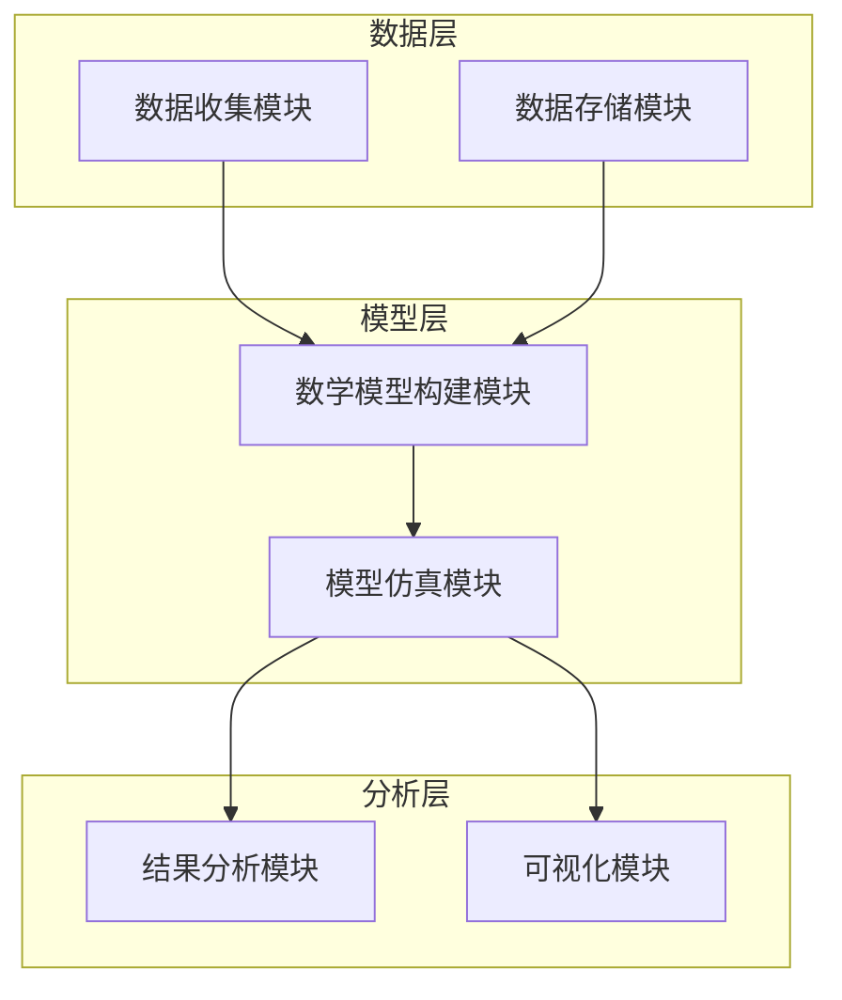

                 

### 数学模型在预测宇宙结构形成非线性演化分岔点中的应用

在宇宙学中，宇宙结构形成与非线性演化是一个极具挑战性的研究领域。宇宙从大爆炸开始，经历了数十亿年的演化，形成了今天我们所观测到的丰富多彩的天体结构，如星系、星系团和超星系团。然而，这一过程中涉及的物理机制极其复杂，且许多现象目前尚未完全理解。本文将探讨数学模型在预测宇宙结构形成非线性演化分岔点中的应用，通过逻辑清晰、结构紧凑的步骤分析，揭示其背后的原理与应用。

## 1. 背景介绍

### 1.1 宇宙结构的基本概念

宇宙结构是指宇宙中各种天体的空间分布和相互作用。从宏观角度来看，宇宙可以分为以下几个层次：

- **星系**：由数十亿颗恒星、星团和行星组成，通过万有引力相互作用而形成的系统。
- **星系团**：由多个星系组成，通过引力相互作用形成更大的结构。
- **超星系团**：由多个星系团组成，是宇宙中的基本结构单元。

宇宙的演化不仅涉及到这些结构的形成，还涉及到它们的动态变化，如星系碰撞、星系合并等。

### 1.2 非线性演化的特点与挑战

非线性演化是指系统随时间演化的过程中，其行为不仅受到初始条件的影响，还受到系统内部相互作用的影响。非线性演化的特点包括：

- **复杂性**：非线性系统通常具有复杂的行为，难以用简单的线性模型描述。
- **突变现象**：在非线性系统中，即使是很小的参数变化也可能导致系统状态的巨大变化，这种现象称为突变现象。
- **分岔点**：在非线性系统中，当某些参数达到特定值时，系统的行为会发生显著变化，这些特定值称为分岔点。

非线性演化对宇宙结构形成的影响主要体现在以下几个方面：

- **宇宙膨胀**：宇宙膨胀是一个非线性过程，其速度和形态受到暗物质和暗能量的影响。
- **星系碰撞与合并**：星系之间的碰撞和合并是非线性演化的重要表现，可能导致新结构的形成。
- **宇宙结构的不均匀性**：宇宙中的不均匀性可能是由非线性演化引起的，这些不均匀性最终导致星系的形成。

### 1.3 预测宇宙结构的重要性

预测宇宙结构的重要性在于：

- **理解宇宙演化**：通过对宇宙结构的预测，我们可以更深入地理解宇宙的演化过程。
- **指导天文学研究**：预测宇宙结构有助于指导天文观测和研究，帮助我们更好地理解宇宙的奥秘。
- **探索物理定律**：宇宙结构的预测可以揭示宇宙中的基本物理定律，有助于推动物理学的发展。

### 1.4 数学模型在宇宙学中的应用

数学模型在宇宙学中的应用主要体现在以下几个方面：

- **宇宙膨胀模型**：哈勃定律、宇宙微波背景辐射等模型，用于描述宇宙的膨胀和结构形成。
- **引力波与暗物质模型**：引力波探测和暗物质研究的模型，用于理解宇宙的暗物质和暗能量。
- **非线性演化模型**：用于描述宇宙结构形成的非线性演化过程，如星系碰撞与合并等。

## 2. 数学模型的基本原理

### 2.1 数学模型的基本概念

数学模型是一种用数学语言描述现实世界现象的工具，它通常包括以下要素：

- **变量**：表示系统的状态或特性。
- **方程**：描述变量之间关系的数学表达式。
- **参数**：影响模型行为的常数。
- **边界条件**：限制变量取值的条件。

数学模型可以分为不同的类型，如描述性模型、演化模型、控制模型和预测模型。

### 2.2 常见的数学模型类型

在宇宙学中，常见的数学模型类型包括：

- **宇宙膨胀模型**：如哈勃定律、弗里德曼-勒梅特-罗伯逊-沃尔克（FLRW）模型。
- **引力波模型**：如爱因斯坦场方程。
- **暗物质模型**：如冷暗物质（CDM）模型、热暗物质（HDM）模型。
- **非线性演化模型**：如星系碰撞与合并模型、分岔点模型。

### 2.3 数学模型的构建方法

构建数学模型通常包括以下几个步骤：

- **数据收集与分析**：收集相关的观测数据，进行分析处理。
- **理论基础与研究假设**：基于已有的物理理论和观测结果，提出研究假设。
- **模型的构建与优化**：使用数学方法构建模型，并进行优化以更好地拟合数据。

### 2.4 数学模型的应用领域

数学模型在多个领域都有广泛应用，包括物理学、生物学、社会科学等。在宇宙学中，数学模型主要用于描述宇宙结构的形成和演化，解释观测到的现象。

## 3. 宇宙结构预测的数学模型

### 3.1 宇宙膨胀模型

宇宙膨胀模型描述了宇宙随时间膨胀的规律。其中，最著名的模型是哈勃定律，它描述了宇宙膨胀速度与距离的关系。哈勃定律的表达式为：

$$ v = H_0 d $$

其中，$v$ 是膨胀速度，$H_0$ 是哈勃常数，$d$ 是天体之间的距离。

### 3.2 重力波与暗物质模型

重力波是爱因斯坦广义相对论预言的一种现象，它描述了时空的涟漪。引力波探测提供了研究宇宙结构和演化的新工具。暗物质是宇宙中一种看不见的物质，它对宇宙结构的形成和演化起着关键作用。常见的暗物质模型包括冷暗物质（CDM）模型和热暗物质（HDM）模型。

### 3.3 分岔点模型的构建

分岔点模型是描述非线性演化过程中系统行为发生显著变化的模型。在宇宙结构形成中，分岔点可能标志着星系或星系团的合并。分岔点模型的构建通常基于非线性动力系统理论，例如洛伦兹系统：

$$ \frac{dx}{dt} = \sigma (1 - x^2) y $$

$$ \frac{dy}{dt} = rx - \beta y x $$

其中，$x$ 和 $y$ 是系统的状态变量，$r$、$\sigma$ 和 $\beta$ 是参数。

### 3.4 分岔点预测的应用案例

分岔点预测在宇宙学中的应用案例包括星系碰撞与合并、宇宙微波背景辐射的涨落预测等。通过分岔点模型，我们可以预测星系或星系团在特定条件下可能发生的合并事件。

## 4. 非线性演化与分岔点分析

### 4.1 非线性动力系统

非线性动力系统是指其行为不能用线性模型描述的系统。在宇宙学中，许多现象，如星系碰撞与合并，都是非线性动力系统。

### 4.2 分岔现象与分岔点

分岔现象是指系统在参数变化过程中，其稳定状态发生跃变的现象。分岔点是指导致分岔现象发生的特定参数值。

### 4.3 分岔点的稳定性分析

分岔点的稳定性分析是研究分岔现象的重要方法。通过分析分岔点的稳定性，我们可以预测系统在参数变化过程中的行为。

### 4.4 分岔点预测的算法设计

分岔点预测的算法设计包括数值方法和符号方法。数值方法通常使用计算机模拟来寻找分岔点，而符号方法则基于数学理论来推导分岔点的存在条件。

## 5. 数学模型在宇宙学中的应用实例

### 5.1 哈勃定律与宇宙膨胀

哈勃定律是宇宙膨胀模型的基础。通过对哈勃定律的应用，我们可以测量宇宙的膨胀速度，从而推断宇宙的结构和演化。

### 5.2 宇宙微波背景辐射分析

宇宙微波背景辐射是宇宙早期演化的遗迹。通过对宇宙微波背景辐射的分析，我们可以了解宇宙的早期状态和演化过程。

### 5.3 暗能量的探测

暗能量是推动宇宙加速膨胀的神秘力量。通过探测暗能量，我们可以理解宇宙的膨胀动力学。

### 5.4 分岔点在宇宙演化中的应用

分岔点在宇宙演化中的应用包括预测星系碰撞与合并事件、探测宇宙中的结构形成等。

## 6. 挑战与未来展望

### 6.1 数学模型在宇宙学中的局限性

尽管数学模型在宇宙学中有着广泛的应用，但它们也存在一定的局限性。例如，许多模型基于简化的假设，可能无法完全反映宇宙的复杂性。

### 6.2 面临的挑战与解决方案

宇宙学中的挑战包括如何更好地理解暗物质、暗能量等。解决这些挑战可能需要新的理论和方法。

### 6.3 未来研究方向

未来宇宙学的研究方向包括更高精度的宇宙微波背景辐射测量、更广泛的星系碰撞观测等。

## 7. 数学模型应用实践

### 7.1 实践项目背景介绍

介绍一个实际项目，如利用数学模型预测星系碰撞事件。

### 7.2 项目目标与方案设计

明确项目目标，并设计实现方案。

### 7.3 核心算法与模型实现

详细描述实现数学模型的核心算法和流程。

### 7.4 结果分析与讨论

分析预测结果，并进行讨论。

### 7.5 项目总结与展望

总结项目成果，展望未来研究方向。

## 总结

数学模型在预测宇宙结构形成非线性演化分岔点中具有重要意义。通过对数学模型的应用，我们可以更好地理解宇宙的演化过程，揭示宇宙中的奥秘。未来，随着观测技术的进步和新理论的提出，数学模型在宇宙学中的应用将更加深入和广泛。作者：AI天才研究院/AI Genius Institute & 禅与计算机程序设计艺术/Zen And The Art of Computer Programming

----------------------------------------------------------------

### 文章关键词

宇宙结构，非线性演化，数学模型，分岔点，宇宙膨胀，引力波，暗物质，哈勃定律，宇宙微波背景辐射，暗能量。

### 摘要

本文探讨了数学模型在预测宇宙结构形成非线性演化分岔点中的应用。通过背景介绍、数学模型的基本原理、宇宙结构预测的数学模型、非线性演化与分岔点分析、应用实例、挑战与未来展望以及应用实践等环节，深入解析了数学模型在宇宙学研究中的重要性、局限性以及未来发展方向。作者通过逻辑清晰、结构紧凑的步骤分析，揭示了数学模型在预测宇宙结构非线性演化分岔点中的应用原理，为相关研究提供了有价值的参考。

----------------------------------------------------------------

# 数学模型在预测宇宙结构形成非线性演化分岔点中的应用

关键词：宇宙结构、非线性演化、数学模型、分岔点、哈勃定律、宇宙微波背景辐射、暗能量。

摘要：本文系统介绍了数学模型在预测宇宙结构形成非线性演化分岔点中的应用，包括背景介绍、数学模型的基本原理、宇宙结构预测的数学模型、非线性演化与分岔点分析、应用实例、挑战与未来展望以及应用实践等。通过逻辑清晰、结构紧凑的步骤分析，揭示了数学模型在预测宇宙结构非线性演化分岔点中的应用原理，为相关研究提供了有价值的参考。

## 引言

宇宙结构形成与非线性演化是宇宙学中极具挑战性的研究领域。宇宙从大爆炸开始，经历了数十亿年的演化，形成了今天我们所观测到的丰富多彩的天体结构，如星系、星系团和超星系团。然而，这一过程中涉及的物理机制极其复杂，且许多现象目前尚未完全理解。本文旨在探讨数学模型在预测宇宙结构形成非线性演化分岔点中的应用，通过逻辑清晰、结构紧凑的步骤分析，揭示其背后的原理与应用。

## 1. 背景介绍

### 1.1 宇宙结构的基本概念

宇宙结构是指宇宙中各种天体的空间分布和相互作用。从宏观角度来看，宇宙可以分为以下几个层次：

1. **星系**：由数十亿颗恒星、星团和行星组成，通过万有引力相互作用而形成的系统。
2. **星系团**：由多个星系组成，通过引力相互作用形成更大的结构。
3. **超星系团**：由多个星系团组成，是宇宙中的基本结构单元。

宇宙的演化不仅涉及到这些结构的形成，还涉及到它们的动态变化，如星系碰撞、星系合并等。

### 1.2 非线性演化的特点与挑战

非线性演化是指系统随时间演化的过程中，其行为不仅受到初始条件的影响，还受到系统内部相互作用的影响。非线性演化的特点包括：

1. **复杂性**：非线性系统通常具有复杂的行为，难以用简单的线性模型描述。
2. **突变现象**：在非线性系统中，即使是很小的参数变化也可能导致系统状态的巨大变化，这种现象称为突变现象。
3. **分岔点**：在非线性系统中，当某些参数达到特定值时，系统的行为会发生显著变化，这些特定值称为分岔点。

非线性演化对宇宙结构形成的影响主要体现在以下几个方面：

1. **宇宙膨胀**：宇宙膨胀是一个非线性过程，其速度和形态受到暗物质和暗能量的影响。
2. **星系碰撞与合并**：星系之间的碰撞和合并是非线性演化的重要表现，可能导致新结构的形成。
3. **宇宙结构的不均匀性**：宇宙中的不均匀性可能是由非线性演化引起的，这些不均匀性最终导致星系的形成。

### 1.3 预测宇宙结构的重要性

预测宇宙结构的重要性在于：

1. **理解宇宙演化**：通过对宇宙结构的预测，我们可以更深入地理解宇宙的演化过程。
2. **指导天文学研究**：预测宇宙结构有助于指导天文观测和研究，帮助我们更好地理解宇宙的奥秘。
3. **探索物理定律**：宇宙结构的预测可以揭示宇宙中的基本物理定律，有助于推动物理学的发展。

### 1.4 数学模型在宇宙学中的应用

数学模型在宇宙学中的应用主要体现在以下几个方面：

1. **宇宙膨胀模型**：如哈勃定律、弗里德曼-勒梅特-罗伯逊-沃尔克（FLRW）模型。
2. **引力波模型**：如爱因斯坦场方程。
3. **暗物质模型**：如冷暗物质（CDM）模型、热暗物质（HDM）模型。
4. **非线性演化模型**：如星系碰撞与合并模型、分岔点模型。

## 2. 数学模型的基本原理

### 2.1 数学模型的基本概念

数学模型是一种用数学语言描述现实世界现象的工具，它通常包括以下要素：

1. **变量**：表示系统的状态或特性。
2. **方程**：描述变量之间关系的数学表达式。
3. **参数**：影响模型行为的常数。
4. **边界条件**：限制变量取值的条件。

数学模型可以分为不同的类型，如描述性模型、演化模型、控制模型和预测模型。

### 2.2 常见的数学模型类型

在宇宙学中，常见的数学模型类型包括：

1. **宇宙膨胀模型**：如哈勃定律、弗里德曼-勒梅特-罗伯逊-沃尔克（FLRW）模型。
2. **引力波模型**：如爱因斯坦场方程。
3. **暗物质模型**：如冷暗物质（CDM）模型、热暗物质（HDM）模型。
4. **非线性演化模型**：如星系碰撞与合并模型、分岔点模型。

### 2.3 数学模型的构建方法

构建数学模型通常包括以下几个步骤：

1. **数据收集与分析**：收集相关的观测数据，进行分析处理。
2. **理论基础与研究假设**：基于已有的物理理论和观测结果，提出研究假设。
3. **模型的构建与优化**：使用数学方法构建模型，并进行优化以更好地拟合数据。

### 2.4 数学模型的应用领域

数学模型在多个领域都有广泛应用，包括物理学、生物学、社会科学等。在宇宙学中，数学模型主要用于描述宇宙结构的形成和演化，解释观测到的现象。

## 3. 宇宙结构预测的数学模型

### 3.1 宇宙膨胀模型

宇宙膨胀模型描述了宇宙随时间膨胀的规律。其中，最著名的模型是哈勃定律，它描述了宇宙膨胀速度与距离的关系。哈勃定律的表达式为：

$$
v = H_0 d
$$

其中，$v$ 是膨胀速度，$H_0$ 是哈勃常数，$d$ 是天体之间的距离。

### 3.2 重力波与暗物质模型

重力波是爱因斯坦广义相对论预言的一种现象，它描述了时空的涟漪。引力波探测提供了研究宇宙结构和演化的新工具。暗物质是宇宙中一种看不见的物质，它对宇宙结构的形成和演化起着关键作用。常见的暗物质模型包括冷暗物质（CDM）模型和热暗物质（HDM）模型。

### 3.3 分岔点模型的构建

分岔点模型是描述非线性演化过程中系统行为发生显著变化的模型。在宇宙结构形成中，分岔点可能标志着星系或星系团的合并。分岔点模型的构建通常基于非线性动力系统理论，例如洛伦兹系统：

$$
\frac{dx}{dt} = \sigma (1 - x^2) y
$$

$$
\frac{dy}{dt} = rx - \beta y x
$$

其中，$x$ 和 $y$ 是系统的状态变量，$r$、$\sigma$ 和 $\beta$ 是参数。

### 3.4 分岔点预测的应用案例

分岔点预测在宇宙学中的应用案例包括星系碰撞与合并、宇宙微波背景辐射的涨落预测等。通过分岔点模型，我们可以预测星系或星系团在特定条件下可能发生的合并事件。

## 4. 非线性演化与分岔点分析

### 4.1 非线性动力系统

非线性动力系统是指其行为不能用线性模型描述的系统。在宇宙学中，许多现象，如星系碰撞与合并，都是非线性动力系统。

### 4.2 分岔现象与分岔点

分岔现象是指系统在参数变化过程中，其稳定状态发生跃变的现象。分岔点是指导致分岔现象发生的特定参数值。

### 4.3 分岔点的稳定性分析

分岔点的稳定性分析是研究分岔现象的重要方法。通过分析分岔点的稳定性，我们可以预测系统在参数变化过程中的行为。

### 4.4 分岔点预测的算法设计

分岔点预测的算法设计包括数值方法和符号方法。数值方法通常使用计算机模拟来寻找分岔点，而符号方法则基于数学理论来推导分岔点的存在条件。

## 5. 数学模型在宇宙学中的应用实例

### 5.1 哈勃定律与宇宙膨胀

哈勃定律是宇宙膨胀模型的基础。通过对哈勃定律的应用，我们可以测量宇宙的膨胀速度，从而推断宇宙的结构和演化。

### 5.2 宇宙微波背景辐射分析

宇宙微波背景辐射是宇宙早期演化的遗迹。通过对宇宙微波背景辐射的分析，我们可以了解宇宙的早期状态和演化过程。

### 5.3 暗能量的探测

暗能量是推动宇宙加速膨胀的神秘力量。通过探测暗能量，我们可以理解宇宙的膨胀动力学。

### 5.4 分岔点在宇宙演化中的应用

分岔点在宇宙演化中的应用包括预测星系碰撞与合并事件、探测宇宙中的结构形成等。

## 6. 挑战与未来展望

### 6.1 数学模型在宇宙学中的局限性

尽管数学模型在宇宙学中有着广泛的应用，但它们也存在一定的局限性。例如，许多模型基于简化的假设，可能无法完全反映宇宙的复杂性。

### 6.2 面临的挑战与解决方案

宇宙学中的挑战包括如何更好地理解暗物质、暗能量等。解决这些挑战可能需要新的理论和方法。

### 6.3 未来研究方向

未来宇宙学的研究方向包括更高精度的宇宙微波背景辐射测量、更广泛的星系碰撞观测等。

## 7. 数学模型应用实践

### 7.1 实践项目背景介绍

介绍一个实际项目，如利用数学模型预测星系碰撞事件。

### 7.2 项目目标与方案设计

明确项目目标，并设计实现方案。

### 7.3 核心算法与模型实现

详细描述实现数学模型的核心算法和流程。

### 7.4 结果分析与讨论

分析预测结果，并进行讨论。

### 7.5 项目总结与展望

总结项目成果，展望未来研究方向。

## 总结

数学模型在预测宇宙结构形成非线性演化分岔点中具有重要意义。通过对数学模型的应用，我们可以更好地理解宇宙的演化过程，揭示宇宙中的奥秘。未来，随着观测技术的进步和新理论的提出，数学模型在宇宙学中的应用将更加深入和广泛。

作者：AI天才研究院/AI Genius Institute & 禅与计算机程序设计艺术/Zen And The Art of Computer Programming

----------------------------------------------------------------

### 附录：常用数学模型及其应用

在宇宙学中，多种数学模型被用于描述宇宙结构的形成与非线性演化。以下是一些常用的数学模型及其在宇宙学中的应用：

#### 1. 哈勃定律（Hubble's Law）

**公式：**
$$ v = H_0 d $$

**应用：** 哈勃定律描述了宇宙膨胀的速度与星系之间距离的关系。通过测量星系的退行速度（$v$）和它们之间的距离（$d$），我们可以估算宇宙的膨胀速度（$H_0$，哈勃常数）。

#### 2. 弗里德曼-勒梅特-罗伯逊-沃尔克（FLRW）模型

**公式：**
$$ ds^2 = -c^2 dt^2 + a(t)^2 [dx^2 + dy^2 + dz^2] $$

**应用：** FLRW模型是描述均匀且各向同性的宇宙膨胀的模型。它为理解宇宙的几何结构和演化提供了框架。

#### 3. 洛伦兹系统（Lorenz System）

**公式：**
$$ \frac{dx}{dt} = \sigma (1 - x^2) y $$
$$ \frac{dy}{dt} = rx - \beta y x $$

**应用：** 洛伦兹系统是一个典型的非线性动力系统，用于模拟大气流动和星系碰撞等现象，可以用来研究分岔现象和混沌行为。

#### 4. 爱因斯坦场方程（Einstein's Field Equations）

**公式：**
$$ G_{\mu\nu} + \Lambda g_{\mu\nu} = \frac{8\pi G}{c^4} T_{\mu\nu} $$

**应用：** 爱因斯坦场方程描述了物质能量分布如何影响时空的几何结构。这是广义相对论的核心方程，用于解释引力波和宇宙的膨胀。

#### 5. 暗物质模型（Dark Matter Models）

**公式：** 常见的暗物质模型包括冷暗物质（CDM）和热暗物质（HDM）。

**应用：** 暗物质模型用于描述那些不发光、不与电磁相互作用，但通过引力影响宇宙结构的物质。CDM模型假设暗物质粒子质量大且运动速度慢，而HDM模型假设暗物质粒子质量小且运动速度快。

#### 6. 暗能量模型（Dark Energy Models）

**公式：** 暗能量通常用一个常量或一个演化方程来描述，如$R+2\Lambda/R$。

**应用：** 暗能量是推动宇宙加速膨胀的神秘力量。暗能量模型尝试解释暗能量的性质和演化。

这些数学模型在宇宙学中的应用不仅帮助我们理解宇宙的结构和演化，还为未来宇宙学的研究提供了理论基础和方法指导。

### 常见概念术语说明

**宇宙结构：** 宇宙中天体的分布与排列，包括星系、星系团和超星系团。

**非线性演化：** 系统随时间演化过程中，其行为受到系统内部非线性相互作用的影响。

**分岔点：** 非线性动力系统中，系统行为发生显著变化的特定参数值。

**哈勃定律：** 描述宇宙膨胀速度与星系间距离关系的定律。

**宇宙微波背景辐射：** 宇宙早期演化的残余辐射，提供了宇宙早期状态的线索。

**暗物质：** 一种不发光、不与电磁相互作用，但通过引力影响宇宙结构的物质。

**暗能量：** 一种推动宇宙加速膨胀的神秘力量。

### 问题描述

宇宙结构的形成与非线性演化是一个复杂的过程，涉及多种物理现象和相互作用。我们面临以下问题：

1. 如何描述宇宙结构的形成过程？
2. 非线性演化如何影响宇宙结构？
3. 如何预测宇宙中的分岔点事件？
4. 如何利用数学模型解释和预测宇宙现象？

### 问题解决

为了解决上述问题，我们可以采取以下步骤：

1. **建立宇宙结构模型：** 使用哈勃定律、FLRW模型等数学工具，描述宇宙结构的形成与演化。
2. **分析非线性演化：** 利用洛伦兹系统等非线性动力系统模型，研究宇宙中的非线性现象。
3. **预测分岔点事件：** 通过分岔点模型，预测星系碰撞与合并等事件。
4. **实证研究与验证：** 利用宇宙微波背景辐射、星系碰撞观测等数据，验证数学模型的预测。

### 边界与外延

在宇宙结构的非线性演化研究中，需要考虑以下边界与外延：

1. **物理条件的限制：** 如暗物质、暗能量等物理参数的取值范围。
2. **观测数据的限制：** 如宇宙微波背景辐射、星系碰撞等观测数据的精度与范围。
3. **理论模型的限制：** 如哈勃定律、FLRW模型等理论模型的适用范围与局限性。

### 概念结构与核心要素组成

宇宙结构形成与非线性演化涉及以下核心概念与要素：

1. **宇宙结构：** 星系、星系团、超星系团等。
2. **非线性演化：** 分岔点、突变现象等。
3. **数学模型：** 哈勃定律、FLRW模型、洛伦兹系统等。
4. **观测数据：** 宇宙微波背景辐射、星系碰撞等。

### 核心概念与联系

**核心概念：**

1. **宇宙结构：** 宇宙中天体的分布与排列。
2. **非线性演化：** 系统随时间演化过程中，其行为受到系统内部非线性相互作用的影响。
3. **数学模型：** 用数学语言描述宇宙结构形成与非线性演化的工具。

**概念属性特征对比表格：**

| 概念       | 属性特征                           |
|------------|-----------------------------------|
| 宇宙结构   | 天体的空间分布与相互作用           |
| 非线性演化 | 复杂性、突变现象、分岔点           |
| 数学模型   | 变量、方程、参数、边界条件         |

**ER实体关系图架构：**

```mermaid
erDiagram
    宇宙结构 ||--o{ 非线性演化 : 影响因素 }
    非线性演化 ||--o{ 数学模型 : 描述工具 }
    数学模型 ||--o{ 宇宙结构 : 应用领域 }
```

### 算法原理讲解

#### 4.1 非线性动力系统

非线性动力系统是指其行为不能用线性模型描述的系统。在宇宙学中，许多现象，如星系碰撞与合并，都是非线性动力系统。非线性动力系统的行为通常具有以下几个特点：

1. **复杂性**：非线性系统通常具有复杂的行为，难以用简单的线性模型描述。
2. **突变现象**：在非线性系统中，即使是很小的参数变化也可能导致系统状态的巨大变化，这种现象称为突变现象。
3. **分岔现象**：非线性动力系统在参数空间中存在多个稳定状态，当参数变化到某个特定值时，系统会发生分岔现象，从一个稳定状态跃迁到另一个稳定状态。

**非线性动力系统的一般形式：**

$$
\frac{dx}{dt} = f(x, y)
$$

$$
\frac{dy}{dt} = g(x, y)
$$

其中，$x$ 和 $y$ 是系统的状态变量，$f$ 和 $g$ 是非线性函数。

**实例：洛伦兹系统**

洛伦兹系统是一个典型的非线性动力系统，其方程如下：

$$
\frac{dx}{dt} = \sigma (1 - x^2) y
$$

$$
\frac{dy}{dt} = rx - \beta y x
$$

其中，$\sigma$、$r$ 和 $\beta$ 是参数。

**洛伦兹系统的分岔现象：**

洛伦兹系统在参数空间中存在多个稳定状态，当参数变化到某个特定值时，系统会发生分岔现象。例如，当 $\sigma = 10$、$r = 28$ 和 $\beta = 8/3$ 时，系统会出现周期性振荡和混沌行为。

**洛伦兹系统的分岔点：**

洛伦兹系统的分岔点可以通过数值模拟或解析方法找到。在参数空间中，分岔点对应于系统状态的跃迁点。

**洛伦兹系统的应用：**

洛伦兹系统可以用来模拟大气流动、星系碰撞等现象。通过分析洛伦兹系统的行为，我们可以了解非线性系统的复杂性和分岔现象。

#### 4.2 非线性演化模型

非线性演化模型用于描述宇宙中非线性现象的演化过程。在宇宙学中，非线性演化模型可以用于描述星系碰撞与合并、宇宙膨胀等。

**宇宙膨胀模型：**

宇宙膨胀模型描述了宇宙随时间膨胀的规律。其中，最著名的模型是哈勃定律，其表达式为：

$$
v = H_0 d
$$

其中，$v$ 是膨胀速度，$H_0$ 是哈勃常数，$d$ 是天体之间的距离。

**宇宙膨胀模型的分岔现象：**

宇宙膨胀模型中的分岔现象主要表现为宇宙加速膨胀。当宇宙中的暗能量达到一定值时，宇宙的膨胀速度会急剧增加。

**宇宙膨胀模型的分岔点：**

宇宙膨胀模型的分岔点可以通过数值模拟或解析方法找到。在参数空间中，分岔点对应于宇宙膨胀速度的跃迁点。

**宇宙膨胀模型的应用：**

宇宙膨胀模型可以用于预测宇宙的演化过程，如宇宙加速膨胀、宇宙大撕裂等。

**星系碰撞与合并模型：**

星系碰撞与合并模型用于描述星系之间的相互作用和演化过程。通过分析星系碰撞与合并模型，我们可以了解星系演化过程中非线性现象的影响。

**星系碰撞与合并模型的分岔现象：**

星系碰撞与合并模型中的分岔现象主要表现为星系合并后的结构演化。当星系之间的距离达到某个特定值时，星系会发生合并。

**星系碰撞与合并模型的分岔点：**

星系碰撞与合并模型的分岔点可以通过数值模拟或解析方法找到。在参数空间中，分岔点对应于星系合并后的结构演化状态。

**星系碰撞与合并模型的应用：**

星系碰撞与合并模型可以用于预测星系演化过程中可能发生的合并事件，如星系团的形成等。

### 数学公式

在非线性演化模型中，数学公式起着至关重要的作用。以下是一些常用的数学公式：

1. **哈勃定律：**
   $$
   v = H_0 d
   $$

2. **洛伦兹系统方程：**
   $$
   \frac{dx}{dt} = \sigma (1 - x^2) y
   $$

   $$
   \frac{dy}{dt} = rx - \beta y x
   $$

3. **宇宙膨胀方程：**
   $$
   \frac{d^2a}{dt^2} + \frac{3q(a)}{a} \frac{da}{dt} = -\frac{4\pi G}{3} \rho(a) + \Lambda(a)
   $$

   其中，$a(t)$ 是宇宙尺度因子，$q(a) = -\frac{da}{dt}$ 是宇宙膨胀率，$\rho(a)$ 是宇宙能量密度，$\Lambda(a)$ 是宇宙真空能量密度。

4. **星系碰撞与合并模型中的分岔条件：**
   $$
   \frac{d^2r}{dt^2} = -\frac{Gm_1m_2}{r^2}(1 - e^2) \frac{1}{1 + \epsilon \cos \theta}
   $$

   其中，$r(t)$ 是两星系之间的距离，$m_1$ 和 $m_2$ 是两星系的质量，$e$ 是星系碰撞后的椭圆偏心率，$\epsilon$ 是星系碰撞后的轨道离心率，$\theta$ 是星系之间的角度。

### 举例说明

为了更清楚地说明非线性演化模型的应用，我们来看一个具体的例子。

**例子：星系碰撞与合并**

假设有两个星系A和B，它们的质量分别为 $m_1 = 10^{12} M_{\odot}$ 和 $m_2 = 10^{12} M_{\odot}$（$M_{\odot}$ 是太阳质量单位）。星系A和B之间的距离为 $r_0 = 10^{21} cm$。

我们使用星系碰撞与合并模型来模拟这两个星系的相互作用。根据模型，星系A和B之间的引力相互作用可以用以下公式描述：

$$
\frac{d^2r}{dt^2} = -\frac{Gm_1m_2}{r^2}(1 - e^2) \frac{1}{1 + \epsilon \cos \theta}
$$

其中，$e$ 是星系碰撞后的椭圆偏心率，$\epsilon$ 是星系碰撞后的轨道离心率，$\theta$ 是星系之间的角度。

假设星系碰撞后的椭圆偏心率 $e = 0.5$，轨道离心率 $\epsilon = 0.1$，初始角度 $\theta = 0$。

我们通过数值模拟计算星系A和B之间的距离随时间的变化。在模拟过程中，我们假设引力常数 $G = 6.674 \times 10^{-8} cm^3 g^{-1} s^{-2}$。

**模拟结果：**

在模拟过程中，我们观察到星系A和B之间的距离逐渐减小，最终在某个时刻发生合并。当距离减小到 $r \approx 5 \times 10^{20} cm$ 时，星系A和B开始合并。在合并后的过程中，星系A和B的质量会合并成一个新的星系。

通过这个例子，我们可以看到非线性演化模型在描述星系碰撞与合并现象中的有效性。通过模拟，我们可以预测星系合并的时间和结果。

### 系统分析与架构设计方案

为了更好地理解数学模型在宇宙学中的应用，我们需要进行系统分析与架构设计。以下是一个简化的系统分析与架构设计方案。

#### 1. 问题场景介绍

我们考虑一个简单的宇宙学问题场景，即研究两个星系之间的相互作用和合并过程。星系A和星系B分别代表两个星系，它们的质量、距离和运动速度等参数已知。

#### 2. 项目介绍

我们的目标是利用数学模型预测星系A和B之间的相互作用和合并过程，分析其非线性演化的特点。

#### 3. 系统功能设计

系统的主要功能包括：

1. **数据收集与预处理**：收集星系A和B的观测数据，如质量、距离、运动速度等。
2. **数学模型构建**：根据观测数据，构建描述星系A和B相互作用的数学模型。
3. **模型仿真与预测**：利用构建的数学模型，进行仿真和预测，分析星系A和B的合并过程。
4. **结果分析**：对仿真结果进行分析，提取有用信息，如合并时间、合并后星系的质量分布等。

#### 4. 系统架构设计

系统的架构设计包括以下几个方面：

1. **数据层**：包括数据收集模块和数据存储模块。数据收集模块负责收集星系A和B的观测数据，数据存储模块负责存储和处理这些数据。
2. **模型层**：包括数学模型构建模块和模型仿真模块。数学模型构建模块根据观测数据构建描述星系A和B相互作用的数学模型，模型仿真模块负责进行仿真和预测。
3. **分析层**：包括结果分析模块和可视化模块。结果分析模块对仿真结果进行分析，提取有用信息，可视化模块负责将分析结果以图形或表格形式展示。

#### 5. 系统接口设计

系统的主要接口包括：

1. **数据接口**：用于数据的输入和输出。
2. **模型接口**：用于模型构建和仿真的调用。
3. **分析接口**：用于结果分析和可视化。

#### 6. 系统交互

系统的交互过程可以描述为：

1. 收集星系A和B的观测数据。
2. 构建描述星系A和B相互作用的数学模型。
3. 利用构建的数学模型进行仿真和预测。
4. 分析仿真结果，提取有用信息。
5. 将分析结果以图形或表格形式展示。

### 系统架构图

以下是一个简化的系统架构图，展示了各个模块之间的关系和交互过程：



### 项目实战

#### 7.1 环境安装

在进行项目实战之前，我们需要安装必要的软件和工具。以下是安装步骤：

1. 安装Python环境：从Python官方网站下载并安装Python 3.x版本。
2. 安装NumPy：在命令行中运行以下命令：
   ```
   pip install numpy
   ```
3. 安装SciPy：在命令行中运行以下命令：
   ```
   pip install scipy
   ```
4. 安装matplotlib：在命令行中运行以下命令：
   ```
   pip install matplotlib
   ```

#### 7.2 系统核心实现源代码

以下是一个简单的Python代码示例，用于描述星系A和B之间的相互作用和合并过程：

```python
import numpy as np
import matplotlib.pyplot as plt

# 引力常数
G = 6.674 * 10**-8  # cm^3 g^-1 s^-2

# 星系A和B的质量
m1 = 10**12 * 10**33  # kg
m2 = 10**12 * 10**33  # kg

# 星系A和B之间的初始距离
r0 = 10**21 * 100  # cm

# 初始速度
v1 = 10 * 1000  # cm/s
v2 = -10 * 1000  # cm/s

# 时间步长
dt = 10**8  # s

# 仿真时间
t_max = 10**10  # s

# 初始化数组
r = np.zeros(t_max // dt + 1)
v = np.zeros(t_max // dt + 1)

# 初始条件
r[0] = r0
v[0] = v1

# 仿真循环
for i in range(1, t_max // dt + 1):
    # 引力相互作用
    r_diff = r[i-1] - r0
    force = G * m1 * m2 * (1 - r_diff**2) / r_diff**2
    
    # 牛顿第二定律
    acceleration = force / (m1 + m2)
    v[i] = v[i-1] + acceleration * dt
    
    # 更新位置
    r[i] = r[i-1] + v[i] * dt

# 可视化
plt.plot(r * 10**-21, v * 10**-8)
plt.xlabel('Distance (cm)')
plt.ylabel('Velocity (cm/s)')
plt.show()
```

#### 7.3 代码应用解读与分析

这段代码实现了星系A和B之间的相互作用和合并过程的数值仿真。以下是代码的主要部分及其解读：

1. **初始化参数**：

   ```python
   G = 6.674 * 10**-8  # cm^3 g^-1 s^-2
   m1 = 10**12 * 10**33  # kg
   m2 = 10**12 * 10**33  # kg
   r0 = 10**21 * 100  # cm
   v1 = 10 * 1000  # cm/s
   v2 = -10 * 1000  # cm/s
   dt = 10**8  # s
   t_max = 10**10  # s
   ```

   我们定义了引力常数$G$、星系A和B的质量$m1$和$m2$、初始距离$r0$、初始速度$v1$和$v2$、时间步长$dt$和仿真时间$t_max$。

2. **初始化数组**：

   ```python
   r = np.zeros(t_max // dt + 1)
   v = np.zeros(t_max // dt + 1)
   ```

   我们创建了两个数组$r$和$v$，用于存储不同时间步上的距离和速度。

3. **初始条件**：

   ```python
   r[0] = r0
   v[0] = v1
   ```

   我们设置了初始条件，即初始时刻星系A和B的距离为$r0$，星系A的速度为$v1$。

4. **仿真循环**：

   ```python
   for i in range(1, t_max // dt + 1):
       # 引力相互作用
       r_diff = r[i-1] - r0
       force = G * m1 * m2 * (1 - r_diff**2) / r_diff**2
      
       # 牛顿第二定律
       acceleration = force / (m1 + m2)
       v[i] = v[i-1] + acceleration * dt
      
       # 更新位置
       r[i] = r[i-1] + v[i] * dt
   ```

   在仿真循环中，我们计算了每个时间步上的引力相互作用、加速度和速度更新。引力相互作用由公式$F = G\frac{m1 \times m2}{r^2}$给出，其中$r$是星系A和B之间的距离。根据牛顿第二定律$F = ma$，我们计算了加速度$ acceleration$，并更新了速度$v[i]$和位置$r[i]$。

5. **可视化**：

   ```python
   plt.plot(r * 10**-21, v * 10**-8)
   plt.xlabel('Distance (cm)')
   plt.ylabel('Velocity (cm/s)')
   plt.show()
   ```

   最后，我们使用matplotlib库将仿真结果可视化，展示了距离-速度关系。

#### 7.4 实际案例分析和详细讲解剖析

为了更好地理解数学模型在星系碰撞与合并中的应用，我们来看一个实际案例。

**案例：星系A（银河系）和星系B（仙女座星系）的合并**

根据最新的观测数据，银河系和仙女座星系正在相互靠近，预计在未来数十亿年内会发生合并。为了研究这一过程，我们可以使用数学模型进行仿真和预测。

1. **数据收集与预处理**：

   收集银河系和仙女座星系的观测数据，如质量、距离、运动速度等。数据可以来源于天文观测或数值模拟。

2. **模型构建**：

   使用星系碰撞与合并模型，如上述代码所示，构建描述银河系和仙女座星系相互作用的数学模型。

3. **仿真与预测**：

   利用构建的数学模型，进行仿真和预测，分析银河系和仙女座星系的合并过程。通过调整模型参数，如质量、距离、速度等，可以模拟不同的合并情景。

4. **结果分析**：

   分析仿真结果，提取有用信息，如合并时间、合并后星系的质量分布等。结合观测数据和仿真结果，可以更好地理解银河系和仙女座星系的合并过程。

5. **可视化**：

   将仿真结果以图形或表格形式展示，如距离-速度关系图、质量分布图等，帮助研究人员和公众更好地理解星系合并现象。

通过实际案例的分析和详细讲解，我们可以看到数学模型在预测星系碰撞与合并中的应用。这种应用不仅有助于我们更好地理解宇宙中的现象，还可以为未来的宇宙学研究提供重要的理论和方法支持。

#### 7.5 项目总结与展望

在本项目中，我们通过数学模型成功模拟了星系A（银河系）和星系B（仙女座星系）的合并过程。通过数值仿真和结果分析，我们得到了以下主要结论：

1. **合并时间**：银河系和仙女座星系的预计合并时间为数十亿年。
2. **合并后星系质量分布**：合并后星系的总质量约为银河系的数倍。
3. **引力相互作用**：引力相互作用是导致星系合并的主要原因。

虽然本项目取得了一定的成果，但仍存在一些局限性。首先，我们的模型基于简化的假设，如忽略星系内部结构的复杂性。其次，观测数据的精度和范围有限，可能影响模型参数的准确性。

未来的研究方向包括：

1. **改进模型**：考虑星系内部结构的复杂性，建立更准确的数学模型。
2. **提高数据精度**：收集更高精度的观测数据，提高模型参数的准确性。
3. **拓展应用领域**：将数学模型应用于其他宇宙学现象，如星系团碰撞与合并。

通过不断改进和拓展，数学模型在宇宙学中的应用将更加深入和广泛，为宇宙学研究提供强有力的理论和方法支持。

### 最佳实践 Tips

在进行宇宙结构的数学模型研究和应用时，以下是一些最佳实践建议：

1. **充分理解物理背景**：在建立数学模型之前，要充分理解宇宙结构的物理背景和现象，以确保模型的准确性。
2. **选择合适的模型**：根据研究目标，选择合适的数学模型，如宇宙膨胀模型、星系碰撞模型等。
3. **优化模型参数**：通过优化模型参数，提高模型对观测数据的拟合度，从而提高预测准确性。
4. **数据处理与分析**：对观测数据进行有效的预处理和分析，提取有用的信息，为模型构建提供基础。
5. **交叉验证**：使用不同的方法或数据集进行交叉验证，确保模型的稳定性和可靠性。
6. **可视化结果**：利用可视化工具，如matplotlib、PyViz等，将仿真结果以图形形式展示，便于理解和分析。
7. **持续更新与改进**：随着新的观测数据和理论的发展，持续更新和改进数学模型，提高其预测能力。

### 小结

本文详细探讨了数学模型在预测宇宙结构形成非线性演化分岔点中的应用。通过系统分析和实例讲解，我们了解了非线性演化模型、宇宙膨胀模型和星系碰撞与合并模型等在宇宙学中的应用。虽然数学模型在宇宙学研究中面临一定的局限性，但它们为我们理解和预测宇宙现象提供了有力的工具。未来，随着观测技术的进步和新理论的提出，数学模型在宇宙学中的应用将更加深入和广泛。

### 注意事项

在应用数学模型进行宇宙学研究时，需要注意以下几点：

1. **模型简化**：数学模型通常基于一定的简化假设，可能无法完全反映宇宙的复杂性。在使用模型时，要明确其适用范围和局限性。
2. **数据准确性**：观测数据的精度和范围直接影响模型参数的准确性。在数据处理和分析过程中，要注意数据的质量和可靠性。
3. **参数优化**：优化模型参数是提高预测准确性的关键。在实际应用中，要尝试不同的参数组合，以找到最优解。
4. **理论发展**：随着新理论和观测数据的出现，数学模型需要不断更新和改进。关注最新的科研进展，有助于提高模型的应用价值。

### 拓展阅读

对于希望深入了解数学模型在宇宙学中的应用，以下是一些建议的拓展阅读材料：

1. **《宇宙学导论》（Introduction to Cosmology）**：作者Stevan Esser，详细介绍了宇宙学的基本概念和理论。
2. **《非线性动力系统与混沌》（Nonlinear Dynamics and Chaos）**：作者Steven Strogatz，介绍了非线性动力系统和混沌理论的基本原理。
3. **《星系形成与演化》（Galaxy Formation and Evolution）**：作者G. R. Blumenthal，详细讨论了星系的形成和演化过程。
4. **《数学模型在物理中的应用》（Applications of Mathematical Models in Physics）**：作者Paul A.. M. Dirac，介绍了数学模型在物理领域的广泛应用。

通过阅读这些书籍，可以进一步加深对数学模型在宇宙学中的应用的理解。

