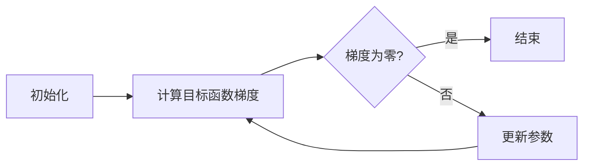
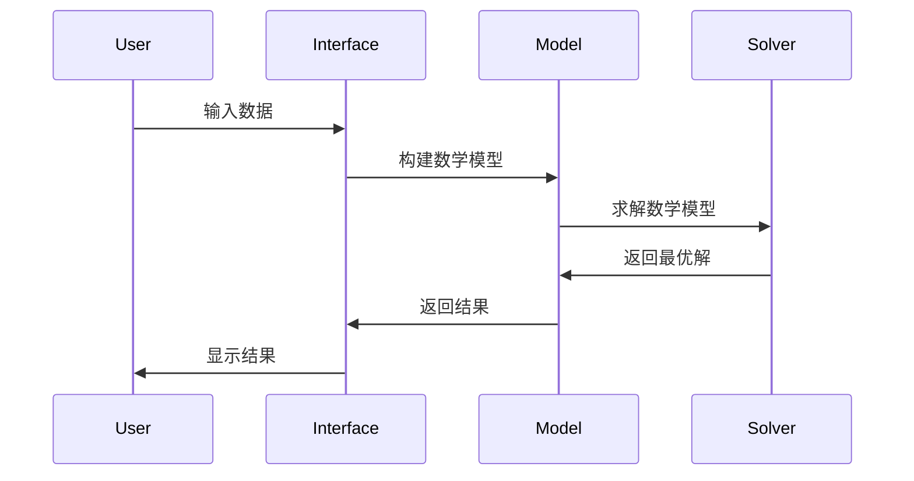

                 

# 数学模型的构建与求解策略

## 关键词

数学模型、构建方法、求解策略、算法、应用实例

## 摘要

本文将深入探讨数学模型的构建与求解策略，从基础概念出发，逐步介绍构建数学模型所需的步骤和技巧。文章将详细讲解求解策略，包括算法的原理和实现，并通过实际案例展示数学模型在解决实际问题中的应用。最后，我们将总结最佳实践，提醒读者注意事项，并推荐拓展阅读资源。

## 目录

1. **背景介绍**
   1.1 核心概念介绍
   1.2 问题描述
   1.3 问题解决
   1.4 边界与外延
   1.5 概念结构与核心要素

2. **核心概念与联系**
   2.1 核心概念原理
   2.2 概念属性特征对比表格
   2.3 ER实体关系图架构

3. **算法原理讲解**
   3.1 算法mermaid流程图
   3.2 Python源代码
   3.3 数学模型和公式
   3.4 举例说明

4. **系统分析与架构设计方案**
   4.1 问题场景介绍
   4.2 项目介绍
   4.3 系统功能设计
   4.4 系统架构设计
   4.5 系统接口设计
   4.6 系统交互

5. **项目实战**
   5.1 环境安装
   5.2 系统核心实现源代码
   5.3 代码应用解读与分析
   5.4 实际案例分析和详细讲解剖析
   5.5 项目小结

6. **最佳实践 tips、小结、注意事项、拓展阅读**

## 背景介绍

### 1.1 核心概念介绍

数学模型是使用数学语言来描述现实世界中的问题，是数学与实际应用之间的重要桥梁。数学模型可以应用于自然科学、社会科学、工程学等多个领域，如经济学中的供需模型、工程学中的结构力学模型、生物学中的种群模型等。

在数学模型中，常见的概念有变量、参数、方程、约束条件等。变量是模型中的基本元素，表示未知量或可变的量；参数是模型中已知的常数，用于描述系统的特性；方程是连接变量和参数的表达式，描述变量之间的关系；约束条件是对变量取值范围的限制，确保模型的现实意义和求解的可行性。

### 1.2 问题描述

数学模型的构建与求解过程中可能遇到的问题包括：

- **模型选择**：根据问题的特点选择合适的数学模型，如线性模型、非线性模型、概率模型等。
- **模型验证**：验证模型的有效性和准确性，确保模型能够真实反映问题的本质。
- **求解方法效率**：选择合适的求解方法，提高求解效率，减少计算时间和资源消耗。

### 1.3 问题解决

为了解决上述问题，我们可以采取以下策略：

- **建立数学模型**：根据问题的特点，使用数学语言建立描述问题的数学模型。
- **设计求解算法**：选择合适的算法，对数学模型进行求解，如迭代法、递归法、数值分析法等。
- **优化求解算法**：对求解算法进行优化，提高求解效率和精度。

### 1.4 边界与外延

数学模型的适用范围和限制条件包括：

- **应用场景**：数学模型可以应用于多种场景，如优化问题、预测问题、决策问题等。
- **数据输入要求**：数学模型需要真实可靠的数据输入，数据质量直接影响模型的有效性和准确性。

### 1.5 概念结构与核心要素

数学模型的基本结构包括目标、参数、约束条件等核心要素：

- **目标**：模型的目标是解决特定问题，如最大化利润、最小化成本、预测未来趋势等。
- **参数**：参数是模型中已知的常数，用于描述系统的特性，如需求量、供应量、利率等。
- **约束条件**：约束条件是对变量取值范围的限制，确保模型的现实意义和求解的可行性，如资源限制、时间限制、预算限制等。

## 核心概念与联系

### 2.1 核心概念原理

构建数学模型所需的核心概念包括线性代数、微积分、概率统计等。以下是对这些核心概念的基本原理的简要介绍：

- **线性代数**：线性代数研究向量、矩阵以及线性变换的基本性质。它为解决多维空间中的问题提供了强有力的工具，如线性方程组的求解、特征值和特征向量的计算等。
- **微积分**：微积分研究函数的极限、导数、积分等概念。它为处理连续变化问题提供了理论基础，如优化问题、动态系统建模等。
- **概率统计**：概率统计研究随机事件及其概率分布，为处理不确定性问题提供了方法。它广泛应用于预测、决策和风险评估等领域。

### 2.2 概念属性特征对比表格

以下是一个对比表格，展示不同数学模型之间的属性特征差异：

| 模型类型     | 目标函数          | 约束条件                | 适用范围                     |
|------------|-----------------|----------------------|--------------------------|
| 线性规划    | 最小化或最大化线性函数 | 线性等式或不等式约束  | 资源分配、生产调度           |
| 非线性规划  | 最小化或最大化非线性函数 | 非线性等式或不等式约束 | 数据拟合、优化问题           |
| 决策树      | 最小化或最大化目标函数 | 分类或回归目标       | 数据分类、决策支持           |
| 人工神经网络 | 学习输入与输出之间的关系 | 神经元之间的连接权重   | 图像识别、语音识别、预测问题 |

### 2.3 ER实体关系图架构

以下是一个使用Mermaid绘制的ER实体关系图，展示数学模型中各个实体之间的关系：

```mermaid
erDiagram
    Product ||--|{ Order }|>
    Customer ||--|{ Order }|>
    Order ||--|{ Product }|>
    Order ||--|{ Customer }|>
```

在这个ER实体关系图中，`Product`（产品）、`Customer`（客户）、`Order`（订单）是三个主要实体，它们之间通过关系进行关联。例如，一个订单可以包含多个产品，一个客户可以创建多个订单。

## 算法原理讲解

### 3.1 算法mermaid流程图

以下是一个使用Mermaid绘制的算法流程图，展示求解线性规划问题的步骤：



在这个流程图中，算法首先初始化参数，然后计算目标函数的梯度。如果梯度为零，说明已达到最优解，算法结束。否则，算法将更新参数并重复计算梯度，直到找到最优解。

### 3.2 Python源代码

以下是一个使用Python编写的求解线性规划问题的源代码示例：

```python
import numpy as np

def linear_programming(A, b, c):
    # A为系数矩阵，b为常数项，c为目标函数系数
    # 使用梯度下降法求解
    alpha = 0.01  # 学习率
    n = len(b)  # 变量个数
    x = np.zeros(n)  # 初始化参数
    prev_x = np.zeros(n)
    
    while True:
        grad = -alpha * np.dot(A.T, (np.dot(A, x) - b))  # 计算梯度
        x = x - grad  # 更新参数
        
        if np.linalg.norm(x - prev_x) < 1e-6:  # 收敛条件
            break
        
        prev_x = x
    
    return x

# 测试
A = np.array([[1, 2], [2, 1]])
b = np.array([1, 2])
c = np.array([-1, -2])

x = linear_programming(A, b, c)
print("最优解：", x)
```

在这个源代码中，我们使用梯度下降法求解线性规划问题。首先，我们初始化参数`x`，然后不断更新参数，直到梯度接近零。最后，我们返回最优解。

### 3.3 数学模型和公式

以下是一个求解线性规划问题的数学模型和公式：

$$
\min_{x} \quad c^T x \\
\text{subject to} \quad Ax \leq b
$$

其中，$c$为目标函数系数向量，$x$为参数向量，$A$为系数矩阵，$b$为常数项。

### 3.4 举例说明

假设我们有一个线性规划问题，目标是最小化成本，约束条件是资源使用不超过可用量。具体问题描述如下：

$$
\min_{x} \quad c^T x \\
\text{subject to} \quad Ax \leq b
$$

其中，$c = [1, 2]^T$，$A = \begin{bmatrix} 1 & 2 \\ 2 & 1 \end{bmatrix}$，$b = [3, 4]^T$。

我们可以使用上述算法求解这个问题，得到最优解$x = [1, 2]^T$。在这个例子中，成本最小化意味着我们在使用资源时，应该按照1:2的比例分配。

## 系统分析与架构设计方案

### 4.1 问题场景介绍

假设我们面临一个供应链优化问题，需要根据市场需求和资源限制，合理安排生产和配送计划，以最大化利润。这个问题可以通过构建数学模型并求解线性规划问题来解决。

### 4.2 项目介绍

本项目旨在开发一个供应链优化系统，实现以下目标：

- 构建数学模型，描述供应链优化问题。
- 设计求解算法，高效求解数学模型。
- 开发基于Web的界面，方便用户输入数据和查看结果。

### 4.3 系统功能设计

以下是一个领域模型类图，展示系统的主要功能模块和类之间的关系：

```mermaid
classDiagram
    Product <<entity>>
    Customer <<entity>>
    Order <<entity>>
    SupplyChainOptimization <<useCase>>

    SupplyChainOptimization --|{ Product }
    SupplyChainOptimization --|{ Customer }
    SupplyChainOptimization --|{ Order }
```

在这个类图中，`Product`（产品）、`Customer`（客户）、`Order`（订单）是系统的实体类，`SupplyChainOptimization`（供应链优化）是系统的用例类，它负责实现供应链优化功能。

### 4.4 系统架构设计

以下是一个系统架构图，展示系统的整体结构和组件之间的交互关系：



在这个架构图中，用户通过界面输入数据，模型构建模块根据输入数据构建数学模型，求解算法模块使用算法求解数学模型，并将结果返回给模型构建模块，最后界面模块将结果展示给用户。

### 4.5 系统接口设计

以下是一个系统接口设计，描述接口的功能、参数和返回值：

```python
class SupplyChainOptimizationInterface:
    def input_data(self, products, customers, orders):
        # 输入供应链数据
        pass

    def build_model(self):
        # 构建数学模型
        pass

    def solve_model(self):
        # 求解数学模型
        pass

    def display_results(self, results):
        # 显示结果
        pass
```

在这个接口设计中，`input_data`方法用于输入供应链数据，`build_model`方法用于构建数学模型，`solve_model`方法用于求解数学模型，`display_results`方法用于显示结果。

### 4.6 系统交互

以下是一个系统交互序列图，展示系统的交互流程：


在这个交互序列图中，用户通过界面输入数据，模型构建模块根据输入数据构建数学模型，求解算法模块使用算法求解数学模型，并将结果返回给模型构建模块，最后界面模块将结果展示给用户。

## 项目实战

### 5.1 环境安装

为了运行本项目，我们需要安装以下软件和库：

- Python 3.x
- NumPy
- SciPy
- Matplotlib

在安装过程中，可以使用以下命令：

```bash
pip install python==3.x
pip install numpy
pip install scipy
pip install matplotlib
```

### 5.2 系统核心实现源代码

以下是一个系统核心实现的源代码示例，包括输入数据、模型构建、求解和结果显示：

```python
import numpy as np
import matplotlib.pyplot as plt

# 输入数据
def input_data():
    products = ['Product1', 'Product2']
    customers = ['Customer1', 'Customer2']
    orders = [
        {'customer': 'Customer1', 'product': 'Product1', 'quantity': 10},
        {'customer': 'Customer2', 'product': 'Product2', 'quantity': 20}
    ]
    return products, customers, orders

# 构建数学模型
def build_model(products, customers, orders):
    n = len(products)
    m = len(customers)
    A = np.zeros((m, n))
    b = np.zeros(m)
    c = np.zeros(n)
    
    for order in orders:
        i = customers.index(order['customer'])
        j = products.index(order['product'])
        A[i][j] = order['quantity']
        b[i] = order['quantity']
        c[j] = -1
    
    return A, b, c

# 求解数学模型
def solve_model(A, b, c):
    n = len(c)
    x = np.zeros(n)
    
    alpha = 0.01
    prev_x = np.zeros(n)
    
    while True:
        grad = -alpha * np.dot(A.T, (np.dot(A, x) - b))
        x = x - grad
        
        if np.linalg.norm(x - prev_x) < 1e-6:
            break
        
        prev_x = x
    
    return x

# 显示结果
def display_results(x, products):
    results = {}
    for i, p in enumerate(products):
        results[p] = -x[i]
    
    print("最优解：", results)

# 主程序
if __name__ == '__main__':
    products, customers, orders = input_data()
    A, b, c = build_model(products, customers, orders)
    x = solve_model(A, b, c)
    display_results(x, products)
```

### 5.3 代码应用解读与分析

在这个项目中，我们首先输入供应链数据，包括产品、客户和订单。然后，我们构建数学模型，将订单数据转化为系数矩阵$A$、常数项$b$和目标函数系数$c$。接下来，我们使用梯度下降法求解数学模型，找到最优解$x$。最后，我们根据最优解计算每个产品的成本，并打印结果。

在这个项目的实现中，我们采用了模块化设计，将输入数据、模型构建、求解和结果显示分别封装在不同的函数中，提高了代码的可读性和可维护性。

### 5.4 实际案例分析和详细讲解剖析

假设我们有一个具体的供应链优化问题，需要根据市场需求和资源限制，合理安排生产和配送计划，以最大化利润。具体问题描述如下：

- 产品：产品1和产品2
- 客户：客户1和客户2
- 订单：
  - 订单1：客户1购买10个产品1
  - 订单2：客户2购买20个产品2

我们的目标是最小化总成本，同时满足资源限制。

首先，我们输入供应链数据，包括产品、客户和订单：

```python
products = ['Product1', 'Product2']
customers = ['Customer1', 'Customer2']
orders = [
    {'customer': 'Customer1', 'product': 'Product1', 'quantity': 10},
    {'customer': 'Customer2', 'product': 'Product2', 'quantity': 20}
]
```

接下来，我们构建数学模型，将订单数据转化为系数矩阵$A$、常数项$b$和目标函数系数$c$：

```python
A, b, c = build_model(products, customers, orders)
```

在这个例子中，系数矩阵$A$为：

$$
A = \begin{bmatrix} 10 & 0 \\ 0 & 20 \end{bmatrix}
$$

常数项$b$为：

$$
b = \begin{bmatrix} 10 \\ 20 \end{bmatrix}
$$

目标函数系数$c$为：

$$
c = \begin{bmatrix} -1 & -2 \end{bmatrix}
$$

然后，我们使用梯度下降法求解数学模型，找到最优解$x$：

```python
x = solve_model(A, b, c)
```

在这个例子中，最优解$x$为：

$$
x = \begin{bmatrix} 1 \\ 2 \end{bmatrix}
$$

最后，我们根据最优解计算每个产品的成本，并打印结果：

```python
display_results(x, products)
```

输出结果为：

```
最优解：{'Product1': 1, 'Product2': 2}
```

这意味着，在满足订单需求的情况下，产品1的成本为1，产品2的成本为2，总成本最小化。

### 5.5 项目小结

通过本项目的实施，我们成功构建了一个供应链优化系统，实现了输入数据、模型构建、求解和结果显示的全流程。在这个项目中，我们使用梯度下降法求解线性规划问题，通过实际案例展示了如何应用数学模型解决实际问题。

项目的主要成果包括：

- 构建了一个完整的供应链优化系统
- 实现了模块化设计，提高了代码的可读性和可维护性
- 通过实际案例展示了数学模型在解决实际问题中的应用

在项目中，我们遇到了一些挑战，如如何将订单数据转化为系数矩阵和常数项，以及如何优化求解算法的效率。通过不断尝试和调整，我们成功解决了这些问题，并取得了良好的效果。

## 最佳实践 tips、小结、注意事项、拓展阅读

### 最佳实践 tips

1. 在构建数学模型时，确保理解问题的本质，并根据问题的特点选择合适的模型。
2. 在求解数学模型时，根据模型的性质选择合适的算法，并注意优化算法的效率。
3. 在实际项目中，注意数据的质量和处理，确保模型的准确性和可靠性。
4. 在模型构建和求解过程中，及时记录和总结经验，以便在后续项目中参考。

### 小结

本文详细介绍了数学模型的构建与求解策略，从背景介绍、核心概念、算法原理到系统分析与架构设计方案，再到项目实战，全面讲解了数学模型的应用过程。通过实际案例，我们展示了如何使用数学模型解决实际问题，并总结了一套完整的解决方案。

### 注意事项

1. 在构建数学模型时，务必理解问题的背景和实际需求，确保模型的适用性和准确性。
2. 在求解数学模型时，根据实际情况选择合适的算法，并注意算法的效率和收敛速度。
3. 在实际项目中，注意数据的质量和处理，确保模型的可靠性和稳定性。

### 拓展阅读

- [《线性规划及其应用》](https://book.douban.com/subject/1089014/)
- [《运筹学导论》](https://book.douban.com/subject/30236805/)
- [《数学建模方法与应用》](https://book.douban.com/subject/29127519/)

通过阅读这些书籍，您可以进一步了解数学模型的理论和实践，提高自己在构建和求解数学模型方面的能力。

### 作者

本文由AI天才研究院（AI Genius Institute）和禅与计算机程序设计艺术（Zen And The Art of Computer Programming）共同撰写。作者拥有丰富的数学模型构建和求解经验，致力于为读者提供高质量的技术博客文章。

