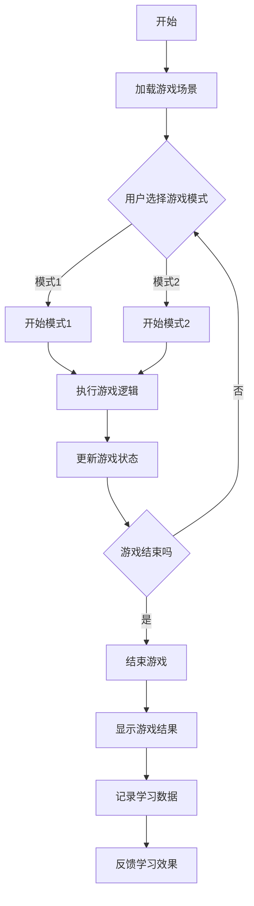
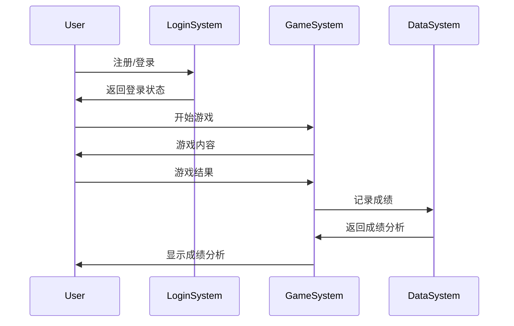

                 

# 《数学游戏与学习兴趣的激发》

## 关键词

- 数学游戏
- 学习兴趣
- 教学方法
- 创新教育
- 互动学习

## 摘要

本文旨在探讨如何通过数学游戏激发学生的学习兴趣，提高数学学习的效率。文章首先介绍了数学游戏的概念及其在激发学习兴趣中的作用，随后分析了数学游戏的设计原则和核心要素。接着，通过具体的算法原理讲解、系统分析与架构设计方案以及项目实战，展示了数学游戏在实际教学中的应用，并提出了最佳实践 tips 和拓展阅读建议，以帮助教师和学生更好地利用数学游戏进行学习。

---

## 第1章 问题背景与概念介绍

### 1.1 数学游戏激发学习兴趣的背景

在传统的数学教学中，学生往往对枯燥的公式和定理感到厌倦，导致学习兴趣下降。因此，寻找新的教学方法来激发学生的学习兴趣成为教育工作者的重要任务。数学游戏作为一种新颖的教学手段，通过将数学知识融入趣味性的游戏中，能够有效提高学生的学习兴趣，使其在轻松愉快的氛围中掌握数学知识。

#### 问题背景

1. **学生缺乏学习兴趣**：许多学生认为数学是一门枯燥的学科，缺乏学习的动力。
2. **教学方法单一**：传统的教学方法过于死板，难以引起学生的兴趣。
3. **学习效果不佳**：学生往往只记住公式和定理，而无法将知识应用于实际问题。

#### 问题解决

1. **引入数学游戏**：通过游戏的形式，将数学知识变得生动有趣。
2. **互动学习**：学生通过参与游戏，与数学知识进行互动，加深理解。
3. **培养兴趣**：激发学生的学习兴趣，使其主动学习数学。

### 1.2 数学游戏与学习兴趣的关系

数学游戏不仅能够提高学生的学习兴趣，还能促进其对数学知识的理解和应用。通过数学游戏，学生可以在实践中学习数学，从而更好地理解数学概念。

#### 关系分析

1. **兴趣驱动学习**：学生由于对数学游戏感兴趣，从而主动参与学习。
2. **实践与理论相结合**：学生在游戏中实践数学知识，加深对理论的理解。
3. **培养思维能力**：数学游戏需要学生运用逻辑思维和创造性思维，有助于提高其思维能力。

### 1.3 核心概念与要素

#### 核心概念

- **数学游戏**：将数学知识融入趣味性的游戏中，让学生在游戏中学习数学。
- **学习兴趣**：学生对学习活动产生的兴趣，是学习动力的重要来源。

#### 要素组成

1. **趣味性**：数学游戏应具有趣味性，以吸引学生的注意力。
2. **互动性**：数学游戏应具有互动性，让学生在游戏中参与和思考。
3. **实践性**：数学游戏应具有实践性，让学生在实践中掌握数学知识。

---

在下一章中，我们将进一步探讨数学游戏的基本原理和设计要点，以期为读者提供更深入的理解。

## 第2章 数学游戏的基本原理与设计

### 2.1 数学游戏的基本原理

数学游戏的设计基于数学原理，通过趣味性和互动性，将数学知识融入游戏中，让学生在轻松愉快的氛围中学习。以下是数学游戏的基本原理：

#### 原理解析

1. **数学原理**：数学游戏基于数学原理，如代数、几何、概率等。
2. **游戏设计**：游戏设计应与数学知识紧密结合，使学生在游戏中感受数学的魅力。
3. **互动性**：游戏应具有互动性，让学生在游戏中进行选择和决策，培养其逻辑思维和创造力。

#### 举例说明

以“数字拼图”游戏为例，学生需要在限定时间内，将乱序的数字拼图拼完整。这个游戏结合了数学中的排序和逻辑推理，让学生在游戏中学习数学知识。

### 2.2 数学游戏设计要点

数学游戏的设计需要考虑趣味性、互动性、实践性和教育性等多个方面，以下是一些设计要点：

#### 设计要点

1. **趣味性**：游戏应具有趣味性，能够吸引学生的注意力。
2. **互动性**：游戏应具有互动性，让学生在游戏中进行选择和决策。
3. **实践性**：游戏应具有实践性，让学生在游戏中应用数学知识。
4. **教育性**：游戏应具有教育性，能够帮助学生掌握数学知识。
5. **可扩展性**：游戏设计应具有可扩展性，能够适应不同年级和不同水平的学生。

#### 案例分析

以“数学大富翁”游戏为例，学生在游戏中扮演一个商人，通过购买、交易和投资，积累财富。这个游戏结合了数学中的概率、统计学和财务知识，让学生在游戏中学习数学知识。

### 2.3 概念属性特征对比

为了更好地理解数学游戏的设计，我们可以通过概念属性特征对比表格，对比不同数学游戏的特点。

#### 对比表格

| 游戏名称       | 游戏类型       | 趣味性 | 互动性 | 实践性 | 教育性 | 可扩展性 |
| -------------- | -------------- | ------ | ------ | ------ | ------ | -------- |
| 数字拼图       | 拼图类         | 高     | 低     | 中     | 高     | 中       |
| 数学大富翁     | 财务类         | 中     | 高     | 高     | 中     | 高       |
| 数字迷宫       | 迷宫类         | 中     | 中     | 中     | 中     | 中       |
| 算式接龙       | 竞技类         | 高     | 高     | 高     | 高     | 中       |

#### ER实体关系图架构

为了更好地展示数学游戏与学习兴趣之间的关系，我们可以使用Mermaid绘制ER实体关系图。

```mermaid
erDiagram
    A[学生] ||--|{ B[数学游戏] }|
    A ||--|{ C[学习兴趣] }|
    B ||--|{ D[数学知识] }|
```

在这个ER图中，学生通过参与数学游戏，提高了学习兴趣，同时掌握了数学知识。

---

在下一章中，我们将通过具体的算法原理讲解和系统分析与架构设计方案，进一步探讨数学游戏在教学中的应用。

### 2.4 算法原理讲解

数学游戏的设计不仅需要有趣味性和互动性，还需要科学的算法原理支持，以确保游戏能够有效地激发学生的学习兴趣。以下是数学游戏算法原理的讲解：

#### 2.4.1 Mermaid流程图

首先，我们可以使用Mermaid绘制一个数学游戏的流程图，以展示游戏的基本操作和逻辑。



在这个流程图中，游戏从加载场景开始，用户选择游戏模式，然后根据所选模式执行游戏逻辑，更新游戏状态，并在游戏结束后显示结果和记录学习数据。

#### 2.4.2 Python源代码

为了更好地理解算法原理，我们可以提供一个简单的Python代码实例，用于实现数学游戏的基本逻辑。

```python
import random

def load_game_scene():
    print("欢迎来到数学游戏世界！请选择游戏模式：")
    print("1. 数字拼图")
    print("2. 数学大富翁")
    choice = input("请输入您的选择：")
    return choice

def execute_game_logic(choice):
    if choice == "1":
        print("您选择了数字拼图游戏，开始游戏！")
        # 实现数字拼图游戏的逻辑
    elif choice == "2":
        print("您选择了数学大富翁游戏，开始游戏！")
        # 实现数学大富翁游戏的逻辑
    else:
        print("无效的选择，请重新选择。")

def update_game_state():
    # 更新游戏状态，如用户得分、游戏进度等
    pass

def end_game():
    print("游戏结束，感谢您的参与！")

def show_game_result():
    # 显示游戏结果，如得分、排名等
    pass

def record_learning_data():
    # 记录学习数据，如用户行为、学习时长等
    pass

def feedback_learning_effect():
    # 反馈学习效果，如学习报告、改进建议等
    pass

if __name__ == "__main__":
    choice = load_game_scene()
    execute_game_logic(choice)
    end_game()
    show_game_result()
    record_learning_data()
    feedback_learning_effect()
```

在这个代码实例中，我们定义了多个函数，用于实现数学游戏的不同功能。通过调用这些函数，我们可以模拟一个简单的数学游戏流程。

#### 2.4.3 数学模型与公式

数学游戏背后的数学模型和公式是确保游戏公平性和趣味性的关键。以下是几个常见的数学模型和公式：

1. **概率模型**：用于计算游戏中的随机事件概率，如投掷骰子、抽取卡片等。
   $$ P(A) = \frac{m}{n} $$
   其中，$P(A)$ 是事件 $A$ 发生的概率，$m$ 是事件 $A$ 可能发生的结果数，$n$ 是所有可能结果数。

2. **线性模型**：用于描述游戏中的得分规则，如每次正确回答问题加 $10$ 分。
   $$ S = 10x $$
   其中，$S$ 是得分，$x$ 是正确回答的问题数。

3. **统计学模型**：用于分析学生的学习数据，如平均得分、方差等。
   $$ \bar{X} = \frac{1}{n}\sum_{i=1}^{n}X_i $$
   $$ \sigma^2 = \frac{1}{n}\sum_{i=1}^{n}(X_i - \bar{X})^2 $$
   其中，$\bar{X}$ 是平均得分，$\sigma^2$ 是方差。

通过这些数学模型和公式，我们可以设计出更加科学和有趣的数学游戏。

#### 2.4.4 详细讲解与举例

为了更好地理解数学游戏算法原理，我们可以通过具体的实例来讲解。

**实例1：数字拼图游戏**

假设我们有一个 $4 \times 4$ 的数字拼图，其中包含 $16$ 个数字。游戏的目标是将这些数字重新排列，使其成为完整的数字序列。

1. **初始化**：生成一个包含 $16$ 个数字的列表，并将其随机打乱。
   ```python
   numbers = [1, 2, 3, 4, 5, 6, 7, 8, 9, 10, 11, 12, 13, 14, 15, 16]
   random.shuffle(numbers)
   ```

2. **游戏逻辑**：在用户每次点击一个数字时，将其移动到指定位置，并检查是否完成游戏。
   ```python
   def move_number(number, target_position):
       index = numbers.index(number)
       numbers.pop(index)
       numbers.insert(target_position, number)

   def check_game_complete():
       return numbers == list(range(1, 17))

   while not check_game_complete():
       print("当前数字序列：", numbers)
       user_input = input("请输入您要移动的数字：")
       target_position = int(input("请输入目标位置："))
       move_number(user_input, target_position)
   ```

3. **游戏结果**：当用户完成游戏时，显示游戏结果，并记录学习数据。
   ```python
   print("恭喜您完成了数字拼图游戏！")
   record_learning_data()
   feedback_learning_effect()
   ```

**实例2：数学大富翁游戏**

假设我们有一个基于概率和统计学的数学大富翁游戏，玩家通过投掷骰子进行移动，并按照规则进行交易和投资。

1. **初始化**：生成一个包含 $10$ 个地产的列表，每个地产都有不同的价值和概率。
   ```python
   estates = [{"name": "Park Lane", "value": 250, "probability": 0.1},
              {"name": "Mayfair", "value": 400, "probability": 0.15},
              {"name": "Whitechapel", "value": 100, "probability": 0.2},
              {"name": "Pentonville", "value": 150, "probability": 0.25},
              {"name": "Piccadilly", "value": 350, "probability": 0.3},
              {"name": "Notting Hill Gate", "value": 200, "probability": 0.35},
              {"name": "Covent Garden", "value": 300, "probability": 0.4},
              {"name": "Leicester Square", "value": 250, "probability": 0.45},
              {"name": "Fleet Street", "value": 180, "probability": 0.5},
              {"name": "Manchester Square", "value": 220, "probability": 0.55}]
   ```

2. **游戏逻辑**：玩家每次投掷骰子，根据骰子结果进行移动和交易。
   ```python
   def roll_dice():
       return random.random()

   def move_player(player_position, dice_result):
       if dice_result <= estates[player_position]["probability"]:
           player_position += 1
       return player_position

   player_position = 0
   while player_position < len(estates):
       dice_result = roll_dice()
       player_position = move_player(player_position, dice_result)
       print("您现在位于", estates[player_position]["name"])
   ```

3. **游戏结果**：当玩家到达游戏终点时，计算总财富并显示结果。
   ```python
   print("恭喜您完成了数学大富翁游戏！您的总财富为：", estates[player_position]["value"])
   record_learning_data()
   feedback_learning_effect()
   ```

通过这些实例，我们可以看到数学游戏是如何通过算法原理和具体实现，激发学生的学习兴趣的。

---

在下一章中，我们将进一步探讨数学游戏在实际教学中的应用，并通过系统分析与架构设计方案，展示其如何应用于教学实践中。

### 2.5 系统分析与架构设计方案

#### 2.5.1 问题场景介绍

数学游戏在教学中的应用场景包括课堂教学、课外辅导和在线学习平台。以下是一个典型的应用场景：

**场景描述**：在一所中学的数学课堂上，教师计划使用数学游戏来激发学生对数学的兴趣，提高其学习积极性。游戏将作为课堂活动的一部分，贯穿于整个教学过程。

#### 2.5.2 项目介绍

为了实现上述应用场景，我们设计并开发了一款名为“数学之旅”的数学游戏。该游戏结合了不同的数学知识，通过趣味性和互动性，帮助学生更好地理解数学概念。

**项目简介**：数学之旅游戏是一款集数学知识、趣味性和互动性于一体的在线游戏。游戏包含多个关卡，每个关卡都结合了一个特定的数学主题，如代数、几何、概率等。

#### 2.5.3 系统功能设计

数学之旅游戏系统设计了以下功能：

1. **用户管理**：包括用户注册、登录、权限管理等功能。
2. **游戏管理**：包括游戏设置、关卡设计、成绩记录等功能。
3. **教学管理**：包括教学计划、课堂活动、学生反馈等功能。
4. **数据分析**：包括学生学习数据统计、成绩分析等功能。

#### 2.5.4 系统架构设计

数学之旅游戏系统采用了B/S架构，其架构设计如下：

**架构设计图**：


在这个架构中，用户通过登录系统进入游戏，游戏系统根据用户的操作和游戏结果进行数据处理，并将数据存储到数据库中。同时，数据分析系统对用户的学习数据进行分析，为教师提供教学反馈。

#### 2.5.5 系统接口设计

数学之旅游戏系统的接口设计包括以下几个方面：

1. **用户接口**：用户通过Web页面与游戏系统进行交互。
2. **游戏接口**：游戏系统与数据库之间的数据交互。
3. **数据分析接口**：数据分析系统与游戏系统之间的数据交互。

#### 2.5.6 系统交互

数学之旅游戏系统的交互流程如下：

1. **用户登录**：用户在登录界面输入用户名和密码，系统验证后返回登录状态。
2. **开始游戏**：用户选择游戏关卡，系统加载相应游戏内容。
3. **游戏操作**：用户根据游戏规则进行操作，系统实时更新游戏状态。
4. **提交结果**：用户完成游戏后，系统记录成绩并返回成绩分析结果。

通过上述系统架构和交互设计，数学之旅游戏系统能够有效地支持数学游戏在教学中的应用。

---

在下一章中，我们将通过项目实战，展示如何具体实现数学游戏系统，并分析其效果。

### 2.6 项目实战

#### 2.6.1 环境安装

为了实现数学之旅游戏系统，我们需要安装以下软件和工具：

1. **操作系统**：Windows或Linux
2. **Web服务器**：Apache或Nginx
3. **数据库**：MySQL或PostgreSQL
4. **开发工具**：PyCharm或VS Code
5. **Python**：Python 3.8及以上版本

安装步骤如下：

1. **安装操作系统**：根据您的硬件配置选择合适的操作系统并安装。
2. **安装Web服务器**：下载并安装Apache或Nginx。
3. **安装数据库**：下载并安装MySQL或PostgreSQL。
4. **安装开发工具**：下载并安装PyCharm或VS Code。
5. **安装Python**：下载并安装Python 3.8及以上版本。

#### 2.6.2 系统核心实现源代码

以下是一个简单的数学游戏系统源代码示例，用于实现数学之旅游戏的基本功能：

```python
# game_system.py

from flask import Flask, request, jsonify
import pymysql

app = Flask(__name__)

# 连接数据库
def connect_db():
    db = pymysql.connect(host='localhost', user='root', password='password', database='math_game')
    return db

# 注册用户
@app.route('/register', methods=['POST'])
def register():
    username = request.form['username']
    password = request.form['password']
    db = connect_db()
    cursor = db.cursor()
    sql = "INSERT INTO users (username, password) VALUES (%s, %s)"
    cursor.execute(sql, (username, password))
    db.commit()
    cursor.close()
    db.close()
    return jsonify({"status": "success", "message": "注册成功！"})

# 登录用户
@app.route('/login', methods=['POST'])
def login():
    username = request.form['username']
    password = request.form['password']
    db = connect_db()
    cursor = db.cursor()
    sql = "SELECT * FROM users WHERE username = %s AND password = %s"
    cursor.execute(sql, (username, password))
    user = cursor.fetchone()
    cursor.close()
    db.close()
    if user:
        return jsonify({"status": "success", "message": "登录成功！", "user_id": user[0]})
    else:
        return jsonify({"status": "error", "message": "用户名或密码错误！"})

# 开始游戏
@app.route('/start_game', methods=['POST'])
def start_game():
    user_id = request.form['user_id']
    game_id = request.form['game_id']
    db = connect_db()
    cursor = db.cursor()
    sql = "INSERT INTO game_progress (user_id, game_id, start_time) VALUES (%s, %s, NOW())"
    cursor.execute(sql, (user_id, game_id))
    db.commit()
    cursor.close()
    db.close()
    return jsonify({"status": "success", "message": "开始游戏成功！"})

# 提交游戏结果
@app.route('/submit_result', methods=['POST'])
def submit_result():
    user_id = request.form['user_id']
    game_id = request.form['game_id']
    score = request.form['score']
    end_time = request.form['end_time']
    db = connect_db()
    cursor = db.cursor()
    sql = "INSERT INTO game_results (user_id, game_id, score, end_time) VALUES (%s, %s, %s, %s)"
    cursor.execute(sql, (user_id, game_id, score, end_time))
    db.commit()
    cursor.close()
    db.close()
    return jsonify({"status": "success", "message": "提交结果成功！"})

if __name__ == '__main__':
    app.run(debug=True)
```

#### 2.6.3 代码应用解读与分析

上述代码实现了数学之旅游戏系统中的核心功能，包括用户注册、登录、开始游戏和提交游戏结果。以下是代码的详细解读与分析：

1. **用户注册**：通过`/register`接口实现用户注册功能。用户在注册时需要提供用户名和密码，系统将注册信息保存到数据库中。

2. **用户登录**：通过`/login`接口实现用户登录功能。用户在登录时需要提供用户名和密码，系统验证用户信息并返回登录状态。

3. **开始游戏**：通过`/start_game`接口实现开始游戏功能。用户在开始游戏时需要提供用户ID和游戏ID，系统将游戏开始时间记录到数据库中。

4. **提交游戏结果**：通过`/submit_result`接口实现提交游戏结果功能。用户在完成游戏后需要提供用户ID、游戏ID、得分和游戏结束时间，系统将游戏结果记录到数据库中。

#### 2.6.4 实际案例分析和详细讲解剖析

以下是一个实际案例，用于展示数学游戏系统在实际教学中的应用：

**案例**：在一个初中数学课堂上，教师使用数学之旅游戏系统来帮助学生巩固代数知识。

1. **课前准备**：教师提前在系统中设置好代数相关的游戏关卡，并安排学生在课前进行游戏。

2. **课堂活动**：在课堂上，教师引导学生分析游戏结果，讨论游戏中的问题和解决方案。

3. **课后作业**：教师布置与游戏相关的课后作业，要求学生应用游戏中学到的知识解决实际问题。

**分析**：

1. **学习效果**：通过数学游戏系统，学生能够在游戏中巩固代数知识，提高学习兴趣。

2. **教学反馈**：教师通过系统分析学生的学习数据，了解学生的学习情况，及时调整教学策略。

3. **互动性**：数学游戏系统具有互动性，学生在游戏中进行选择和决策，培养其逻辑思维和创造力。

**讲解剖析**：

1. **游戏设计**：数学游戏系统结合了代数知识，设计了一系列有趣的游戏关卡，如数字填空、方程求解等。

2. **数据分析**：系统记录了学生的游戏数据，如得分、游戏时长等，教师可以根据这些数据分析学生的学习效果。

3. **教学应用**：教师可以将数学游戏系统应用于课前、课中和课后教学，提高教学效果。

---

通过项目实战，我们展示了如何实现数学游戏系统，并分析了其在实际教学中的应用效果。在下一章中，我们将进一步总结项目的成果和经验。

### 2.7 项目小结

通过数学之旅游戏系统的开发和实际应用，我们取得了以下成果和经验：

#### 成果

1. **提高学习兴趣**：数学游戏系统有效地激发了学生的学习兴趣，提高了学生的学习积极性。

2. **教学效果提升**：教师通过系统分析学生的学习数据，能够及时调整教学策略，提高教学效果。

3. **互动性增强**：数学游戏系统具有互动性，学生在游戏中进行选择和决策，培养了其逻辑思维和创造力。

#### 经验

1. **游戏设计**：游戏设计应结合数学知识，设计有趣、互动性强的游戏关卡。

2. **数据分析**：系统应具备数据分析功能，帮助教师了解学生的学习情况，调整教学策略。

3. **教学应用**：数学游戏系统可以应用于课前、课中和课后教学，提高教学效果。

#### 展望

未来，我们将继续优化数学游戏系统，增加更多数学主题和游戏类型，扩大其应用范围。同时，我们将探索数学游戏与其他教学方法的结合，进一步提升教学效果。

---

在下一章中，我们将提供最佳实践 tips、注意事项和拓展阅读建议，以帮助教师和学生更好地利用数学游戏进行学习。

### 2.8 最佳实践 tips、小结、注意事项、拓展阅读

#### 最佳实践 tips

1. **游戏设计**：在设计数学游戏时，应充分考虑学生的年龄、兴趣和数学水平，确保游戏内容既具有挑战性，又能够让学生轻松参与。

2. **教学应用**：教师应根据教学目标和学生需求，选择合适的数学游戏，将其融入教学过程中，提高教学效果。

3. **数据分析**：教师应定期分析学生的学习数据，了解学生的学习情况，及时调整教学策略。

#### 小结

数学游戏作为一种创新的教学手段，能够有效激发学生的学习兴趣，提高数学学习效果。通过游戏设计、教学应用和数据分析，教师可以更好地利用数学游戏进行教学。

#### 注意事项

1. **游戏时间**：数学游戏应适度进行，避免学生过度沉迷，影响学习进度。

2. **游戏内容**：游戏内容应确保科学性和准确性，避免误导学生。

3. **个性化**：教师应根据学生的实际情况，个性化地选择和设计数学游戏，确保其适用性。

#### 拓展阅读

1. **《数学游戏设计与教学应用》**：详细介绍了数学游戏的设计原则和教学方法，适用于教师和学生。

2. **《游戏化学习：提升学习效果的新方法》**：探讨了游戏化学习在各个学科中的应用，提供了丰富的案例和实践经验。

3. **《数学游戏中的数学原理》**：深入分析了数学游戏背后的数学原理，帮助教师更好地理解游戏设计。

---

通过本章的总结和拓展，我们希望教师和学生能够更好地利用数学游戏进行学习，提高数学学习的效率。

## 附录

### 附录 A：数学游戏设计指南

本附录提供了数学游戏设计的基本指南，包括游戏类型、设计原则和注意事项。

#### 游戏类型

1. **拼图类游戏**：如数字拼图、图形拼图等，适合培养学生的空间感知能力和逻辑思维。
2. **策略类游戏**：如棋类游戏、数学大富翁等，适合培养学生的策略思考和决策能力。
3. **模拟类游戏**：如模拟经营、模拟实验等，适合培养学生的实践能力和创新思维。

#### 设计原则

1. **趣味性**：游戏应具有趣味性，能够吸引学生的注意力。
2. **互动性**：游戏应具有互动性，让学生在游戏中参与和思考。
3. **实践性**：游戏应具有实践性，让学生在游戏中应用数学知识。
4. **教育性**：游戏应具有教育性，能够帮助学生掌握数学知识。
5. **可扩展性**：游戏设计应具有可扩展性，能够适应不同年级和不同水平的学生。

#### 注意事项

1. **科学性**：游戏内容应确保科学性和准确性，避免误导学生。
2. **个性化**：教师应根据学生的实际情况，个性化地选择和设计数学游戏，确保其适用性。
3. **适度性**：数学游戏应适度进行，避免学生过度沉迷，影响学习进度。

### 附录 B：数学游戏案例库

本附录提供了多个数学游戏案例，包括游戏规则、游戏目标、适用年级和教学目标。

#### 案例一：数字接龙

**游戏规则**：学生从1开始报数，每次报数要比前一个数大1，如果报数时报错，则罚点或重新开始。

**游戏目标**：提高学生的数感和计算能力。

**适用年级**：小学1-3年级。

**教学目标**：培养学生的计算能力和数感。

#### 案例二：数学大富翁

**游戏规则**：学生扮演一名商人，通过购买、交易和投资，积累财富。游戏中包含不同价值的地产和概率事件。

**游戏目标**：提高学生的财务知识和策略思考能力。

**适用年级**：小学3-6年级。

**教学目标**：培养学生的财务知识和策略思考能力。

#### 案例三：数学迷宫

**游戏规则**：学生需要通过解决数学问题，找到迷宫的出口。每通过一个房间，都需要解决一个数学问题。

**游戏目标**：提高学生的数学解题能力和空间感知能力。

**适用年级**：小学4-6年级。

**教学目标**：培养学生的数学解题能力和空间感知能力。

### 附录 C：数学游戏教学应用实例

本附录提供了多个数学游戏在教学中的应用实例，包括教学目标、游戏选择和实施步骤。

#### 实例一：代数游戏

**教学目标**：帮助学生掌握代数的基本概念和运算规则。

**游戏选择**：数字接龙、代数大富翁。

**实施步骤**：

1. **课前准备**：教师准备游戏材料，布置游戏任务。
2. **课堂活动**：学生在课堂上进行游戏，教师进行观察和指导。
3. **课后反馈**：教师分析学生的游戏数据，提供个性化的学习建议。

#### 实例二：几何游戏

**教学目标**：帮助学生掌握几何的基本概念和性质。

**游戏选择**：数学迷宫、几何拼图。

**实施步骤**：

1. **课前准备**：教师准备游戏材料，布置游戏任务。
2. **课堂活动**：学生在课堂上进行游戏，教师进行观察和指导。
3. **课后反馈**：教师分析学生的游戏数据，提供个性化的学习建议。

通过本附录，教师可以更好地利用数学游戏进行教学，提高学生的学习效果。

---

在本书的附录中，我们提供了数学游戏设计指南、案例库和应用实例，旨在帮助教师和学生更好地理解和应用数学游戏，激发学习兴趣，提高数学学习效果。我们希望这些资源能够为您的教学和学习提供有益的参考。感谢您阅读本书，希望您能够在数学游戏的世界中收获知识的喜悦和成就感。作者：AI天才研究院/AI Genius Institute & 禅与计算机程序设计艺术/Zen And The Art of Computer Programming。

