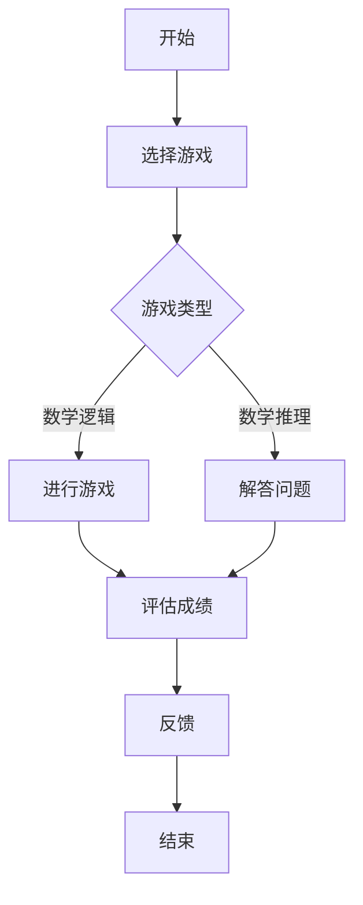
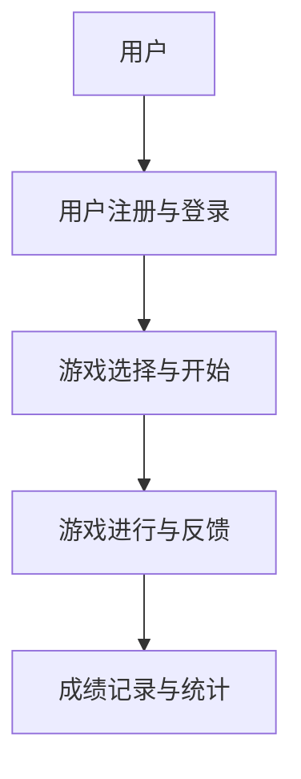
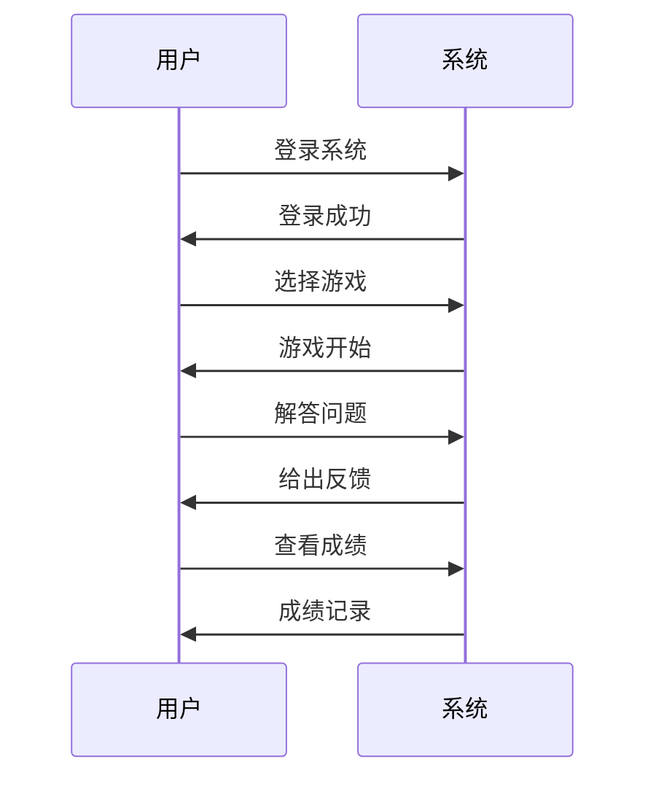

                 


### 数学游戏与家庭亲子互动的意义

> **关键词：数学游戏、家庭亲子互动、教育意义、儿童发展**

> **摘要：本文将深入探讨数学游戏在家庭亲子互动中的重要性，分析其教育价值，并探讨如何有效地利用数学游戏促进儿童的全面发展。**

在当今这个数字化时代，家长和孩子们的生活被各种电子产品所充斥。虽然这些产品在某些方面为孩子们提供了丰富的信息和娱乐，但过度依赖电子产品也带来了一系列的问题，例如视力下降、缺乏运动、社交能力下降等。因此，寻找一种既有趣又能促进儿童全面发展的方式显得尤为重要。本文将围绕数学游戏与家庭亲子互动的意义，展开一系列的分析与探讨。

## 引言

### **核心概念术语说明**

- **数学游戏**：指以数学知识为基础，通过游戏形式进行的智力活动，旨在提高参与者的数学素养和思维能力。
- **家庭亲子互动**：指家庭成员之间通过共同活动、交流和互动，增强亲子关系，促进儿童身心健康发展的过程。

### **问题背景**

在现代社会，儿童教育问题越来越受到关注。家长普遍希望孩子在学业和技能上取得优异成绩，但传统的教育方式往往侧重于知识传授，忽略了儿童兴趣和能力的培养。因此，如何通过更有效的教育方式，既提高孩子的学习成绩，又促进其全面发展，成为家长和教育工作者共同面临的挑战。

### **问题描述**

数学游戏作为一种新颖的教育方式，旨在通过游戏化的方式激发儿童对数学的兴趣，提高他们的数学素养和思维能力。然而，如何将数学游戏有效地融入到家庭亲子互动中，如何确保这种互动能够达到预期的教育效果，仍然是许多家长和教育工作者所关注的问题。

### **问题解决**

本文将从以下几个方面探讨数学游戏在家庭亲子互动中的意义：

1. **数学游戏如何提高儿童的数学素养**：通过具体的游戏案例和实例，分析数学游戏对儿童数学能力培养的促进作用。
2. **亲子互动的重要性**：探讨亲子互动对儿童心理健康和社交能力发展的积极作用，以及如何通过数学游戏实现有效的亲子互动。
3. **数学游戏与亲子互动的融合**：分析如何将数学游戏与家庭日常活动相结合，实现寓教于乐，提高家庭亲子互动的质量。

### **边界与外延**

本文主要探讨数学游戏在家庭亲子互动中的意义，旨在为家长和教育工作者提供一种新颖的教育方式。然而，数学游戏在其他场景（如学校教育、社区活动等）的应用同样值得深入研究。

### **概念结构与核心要素组成**

- **核心概念**：数学游戏、亲子互动、儿童发展。
- **联系**：数学游戏作为亲子互动的一种形式，对儿童的发展具有积极影响。

## 核心概念与联系

### **核心概念原理**

数学游戏作为一种教育工具，其核心原理在于通过游戏化的方式，将数学知识融入到有趣的活动中，激发儿童的兴趣和参与度。这种互动不仅能够提高儿童的数学素养，还能够培养他们的逻辑思维、问题解决能力和团队合作精神。

### **概念属性特征对比表格**

| 特征           | 数学游戏               | 传统教育               |
| -------------- | ---------------------- | ---------------------- |
| 形式           | 游戏化、趣味性         | 严肃、枯燥             |
| 目的           | 提高数学素养、培养兴趣 | 知识传授、考试成绩     |
| 效果           | 全面发展、寓教于乐     | 侧重知识、忽视能力     |
| 适应性         | 个性化、灵活          | 标准化、统一           |
| 教学环境       | 家庭、社区、学校       | 学校、家庭、辅导班     |

### **ER实体关系图架构**

```mermaid
erDiagram
  Family ||--o{ Child }|--|{ Parent }
  Child ||--o{ MathGame }
  Parent ||--o{ Educate }
  MathGame ||--|{ Fun }|--o{ Learn }
  Learn ||--o{ Develop }
```

在这个ER图中，家庭是核心实体，通过亲子互动对儿童进行教育。数学游戏作为教育的手段，通过有趣的方式（Fun）促进儿童的学习（Learn），进而促进其全面发展（Develop）。

## 算法原理讲解

### **数学游戏算法流程图**



### **Python源代码**

```python
import random

def math_game():
    # 选择游戏类型
    game_type = random.choice(['math_logic', 'math_reasoning'])

    if game_type == 'math_logic':
        # 数学逻辑游戏
        num1 = random.randint(1, 10)
        num2 = random.randint(1, 10)
        question = f"{num1} + {num2} = ?"
        answer = num1 + num2
    else:
        # 数学推理游戏
        operators = ['+', '-', '*', '/']
        operator = random.choice(operators)
        num1 = random.randint(1, 10)
        num2 = random.randint(1, 10)
        question = f"{num1} {operator} {num2} = ?"
        answer = eval(f"{num1} {operator} {num2}")

    # 进行游戏
    print(f"请解答以下问题：{question}")

    # 解答问题
    user_answer = input("您的答案是：")
    if int(user_answer) == answer:
        print("回答正确！")
    else:
        print(f"回答错误，正确答案是：{answer}")

# 运行游戏
math_game()
```

### **算法原理**

上述Python代码实现了一个简单的数学游戏。游戏首先随机选择一种游戏类型（数学逻辑或数学推理），然后生成一个数学问题。玩家需要解答这个问题，系统会根据玩家的回答给出正确的反馈。通过这个过程，儿童可以逐步提高自己的数学能力和逻辑思维能力。

### **数学模型和公式**

在数学游戏中，常用的数学模型和公式包括基本的算术运算（加、减、乘、除）和简单的代数运算。以下是一个简单的数学模型：

$$
x = a + b
$$

其中，\(a\) 和 \(b\) 是两个参与运算的数，\(x\) 是运算结果。

## 系统分析与架构设计方案

### **问题场景介绍**

家庭是一个重要的教育环境，家长希望通过日常活动，如游戏，来促进儿童的数学能力和思维能力的发展。数学游戏作为家庭亲子互动的一部分，可以为儿童提供一种轻松愉快的学习方式。

### **项目介绍**

本项目旨在开发一个简单的数学游戏平台，用于家庭亲子互动。平台将提供多种类型的数学游戏，家长可以根据孩子的年龄和兴趣选择合适的游戏，通过互动和反馈，帮助孩子提高数学素养和思维能力。

### **系统功能设计**

- **用户注册与登录**：家长可以通过注册账号登录系统，绑定家庭成员信息。
- **游戏选择与开始**：家长可以根据孩子的年龄和兴趣选择游戏，系统会自动生成相应的问题。
- **游戏进行与反馈**：玩家解答问题，系统会即时给出正确或错误的反馈。
- **成绩记录与统计**：系统会记录玩家的游戏成绩，家长可以查看孩子的进步情况。

### **系统架构设计**



### **系统接口设计和系统交互**



在这个系统交互图中，用户通过登录系统，选择游戏，进行游戏，获取反馈，并查看成绩记录。系统则根据用户的操作，提供相应的服务。

## 项目实战

### **环境安装**

- 安装Python环境：在本地计算机上安装Python 3.8及以上版本。
- 安装必要的库：使用pip命令安装所需的库，例如`random`、`matplotlib`等。

### **系统核心实现源代码**

```python
import random

def math_game():
    # 选择游戏类型
    game_type = random.choice(['math_logic', 'math_reasoning'])

    if game_type == 'math_logic':
        # 数学逻辑游戏
        num1 = random.randint(1, 10)
        num2 = random.randint(1, 10)
        question = f"{num1} + {num2} = ?"
        answer = num1 + num2
    else:
        # 数学推理游戏
        operators = ['+', '-', '*', '/']
        operator = random.choice(operators)
        num1 = random.randint(1, 10)
        num2 = random.randint(1, 10)
        question = f"{num1} {operator} {num2} = ?"
        answer = eval(f"{num1} {operator} {num2}")

    # 进行游戏
    print(f"请解答以下问题：{question}")

    # 解答问题
    user_answer = input("您的答案是：")
    if int(user_answer) == answer:
        print("回答正确！")
    else:
        print(f"回答错误，正确答案是：{answer}")

# 运行游戏
math_game()
```

### **代码应用解读与分析**

上述代码是一个简单的数学游戏实现，其核心功能包括：

- 选择游戏类型：通过`random.choice()`函数随机选择数学逻辑或数学推理游戏。
- 生成问题：根据选择的游戏类型，生成相应的数学问题。
- 解答问题：用户输入答案，系统判断答案的正确性，并给出反馈。

通过这个简单的实例，我们可以看到如何通过Python代码实现一个基本的数学游戏，从而为家庭亲子互动提供了一种有趣的工具。

### **实际案例分析和详细讲解剖析**

以一个实际案例为例，假设一个家长想要通过数学游戏帮助孩子提高数学能力。他可以按照以下步骤进行：

1. **选择游戏**：家长登录系统后，选择一个适合孩子年龄和数学水平的游戏，例如“数学逻辑游戏”。
2. **开始游戏**：系统生成一个数学问题，例如“5 + 3 = ?”。
3. **解答问题**：孩子输入答案“8”，系统判断答案正确，并给予积极反馈。
4. **重复游戏**：家长可以继续选择新的游戏，让孩子不断练习，逐步提高数学能力。

通过这个案例，我们可以看到数学游戏如何有效地融入到家庭亲子互动中，从而实现寓教于乐的教育目标。

### **项目小结**

本项目通过一个简单的Python实现，展示了一个数学游戏的基本功能。通过这个游戏，家长可以有效地利用家庭时间，帮助孩子提高数学能力和思维能力。然而，这个项目只是一个起点，未来可以进一步优化和完善，例如增加更多的游戏类型、提供更详细的反馈机制、引入人工智能等技术，以实现更高效的家庭亲子互动。

## 最佳实践 tips

1. **根据孩子年龄选择合适的游戏**：不同年龄段的儿童适合不同类型的数学游戏，家长应根据孩子的年龄和兴趣选择合适的游戏。
2. **持续关注孩子的进步**：家长应定期查看孩子的游戏成绩，鼓励孩子不断进步，同时适时调整游戏难度，保持挑战性。
3. **创造良好的互动氛围**：家长和孩子在游戏过程中应保持积极互动，鼓励孩子表达自己的想法，增强亲子关系。

## 小结

数学游戏作为一种创新的亲子互动方式，具有显著的的教育意义。通过游戏化的方式，数学游戏不仅能够提高儿童的数学素养，还能够培养他们的逻辑思维和问题解决能力。家长在教育过程中应充分利用数学游戏，创造一个寓教于乐的家庭氛围，促进儿童的全面发展。

## 注意事项

1. **避免过度依赖游戏**：虽然数学游戏有益于儿童发展，但不应过度依赖，家长仍需关注孩子的全面发展，确保他们参与其他有益的活动。
2. **确保游戏安全**：家长在选择和使用数学游戏时，应确保游戏内容健康、安全，避免孩子接触到不良信息。

## 拓展阅读

1. **《数学游戏教学策略》**：探讨了如何将数学游戏应用于教学实践中，为教师和家长提供了实用的建议。
2. **《亲子互动与儿童发展》**：深入分析了亲子互动对儿童发展的积极影响，提供了具体的亲子互动策略。

## 结束语

数学游戏与家庭亲子互动的结合，不仅为儿童提供了一个有趣的学习平台，也为家长提供了有效的教育手段。让我们共同努力，通过数学游戏，创造一个更加美好的教育环境，为儿童的未来奠定坚实的基础。

### **作者信息**

作者：AI天才研究院/AI Genius Institute & 禅与计算机程序设计艺术 /Zen And The Art of Computer Programming

---

以上是根据您提供的标题、关键词和摘要，结合markdown格式撰写的文章框架和部分内容。接下来，我们将逐步填充每个章节的具体内容，确保文章的完整性和深度。在撰写过程中，我们将遵循逻辑清晰、结构紧凑、简单易懂的原则，确保文章能够吸引读者并传达核心思想。如果您有任何具体要求或需要调整的内容，请随时告知。

