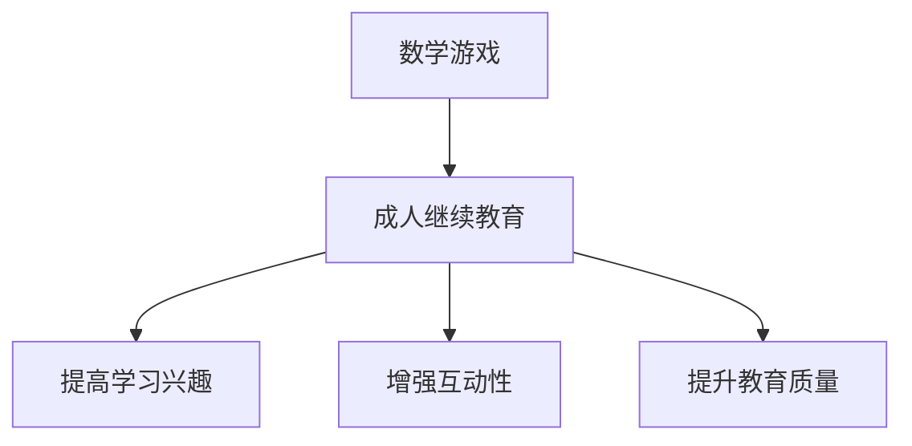

                 

# 《数学游戏与成人继续教育的关系》

关键词：数学游戏、成人继续教育、关系分析、教育创新

摘要：本文旨在探讨数学游戏在成人继续教育中的应用及其带来的深远影响。通过分析数学游戏与成人继续教育的核心概念与联系，本文将深入探讨数学游戏的理论基础，分析成人继续教育的现状，并探讨数学游戏在成人继续教育中的应用与实践。最终，本文将总结研究成果，展望未来发展趋势，并提出相关建议。

## 第1章 引言

### 1.1 问题背景

在现代社会，随着知识的快速更新，成人继续教育的重要性日益凸显。然而，传统的教育模式往往缺乏互动性和趣味性，难以激发成人的学习兴趣。数学游戏作为一种新颖的教学方式，能够在一定程度上解决这一问题。本文将探讨数学游戏与成人继续教育的关系，旨在为教育创新提供新的思路。

### 1.2 问题描述

成人继续教育面临的主要问题是学习兴趣不高、教育资源不足、教育方式单一和教育质量不高等。数学游戏作为一种新兴的教育工具，能否有效解决这些问题，提高成人学习的兴趣和效果，是本文需要探讨的关键问题。

### 1.3 问题解决

通过分析数学游戏在成人继续教育中的应用，本文提出了以下解决方案：

1. **引入数学游戏**：在成人继续教育中引入数学游戏，提高学习的趣味性和互动性。
2. **课程设计**：根据成人特点，设计具有挑战性和趣味性的数学游戏课程。
3. **教学实践**：通过教学实践，验证数学游戏在成人继续教育中的应用效果。
4. **效果评估**：对数学游戏在成人继续教育中的应用进行效果评估，为教育创新提供数据支持。

### 1.4 边界与外延

本文的研究主要关注数学游戏在成人继续教育中的应用，不包括数学游戏在其他领域的应用。同时，本文主要探讨数学游戏在成人继续教育中的教学效果，不涉及数学游戏对成人学习心理的影响。

### 1.5 概念结构与核心要素组成

本文的核心概念包括数学游戏和成人继续教育。数学游戏是指以数学问题为核心，通过游戏的形式进行教学的活动。成人继续教育是指为满足成年人继续学习需求而开展的教育活动。本文将分析这两个概念的联系，探讨其在成人继续教育中的应用。

## 第2章 核心概念与联系

### 2.1 数学游戏

#### 2.1.1 定义

数学游戏是一种将数学问题与游戏相结合的教学方式，旨在提高学习的趣味性和互动性。数学游戏通常包含数学问题、解决方案和游戏规则。

#### 2.1.2 特点

- **趣味性**：数学游戏以趣味性为特点，能够激发学生的学习兴趣。
- **互动性**：数学游戏通常需要学生之间的互动，有助于提高学生的合作能力和团队精神。
- **挑战性**：数学游戏的设计具有挑战性，有助于提高学生的数学思维能力和解决问题的能力。

#### 2.1.3 形式

数学游戏的形式多样，包括数字游戏、图形游戏、逻辑游戏等。不同的游戏形式可以满足不同年龄段和不同学习需求的学生。

### 2.2 成人继续教育

#### 2.2.1 定义

成人继续教育是指为满足成年人继续学习需求而开展的教育活动，旨在提高成年人的知识水平和职业技能。

#### 2.2.2 目的

- **提高知识水平**：成人继续教育旨在提高成年人的知识水平，满足其对知识的渴求。
- **提升职业技能**：成人继续教育旨在提升成年人的职业技能，提高其就业竞争力。

#### 2.2.3 形式

成人继续教育的形式多样，包括学历教育、职业培训、技能培训等。不同的教育形式可以满足不同学习需求的人。

### 2.3 数学游戏与成人继续教育的联系

#### 2.3.1 关系图架构

#### 2.3.2 属性特征对比表格

| 特征          | 数学游戏                | 成人继续教育              |
| ------------ | --------------------- | --------------------- |
| 目的          | 提高学习趣味性和互动性       | 提高知识水平和职业技能           |
| 形式          | 数字游戏、图形游戏、逻辑游戏等 | 学历教育、职业培训、技能培训等 |
| 适用人群      | 儿童、青少年、成年人         | 成年人                   |
| 教育资源需求 | 较低                    | 较高                   |

## 第3章 数学游戏的理论基础

### 3.1 数学游戏的历史发展

#### 3.1.1 古代数学游戏

古代数学游戏可以追溯到古希腊时期。当时的数学游戏主要是为了娱乐和锻炼思维，例如“九九乘法表”和“二十四点”等。

#### 3.1.2 中世纪数学游戏

中世纪数学游戏的形式更加多样化，包括“魔术方阵”、“谜题”等。这些游戏不仅锻炼了人们的数学思维，还培养了人们的逻辑推理能力。

#### 3.1.3 现代数学游戏

现代数学游戏在形式和内容上都有了很大的创新。计算机技术的应用使得数学游戏更加多样化和互动化，例如“数学拼图”、“数学模拟”等。

### 3.2 数学游戏的教育价值

#### 3.2.1 提高数学兴趣

数学游戏通过趣味性和互动性，能够有效提高学生的学习兴趣，使其更加愿意学习和探索数学知识。

#### 3.2.2 培养逻辑思维能力

数学游戏的设计往往包含逻辑推理和问题解决，能够锻炼学生的逻辑思维能力和解决问题的能力。

#### 3.2.3 促进数学知识的应用

数学游戏通过实际问题的解决，能够促进学生对数学知识的理解和应用，提高其实际问题解决能力。

## 第4章 成人继续教育的现状分析

### 4.1 成人继续教育的需求

#### 4.1.1 社会需求

随着社会的快速发展，对成年人的知识水平和职业技能的需求越来越高。成人继续教育成为满足社会需求的重要途径。

#### 4.1.2 个人需求

成年人对知识的渴求和对个人发展的追求，使得成人继续教育成为其提高自身素质的重要方式。

### 4.2 成人继续教育的问题

#### 4.2.1 教育资源不足

成人继续教育资源分布不均，部分地区的教育资源较为匮乏，影响了成人继续教育的发展。

#### 4.2.2 教育方式单一

成人继续教育的方式较为单一，缺乏互动性和趣味性，难以满足成年人的学习需求。

#### 4.2.3 教育质量不高

部分成人继续教育的教育质量不高，教学内容和教学方法与实际需求不符，影响了学习效果。

## 第5章 数学游戏在成人继续教育中的应用

### 5.1 数学游戏的课程设计

#### 5.1.1 课程目标

通过数学游戏，提高成人学习的兴趣和效果，培养其数学思维能力和实际问题解决能力。

#### 5.1.2 课程内容

根据成人的学习需求和特点，设计具有挑战性和趣味性的数学游戏课程，涵盖数学基础知识、数学应用和数学思维训练等内容。

#### 5.1.3 教学方法

采用互动式教学方法，通过数学游戏引导学生主动参与学习，培养其合作能力和团队精神。

### 5.2 数学游戏的教学实践

#### 5.2.1 实践案例

在某成人教育机构，通过引入数学游戏，开展了以“数学拼图”为主题的课程。学生通过参与数学拼图游戏，提高了对数学的兴趣和解决问题的能力。

#### 5.2.2 教学效果

通过教学实践，发现数学游戏能够有效提高学生的学习兴趣和效果，培养学生的数学思维能力和解决问题的能力。

#### 5.2.3 反思与改进

在教学实践中，发现部分学生对于数学游戏的难度和趣味性有一定的要求。因此，在未来的教学设计中，需要根据学生的反馈进行调整，提高数学游戏的教学效果。

## 第6章 数学游戏与成人继续教育的最佳实践

### 6.1 成人继续教育机构的数学游戏实践

#### 6.1.1 成人高校

成人高校通过引入数学游戏，开展了以“数学思维训练”为主题的课程，提高了学生的学习兴趣和效果。

#### 6.1.2 成人培训机构

成人培训机构通过引入数学游戏，设计了以“数学应用”为主题的培训课程，提高了学员的数学应用能力和职业竞争力。

#### 6.1.3 社区教育

社区教育通过引入数学游戏，开展了以“数学益智”为主题的社区教育活动，丰富了社区居民的业余生活，提高了其对数学的兴趣。

### 6.2 数学游戏实践案例分析

#### 6.2.1 案例一：数学游戏在成人教育中的应用

在某成人教育机构，通过引入数学游戏，开展了以“数学拼图”为主题的课程。学生通过参与数学拼图游戏，提高了对数学的兴趣和解决问题的能力。

#### 6.2.2 案例二：数学游戏在社区教育中的应用

在某社区教育活动中，通过引入数学游戏，开展了以“数学益智”为主题的社区教育活动。社区居民通过参与数学游戏，丰富了业余生活，提高了对数学的兴趣。

## 第7章 总结与展望

### 7.1 研究总结

本文通过分析数学游戏与成人继续教育的关系，探讨了数学游戏在成人继续教育中的应用和实践。研究发现，数学游戏能够有效提高成人学习的兴趣和效果，培养其数学思维能力和解决问题的能力。

### 7.2 未来展望

未来，数学游戏在成人继续教育中的应用将有更大的发展空间。随着技术的进步和教育理念的更新，数学游戏将不断创新，为成人继续教育提供更多的可能性。

### 7.3 政策建议

政府应加大对数学游戏在教育中的应用的支持力度，鼓励成人继续教育机构引入数学游戏，提高教育质量，满足社会需求。同时，应加强对数学游戏的研发和推广，促进教育创新，提升教育水平。作者：AI天才研究院/AI Genius Institute & 禅与计算机程序设计艺术 /Zen And The Art of Computer Programming

