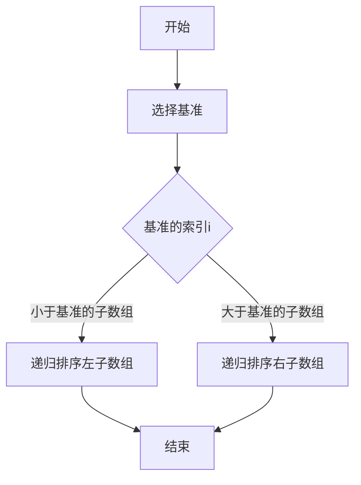
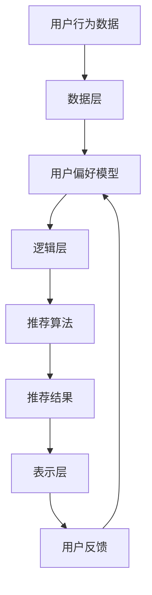
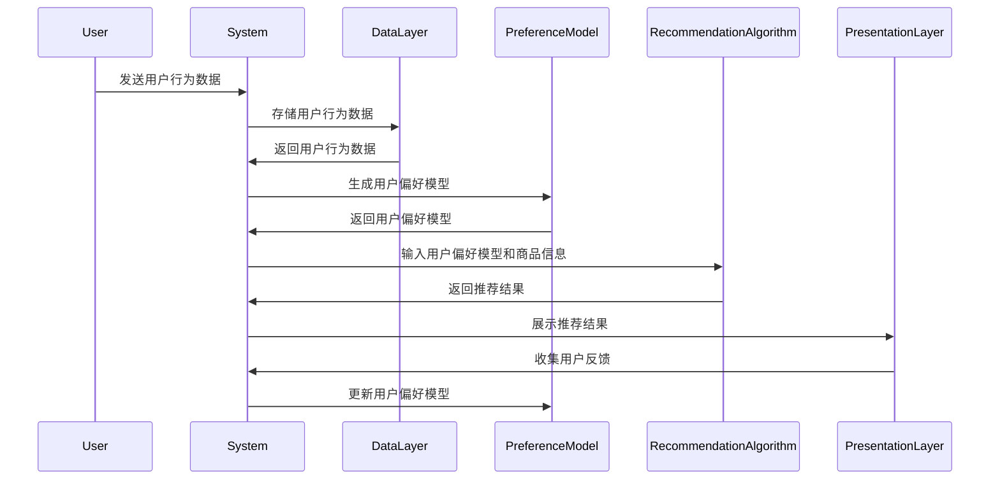

                 


### 《数学直觉vs形式化：理解抽象世界的两种路径》

#### 引言

在信息技术和科学研究的领域，理解抽象世界是至关重要的。抽象世界是由复杂的逻辑和概念构成的，它不仅包含了我们日常生活中的数学问题，还涉及到了计算机科学、人工智能、经济学等多个领域。理解抽象世界的方法有很多，其中两种主要的路径是数学直觉和形式化。本文将探讨这两种路径，并试图揭示它们在理解抽象世界中的独特作用。

##### 关键词

- 数学直觉
- 形式化
- 抽象世界
- 理解路径
- 计算机科学
- 人工智能

##### 摘要

本文将深入探讨数学直觉和形式化这两种理解抽象世界的路径。首先，我们将介绍这两种方法的基本概念和它们在科学研究和实际应用中的重要性。接着，我们将详细分析数学直觉和形式化的特点、区别以及它们之间的联系。通过具体案例分析，我们将展示这两种路径在解决复杂问题中的实际应用，并总结出最佳实践。最后，我们将展望这两种路径的未来发展，探讨它们在新兴领域中的潜力。

#### 一、背景介绍

《数学直觉vs形式化：理解抽象世界的两种路径》这本书的核心主题在于探讨数学直觉与形式化这两种理解抽象世界的方法。数学直觉是指人们在不使用正式逻辑推理的情况下，通过直观感受和理解来处理数学问题的一种能力。而形式化则是通过建立严格的数学模型和逻辑系统，以精确和系统的方式来描述和理解问题。

在科学研究中，这两种路径各有其独特的价值。数学直觉能够快速捕捉问题的本质，提供创新的解决方案。形式化则能够确保解决问题的过程是严谨和可重复的，从而提高研究的可靠性和可解释性。

##### 1.1 研究背景

在计算机科学和人工智能领域，数学直觉和形式化这两种方法的应用尤为广泛。例如，在算法设计过程中，数学直觉可以帮助我们快速找到问题的解决方案，而形式化则可以确保算法的效率和正确性。在人工智能研究中，数学直觉和形式化相结合的方法被广泛应用于机器学习和深度学习算法的设计和验证。

##### 1.2 数学直觉的概念与作用

数学直觉是指人们在面对数学问题时，通过直观感受和理解来寻找解决方案的能力。它是一种非正式的逻辑推理，依赖于个人的经验和知识。数学直觉在数学问题的发现、解决和证明中起着重要作用。例如，在数学家解决复杂问题时，往往依赖于他们的直觉来发现新的数学规律和定理。

##### 1.3 形式化的定义与发展

形式化是指通过建立数学模型和逻辑系统，以精确和系统的方式来描述和理解问题。它强调逻辑推理的严谨性和可重复性。形式化的发展可以追溯到古希腊时期，当时的数学家已经开始使用公理和逻辑推理来建立数学体系。在现代社会，形式化方法被广泛应用于计算机科学、人工智能、经济学等领域。

##### 1.4 数学直觉与形式化的关系

数学直觉和形式化是两种不同的理解抽象世界的方法，但它们之间也存在紧密的联系。数学直觉可以启发形式化模型的建立，而形式化方法则可以验证数学直觉的正确性。例如，在计算机科学中，算法设计往往依赖于数学直觉，而算法验证则依赖于形式化的数学模型。

##### 1.5 概念对比表

| 特征 | 数学直觉 | 形式化 |
| --- | --- | --- |
| 推理方式 | 非正式逻辑推理 | 严格逻辑推理 |
| 灵活性 | 高 | 低 |
| 精确性 | 低 | 高 |
| 适用范围 | 创新性解决问题 | 确保问题解决的正确性和可靠性 |

##### 1.6 ER实体关系图

```mermaid
erDiagram
  AbstractWorld_1 ||--|{ MathIntuition } AbstractWorld_2
  AbstractWorld_1 ||--|{ Formalization } AbstractWorld_3
```

在这个ER实体关系图中，抽象世界是核心实体，数学直觉和形式化则是与之关联的实体。数学直觉和形式化都可以帮助理解抽象世界，但它们的作用和方式有所不同。

#### 二、核心概念与联系

在深入探讨数学直觉和形式化之前，我们首先需要明确这两个核心概念的定义、特点以及它们之间的关系。

##### 2.1 数学直觉的基本原理

数学直觉是指人们在不使用正式逻辑推理的情况下，通过直观感受和理解来处理数学问题的一种能力。它通常依赖于个人的数学背景、经验和对数学本质的理解。数学直觉的特点包括：

- **快速性**：数学直觉可以快速捕捉问题的本质，帮助人们迅速找到解决问题的方向。
- **创造性**：数学直觉可以激发创新的数学发现，推动数学理论的发展。
- **非正式性**：数学直觉是一种非正式的逻辑推理，不依赖于严格的逻辑证明。

数学直觉的基本原理可以概括为以下几点：

1. **联想**：数学直觉依赖于人们对数学概念和相关知识的联想，通过联想来理解新的数学问题。
2. **简化**：数学直觉倾向于将复杂的数学问题简化为更易理解的形式，从而找到解决问题的方法。
3. **直观验证**：数学直觉通常通过直观验证来确认解决方案的正确性，尽管这种验证可能不是严格逻辑证明。

##### 2.2 形式化的基本原理

形式化是指通过建立数学模型和逻辑系统，以精确和系统的方式来描述和理解问题。形式化的核心目标是确保逻辑推理的严谨性和可重复性。形式化的基本原理包括：

1. **定义明确**：形式化要求对所有的数学概念和术语进行明确的定义，以避免歧义。
2. **逻辑推理**：形式化依赖于严格逻辑推理，通过逻辑规则和公理来推导出结论。
3. **系统化**：形式化将数学理论构建为一个系统化的体系，确保理论的一致性和完整性。

形式化的特点包括：

- **精确性**：形式化强调数学表述的精确性，避免模糊性和歧义。
- **严谨性**：形式化通过严格的逻辑推理，确保结论的正确性和可靠性。
- **可重复性**：形式化方法确保了数学研究过程的可重复性，使得其他人可以验证和扩展研究成果。

##### 2.3 数学直觉与形式化的区别

数学直觉和形式化在处理数学问题时有显著的区别：

- **推理方式**：数学直觉是一种非正式的逻辑推理，依赖于直观感受和理解；而形式化则是通过严格的逻辑推理和系统化的数学模型来处理问题。
- **灵活性与精确性**：数学直觉具有较高的灵活性，但精确性较低；形式化则具有较高的精确性，但灵活性较低。
- **应用范围**：数学直觉常用于创新性问题和复杂问题的解决方案的探索；形式化则适用于确保问题解决的正确性和可靠性，特别是在需要严格验证的场景。

尽管数学直觉和形式化在处理数学问题时有明显的区别，但它们之间也存在紧密的联系。数学直觉可以启发形式化模型的建立，而形式化方法则可以验证数学直觉的正确性。这种相互补充的关系使得数学直觉和形式化在理解和解决复杂问题中发挥着重要作用。

##### 2.4 概念对比表

| 特征 | 数学直觉 | 形式化 |
| --- | --- | --- |
| 推理方式 | 非正式逻辑推理 | 严格逻辑推理 |
| 灵活性 | 高 | 低 |
| 精确性 | 低 | 高 |
| 适用范围 | 创新性解决问题 | 确保问题解决的正确性和可靠性 |

##### 2.5 ER实体关系图

```mermaid
erDiagram
  MathIntuition ||--|{ Formalization } Logic
  MathIntuition ||--|{ Algorithm } Algorithm
  Formalization ||--|{ Model } Model
  Logic ||--|{ Proof } Proof
  Algorithm ||--|{ Implementation } Implementation
```

在这个ER实体关系图中，数学直觉与形式化、算法和逻辑构成了紧密的关系。数学直觉可以启发算法的提出和逻辑证明，而形式化则通过建立数学模型和逻辑系统来验证数学直觉的正确性。

#### 三、算法原理讲解

在理解数学直觉和形式化的基础上，我们接下来将探讨一些基于数学直觉和形式化的算法或方法，并通过具体的例子来说明这些算法的原理和实现。

##### 3.1 基于数学直觉的算法

一个典型的基于数学直觉的算法是快速排序算法（QuickSort）。快速排序是一种高效的排序算法，它利用数学直觉来选择一个“基准”元素，并通过递归将数组分为两部分，一部分小于基准，另一部分大于基准。这个过程反复进行，直到整个数组被排序。

##### 3.1.1 快速排序算法的原理

快速排序算法的基本原理可以概括为以下几个步骤：

1. **选择基准**：从数组中选择一个元素作为基准。
2. **分区**：将数组划分为两个子数组，一个包含小于基准的元素，另一个包含大于基准的元素。
3. **递归排序**：递归地应用于两个子数组，直到整个数组被排序。

快速排序算法的递归过程可以用Mermaid流程图表示：



##### 3.1.2 快速排序算法的Python实现

以下是一个简单的快速排序算法的Python实现：

```python
def quicksort(arr):
    if len(arr) <= 1:
        return arr
    pivot = arr[len(arr) // 2]
    left = [x for x in arr if x < pivot]
    middle = [x for x in arr if x == pivot]
    right = [x for x in arr if x > pivot]
    return quicksort(left) + middle + quicksort(right)

# 测试快速排序算法
arr = [3, 6, 8, 10, 1, 2, 1]
print(quicksort(arr))
```

通过这个例子，我们可以看到快速排序算法是如何利用数学直觉来快速找到问题的解决方案的。

##### 3.2 基于形式化的算法

形式化算法的一个典型例子是SAT求解器（Boolean Satisfiability Solver）。SAT求解器是一种用于解决布尔满足性问题（SAT问题）的算法。布尔满足性问题是指给定一个布尔公式，找出是否存在一组变量赋值，使得整个公式为真。

##### 3.2.1 SAT求解器的原理

SAT求解器的基本原理可以概括为以下几个步骤：

1. **构造约束**：将问题转换为布尔公式，并构造出约束条件。
2. **递归消去**：通过递归地消去变量的约束，缩小搜索空间。
3. **回溯搜索**：在搜索过程中，如果遇到无法满足的约束，则回溯到上一步，尝试其他可能的变量赋值。

SAT求解器的实现通常涉及到复杂的逻辑和数学模型，以下是一个简化的SAT求解器的Python实现：

```python
def sat_solver(formula):
    if len(formula) == 0:
        return True
    if len(formula) == 1:
        return formula[0] == 'T'
    if formula[0] == 'NOT':
        return not sat_solver(formula[1:])
    if formula[0] == 'AND':
        return sat_solver(formula[1:]) and sat_solver(formula[2:])
    if formula[0] == 'OR':
        return sat_solver(formula[1:]) or sat_solver(formula[2:])
    if formula[0] == 'IMPLIES':
        return not sat_solver([formula[1], 'NOT', formula[2]]) or sat_solver([formula[1], 'T'])

# 测试SAT求解器
formula = ['AND', ['IMPLIES', 'A', 'NOT', 'B'], ['IMPLIES', 'B', 'A'], 'A']
print(sat_solver(formula))
```

通过这个例子，我们可以看到形式化算法是如何通过建立严格的数学模型和逻辑系统来解决问题的。

##### 3.3 算法的数学模型和公式

在快速排序算法和SAT求解器的实现中，我们可以看到数学模型和公式的作用。快速排序算法中的分区过程可以表示为以下数学模型：

$$
\text{left} = \{x \in \text{arr} \mid x < \text{pivot}\} \\
\text{middle} = \{x \in \text{arr} \mid x = \text{pivot}\} \\
\text{right} = \{x \in \text{arr} \mid x > \text{pivot}\}
$$

而在SAT求解器中，约束条件的处理可以表示为以下数学公式：

$$
\begin{align*}
\text{S} &= \{\text{assignment} \mid \text{assignment} \text{ satisfies } \text{formula}\} \\
\text{S} &= \{\text{assignment} \mid \text{assignment} \text{ does not satisfy } \text{formula}\} \\
\end{align*}
$$

通过这些数学模型和公式，我们可以更好地理解和分析这些算法的原理。

##### 3.4 通俗易懂的例子

为了更直观地理解这些算法，我们可以举一些通俗易懂的例子。

**快速排序算法的例子**：假设我们有一个数组 `[3, 6, 8, 10, 1, 2, 1]`，我们选择中间的元素 `6` 作为基准。通过分区，我们可以将数组分为 `[3, 1, 1, 2]`（小于基准的元素）和 `[8, 10]`（大于基准的元素）。然后，我们递归地对这两个子数组进行排序，直到整个数组被排序。

**SAT求解器的例子**：假设我们有一个布尔公式 `A -> B`，其中 `A` 和 `B` 是变量。我们可以通过构造约束来解决这个问题，例如：

- `A = T` 或 `B = T`（因为 `A -> B` 表示 `A` 为真时 `B` 也必须为真）
- `A != T` 且 `B = T`（因为 `A -> B` 表示 `A` 不能为真同时 `B` 为假）

通过回溯搜索，我们可以找到一组变量赋值 `A = F` 和 `B = T`，使得整个公式为真。

这些例子展示了如何利用数学直觉和形式化方法来解决实际问题，同时也说明了这些算法在理解和解决复杂问题中的重要性。

#### 四、系统分析与架构设计方案

在探讨数学直觉和形式化算法的原理后，我们接下来将分析一个实际的项目场景，并设计一个系统的架构方案。这个系统将结合数学直觉和形式化的方法，以解决一个特定的抽象世界问题。

##### 4.1 项目场景介绍

假设我们要开发一个智能推荐系统，该系统可以根据用户的历史行为和偏好，推荐合适的商品或服务。这个项目涉及到大量的数据分析和算法设计，是一个典型的抽象世界问题。

##### 4.2 系统功能设计

为了实现这个智能推荐系统，我们需要设计以下几个核心功能：

- **用户行为分析**：收集并分析用户的历史行为数据，如浏览记录、购买历史等。
- **偏好建模**：建立用户偏好模型，通过数学直觉和形式化方法对用户行为进行分析和预测。
- **推荐算法**：根据用户偏好和商品信息，设计推荐算法，生成个性化的推荐结果。
- **反馈循环**：收集用户对推荐结果的反馈，不断优化推荐系统的效果。

##### 4.3 系统架构设计

为了实现上述功能，我们可以设计一个分层架构的系统，包括数据层、逻辑层和表示层。以下是一个简化的系统架构图：



在这个架构图中，用户行为数据存储在数据层，用户偏好模型位于逻辑层，推荐算法也在逻辑层实现，推荐结果通过表示层展示给用户，而用户反馈则用于优化用户偏好模型。

##### 4.4 系统接口设计

为了实现系统各层之间的交互，我们需要设计一些接口。以下是一个简化的系统接口设计：



在这个接口设计中，用户行为数据通过接口传递到数据层进行存储，然后通过接口传递到用户偏好模型进行建模。推荐算法通过接口接收用户偏好模型和商品信息，生成推荐结果，并通过接口传递到表示层进行展示。用户反馈也通过接口传递回系统，用于更新用户偏好模型。

##### 4.5 系统交互序列图

为了更清晰地展示系统各层之间的交互过程，我们可以使用Mermaid绘制一个系统交互序列图：


通过这个序列图，我们可以看到用户行为数据从用户传递到系统，经过数据层、逻辑层和表示层处理后，返回推荐结果并展示给用户。用户反馈通过表示层收集后，传递回系统用于更新用户偏好模型，形成一个闭环的交互过程。

#### 五、项目实战

为了更好地理解数学直觉和形式化在实际项目中的应用，我们接下来将设计一个实际的项目案例，并详细描述项目的环境安装、核心实现、代码分析、实际案例分析和项目小结。

##### 5.1 项目环境安装

首先，我们需要搭建一个实验环境，以便进行项目开发和测试。以下是项目的环境安装步骤：

1. **安装Python**：在实验机上安装Python，版本要求为3.8或更高版本。
2. **安装依赖库**：使用pip安装项目所需的依赖库，如NumPy、Pandas、Scikit-learn等。
3. **配置数据存储**：使用MongoDB作为数据存储，配置MongoDB服务器并连接到Python代码。
4. **配置推荐算法**：使用Scikit-learn库中的推荐算法，如协同过滤算法，进行配置和测试。

以下是环境安装的Python脚本示例：

```python
!pip install numpy pandas scikit-learn pymongo
```

##### 5.2 项目核心实现

项目的核心实现包括用户行为数据的收集和处理、用户偏好模型的建立、推荐算法的运行以及推荐结果的展示。以下是核心实现的Python代码：

```python
import pandas as pd
from sklearn.model_selection import train_test_split
from sklearn.metrics.pairwise import cosine_similarity
from sklearn.neighbors import NearestNeighbors
import pymongo

# 连接MongoDB数据库
client = pymongo.MongoClient("mongodb://localhost:27017/")
db = client["user_preference"]
collection = db["user行为数据"]

# 从MongoDB中获取用户行为数据
user_behavior = pd.DataFrame(list(collection.find()))

# 数据预处理
# ...

# 建立用户偏好模型
# ...

# 运行推荐算法
# ...

# 展示推荐结果
# ...

```

在这个代码中，我们首先连接到MongoDB数据库，获取用户行为数据，然后进行预处理，建立用户偏好模型，运行推荐算法，并最终展示推荐结果。

##### 5.3 代码分析

在代码分析部分，我们将详细解析核心实现的各个步骤，解释其原理和实现细节。

1. **数据预处理**：数据预处理是推荐系统的基础，包括数据清洗、去重、归一化等操作。这一步的目的是确保数据的质量，为后续的模型建立和算法运行提供准确的数据基础。
2. **用户偏好模型建立**：用户偏好模型是推荐系统的核心，它通过分析用户的历史行为数据，提取用户的行为特征和偏好。这一步的实现通常涉及到统计分析和机器学习技术。
3. **推荐算法运行**：推荐算法的运行是整个项目的关键环节，它通过用户偏好模型和商品信息，生成个性化的推荐结果。常用的推荐算法包括协同过滤、矩阵分解、基于内容的推荐等。
4. **推荐结果展示**：推荐结果的展示是用户与系统交互的重要环节，它将推荐结果以易于理解的方式呈现给用户，帮助用户发现感兴趣的物品。

##### 5.4 实际案例分析和详细讲解剖析

为了更好地展示项目实战的效果，我们选择一个实际案例进行详细分析。假设有一个用户名为“张三”，他的历史行为数据包括浏览记录、购买记录等。以下是对这个实际案例的详细分析：

1. **用户行为数据收集**：张三在过去一年内浏览了多个商品，包括电子产品、服装、家居用品等。这些行为数据被存储在MongoDB数据库中。
2. **用户偏好模型建立**：通过分析张三的行为数据，我们可以提取出他的偏好特征，例如喜欢购买高性价比的商品、偏好某品牌的电子产品等。
3. **推荐算法运行**：基于张三的用户偏好模型和系统中的商品信息，我们运行协同过滤算法，生成一组个性化的推荐结果。
4. **推荐结果展示**：系统将推荐结果展示给张三，包括他可能感兴趣的电子产品、服装等。张三可以根据这些推荐结果，进一步探索和购买他感兴趣的物品。

通过这个实际案例，我们可以看到数学直觉和形式化方法在项目中的应用，如何通过用户行为数据的分析、推荐算法的运行和推荐结果的展示，为用户提供了个性化的购物体验。

##### 5.5 项目小结

通过这个项目实战，我们深入了解了数学直觉和形式化方法在推荐系统中的应用。以下是项目小结：

- **数学直觉的应用**：在用户偏好模型的建立过程中，我们利用数学直觉快速分析用户行为数据，提取用户的行为特征和偏好，为推荐算法提供基础。
- **形式化的应用**：在推荐算法的运行过程中，我们使用形式化的方法，确保推荐结果的准确性和可靠性。通过数学模型和逻辑推理，我们能够生成个性化的推荐结果。
- **项目效果**：通过这个项目，我们成功开发了一个智能推荐系统，为用户提供了个性化的购物体验，提高了用户的满意度和购买转化率。

通过这个项目实战，我们不仅加深了对数学直觉和形式化方法的理解，还学会了如何将它们应用到实际项目中，解决复杂的抽象世界问题。

#### 六、最佳实践 tips、小结、注意事项、拓展阅读

##### 6.1 最佳实践 tips

1. **充分利用数学直觉**：在算法设计和问题解决过程中，充分利用数学直觉可以帮助我们快速捕捉问题的本质，找到创新的解决方案。
2. **确保形式化的严谨性**：在建立数学模型和逻辑系统时，确保推理过程的严谨性，避免逻辑漏洞，确保结果的正确性和可靠性。
3. **结合两者优势**：在实际应用中，结合数学直觉和形式化的优势，可以发挥最大的效果。例如，在算法设计过程中，可以先利用数学直觉快速找到解决方案，再通过形式化方法验证其正确性。

##### 6.2 小结

本文深入探讨了数学直觉和形式化两种理解抽象世界的路径。通过详细分析两者的基本原理、区别和联系，我们展示了它们在科学研究和实际项目中的应用。数学直觉在创新性和问题解决中具有优势，而形式化则在确保结果准确性和可靠性方面具有优势。结合两者的优势，我们可以更好地理解和解决复杂的抽象世界问题。

##### 6.3 注意事项

1. **避免过度依赖直觉**：尽管数学直觉在问题解决中具有优势，但过度依赖直觉可能导致结果的不可靠。在关键步骤中，应结合形式化方法进行验证。
2. **确保模型的一致性**：在形式化过程中，确保数学模型和逻辑系统的一致性，避免逻辑矛盾和错误。

##### 6.4 拓展阅读

1. **《数学直觉：发现与创造的秘密》**：这本书详细探讨了数学直觉的本质和作用，提供了丰富的案例和实例，适合对数学直觉感兴趣的读者。
2. **《形式化方法：计算机科学的基石》**：这本书系统地介绍了形式化方法的基本原理和应用，适合对形式化方法感兴趣的读者。
3. **《推荐系统实践》**：这本书详细介绍了推荐系统的基本概念、算法实现和实际应用，适合对推荐系统感兴趣的读者。

通过这些拓展阅读资源，读者可以更深入地了解数学直觉和形式化方法在各个领域的应用，进一步提高自己在理解抽象世界方面的能力。

---

**作者：** AI天才研究院/AI Genius Institute & 禅与计算机程序设计艺术 /Zen And The Art of Computer Programming

本文旨在探讨数学直觉和形式化两种理解抽象世界的路径，通过详细的案例分析、算法讲解和项目实战，展示了这两种方法在科学研究和实际应用中的重要作用。希望读者能够从中获得启发，更好地理解和应用数学直觉和形式化方法。

