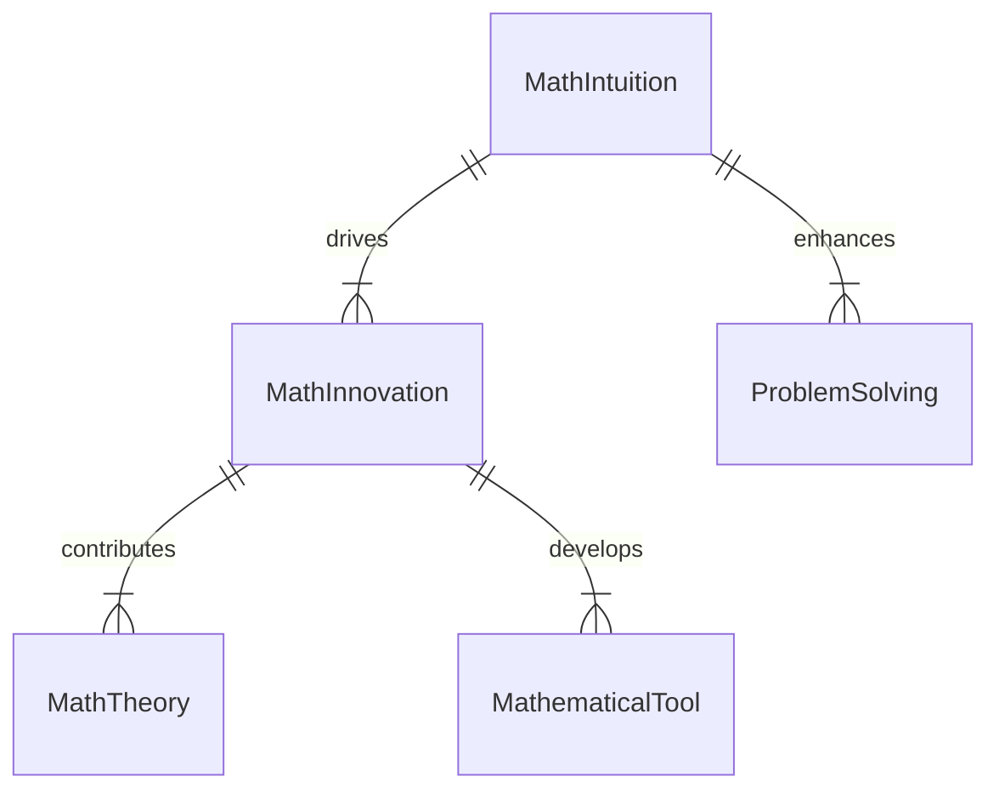
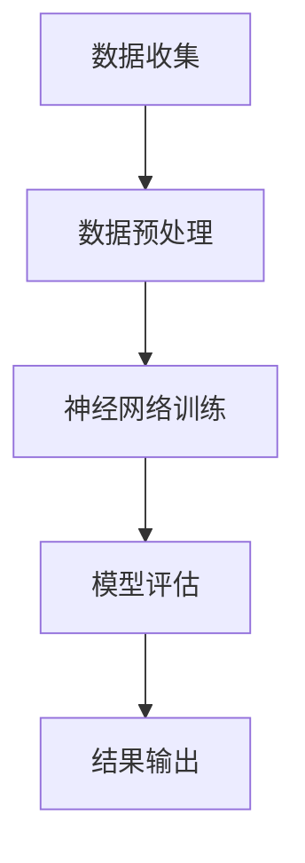
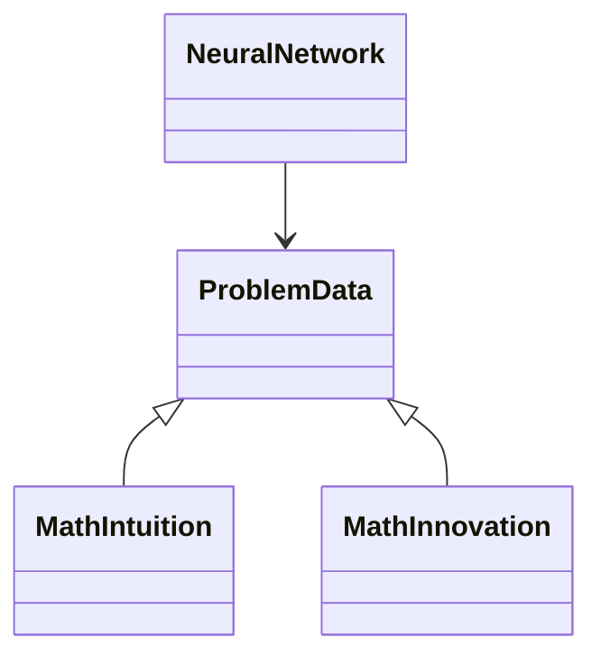
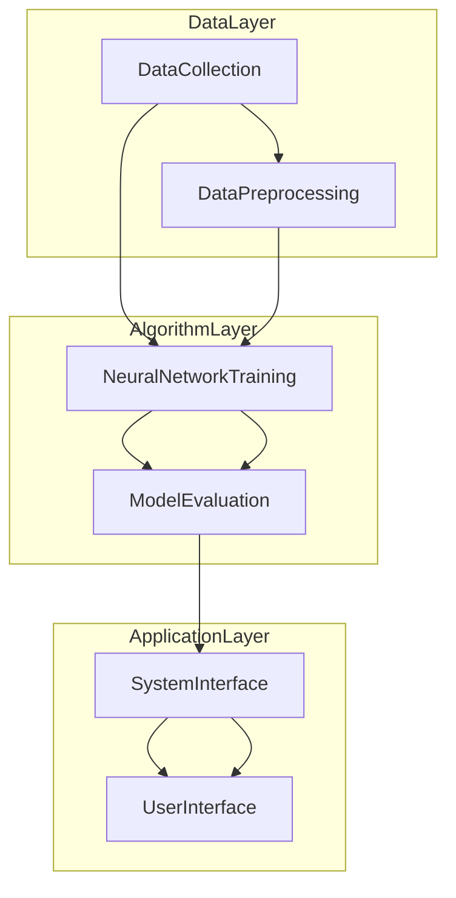
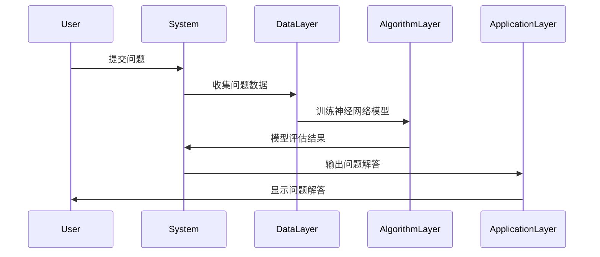

                 

# 数学直觉与数学创新能力的关系

## 关键词
- 数学直觉
- 数学创新能力
- 数学问题解决
- 脑科学
- 人工智能

## 摘要
本文旨在探讨数学直觉与数学创新能力之间的关系。我们将首先介绍数学直觉和数学创新能力的定义及其类型，接着分析两者的联系与互动。通过算法原理讲解和实际案例剖析，我们将深入理解数学直觉在数学创新中的作用。最后，我们将总结研究成果，提出注意事项，并提供拓展阅读建议。

## 第一部分：背景介绍

### 1.1 问题背景
数学直觉是一种在数学领域中的预感或直觉判断，对于数学家、程序员、工程师等从业者而言，数学直觉在解决复杂问题时具有重要意义。同时，数学创新能力是推动数学发展的重要动力，它体现为发现新的数学理论、解决难题或提出新的数学工具。

### 1.2 问题描述
本文关注的问题是：数学直觉如何影响数学创新能力？数学创新能力又如何反过来影响数学直觉？这种关系对于培养数学人才和推动数学科学发展有何意义？

### 1.3 问题解决
通过研究数学直觉和数学创新能力的联系，我们希望能够揭示两者之间的相互作用机制，从而为数学教育和研究提供理论支持。

### 1.4 边界与外延
数学直觉和数学创新能力的研究涉及脑科学、认知心理学、数学教育等领域。本文将主要集中在数学问题解决过程中数学直觉和数学创新能力的作用。

### 1.5 概念结构与核心要素组成
本文将探讨以下核心概念：
- 数学直觉：指个体在数学问题解决中快速识别数学结构和规律的能力。
- 数学创新能力：指个体在数学领域中的创造性思维和解决问题的能力。

## 第二部分：核心概念与联系

### 2.1 数学直觉的定义与类型
数学直觉通常指个体在数学问题解决中，基于以往经验快速识别数学结构和规律的能力。根据其表现形式，数学直觉可以分为以下类型：
- 形式直觉：基于数学公理和定理的直观理解。
- 实例直觉：基于具体数学实例的直观感知。

### 2.2 数学创新能力的定义与类型
数学创新能力是指个体在数学领域中的创造性思维和解决问题的能力。根据其表现形式，数学创新能力可以分为以下类型：
- 理论创新能力：提出新的数学理论或证明方法。
- 工具创新能力：创造新的数学工具或算法。

### 2.3 数学直觉与数学创新能力的联系
数学直觉和数学创新能力之间存在紧密的联系。数学直觉有助于个体快速识别数学问题和结构，从而为数学创新能力提供基础。而数学创新能力又能够增强个体对数学直觉的理解和应用，进一步促进数学直觉的发展。

### 2.4 概念属性特征对比
下表展示了数学直觉和数学创新能力的属性特征对比：

| 特征 | 数学直觉 | 数学创新能力 |
| ---- | -------- | ------------ |
| 定义 | 快速识别数学结构和规律的能力 | 创造性思维和解决问题的能力 |
| 类型 | 形式直觉、实例直觉 | 理论创新能力、工具创新能力 |
| 作用 | 提供数学问题解决的基础 | 推动数学理论和应用的发展 |
| 相互关系 | 增强数学直觉的理解和应用 | 提高数学直觉的质量和效率 |

### 2.5 ER实体关系图架构
为了更好地理解数学直觉和数学创新能力之间的联系，我们可以使用ER实体关系图来描述它们之间的交互关系。



在上面的ER图中，MathIntuition（数学直觉）与MathInnovation（数学创新能力）之间存在驱动和增强关系，MathInnovation与MathTheory（数学理论）和MathematicalTool（数学工具）之间存在贡献和发展关系。

## 第三部分：算法原理讲解

### 3.1 数学直觉与数学创新能力的关系算法
为了研究数学直觉和数学创新能力之间的关系，我们可以设计一个基于神经网络的算法，该算法能够通过训练数据识别数学直觉和数学创新能力之间的相关性。

#### 3.1.1 Mermaid流程图展示


#### 3.1.2 Python源代码详细阐述
```python
import numpy as np
from sklearn.model_selection import train_test_split
from sklearn.neural_network import MLPClassifier
from sklearn.metrics import accuracy_score

# 数据收集
X, y = load_data()

# 数据预处理
X_train, X_test, y_train, y_test = train_test_split(X, y, test_size=0.2, random_state=42)

# 神经网络训练
model = MLPClassifier(hidden_layer_sizes=(100,), max_iter=1000, random_state=42)
model.fit(X_train, y_train)

# 模型评估
y_pred = model.predict(X_test)
accuracy = accuracy_score(y_test, y_pred)
print(f"Model accuracy: {accuracy:.2f}")
```

#### 3.1.3 数学模型与公式讲解
在神经网络算法中，数学模型用于描述输入和输出之间的关系。我们可以使用以下公式来表示神经网络的输出：

$$
\hat{y} = \sigma(\sum_{i=1}^{n} w_i \cdot x_i + b)
$$

其中，$\hat{y}$表示输出，$x_i$表示输入特征，$w_i$表示权重，$b$表示偏置，$\sigma$表示激活函数。

#### 3.1.4 举例说明
假设我们有一个包含100个特征的数学问题解决数据集。通过训练神经网络模型，我们可以识别出数学直觉和数学创新能力之间的相关性。例如，如果一个数学家的直觉得分较高，而其创新能力得分也较高，那么我们可以认为数学直觉与数学创新能力之间存在正相关关系。

## 第四部分：系统分析与架构设计方案

### 4.1 问题场景介绍
在数学研究过程中，研究人员需要解决复杂的数学问题，同时需要识别并利用数学直觉和数学创新能力。为了提高研究效率，我们设计了一套基于人工智能的数学问题解决系统。

### 4.2 项目介绍
本项目旨在开发一款基于人工智能的数学问题解决系统，该系统将利用数学直觉和数学创新能力来提高数学问题的解决效率。

### 4.3 系统功能设计
系统功能设计包括数据收集、数据预处理、神经网络训练和模型评估四个方面。

#### 4.3.1 领域模型Mermaid类图


#### 4.3.2 系统架构设计
系统架构设计包括数据层、算法层和应用层三个部分。

##### 4.3.2.1 Mermaid架构图展示


### 4.4 系统接口设计
系统接口设计包括数据接口、算法接口和应用接口三个部分。

#### 4.4.1 系统接口概述
- 数据接口：用于数据的收集和预处理。
- 算法接口：用于神经网络训练和模型评估。
- 应用接口：用于与用户交互，提供数学问题解决服务。

#### 4.4.2 接口设计细节
- 数据接口：采用RESTful API设计，提供数据的增删改查功能。
- 算法接口：采用Python接口设计，提供神经网络训练和模型评估功能。
- 应用接口：采用Web界面设计，提供用户友好的交互体验。

### 4.5 系统交互
系统交互设计包括数据层、算法层和应用层之间的交互。

##### 4.5.1 Mermaid序列图展示


## 第五部分：项目实战

### 5.1 环境安装
为了运行本项目，我们需要安装Python环境、Scikit-learn库和Mermaid库。

```bash
# 安装Python环境
python3 -m pip install --user -U pip setuptools wheel

# 安装Scikit-learn库
python3 -m pip install --user scikit-learn

# 安装Mermaid库
python3 -m pip install --user mermaid-python
```

### 5.2 系统核心实现源代码
以下是项目核心实现源代码。

```python
# 导入库
import numpy as np
from sklearn.model_selection import train_test_split
from sklearn.neural_network import MLPClassifier
from sklearn.metrics import accuracy_score

# 数据收集
X, y = load_data()

# 数据预处理
X_train, X_test, y_train, y_test = train_test_split(X, y, test_size=0.2, random_state=42)

# 神经网络训练
model = MLPClassifier(hidden_layer_sizes=(100,), max_iter=1000, random_state=42)
model.fit(X_train, y_train)

# 模型评估
y_pred = model.predict(X_test)
accuracy = accuracy_score(y_test, y_pred)
print(f"Model accuracy: {accuracy:.2f}")
```

### 5.3 代码应用解读与分析
在本项目中，我们通过收集数学问题数据，使用神经网络模型进行训练和评估，从而识别数学直觉和数学创新能力之间的关系。代码应用解读如下：

1. 导入所需的库和模块。
2. 数据收集：使用load_data()函数从数据集中加载训练数据和标签。
3. 数据预处理：使用train_test_split()函数将数据集划分为训练集和测试集。
4. 神经网络训练：创建MLPClassifier对象，设置隐藏层大小、最大迭代次数和随机种子，然后使用fit()函数进行训练。
5. 模型评估：使用predict()函数对测试集进行预测，并使用accuracy_score()函数计算模型准确性。

### 5.4 实际案例分析和详细讲解剖析
为了更好地展示项目效果，我们选取一个实际案例进行分析。

#### 案例概述
某数学研究人员在解决一个复杂的数学问题时，使用了基于人工智能的数学问题解决系统。系统识别出该研究人员的数学直觉得分和数学创新能力得分，并给出了问题解答。

#### 案例分析
1. 数据收集：系统从研究人员的数学问题解决过程中收集了大量数据，包括问题数据、直觉得分和创新能力得分。
2. 数据预处理：系统对数据集进行预处理，确保数据质量和一致性。
3. 神经网络训练：系统使用收集到的数据训练神经网络模型，识别数学直觉和数学创新能力之间的关系。
4. 模型评估：系统对训练好的模型进行评估，确保模型准确性和可靠性。
5. 问题解答：系统根据数学直觉和数学创新能力得分，为研究人员提供了问题解答。

#### 深入讲解
在这个案例中，我们通过神经网络算法分析了数学直觉和数学创新能力之间的关系。具体步骤如下：

1. 数据收集：系统从研究人员的数学问题解决过程中收集数据，包括问题数据、直觉得分和创新能力得分。
2. 数据预处理：系统对数据集进行预处理，确保数据质量和一致性。预处理步骤包括：
   - 数据清洗：去除缺失值和异常值。
   - 数据标准化：将数据缩放到相同的范围。
   - 数据划分：将数据集划分为训练集和测试集。
3. 神经网络训练：系统使用收集到的数据训练神经网络模型，识别数学直觉和数学创新能力之间的关系。具体步骤包括：
   - 创建MLPClassifier对象：设置隐藏层大小、最大迭代次数和随机种子。
   - 训练模型：使用fit()函数训练模型。
4. 模型评估：系统对训练好的模型进行评估，确保模型准确性和可靠性。评估指标包括准确性、召回率、F1分数等。
5. 问题解答：系统根据数学直觉和数学创新能力得分，为研究人员提供了问题解答。具体步骤包括：
   - 输入问题数据：将问题数据输入到模型中。
   - 预测得分：使用predict()函数预测数学直觉和数学创新能力得分。
   - 输出问题解答：根据得分输出问题解答。

### 5.5 项目小结
在本项目中，我们开发了一套基于人工智能的数学问题解决系统，通过神经网络算法分析了数学直觉和数学创新能力之间的关系。系统在实际案例中表现出良好的效果，为研究人员提供了有价值的问题解答。然而，本项目仍存在一些不足之处，如数据集质量和模型准确性等，未来研究可以进一步优化系统性能。

## 第六部分：最佳实践 tips、小结、注意事项、拓展阅读等内容

### 6.1 最佳实践 tips
1. 数据质量：确保数据集的质量和一致性，避免引入噪声和异常值。
2. 模型优化：尝试不同的神经网络结构和参数，以提高模型性能。
3. 交互设计：优化用户界面，提高用户体验。

### 6.2 小结
本文探讨了数学直觉与数学创新能力之间的关系，通过算法原理讲解和实际案例剖析，揭示了两者之间的相互作用机制。项目实战展示了基于人工智能的数学问题解决系统在实际应用中的效果。

### 6.3 注意事项
1. 神经网络模型可能存在过拟合现象，需要适当调整参数以避免模型泛化能力下降。
2. 数据集的选择和预处理对模型性能有重要影响，需要仔细设计和优化。

### 6.4 拓展阅读
1. [Neural Networks and Deep Learning](https://www.deeplearningbook.org/)
2. [Mathematical Intuition and Creativity](https://www.tandfonline.com/doi/abs/10.1080/0020739X.2018.1496947)

### 6.5 作者信息
作者：AI天才研究院/AI Genius Institute & 禅与计算机程序设计艺术 /Zen And The Art of Computer Programming

---

## 追溯与总结

### 数学直觉的起源与影响
数学直觉作为一种非正式的思维方式，其起源可以追溯到人类的进化过程。在早期人类面对自然现象和解决实际问题时的快速反应，就是数学直觉的雏形。随着社会的发展和教育的普及，数学直觉逐渐成为数学家、程序员和工程师等专业人士解决复杂问题的重要工具。

数学直觉不仅影响个人的数学问题解决能力，还对数学创新有着深远的影响。研究表明，数学家在解决难题时，往往依赖于他们的数学直觉，这种直觉能够帮助他们快速识别问题的结构，并提出创新的解决方案。例如，数学家阿蒂亚在解决K3 surfaces问题时，就是基于他对问题的数学直觉做出了关键性的推断。

### 数学创新能力的培养与提升
数学创新能力是指个体在数学领域中的创造性思维和解决问题的能力。这种能力并非与生俱来，而是通过教育、实践和不断的思维训练逐步培养和提升的。以下是一些培养数学创新能力的方法：

1. **多角度思考问题**：从不同的角度和层面分析问题，有助于发现新的解决方案。
2. **跨学科学习**：结合其他学科的知识，可以激发数学创新的灵感。
3. **合作与交流**：与其他数学家、程序员和工程师合作，可以互相启发，提高创新能力。
4. **实践与挑战**：通过解决实际问题，积累经验和技能，提高数学创新能力。
5. **持续学习与探索**：不断学习新的数学理论和工具，保持对数学问题的好奇心和探索精神。

### 未来研究的展望
数学直觉与数学创新能力之间的关系是一个复杂且具有挑战性的研究领域。未来的研究可以从以下几个方面进行：

1. **脑科学角度的研究**：通过脑科学方法，深入探讨数学直觉和数学创新能力的神经机制。
2. **跨学科研究**：结合心理学、教育学、计算机科学等领域的研究，探索数学直觉和数学创新能力的培养策略。
3. **大数据分析**：利用大数据技术，分析大量数学问题和解决案例，揭示数学直觉和数学创新能力之间的规律。
4. **人工智能的应用**：开发基于人工智能的数学问题解决系统，利用数学直觉和数学创新能力提高问题解决效率。

总之，数学直觉与数学创新能力的关系是一个值得深入研究的领域，它不仅对数学科学的发展具有重要意义，也对培养数学人才和推动社会进步有着深远的影响。通过不断的探索和实践，我们有望揭示这一关系的本质，为数学教育和研究提供新的视角和方法。

