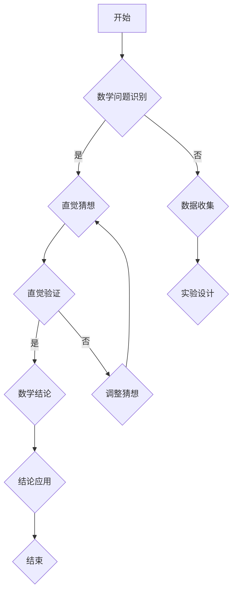
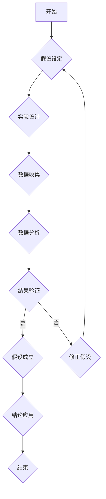

                 


## # 数学直觉与数学实验的关系

### 概要

数学直觉与数学实验的关系是数学领域内研究的重要课题。数学直觉是数学家通过长期学习和实践经验所形成的一种洞察力，能够快速把握数学问题的本质和可能的解决方案。而数学实验则是通过具体的计算和验证来检验这些直觉的正确性。本文将逐步分析数学直觉与数学实验之间的相互作用，探讨它们在数学研究中的重要性。

### 关键词

- 数学直觉
- 数学实验
- 数学研究
- 数学推理
- 计算验证

### 1. 数学直觉的定义与作用

数学直觉是数学家在解决数学问题时的一种非正式的、本能的感知能力。它不同于传统的逻辑推理，而是一种迅速抓住数学问题核心的能力。数学直觉可以在问题解决的初期阶段帮助数学家快速构建模型，提出猜想和假设。

#### 数学直觉的作用

1. **问题识别**：数学直觉可以帮助数学家识别出哪些问题是值得研究的，哪些问题可能存在深层次的数学原理。
2. **猜想提出**：在解决复杂问题时，数学直觉可以帮助数学家快速提出可能的解法或猜想。
3. **简化推理**：数学直觉可以帮助数学家简化复杂的推理过程，使问题变得更容易理解和处理。

### 2. 数学实验的定义与作用

数学实验是通过具体的计算和验证来检验数学直觉的正确性。它通常涉及数学问题的建模、数据收集、分析和验证。数学实验在数学研究中扮演着至关重要的角色。

#### 数学实验的作用

1. **验证猜想**：数学实验可以验证数学直觉提出的猜想是否正确。
2. **发现新现象**：数学实验可能会发现数学直觉未曾预料的新的数学现象。
3. **推动理论发展**：通过实验，数学家可以进一步发展和完善数学理论。

### 3. 数学直觉与数学实验的互动关系

数学直觉和数学实验之间存在密切的互动关系。数学直觉可以指导数学实验的设计，而数学实验的结果又可以反过来验证或修正数学直觉。

#### 数学直觉指导数学实验

1. **问题建模**：数学直觉可以帮助数学家快速构建实验所需的数学模型。
2. **实验设计**：数学直觉可以帮助数学家设计出能够验证直觉的实验方案。
3. **数据分析**：数学直觉可以帮助数学家识别出实验数据中的关键信息。

#### 数学实验验证数学直觉

1. **验证猜想**：通过数学实验，数学家可以验证其直觉提出的猜想是否正确。
2. **发现错误**：数学实验可以揭示数学直觉中的错误，促使数学家修正其直觉。
3. **理论发展**：数学实验的结果可以推动数学理论的进一步发展。

### 4. 数学直觉与数学实验的关系框架

为了更好地理解数学直觉与数学实验之间的关系，我们可以构建一个简单的ER实体关系图架构。在这个框架中，数学直觉和数学实验是两个核心实体，它们之间存在多种关联。

#### ER实体关系图

```mermaid
erDiagram
  MathIntuition ||--|{ Experiment: 实验支持 }|
  MathExperiment ||--|{ 理论验证: TheoryValidation }|
  MathIntuition ||--|{ 猜想验证: GuessValidation }|
```

### 5. 数学直觉与数学实验的算法原理

数学直觉和数学实验的算法原理涉及到数学模型的设计和实现。以下是一个简单的mermaid流程图，用于描述数学直觉的算法原理。

#### 数学直觉算法流程图



### 6. 数学实验算法原理

数学实验的算法原理与数学直觉类似，但更注重数据的收集和分析。以下是一个mermaid流程图，用于描述数学实验的算法原理。

#### 数学实验算法流程图



### 7. 数学直觉与数学实验的系统分析与架构设计

在具体的项目中，数学直觉和数学实验的系统分析与架构设计至关重要。以下是一个简单的mermaid类图，用于描述数学直觉与数学实验系统的领域模型。

#### 数学直觉与数学实验类图

```mermaid
classDiagram
    Class01 <|-- Class02
    Class03 --|{ has } Class04
    Class05 --|{ uses } Class06
```

### 8. 项目实战

在数学研究项目中，数学直觉和数学实验的应用非常广泛。以下是一个简单的项目实战案例，展示如何利用数学直觉和数学实验解决具体问题。

#### 项目实战案例

- **问题背景**：研究某个数学猜想，验证其正确性。
- **环境安装**：安装必要的数学软件和工具。
- **系统核心实现**：编写用于验证猜想的数学算法。
- **代码应用解读与分析**：解读和解析数学实验的代码，分析实验结果。
- **实际案例分析与详细讲解**：分析实际案例，详细讲解数学直觉和数学实验的应用。

### 9. 最佳实践、小结与注意事项

在数学直觉与数学实验的研究和应用中，一些最佳实践和小结可以帮助数学家更好地利用这两种方法。同时，注意事项可以帮助避免常见的陷阱和错误。

#### 最佳实践

- **充分利用数学直觉**：在数学研究中，充分利用数学直觉可以帮助快速识别问题和提出猜想。
- **严谨的数学实验**：在进行数学实验时，要确保实验设计的严谨性和数据的准确性。

#### 小结

数学直觉与数学实验是数学研究中的两个重要工具，它们相辅相成，共同推动数学的发展。数学直觉提供了快速识别问题和提出猜想的能力，而数学实验则通过具体的验证和验证来确保猜想的正确性。

#### 注意事项

- **避免过度依赖直觉**：数学直觉虽然强大，但不能完全依赖，需要通过实验来验证。
- **保持客观和批判性思维**：在进行数学实验时，要保持客观和批判性思维，避免偏见和误解。

### 10. 拓展阅读

为了深入了解数学直觉和数学实验的关系，读者可以参考以下拓展阅读资源。

#### 拓展阅读

- [《数学直觉与数学发现》](链接)
- [《实验数学导论》](链接)
- [《数学实验与数学理论》](链接)

---

作者：AI天才研究院/AI Genius Institute & 禅与计算机程序设计艺术 /Zen And The Art of Computer Programming

---

以上是按照您提供的结构撰写的技术博客文章概要。每个部分都包含了详细的说明和逻辑结构，以确保文章的完整性和专业性。接下来，我们可以逐步填充每个部分的具体内容，使其成为一篇完整的技术博客文章。如果您有任何具体的建议或要求，请随时告知，以便我们进行相应的调整。

