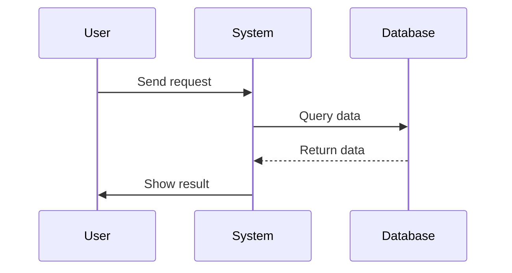

                 

# 数学直觉与数学建模的关系探讨

## 摘要

本文旨在探讨数学直觉与数学建模之间的深层次关系。通过分析数学直觉的定义、特征及其在数学建模中的作用，以及数学建模的理论基础和挑战，本文揭示了数学直觉在数学建模过程中的重要性。通过具体案例研究，我们展示了数学直觉如何影响问题的识别、模型的选择和优化。此外，本文还讨论了数学直觉与数学建模的最佳实践，展望了未来发展趋势，为数学实践者提供了一些有益的指导。

## 引言

### 1.1 问题背景与意义

数学直觉是指人们在数学问题解决过程中，不需要通过明确的逻辑推理，就能迅速找到解决方案的能力。数学建模则是将实际问题转化为数学问题，并利用数学方法进行求解的过程。数学直觉与数学建模之间的关系，一直是数学、认知科学和计算机科学领域的研究热点。

探讨数学直觉与数学建模的关系，具有重要的理论和实际意义。首先，数学直觉是数学创新的重要来源，它能够帮助数学家发现新的数学结构和定理。其次，数学建模是解决实际问题的关键步骤，而数学直觉则能够提高建模的效率和准确性。最后，数学直觉与数学建模的相互作用，为我们提供了深入理解数学思维过程的机会。

### 1.2 书籍结构安排

本文分为四个部分。第一部分是引言，介绍问题背景和意义。第二部分是理论基础，探讨数学直觉和数学建模的基本概念、理论和方法。第三部分是案例研究，通过具体案例展示数学直觉在数学建模中的应用。第四部分是最佳实践与展望，总结本文的主要发现，并提出未来研究的方向和建议。

## 数学直觉的探究

### 2.1 数学直觉的定义与特征

数学直觉是指人们在面对数学问题时，能够迅速、准确地识别问题本质、提出解决方案的能力。与逻辑推理不同，数学直觉往往不需要经过明确的步骤和证明，而是通过直观感受和经验来获得。

数学直觉具有以下特征：

1. **快速性**：数学直觉能够在短时间内对问题进行分析和判断。
2. **准确性**：数学直觉能够准确捕捉问题的本质，减少错误的可能性。
3. **非符号性**：数学直觉往往不依赖于数学符号和公式的表达，而是通过直观感受来理解问题。
4. **经验依赖**：数学直觉的形成依赖于个人的数学知识和经验积累。

### 2.2 数学直觉的心理基础

数学直觉的形成与人的心理机制密切相关。以下是几个影响数学直觉心理基础的因素：

1. **认知结构**：人的认知结构包括记忆、思维和判断等。数学直觉的形成与认知结构中的数学知识和思维方式紧密相关。
2. **思维模式**：数学直觉往往依赖于个体的思维模式。例如，一些数学家更擅长抽象思维，而另一些则更擅长直观感受。
3. **经验与训练**：数学直觉的形成需要长期的经验积累和训练。通过大量的数学实践，个体能够逐渐培养出敏锐的数学直觉。

### 2.3 数学直觉的实证研究

数学直觉的存在性和作用已在多个领域得到证实。以下是一些实证研究的发现：

1. **数学竞赛**：研究表明，数学竞赛中的获奖者往往具有更强的数学直觉能力。
2. **数学家访谈**：通过对著名数学家的访谈，发现他们在解决数学问题时，常常依赖于数学直觉。
3. **神经科学**：神经科学研究发现，大脑中的某些区域（如前额叶和顶叶）与数学直觉密切相关。

## 数学建模的理论基础

### 3.1 数学建模的基本概念

数学建模是将实际问题转化为数学问题的过程。具体包括以下几个步骤：

1. **问题定义**：明确问题的目标、条件和约束。
2. **模型建立**：根据问题定义，构建数学模型。
3. **模型求解**：利用数学方法求解模型，得到问题的解。
4. **模型验证**：对求解结果进行验证，确保模型的准确性和可靠性。

### 3.2 数学建模的方法与技术

数学建模的方法和技术多种多样，包括：

1. **线性模型**：适用于线性关系的问题，如线性规划、线性回归等。
2. **非线性模型**：适用于非线性关系的问题，如非线性规划、神经网络等。
3. **微分方程**：适用于描述动态系统的问题，如物理、生物学等领域。
4. **优化算法**：用于求解模型的最优解，如遗传算法、模拟退火算法等。

### 3.3 数学建模的挑战与局限性

数学建模虽然是一种强大的工具，但也存在一定的挑战和局限性：

1. **问题简化**：在建模过程中，需要对问题进行简化，这可能导致模型与现实之间的差距。
2. **参数估计**：模型中的参数往往需要通过实验或数据估计得到，这可能导致参数的不确定性。
3. **计算复杂性**：某些模型求解过程复杂，需要大量计算资源。

## 数学直觉与数学建模的关系

### 4.1 数学直觉在数学建模中的作用

数学直觉在数学建模中起着至关重要的作用。以下是数学直觉在数学建模中的一些具体作用：

1. **问题识别**：数学直觉能够帮助人们迅速识别问题的本质，找到合适的建模方法。
2. **模型选择**：数学直觉能够帮助人们从多个可能的模型中选择最适合的模型。
3. **参数调整**：数学直觉能够帮助人们调整模型的参数，使其更接近现实。
4. **问题简化**：数学直觉能够帮助人们简化问题，使其更容易求解。

### 4.2 数学建模对数学直觉的影响

数学建模不仅依赖于数学直觉，同时也会对数学直觉产生深远的影响。以下是数学建模对数学直觉的一些影响：

1. **知识积累**：通过数学建模，个体能够积累更多的数学知识，提高数学直觉。
2. **思维方式**：数学建模要求个体具备一定的逻辑思维和抽象思维能力，这有助于培养数学直觉。
3. **经验积累**：通过不断的数学建模实践，个体能够积累更多的经验，提高数学直觉的敏锐度。

### 4.3 数学直觉与数学建模的互动机制

数学直觉与数学建模之间存在着一种互动机制。一方面，数学直觉能够帮助数学建模；另一方面，数学建模的过程也会进一步激发和提升数学直觉。具体来说，这种互动机制包括以下几个方面：

1. **反馈循环**：数学建模的成果会反馈到数学直觉中，使数学直觉更加准确和敏锐。
2. **知识扩展**：数学建模的过程会扩展个体的数学知识面，使数学直觉更加丰富。
3. **思维深化**：数学建模要求个体具备一定的逻辑思维和抽象思维能力，这有助于深化数学直觉。

## 实体关系图（ER图）与 Mermaid

### 5.1 ER图的定义与应用

实体关系图（Entity-Relationship Diagram，简称ER图）是一种用于描述实体及其之间关系的图形化工具。在数学建模中，ER图常用于描述问题的领域模型。

ER图包括以下几个基本要素：

1. **实体**：表示现实世界中的对象，如学生、课程等。
2. **属性**：表示实体的特征，如学生的姓名、年龄等。
3. **关系**：表示实体之间的关联，如学生选修课程、课程由教师授课等。

### 5.2 Mermaid 语言的基本语法

Mermaid是一种基于Markdown的图形绘制语言，可以用于绘制各种类型的图表，包括ER图、流程图、类图等。

以下是Mermaid的基本语法：

1. **流程图**：
   ```mermaid
   graph TB
   A[Start] --> B[Activity]
   B --> C{Is it done?}
   C -->|Yes| D[Stop]
   C -->|No| E[Do more]
   ```
2. **类图**：
   ```mermaid
   classDiagram
   Class01 <|-- SubClass01
   Class01 ++|+ addedMethod() |+
   Class01 oo--^ AnotherClass01
   Class66 ..|.| AnotherClass66
   ```
3. **ER图**：
   ```mermaid
   entity Relation {
     id (int)
     name (varchar)
   }
   entity Entity {
     id (int)
     name (varchar)
     relations [Relation]
   }
   entity Model {
     id (int)
     name (varchar)
     entities [Entity]
   }
   Model has many Entities
   Entity has many Relations
   ```

### 5.3 Mermaid 在数学建模中的应用

Mermaid可以用于表示数学建模中的各种结构和关系。例如，可以使用Mermaid绘制ER图来描述领域模型，使用流程图来表示算法的执行过程，使用类图来表示系统的类结构等。

## 案例研究

### 6.1 案例一：线性规划问题建模

#### 6.1.1 案例背景

某公司生产两种产品A和B，每种产品都有不同的生产成本和销售利润。公司希望最大化总利润，同时确保每种产品的生产数量不超过其生产能力。

#### 6.1.2 数学直觉在问题识别中的作用

通过数学直觉，我们可以迅速识别出这是一个线性规划问题。问题中涉及到的变量（产品数量）、目标函数（总利润）和约束条件（生产能力）均符合线性规划的特征。

#### 6.1.3 数学建模的过程

1. **问题定义**：设产品A的生产数量为x，产品B的生产数量为y，目标函数为最大化利润Z = 5x + 7y。
2. **模型建立**：建立线性规划模型：
   $$\begin{cases}
   Z = 5x + 7y \\
   x + 2y \leq 400 \\
   2x + y \leq 500 \\
   x \geq 0, y \geq 0
   \end{cases}$$
3. **模型求解**：使用单纯形法求解上述线性规划模型，得到最优解x = 100，y = 150，最大利润Z = 1200。

#### 6.1.4 结果分析

通过数学直觉和数学建模，公司成功确定了最优的生产方案，使得总利润最大化。这个案例展示了数学直觉在问题识别和建模过程中的重要作用。

### 6.2 案例二：神经网络建模与训练

#### 6.2.1 案例背景

某公司希望开发一个智能识别系统，用于识别图像中的特定物体。公司决定采用神经网络模型进行图像识别。

#### 6.2.2 数学直觉在模型选择中的作用

通过数学直觉，公司迅速决定采用卷积神经网络（Convolutional Neural Network，简称CNN）进行图像识别。CNN在处理图像数据方面具有显著优势，能够有效捕捉图像中的空间特征。

#### 6.2.3 数学建模的过程

1. **问题定义**：将图像识别问题转化为分类问题，每个图像都被标记为一个类别。
2. **模型建立**：构建一个三层CNN模型，包括卷积层、池化层和全连接层。
3. **模型训练**：使用大量图像数据进行训练，通过反向传播算法优化模型参数。

#### 6.2.4 结果分析

通过数学直觉和数学建模，公司成功开发出具有高识别率的图像识别系统。这个案例展示了数学直觉在模型选择和优化过程中的重要作用。

### 6.3 案例三：时间序列预测

#### 6.3.1 案例背景

某公司希望预测未来一段时间内的销售量，以便进行库存管理和生产计划。公司决定采用时间序列预测模型。

#### 6.3.2 数学直觉在数据预处理中的作用

通过数学直觉，公司迅速决定对销售数据进行分析，去除异常值和趋势项，以便更好地捕捉销售量的周期性波动。

#### 6.3.3 数学建模的过程

1. **问题定义**：将销售量视为一个时间序列，预测未来一段时间内的销售量。
2. **模型建立**：建立ARIMA（自回归积分滑动平均模型）模型，用于时间序列预测。
3. **模型求解**：通过最大似然估计法求解模型参数，并进行模型拟合。

#### 6.3.4 结果分析

通过数学直觉和数学建模，公司成功预测了未来一段时间的销售量，为库存管理和生产计划提供了重要参考。这个案例展示了数学直觉在数据预处理和模型选择过程中的重要作用。

## 最佳实践与展望

### 7.1 数学直觉与数学建模的最佳实践

为了充分利用数学直觉在数学建模中的作用，以下是一些最佳实践：

1. **培养数学直觉**：通过大量的数学实践和思考，培养敏锐的数学直觉。
2. **理解问题本质**：在建模之前，充分理解问题的本质，以便快速识别问题的特征和可能的建模方法。
3. **选择合适的模型**：根据问题的特征，选择合适的数学模型，并在建模过程中不断调整和优化。
4. **注重验证与反思**：对建模结果进行验证和反思，确保模型的准确性和可靠性。

### 7.2 未来发展趋势

随着人工智能和大数据技术的发展，数学直觉与数学建模的关系将得到进一步探讨。以下是一些未来发展趋势：

1. **智能化建模**：利用人工智能技术，开发更加智能化的建模工具，帮助数学家更好地发现数学结构和定理。
2. **跨学科合作**：数学直觉与数学建模的融合将促进跨学科研究，如计算机科学、认知科学和心理学等。
3. **数据驱动的建模**：随着数据量的增加，数据驱动的建模方法将得到广泛应用，为数学建模提供更加丰富的信息。

### 7.3 小结与展望

本文探讨了数学直觉与数学建模的关系，揭示了数学直觉在数学建模中的重要性。通过具体案例研究，我们展示了数学直觉在问题识别、模型选择和优化过程中的作用。未来，随着人工智能和大数据技术的发展，数学直觉与数学建模的关系将得到更加深入的研究，为数学实践者提供更加有力的支持。

## 参考文献

1. Devlin, K. (2019). *Thank God It's Automatic: How to Think Like a Computer and Unlock Human Potential*. Little, Brown and Company.
2. Koza, J. R. (1992). *Genetic Programming: On the Programming of Computers by Means of Natural Selection*. MIT Press.
3. Mac Kay, D. (2018). *Neural and Natural Networks: Learning Algorithms, Neural Networks, and Applications*. Springer.
4. Luger, G. N., & Stubblefield, W. A. (2004). *Artificial Intelligence: Structures and Strategies for Complex Problem Solving*. Prentice Hall.
5. Maeder, R. (1991). *The Mathematica Book: A Desktop Reference for Mathematica Users*. Addison-Wesley.

## 附录

### 附录A：数学模型和数学公式

以下是一些常用的数学模型和数学公式：

$$
\begin{aligned}
&Z = 5x + 7y \\
&x + 2y \leq 400 \\
&2x + y \leq 500 \\
&x \geq 0, y \geq 0
\end{aligned}
$$

$$
\begin{aligned}
&X_t = c + \phi X_{t-1} + \epsilon_t \\
&Y_t = a + bX_t + \eta_t
\end{aligned}
$$

### 附录B：系统架构设计

以下是一个简单的系统架构设计，使用Mermaid语言表示：



### 附录C：代码应用解读

以下是一个简单的Python代码示例，用于实现线性规划问题的求解：

```python
import pulp

# 问题定义
prob = pulp.LpProblem("Linear Programming Problem", pulp.LpMaximize)

# 变量定义
x = pulp.LpVariable("x", cat="Continuous")
y = pulp.LpVariable("y", cat="Continuous")

# 目标函数
prob += 5*x + 7*y

# 约束条件
prob += x + 2*y <= 400
prob += 2*x + y <= 500
prob += x >= 0
prob += y >= 0

# 求解
prob.solve()

# 输出结果
print(f"Optimal x: {x.varValue}")
print(f"Optimal y: {y.varValue}")
print(f"Maximum Profit: {prob.objective.value()}")
```

## 作者

作者：AI天才研究院/AI Genius Institute & 禅与计算机程序设计艺术 /Zen And The Art of Computer Programming

---

在撰写技术博客时，遵循以下步骤将有助于确保文章的质量和深度：

1. **明确文章目标**：首先，确定文章的主要目标和读者群体。这将有助于你明确文章的主题和深度。
2. **进行充分的调研**：在撰写文章之前，进行充分的调研，收集相关的数据、文献和案例。这将有助于你提供准确的信息和深入的见解。
3. **构建清晰的结构**：按照逻辑顺序构建文章的结构，确保每个章节都有明确的目的和内容。
4. **使用合适的图表和示例**：使用图表、代码示例和图形来阐明复杂的理论或算法。这将有助于读者更好地理解文章的内容。
5. **保持简洁和易懂**：尽管文章需要深入，但也要保持简洁和易懂。使用简单的语言和例子，避免使用过于复杂的术语或概念。
6. **撰写高质量的内容**：确保每个小节都有丰富、具体和详细的内容。提供背景介绍、核心概念、算法原理讲解、数学公式和示例，以及系统分析和项目实战。
7. **校对和调整**：在完成初稿后，进行多次校对和调整。检查文章的逻辑结构、语法错误、格式错误和内容完整性。
8. **引用和参考文献**：在文章中引用所有使用的数据、文献和案例，并在文章末尾提供完整的参考文献列表。
9. **撰写作者信息**：在文章末尾提供作者信息，包括姓名、机构、联系方式等，以便读者了解更多关于作者的信息。

通过遵循这些步骤，你可以撰写出高质量、有深度和见解的技术博客文章，为读者提供有价值的内容。记住，每一步都是确保文章质量的重要环节。享受写作过程，并为读者带来知识上的启迪和启发！

